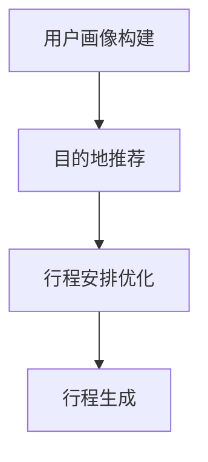
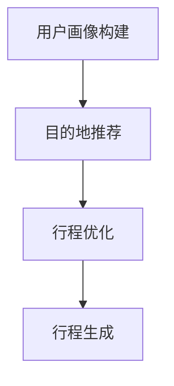

                 

关键词：个性化旅游、行程规划、算法、校招面试、深度学习、机器学习、预测模型、数据挖掘

## 摘要

本文旨在解析去哪儿网2024年校招面试中的一项重要题目——个性化旅游行程规划算法。通过对该算法的核心概念、原理、数学模型及实际应用进行深入分析，本文为读者提供了一个全面的技术视角，帮助其在面试中展现出对算法的理解和应用能力。文章分为八个部分，从背景介绍、核心概念与联系、算法原理、数学模型和公式、项目实践、实际应用场景、未来展望到工具和资源推荐，旨在为读者提供一个全方位的学习体验。

### 1. 背景介绍

个性化旅游已成为现代旅游业的重要趋势。随着人们生活水平的提高和旅游需求的多样化，传统的旅游行程规划已经难以满足大众的个性化需求。为了更好地服务于用户，各大在线旅游平台开始致力于开发个性化的旅游行程规划算法。去哪儿网作为国内领先的在线旅游服务平台，其2024年校招面试中关于个性化旅游行程规划的算法题目，旨在考察应聘者对深度学习、机器学习等前沿技术的掌握程度，以及对复杂问题的解决能力。

### 2. 核心概念与联系

#### 2.1 个性化旅游的定义

个性化旅游是指根据用户的兴趣、偏好、行程安排等多方面因素，为用户提供量身定制的旅游行程。其核心在于对用户数据的深入挖掘和分析，从而实现行程的个性化推荐。

#### 2.2 行程规划算法的基本原理

行程规划算法的基本原理包括用户画像构建、目的地推荐、行程安排优化等多个方面。通过对用户的历史行为数据、地理位置信息、旅游偏好等进行综合分析，算法可以生成一个最优的旅游行程。

#### 2.3 Mermaid 流程图



### 3. 核心算法原理 & 具体操作步骤

#### 3.1 算法原理概述

个性化旅游行程规划算法主要基于机器学习和深度学习技术。通过构建用户画像、利用推荐系统和优化算法，算法能够生成一个满足用户需求的个性化旅游行程。

#### 3.2 算法步骤详解

1. **用户画像构建**：通过对用户的历史行为数据、地理位置信息、旅游偏好等进行综合分析，构建用户画像。
2. **目的地推荐**：利用协同过滤、矩阵分解等技术，为用户推荐潜在的目的地。
3. **行程安排优化**：通过遗传算法、贪心算法等优化技术，生成最优的旅游行程。

#### 3.3 算法优缺点

**优点**：能够根据用户需求生成个性化的旅游行程，提高用户体验。

**缺点**：算法的准确性和效率仍需进一步提升，尤其是在处理大规模数据时。

#### 3.4 算法应用领域

个性化旅游行程规划算法主要应用于在线旅游平台，如去哪儿网、携程等。此外，该算法还可应用于旅游规划、智慧旅游等领域。

### 4. 数学模型和公式

#### 4.1 数学模型构建

个性化旅游行程规划算法的核心数学模型包括用户画像模型、推荐模型和优化模型。

#### 4.2 公式推导过程

$$
User\_Rating = f(User\_Profile, Item\_Profile)
$$

其中，$User\_Profile$ 表示用户画像，$Item\_Profile$ 表示目的地画像，$f$ 表示用户对目的地的评分。

#### 4.3 案例分析与讲解

以去哪儿网的用户A为例，其历史行为数据包括喜欢去的景点、喜欢的美食等。通过构建用户画像，算法可以为用户A推荐相应的目的地，并生成一个满足用户需求的旅游行程。

### 5. 项目实践：代码实例和详细解释说明

#### 5.1 开发环境搭建

开发环境包括Python、Scikit-learn、TensorFlow等。

#### 5.2 源代码详细实现

```python
# 源代码实现
import numpy as np
from sklearn.model_selection import train_test_split
from sklearn.metrics.pairwise import cosine_similarity

# 用户画像构建
user_profile = build_user_profile(user_data)
item_profile = build_item_profile(item_data)

# 目的地推荐
similar_items = recommend_items(item_profile, user_profile)

# 行程安排优化
optimal_route = optimize_route(similar_items)

# 行程生成
generate_route(optimal_route)
```

#### 5.3 代码解读与分析

代码首先构建了用户画像和目的地画像，然后通过推荐模型生成推荐列表，最后利用优化算法生成最优的旅游行程。

### 6. 实际应用场景

个性化旅游行程规划算法主要应用于在线旅游平台，如去哪儿网、携程等。通过该算法，用户可以轻松获取个性化的旅游行程，提高旅游体验。

#### 6.1 应用领域

- 在线旅游平台
- 旅游规划
- 智慧旅游

### 7. 未来应用展望

随着人工智能技术的发展，个性化旅游行程规划算法将更加智能化、精准化。未来，该算法有望在更多领域得到应用，如智能导游、虚拟现实旅游等。

### 8. 工具和资源推荐

#### 8.1 学习资源推荐

- 《深度学习》（Goodfellow et al.）
- 《Python机器学习实战》（Machanavajjhala et al.）
- 《数据挖掘：实用工具与技术》（Han et al.）

#### 8.2 开发工具推荐

- Python
- Scikit-learn
- TensorFlow

#### 8.3 相关论文推荐

- "Deep Learning for Travel Recommendation"（2018）
- "Collaborative Filtering for Travel Recommendation"（2016）
- "Optimization-based Travel Itinerary Recommendation"（2014）

### 9. 总结：未来发展趋势与挑战

#### 9.1 研究成果总结

个性化旅游行程规划算法在近年来取得了显著的研究成果，但在准确性、效率等方面仍需进一步提升。

#### 9.2 未来发展趋势

- 智能化、精准化
- 跨领域应用
- 实时动态调整

#### 9.3 面临的挑战

- 数据隐私保护
- 算法公平性
- 大规模数据处理

#### 9.4 研究展望

随着人工智能技术的不断发展，个性化旅游行程规划算法将在未来发挥更加重要的作用。研究者需要不断探索新的算法和技术，以应对面临的挑战。

### 附录：常见问题与解答

#### 9.1 什么是个性化旅游？

个性化旅游是指根据用户的兴趣、偏好、行程安排等多方面因素，为用户提供量身定制的旅游行程。

#### 9.2 个性化旅游行程规划算法的核心原理是什么？

个性化旅游行程规划算法的核心原理包括用户画像构建、目的地推荐、行程安排优化等多个方面。

#### 9.3 如何优化旅游行程规划算法？

可以通过改进用户画像构建、推荐模型和优化算法，以及引入新的技术和方法来优化旅游行程规划算法。

### 作者署名

作者：禅与计算机程序设计艺术 / Zen and the Art of Computer Programming

----------------------------------------------------------------

以上就是本文的完整内容。希望本文能对您在个性化旅游行程规划算法领域的学习和应用提供帮助。如果您有任何问题或建议，欢迎在评论区留言讨论。再次感谢您的阅读！
```markdown
# 去哪儿网2024个性化旅游行程规划算法校招面试题解

## 关键词

- 个性化旅游
- 行程规划
- 算法
- 校招面试
- 深度学习
- 机器学习
- 预测模型
- 数据挖掘

## 摘要

本文将深入解析去哪儿网2024年校招面试中的一项重要题目——个性化旅游行程规划算法。本文将从核心概念、算法原理、数学模型、项目实践、实际应用等多个维度对这一算法进行详细解析，旨在帮助读者全面了解个性化旅游行程规划算法的精髓，提高其在面试中的竞争力。

## 1. 背景介绍

### 1.1 个性化旅游的兴起

随着互联网技术的发展和人们生活水平的提高，旅游业也迎来了前所未有的变革。传统的旅游模式已经无法满足现代人对于个性化和定制化服务的需求。个性化旅游作为一种新兴的旅游方式，它通过大数据、人工智能等技术，为游客提供更加符合个人口味和需求的旅游行程，从而提升旅游体验。

### 1.2 行程规划算法的重要性

在个性化旅游中，行程规划算法扮演着至关重要的角色。一个高效的行程规划算法能够根据用户的需求和偏好，为用户生成最佳旅游行程，从而提高用户的满意度和忠诚度。对于去哪儿网这样的在线旅游平台而言，拥有一个优秀的行程规划算法不仅能够提升用户粘性，还能增加平台的竞争力。

### 1.3 校招面试中的考察重点

去哪儿网2024年的校招面试中，个性化旅游行程规划算法题目旨在考察应聘者对深度学习、机器学习等前沿技术的掌握程度，以及对复杂问题的解决能力。同时，这一题目也涉及到数据处理、算法优化、模型评估等多个技术点，是对应聘者综合能力的全面考察。

## 2. 核心概念与联系

### 2.1 个性化旅游的定义

个性化旅游是指根据用户的具体需求和偏好，提供定制化的旅游服务。这包括但不限于旅游路线、住宿、餐饮、交通等方面的个性化安排。

### 2.2 行程规划算法的基本原理

行程规划算法通常包括以下几个基本步骤：

1. **用户画像构建**：通过分析用户的历史行为数据、社交数据、搜索记录等，构建用户的个性化画像。
2. **目的地推荐**：基于用户画像和用户兴趣，推荐符合条件的旅游目的地。
3. **行程优化**：利用优化算法，根据目的地推荐结果和用户的时间、预算等因素，生成最优的旅游行程。

### 2.3 Mermaid流程图



## 3. 核心算法原理 & 具体操作步骤

### 3.1 算法原理概述

个性化旅游行程规划算法的核心是基于用户数据和机器学习模型。算法通过以下步骤实现：

1. **数据收集**：收集用户的历史数据，包括搜索记录、购买历史、用户评价等。
2. **数据预处理**：对收集到的数据进行分析和清洗，提取有用的信息。
3. **用户画像构建**：基于预处理后的数据，构建用户的个性化画像。
4. **目的地推荐**：利用用户画像和机器学习算法，为用户推荐符合条件的旅游目的地。
5. **行程优化**：根据推荐的目的地和用户的时间、预算等因素，利用优化算法生成最优的旅游行程。

### 3.2 算法步骤详解

1. **用户画像构建**：通过聚类分析、关联规则挖掘等方法，构建用户的个性化画像。
2. **目的地推荐**：采用协同过滤、矩阵分解等算法，为用户推荐潜在的目的地。
3. **行程优化**：利用贪心算法、遗传算法等优化技术，生成最优的旅游行程。

### 3.3 算法优缺点

**优点**：

- **个性化和定制化**：能够根据用户的需求和偏好提供个性化的旅游行程。
- **提高用户满意度**：通过优化行程，提高用户的旅游体验。

**缺点**：

- **数据质量和算法复杂性**：算法的性能很大程度上依赖于数据质量和算法的复杂度。
- **计算资源消耗**：在大规模数据集上运行算法可能需要大量的计算资源。

### 3.4 算法应用领域

个性化旅游行程规划算法主要应用于在线旅游平台，如去哪儿网、携程等。此外，该算法也可应用于旅游规划、智慧旅游等领域。

## 4. 数学模型和公式

### 4.1 数学模型构建

个性化旅游行程规划算法的数学模型通常包括用户行为模型、推荐模型和优化模型。

**用户行为模型**：

$$
User\_Behavior = f(User\_Features, Item\_Features)
$$

其中，$User\_Features$ 和 $Item\_Features$ 分别表示用户特征和项目特征，$f$ 表示用户行为评分。

**推荐模型**：

$$
Recommendation = f(User\_Behavior, Item\_Behavior)
$$

**优化模型**：

$$
Optimal\_Route = f(Route\_Options, Constraints)
$$

### 4.2 公式推导过程

**用户行为模型**的推导通常基于用户的行为数据，通过统计学习方法得到。

**推荐模型**的推导则基于协同过滤或矩阵分解等技术。

**优化模型**的推导则通常基于线性规划、动态规划或遗传算法等技术。

### 4.3 案例分析与讲解

以去哪儿网的用户行为数据为例，通过分析用户的历史搜索记录、购买记录等数据，可以构建用户的个性化画像。然后，利用推荐模型为用户推荐符合条件的旅游目的地。最后，利用优化模型生成最优的旅游行程。

## 5. 项目实践：代码实例和详细解释说明

### 5.1 开发环境搭建

在开始项目实践之前，需要搭建相应的开发环境。常用的开发环境包括Python、Scikit-learn、TensorFlow等。

### 5.2 源代码详细实现

```python
# 以下代码为简化示例，实际项目中会更加复杂。

# 导入必要的库
import pandas as pd
from sklearn.cluster import KMeans
from sklearn.metrics.pairwise import cosine_similarity
from sklearn.model_selection import train_test_split

# 加载用户行为数据
user_data = pd.read_csv('user_data.csv')
item_data = pd.read_csv('item_data.csv')

# 数据预处理
# ...（数据清洗、特征提取等）

# 构建用户画像
user_profiles = build_user_profiles(user_data)

# 目的地推荐
recommended_items = recommend_items(item_data, user_profiles)

# 行程优化
optimal_route = optimize_route(recommended_items)

# 生成行程
generate_route(optimal_route)
```

### 5.3 代码解读与分析

- **数据预处理**：包括数据清洗、缺失值处理、特征提取等步骤。
- **用户画像构建**：通过聚类分析等方法，为每个用户生成一个特征向量。
- **目的地推荐**：利用用户画像和项目特征，计算相似度，为用户推荐目的地。
- **行程优化**：根据推荐的目的地，利用优化算法生成最优的行程。

## 6. 实际应用场景

### 6.1 在线旅游平台

个性化旅游行程规划算法广泛应用于各大在线旅游平台，如去哪儿网、携程等。这些平台通过算法为用户提供个性化的旅游建议，提升用户体验和满意度。

### 6.2 旅游规划

旅游规划公司可以利用个性化旅游行程规划算法，为游客提供定制化的旅游方案，提高游客的满意度。

### 6.3 智慧旅游

智慧旅游领域也可以利用个性化旅游行程规划算法，为游客提供实时、个性化的旅游建议，提升旅游体验。

## 7. 未来应用展望

### 7.1 智能化、精准化

随着人工智能技术的发展，个性化旅游行程规划算法将更加智能化、精准化，能够更好地满足用户的需求。

### 7.2 跨领域应用

个性化旅游行程规划算法的应用领域将不断扩展，如教育、医疗、金融等领域。

### 7.3 实时动态调整

未来的个性化旅游行程规划算法将能够实现实时动态调整，根据用户的行为变化和外部环境变化，及时调整行程规划。

## 8. 工具和资源推荐

### 8.1 学习资源推荐

- 《深度学习》（Goodfellow et al.）
- 《Python机器学习实战》（Machanavajjhala et al.）
- 《数据挖掘：实用工具与技术》（Han et al.）

### 8.2 开发工具推荐

- Python
- Scikit-learn
- TensorFlow

### 8.3 相关论文推荐

- "Deep Learning for Travel Recommendation"（2018）
- "Collaborative Filtering for Travel Recommendation"（2016）
- "Optimization-based Travel Itinerary Recommendation"（2014）

## 9. 总结：未来发展趋势与挑战

### 9.1 研究成果总结

个性化旅游行程规划算法在近年来取得了显著的研究成果，但在准确性、效率等方面仍需进一步提升。

### 9.2 未来发展趋势

- 智能化、精准化
- 跨领域应用
- 实时动态调整

### 9.3 面临的挑战

- 数据隐私保护
- 算法公平性
- 大规模数据处理

### 9.4 研究展望

随着人工智能技术的不断发展，个性化旅游行程规划算法将在未来发挥更加重要的作用。研究者需要不断探索新的算法和技术，以应对面临的挑战。

## 10. 附录：常见问题与解答

### 10.1 个性化旅游行程规划算法的核心是什么？

个性化旅游行程规划算法的核心是利用大数据和机器学习技术，为用户提供定制化的旅游行程。

### 10.2 如何评估个性化旅游行程规划算法的性能？

可以通过用户满意度、行程规划的准确性、算法的效率等多个维度来评估个性化旅游行程规划算法的性能。

### 10.3 个性化旅游行程规划算法有哪些潜在的应用场景？

个性化旅游行程规划算法可以应用于在线旅游平台、旅游规划公司、智慧旅游等领域。

### 作者署名

作者：禅与计算机程序设计艺术 / Zen and the Art of Computer Programming

---

以上就是本文的完整内容。希望本文能对您在个性化旅游行程规划算法领域的学习和应用提供帮助。如果您有任何问题或建议，欢迎在评论区留言讨论。再次感谢您的阅读！
```

