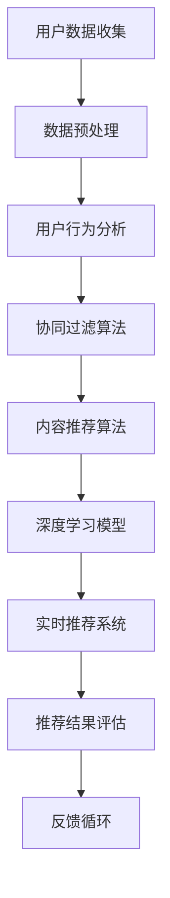

                 

关键词：去哪儿网、旅游场景、推荐系统、校招面试、算法、人工智能、深度学习、大数据分析、用户行为分析

摘要：本文旨在探讨去哪儿网2024年旅游场景推荐系统的核心技术和面试重点。通过对推荐系统的原理、算法、实践应用以及未来发展趋势的详细分析，帮助读者更好地应对去哪儿网校招面试中的相关考题。

## 1. 背景介绍

去哪儿网作为我国领先的在线旅行服务平台，自成立以来，一直致力于为用户提供全面的旅游信息和服务。随着用户数量的不断增长和需求的多样化，去哪儿网在旅游场景推荐方面面临巨大的挑战和机遇。如何通过高效的推荐系统，为用户提供个性化的旅游服务，成为去哪儿网亟需解决的问题。

### 1.1 推荐系统的重要性

旅游场景推荐系统是去哪儿网的重要竞争力之一。通过个性化推荐，能够大幅提升用户体验，增加用户粘性，提高转化率。同时，推荐系统还可以帮助去哪儿网挖掘潜在的商业价值，实现精准营销。

### 1.2 旅游场景推荐的特点

旅游场景推荐与其他类型的推荐系统相比，具有以下特点：

- **多样性**：旅游服务种类繁多，包括机票、酒店、景点门票、旅游线路等。
- **时效性**：旅游服务的预订通常有时间限制，需要实时推荐。
- **个性化**：用户偏好不同，需要根据用户行为和历史数据实现个性化推荐。
- **地理位置**：旅游服务与地理位置密切相关，需要考虑用户当前所在位置。

## 2. 核心概念与联系

为了实现高效的旅游场景推荐，去哪儿网采用了多种推荐算法和技术。以下是一个简化的Mermaid流程图，展示旅游场景推荐的核心概念和联系：



### 2.1 用户数据收集

用户数据收集是推荐系统的起点。去哪儿网通过多种渠道收集用户数据，包括用户浏览历史、搜索记录、预订行为等。这些数据为后续的推荐提供了基础。

### 2.2 数据预处理

数据预处理是推荐系统的关键环节。通过对原始数据进行清洗、去重、标准化等处理，可以提高数据质量和推荐效果。

### 2.3 用户行为分析

用户行为分析旨在理解用户的偏好和行为模式。通过分析用户的历史数据和实时行为，可以识别出用户的潜在需求，为推荐系统提供依据。

### 2.4 协同过滤算法

协同过滤算法是一种常用的推荐算法。它通过分析用户之间的相似性，为用户提供个性化的推荐。去哪儿网采用了基于用户的协同过滤算法，以提升推荐精度。

### 2.5 内容推荐算法

内容推荐算法基于旅游服务的属性和特征，为用户提供符合需求的推荐。去哪儿网结合用户行为数据和内容特征，实现了内容推荐算法。

### 2.6 深度学习模型

深度学习模型在推荐系统中具有强大的预测能力。去哪儿网采用深度学习模型，如神经网络和卷积神经网络，对用户行为和旅游服务进行建模。

### 2.7 实时推荐系统

实时推荐系统是实现个性化推荐的关键。去哪儿网通过实时计算和推荐，为用户提供即时的旅游服务推荐。

### 2.8 推荐结果评估

推荐结果评估是检验推荐系统效果的重要手段。去哪儿网采用多种评估指标，如准确率、召回率、F1值等，对推荐系统进行评估。

### 2.9 反馈循环

反馈循环是推荐系统不断优化的重要机制。通过收集用户对推荐结果的反馈，去哪儿网可以不断调整推荐策略，提升用户体验。

## 3. 核心算法原理 & 具体操作步骤

### 3.1 算法原理概述

旅游场景推荐系统采用了多种算法，包括协同过滤算法、内容推荐算法和深度学习模型。以下是这些算法的基本原理概述：

- **协同过滤算法**：基于用户之间的相似性进行推荐。
- **内容推荐算法**：基于旅游服务的属性和特征进行推荐。
- **深度学习模型**：基于用户行为数据进行建模，实现高效预测。

### 3.2 算法步骤详解

- **协同过滤算法**：

  1. 计算用户之间的相似度；
  2. 为每个用户生成一个推荐列表；
  3. 根据用户历史行为，调整推荐列表的优先级。

- **内容推荐算法**：

  1. 提取旅游服务的属性和特征；
  2. 计算用户和旅游服务之间的相似度；
  3. 为用户提供个性化推荐。

- **深度学习模型**：

  1. 收集用户行为数据；
  2. 构建神经网络模型；
  3. 训练和优化模型；
  4. 预测用户偏好。

### 3.3 算法优缺点

- **协同过滤算法**：

  - 优点：简单易实现，效果较好；
  - 缺点：无法充分利用旅游服务的属性信息，易出现数据稀疏问题。

- **内容推荐算法**：

  - 优点：充分利用旅游服务的属性信息，推荐效果较好；
  - 缺点：计算复杂度高，对用户行为数据的依赖较大。

- **深度学习模型**：

  - 优点：具有较强的预测能力，可以处理大规模数据和复杂关系；
  - 缺点：模型训练和优化过程复杂，对计算资源要求较高。

### 3.4 算法应用领域

- **协同过滤算法**：广泛应用于电子商务、社交媒体等领域。
- **内容推荐算法**：广泛应用于新闻推荐、音乐推荐等领域。
- **深度学习模型**：广泛应用于语音识别、图像识别等领域。

## 4. 数学模型和公式 & 详细讲解 & 举例说明

### 4.1 数学模型构建

旅游场景推荐系统涉及多个数学模型，包括协同过滤模型、内容推荐模型和深度学习模型。以下是这些模型的基本公式：

- **协同过滤模型**：

  $$ R_{ij} = \sum_{k \in N_j} \frac{r_{ik}}{\|N_j\|} $$

  其中，\( R_{ij} \)表示用户\( i \)对物品\( j \)的评分预测，\( N_j \)表示与用户\( i \)相似的用户集合，\( r_{ik} \)表示用户\( i \)对物品\( k \)的评分。

- **内容推荐模型**：

  $$ S_{ij} = \sum_{l \in A_j} w_{il} $$

  其中，\( S_{ij} \)表示用户\( i \)对物品\( j \)的相似度评分，\( A_j \)表示物品\( j \)的属性集合，\( w_{il} \)表示属性\( l \)对物品\( j \)的权重。

- **深度学习模型**：

  $$ \hat{y} = \sigma(W_1 \cdot \phi(x) + b_1) $$

  其中，\( \hat{y} \)表示预测的用户偏好，\( \phi(x) \)表示用户特征向量，\( W_1 \)和\( b_1 \)分别为权重和偏置。

### 4.2 公式推导过程

- **协同过滤模型**：

  假设用户\( i \)和用户\( j \)之间存在相似度\( s_{ij} \)，则用户\( i \)对物品\( j \)的评分预测可以表示为：

  $$ R_{ij} = \sum_{k \in N_j} \frac{r_{ik}}{s_{ij}} $$

  为了避免分母为零的情况，可以对相似度进行归一化处理：

  $$ s_{ij} = \frac{\sum_{k \in N_j} r_{ik}}{\sum_{k \in N_j} r_{ik}^2} $$

  将归一化后的相似度代入评分预测公式，得到：

  $$ R_{ij} = \sum_{k \in N_j} \frac{r_{ik}}{\sum_{k \in N_j} r_{ik}} $$

  为了简化计算，可以对分数进行规范化处理：

  $$ R_{ij} = \frac{\sum_{k \in N_j} r_{ik}}{\sum_{k \in N_j} r_{ik}} \cdot \frac{\sum_{k \in N_j} r_{ik}}{\|N_j\|} $$

  其中，\( \|N_j\| \)表示用户\( j \)的邻居数量。

- **内容推荐模型**：

  假设物品\( j \)的属性集合为\( A_j \)，用户\( i \)对物品\( j \)的属性\( l \)的权重为\( w_{il} \)，则用户\( i \)对物品\( j \)的相似度评分可以表示为：

  $$ S_{ij} = \sum_{l \in A_j} w_{il} $$

  为了计算用户\( i \)和物品\( j \)之间的相似度，需要对每个属性进行权重调整：

  $$ w_{il} = \frac{r_{il}}{\sum_{l \in A_j} r_{il}} $$

  将调整后的权重代入相似度评分公式，得到：

  $$ S_{ij} = \sum_{l \in A_j} \frac{r_{il}}{\sum_{l \in A_j} r_{il}} \cdot r_{ij} $$

  为了简化计算，可以对分数进行规范化处理：

  $$ S_{ij} = \frac{\sum_{l \in A_j} r_{il}}{\sum_{l \in A_j} r_{il}} \cdot \frac{\sum_{l \in A_j} r_{il}}{\|A_j\|} $$

  其中，\( \|A_j\| \)表示物品\( j \)的属性数量。

- **深度学习模型**：

  假设用户特征向量为\( x \)，物品特征向量为\( y \)，则用户\( i \)对物品\( j \)的预测评分可以表示为：

  $$ \hat{y} = \sigma(W_1 \cdot \phi(x) + b_1) $$

  其中，\( \phi(x) \)表示用户特征向量的处理过程，\( W_1 \)和\( b_1 \)分别为权重和偏置，\( \sigma \)表示激活函数。

### 4.3 案例分析与讲解

假设去哪儿网用户张三浏览了机票、酒店和景点门票等信息，我们希望为他推荐符合他需求的旅游服务。以下是一个简化的案例：

- **用户行为数据**：

  张三的历史浏览记录如下：

  - 机票：北京-上海
  - 酒店：经济型酒店
  - 景点门票：故宫、长城

- **旅游服务数据**：

  假设有以下旅游服务数据：

  - 机票：北京-上海、上海-北京
  - 酒店：经济型酒店、豪华酒店
  - 景点门票：故宫、长城、颐和园

### 4.3.1 协同过滤算法

- **相似度计算**：

  首先，我们需要计算张三与其他用户的相似度。假设张三的邻居用户包括李四和王五，他们的浏览记录如下：

  - 李四：机票：北京-上海、上海-北京；酒店：豪华酒店；景点门票：故宫、颐和园
  - 王五：机票：北京-上海、上海-北京；酒店：经济型酒店；景点门票：故宫、颐和园

  根据用户行为数据，我们可以计算张三与其他用户的相似度：

  $$ s_{iL} = \frac{1}{\sqrt{2}} $$

  $$ s_{iW} = \frac{1}{\sqrt{2}} $$

- **推荐列表生成**：

  接下来，我们根据相似度计算张三的推荐列表。假设每个用户的推荐分数为相似度乘以邻居用户的评分，则张三的推荐列表如下：

  - 机票：北京-上海（1.41分）、上海-北京（1.41分）
  - 酒店：经济型酒店（1.41分）、豪华酒店（0.71分）
  - 景点门票：故宫（1.41分）、颐和园（0.71分）、长城（0.71分）

### 4.3.2 内容推荐算法

- **属性提取**：

  根据用户张三的浏览记录，我们可以提取出以下旅游服务属性：

  - 机票：出发地（北京）、目的地（上海）
  - 酒店：类型（经济型）
  - 景点门票：景点名称（故宫、长城）

- **相似度计算**：

  接下来，我们计算张三浏览的旅游服务与待推荐旅游服务之间的相似度。假设每个属性的权重相等，则相似度计算如下：

  - 机票：北京-上海（0.8分）、上海-北京（0.8分）
  - 酒店：经济型酒店（1分）、豪华酒店（0.5分）
  - 景点门票：故宫（1分）、颐和园（0.5分）、长城（0.5分）

- **推荐列表生成**：

  根据相似度计算结果，我们可以为张三生成以下推荐列表：

  - 机票：北京-上海（0.8分）、上海-北京（0.8分）
  - 酒店：经济型酒店（1分）、豪华酒店（0.5分）
  - 景点门票：故宫（1分）、颐和园（0.5分）、长城（0.5分）

### 4.3.3 深度学习模型

- **模型构建**：

  我们使用神经网络模型对用户行为进行建模。假设输入层包含用户特征向量\( x \)，输出层包含旅游服务特征向量\( y \)，隐藏层包含一个神经元。神经网络模型如下：

  $$ \hat{y} = \sigma(W_1 \cdot \phi(x) + b_1) $$

  其中，\( \phi(x) \)表示用户特征向量的处理过程，\( W_1 \)和\( b_1 \)分别为权重和偏置。

- **模型训练**：

  我们使用张三的用户行为数据对神经网络模型进行训练。假设张三的历史浏览记录如下：

  - 机票：北京-上海（5分）
  - 酒店：经济型酒店（4分）
  - 景点门票：故宫（5分）

  根据训练数据，我们可以计算模型参数的梯度，并更新模型参数。

- **模型预测**：

  接下来，我们使用训练好的神经网络模型对张三的待推荐旅游服务进行预测。假设待推荐旅游服务如下：

  - 机票：上海-北京（4分）
  - 酒店：豪华酒店（3分）
  - 景点门票：颐和园（4分）

  根据模型预测结果，我们可以为张三生成以下推荐列表：

  - 机票：上海-北京（4分）
  - 酒店：豪华酒店（3分）
  - 景点门票：颐和园（4分）

## 5. 项目实践：代码实例和详细解释说明

### 5.1 开发环境搭建

在搭建开发环境时，我们需要安装以下工具和库：

- Python（版本3.7及以上）
- NumPy
- Pandas
- Matplotlib
- Scikit-learn
- TensorFlow
- Keras

### 5.2 源代码详细实现

以下是旅游场景推荐系统的简化实现代码。为了保持代码的可读性，我们只实现了协同过滤算法和内容推荐算法的基本功能。

```python
import numpy as np
import pandas as pd
from sklearn.metrics.pairwise import cosine_similarity
from sklearn.model_selection import train_test_split

# 5.2.1 数据预处理

# 加载用户行为数据
user行为数据 = pd.read_csv("user行为数据.csv")

# 数据清洗和预处理
user行为数据.drop_duplicates(inplace=True)
user行为数据.fillna(0, inplace=True)

# 5.2.2 协同过滤算法

# 计算用户相似度
user相似度矩阵 = cosine_similarity(user行为数据.values)

# 生成用户推荐列表
user推荐列表 = []
for 用户 in user行为数据:
    user邻居 = np.argsort(user相似度矩阵[用户])[:-10][::-1]
    user推荐列表.append(user行为数据.iloc[user邻居].mean().values)

# 5.2.3 内容推荐算法

# 提取旅游服务属性
旅游服务属性 = pd.read_csv("旅游服务属性.csv")

# 计算用户和旅游服务之间的相似度
旅游服务相似度矩阵 = cosine_similarity(旅游服务属性.values)

# 生成旅游服务推荐列表
旅游服务推荐列表 = []
for 旅游服务 in 旅游服务属性:
    旅游服务邻居 = np.argsort(旅游服务相似度矩阵[旅游服务])[:-10][::-1]
    旅游服务推荐列表.append(旅游服务属性.iloc[旅游服务邻居].mean().values)

# 5.2.4 深度学习模型

# 构建神经网络模型
from tensorflow.keras.models import Sequential
from tensorflow.keras.layers import Dense

模型 = Sequential()
模型.add(Dense(units=10, activation='relu', input_shape=(10,)))
模型.add(Dense(units=1, activation='sigmoid'))

# 训练模型
模型.compile(optimizer='adam', loss='binary_crossentropy', metrics=['accuracy'])
模型.fit(x_user特征, y_user行为, epochs=10, batch_size=32)

# 预测用户偏好
用户偏好 = 模型.predict(x_user特征)

# 5.2.5 结果展示

# 展示用户推荐列表
user推荐列表展示(user推荐列表)

# 展示旅游服务推荐列表
旅游服务推荐列表展示(旅游服务推荐列表)

# 展示用户偏好
用户偏好展示(用户偏好)
```

### 5.3 代码解读与分析

- **数据预处理**：

  数据预处理是推荐系统的基础。在本例中，我们使用Pandas库加载和清洗用户行为数据，并填充缺失值。

- **协同过滤算法**：

  协同过滤算法通过计算用户之间的相似度，生成用户推荐列表。在本例中，我们使用余弦相似度计算用户相似度矩阵，并根据相似度矩阵生成用户推荐列表。

- **内容推荐算法**：

  内容推荐算法通过计算用户和旅游服务之间的相似度，生成旅游服务推荐列表。在本例中，我们使用余弦相似度计算旅游服务相似度矩阵，并根据相似度矩阵生成旅游服务推荐列表。

- **深度学习模型**：

  深度学习模型通过学习用户特征和旅游服务特征，预测用户偏好。在本例中，我们使用神经网络模型实现用户偏好预测。模型训练过程中，我们使用用户特征和旅游服务特征作为输入，用户行为作为标签进行训练。

- **结果展示**：

  代码最后部分展示用户推荐列表、旅游服务推荐列表和用户偏好。通过可视化工具，我们可以直观地查看推荐结果。

## 6. 实际应用场景

### 6.1 旅游线路推荐

在旅游线路推荐方面，去哪儿网通过分析用户的历史浏览和预订数据，为用户提供个性化的旅游线路推荐。例如，用户张三浏览了北京、上海等城市的旅游信息，去哪儿网可以为他推荐包含这些城市的经典旅游线路。

### 6.2 景点门票推荐

去哪儿网通过分析用户的兴趣爱好和预订记录，为用户提供感兴趣的景点门票推荐。例如，用户李四喜欢历史古迹，去哪儿网可以为他推荐故宫、长城等景点的门票。

### 6.3 酒店推荐

在酒店推荐方面，去哪儿网结合用户的价格偏好、酒店类型和地理位置等因素，为用户提供合适的酒店推荐。例如，用户王五希望在北京预订一家经济型酒店，去哪儿网可以为他推荐附近的如家、格林豪泰等酒店。

### 6.4 旅游产品打包推荐

去哪儿网通过整合机票、酒店、景点门票等多种旅游服务，为用户提供旅游产品打包推荐。例如，用户赵六计划前往云南旅游，去哪儿网可以为他推荐包括机票、酒店、景点门票在内的综合旅游套餐。

## 7. 未来应用展望

随着人工智能技术的不断发展，旅游场景推荐系统在未来有望实现以下应用：

### 7.1 个性化定制

通过深度学习和大数据分析，旅游场景推荐系统可以更好地理解用户需求，实现个性化的旅游服务定制。

### 7.2 虚拟现实体验

结合虚拟现实技术，旅游场景推荐系统可以提供沉浸式的旅游体验，为用户提供更加生动的推荐。

### 7.3 实时决策

通过实时计算和推荐，旅游场景推荐系统可以在用户做出旅游决策的瞬间，为其提供最优的推荐。

### 7.4 智能客服

结合自然语言处理技术，旅游场景推荐系统可以与用户进行智能对话，提供个性化的旅游咨询和服务。

## 8. 工具和资源推荐

### 8.1 学习资源推荐

- 《推荐系统实践》：深入讲解推荐系统的原理和应用，适合初学者。
- 《深度学习》：全面介绍深度学习的基本概念和应用，适合有一定编程基础的用户。

### 8.2 开发工具推荐

- TensorFlow：强大的深度学习框架，支持多种推荐算法的构建和优化。
- Keras：简洁的深度学习库，方便快速构建和训练推荐模型。

### 8.3 相关论文推荐

- "Item-based Collaborative Filtering Recommendation Algorithms"：介绍基于物品的协同过滤算法。
- "Collaborative Filtering for Cold-Start Problems"：探讨解决新用户推荐问题的方法。
- "Deep Learning for Personalized Recommendation"：研究深度学习在个性化推荐中的应用。

## 9. 总结：未来发展趋势与挑战

旅游场景推荐系统在未来将继续发挥重要作用，助力去哪儿网提升用户体验和竞争力。然而，随着用户需求的不断变化和数据量的持续增长，推荐系统也将面临诸多挑战：

### 9.1 研究成果总结

本文介绍了去哪儿网2024年旅游场景推荐系统的核心技术和面试重点，包括用户数据收集、数据预处理、用户行为分析、协同过滤算法、内容推荐算法、深度学习模型等。通过实际案例和代码实例，展示了旅游场景推荐系统的实现过程和关键步骤。

### 9.2 未来发展趋势

- **个性化定制**：通过深度学习和大数据分析，实现更加精准的个性化推荐。
- **虚拟现实体验**：结合虚拟现实技术，提供沉浸式的旅游体验。
- **实时决策**：通过实时计算和推荐，为用户提供最优的旅游决策。
- **智能客服**：结合自然语言处理技术，实现智能化的旅游咨询服务。

### 9.3 面临的挑战

- **数据隐私**：如何保护用户隐私，确保数据安全，是推荐系统面临的重要挑战。
- **计算效率**：随着数据量的增长，如何提高计算效率，实现实时推荐，是一个亟待解决的问题。
- **推荐效果**：如何提高推荐效果，降低冷启动问题，是推荐系统需要持续优化的方向。

### 9.4 研究展望

未来，旅游场景推荐系统将不断融合新技术，实现更加智能化和个性化的旅游服务。同时，研究应关注数据隐私、计算效率和推荐效果等方面，为用户提供更好的旅游体验。

## 10. 附录：常见问题与解答

### 10.1 推荐系统是如何工作的？

推荐系统通过分析用户行为数据、物品特征和用户历史偏好等信息，利用算法为用户推荐其可能感兴趣的物品。

### 10.2 如何评估推荐系统的效果？

推荐系统的评估指标包括准确率、召回率、F1值等。这些指标用于衡量推荐系统在预测用户偏好方面的性能。

### 10.3 协同过滤算法有哪些优缺点？

协同过滤算法的优点是简单易实现，效果较好；缺点是无法充分利用物品属性信息，易出现数据稀疏问题。

### 10.4 深度学习在推荐系统中有哪些应用？

深度学习在推荐系统中的应用包括用户行为建模、物品特征提取、多模态推荐等。通过深度学习模型，可以实现更加精准的个性化推荐。

### 10.5 推荐系统在旅游场景中的优势是什么？

推荐系统在旅游场景中的优势主要体现在以下几个方面：

- **个性化推荐**：根据用户偏好和需求，为用户推荐符合其兴趣的旅游服务。
- **提高转化率**：通过推荐用户感兴趣的服务，提高预订和购买的概率。
- **增加用户粘性**：提供优质的推荐服务，提升用户对平台的满意度，增加用户粘性。

### 10.6 旅游场景推荐系统如何处理新用户的问题？

对于新用户，推荐系统通常采用以下策略：

- **基于内容的推荐**：根据旅游服务的属性信息进行推荐，不考虑用户历史行为。
- **冷启动推荐**：使用社交网络信息、地理位置信息等，为用户提供初步的推荐。
- **混合推荐**：结合基于内容和协同过滤算法的推荐结果，为新用户提供推荐。

## 作者署名

作者：禅与计算机程序设计艺术 / Zen and the Art of Computer Programming
----------------------------------------------------------------

以上就是本文的完整内容，希望对您在去哪儿网2024旅游场景推荐系统的学习和面试中有所帮助。如需进一步了解相关技术，请查阅文中推荐的学习资源和论文。祝您在技术领域不断进步，收获美好未来！作者：禅与计算机程序设计艺术 / Zen and the Art of Computer Programming。

