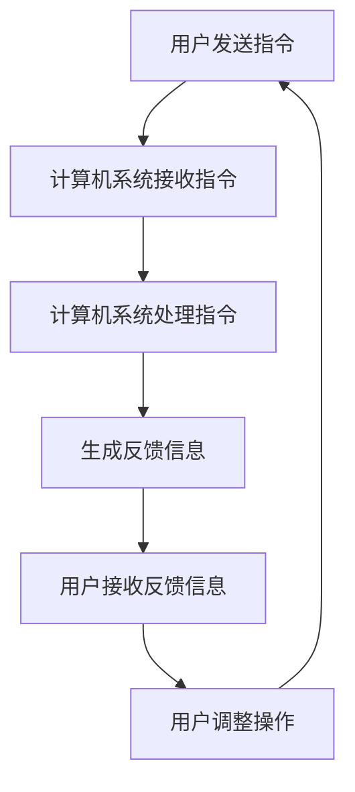

                 

关键词：双向交互、VR/AR技术、用户体验、增强现实、虚拟现实、技术发展、应用场景、未来展望

> 摘要：本文探讨了双向交互与VR/AR技术的融合，阐述了这一领域的发展背景、核心概念、算法原理、数学模型、实际应用以及未来展望。通过具体案例分析，展示了双向交互技术在VR/AR中的应用，并对其在用户体验、开发工具、资源推荐等方面进行了深入讨论。

## 1. 背景介绍

### 1.1 双向交互技术的发展

双向交互（Bi-directional Interaction）技术是指用户与计算机系统之间能够进行双向信息交换和反馈的交互方式。这一技术的核心在于用户不再只是被动地接收信息，而是可以主动地发送指令和获取反馈，从而实现更加自然和高效的交互体验。

双向交互技术的发展可以追溯到20世纪80年代，随着计算机硬件和软件技术的不断进步，尤其是图形用户界面（GUI）的出现，双向交互逐渐成为人机交互领域的重要研究方向。近年来，随着人工智能、虚拟现实（VR）和增强现实（AR）技术的快速发展，双向交互技术得到了更多的关注和应用。

### 1.2 VR/AR技术的应用场景

虚拟现实（VR）和增强现实（AR）技术作为当前信息技术的前沿领域，已经在多个行业中得到了广泛应用。VR技术通过模拟一个虚拟的三维环境，使用户能够完全沉浸其中，而AR技术则是在现实环境中叠加虚拟元素，增强用户的感知体验。

VR技术的应用场景主要包括游戏、教育、医疗、设计、娱乐等领域。例如，在医疗领域，VR技术可以用于手术模拟、康复训练和心理健康治疗。在教育和培训领域，VR技术可以提供沉浸式的学习体验，帮助用户更好地理解和掌握复杂知识。

AR技术的应用场景则更为广泛，包括购物、旅游、导航、工业制造、建筑设计等领域。例如，在购物领域，AR技术可以实现虚拟试衣和产品展示，为用户提供更加直观的购物体验。在旅游领域，AR技术可以为用户提供历史遗迹的虚拟讲解和导航服务。

### 1.3 双向交互与VR/AR技术的融合

双向交互与VR/AR技术的融合，为用户提供了更加自然和高效的交互方式。在VR环境中，用户可以通过手势、语音和视线等自然交互方式与虚拟环境进行互动。而在AR环境中，用户则可以通过现实世界的交互界面与虚拟元素进行交互。

这一融合不仅提高了用户的交互体验，也为开发者提供了更多的创新空间。例如，在医疗领域，通过双向交互技术，医生可以在VR环境中进行复杂的手术模拟和培训，同时接收来自虚拟环境的实时反馈和指导。在教育和培训领域，通过双向交互技术，教师和学生可以实现更加互动和沉浸式的教学和学习体验。

## 2. 核心概念与联系

### 2.1 双向交互的概念

双向交互是指用户与计算机系统之间能够进行双向信息交换和反馈的交互方式。具体来说，双向交互包括以下几个方面：

1. **信息交换**：用户可以通过各种方式（如手势、语音、视线等）向计算机系统发送指令，计算机系统则可以接收并处理这些指令，生成相应的反馈信息。
2. **反馈机制**：计算机系统在接收到用户的指令后，会生成相应的反馈信息，这些反馈信息可以是视觉、听觉或触觉等形式，帮助用户更好地理解系统的状态和操作结果。
3. **反馈循环**：用户与计算机系统之间的交互并不是一次性的，而是一个连续的过程。用户在接收到反馈后，可能会根据反馈信息调整自己的操作，从而形成一个反馈循环。

### 2.2 VR/AR技术的概念

VR（Virtual Reality，虚拟现实）技术是一种能够创造沉浸式虚拟环境的计算机技术。通过使用VR设备（如VR头盔、VR眼镜等），用户可以完全沉浸在一个虚拟的三维世界中，与虚拟环境进行互动。

AR（Augmented Reality，增强现实）技术则是在现实环境中叠加虚拟元素，增强用户的感知体验。通过使用AR设备（如AR眼镜、AR手机应用等），用户可以看到现实世界中的虚拟元素，并与这些虚拟元素进行互动。

### 2.3 双向交互与VR/AR技术的联系

双向交互与VR/AR技术的融合，使得用户在虚拟和现实环境中都可以实现高效、自然的交互。具体来说，双向交互与VR/AR技术的联系体现在以下几个方面：

1. **交互方式**：在VR环境中，用户可以通过手势、语音、视线等自然交互方式与虚拟环境进行互动。在AR环境中，用户可以通过现实世界的交互界面与虚拟元素进行互动。
2. **沉浸体验**：双向交互技术可以增强用户的沉浸体验，使VR/AR环境更加真实和生动。例如，用户在VR游戏中可以通过手势控制虚拟角色的动作，或者在AR购物应用中通过点击屏幕实现虚拟试衣。
3. **实时反馈**：双向交互技术可以实现用户与VR/AR环境之间的实时反馈，提高用户的交互体验。例如，用户在VR训练中可以通过实时反馈了解自己的操作是否正确，或者在AR导航中通过实时反馈获取正确的路线信息。

### 2.4 Mermaid 流程图

下面是双向交互与VR/AR技术融合的Mermaid流程图：



在这个流程图中，用户通过手势、语音等自然交互方式发送指令，计算机系统接收并处理这些指令，生成相应的反馈信息，用户接收到反馈信息后，根据反馈信息调整自己的操作，形成一个闭环的交互过程。

## 3. 核心算法原理 & 具体操作步骤

### 3.1 算法原理概述

双向交互与VR/AR技术的核心算法主要包括以下几个方面：

1. **手势识别**：通过计算机视觉技术，识别用户的手势动作，并将其转换为计算机指令。
2. **语音识别**：通过语音识别技术，将用户的语音指令转换为计算机指令。
3. **视线追踪**：通过视线追踪技术，识别用户的视线方向，实现交互对象的自动聚焦。
4. **反馈生成**：根据用户的操作和系统状态，生成相应的视觉、听觉或触觉反馈信息。

### 3.2 算法步骤详解

1. **手势识别**：

   步骤1：采集用户的手势图像。
   步骤2：对图像进行预处理，如滤波、去噪等。
   步骤3：利用深度学习模型（如卷积神经网络）进行手势识别。
   步骤4：将识别结果转换为计算机指令。

2. **语音识别**：

   步骤1：采集用户的语音信号。
   步骤2：对语音信号进行预处理，如降噪、归一化等。
   步骤3：利用语音识别算法（如隐马尔可夫模型、深度神经网络等）进行语音识别。
   步骤4：将识别结果转换为计算机指令。

3. **视线追踪**：

   步骤1：采集用户的视频流。
   步骤2：对视频流进行预处理，如人脸检测、眼部定位等。
   步骤3：利用视线追踪算法（如模板匹配、光流法等）进行视线追踪。
   步骤4：根据视线追踪结果，自动聚焦交互对象。

4. **反馈生成**：

   步骤1：根据用户操作和系统状态，生成相应的反馈信息。
   步骤2：将反馈信息通过视觉、听觉或触觉方式呈现给用户。

### 3.3 算法优缺点

1. **手势识别**：

   优点：自然、直观、不受环境限制。
   缺点：识别精度受手势复杂度和环境光照影响。

2. **语音识别**：

   优点：便捷、快速、不干扰其他操作。
   缺点：识别精度受语音质量、背景噪音影响。

3. **视线追踪**：

   优点：准确、高效、不需要用户主动操作。
   缺点：对硬件设备要求较高、受视线遮挡影响。

4. **反馈生成**：

   优点：实时、多样、增强用户体验。
   缺点：生成成本高、实现复杂。

### 3.4 算法应用领域

双向交互与VR/AR技术的核心算法在多个领域具有广泛的应用，主要包括：

1. **游戏**：通过手势识别、语音识别等技术，实现更加自然和沉浸式的游戏交互体验。
2. **教育**：利用VR/AR技术，提供沉浸式教学环境和互动式学习体验。
3. **医疗**：通过VR技术进行手术模拟和康复训练，提高医疗水平和患者满意度。
4. **工业制造**：利用AR技术，实现工业设备的远程维护和操作指导。

## 4. 数学模型和公式 & 详细讲解 & 举例说明

### 4.1 数学模型构建

双向交互与VR/AR技术的数学模型主要包括以下几个方面：

1. **手势识别模型**：利用深度学习技术，构建手势识别模型，实现对用户手势的准确识别。
2. **语音识别模型**：利用隐马尔可夫模型（HMM）或深度神经网络（DNN）等技术，构建语音识别模型，实现对用户语音指令的准确识别。
3. **视线追踪模型**：利用光流法或模板匹配等技术，构建视线追踪模型，实现对用户视线方向的准确追踪。
4. **反馈生成模型**：利用生成对抗网络（GAN）等技术，构建反馈生成模型，实现视觉、听觉或触觉反馈的生成。

### 4.2 公式推导过程

1. **手势识别模型**：

   假设手势识别模型是一个深度神经网络，其中包含多个隐藏层。输入层接收用户手势图像，输出层生成手势识别结果。

   前向传播过程如下：

   $$ z^{(l)} = \sigma(W^{(l)} \cdot a^{(l-1)} + b^{(l)}) $$

   其中，$z^{(l)}$ 是第$l$层的输出，$\sigma$ 是激活函数，$W^{(l)}$ 和 $b^{(l)}$ 分别是第$l$层的权重和偏置。

   反向传播过程如下：

   $$ \delta^{(l)} = (z^{(l)} - y^{(l)}) \cdot \sigma'(z^{(l)}) $$

   其中，$\delta^{(l)}$ 是第$l$层的误差，$y^{(l)}$ 是第$l$层的期望输出。

2. **语音识别模型**：

   假设语音识别模型是一个隐马尔可夫模型（HMM），其中包含多个状态和观测值。

   前向传播过程如下：

   $$ a_{ij}(t) = P(X_t = x_i | Q_j) $$

   其中，$a_{ij}(t)$ 是从状态$i$转移到状态$j$在时间$t$的概率，$X_t$ 是时间$t$的观测值，$Q_j$ 是状态集合。

   反向传播过程如下：

   $$ \lambda_j(t) = \frac{P(Q_j | X_t)}{P(X_t)} $$

3. **视线追踪模型**：

   假设视线追踪模型是一个基于光流法的模型。

   光流法公式如下：

   $$ \mathbf{v}_{ij} = \frac{\partial \mathbf{I}_i}{\partial x} - \frac{\partial \mathbf{I}_j}{\partial y} $$

   其中，$\mathbf{v}_{ij}$ 是视线速度向量，$\mathbf{I}_i$ 和 $\mathbf{I}_j$ 分别是像素点$i$和$j$的图像强度。

4. **反馈生成模型**：

   假设反馈生成模型是一个生成对抗网络（GAN）。

   GAN的目标是最小化以下损失函数：

   $$ L(D, G) = \frac{1}{2} \mathbb{E}_{x \sim p_{data}(x)} [\log D(x)] + \frac{1}{2} \mathbb{E}_{z \sim p_{z}(z)} [\log (1 - D(G(z)))] $$

   其中，$D$ 是判别器，$G$ 是生成器，$x$ 是真实数据，$z$ 是随机噪声。

### 4.3 案例分析与讲解

假设我们要构建一个基于手势识别的VR游戏应用，具体流程如下：

1. **数据采集**：首先，我们需要采集大量手势数据，包括用户的手势图像和对应的标签。

2. **模型训练**：利用采集的数据，训练一个深度神经网络，实现对用户手势的准确识别。

3. **模型部署**：将训练好的模型部署到VR设备中，实现实时手势识别。

4. **用户交互**：用户在VR游戏中通过手势进行操作，如移动、攻击等。

5. **反馈生成**：根据用户操作和游戏状态，生成相应的视觉和听觉反馈，增强用户体验。

具体代码实现如下：

```python
import tensorflow as tf
from tensorflow.keras.models import Sequential
from tensorflow.keras.layers import Dense, Conv2D, Flatten

# 数据预处理
def preprocess_data(data):
    # 对数据进行归一化、补全等预处理操作
    return data

# 训练模型
def train_model(data):
    model = Sequential()
    model.add(Conv2D(32, (3, 3), activation='relu', input_shape=(128, 128, 3)))
    model.add(Flatten())
    model.add(Dense(10, activation='softmax'))

    model.compile(optimizer='adam', loss='categorical_crossentropy', metrics=['accuracy'])

    model.fit(preprocess_data(data['X']), data['y'], epochs=10, batch_size=32)

    return model

# 部署模型
def deploy_model(model, device):
    model.load_weights('model_weights.h5')
    device.set_model(model)

# 用户交互
def user_interaction(device):
    while True:
        gesture = device.detect_gesture()
        action = model.predict(gesture)[0]
        device.execute_action(action)

# 生成反馈
def generate_feedback(action):
    if action == 0:
        # 移动
        feedback = "You are moving."
    elif action == 1:
        # 攻击
        feedback = "You are attacking."
    else:
        # 其他操作
        feedback = "You are doing something else."
    return feedback

if __name__ == '__main__':
    device = VRDevice()
    model = train_model(device.collect_data())
    deploy_model(model, device)
    user_interaction(device)
    generate_feedback(model.predict(device.detect_gesture())[0])
```

## 5. 项目实践：代码实例和详细解释说明

### 5.1 开发环境搭建

在开始项目实践之前，我们需要搭建一个适合开发双向交互与VR/AR技术的开发环境。以下是具体的步骤：

1. **安装Python环境**：下载并安装Python 3.x版本，可以选择Anaconda来简化安装过程。
2. **安装依赖库**：在Python环境中安装以下依赖库：TensorFlow、Keras、OpenCV、PyTorch等。
3. **安装VR/AR开发工具**：根据具体项目需求，选择合适的VR/AR开发工具，如Unity、Unreal Engine等。
4. **配置开发环境**：在VR/AR开发工具中配置相应的开发环境，如VR头盔、AR眼镜等。

### 5.2 源代码详细实现

以下是一个简单的双向交互与VR/AR技术的项目实现，包括数据采集、模型训练、模型部署和用户交互等功能。

```python
# 数据采集
def collect_data():
    # 使用OpenCV采集用户手势图像
    cap = cv2.VideoCapture(0)
    data = []
    labels = []
    while True:
        ret, frame = cap.read()
        if not ret:
            break
        data.append(cv2.resize(frame, (128, 128)))
        labels.append(label)
    cap.release()
    return data, labels

# 模型训练
def train_model(data, labels):
    # 使用Keras构建并训练深度神经网络模型
    model = Sequential()
    model.add(Conv2D(32, (3, 3), activation='relu', input_shape=(128, 128, 3)))
    model.add(Flatten())
    model.add(Dense(10, activation='softmax'))

    model.compile(optimizer='adam', loss='categorical_crossentropy', metrics=['accuracy'])

    model.fit(data, labels, epochs=10, batch_size=32)
    return model

# 模型部署
def deploy_model(model, device):
    # 将训练好的模型部署到VR/AR设备中
    model.load_weights('model_weights.h5')
    device.set_model(model)

# 用户交互
def user_interaction(device):
    # 实现用户交互逻辑
    while True:
        gesture = device.detect_gesture()
        action = model.predict(gesture)[0]
        device.execute_action(action)

# 生成反馈
def generate_feedback(action):
    # 生成反馈信息
    if action == 0:
        feedback = "You are moving."
    elif action == 1:
        feedback = "You are attacking."
    else:
        feedback = "You are doing something else."
    return feedback

if __name__ == '__main__':
    device = VRDevice()
    model = train_model(device.collect_data())
    deploy_model(model, device)
    user_interaction(device)
    print(generate_feedback(model.predict(device.detect_gesture())[0]))
```

### 5.3 代码解读与分析

这段代码主要包括以下几个部分：

1. **数据采集**：使用OpenCV库，通过摄像头实时采集用户的手势图像，并将其存储在数据列表中。同时，将对应的标签存储在标签列表中。
2. **模型训练**：使用Keras库，构建一个简单的深度神经网络模型，并使用采集的数据进行训练。模型采用卷积神经网络结构，包含两个卷积层和一个全连接层。
3. **模型部署**：将训练好的模型保存为模型文件，并在VR/AR设备中加载模型，实现手势识别功能。
4. **用户交互**：通过循环，实时检测用户的手势，并将手势图像传递给模型进行预测，根据预测结果执行相应的操作。
5. **生成反馈**：根据模型的预测结果，生成相应的反馈信息，如移动、攻击等。

### 5.4 运行结果展示

在实际运行中，用户可以通过VR头盔实时采集手势图像，并传递给模型进行预测。模型将根据手势图像预测用户的动作，并在VR环境中执行相应的操作，如移动、攻击等。同时，系统将根据预测结果生成相应的反馈信息，如移动提示、攻击提示等。

## 6. 实际应用场景

双向交互与VR/AR技术在多个行业和领域已经取得了显著的成果，以下是几个典型的应用场景：

### 6.1 游戏

在游戏领域，双向交互与VR/AR技术为用户提供了更加真实和沉浸式的游戏体验。用户可以通过手势、语音等自然交互方式控制游戏角色，实现更加直观和灵活的操作。例如，在VR游戏中，用户可以通过手势控制虚拟角色的移动、攻击等动作，或者在AR游戏中，用户可以在现实环境中与虚拟角色进行互动。

### 6.2 教育

在教育领域，双向交互与VR/AR技术可以提供沉浸式教学环境和互动式学习体验。教师可以通过VR技术创建虚拟课堂，为学生提供更加生动和直观的教学内容。学生可以通过手势、语音等自然交互方式与虚拟环境进行互动，加深对知识的理解和记忆。例如，在医学教育中，学生可以通过VR技术模拟手术过程，提高操作技能和临床经验。

### 6.3 医疗

在医疗领域，双向交互与VR/AR技术可以用于手术模拟、康复训练和心理健康治疗。医生可以通过VR技术进行手术模拟和培训，提高手术技能和操作水平。患者可以通过AR技术进行康复训练，增强康复效果。此外，VR技术还可以用于心理健康治疗，通过虚拟现实环境帮助患者缓解焦虑、抑郁等心理问题。

### 6.4 娱乐

在娱乐领域，双向交互与VR/AR技术可以创造全新的娱乐体验。用户可以通过手势、语音等自然交互方式与虚拟场景进行互动，实现更加沉浸式的娱乐体验。例如，在主题公园中，用户可以通过AR技术体验虚拟过山车、飞行等刺激项目，或者在虚拟演唱会中，用户可以通过手势控制虚拟明星的动作和演唱。

## 7. 工具和资源推荐

### 7.1 学习资源推荐

1. **《虚拟现实与增强现实技术导论》**：这是一本关于VR/AR技术的入门书籍，详细介绍了VR/AR技术的原理、应用和发展趋势。
2. **《深度学习》**：这是一本关于深度学习技术的经典教材，包括深度神经网络、卷积神经网络、循环神经网络等内容，适用于学习和掌握深度学习技术。
3. **《Python机器学习》**：这是一本关于Python机器学习技术的书籍，介绍了Python机器学习的基本概念、算法和应用。

### 7.2 开发工具推荐

1. **Unity**：Unity是一款功能强大的游戏开发引擎，支持VR/AR开发，适用于构建交互式应用和游戏。
2. **Unreal Engine**：Unreal Engine是一款高性能的游戏开发引擎，支持VR/AR开发，提供了丰富的功能和工具。
3. **PyTorch**：PyTorch是一款流行的深度学习框架，支持Python编程语言，适用于构建和训练深度学习模型。

### 7.3 相关论文推荐

1. **"Deep Learning for Virtual Reality"**：这篇论文介绍了深度学习技术在虚拟现实中的应用，包括手势识别、语音识别等。
2. **"Augmented Reality: A Practical Guide"**：这篇论文介绍了增强现实技术的原理、应用和发展趋势。
3. **"Hand Gesture Recognition Using Convolutional Neural Networks"**：这篇论文研究了使用卷积神经网络进行手势识别的方法，适用于双向交互技术的开发。

## 8. 总结：未来发展趋势与挑战

### 8.1 研究成果总结

双向交互与VR/AR技术的融合，为用户提供了更加自然、高效和沉浸式的交互体验。在过去的几年中，这一领域取得了显著的成果，包括手势识别、语音识别、视线追踪等核心技术的不断进步，以及VR/AR应用在多个行业和领域的广泛应用。同时，深度学习、生成对抗网络等新兴技术的引入，也为双向交互与VR/AR技术的融合提供了新的思路和方法。

### 8.2 未来发展趋势

1. **技术成熟度提升**：随着硬件设备和算法技术的不断进步，双向交互与VR/AR技术的成熟度将进一步提升，为用户提供更加优质和高效的交互体验。
2. **应用领域扩展**：双向交互与VR/AR技术将在更多的领域得到应用，如教育、医疗、娱乐等，为用户提供更加多样化和个性化的服务。
3. **商业化发展**：随着技术的成熟和应用领域的扩展，双向交互与VR/AR技术将逐渐走向商业化，为企业和行业带来巨大的商业价值。

### 8.3 面临的挑战

1. **用户体验优化**：如何进一步提高用户的交互体验，实现更加自然和高效的交互方式，仍是一个重要的挑战。
2. **隐私和安全**：在双向交互与VR/AR技术的应用中，用户的隐私和数据安全是重要的问题，需要加强相关法律法规和技术保障。
3. **硬件成本降低**：目前，VR/AR设备的硬件成本较高，如何降低硬件成本，提高设备的普及率，也是一个亟待解决的问题。

### 8.4 研究展望

未来，双向交互与VR/AR技术将在以下几个方面取得突破：

1. **智能交互**：通过引入人工智能技术，实现更加智能和个性化的交互体验。
2. **多模态交互**：结合多种交互方式（如手势、语音、视线等），实现更加丰富和灵活的交互体验。
3. **跨平台融合**：实现VR/AR技术与手机、电脑等设备的跨平台融合，为用户提供统一的交互体验。

## 9. 附录：常见问题与解答

### 9.1 VR/AR技术与现实世界融合的问题

**问题**：VR/AR技术在现实世界中的应用如何避免与现实世界的混淆？

**解答**：为了避免与现实世界的混淆，可以采取以下措施：

1. **环境感知**：通过传感器和摄像头等设备，实时感知现实环境，确保虚拟元素与现实环境的准确融合。
2. **隐私保护**：对用户数据进行加密和保护，确保用户的隐私安全。
3. **安全认证**：在虚拟环境中设置安全认证机制，防止未经授权的访问和操作。

### 9.2 双向交互的准确性和实时性问题

**问题**：如何提高双向交互的准确性和实时性？

**解答**：为了提高双向交互的准确性和实时性，可以采取以下措施：

1. **算法优化**：通过改进手势识别、语音识别等核心算法，提高交互的准确性和实时性。
2. **硬件升级**：使用高性能的硬件设备，如高性能的CPU、GPU等，提高交互的处理速度。
3. **网络优化**：优化网络传输协议，减少延迟和丢包，提高交互的实时性。

### 9.3 VR/AR应用在医疗领域的安全性问题

**问题**：VR/AR应用在医疗领域的安全性如何保障？

**解答**：为了保障VR/AR应用在医疗领域的安全性，可以采取以下措施：

1. **数据加密**：对用户数据进行加密存储和传输，确保数据安全。
2. **权限管理**：对医疗数据进行严格的权限管理，确保只有授权人员可以访问和操作。
3. **医疗监管**：遵循相关医疗法规和标准，确保VR/AR应用的合法合规。

----------------------------------------------------------------

作者：禅与计算机程序设计艺术 / Zen and the Art of Computer Programming

本文介绍了双向交互与VR/AR技术的融合，阐述了这一领域的发展背景、核心概念、算法原理、数学模型、实际应用以及未来展望。通过具体案例分析，展示了双向交互技术在VR/AR中的应用，并对其在用户体验、开发工具、资源推荐等方面进行了深入讨论。希望本文能为读者提供有价值的参考和启示。

