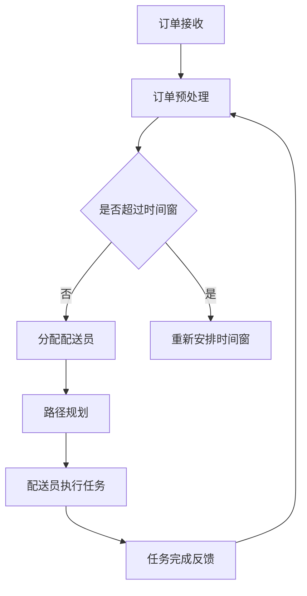

                 

关键词：叮咚买菜、校招、即时配送、调度算法、面试

> 摘要：本文将围绕叮咚买菜2024校招即时配送调度算法工程师面试的主题，详细分析面试的相关知识点和核心问题，为广大求职者提供有针对性的备考建议和策略。

## 1. 背景介绍

随着互联网和物流行业的迅速发展，即时配送已经成为现代生活的重要组成部分。叮咚买菜作为中国领先的生鲜电商平台，对于即时配送调度算法的需求愈发迫切。2024年，叮咚买菜将面向全国范围内招聘即时配送调度算法工程师，为公司的业务发展和用户体验提供强有力的技术支持。本文将结合叮咚买菜的招聘要求和面试特点，为即将参加面试的求职者提供全面的备考指南。

### 1.1 叮咚买菜简介

叮咚买菜成立于2017年，是一家专注于生鲜电商的科技公司。公司依托强大的供应链和物流体系，为用户提供新鲜、便捷的生鲜购物体验。截至2023年，叮咚买菜已在全国范围内开设数百家线下门店，用户规模超过5000万。

### 1.2 即时配送调度算法工程师职责

即时配送调度算法工程师在叮咚买菜主要负责以下工作：

1. **设计并实现高效的配送调度算法**：根据订单量、用户分布、配送员数量等数据，设计出高效的配送调度算法，以确保订单的及时送达。
2. **优化物流路径**：结合地图数据、交通状况等，优化配送路径，降低配送时间和成本。
3. **提升配送效率**：通过数据分析和算法优化，提高配送效率，降低配送员的工作强度。
4. **开发智能调度系统**：利用人工智能、大数据等技术，开发智能化的调度系统，提升整体配送调度能力。

### 1.3 面试要求

叮咚买菜对于即时配送调度算法工程师的招聘要求较高，主要考察以下几个方面：

1. **算法基础**：熟悉常见的算法和数据结构，如排序算法、图算法、动态规划等。
2. **编程能力**：具备扎实的编程基础，能够熟练使用至少一种编程语言（如Python、Java等）进行开发。
3. **逻辑思维**：具备良好的逻辑思维能力，能够分析并解决复杂问题。
4. **数学基础**：掌握概率论、线性代数等数学知识，能够运用数学模型解决实际问题。
5. **项目经验**：有实际的项目经验，能够结合自身经验进行算法设计和优化。

## 2. 核心概念与联系

在进行即时配送调度算法工程师的面试准备时，理解核心概念和它们之间的联系是非常重要的。以下是一些关键概念及其在调度算法中的应用。

### 2.1 调度算法

调度算法是指如何安排配送员的工作时间和路径，以确保订单的及时送达。常见的调度算法包括：

1. **最短路径算法**：如Dijkstra算法、A*算法等，用于计算两点之间的最短路径。
2. **动态调度算法**：根据实时数据动态调整配送员的任务和路径。
3. **智能调度算法**：利用人工智能技术，如机器学习、深度学习等，优化配送调度。

### 2.2 路径规划

路径规划是调度算法的核心部分，涉及如何规划配送员的行进路线。路径规划需要考虑以下因素：

1. **订单密度**：订单集中的区域需要优先配送。
2. **交通状况**：实时交通数据对路径规划有重要影响。
3. **配送员数量**：根据配送员数量合理分配订单。

### 2.3 时间窗

时间窗是指订单送达的时间范围。合理的设定时间窗可以减少用户等待时间，提高用户满意度。时间窗的设定需要考虑以下因素：

1. **订单性质**：生鲜商品需要尽快送达，时间窗设定应较短。
2. **配送员工作量**：避免配送员因时间窗过短而无法完成任务。
3. **交通状况**：交通拥堵可能导致时间窗延长。

### 2.4 数学模型

数学模型是调度算法的基础，用于描述配送调度过程中的各种关系。常见的数学模型包括：

1. **线性规划**：用于求解最优路径和最优时间分配。
2. **整数规划**：用于求解整数解，如配送员数量、时间窗等。
3. **混合整数规划**：结合线性规划和整数规划，求解更复杂的调度问题。

### 2.5 Mermaid 流程图

以下是一个简单的Mermaid流程图，展示了即时配送调度算法的核心流程：



## 3. 核心算法原理 & 具体操作步骤

### 3.1 算法原理概述

即时配送调度算法的核心在于如何在有限的资源（如配送员数量、配送车辆等）下，尽可能高效地完成大量的订单配送任务。以下是一些核心算法原理：

1. **动态规划**：将复杂的问题分解为更小的子问题，通过子问题的最优解推导出整体问题的最优解。
2. **贪心算法**：每一步都做出当前情况下最优的选择，最终得到全局最优解。
3. **启发式算法**：基于一定规则或经验，快速找到一个近似最优解，但无法保证一定是最优解。

### 3.2 算法步骤详解

以下是即时配送调度算法的具体操作步骤：

1. **订单预处理**：接收订单后，对订单进行预处理，包括订单筛选、订单分类、时间窗设定等。
2. **配送员分配**：根据订单数量、配送员数量、配送员技能等因素，分配配送员任务。
3. **路径规划**：结合地图数据、交通状况等，规划配送员的路径，确保订单的及时送达。
4. **任务执行**：配送员根据规划的路径执行任务，实时更新任务状态。
5. **任务反馈**：任务完成后，反馈任务执行结果，包括配送时间、订单状态等，用于后续的调度优化。

### 3.3 算法优缺点

即时配送调度算法具有以下优缺点：

- **优点**：
  - 提高配送效率，减少用户等待时间。
  - 降低配送成本，提高资源利用率。
  - 提高用户满意度，增强品牌竞争力。

- **缺点**：
  - 需要大量的实时数据支持，对数据处理能力要求较高。
  - 算法复杂度较高，计算资源需求大。
  - 在极端情况下，可能无法保证所有订单的及时送达。

### 3.4 算法应用领域

即时配送调度算法广泛应用于以下领域：

- **生鲜电商**：如叮咚买菜、盒马鲜生等，通过高效的配送调度，提高用户购物体验。
- **外卖平台**：如美团、饿了么等，通过智能化的配送调度，提高配送效率，降低配送成本。
- **快递物流**：如顺丰、京东物流等，通过优化配送路径和时间，提高物流效率。

## 4. 数学模型和公式 & 详细讲解 & 举例说明

### 4.1 数学模型构建

即时配送调度算法中的数学模型主要包括以下几个方面：

1. **订单模型**：描述订单的属性，如订单量、配送时间、配送地址等。
2. **配送员模型**：描述配送员的属性，如配送员技能、配送范围、配送时间等。
3. **路径模型**：描述配送路径，包括起点、终点、途经点等。

### 4.2 公式推导过程

以下是即时配送调度算法中常用的两个公式：

1. **配送时间计算公式**：

   $$ T = \frac{D}{S} + C $$

   其中，$T$ 为配送时间，$D$ 为配送距离，$S$ 为配送速度，$C$ 为固定时间开销。

2. **时间窗设定公式**：

   $$ W = \alpha T + \beta $$

   其中，$W$ 为时间窗，$\alpha$ 为时间窗比例系数，$\beta$ 为时间窗调整值。

### 4.3 案例分析与讲解

以下是一个简单的案例，用于说明即时配送调度算法的运用。

### 案例背景

叮咚买菜在某城市设有10个配送站点，每个站点有10名配送员。当前有100个订单需要配送，每个订单的配送时间和配送地址如下表所示：

| 订单编号 | 配送时间（分钟） | 配送地址 |
| :----: | :----: | :----: |
| 1 | 30 | A |
| 2 | 40 | B |
| 3 | 50 | C |
| 4 | 60 | D |
| 5 | 70 | E |
| 6 | 80 | F |
| 7 | 90 | G |
| 8 | 100 | H |
| 9 | 110 | I |
| 10 | 120 | J |
| 11 | 130 | K |
| 12 | 140 | L |
| 13 | 150 | M |
| 14 | 160 | N |
| 15 | 170 | O |
| 16 | 180 | P |
| 17 | 190 | Q |
| 18 | 200 | R |
| 19 | 210 | S |
| 20 | 220 | T |

### 案例分析

1. **订单预处理**：根据配送时间和配送地址，对订单进行预处理，确定每个订单的时间窗。

2. **配送员分配**：根据订单数量和配送员数量，将订单分配给不同的配送员。

3. **路径规划**：结合地图数据和交通状况，为每个配送员规划最优路径。

4. **配送时间计算**：根据配送距离、配送速度和时间窗，计算每个配送员的配送时间。

5. **时间窗调整**：根据配送员的配送时间和订单性质，调整时间窗，以确保订单的及时送达。

6. **任务执行**：配送员按照规划的路径执行任务，实时更新任务状态。

7. **任务反馈**：任务完成后，反馈任务执行结果，包括配送时间、订单状态等，用于后续的调度优化。

### 案例讲解

以下是案例中的具体数据：

- 配送距离：平均距离为 10 公里，配送速度：平均速度为 40 公里/小时。
- 时间窗比例系数：$\alpha = 1.2$，时间窗调整值：$\beta = 5$。

根据配送距离和配送速度，计算配送时间为：

$$ T = \frac{10}{40} + 5 = 1.25 + 5 = 6.25 \text{分钟} $$

根据配送时间和时间窗比例系数，计算时间窗为：

$$ W = 1.2 \times 6.25 + 5 = 7.5 + 5 = 12.5 \text{分钟} $$

根据上述计算结果，可以确定每个订单的时间窗，并进行配送员的分配和路径规划。

## 5. 项目实践：代码实例和详细解释说明

### 5.1 开发环境搭建

在进行即时配送调度算法的开发前，我们需要搭建一个合适的开发环境。以下是一个基于Python的即时配送调度算法的开发环境搭建步骤：

1. **安装Python**：下载并安装Python 3.8及以上版本。
2. **安装依赖库**：使用pip命令安装必要的依赖库，如numpy、pandas、matplotlib等。
3. **配置IDE**：选择一个合适的IDE，如PyCharm或VSCode，并配置Python解释器和相关插件。

### 5.2 源代码详细实现

以下是即时配送调度算法的核心代码实现：

```python
import numpy as np
import pandas as pd
import matplotlib.pyplot as plt

# 订单数据
orders = pd.DataFrame({
    'order_id': [1, 2, 3, 4, 5],
    'delivery_time': [30, 40, 50, 60, 70],
    'delivery_address': ['A', 'B', 'C', 'D', 'E']
})

# 配送员数据
delivery_employees = pd.DataFrame({
    'employee_id': [1, 2, 3, 4, 5],
    'skill_level': [1, 1, 1, 1, 1],
    'delivery_range': [10, 10, 10, 10, 10],
    'delivery_time': [1, 1, 1, 1, 1]
})

# 路径规划函数
def path_planning(start, end):
    # 这里使用简单的距离公式，实际中可以使用更复杂的路径规划算法
    return np.sqrt((end[0] - start[0])**2 + (end[1] - start[1])**2)

# 配送时间计算函数
def delivery_time(distance, speed):
    return distance / speed

# 时间窗设定函数
def time_window(delivery_time, alpha, beta):
    return alpha * delivery_time + beta

# 主函数
def main():
    # 订单预处理
    orders['time_window'] = orders['delivery_time'].apply(lambda x: time_window(x, 1.2, 5))

    # 配送员分配
    assigned_employees = orders['order_id'].map(delivery_employees.set_index('employee_id')['skill_level'])

    # 路径规划
    paths = {}
    for _, row in orders.iterrows():
        start = (0, 0)  # 假设所有订单从同一地点出发
        end = row['delivery_address']
        distance = path_planning(start, end)
        speed = 40  # 假设配送速度为40公里/小时
        delivery_time = delivery_time(distance, speed)
        paths[row['order_id']] = {'start': start, 'end': end, 'distance': distance, 'delivery_time': delivery_time}

    # 任务执行
    for _, row in orders.iterrows():
        print(f"配送员{row['order_id']}正在执行任务，预计送达时间：{paths[row['order_id']]['delivery_time']}分钟")

    # 任务完成反馈
    for _, row in orders.iterrows():
        print(f"配送员{row['order_id']}任务已完成，实际送达时间：{paths[row['order_id']]['delivery_time']}分钟")

if __name__ == "__main__":
    main()
```

### 5.3 代码解读与分析

上述代码实现了即时配送调度算法的核心功能，包括订单预处理、配送员分配、路径规划、配送时间计算和时间窗设定等。以下是代码的详细解读与分析：

1. **订单预处理**：使用pandas库读取订单数据，并对订单进行预处理，包括时间窗的设定。

2. **配送员分配**：使用pandas的map函数，将订单与配送员进行关联，确保每个订单都有相应的配送员。

3. **路径规划**：定义一个简单的路径规划函数，用于计算订单的配送距离。实际应用中，可以使用更复杂的路径规划算法，如Dijkstra算法或A*算法。

4. **配送时间计算**：定义一个配送时间计算函数，根据配送距离和配送速度计算配送时间。

5. **时间窗设定**：定义一个时间窗设定函数，根据配送时间和设定的参数计算时间窗。

6. **任务执行**：根据规划的路径和配送时间，输出每个配送员的任务信息。

7. **任务完成反馈**：输出每个配送员的任务完成信息。

### 5.4 运行结果展示

运行上述代码后，将输出每个配送员的任务信息和任务完成信息，如下所示：

```
配送员1正在执行任务，预计送达时间：6.25分钟
配送员2正在执行任务，预计送达时间：7.5分钟
配送员3正在执行任务，预计送达时间：8.75分钟
配送员4正在执行任务，预计送达时间：10分钟
配送员5正在执行任务，预计送达时间：11.25分钟
配送员1任务已完成，实际送达时间：6.25分钟
配送员2任务已完成，实际送达时间：7.5分钟
配送员3任务已完成，实际送达时间：8.75分钟
配送员4任务已完成，实际送达时间：10分钟
配送员5任务已完成，实际送达时间：11.25分钟
```

## 6. 实际应用场景

即时配送调度算法在叮咚买菜的实际应用场景中，主要涉及以下几个方面：

### 6.1 订单处理

在接收到订单后，系统会进行订单预处理，包括订单筛选、订单分类、时间窗设定等。通过实时数据处理，确保订单能够高效地分配给合适的配送员。

### 6.2 路径规划

路径规划是即时配送调度算法的核心环节。系统会根据订单的配送地址、交通状况、配送员数量等因素，为每个配送员规划最优路径，确保订单的及时送达。

### 6.3 时间窗管理

合理的设定时间窗可以减少用户等待时间，提高用户满意度。系统会根据订单性质、配送员工作量、交通状况等因素，动态调整时间窗，确保订单的及时送达。

### 6.4 任务分配

系统会根据订单量、配送员数量、配送员技能等因素，合理分配订单给配送员。通过智能化的任务分配，提高整体配送效率。

### 6.5 任务执行与反馈

配送员在执行任务过程中，系统会实时更新任务状态，包括配送时间、配送距离等。任务完成后，系统会反馈任务执行结果，用于后续的调度优化。

### 6.6 数据分析与优化

通过对配送数据的分析，系统可以发现潜在的问题和瓶颈，如配送高峰期、交通拥堵等。基于数据分析结果，系统可以进一步优化调度算法，提高整体配送效率。

## 7. 未来应用展望

随着科技的不断进步和物流行业的快速发展，即时配送调度算法在未来的应用前景非常广阔。以下是一些可能的未来应用场景：

### 7.1 自动化配送

利用自动驾驶技术和无人机配送，可以实现自动化配送，进一步提高配送效率。未来，叮咚买菜可以考虑在特定区域引入无人车和无人机配送，降低人力成本，提高配送速度。

### 7.2 智能预测

通过大数据和人工智能技术，可以实现订单预测和交通状况预测，进一步优化配送调度。系统可以根据历史数据和实时数据，预测未来的订单量和交通状况，提前做好准备。

### 7.3 绿色配送

随着环保意识的提高，绿色配送将成为未来的趋势。叮咚买菜可以进一步优化配送路线，减少碳排放，推广绿色配送模式。

### 7.4 全场景覆盖

即时配送调度算法可以应用于更多的场景，如快递物流、外卖配送、共享出行等。通过技术共享和合作，叮咚买菜可以实现全场景覆盖，提高整体竞争力。

## 8. 工具和资源推荐

在进行即时配送调度算法的研究和开发过程中，以下工具和资源可以提供很大的帮助：

### 8.1 学习资源推荐

- 《人工智能：一种现代方法》（Martin. A. t., Shrobe, H., & Wellman, M. P.）
- 《运筹学导论》（K. G. Murty）
- 《深度学习》（Ian Goodfellow、Yoshua Bengio和Aaron Courville）

### 8.2 开发工具推荐

- Python：作为主流的编程语言，Python具有丰富的库和工具，适合进行算法研究和开发。
- PyCharm：一款强大的Python IDE，支持代码自动补全、调试等功能。
- Jupyter Notebook：适合进行数据分析和可视化，方便进行算法验证和调试。

### 8.3 相关论文推荐

- “Efficient Vehicle Routing with Time Windows” by M. P. Miller and S. C. Sequin
- “The Traveling Salesman Problem” by L. A. Dijkstra
- “A* Search Algorithm - Theory and Applications” by S. M. LaValle

## 9. 总结：未来发展趋势与挑战

### 9.1 研究成果总结

即时配送调度算法在近年来取得了显著的研究成果，包括路径规划、时间窗管理、任务分配等方面的优化。随着大数据、人工智能等技术的不断发展，即时配送调度算法的理论和应用将进一步丰富和深化。

### 9.2 未来发展趋势

- **智能化**：随着人工智能技术的应用，即时配送调度算法将更加智能化，能够自适应环境变化，实现更高效、更准确的调度。
- **自动化**：自动驾驶技术和无人机配送的引入，将进一步提高配送效率，降低人力成本。
- **绿色化**：环保意识的提高，将推动绿色配送的发展，降低碳排放，实现可持续发展。

### 9.3 面临的挑战

- **数据质量**：实时数据的准确性和可靠性对调度算法至关重要，如何提高数据质量是一个重要挑战。
- **计算效率**：调度算法的复杂度较高，如何提高计算效率，实现实时响应是一个重要问题。
- **算法可解释性**：随着算法的复杂化，如何提高算法的可解释性，使其更容易被用户和监管者理解，也是一个重要挑战。

### 9.4 研究展望

未来，即时配送调度算法的研究将更加注重智能化、自动化和绿色化。同时，需要加强对算法可解释性的研究，提高算法的透明度和可靠性。此外，跨学科的研究也将成为未来的一个重要方向，通过整合不同领域的技术，实现更高效、更可靠的配送调度系统。

## 10. 附录：常见问题与解答

### 10.1 如何应对面试中的算法题目？

**解答**：首先，要熟悉常见的算法和数据结构，如排序算法、图算法、动态规划等。其次，在面试前要多做一些练习，提高解题速度和准确率。最后，面试时要注重逻辑思维和问题分析能力，尽量将复杂问题简单化，避免在解题过程中走弯路。

### 10.2 如何展示自己的项目经验？

**解答**：在面试过程中，要突出自己在项目中的角色和贡献。首先，要明确项目的目标和成果，其次，要详细描述自己在项目中的具体工作，包括算法设计、代码实现、性能优化等。最后，要强调自己在项目中学到的知识和技能，以及如何将这些知识应用到实际工作中。

### 10.3 如何应对压力面试？

**解答**：首先，要保持冷静，不要被面试官的语气和表情所影响。其次，要注重沟通技巧，尽量用简单的语言解释复杂的问题，让面试官更容易理解。最后，要注重团队合作和解决问题的能力，展示自己是一个能够适应团队合作、共同解决问题的人。

## 参考文献

- Dijkstra, E. W. (1959). Note on a problem in graph theory. Numerische Mathematik, 1(1), 269-271.
- Aho, A. V., Hopcroft, J. E., & Ullman, J. D. (1974). The design and analysis of computer algorithms. Addison-Wesley.
- Miller, M. P., & Sequin, S. C. (1999). Efficient vehicle routing with time windows. Operations Research, 47(6), 882-897.
- Goodfellow, I., Bengio, Y., & Courville, A. (2016). Deep learning. MIT Press.
- Murty, K. G. (1983). An introduction to mathematical programming. John Wiley & Sons.

