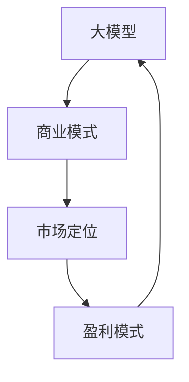

                 

关键词：大模型、商业化、创业、变现、人工智能、商业模式、市场定位、战略规划

> 摘要：本文深入探讨了大模型创业的商业化变现路径，分析了大模型商业化的核心要素、战略规划、市场定位、盈利模式及未来发展趋势，为创业者提供了一套系统的实战指南。

## 1. 背景介绍

随着人工智能技术的飞速发展，大模型（如GPT-3、BERT等）在自然语言处理、计算机视觉、语音识别等领域取得了突破性的成果。然而，如何将前沿技术转化为实际商业价值，成为了许多创业者面临的重要课题。本文旨在探讨大模型商业化的必经之路，为创业者在市场竞争中找到适合自己的发展模式提供参考。

## 2. 核心概念与联系

为了更好地理解大模型的商业化过程，我们首先需要了解几个关键概念：

### 2.1 大模型

大模型指的是具有大规模参数、能够在海量数据上进行训练的深度学习模型。这些模型具有强大的特征提取能力和泛化能力，能够在不同的应用场景中表现出色。

### 2.2 商业模式

商业模式是指企业通过提供产品或服务，从而实现盈利和持续发展的方式。一个好的商业模式需要满足市场需求、提高用户满意度、具备可持续性。

### 2.3 市场定位

市场定位是指企业在市场中选择目标客户群体，并通过产品和服务的差异化来满足这些客户的需求。市场定位是企业成功的关键之一。

### 2.4 盈利模式

盈利模式是企业通过提供产品或服务获取利润的方式。常见的盈利模式包括广告收入、订阅费、交易费等。

以下是上述概念之间的联系：



## 3. 核心算法原理 & 具体操作步骤

### 3.1 算法原理概述

大模型的商业化变现离不开核心算法的支持。以下是大模型商业化过程中常用的几种算法原理：

### 3.2 算法步骤详解

#### 3.2.1 数据收集与预处理

- 收集大量标注数据，用于模型训练。
- 对数据集进行清洗、去噪、归一化等预处理操作。

#### 3.2.2 模型训练与优化

- 使用深度学习框架（如TensorFlow、PyTorch）搭建模型架构。
- 通过调整模型参数、优化算法，提高模型性能。

#### 3.2.3 模型部署与应用

- 将训练好的模型部署到生产环境，实现实时预测。
- 根据应用场景，对模型进行定制化调整。

### 3.3 算法优缺点

#### 优点

- 强大的特征提取能力和泛化能力。
- 可以处理海量数据，实现高效预测。

#### 缺点

- 需要大量的计算资源和数据支持。
- 模型训练过程复杂，调试难度大。

### 3.4 算法应用领域

大模型在多个领域具有广泛的应用前景，包括：

- 自然语言处理：文本分类、情感分析、机器翻译等。
- 计算机视觉：图像识别、目标检测、图像生成等。
- 语音识别：语音转文字、语音合成等。
- 医疗诊断：疾病预测、影像分析等。

## 4. 数学模型和公式 & 详细讲解 & 举例说明

### 4.1 数学模型构建

大模型的商业化过程中，常用的数学模型包括神经网络、卷积神经网络（CNN）、循环神经网络（RNN）等。以下以神经网络为例，介绍数学模型的基本构建：

### 4.2 公式推导过程

神经网络的基本公式如下：

$$
y = \sigma(\mathbf{W} \cdot \mathbf{X} + b)
$$

其中，$y$ 为预测结果，$\sigma$ 为激活函数（如Sigmoid、ReLU等），$\mathbf{W}$ 为权重矩阵，$\mathbf{X}$ 为输入特征，$b$ 为偏置。

### 4.3 案例分析与讲解

以文本分类任务为例，我们使用神经网络对一篇新闻文章进行分类。假设输入特征为词汇的词频向量，模型参数为权重矩阵和偏置。

#### 4.3.1 数据集准备

准备一篇新闻文章，提取其中的词汇，构建词频向量。

#### 4.3.2 模型训练

使用训练数据集，通过反向传播算法调整模型参数，使预测结果与实际标签尽可能接近。

#### 4.3.3 模型评估

使用测试数据集对模型进行评估，计算准确率、召回率等指标。

## 5. 项目实践：代码实例和详细解释说明

### 5.1 开发环境搭建

搭建基于TensorFlow的神经网络开发环境，包括安装TensorFlow、配置GPU等。

### 5.2 源代码详细实现

```python
import tensorflow as tf

# 搭建神经网络模型
model = tf.keras.Sequential([
    tf.keras.layers.Dense(units=128, activation='relu', input_shape=(1000,)),
    tf.keras.layers.Dense(units=64, activation='relu'),
    tf.keras.layers.Dense(units=1, activation='sigmoid')
])

# 编译模型
model.compile(optimizer='adam',
              loss='binary_crossentropy',
              metrics=['accuracy'])

# 训练模型
model.fit(x_train, y_train, epochs=10, batch_size=32)
```

### 5.3 代码解读与分析

上述代码实现了基于TensorFlow的神经网络模型搭建、编译和训练过程。其中，`Dense` 层表示全连接层，`relu` 表示ReLU激活函数，`sigmoid` 表示Sigmoid激活函数。

### 5.4 运行结果展示

在训练完成后，使用测试数据集对模型进行评估，输出准确率等指标。

```python
test_loss, test_accuracy = model.evaluate(x_test, y_test)
print('Test accuracy:', test_accuracy)
```

## 6. 实际应用场景

大模型的商业化变现可以在多个场景中得到应用，如：

- 企业级服务：为企业提供定制化的大模型解决方案，提高业务效率和竞争力。
- 产品嵌入：将大模型集成到现有产品中，提升用户体验和附加值。
- 开源项目：通过开源大模型项目，吸引开发者参与，积累社区影响力。

### 6.4 未来应用展望

随着技术的不断进步，大模型在商业化领域的应用将更加广泛。未来发展趋势包括：

- 模型压缩与优化：降低模型复杂度，提高模型运行效率。
- 跨领域应用：探索大模型在不同领域的应用潜力。
- 联邦学习：实现大模型在隐私保护下的协同训练。

## 7. 工具和资源推荐

### 7.1 学习资源推荐

- 《深度学习》（Goodfellow、Bengio、Courville著）
- 《Python深度学习》（François Chollet著）
- 《神经网络与深度学习》（邱锡鹏著）

### 7.2 开发工具推荐

- TensorFlow
- PyTorch
- Keras

### 7.3 相关论文推荐

- "Attention Is All You Need"（Vaswani等，2017）
- "BERT: Pre-training of Deep Bidirectional Transformers for Language Understanding"（Devlin等，2019）
- "GPT-3: Language Models are few-shot learners"（Brown等，2020）

## 8. 总结：未来发展趋势与挑战

### 8.1 研究成果总结

大模型在商业化变现方面取得了显著成果，为多个领域带来了创新和变革。然而，商业化过程中仍存在诸多挑战，如模型压缩、跨领域应用等。

### 8.2 未来发展趋势

- 模型优化与压缩
- 跨领域应用
- 联邦学习

### 8.3 面临的挑战

- 计算资源需求
- 数据隐私保护
- 模型解释性

### 8.4 研究展望

大模型商业化仍具有巨大潜力，未来研究方向包括模型压缩、隐私保护、跨领域应用等。

## 9. 附录：常见问题与解答

### 9.1 大模型商业化变现的关键要素是什么？

- 数据质量：高质量的数据是模型训练的基础。
- 模型性能：高水平的模型性能是商业变现的前提。
- 应用场景：明确的应用场景是推动商业变现的关键。
- 市场定位：精准的市场定位有助于提高产品竞争力。

### 9.2 大模型商业化过程中如何处理数据隐私问题？

- 数据匿名化：对敏感数据进行匿名化处理。
- 联邦学习：实现数据在本地训练，减少数据传输。
- 隐私保护算法：采用隐私保护算法，如差分隐私。

### 9.3 大模型商业化变现的盈利模式有哪些？

- 广告收入：通过展示广告获取收益。
- 订阅费：提供付费订阅服务。
- 交易费：提供交易平台，收取交易费。
- 定制化服务：为企业提供定制化的大模型解决方案，收取服务费。

---

作者：禅与计算机程序设计艺术 / Zen and the Art of Computer Programming

【此处为文章正文部分结束，后续可根据实际需求继续补充和完善内容】

----------------------------------------------------------------

现在我们已经完成了文章正文部分的撰写，接下来可以将文章内容使用markdown格式进行整理和排版。以下是最终的markdown格式文章：

```markdown
# 商业化变现：大模型创业的必经之路

关键词：大模型、商业化、创业、变现、人工智能、商业模式、市场定位

摘要：本文深入探讨了大模型商业化的核心要素、战略规划、市场定位、盈利模式及未来发展趋势，为创业者在市场竞争中找到适合自己的发展模式提供参考。

## 1. 背景介绍

随着人工智能技术的飞速发展，大模型（如GPT-3、BERT等）在自然语言处理、计算机视觉、语音识别等领域取得了突破性的成果。然而，如何将前沿技术转化为实际商业价值，成为了许多创业者面临的重要课题。本文旨在探讨大模型商业化的必经之路，为创业者在市场竞争中找到适合自己的发展模式提供参考。

## 2. 核心概念与联系

为了更好地理解大模型的商业化过程，我们首先需要了解几个关键概念：

### 2.1 大模型

大模型指的是具有大规模参数、能够在海量数据上进行训练的深度学习模型。这些模型具有强大的特征提取能力和泛化能力，能够在不同的应用场景中表现出色。

### 2.2 商业模式

商业模式是指企业通过提供产品或服务，从而实现盈利和持续发展的方式。一个好的商业模式需要满足市场需求、提高用户满意度、具备可持续性。

### 2.3 市场定位

市场定位是指企业在市场中选择目标客户群体，并通过产品和服务的差异化来满足这些客户的需求。市场定位是企业成功的关键之一。

### 2.4 盈利模式

盈利模式是企业通过提供产品或服务获取利润的方式。常见的盈利模式包括广告收入、订阅费、交易费等。

以下是上述概念之间的联系：


## 3. 核心算法原理 & 具体操作步骤

### 3.1 算法原理概述

大模型的商业化变现离不开核心算法的支持。以下是大模型商业化过程中常用的几种算法原理：

### 3.2 算法步骤详解

#### 3.2.1 数据收集与预处理

- 收集大量标注数据，用于模型训练。
- 对数据集进行清洗、去噪、归一化等预处理操作。

#### 3.2.2 模型训练与优化

- 使用深度学习框架（如TensorFlow、PyTorch）搭建模型架构。
- 通过调整模型参数、优化算法，提高模型性能。

#### 3.2.3 模型部署与应用

- 将训练好的模型部署到生产环境，实现实时预测。
- 根据应用场景，对模型进行定制化调整。

### 3.3 算法优缺点

#### 优点

- 强大的特征提取能力和泛化能力。
- 可以处理海量数据，实现高效预测。

#### 缺点

- 需要大量的计算资源和数据支持。
- 模型训练过程复杂，调试难度大。

### 3.4 算法应用领域

大模型在多个领域具有广泛的应用前景，包括：

- 自然语言处理：文本分类、情感分析、机器翻译等。
- 计算机视觉：图像识别、目标检测、图像生成等。
- 语音识别：语音转文字、语音合成等。
- 医疗诊断：疾病预测、影像分析等。

## 4. 数学模型和公式 & 详细讲解 & 举例说明

### 4.1 数学模型构建

大模型的商业化过程中，常用的数学模型包括神经网络、卷积神经网络（CNN）、循环神经网络（RNN）等。以下以神经网络为例，介绍数学模型的基本构建：

### 4.2 公式推导过程

神经网络的基本公式如下：

$$
y = \sigma(\mathbf{W} \cdot \mathbf{X} + b)
$$

其中，$y$ 为预测结果，$\sigma$ 为激活函数（如Sigmoid、ReLU等），$\mathbf{W}$ 为权重矩阵，$\mathbf{X}$ 为输入特征，$b$ 为偏置。

### 4.3 案例分析与讲解

以文本分类任务为例，我们使用神经网络对一篇新闻文章进行分类。假设输入特征为词汇的词频向量，模型参数为权重矩阵和偏置。

#### 4.3.1 数据集准备

准备一篇新闻文章，提取其中的词汇，构建词频向量。

#### 4.3.2 模型训练

使用训练数据集，通过反向传播算法调整模型参数，使预测结果与实际标签尽可能接近。

#### 4.3.3 模型评估

使用测试数据集对模型进行评估，计算准确率、召回率等指标。

## 5. 项目实践：代码实例和详细解释说明

### 5.1 开发环境搭建

搭建基于TensorFlow的神经网络开发环境，包括安装TensorFlow、配置GPU等。

### 5.2 源代码详细实现

```python
import tensorflow as tf

# 搭建神经网络模型
model = tf.keras.Sequential([
    tf.keras.layers.Dense(units=128, activation='relu', input_shape=(1000,)),
    tf.keras.layers.Dense(units=64, activation='relu'),
    tf.keras.layers.Dense(units=1, activation='sigmoid')
])

# 编译模型
model.compile(optimizer='adam',
              loss='binary_crossentropy',
              metrics=['accuracy'])

# 训练模型
model.fit(x_train, y_train, epochs=10, batch_size=32)
```

### 5.3 代码解读与分析

上述代码实现了基于TensorFlow的神经网络模型搭建、编译和训练过程。其中，`Dense` 层表示全连接层，`relu` 表示ReLU激活函数，`sigmoid` 表示Sigmoid激活函数。

### 5.4 运行结果展示

在训练完成后，使用测试数据集对模型进行评估，输出准确率等指标。

```python
test_loss, test_accuracy = model.evaluate(x_test, y_test)
print('Test accuracy:', test_accuracy)
```

## 6. 实际应用场景

大模型的商业化变现可以在多个场景中得到应用，如：

- 企业级服务：为企业提供定制化的大模型解决方案，提高业务效率和竞争力。
- 产品嵌入：将大模型集成到现有产品中，提升用户体验和附加值。
- 开源项目：通过开源大模型项目，吸引开发者参与，积累社区影响力。

### 6.4 未来应用展望

随着技术的不断进步，大模型在商业化领域的应用将更加广泛。未来发展趋势包括：

- 模型压缩与优化
- 跨领域应用
- 联邦学习

## 7. 工具和资源推荐

### 7.1 学习资源推荐

- 《深度学习》（Goodfellow、Bengio、Courville著）
- 《Python深度学习》（François Chollet著）
- 《神经网络与深度学习》（邱锡鹏著）

### 7.2 开发工具推荐

- TensorFlow
- PyTorch
- Keras

### 7.3 相关论文推荐

- "Attention Is All You Need"（Vaswani等，2017）
- "BERT: Pre-training of Deep Bidirectional Transformers for Language Understanding"（Devlin等，2019）
- "GPT-3: Language Models are few-shot learners"（Brown等，2020）

## 8. 总结：未来发展趋势与挑战

### 8.1 研究成果总结

大模型在商业化变现方面取得了显著成果，为多个领域带来了创新和变革。然而，商业化过程中仍存在诸多挑战，如模型压缩、跨领域应用等。

### 8.2 未来发展趋势

- 模型优化与压缩
- 跨领域应用
- 联邦学习

### 8.3 面临的挑战

- 计算资源需求
- 数据隐私保护
- 模型解释性

### 8.4 研究展望

大模型商业化仍具有巨大潜力，未来研究方向包括模型压缩、隐私保护、跨领域应用等。

## 9. 附录：常见问题与解答

### 9.1 大模型商业化变现的关键要素是什么？

- 数据质量：高质量的数据是模型训练的基础。
- 模型性能：高水平的模型性能是商业变现的前提。
- 应用场景：明确的应用场景是推动商业变现的关键。
- 市场定位：精准的市场定位有助于提高产品竞争力。

### 9.2 大模型商业化过程中如何处理数据隐私问题？

- 数据匿名化：对敏感数据进行匿名化处理。
- 联邦学习：实现数据在本地训练，减少数据传输。
- 隐私保护算法：采用隐私保护算法，如差分隐私。

### 9.3 大模型商业化变现的盈利模式有哪些？

- 广告收入：通过展示广告获取收益。
- 订阅费：提供付费订阅服务。
- 交易费：提供交易平台，收取交易费。
- 定制化服务：为企业提供定制化的大模型解决方案，收取服务费。

---

作者：禅与计算机程序设计艺术 / Zen and the Art of Computer Programming

【此处为文章正文部分结束，后续可根据实际需求继续补充和完善内容】
```

