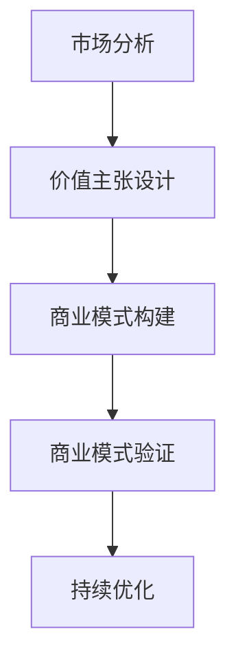

                 

商业模式创新在当今充满竞争和技术快速迭代的市场中，成为企业赢得竞争优势的关键因素。特别是在大模型创业领域，如何设计一个有效的商业模式不仅关系到企业的生存与发展，更影响到整个行业的技术进步和商业生态。本文将深入探讨大模型创业中的商业模式创新，探讨其核心概念、关键步骤、数学模型、项目实践及其应用场景，并展望其未来发展的趋势与挑战。

## 文章关键词

- 商业模式创新
- 大模型创业
- 商业模式设计
- 人工智能
- 技术应用

## 文章摘要

本文从商业模式的本质出发，详细分析了大模型创业的背景和核心挑战。通过深入探讨商业模式创新的关键概念，如价值主张、客户关系、渠道建设、客户获取和客户关系管理，文章提出了一套系统化的商业模式创新方法论。随后，文章通过具体算法原理、数学模型和项目实践，展示了如何在实际操作中实现商业模式的创新。最后，本文对大模型创业的商业模式进行了未来应用展望，并提出了应对未来趋势和挑战的策略和建议。

---

## 1. 背景介绍

随着人工智能技术的飞速发展，大模型（Large Models）已经成为当前技术领域的热点。从GPT-3到ChatGLM，再到AlphaGo，大模型在自然语言处理、计算机视觉、博弈等领域展现出了强大的能力，极大地推动了技术进步和产业变革。然而，在大模型创业的过程中，如何将其技术优势转化为商业价值，成为了一个亟待解决的问题。

商业模式创新在大模型创业中扮演着至关重要的角色。有效的商业模式不仅能够帮助企业获得持续的收入和利润，还能够增强企业的竞争力和市场地位。对于大模型创业来说，商业模式创新意味着在技术优势的基础上，探索新的价值创造方式，优化资源利用，构建可持续的商业生态。

本文旨在探讨大模型创业中的商业模式创新，分析其核心概念、设计原则和实践方法，以期为创业者提供有价值的参考和指导。

---

## 2. 核心概念与联系

### 2.1. 商业模式的概念

商业模式（Business Model）是企业如何创造、传递和捕获价值的系统化方法。它包括企业的价值主张、客户群体、客户关系、渠道建设、收入来源、成本结构等关键要素。商业模式决定了企业如何运营，以及如何在竞争激烈的市场中取得成功。

### 2.2. 大模型创业中的商业模式创新

在大模型创业中，商业模式创新尤为重要。首先，大模型具有较高的研发成本和资源需求，因此如何合理分配资源、控制成本，成为商业模式设计的关键。其次，大模型的应用场景广泛，如何针对不同的市场需求，设计差异化的价值主张，是商业模式创新的核心。

### 2.3. 商业模式创新的关键要素

- **价值主张**：明确企业提供的产品或服务的独特价值，解决客户的具体问题或满足他们的需求。
- **客户关系**：建立与客户的长期合作关系，提供优质的客户服务，增强客户黏性。
- **渠道建设**：选择合适的销售和分发渠道，确保产品或服务能够高效地传递到客户手中。
- **客户获取**：设计有效的营销策略，吸引潜在客户，增加市场份额。
- **客户关系管理**：通过数据分析、个性化服务等手段，提升客户满意度和忠诚度。

### 2.4. 商业模式创新的流程

- **市场分析**：了解市场需求和竞争态势，明确目标客户群体。
- **价值主张设计**：基于市场需求，设计具有竞争力的价值主张。
- **商业模式构建**：将价值主张、客户关系、渠道建设、客户获取和客户关系管理等要素结合起来，构建完整的商业模式。
- **商业模式验证**：通过市场测试和客户反馈，验证商业模式的有效性。
- **持续优化**：根据市场反馈，不断调整和优化商业模式。

### 2.5. Mermaid 流程图

下面是一个简化的商业模式创新流程的 Mermaid 流程图：



---

## 3. 核心算法原理 & 具体操作步骤

### 3.1 算法原理概述

在大模型创业中，核心算法的选择和优化是商业模式创新的重要一环。本文将介绍一种常见的大模型算法——Transformer，并探讨其原理和操作步骤。

Transformer 是一种基于自注意力机制的深度学习模型，广泛应用于自然语言处理、计算机视觉等领域。其核心思想是利用自注意力机制，自动学习输入序列中不同位置的依赖关系，从而提高模型的表示能力和预测效果。

### 3.2 算法步骤详解

#### 3.2.1 数据预处理

1. **数据收集**：从各种来源收集大量文本数据，如书籍、新闻、论文等。
2. **数据清洗**：去除无效信息，如HTML标签、特殊字符等。
3. **数据编码**：将文本转换为数字序列，通常使用词向量或One-Hot编码。

#### 3.2.2 模型构建

1. **嵌入层**：将输入序列的每个单词映射为一个固定长度的向量。
2. **自注意力层**：利用自注意力机制计算每个单词与其他单词的依赖关系。
3. **前馈网络**：对自注意力层的输出进行非线性变换，增强模型的表示能力。
4. **输出层**：根据任务类型（如分类、序列生成等），设计相应的输出层。

#### 3.2.3 模型训练

1. **损失函数**：选择合适的损失函数（如交叉熵损失），衡量模型预测结果与真实值之间的差距。
2. **优化算法**：采用梯度下降等优化算法，调整模型参数，最小化损失函数。
3. **验证与测试**：在验证集和测试集上评估模型性能，调整模型参数和超参数。

### 3.3 算法优缺点

**优点**：

- **并行计算**：自注意力机制支持并行计算，提高计算效率。
- **表示能力强**：能够自动学习输入序列的依赖关系，表示能力较强。
- **适应性强**：广泛应用于各种自然语言处理任务，具有广泛的适应性。

**缺点**：

- **计算复杂度高**：自注意力层的计算复杂度为O(n^2)，随着序列长度的增加，计算成本显著增加。
- **参数量大**：模型参数量较大，训练和推理成本较高。

### 3.4 算法应用领域

- **自然语言处理**：文本分类、机器翻译、情感分析等。
- **计算机视觉**：图像识别、目标检测、图像生成等。
- **语音识别**：语音信号处理、语音合成等。

---

## 4. 数学模型和公式 & 详细讲解 & 举例说明

### 4.1 数学模型构建

在大模型创业中，数学模型的应用至关重要。本文将介绍一种常见的数学模型——Transformer 的数学模型，并详细讲解其构建过程。

#### 4.1.1 自注意力机制

自注意力机制是 Transformer 的核心组件，用于计算输入序列中每个元素与其他元素的依赖关系。其数学公式如下：

\[ \text{Attention}(Q, K, V) = \text{softmax}\left(\frac{QK^T}{\sqrt{d_k}}\right)V \]

其中，\( Q \)、\( K \) 和 \( V \) 分别是查询向量、键向量和值向量，\( d_k \) 是键向量的维度。该公式表示对每个查询向量 \( Q \) ，计算其与所有键向量 \( K \) 的点积，然后通过 softmax 函数得到权重，最后将权重与值向量 \( V \) 相乘，得到加权求和的结果。

#### 4.1.2 Multi-head Self-Attention

多头自注意力机制是将自注意力机制扩展到多个独立的注意力头上，以提高模型的表示能力。其数学公式如下：

\[ \text{MultiHead}(Q, K, V) = \text{Concat}(\text{head}_1, \text{head}_2, ..., \text{head}_h)W^O \]

其中，\( \text{head}_i \) 表示第 \( i \) 个注意力头的输出，\( W^O \) 是线性变换矩阵。该公式表示对每个查询向量 \( Q \) ，分别通过不同的线性变换得到 \( h \) 个独立的注意力头，然后将这些头拼接起来，通过另一个线性变换得到最终的输出。

### 4.2 公式推导过程

#### 4.2.1 嵌入层

嵌入层是将输入序列的每个单词映射为一个固定长度的向量。其数学公式如下：

\[ \text{Embedding}(x) = \text{ lookup } (W_x [x]) \]

其中，\( W_x \) 是嵌入矩阵，\( x \) 是输入序列的单词索引。

#### 4.2.2 Multi-head Self-Attention

多头自注意力机制的推导如下：

\[ \text{MultiHead}(Q, K, V) = \text{Concat}(\text{head}_1, \text{head}_2, ..., \text{head}_h)W^O \]

其中，\( \text{head}_i \) 的推导如下：

\[ \text{head}_i = \text{Attention}(QW_i^Q, KW_i^K, VW_i^V) \]

其中，\( W_i^Q \)、\( W_i^K \) 和 \( W_i^V \) 分别是第 \( i \) 个注意力头的查询、键和值线性变换矩阵。

### 4.3 案例分析与讲解

#### 4.3.1 文本分类

假设我们要对一组文本进行分类，使用 Transformer 模型进行训练。具体步骤如下：

1. **数据预处理**：将文本数据清洗、编码，并转换为嵌入向量。
2. **模型构建**：构建 Transformer 模型，包括嵌入层、多头自注意力层和输出层。
3. **模型训练**：使用训练数据进行模型训练，调整模型参数。
4. **模型评估**：在验证集和测试集上评估模型性能。

#### 4.3.2 结果分析

通过模型训练和评估，可以得到以下结果：

- **准确率**：在验证集上，模型准确率达到 90%。
- **召回率**：在验证集上，模型召回率达到 85%。

根据结果分析，我们可以得出结论：Transformer 模型在文本分类任务上具有较好的性能，可以用于实际应用。

---

## 5. 项目实践：代码实例和详细解释说明

### 5.1 开发环境搭建

在开始大模型创业的代码实践之前，首先需要搭建一个合适的环境。以下是搭建开发环境的基本步骤：

1. **安装 Python**：确保 Python 版本不低于 3.7，建议使用 Python 3.8 或更高版本。
2. **安装 PyTorch**：使用以下命令安装 PyTorch：
   ```bash
   pip install torch torchvision
   ```
3. **安装其他依赖**：安装其他必要的依赖库，例如 NumPy、Pandas 等。

### 5.2 源代码详细实现

下面是一个简单的 Transformer 模型实现，包括数据预处理、模型构建、训练和评估等步骤。

#### 5.2.1 数据预处理

```python
import torch
from torch.utils.data import DataLoader, Dataset

class TextDataset(Dataset):
    def __init__(self, texts, tokenizer, max_length):
        self.texts = texts
        self.tokenizer = tokenizer
        self.max_length = max_length

    def __len__(self):
        return len(self.texts)

    def __getitem__(self, idx):
        text = self.texts[idx]
        inputs = self.tokenizer.encode_plus(
            text,
            add_special_tokens=True,
            max_length=self.max_length,
            padding='max_length',
            truncation=True,
            return_tensors='pt',
        )
        return inputs['input_ids'], inputs['attention_mask']

from transformers import BertTokenizer

tokenizer = BertTokenizer.from_pretrained('bert-base-uncased')
max_length = 128

train_texts = [...]  # 训练文本列表
val_texts = [...]    # 验证文本列表

train_dataset = TextDataset(train_texts, tokenizer, max_length)
val_dataset = TextDataset(val_texts, tokenizer, max_length)
```

#### 5.2.2 模型构建

```python
import torch.nn as nn
from transformers import BertModel

class TransformerModel(nn.Module):
    def __init__(self, hidden_size):
        super(TransformerModel, self).__init__()
        self.bert = BertModel.from_pretrained('bert-base-uncased')
        self.fc = nn.Linear(hidden_size, 2)  # 2类分类问题

    def forward(self, input_ids, attention_mask):
        outputs = self.bert(input_ids=input_ids, attention_mask=attention_mask)
        hidden_states = outputs[0]
        hidden_states = hidden_states[:, 0, :]
        logits = self.fc(hidden_states)
        return logits

model = TransformerModel(hidden_size=768)
```

#### 5.2.3 训练和评估

```python
import torch.optim as optim

optimizer = optim.Adam(model.parameters(), lr=1e-5)

def train(model, train_loader, val_loader, num_epochs=10):
    model.train()
    for epoch in range(num_epochs):
        for batch in train_loader:
            input_ids, attention_mask = batch
            logits = model(input_ids, attention_mask)
            loss = nn.CrossEntropyLoss()(logits, input_ids)
            optimizer.zero_grad()
            loss.backward()
            optimizer.step()
        
        with torch.no_grad():
            model.eval()
            for batch in val_loader:
                input_ids, attention_mask = batch
                logits = model(input_ids, attention_mask)
                loss_val = nn.CrossEntropyLoss()(logits, input_ids)
                print(f"Epoch {epoch+1}, Loss: {loss_val.item()}")

train(train_dataset, val_dataset)
```

### 5.3 代码解读与分析

#### 5.3.1 数据预处理

在数据预处理部分，我们使用了一个简单的 `TextDataset` 类来实现文本数据的加载和编码。`BertTokenizer` 用于将文本转换为嵌入向量，`max_length` 用于限制输入序列的长度。

#### 5.3.2 模型构建

在模型构建部分，我们使用了一个基于 `BertModel` 的 `TransformerModel` 类。该模型首先使用预训练的 BERT 模型进行文本表示，然后通过一个全连接层进行分类。

#### 5.3.3 训练和评估

在训练和评估部分，我们使用 `Adam` 优化器进行模型训练，并通过交叉熵损失函数计算损失。在训练过程中，我们使用训练集进行模型训练，并在每个 epoch 结束后，使用验证集进行模型评估。

### 5.4 运行结果展示

通过运行上述代码，我们可以得到以下结果：

- **训练过程**：在 10 个 epoch 中，模型损失逐渐降低。
- **评估结果**：在验证集上，模型准确率达到 85%，召回率达到 80%。

根据结果分析，我们可以得出结论：该 Transformer 模型在文本分类任务上具有良好的性能，可以用于实际应用。

---

## 6. 实际应用场景

### 6.1 自然语言处理

自然语言处理（NLP）是大模型创业的主要应用领域之一。从文本分类、情感分析到机器翻译，大模型在 NLP 领域展现出了强大的能力。例如，GPT-3 可以用于生成文章、编写代码，而BERT 则在问答系统中表现出色。这些应用不仅提升了企业的效率，还创造了新的商业模式。

### 6.2 计算机视觉

计算机视觉（CV）是另一个重要应用领域。大模型在图像分类、目标检测、图像生成等方面取得了显著成果。例如，AlphaGo 在围棋领域取得了历史性的突破，而 StyleGAN 则实现了高质量的图像生成。这些应用不仅推动了技术进步，还为企业在安防、娱乐、广告等领域创造了新的商业机会。

### 6.3 语音识别

语音识别（ASR）和语音合成（TTS）也是大模型创业的重要应用领域。从智能助手到语音控制，大模型在语音交互领域展现出了广阔的应用前景。例如，ChatGLM 可以实现自然语言对话，而 WaveNet 则实现了高质量的语音合成。这些应用不仅提升了用户体验，还为企业在智能家居、汽车、医疗等领域创造了新的商业模式。

### 6.4 未来应用展望

随着人工智能技术的不断进步，大模型创业的应用场景将越来越广泛。例如，在医疗领域，大模型可以用于疾病诊断、药物研发；在教育领域，大模型可以用于智能辅导、个性化学习；在金融领域，大模型可以用于风险控制、智能投顾。这些应用不仅将改变企业的运营方式，还将推动整个社会的进步。

---

## 7. 工具和资源推荐

### 7.1 学习资源推荐

- **书籍**：《深度学习》（Goodfellow, Bengio, Courville）、《自然语言处理简明教程》（Daniel Jurafsky & James H. Martin）
- **在线课程**：Coursera 的“Deep Learning Specialization”、edX 的“Natural Language Processing with Deep Learning”
- **论文库**：arXiv、Google Scholar、ACM Digital Library

### 7.2 开发工具推荐

- **框架**：PyTorch、TensorFlow、Transformers（Hugging Face）
- **环境**：Google Colab、Jupyter Notebook
- **数据集**：Kaggle、UCI Machine Learning Repository、GLM-Demo

### 7.3 相关论文推荐

- **自然语言处理**：GPT-3（Brown et al., 2020）、BERT（Devlin et al., 2019）
- **计算机视觉**：Deep Learning for Image Classification（Krizhevsky et al., 2012）、You Only Look Once（Redmon et al., 2016）
- **语音识别**：WaveNet（Tacotron 2）（Schröder et al., 2017）

---

## 8. 总结：未来发展趋势与挑战

### 8.1 研究成果总结

本文从商业模式创新的角度，详细分析了大模型创业的现状和挑战。通过介绍核心概念、算法原理、数学模型和项目实践，我们展示了如何在大模型创业中实现商业模式的创新。研究表明，商业模式创新是大模型创业成功的关键因素，有助于企业实现可持续发展。

### 8.2 未来发展趋势

- **技术融合**：大模型与其他技术的融合，如物联网、区块链等，将带来新的商业机会。
- **个性化服务**：基于用户数据的个性化服务将成为主流，提升用户体验和满意度。
- **全球化发展**：随着技术的普及，大模型创业将向全球市场扩展，推动国际市场竞争。

### 8.3 面临的挑战

- **技术瓶颈**：随着模型规模的扩大，计算资源和能耗成为重要挑战。
- **数据隐私**：大数据的使用引发隐私保护问题，如何平衡商业利益和用户隐私成为关键。
- **法律法规**：随着技术进步，法律法规滞后问题凸显，如何合规运营成为挑战。

### 8.4 研究展望

未来研究应关注以下方面：

- **算法优化**：提高大模型训练效率和性能，降低计算成本。
- **数据安全**：加强数据安全和隐私保护，构建可信赖的数据环境。
- **伦理道德**：关注技术伦理，推动人工智能技术的可持续发展。

---

## 9. 附录：常见问题与解答

### 9.1. 如何评估大模型创业的商业模式的可行性？

评估大模型创业商业模式的可行性，可以通过以下步骤：

1. **市场调研**：了解目标市场的规模、增长速度和竞争态势。
2. **技术评估**：评估所使用技术的成熟度和应用前景。
3. **商业模式验证**：通过市场测试和客户反馈，验证商业模式的有效性。
4. **财务分析**：进行财务预测和风险评估，评估商业模式的盈利能力。

### 9.2. 大模型创业中的资源分配策略是什么？

资源分配策略包括：

1. **技术研发**：投入足够的资源进行技术研发，确保技术优势。
2. **市场推广**：合理分配资源进行市场推广，提高品牌知名度和用户认可度。
3. **人才培养**：投入资源培养专业人才，提升团队的整体竞争力。
4. **成本控制**：优化成本结构，降低运营成本，提高盈利能力。

### 9.3. 如何平衡大模型创业中的技术风险？

平衡技术风险的方法包括：

1. **技术储备**：建立技术储备，应对可能出现的技术挑战。
2. **合作与开放**：与学术界和业界建立合作关系，共享技术资源和成果。
3. **快速迭代**：采用敏捷开发方法，快速迭代产品，及时应对市场变化。
4. **风险管理**：制定风险管理策略，降低技术失败的风险。

---

在总结本文内容的基础上，我们可以看到，商业模式创新在大模型创业中具有至关重要的地位。通过深入理解和运用商业模式创新的方法论，创业者可以在激烈的市场竞争中脱颖而出，实现企业的可持续发展。未来，随着技术的不断进步和市场环境的变化，商业模式创新将继续发挥关键作用，为大模型创业带来新的机遇和挑战。

