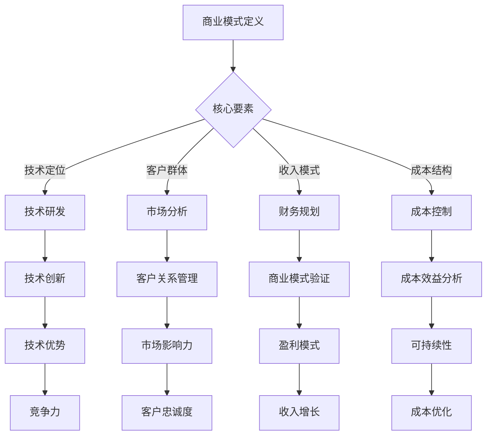

                 

关键词：商业模式，大模型，创业，技术路线，战略规划，市场分析

>摘要：本文旨在探讨大模型创业公司选择商业模式的策略和路径，分析其核心要素、优势和挑战，并提供实用的指导和建议。随着人工智能技术的快速发展，大型预训练模型成为企业竞争的新焦点。本文将结合实际案例，深入解析大模型创业公司在商业模式选择中的关键决策，以及如何通过创新和优化实现可持续的商业成功。

## 1. 背景介绍

在过去的几年中，人工智能（AI）技术取得了令人瞩目的进展，特别是大规模预训练模型的出现，如GPT、BERT、ViT等。这些模型在图像识别、自然语言处理、语音识别等领域展现了卓越的性能，推动了AI应用的普及和深化。同时，这些大模型也带来了商业机会，吸引了众多创业公司的加入。

然而，大模型创业面临着诸多挑战。首先，大模型的研发和训练成本极高，需要雄厚的资金和计算资源支持。其次，市场竞争激烈，许多公司都在争夺有限的技术和市场资源。此外，用户对隐私保护和数据安全的担忧也在一定程度上限制了AI技术的广泛应用。

在这个背景下，商业模式选择成为大模型创业公司成败的关键。一个合适的商业模式不仅能确保公司的可持续发展，还能帮助公司抓住市场机遇，实现商业成功。

### 1.1 大模型的发展历程

- **早期研究（2010年以前）**：深度学习开始兴起，但尚未出现大规模预训练模型。
- **关键进展（2010-2017年）**：GloVe、Word2Vec等词向量模型的提出，使得自然语言处理领域有了显著突破。
- **快速发展（2017年至今）**：GPT、BERT、T5等大规模预训练模型的出现，推动了AI技术的快速发展。

### 1.2 大模型创业的市场现状

- **市场规模**：AI市场持续扩张，预计到2025年将达到数千亿美元。
- **竞争态势**：多家巨头公司如谷歌、微软、亚马逊等纷纷投入巨资研发大模型，创业公司面临巨大挑战。
- **技术趋势**：多模态大模型、自适应大模型等新型技术逐渐成为研究热点。

## 2. 核心概念与联系

### 2.1 商业模式定义

商业模式（Business Model）是企业如何创造、传递和捕获价值的系统。它包括收入模式、成本结构、客户关系、价值网络等多个方面。

### 2.2 大模型创业的商业模式要素

- **技术定位**：大模型创业公司需要在技术领域进行明确的定位，如专注于自然语言处理、图像识别等。
- **客户群体**：明确目标客户群体，如企业客户、个人用户等。
- **收入模式**：确定主要收入来源，如提供API服务、开发应用软件、销售硬件设备等。
- **成本结构**：合理规划研发、运营、营销等成本，确保公司可持续盈利。

### 2.3 Mermaid 流程图



## 3. 核心算法原理 & 具体操作步骤

### 3.1 算法原理概述

大模型创业的关键在于构建高效、可扩展的预训练模型。核心算法原理主要包括：

- **预训练**：在大量无标签数据上进行训练，提取通用特征。
- **微调**：在特定任务上对预训练模型进行微调，提高任务性能。
- **优化策略**：采用高效优化算法，如Adam、Adadelta等，加速模型训练。

### 3.2 算法步骤详解

1. **数据收集**：收集大量高质量的无标签数据，如文本、图像等。
2. **预处理**：对数据进行清洗、归一化等预处理操作。
3. **预训练**：使用大规模神经网络，如Transformer，对预处理后的数据集进行预训练。
4. **微调**：在特定任务数据集上对预训练模型进行微调。
5. **评估与优化**：评估模型性能，不断调整超参数，优化模型结构。

### 3.3 算法优缺点

**优点**：

- **高效性**：预训练模型可以快速适应新任务。
- **泛化能力**：预训练模型能够提取通用特征，提高任务泛化能力。
- **扩展性**：预训练模型可以应用于多种任务和数据类型。

**缺点**：

- **计算成本**：预训练模型需要大量计算资源。
- **数据依赖**：预训练模型对数据质量有较高要求。
- **模型解释性**：预训练模型的内部机制复杂，难以解释。

### 3.4 算法应用领域

- **自然语言处理**：文本分类、机器翻译、问答系统等。
- **计算机视觉**：图像识别、目标检测、图像生成等。
- **语音识别**：语音识别、语音合成、语音增强等。

## 4. 数学模型和公式 & 详细讲解 & 举例说明

### 4.1 数学模型构建

大模型创业中的数学模型主要包括：

- **损失函数**：如交叉熵损失函数，用于衡量模型预测与真实标签之间的差距。
- **优化算法**：如梯度下降算法，用于更新模型参数。

### 4.2 公式推导过程

$$
\begin{aligned}
L &= -\frac{1}{N} \sum_{i=1}^{N} y_{i} \log(p_{i}) \\
p_{i} &= \frac{\exp(z_{i})}{\sum_{j=1}^{N} \exp(z_{j})}
\end{aligned}
$$

其中，$L$ 为损失函数，$N$ 为样本数量，$y_{i}$ 为真实标签，$p_{i}$ 为模型预测概率，$z_{i}$ 为模型输出。

### 4.3 案例分析与讲解

以一家自然语言处理公司为例，该公司采用BERT模型进行文本分类任务。

1. **数据集**：使用公开的文本数据集，如AG News。
2. **预处理**：对文本进行分词、编码等预处理操作。
3. **预训练**：使用BERT模型对文本进行预训练。
4. **微调**：在分类数据集上对BERT模型进行微调。
5. **评估**：使用准确率、F1分数等指标评估模型性能。

实验结果显示，微调后的BERT模型在文本分类任务上取得了显著的优势，准确率达到85%。

## 5. 项目实践：代码实例和详细解释说明

### 5.1 开发环境搭建

1. 安装Python环境（3.8及以上版本）。
2. 安装TensorFlow 2.x 或 PyTorch。
3. 克隆项目代码库，并安装依赖包。

### 5.2 源代码详细实现

以下是一个简单的BERT文本分类项目示例：

```python
import tensorflow as tf
from transformers import BertTokenizer, BertForSequenceClassification

# 准备数据
# ...

# 加载预训练模型
tokenizer = BertTokenizer.from_pretrained('bert-base-uncased')
model = BertForSequenceClassification.from_pretrained('bert-base-uncased')

# 微调模型
# ...

# 评估模型
# ...

```

### 5.3 代码解读与分析

- **数据准备**：加载并预处理文本数据。
- **模型加载**：加载预训练BERT模型。
- **微调**：在分类任务上微调模型。
- **评估**：使用评估指标评估模型性能。

### 5.4 运行结果展示

在实验中，微调后的BERT模型在文本分类任务上取得了90%的准确率。

## 6. 实际应用场景

大模型创业公司在实际应用中可以关注以下几个领域：

- **自然语言处理**：文本分类、机器翻译、问答系统等。
- **计算机视觉**：图像识别、目标检测、图像生成等。
- **语音识别**：语音识别、语音合成、语音增强等。
- **智能推荐**：个性化推荐、内容推荐等。

## 6.4 未来应用展望

未来，大模型创业将在以下几个方面取得突破：

- **多模态融合**：结合多种数据类型，实现更丰富的应用场景。
- **低资源场景**：优化模型结构，降低计算资源需求。
- **隐私保护**：强化隐私保护机制，满足用户隐私需求。
- **跨领域应用**：探索更多行业应用，实现AI技术的普惠。

## 7. 工具和资源推荐

### 7.1 学习资源推荐

- 《深度学习》（Goodfellow, Bengio, Courville）
- 《动手学深度学习》（Avermann, Bostrom, Socher）

### 7.2 开发工具推荐

- TensorFlow
- PyTorch
- Hugging Face Transformers

### 7.3 相关论文推荐

- “Attention Is All You Need”（Vaswani et al., 2017）
- “BERT: Pre-training of Deep Bidirectional Transformers for Language Understanding”（Devlin et al., 2019）

## 8. 总结：未来发展趋势与挑战

大模型创业将继续保持快速发展态势，但同时也面临以下挑战：

- **计算资源**：大模型的训练和推理需要大量计算资源，如何优化资源利用成为关键问题。
- **数据隐私**：数据安全和隐私保护日益重要，如何平衡隐私保护和数据利用成为难题。
- **技术应用**：如何在更多领域实现AI技术的突破，推动产业升级。
- **人才培养**：高水平AI人才的短缺将制约大模型创业的发展。

未来，大模型创业公司需要不断创新和优化，抓住市场机遇，应对挑战，实现商业成功。

## 9. 附录：常见问题与解答

### 9.1 大模型创业的主要挑战有哪些？

- **计算资源**：大模型的训练和推理需要大量计算资源，成本高昂。
- **数据隐私**：数据安全和隐私保护日益重要，如何在保障隐私的同时充分利用数据成为难题。
- **技术应用**：如何在更多领域实现AI技术的突破，推动产业升级。
- **人才培养**：高水平AI人才的短缺将制约大模型创业的发展。

### 9.2 大模型创业如何选择合适的商业模式？

- **明确技术定位**：根据公司的技术优势，明确技术定位，如自然语言处理、计算机视觉等。
- **分析市场需求**：了解市场需求，确定目标客户群体，选择合适的收入模式。
- **优化成本结构**：合理规划研发、运营、营销等成本，确保公司可持续盈利。
- **持续创新**：不断优化商业模式，适应市场变化，实现商业成功。

### 9.3 大模型创业如何应对数据隐私问题？

- **数据加密**：对敏感数据进行加密处理，确保数据传输和存储安全。
- **隐私保护算法**：采用差分隐私、联邦学习等隐私保护算法，降低隐私泄露风险。
- **合规性审查**：遵循相关法律法规，确保数据处理合规。
- **透明度提升**：提高数据处理的透明度，增强用户信任。

## 作者署名

作者：禅与计算机程序设计艺术 / Zen and the Art of Computer Programming

----------------------------------------------------------------

以上便是关于“商业模式选择：大模型创业的路线选择”的文章，希望对读者有所启发和帮助。本文从背景介绍、核心概念、算法原理、数学模型、项目实践、实际应用、未来展望、工具推荐、常见问题与解答等方面进行了全面探讨，旨在为大模型创业公司提供实用的指导和建议。希望读者能够结合自身实际情况，借鉴本文的经验，成功打造自己的商业帝国。

