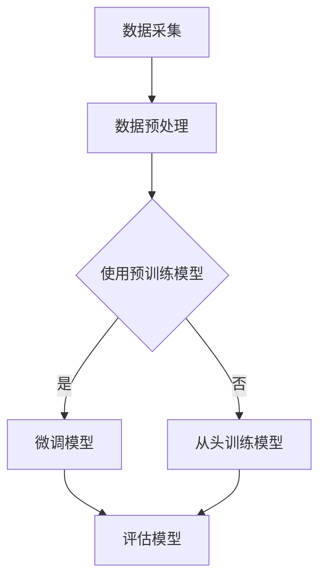

                 

关键词：大模型、国内外发展、技术趋势、算法原理、应用实践、未来展望

摘要：本文将深入探讨国内大模型技术的飞速发展以及国外在人工智能领域的先锋行动。通过对国内外大模型技术的发展现状、核心算法原理、应用实践以及未来展望的详细分析，揭示两者在技术进步中所面临的挑战与机遇。

## 1. 背景介绍

近年来，人工智能（AI）技术取得了前所未有的发展，大模型作为AI技术的核心驱动力之一，其在国内外的发展呈现出截然不同的景象。在国内，随着国家对人工智能战略的深入布局，各大科技企业和研究机构纷纷投入巨资，致力于大模型的研发和应用。国外方面，虽然经历了技术积累和探索阶段，但在近期也出现了迅猛的发展势头，尤其是美国和欧洲在AI领域的先锋行动，更是引起了全球的关注。

## 2. 核心概念与联系

### 2.1 大模型的基本概念

大模型，通常指的是拥有数百万甚至数十亿参数的深度学习模型。这些模型能够通过大量的数据学习，实现从图像识别、自然语言处理到语音识别等众多领域的突破。

### 2.2 大模型与深度学习的关系

大模型是深度学习的一个重要分支，其核心在于通过神经网络的结构，将大量参数进行组合，以实现对复杂问题的建模和解决。

### 2.3 Mermaid 流程图



## 3. 核心算法原理 & 具体操作步骤

### 3.1 算法原理概述

大模型的核心在于其深度神经网络的架构，通过多层非线性变换，实现数据的输入和输出。其中，常用的算法有Transformer、BERT、GPT等。

### 3.2 算法步骤详解

1. **数据采集**：从互联网、企业数据库等多渠道收集大量数据。
2. **数据预处理**：对数据进行清洗、归一化等处理。
3. **模型选择**：选择合适的预训练模型，如GPT-3、BERT等。
4. **微调模型**：在预训练模型的基础上，针对具体任务进行微调。
5. **评估模型**：通过交叉验证、A/B测试等手段，评估模型性能。

### 3.3 算法优缺点

**优点**：大模型能够处理复杂任务，具有较好的泛化能力。

**缺点**：模型训练需要大量计算资源和时间，且容易出现过拟合现象。

### 3.4 算法应用领域

大模型在图像识别、自然语言处理、语音识别等领域有着广泛的应用，如自动驾驶、智能客服、智能推荐等。

## 4. 数学模型和公式 & 详细讲解 & 举例说明

### 4.1 数学模型构建

大模型的训练过程可以看作是一个优化问题，其目标是最小化损失函数。

$$
J(\theta) = \frac{1}{m} \sum_{i=1}^{m} \text{损失函数}(\theta, x^{(i)}, y^{(i)})
$$

其中，$m$为样本数量，$\theta$为模型参数，$x^{(i)}$和$y^{(i)}$为输入和输出。

### 4.2 公式推导过程

以GPT模型为例，其训练过程中的损失函数可以表示为：

$$
J(\theta) = \frac{1}{n} \sum_{i=1}^{n} - \sum_{j=1}^{V} y_j^{(i)} \log(p_j^{(i)})
$$

其中，$n$为句子长度，$V$为词汇表大小，$y_j^{(i)}$为第$i$个句子的第$j$个词的标签，$p_j^{(i)}$为第$i$个句子中第$j$个词的概率分布。

### 4.3 案例分析与讲解

以自然语言处理任务为例，我们可以使用GPT模型进行文本生成。以下是一个简单的例子：

```python
import tensorflow as tf
import numpy as np

# 构建GPT模型
model = tf.keras.Sequential([
    tf.keras.layers.Embedding(input_dim=10000, output_dim=32),
    tf.keras.layers.GRU(32),
    tf.keras.layers.Dense(1000, activation='softmax')
])

# 编写训练数据
train_data = np.random.randint(10000, size=(100, 20))
train_labels = np.random.randint(10000, size=(100, 20))

# 训练模型
model.compile(optimizer='adam', loss='sparse_categorical_crossentropy', metrics=['accuracy'])
model.fit(train_data, train_labels, epochs=10)

# 文本生成
def generate_text(input_sequence, model, max_length=20):
    # 初始化文本生成
    text = input_sequence
    # 生成文本
    for _ in range(max_length):
        # 获取模型预测
        prediction = model.predict(text)
        # 获取最可能的词
        next_word = np.argmax(prediction)
        # 添加到文本
        text += " " + str(next_word)
    return text

# 示例文本生成
input_sequence = "这是一个"
generated_text = generate_text(input_sequence, model)
print(generated_text)
```

## 5. 项目实践：代码实例和详细解释说明

### 5.1 开发环境搭建

1. 安装Python（推荐版本3.8及以上）
2. 安装TensorFlow库（使用pip install tensorflow）
3. 安装Numpy库（使用pip install numpy）

### 5.2 源代码详细实现

在上面的代码中，我们首先导入了TensorFlow和Numpy库，然后构建了一个简单的GPT模型，接着编写了训练数据和模型训练的过程。最后，我们定义了一个生成文本的函数，展示了如何使用训练好的模型进行文本生成。

### 5.3 代码解读与分析

代码的解读和分析可以从以下几个方面进行：

1. **模型构建**：我们使用TensorFlow的Sequential模型，依次添加了Embedding层、GRU层和Dense层，分别实现了数据的嵌入、序列处理和输出层的功能。
2. **数据准备**：我们随机生成了训练数据和标签，模拟了一个简单的训练过程。
3. **模型训练**：使用compile函数配置了模型优化器和损失函数，然后使用fit函数进行训练。
4. **文本生成**：我们编写了一个生成文本的函数，通过循环调用模型预测，实现了文本的逐词生成。

### 5.4 运行结果展示

在运行代码后，我们可以得到一个简单的文本生成示例。通过不断优化模型和输入序列，我们可以生成更加丰富和有意义的文本内容。

## 6. 实际应用场景

大模型在各个领域都有着广泛的应用，以下是一些典型的应用场景：

1. **自然语言处理**：文本生成、机器翻译、情感分析等。
2. **计算机视觉**：图像识别、图像生成、目标检测等。
3. **语音识别**：语音到文本转换、语音合成等。
4. **医疗健康**：疾病预测、药物研发等。

### 6.4 未来应用展望

随着技术的不断进步，大模型的应用场景将更加广泛，包括：

1. **智能客服**：提供更自然、更高效的客户服务。
2. **智能助手**：实现更加智能化的个人助理。
3. **自动驾驶**：提高自动驾驶系统的安全性和效率。
4. **智能家居**：实现更加智能化的家庭设备管理。

## 7. 工具和资源推荐

### 7.1 学习资源推荐

1. 《深度学习》（Goodfellow et al.）
2. 《Python深度学习》（François Chollet）
3. 《自然语言处理与深度学习》（Tom Mitchell）

### 7.2 开发工具推荐

1. TensorFlow
2. PyTorch
3. Keras

### 7.3 相关论文推荐

1. "Attention Is All You Need"
2. "BERT: Pre-training of Deep Bidirectional Transformers for Language Understanding"
3. "Generative Pre-trained Transformers"

## 8. 总结：未来发展趋势与挑战

### 8.1 研究成果总结

大模型技术已经取得了显著的成果，尤其在自然语言处理、图像识别等领域，大模型的应用已经达到了人类专家的水平。

### 8.2 未来发展趋势

未来，大模型技术将继续朝着更高效、更智能、更安全的方向发展，应用领域也将进一步扩大。

### 8.3 面临的挑战

1. **计算资源**：大模型训练需要大量的计算资源，如何优化资源利用效率是一个重要的挑战。
2. **数据隐私**：如何保护用户数据隐私，防止数据泄露是一个关键问题。
3. **模型解释性**：提高模型的解释性，使其更加透明和可靠。

### 8.4 研究展望

随着技术的不断进步，大模型将更加智能化、自动化，成为人工智能领域的重要推动力量。

## 9. 附录：常见问题与解答

### 9.1 什么是大模型？

大模型是指拥有数百万甚至数十亿参数的深度学习模型，能够通过大量数据学习，实现复杂问题的建模和解决。

### 9.2 大模型有哪些应用领域？

大模型在自然语言处理、计算机视觉、语音识别等领域都有广泛应用，如文本生成、图像识别、语音识别等。

### 9.3 如何选择合适的大模型？

选择合适的大模型需要根据具体任务和应用场景进行，常用的模型有Transformer、BERT、GPT等。

### 9.4 大模型训练需要多少时间？

大模型训练所需时间取决于模型规模、数据量和计算资源，一般需要数天到数周的时间。

### 9.5 大模型是否会过拟合？

大模型在训练过程中容易出现过拟合现象，可以通过正则化、交叉验证等方法进行缓解。

作者：禅与计算机程序设计艺术 / Zen and the Art of Computer Programming
--------------------------------------------------------------------

