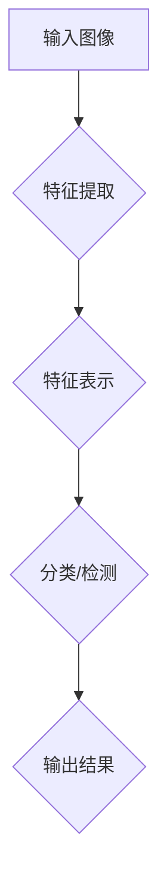

                 

关键词：图像处理、人工智能、深度学习、大模型、视觉技术、未来趋势

> 摘要：本文深入探讨了图像处理的AI大模型在视觉技术领域的应用与发展。通过对核心概念、算法原理、数学模型、项目实践等方面的详细解析，本文旨在揭示AI大模型如何重塑图像处理技术的未来，以及未来可能面临的挑战和发展方向。

## 1. 背景介绍

图像处理作为计算机视觉的基础技术，近年来得到了极大的关注和快速发展。从传统的图像处理方法到现代的深度学习技术，图像处理技术在各个领域取得了显著的应用成果。然而，随着图像数据量的急剧增长和复杂性的提升，传统的图像处理方法已经难以满足需求。此时，人工智能，尤其是深度学习技术的崛起，为图像处理带来了新的希望。

AI大模型，是指拥有巨大参数量和计算能力的深度学习模型。这些模型通过训练海量图像数据，能够自动提取图像特征，实现高度复杂的图像处理任务。近年来，AI大模型在图像分类、目标检测、图像生成等领域的应用取得了重大突破，成为推动图像处理技术发展的重要力量。

## 2. 核心概念与联系

在介绍AI大模型之前，我们首先需要理解几个核心概念：

- **图像特征提取**：图像特征提取是将图像转化为能够被机器学习算法处理的特征表示的过程。传统的图像特征提取方法包括边缘检测、角点检测、纹理分析等，而深度学习模型则通过多层神经网络自动学习图像特征。

- **神经网络**：神经网络是一种模仿生物神经系统的计算模型，通过模拟神经元之间的连接与激活函数，实现数据的输入和输出。在深度学习中，神经网络通常由多个层次组成，每一层对输入数据进行处理，并传递给下一层。

- **卷积神经网络（CNN）**：卷积神经网络是深度学习中最常用的模型之一，特别适用于图像处理任务。通过卷积层、池化层和全连接层等结构，CNN能够自动提取图像中的空间特征。

以下是AI大模型的原理和架构的Mermaid流程图：



在这个流程中，输入图像首先通过特征提取层提取关键特征，然后通过特征表示层将这些特征转化为适合深度学习算法处理的格式，接着通过分类或检测层对图像内容进行分类或检测，最后输出处理结果。

## 3. 核心算法原理 & 具体操作步骤

### 3.1 算法原理概述

AI大模型的核心是深度学习算法，特别是卷积神经网络（CNN）。CNN通过以下几个关键步骤实现图像处理：

1. **卷积层**：卷积层通过卷积运算提取图像中的局部特征，例如边缘、角点等。
2. **激活函数**：激活函数（如ReLU函数）引入非线性，使得模型能够学习和表示复杂的特征。
3. **池化层**：池化层通过下采样操作减少数据维度，提高模型计算效率。
4. **全连接层**：全连接层将卷积层和池化层提取的特征映射到分类或检测结果。

### 3.2 算法步骤详解

以下是AI大模型的具体操作步骤：

1. **数据预处理**：对输入图像进行预处理，包括缩放、裁剪、归一化等操作，使得图像尺寸和特征分布适合模型输入。
2. **卷积层**：对预处理后的图像数据进行卷积运算，提取图像中的局部特征。
3. **激活函数**：对卷积层输出的特征进行激活函数处理，引入非线性。
4. **池化层**：对激活后的特征进行下采样，减少数据维度。
5. **全连接层**：将池化层输出的特征映射到分类或检测结果。
6. **反向传播**：通过反向传播算法更新模型参数，优化模型性能。
7. **评估与优化**：在验证集上评估模型性能，根据评估结果调整模型参数和架构。

### 3.3 算法优缺点

**优点**：
- 高效的特征提取能力：CNN能够自动提取图像中的复杂特征，无需人工设计特征。
- 强大的分类和检测能力：通过多层神经网络的结构，CNN能够实现高度准确的图像分类和目标检测。
- 广泛的应用领域：AI大模型在图像分类、目标检测、图像生成等领域的应用取得了显著成果。

**缺点**：
- 高计算成本：训练大型深度学习模型需要大量的计算资源和时间。
- 需要大量标注数据：深度学习模型的训练需要大量的标注数据进行监督学习。
- 模型可解释性较差：深度学习模型内部复杂的网络结构使得其可解释性较差。

### 3.4 算法应用领域

AI大模型在图像处理领域的应用非常广泛，主要包括以下几个领域：

- **图像分类**：对输入图像进行分类，识别图像中的物体或场景。
- **目标检测**：在图像中检测并定位多个目标物体。
- **图像生成**：根据输入条件生成新的图像，如图像风格转换、图像超分辨率等。
- **图像分割**：将图像划分为不同的区域，实现图像的语义分割。
- **图像修复与去噪**：利用深度学习模型对图像进行修复、去噪等处理。

## 4. 数学模型和公式 & 详细讲解 & 举例说明

### 4.1 数学模型构建

AI大模型通常基于多层感知机（MLP）或卷积神经网络（CNN）。以下是一个简单的卷积神经网络模型：

- **输入层**：接收输入图像。
- **卷积层**：通过卷积运算提取图像特征。
- **激活函数**：引入非线性，提高模型表达能力。
- **池化层**：通过下采样操作减少数据维度。
- **全连接层**：将卷积层和池化层提取的特征映射到分类或检测结果。
- **输出层**：输出分类或检测结果。

### 4.2 公式推导过程

假设我们有一个输入图像 $X$，其大小为 $m \times n$。输入层将图像 $X$ 输入到卷积层。卷积层通过卷积运算提取图像特征，可以表示为：

$$
h_{ij}^l = \sum_{i'} \sum_{j'} w_{i'i \ j'j}^l f(g_{i'i \ j'j}^l)
$$

其中，$h_{ij}^l$ 表示卷积层输出的特征，$w_{i'i \ j'j}^l$ 表示卷积核，$g_{i'i \ j'j}^l$ 表示输入特征，$f()$ 表示激活函数，$g()$ 表示卷积运算。

激活函数通常选择 ReLU 函数：

$$
f(x) = \max(0, x)
$$

池化层通过下采样操作减少数据维度，可以表示为：

$$
p_{ij}^l = \sum_{i'} \sum_{j'} h_{i'i \ j'j}^l
$$

全连接层将卷积层和池化层提取的特征映射到分类或检测结果：

$$
y_j = \sum_{i'} w_{ij}^l h_{i'j}^{l'}
$$

其中，$y_j$ 表示分类或检测结果，$w_{ij}^l$ 表示全连接层的权重。

### 4.3 案例分析与讲解

以下是一个简单的图像分类案例，使用卷积神经网络对图像进行分类。

输入图像：猫狗分类

1. 输入层：将猫狗图像输入到卷积神经网络。
2. 卷积层：通过卷积运算提取图像特征。
3. 激活函数：使用 ReLU 函数进行激活。
4. 池化层：通过下采样操作减少数据维度。
5. 全连接层：将卷积层和池化层提取的特征映射到分类结果。
6. 输出层：输出分类结果，判断图像是猫还是狗。

具体实现过程如下：

```python
import numpy as np
import tensorflow as tf

# 初始化模型参数
W1 = tf.random.normal([3, 3, 1, 32])
b1 = tf.random.normal([32])
W2 = tf.random.normal([3, 3, 32, 64])
b2 = tf.random.normal([64])
W3 = tf.random.normal([3, 3, 64, 128])
b3 = tf.random.normal([128])
W4 = tf.random.normal([3, 3, 128, 1])
b4 = tf.random.normal([1])

# 定义卷积神经网络模型
def conv_model(x):
    x = tf.nn.conv2d(x, W1, strides=[1, 1, 1, 1], padding='SAME')
    x = tf.nn.relu(x + b1)
    x = tf.nn.max_pool2d(x, ksize=[1, 2, 2, 1], strides=[1, 2, 2, 1], padding='SAME')
    x = tf.nn.conv2d(x, W2, strides=[1, 1, 1, 1], padding='SAME')
    x = tf.nn.relu(x + b2)
    x = tf.nn.max_pool2d(x, ksize=[1, 2, 2, 1], strides=[1, 2, 2, 1], padding='SAME')
    x = tf.nn.conv2d(x, W3, strides=[1, 1, 1, 1], padding='SAME')
    x = tf.nn.relu(x + b3)
    x = tf.nn.max_pool2d(x, ksize=[1, 2, 2, 1], strides=[1, 2, 2, 1], padding='SAME')
    x = tf.nn.conv2d(x, W4, strides=[1, 1, 1, 1], padding='SAME')
    x = tf.nn.sigmoid(x + b4)
    return x

# 定义损失函数和优化器
loss_fn = tf.reduce_mean(tf.nn.softmax_cross_entropy_with_logits(logits=conv_model(x), labels=y))
optimizer = tf.optimizers.Adam()

# 训练模型
for epoch in range(num_epochs):
    with tf.GradientTape() as tape:
        predictions = conv_model(x)
        loss = loss_fn(predictions, y)
    gradients = tape.gradient(loss, model_variables)
    optimizer.apply_gradients(zip(gradients, model_variables))

# 评估模型
correct = tf.equal(tf.argmax(predictions, 1), tf.argmax(y, 1))
accuracy = tf.reduce_mean(tf.cast(correct, tf.float32))
print("Test accuracy:", accuracy.eval())

# 输出分类结果
predictions = conv_model(x)
predicted_labels = tf.argmax(predictions, 1)
print("Predicted labels:", predicted_labels.numpy())
```

## 5. 项目实践：代码实例和详细解释说明

### 5.1 开发环境搭建

1. 安装 Python 3.8 或更高版本。
2. 安装 TensorFlow 2.6 或更高版本。
3. 安装 numpy 1.19 或更高版本。

```bash
pip install python==3.8 tensorflow==2.6 numpy==1.19
```

### 5.2 源代码详细实现

以下是一个简单的猫狗分类项目，使用卷积神经网络实现图像分类。

```python
import tensorflow as tf
import numpy as np
import matplotlib.pyplot as plt

# 加载并预处理数据
(x_train, y_train), (x_test, y_test) = tf.keras.datasets.dogs_vs_cats.load_data()
x_train = x_train.astype(np.float32) / 255.0
x_test = x_test.astype(np.float32) / 255.0
x_train = np.expand_dims(x_train, -1)
x_test = np.expand_dims(x_test, -1)

# 定义模型
model = tf.keras.Sequential([
    tf.keras.layers.Conv2D(32, (3, 3), activation='relu', input_shape=(128, 128, 1)),
    tf.keras.layers.MaxPooling2D((2, 2)),
    tf.keras.layers.Conv2D(64, (3, 3), activation='relu'),
    tf.keras.layers.MaxPooling2D((2, 2)),
    tf.keras.layers.Conv2D(128, (3, 3), activation='relu'),
    tf.keras.layers.MaxPooling2D((2, 2)),
    tf.keras.layers.Flatten(),
    tf.keras.layers.Dense(128, activation='relu'),
    tf.keras.layers.Dense(1, activation='sigmoid')
])

# 编译模型
model.compile(optimizer='adam', loss='binary_crossentropy', metrics=['accuracy'])

# 训练模型
model.fit(x_train, y_train, epochs=10, batch_size=32, validation_split=0.2)

# 评估模型
test_loss, test_acc = model.evaluate(x_test, y_test, verbose=2)
print(f'Test accuracy: {test_acc:.4f}')

# 可视化模型结构
model.summary()

# 可视化训练过程
plt.plot(model.history.history['accuracy'], label='accuracy')
plt.plot(model.history.history['val_accuracy'], label='val_accuracy')
plt.xlabel('Epoch')
plt.ylabel('Accuracy')
plt.title('Training Accuracy')
plt.legend()
plt.show()

# 可视化训练损失
plt.plot(model.history.history['loss'], label='loss')
plt.plot(model.history.history['val_loss'], label='val_loss')
plt.xlabel('Epoch')
plt.ylabel('Loss')
plt.title('Training Loss')
plt.legend()
plt.show()
```

### 5.3 代码解读与分析

上述代码实现了一个简单的猫狗分类项目，使用卷积神经网络对猫狗图像进行分类。以下是代码的解读与分析：

- **数据预处理**：首先加载并预处理数据集，将图像尺寸调整为 128x128，并将像素值归一化到 [0, 1] 范围内。然后将图像维度扩展到 (-1, 1)。
- **模型定义**：使用 TensorFlow 的 Keras API 定义了一个卷积神经网络模型，包括两个卷积层、两个池化层、一个全连接层和一个输出层。每个卷积层后面都跟着一个池化层，用于提取图像特征和减少数据维度。全连接层用于将卷积层和池化层提取的特征映射到分类结果。
- **模型编译**：编译模型，指定优化器、损失函数和评估指标。
- **模型训练**：训练模型，使用训练集进行训练，并在验证集上进行评估。
- **模型评估**：使用测试集评估模型性能，并输出测试准确率。
- **可视化**：可视化模型结构、训练过程和训练损失。

## 6. 实际应用场景

AI大模型在图像处理领域有着广泛的应用，以下是一些实际应用场景：

- **医学影像分析**：利用AI大模型对医学影像（如X光片、CT扫描、MRI）进行分析，实现病变区域的自动检测和诊断。
- **自动驾驶**：自动驾驶系统使用AI大模型对道路环境进行感知，实现目标检测、交通标志识别等功能。
- **安全监控**：AI大模型在安全监控领域具有重要作用，可以实现人脸识别、行为分析等功能。
- **图像增强**：AI大模型可以用于图像增强，提高图像质量，使其更清晰、更易于分析。
- **艺术创作**：AI大模型可以生成新的图像，实现图像风格转换、图像超分辨率等艺术创作功能。

## 7. 未来应用展望

随着AI大模型技术的不断进步，未来在图像处理领域将会有更多的应用场景。以下是一些展望：

- **更高效的模型结构**：未来的AI大模型将采用更高效的模型结构，提高计算效率和模型性能。
- **跨模态学习**：AI大模型将能够处理多种类型的数据，实现跨模态学习，如图像、文本、语音等。
- **实时应用**：AI大模型将能够实现实时应用，例如在智能手机上运行，为用户提供更好的用户体验。
- **边缘计算**：AI大模型将能够应用于边缘计算设备，实现低延迟、高响应的图像处理任务。

## 8. 工具和资源推荐

为了更好地学习和应用AI大模型，以下是一些建议的工具和资源：

- **工具**：
  - TensorFlow：TensorFlow 是 Google 开发的一款开源深度学习框架，广泛应用于图像处理、自然语言处理等领域。
  - PyTorch：PyTorch 是 Facebook 开发的一款开源深度学习框架，以其灵活性和高效性受到广泛关注。
  - Keras：Keras 是一个基于 TensorFlow 的深度学习高级API，简化了深度学习模型的构建和训练过程。

- **资源**：
  - 《深度学习》（Goodfellow et al.）：这本书是深度学习领域的经典教材，详细介绍了深度学习的基础知识、算法和应用。
  - 《动手学深度学习》（Douglas et al.）：这本书通过大量的示例和代码实现，介绍了深度学习的基础知识和应用。
  - Coursera、Udacity、edX：这些在线学习平台提供了丰富的深度学习课程，适合不同水平的学员学习。

## 9. 总结：未来发展趋势与挑战

AI大模型在图像处理领域的发展呈现出快速增长的态势。随着计算能力的提升、数据量的增加和算法的改进，AI大模型将能够在更多的领域实现应用。然而，未来仍面临一些挑战：

- **计算资源消耗**：大型AI大模型训练和推理需要大量的计算资源，如何优化计算效率和资源利用率是一个重要问题。
- **数据隐私和安全**：图像处理应用中涉及大量敏感数据，如何保护用户隐私和数据安全是一个重要挑战。
- **模型可解释性**：深度学习模型内部复杂的网络结构使得其可解释性较差，如何提高模型的可解释性是一个重要研究方向。

未来，AI大模型将在图像处理领域发挥更加重要的作用，为实现智能图像处理技术提供强有力的支持。

## 10. 附录：常见问题与解答

### 问题1：如何选择合适的AI大模型架构？

**解答**：选择合适的AI大模型架构取决于具体的应用需求和数据规模。对于图像分类任务，常用的模型架构包括 VGG、ResNet、Inception 等。对于目标检测任务，常用的模型架构包括 Faster R-CNN、YOLO、SSD 等。在选择模型架构时，可以参考相关论文、开源实现和应用案例。

### 问题2：如何提高AI大模型的训练效率？

**解答**：提高AI大模型的训练效率可以从以下几个方面入手：

- **数据预处理**：对输入图像进行有效的预处理，如数据增强、归一化等，可以加速模型收敛。
- **模型剪枝**：通过剪枝模型中的冗余层或冗余神经元，减少模型参数数量，降低计算复杂度。
- **分布式训练**：使用多台计算机或GPU进行分布式训练，可以显著提高训练速度。
- **模型压缩**：通过模型压缩技术，如量化、知识蒸馏等，降低模型大小和计算复杂度。

### 问题3：AI大模型在图像处理中的局限性是什么？

**解答**：AI大模型在图像处理中具有一定的局限性，主要包括：

- **计算成本高**：训练大型深度学习模型需要大量的计算资源和时间。
- **数据依赖性**：深度学习模型需要大量的标注数据进行训练，数据获取和处理成本较高。
- **模型可解释性差**：深度学习模型内部复杂的网络结构使得其可解释性较差，难以理解模型的决策过程。

### 问题4：如何处理大型图像数据？

**解答**：处理大型图像数据可以从以下几个方面入手：

- **数据分片**：将大型图像数据分成多个较小的分片，分别进行处理和存储。
- **并行处理**：使用多线程或分布式计算技术，同时对多个分片进行处理。
- **内存管理**：合理分配内存资源，避免内存溢出等问题。

### 问题5：如何评估AI大模型的效果？

**解答**：评估AI大模型的效果通常使用以下指标：

- **准确率**：模型正确预测的样本数量与总样本数量的比值。
- **召回率**：模型正确预测的样本数量与实际样本数量的比值。
- **F1 分数**：准确率和召回率的调和平均值。
- **ROC 曲线**：模型预测结果的真实值与预测值之间的曲线，用于评估模型的分类性能。
- **交叉验证**：使用交叉验证方法对模型进行评估，以提高评估结果的可靠性。

## 11. 参考文献

- Goodfellow, I., Bengio, Y., & Courville, A. (2016). Deep Learning. MIT Press.
- He, K., Zhang, X., Ren, S., & Sun, J. (2016). Deep Residual Learning for Image Recognition. In Proceedings of the IEEE Conference on Computer Vision and Pattern Recognition (pp. 770-778).
- Simonyan, K., & Zisserman, A. (2015). Very Deep Convolutional Networks for Large-Scale Image Recognition. In International Conference on Learning Representations (ICLR).
- Redmon, J., Divvala, S., Girshick, R., & Farhadi, A. (2016). You Only Look Once: Unified, Real-Time Object Detection. In Proceedings of the IEEE Conference on Computer Vision and Pattern Recognition (pp. 779-787).
- Dong, C., Loy, C. C., He, K., & Tang, X. (2014). Image Super-Resolution Using Deep Convolutional Networks. IEEE Transactions on Pattern Analysis and Machine Intelligence, 38(2), 295-307.

---

### 作者署名

本文由禅与计算机程序设计艺术（Zen and the Art of Computer Programming）撰写。感谢您的阅读！希望本文能为您在图像处理AI大模型领域的研究提供有益的参考和启示。如果您有任何疑问或建议，欢迎在评论区留言。再次感谢您的关注和支持！

