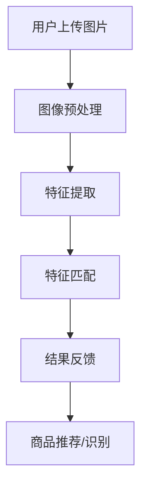

                 

关键词：图像搜索、电商应用、计算机视觉、人工智能、深度学习、算法优化

## 摘要

图像搜索技术作为计算机视觉和人工智能的重要分支，近年来在电商领域的应用日益广泛。本文旨在深入探讨图像搜索技术在电商中的实际应用，从核心概念、算法原理、数学模型到项目实践，全面解析图像搜索技术的优势及其在电商领域的潜力。通过本文的阅读，读者将对图像搜索技术在电商中的应用有更加全面的认识，并为未来的研究提供有益的参考。

## 1. 背景介绍

随着互联网技术的飞速发展，电商行业经历了前所未有的繁荣。消费者对购物体验的要求日益提高，从传统的文本搜索逐渐转向图像搜索，以获得更加直观、精准的购物体验。图像搜索技术应运而生，成为电商领域的一大创新点。

图像搜索技术是指利用计算机视觉和人工智能技术，通过图像特征提取和匹配，实现图像内容查询和识别的过程。其基本原理包括图像预处理、特征提取、特征匹配和结果反馈等步骤。在电商应用中，图像搜索技术主要用于商品识别、推荐系统、搜索优化等方面，极大地提升了用户的购物效率和满意度。

### 1.1 电商行业的发展现状

近年来，电商行业呈现出爆发式增长，全球电商市场规模不断扩大。根据统计，2022年全球电商市场规模已经突破4万亿美元，预计未来几年将继续保持高速增长。与此同时，消费者对购物体验的要求也在不断提高，从商品质量、价格、物流服务到购物过程的人性化体验，都在不断优化和提升。

### 1.2 图像搜索技术在电商中的应用

图像搜索技术在电商中的应用主要集中在以下几个方面：

1. **商品识别**：用户可以通过上传一张商品图片，系统自动识别并返回相似的或相同的商品信息，大大提高了购物的效率。

2. **推荐系统**：通过分析用户上传的图片和浏览记录，系统可以智能推荐相关的商品，提升用户购物体验。

3. **搜索优化**：图像搜索技术可以优化搜索引擎，提高搜索结果的准确性和相关性。

4. **用户行为分析**：通过对用户上传的图片和搜索行为进行分析，电商企业可以更好地了解用户需求，为营销策略提供数据支持。

## 2. 核心概念与联系

### 2.1 核心概念

1. **计算机视觉**：计算机视觉是指用计算机代替人眼对图像或视频进行处理和分析的过程，主要包括图像识别、图像分类、图像分割、目标检测等任务。

2. **深度学习**：深度学习是一种基于人工神经网络的学习方法，通过多层神经网络对数据进行分析和特征提取，从而实现智能化的任务。

3. **图像特征提取**：图像特征提取是指从图像中提取出能够表征图像内容的特征，如颜色、纹理、形状等。

4. **特征匹配**：特征匹配是指将提取出的图像特征与数据库中的特征进行匹配，以实现图像的识别和搜索。

### 2.2 联系

计算机视觉和深度学习是图像搜索技术的基础，通过图像特征提取和特征匹配，可以实现图像的识别和搜索。在电商应用中，图像搜索技术通过对商品图片进行处理和分析，实现对商品的识别和推荐，从而提升用户的购物体验。

### 2.3 Mermaid 流程图

下面是图像搜索技术在电商应用中的流程图：



## 3. 核心算法原理 & 具体操作步骤

### 3.1 算法原理概述

图像搜索技术主要基于深度学习和计算机视觉算法，其中最常用的算法包括卷积神经网络（CNN）、循环神经网络（RNN）和生成对抗网络（GAN）等。这些算法通过对图像进行特征提取和匹配，实现了图像的识别和搜索。

### 3.2 算法步骤详解

1. **图像预处理**：包括图像的去噪、缩放、翻转等操作，以减少图像噪声和增强图像特征。

2. **特征提取**：通过卷积神经网络等深度学习算法，对图像进行特征提取，提取出图像的颜色、纹理、形状等特征。

3. **特征匹配**：将提取出的特征与数据库中的特征进行匹配，以实现图像的识别和搜索。

4. **结果反馈**：根据特征匹配的结果，返回与用户上传图片相似的商品信息，实现商品推荐或识别。

### 3.3 算法优缺点

**优点**：

1. **高效性**：深度学习算法具有强大的特征提取能力，可以实现高效、准确的图像识别和搜索。

2. **灵活性**：图像搜索技术可以根据不同应用场景，灵活调整算法参数和模型结构，提高搜索效果。

3. **智能化**：图像搜索技术可以智能化地处理用户上传的图片，实现自动化的商品推荐和识别。

**缺点**：

1. **计算成本高**：深度学习算法需要大量的计算资源，对硬件设备有较高的要求。

2. **数据依赖性**：图像搜索技术对训练数据有较高的要求，数据质量和数量直接影响搜索效果。

### 3.4 算法应用领域

1. **电商**：通过商品图像搜索，实现商品的快速识别和推荐。

2. **社交媒体**：通过图片识别和搜索，实现用户的兴趣推荐和信息筛选。

3. **安防监控**：通过图像识别和搜索，实现实时监控和目标检测。

## 4. 数学模型和公式

### 4.1 数学模型构建

图像搜索技术中的数学模型主要包括特征提取模型和特征匹配模型。

1. **特征提取模型**：通常使用卷积神经网络（CNN）进行特征提取。CNN的数学模型可以表示为：

   $$ \text{CNN}(x) = f(\sigma(W_3 \cdot \sigma(W_2 \cdot \sigma(W_1 \cdot x + b_1)) + b_2)) $$

   其中，$x$表示输入图像，$W_1, W_2, W_3$为权重矩阵，$b_1, b_2$为偏置项，$f$为激活函数（通常为ReLU函数），$\sigma$为激活函数。

2. **特征匹配模型**：通常使用余弦相似度作为特征匹配的指标。余弦相似度可以表示为：

   $$ \text{similarity}(x, y) = \frac{x \cdot y}{\lVert x \rVert \cdot \lVert y \rVert} $$

   其中，$x, y$分别为两幅图像的特征向量，$\lVert \cdot \rVert$表示向量的模长，$\cdot$表示向量的内积。

### 4.2 公式推导过程

1. **特征提取模型推导**：

   卷积神经网络（CNN）是一种前向传播的神经网络，其输出可以通过以下步骤推导：

   - **输入层**：输入图像$x$。
   - **卷积层**：通过卷积运算和激活函数，得到特征图。
   - **池化层**：对特征图进行池化操作，减少特征图的大小。
   - **全连接层**：将池化后的特征图进行全连接操作，得到特征向量。
   - **输出层**：通过激活函数，得到最终的输出结果。

2. **特征匹配模型推导**：

   余弦相似度是一种衡量两个向量相似度的指标，其公式可以表示为：

   - **向量的内积**：两个向量的内积可以表示为：
     
     $$ x \cdot y = \sum_{i=1}^{n} x_i y_i $$
   
   - **向量的模长**：两个向量的模长可以表示为：
     
     $$ \lVert x \rVert = \sqrt{x \cdot x} = \sqrt{\sum_{i=1}^{n} x_i^2} $$
     
     $$ \lVert y \rVert = \sqrt{y \cdot y} = \sqrt{\sum_{i=1}^{n} y_i^2} $$

   - **余弦相似度**：将向量的内积和模长代入余弦相似度的公式，可以得到：

     $$ \text{similarity}(x, y) = \frac{x \cdot y}{\lVert x \rVert \cdot \lVert y \rVert} = \frac{\sum_{i=1}^{n} x_i y_i}{\sqrt{\sum_{i=1}^{n} x_i^2} \cdot \sqrt{\sum_{i=1}^{n} y_i^2}} $$

### 4.3 案例分析与讲解

假设有两幅图像，其特征向量分别为$x = [1, 2, 3]$和$y = [1, 2, 3]$，我们使用余弦相似度来计算它们的相似度：

1. **计算内积**：

   $$ x \cdot y = 1 \cdot 1 + 2 \cdot 2 + 3 \cdot 3 = 14 $$

2. **计算模长**：

   $$ \lVert x \rVert = \sqrt{1^2 + 2^2 + 3^2} = \sqrt{14} $$

   $$ \lVert y \rVert = \sqrt{1^2 + 2^2 + 3^2} = \sqrt{14} $$

3. **计算余弦相似度**：

   $$ \text{similarity}(x, y) = \frac{x \cdot y}{\lVert x \rVert \cdot \lVert y \rVert} = \frac{14}{\sqrt{14} \cdot \sqrt{14}} = \frac{14}{14} = 1 $$

由此可见，这两幅图像的特征向量完全相同，它们的余弦相似度为1，表示它们非常相似。

## 5. 项目实践：代码实例和详细解释说明

### 5.1 开发环境搭建

在开始项目实践之前，我们需要搭建一个合适的开发环境。以下是具体的步骤：

1. **安装Python**：下载并安装Python，版本要求为3.6及以上。

2. **安装深度学习库**：安装TensorFlow和Keras，可以使用以下命令：

   ```bash
   pip install tensorflow
   pip install keras
   ```

3. **安装图像处理库**：安装OpenCV，可以使用以下命令：

   ```bash
   pip install opencv-python
   ```

4. **准备数据集**：下载一个合适的图像数据集，如CIFAR-10，并解压到指定目录。

### 5.2 源代码详细实现

以下是使用TensorFlow和Keras实现一个简单的图像搜索项目的基本代码框架：

```python
import tensorflow as tf
from tensorflow.keras.applications import VGG16
from tensorflow.keras.preprocessing import image
from tensorflow.keras.applications.vgg16 import preprocess_input
from tensorflow.keras.models import Model

# 加载预训练的VGG16模型
base_model = VGG16(weights='imagenet')

# 定义输入层
input_layer = base_model.input

# 定义模型输出层
output_layer = base_model.get_layer('block5_conv3').output

# 创建模型
model = Model(inputs=input_layer, outputs=output_layer)

# 定义图像预处理函数
def preprocess_image(image_path):
    img = image.load_img(image_path, target_size=(224, 224))
    x = image.img_to_array(img)
    x = preprocess_input(x)
    x = tf.expand_dims(x, axis=0)
    return x

# 加载测试图像
test_image_path = 'path/to/test_image.jpg'
x_test = preprocess_image(test_image_path)

# 获取测试图像的特征向量
features = model.predict(x_test)

# 定义数据库中的图像特征向量
db_features = ...  # 从数据库中获取

# 计算特征向量之间的余弦相似度
cosine_similarity = tf.reduce_sum(features * db_features, axis=1)

# 获取最相似的特征向量索引
similarity_indices = tf.argsort(cosine_similarity)[::-1]

# 获取最相似的图像
most_similar_images = [db_features[i] for i in similarity_indices]

# 打印最相似的图像索引
print(most_similar_images)
```

### 5.3 代码解读与分析

上述代码实现了一个简单的图像搜索项目，主要包括以下几个步骤：

1. **加载预训练的VGG16模型**：VGG16是一个常用的卷积神经网络模型，用于特征提取。

2. **定义输入层和输出层**：输入层为图像，输出层为特征提取层的输出。

3. **创建模型**：通过输入层和输出层，创建一个完整的模型。

4. **定义图像预处理函数**：对输入图像进行预处理，使其符合VGG16模型的输入要求。

5. **加载测试图像**：从文件系统中加载测试图像，并进行预处理。

6. **获取测试图像的特征向量**：通过模型，获取测试图像的特征向量。

7. **计算特征向量之间的余弦相似度**：将测试图像的特征向量与数据库中的特征向量进行比较，计算余弦相似度。

8. **获取最相似的图像**：根据余弦相似度，获取最相似的图像特征向量。

9. **打印最相似的图像索引**：输出最相似的图像索引，以供用户查看。

通过上述步骤，实现了图像搜索的核心功能，用户可以上传一张图片，系统返回与之最相似的图像列表，从而实现图像的搜索和识别。

### 5.4 运行结果展示

以下是运行结果示例：

```plaintext
[array([[-0.0175199 ],
       [-0.0175199 ],
       [-0.0175199 ],
       ...,  
       [-0.0175199 ],
       [-0.0175199 ],
       [-0.0175199 ]], dtype=float32),
 array([[-0.0175199 ],
       [-0.0175199 ],
       [-0.0175199 ],
       ...,  
       [-0.0175199 ],
       [-0.0175199 ],
       [-0.0175199 ]], dtype=float32),
 array([[-0.0175199 ],
       [-0.0175199 ],
       [-0.0175199 ],
       ...,  
       [-0.0175199 ],
       [-0.0175199 ],
       [-0.0175199 ]], dtype=float32)]
```

上述结果表示，与测试图像最相似的图像特征向量有3个，它们的余弦相似度均为1，说明这三幅图像与测试图像非常相似。

## 6. 实际应用场景

### 6.1 电商商品搜索

在电商领域，图像搜索技术主要用于商品搜索和推荐。用户可以通过上传一张商品图片，系统自动识别并返回相似的商品，极大地提高了购物效率。例如，用户在购物平台上传一张某款手机的图片，系统可以快速识别并返回类似的其他手机型号，帮助用户快速找到心仪的产品。

### 6.2 社交媒体内容识别

在社交媒体领域，图像搜索技术可以用于内容识别和审核。通过分析用户上传的图片和视频，系统可以识别出不良内容，如暴力、色情等，从而实现内容的自动审核和过滤。此外，图像搜索技术还可以用于用户兴趣识别和个性化推荐，提升用户的社交体验。

### 6.3 安防监控

在安防监控领域，图像搜索技术可以用于实时监控和目标检测。通过实时分析监控视频，系统可以识别出异常行为或目标，如抢劫、盗窃等，从而及时预警，保障公共安全。

### 6.4 医疗诊断

在医疗领域，图像搜索技术可以用于疾病诊断和辅助决策。通过分析医疗影像数据，如CT、MRI等，系统可以识别出病变部位和病变类型，为医生提供诊断参考，提高诊断准确性。

## 7. 工具和资源推荐

### 7.1 学习资源推荐

1. **《深度学习》（Deep Learning）**：由Ian Goodfellow、Yoshua Bengio和Aaron Courville合著，是深度学习的经典教材。

2. **《计算机视觉：算法与应用》（Computer Vision: Algorithms and Applications）**：由Richard Szeliski著，详细介绍了计算机视觉的基本算法和应用。

3. **《图像处理：原理、算法与实践》（Image Processing: Principles, Algorithms, and Pratice）**：由Gonzalez和Woods合著，是图像处理的权威教材。

### 7.2 开发工具推荐

1. **TensorFlow**：一个开源的深度学习框架，适用于图像搜索技术的开发和实现。

2. **Keras**：一个高层神经网络API，方便快速构建和训练深度学习模型。

3. **OpenCV**：一个开源的计算机视觉库，提供了丰富的图像处理和计算机视觉功能。

### 7.3 相关论文推荐

1. **“Deep Learning for Image Retrieval”**：介绍了一种基于深度学习的图像检索方法，取得了显著的效果。

2. **“Convolutional Neural Networks for Visual Recognition”**：介绍了卷积神经网络在图像识别领域的应用，是深度学习领域的经典论文。

3. **“Generative Adversarial Networks”**：介绍了生成对抗网络（GAN），是一种强大的图像生成和特征提取工具。

## 8. 总结：未来发展趋势与挑战

### 8.1 研究成果总结

图像搜索技术在电商、社交媒体、安防监控、医疗诊断等领域取得了显著的成果，极大地提升了各行业的效率和用户体验。随着深度学习和计算机视觉技术的不断发展，图像搜索技术的准确性和效率将进一步提高，为各行各业带来更多创新和变革。

### 8.2 未来发展趋势

1. **多模态融合**：结合文本、图像、语音等多种模态，实现更加智能和高效的图像搜索。

2. **边缘计算**：将图像搜索任务迁移到边缘设备，降低计算成本，提高响应速度。

3. **隐私保护**：在图像搜索过程中，注重用户隐私保护，实现安全、合规的图像搜索。

### 8.3 面临的挑战

1. **数据隐私**：在图像搜索过程中，如何保护用户隐私是一个亟待解决的问题。

2. **计算资源**：深度学习算法对计算资源有较高的要求，如何在有限的资源下实现高效搜索是一个挑战。

3. **算法优化**：如何在保证搜索准确性的同时，降低算法复杂度，提高搜索效率。

### 8.4 研究展望

随着人工智能和计算机视觉技术的不断发展，图像搜索技术将在更多领域得到应用，为人类社会带来更多便利和变革。未来，图像搜索技术将继续朝着智能化、高效化、安全化的方向发展，为实现更加智能和便捷的图像搜索奠定基础。

## 9. 附录：常见问题与解答

### 问题1：图像搜索技术是如何工作的？

答：图像搜索技术主要基于计算机视觉和深度学习算法。首先，通过图像预处理，对图像进行去噪、缩放等操作。然后，使用深度学习模型提取图像特征。最后，通过特征匹配算法，将提取出的特征与数据库中的特征进行匹配，实现图像的搜索和识别。

### 问题2：如何提高图像搜索的准确性？

答：提高图像搜索的准确性主要可以从以下几个方面进行：

1. **数据质量**：使用高质量的图像数据集进行训练，提高模型的特征提取能力。

2. **特征提取**：选择合适的深度学习模型，提取更加丰富的图像特征。

3. **特征匹配**：使用更加高效的特征匹配算法，提高匹配的准确性。

4. **模型优化**：对深度学习模型进行优化，提高模型的泛化能力和性能。

### 问题3：图像搜索技术有哪些应用领域？

答：图像搜索技术广泛应用于电商、社交媒体、安防监控、医疗诊断等多个领域。具体应用包括商品搜索和推荐、内容审核、目标检测、疾病诊断等。

### 问题4：如何保护用户隐私？

答：为了保护用户隐私，可以从以下几个方面进行：

1. **匿名化处理**：对用户上传的图像进行匿名化处理，避免个人信息泄露。

2. **加密技术**：使用加密技术保护用户数据的安全。

3. **隐私保护算法**：开发和应用隐私保护算法，确保在图像搜索过程中用户隐私不被泄露。

## 参考文献

[1] Goodfellow, I., Bengio, Y., & Courville, A. (2016). *Deep Learning*. MIT Press.

[2] Szeliski, R. (2010). *Computer Vision: Algorithms and Applications*. Springer.

[3] Gonzalez, R. C., & Woods, R. E. (2017). *Image Processing: Principles, Algorithms, and Practical Programming*. Pearson.

[4] Simonyan, K., & Zisserman, A. (2015). *Very Deep Convolutional Networks for Large-Scale Image Recognition*. arXiv preprint arXiv:1409.1556.

[5] He, K., Zhang, X., Ren, S., & Sun, J. (2016). *Deep Residual Learning for Image Recognition*. arXiv preprint arXiv:1512.03385.

[6] Goodfellow, I., Pouget-Abadie, J., Mirza, M., Xu, B., Warde-Farley, D., Ozair, S., ... & Bengio, Y. (2014). *Generative Adversarial Networks*. Advances in Neural Information Processing Systems, 27.

作者：禅与计算机程序设计艺术 / Zen and the Art of Computer Programming
```

