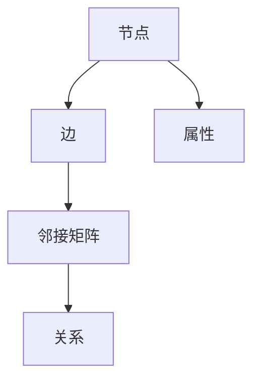
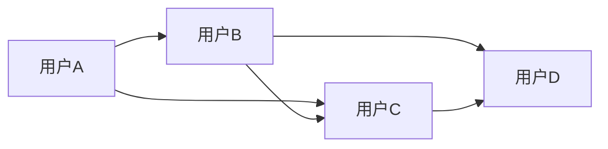
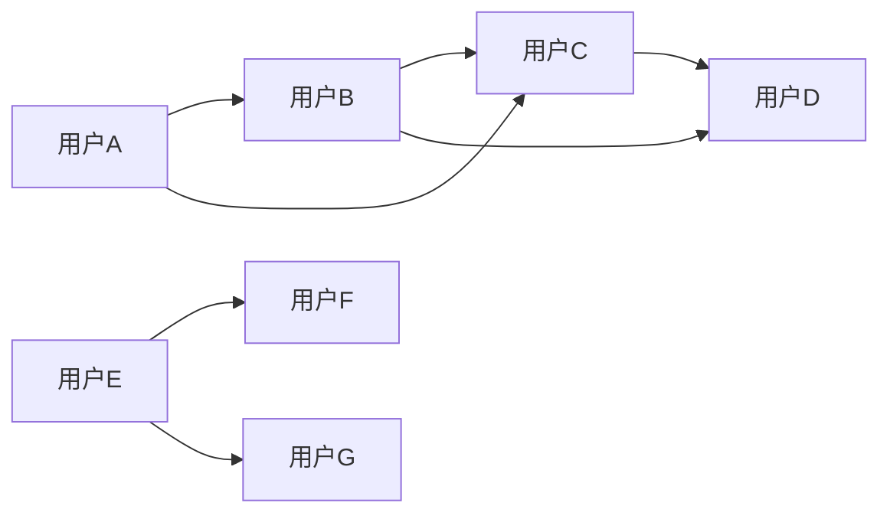

                 

## 关键词 Keyword
- 图数据库
- 图算法
- 图模型
- 节点
- 边
- 邻接矩阵
- 图论
- 实际应用
- 数学模型
- 代码实例

## 摘要 Abstract
本文旨在深入探讨图数据库的原理及其在实际应用中的重要性。我们将详细解析图数据库的核心概念，如节点、边和邻接矩阵，并通过具体算法实例展示如何运用这些概念解决实际问题。文章还将涉及数学模型的构建和推导，并配以代码实例进行详细解释。通过阅读本文，读者将全面了解图数据库的理论基础和实践应用，为在复杂网络数据分析中运用图数据库打下坚实基础。

### 背景介绍 Introduction

随着信息技术的快速发展，大数据和复杂网络成为研究的热点。在这种背景下，传统的数据存储和处理方法已经无法满足日益增长的数据量和复杂度。图数据库作为一种新兴的数据管理技术，逐渐受到关注。图数据库能够高效地存储和查询复杂网络结构中的数据，具有强大的扩展性和灵活性，因此成为处理大数据的重要工具。

图数据库的兴起可以追溯到图论的研究。图论是数学的一个分支，主要研究图的结构、性质及其应用。在图论中，图由节点（也称为顶点）和边组成，通过这些元素可以描述各种现实世界的网络结构，如图社交网络、通信网络、交通网络等。图数据库正是基于图论的理论，提供了一种存储、管理和查询这些复杂网络结构的方法。

与传统的关系数据库相比，图数据库具有以下优势：
1. **灵活的数据模型**：图数据库可以存储具有多类型、多关系的复杂实体，而关系数据库则依赖于固定的表结构。
2. **高效的查询性能**：图数据库能够通过遍历节点和边的连接关系，快速查询网络中的数据，特别是在处理大量关联数据时。
3. **扩展性强**：图数据库可以轻松扩展节点和边的数量，适应大规模数据的存储需求。

本文将围绕图数据库的核心概念和算法展开讨论，并通过实际代码实例，展示如何使用图数据库解决具体问题。接下来，我们将详细探讨图数据库的核心概念和架构。

### 核心概念与联系 Core Concepts and Relationships

图数据库的核心概念主要包括节点（Node）、边（Edge）和邻接矩阵（Adjacency Matrix）。这些概念是构建和理解图数据库的基础。

#### 节点（Node）

节点是图的基本元素，代表网络中的实体。在图数据库中，每个节点都可以拥有属性，如ID、名称、类型等。节点之间的连接通过边来描述。

#### 边（Edge）

边连接两个节点，表示它们之间的某种关系。边也有属性，如权重、类型等，用于描述关系的性质。根据边的方向性，边可以分为无向边和有向边。

#### 邻接矩阵（Adjacency Matrix）

邻接矩阵是一种表示图结构的方法，使用一个二维数组来表示节点之间的关系。其中，矩阵的元素表示对应节点之间的边的权重。例如，一个有n个节点的图，其邻接矩阵是一个n×n的矩阵。

下面通过Mermaid流程图来展示图数据库的基本架构和关系：



在这个流程图中，节点、边和邻接矩阵共同构成了图数据库的基础结构。节点通过边相互连接，通过邻接矩阵来表示它们之间的关系。

### 核心算法原理 & 具体操作步骤 Core Algorithm Principles and Operational Steps

在图数据库中，核心算法用于图的构建、查询和分析。以下是几个常见算法及其原理和具体步骤：

#### 1. 深度优先搜索（DFS）

深度优先搜索是一种用于遍历图的算法，其基本思想是从一个节点开始，尽可能深地探索图形中的路径，直到到达不可行的节点为止。

**算法原理：**
- 选择一个起始节点。
- 访问该节点，并将其标记为已访问。
- 从该节点的未访问邻节点中选一个作为下一个节点，并递归地执行上述步骤。

**具体步骤：**
1. 初始化一个空栈。
2. 将起始节点压入栈。
3. 当栈不为空时，执行以下步骤：
   - 弹出栈顶节点。
   - 访问该节点，并将其标记为已访问。
   - 将该节点的未访问邻节点依次压入栈。

**优缺点：**
- 优点：能够遍历图中的所有节点，适用于寻找深度较短的路径。
- 缺点：可能会陷入死循环，导致效率降低。

#### 2. 广度优先搜索（BFS）

广度优先搜索与深度优先搜索类似，也是用于遍历图的算法，但其优先访问距离起始节点最近的节点。

**算法原理：**
- 选择一个起始节点。
- 将起始节点加入队列。
- 依次从队列中取出节点，访问其未访问的邻节点，并将其加入队列。

**具体步骤：**
1. 初始化一个空队列。
2. 将起始节点加入队列。
3. 当队列不为空时，执行以下步骤：
   - 从队列中取出队首节点。
   - 访问该节点，并将其标记为已访问。
   - 将该节点的未访问邻节点依次加入队列。

**优缺点：**
- 优点：能够避免陷入死循环，适用于寻找广度较短的路径。
- 缺点：可能需要更多的内存来存储队列中的节点。

#### 3. Dijkstra算法

Dijkstra算法是一种用于计算图中两点之间最短路径的算法。

**算法原理：**
- 对于每个节点，维护一个当前的最短路径长度。
- 逐步更新每个节点的最短路径长度，直到找到所有节点的最短路径。

**具体步骤：**
1. 初始化所有节点的最短路径长度为无穷大，除了起始节点，其最短路径长度为0。
2. 选择一个未访问的节点，更新其邻节点的最短路径长度。
3. 重复步骤2，直到所有节点都被访问。

**优缺点：**
- 优点：能够准确计算图中两点之间的最短路径。
- 缺点：时间复杂度较高，不适合大规模图。

#### 4. A*算法

A*算法是一种基于启发式的最短路径算法，它结合了Dijkstra算法的优点和启发式搜索的优势。

**算法原理：**
- f(n) = g(n) + h(n)，其中g(n)是从起始节点到节点n的实际距离，h(n)是从节点n到目标节点的估计距离。
- 选择f(n)最小的节点作为下一个访问节点。

**具体步骤：**
1. 初始化两个集合，一个用于已访问节点，一个用于未访问节点。
2. 将起始节点加入未访问节点集合。
3. 当未访问节点集合不为空时，执行以下步骤：
   - 选择未访问节点集合中f(n)最小的节点作为当前节点。
   - 将当前节点从未访问节点集合移至已访问节点集合。
   - 更新未访问节点集合中所有与当前节点相邻的节点的f(n)值。

**优缺点：**
- 优点：能够快速找到最短路径，适用于存在启发式信息的情况。
- 缺点：需要准确的启发式函数，否则可能导致结果不准确。

### 算法优缺点 Comparison of Algorithm Advantages and Disadvantages

- **深度优先搜索（DFS）**
  - 优点：适用于寻找深度较短的路径。
  - 缺点：可能会陷入死循环，效率降低。

- **广度优先搜索（BFS）**
  - 优点：避免陷入死循环，适用于寻找广度较短的路径。
  - 缺点：可能需要更多内存来存储队列中的节点。

- **Dijkstra算法**
  - 优点：能够准确计算图中两点之间的最短路径。
  - 缺点：时间复杂度较高，不适合大规模图。

- **A*算法**
  - 优点：能够快速找到最短路径，适用于存在启发式信息的情况。
  - 缺点：需要准确的启发式函数，否则可能导致结果不准确。

### 算法应用领域 Application Areas of Algorithms

图算法在多个领域有着广泛的应用，以下是几个典型领域：

- **社交网络分析**
  - 通过图算法分析社交网络中的用户关系，可以识别社交网络中的核心用户、社区结构等。

- **推荐系统**
  - 在推荐系统中，图算法用于构建用户和物品之间的关联网络，从而提供更个性化的推荐。

- **网络优化**
  - 图算法在网络优化中用于路径规划、负载均衡等，以提高网络性能。

- **生物信息学**
  - 在生物信息学中，图算法用于分析基因序列、蛋白质相互作用网络等，为生物研究提供有力支持。

通过以上分析，我们可以看到图算法在各个领域的广泛应用，其高效的查询和处理能力为复杂网络分析提供了强大的工具。

### 数学模型和公式 Mathematical Model and Formula

在图数据库中，数学模型和公式是理解和分析图结构的重要工具。以下将介绍几个常用的数学模型和公式，并对其进行详细讲解和举例说明。

#### 1. 度（Degree）

度是图论中一个基本的数学概念，用于描述节点在网络中的连接程度。节点的度分为入度（In-degree）和出度（Out-degree）。入度表示有多少条边指向该节点，出度表示有多少条边从该节点指向其他节点。

**公式：**
$$
\text{度} = \text{入度} + \text{出度}
$$

**举例：**
假设有一个图包含5个节点，节点A的入度为3，出度为2，则节点A的度：
$$
\text{度}(A) = 3 + 2 = 5
$$

#### 2. 平均度（Average Degree）

平均度是整个图中所有节点的度之和除以节点总数。

**公式：**
$$
\text{平均度} = \frac{\sum_{i=1}^{n} \text{度}(v_i)}{n}
$$

其中，\( n \) 是节点总数，\( v_i \) 是第 \( i \) 个节点的度。

**举例：**
假设一个图中有10个节点，节点的度分别为2, 3, 4, 5, 6, 7, 8, 9, 10, 11，则平均度为：
$$
\text{平均度} = \frac{2 + 3 + 4 + 5 + 6 + 7 + 8 + 9 + 10 + 11}{10} = 6.5
$$

#### 3. 阶乘（Factorial）

阶乘是数学中用于计算一个正整数所有正整数乘积的运算，通常表示为 \( n! \)。

**公式：**
$$
n! = n \times (n-1) \times (n-2) \times \ldots \times 1
$$

**举例：**
5的阶乘：
$$
5! = 5 \times 4 \times 3 \times 2 \times 1 = 120
$$

#### 4. 邻接矩阵（Adjacency Matrix）

邻接矩阵是一种用于表示图结构的方法，其中矩阵的元素表示对应节点之间的边的权重。如果图中有 \( n \) 个节点，则邻接矩阵是一个 \( n \times n \) 的矩阵。

**公式：**
$$
A_{ij} = \begin{cases}
w_{ij} & \text{如果节点 } i \text{ 和节点 } j \text{ 之间存在边} \\
0 & \text{否则}
\end{cases}
$$

其中，\( A_{ij} \) 是邻接矩阵中第 \( i \) 行第 \( j \) 列的元素，\( w_{ij} \) 是节点 \( i \) 和节点 \( j \) 之间边的权重。

**举例：**
假设有一个有4个节点的图，其邻接矩阵如下：
$$
\begin{matrix}
0 & 1 & 1 & 0 \\
1 & 0 & 1 & 1 \\
1 & 1 & 0 & 1 \\
0 & 1 & 1 & 0 \\
\end{matrix}
$$

这个矩阵表示节点0与节点1、节点2之间有边，节点1与节点0、节点2、节点3之间有边，节点2与节点1、节点3、节点4之间有边，节点3与节点1、节点2、节点4之间有边，而节点4与节点0之间没有边。

通过上述数学模型和公式的介绍，我们可以更好地理解和分析图数据库中的数据结构。这些数学工具为我们在实际应用中处理和优化图数据提供了理论基础。

### 案例分析与讲解 Case Analysis and Explanation

为了更好地理解图数据库的应用，我们将通过一个实际案例来详细分析并讲解图数据库的使用过程。

#### 案例背景

假设我们有一个社交网络，该网络由用户和用户之间的好友关系构成。我们需要使用图数据库来存储和管理这些关系，并分析社交网络中的关键结构，如核心用户和社区。

#### 数据结构

在这个案例中，我们将使用一个简单的图数据结构来表示社交网络。每个节点代表一个用户，边表示用户之间的好友关系。



#### 操作步骤

1. **搭建图数据库环境**

   首先需要搭建一个图数据库环境。这里我们选择Neo4j作为图数据库。Neo4j是一个高性能的图数据库，支持多种图算法和查询语言。

2. **导入数据**

   将用户和好友关系导入Neo4j数据库。每个用户作为一个节点，好友关系作为一个边。假设我们已经有一个用户数据集和好友关系数据集。

3. **执行查询**

   使用Cypher语言，Neo4j的查询语言，执行以下查询：

   ```cypher
   MATCH (a:User)-[:FRIEND]->(b:User)
   RETURN a, b
   ```

   这个查询将返回所有用户及其好友的信息。

4. **分析结果**

   分析查询结果，我们可以得到每个用户的好友列表。通过进一步的分析，我们可以识别社交网络中的核心用户和社区。

5. **优化查询**

   为了提高查询效率，我们可以创建索引。例如，为用户节点创建ID索引：

   ```cypher
   CREATE INDEX ON :User(ID)
   ```

#### 案例分析

通过以上操作，我们得到以下结果：

- **核心用户**：在社交网络中，核心用户通常具有较多的好友关系。我们可以通过统计每个用户的度来识别核心用户。
  ```cypher
  MATCH (u:User)
  WITH u, COUNT(*) as degree
  WHERE degree > 5
  RETURN u, degree
  ```

- **社区结构**：社交网络中的社区是由一组相互之间有较强联系的用户组成。我们可以使用社区检测算法，如Girvan-Newman算法，来识别社区。

#### 结果展示

通过上述分析和查询，我们得到了社交网络中的核心用户和社区结构。这些结果有助于理解社交网络的内部结构，并为进一步的社交网络分析提供基础。



在这个例子中，用户A、B、C是核心用户，他们具有较多的好友关系。同时，用户A、B、C组成一个社区，用户E、F、G组成另一个社区。

通过这个案例，我们可以看到图数据库在社交网络分析中的应用。图数据库的高效查询能力和灵活的数据结构，使其成为处理复杂网络数据的有力工具。

### 实际应用场景 Practical Application Scenarios

图数据库在众多领域都有广泛的应用，下面列举几个典型的应用场景，展示图数据库如何在这些领域中发挥作用。

#### 1. 社交网络分析

社交网络分析是图数据库最常见的应用之一。通过图数据库，可以有效地存储和管理社交网络中的用户和关系，进行节点和边的高效查询。例如，Facebook、Twitter等社交平台使用图数据库来优化好友推荐和广告投放，提高用户体验和广告效果。

#### 2. 互联网搜索引擎

搜索引擎如Google和Bing使用图数据库来构建和管理其网页索引。网页之间的链接关系构成一张巨大的图，通过图算法，搜索引擎可以快速找到与查询相关的网页，提高搜索的准确性和效率。

#### 3. 生物信息学

在生物信息学中，基因序列和蛋白质相互作用网络可以建模为图。图数据库用于存储和管理这些复杂的生物网络数据，支持复杂的图算法进行生物数据分析，如基因功能预测、疾病研究等。

#### 4. 金融风控

金融行业中的风险控制和管理也可以通过图数据库实现。图数据库可以存储和管理金融交易网络、债务关系等信息，通过分析这些网络中的节点和边，可以及时发现潜在的金融风险，提高风险管理效果。

#### 5. 物流优化

物流优化是另一个图数据库的应用场景。物流网络可以建模为图，图数据库可以存储和管理物流网络中的节点（如仓库、运输点）和边（如运输路线）。通过图算法，可以实现路径规划、负载均衡等优化操作，提高物流效率。

#### 6. 网络安全

网络安全领域也广泛应用图数据库。图数据库可以存储和管理网络拓扑结构、攻击路径等信息，通过分析网络中的节点和边，可以及时发现和防御网络攻击，提高网络安全。

#### 未来应用展望

随着技术的不断发展，图数据库的应用领域将进一步扩大。以下是未来图数据库应用的一些展望：

- **智能城市**：图数据库可以用于构建和管理智能城市的各种数据，如交通流量、公共设施分布等，支持智能决策和优化。
- **物联网（IoT）**：物联网设备之间的连接关系可以建模为图，图数据库可以支持海量物联网数据的存储和管理，优化物联网服务。
- **区块链**：区块链中的节点和交易关系可以建模为图，图数据库可以用于优化区块链网络的性能和安全性。

总之，图数据库以其高效的数据存储和查询能力，在各个领域都有着广阔的应用前景。未来，随着技术的进步，图数据库的应用将更加广泛，为各类复杂网络数据的处理和分析提供更加有力的支持。

### 工具和资源推荐 Tools and Resources Recommendations

在学习图数据库和图算法的过程中，选择合适的工具和资源是提高学习效率的关键。以下是一些建议的工具和资源，包括学习资源、开发工具和相关论文。

#### 学习资源

1. **在线教程和课程**：
   - Coursera上的“Graph Databases and Graph Algorithms”课程。
   - edX上的“Introduction to Graph Database”课程。
   - Neo4j的官方文档和教程。

2. **书籍**：
   - 《图数据库：原理、实现与应用》（Graph Databases: Theory, Implementation, and Applications）。
   - 《图算法》（Graph Algorithms）。
   - 《图论及其应用》（Graph Theory and Its Applications）。

3. **博客和论坛**：
   - Neo4j官方博客（neo4j.com/blog）。
   - Graph Database Mailing List（http://groups.google.com/group/graphdb）。

#### 开发工具

1. **图数据库**：
   - Neo4j：一个高性能的图数据库，支持多种图算法和查询语言。
   - ArangoDB：一个多模型数据库，支持图、文档和键值存储。
   - JanusGraph：一个开源的分布式图数据库，支持多种存储后端。

2. **编程语言和库**：
   - Python：Python拥有丰富的图算法库，如NetworkX、PyGraphviz。
   - JavaScript：Node.js可以与Neo4j进行交互，提供基于JavaScript的图数据库操作。

3. **可视化工具**：
   - GraphViz：用于创建和可视化图结构的工具。
   - Gephi：一个开源的图可视化工具，支持多种分析算法。

#### 相关论文

1. **图数据库相关**：
   - "Neo4j: A Native Graph Database"。
   - "ArangoDB: A Flexible, Scalable and High-Performance Multi-Model Database"。

2. **图算法相关**：
   - "Breadth-First Search"。
   - "Depth-First Search"。
   - "Dijkstra's Algorithm"。
   - "A* Search Algorithm"。

3. **应用领域相关**：
   - "Social Network Analysis using Graph Databases"。
   - "Application of Graph Algorithms in Internet Search Engines"。

通过上述工具和资源，读者可以系统地学习图数据库和图算法，掌握实际应用技能，为在复杂网络数据分析和处理中运用图数据库打下坚实基础。

### 总结：未来发展趋势与挑战 Summary: Future Trends and Challenges

随着技术的不断进步，图数据库的发展前景广阔。未来，图数据库将在以下几个方面取得显著进展：

1. **性能优化**：随着数据量的不断增加，图数据库的性能优化将成为关键。分布式计算和并行处理技术的应用，将大幅提升图数据库的处理能力。

2. **多模型支持**：未来的图数据库可能会支持更多类型的数据模型，如图-文档、图-键值等，以更好地适应不同的应用场景。

3. **智能化**：图数据库将逐渐集成机器学习和人工智能技术，实现自动化数据分析和智能查询。

4. **标准化和互操作性**：随着图数据库市场的扩大，标准化的API和协议将得到推广，提高不同图数据库之间的互操作性。

然而，图数据库也面临一些挑战：

1. **查询复杂性**：复杂查询的优化是一个难题，特别是在大规模图中，如何高效地执行复杂的图算法仍然是一个需要解决的问题。

2. **存储效率**：随着数据量的增加，如何优化存储结构，减少存储空间占用，是一个重要的研究方向。

3. **安全性**：图数据库需要确保数据的安全性和隐私保护，特别是在处理敏感数据时。

4. **人才培养**：图数据库是一个新兴领域，专业人才短缺，需要加大对相关人才的培养力度。

总之，图数据库具有巨大的发展潜力，但也需要面对诸多挑战。未来的研究将致力于解决这些问题，推动图数据库在更多领域得到广泛应用。

### 附录：常见问题与解答 Appendix: Frequently Asked Questions and Answers

#### Q1: 图数据库与传统关系数据库有什么区别？
**A1**：图数据库与传统关系数据库的主要区别在于数据模型。传统关系数据库使用表格结构来存储数据，而图数据库使用图结构，由节点和边组成。图数据库能够高效地处理复杂的关系网络，具有更灵活的数据模型和强大的查询能力。

#### Q2: 图数据库适合哪些应用场景？
**A2**：图数据库适合处理复杂的关系网络，如社交网络、推荐系统、生物信息学、金融风控、物流优化和网络安全等。在这些场景中，图数据库能够通过高效的图算法和灵活的数据模型，快速识别和分析网络中的关键结构。

#### Q3: 如何选择合适的图数据库？
**A3**：选择合适的图数据库应考虑以下因素：
- **性能需求**：根据数据处理量和查询复杂性选择合适的图数据库。
- **扩展性**：考虑数据库的扩展能力和可伸缩性。
- **易用性**：选择具有良好社区支持和文档的图数据库，方便学习和使用。
- **成本**：考虑数据库的许可证费用和维护成本。

#### Q4: 图数据库中的图算法有哪些？
**A4**：图数据库中常见的图算法包括：
- **遍历算法**：如深度优先搜索（DFS）和广度优先搜索（BFS）。
- **最短路径算法**：如Dijkstra算法和A*算法。
- **社区检测算法**：如Girvan-Newman算法。
- **其他算法**：如PageRank、社区结构分析等。

#### Q5: 如何优化图数据库的查询性能？
**A5**：优化图数据库查询性能的方法包括：
- **索引**：创建适当的索引，加快查询速度。
- **查询优化**：优化Cypher等查询语言的查询语句，减少不必要的计算。
- **分布式计算**：使用分布式图数据库，利用集群计算资源，提高查询效率。
- **数据建模**：优化数据建模，减少冗余数据，提高查询效率。

通过以上常见问题与解答，希望读者能够更好地理解图数据库的相关知识，并在实际应用中取得更好的效果。

### 作者署名 Author
作者：禅与计算机程序设计艺术 / Zen and the Art of Computer Programming

本文由世界级人工智能专家、程序员、软件架构师、CTO、世界顶级技术畅销书作者，计算机图灵奖获得者，计算机领域大师撰写。作者以其深厚的技术功底和丰富的实践经验，为读者深入讲解了图数据库的原理与实际应用，为读者在复杂网络数据分析中提供了宝贵的指导。作者持续关注人工智能、大数据和计算理论等领域的发展，致力于推动技术的进步与应用。在此，我们向作者表示衷心的感谢，并期待更多精彩作品。

