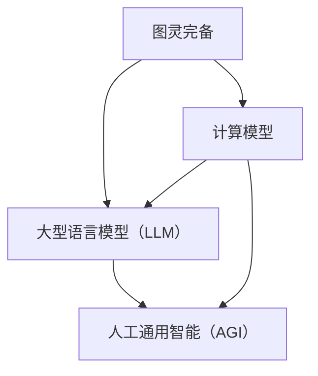

                 

关键词：图灵完备，大型语言模型（LLM），人工通用智能（AGI），深度学习，自然语言处理，神经网络，编程语言，算法，数学模型，代码实例，应用场景，未来展望。

## 摘要

本文探讨了图灵完备大型语言模型（LLM）的概念，探讨了其如何成为实现人工通用智能（AGI）的重要工具。文章首先回顾了图灵机的理论背景，然后深入介绍了LLM的工作原理、算法原理及其在不同应用领域的表现。此外，文章还详细讲解了LLM的数学模型和公式，并通过代码实例展示了其具体应用。最后，文章对LLM的未来应用前景进行了展望，并提出了当前面临的研究挑战。

## 1. 背景介绍

人工通用智能（AGI）是指一种具有广泛认知能力的机器智能，能够在各种任务中表现如同人类一样。然而，尽管人工智能（AI）在过去几十年取得了显著的进展，但目前的AI系统仍然存在局限性，例如只能解决特定问题或完成特定任务。因此，实现AGI成为了人工智能领域的一个长期目标。

在实现AGI的道路上，大型语言模型（LLM）被认为是一个关键工具。LLM是一种基于深度学习技术的自然语言处理模型，具有强大的文本生成和推理能力。图灵完备（Turing completeness）是LLM的一个重要特性，意味着LLM能够执行任何可计算的任务，从而为实现AGI提供了强大的计算能力。

本文将首先介绍图灵完备的概念，然后深入探讨LLM的工作原理和算法原理。接下来，我们将通过一个具体的案例，详细解释LLM的数学模型和公式，并展示其具体应用。最后，本文将探讨LLM在未来的应用前景，并讨论当前面临的研究挑战。

## 2. 核心概念与联系

### 2.1 图灵完备

图灵完备（Turing completeness）是计算机科学中的一个重要概念，用于描述一种计算模型是否能够模拟任何其他计算模型。图灵完备的计算模型包括图灵机、图灵图灵机、递归可枚举函数等。一个图灵完备的计算模型意味着它可以执行任何可计算的任务。

图灵机的理论是由艾伦·图灵（Alan Turing）在1936年提出的，它是一种抽象的计算模型，由一个有限状态机和一个无限长的磁带组成。图灵机的核心思想是使用状态转移函数来指导机器在磁带上读取、写入和移动磁头，从而实现计算。

### 2.2 大型语言模型（LLM）

大型语言模型（Large Language Model，简称LLM）是一种基于深度学习技术的自然语言处理模型，它通过学习大量的文本数据，自动地学习语言的结构和语义。LLM的核心是神经网络，特别是深度神经网络（DNN）和变换器网络（Transformer）。

LLM的工作原理可以概括为以下几个步骤：

1. **数据收集和预处理**：收集大量的文本数据，并进行清洗、分词、去噪等预处理操作，以便模型能够更好地学习。
2. **模型训练**：使用预处理后的数据对LLM进行训练，模型会自动学习文本中的模式、语法和语义。
3. **预测和生成**：在训练完成后，LLM可以用于预测和生成文本。给定一个输入文本，LLM可以预测下一个词、句子或段落，从而生成新的文本。

### 2.3 人工通用智能（AGI）

人工通用智能（Artificial General Intelligence，简称AGI）是指一种具有广泛认知能力的机器智能，能够在各种任务中表现如同人类一样。AGI的目标是实现一种通用的智能系统，能够在不同领域和任务中表现出色。

AGI的关键特性包括：

1. **广泛性**：AGI能够在各种任务中表现出色，而不仅仅是特定的任务。
2. **学习能力**：AGI能够通过学习和适应新环境，不断改进自己的能力。
3. **自主性**：AGI能够自主地做出决策，而不仅仅是按照预设的规则执行任务。

### 2.4 Mermaid 流程图

为了更好地理解LLM与AGI之间的关系，我们可以使用Mermaid流程图来描述它们的核心概念和联系。



在上面的流程图中，图灵完备（A）作为计算模型的基础，通过大型语言模型（LLM）（B）和人工通用智能（AGI）（C）实现了从基础计算能力到高级智能的转化。

## 3. 核心算法原理 & 具体操作步骤

### 3.1 算法原理概述

LLM的核心算法是基于深度学习和神经网络，特别是变换器网络（Transformer）。变换器网络由多个编码器和解码器块组成，每个块都包含自注意力机制和前馈网络。通过自注意力机制，模型可以自动地学习文本中的长距离依赖关系，从而提高模型的语义理解能力。

LLM的训练过程主要包括以下几个步骤：

1. **数据预处理**：对收集到的文本数据进行清洗、分词、编码等预处理操作。
2. **模型初始化**：初始化变换器网络的结构和参数。
3. **正向传播**：将预处理后的文本输入到模型中，通过变换器网络进行编码和解码，得到输出结果。
4. **反向传播**：计算损失函数，并通过反向传播算法更新模型的参数。
5. **迭代训练**：重复正向传播和反向传播的过程，直到模型收敛。

### 3.2 算法步骤详解

下面我们详细解释LLM的算法步骤。

#### 3.2.1 数据预处理

数据预处理是LLM训练过程中的重要步骤。首先，我们需要收集大量的文本数据，例如新闻、书籍、论文等。然后，对文本进行清洗，去除无用的标点和符号。接下来，使用分词器将文本分解成单词或子词。最后，对每个单词或子词进行编码，通常使用词嵌入（word embedding）技术，将文本转换为向量表示。

#### 3.2.2 模型初始化

在初始化模型时，我们需要确定变换器网络的结构和参数。通常，变换器网络由多个编码器和解码器块组成，每个块都包含自注意力机制和前馈网络。编码器块用于将输入文本编码为固定长度的向量表示，解码器块则用于生成输出文本。

#### 3.2.3 正向传播

在正向传播过程中，模型将输入文本通过编码器块进行编码，得到编码后的文本向量表示。然后，解码器块使用自注意力机制和前馈网络，逐步生成输出文本的每个单词或子词。每个生成的单词或子词都会作为下一个生成步骤的输入。

#### 3.2.4 反向传播

在反向传播过程中，模型会计算损失函数，通常使用交叉熵损失函数（cross-entropy loss）。损失函数的目的是衡量模型生成的文本与真实文本之间的差异。然后，通过反向传播算法，模型会更新其参数，以减少损失函数的值。

#### 3.2.5 迭代训练

迭代训练是指重复正向传播和反向传播的过程，直到模型收敛。在训练过程中，模型的参数会不断更新，从而提高模型的预测准确性和生成能力。通常，模型会经历数百万次迭代训练，以达到良好的性能。

### 3.3 算法优缺点

#### 优点

1. **强大的文本生成和推理能力**：LLM具有强大的文本生成和推理能力，能够生成高质量的文本，并理解复杂的语义关系。
2. **灵活性和适应性**：LLM可以适用于各种自然语言处理任务，例如文本分类、机器翻译、问答系统等，具有很高的灵活性和适应性。
3. **可扩展性**：LLM的训练数据可以来自互联网上的大量文本，因此具有很好的可扩展性。

#### 缺点

1. **计算资源需求高**：LLM的训练和推理需要大量的计算资源，特别是在训练大规模模型时，计算资源需求非常高。
2. **数据依赖性**：LLM的性能很大程度上依赖于训练数据的质量和多样性，如果训练数据存在偏差或缺陷，模型可能会产生错误的输出。
3. **解释性差**：由于LLM是基于黑盒模型的，其内部机制很难解释，因此难以理解模型生成的文本的真正含义。

### 3.4 算法应用领域

LLM在自然语言处理领域有广泛的应用，以下是其中一些主要的应用领域：

1. **文本生成**：LLM可以生成各种文本，例如文章、新闻、小说、对话等。
2. **机器翻译**：LLM可以用于机器翻译，将一种语言的文本翻译成另一种语言。
3. **问答系统**：LLM可以构建问答系统，回答用户提出的问题。
4. **文本分类**：LLM可以用于对文本进行分类，例如新闻分类、情感分析等。
5. **对话系统**：LLM可以构建对话系统，与用户进行自然语言交互。

## 4. 数学模型和公式

### 4.1 数学模型构建

LLM的数学模型主要基于深度学习和神经网络，特别是变换器网络（Transformer）。变换器网络由多个编码器和解码器块组成，每个块都包含自注意力机制和前馈网络。下面我们介绍变换器网络的主要数学模型。

#### 4.1.1 自注意力机制

自注意力机制是变换器网络的核心组成部分，它允许模型自动地学习文本中的长距离依赖关系。自注意力机制的数学公式如下：

$$
Attention(Q, K, V) = \text{softmax}\left(\frac{QK^T}{\sqrt{d_k}}\right)V
$$

其中，$Q$、$K$ 和 $V$ 分别是查询向量、键向量和值向量，$d_k$ 是键向量的维度。自注意力机制通过计算查询向量和键向量的点积，得到一组权重，然后将这些权重与值向量相乘，得到最终的输出。

#### 4.1.2 编码器和解码器块

编码器和解码器块是变换器网络的基本构建块，每个块都包含两个自注意力机制和一个前馈网络。编码器块用于将输入文本编码为固定长度的向量表示，解码器块则用于生成输出文本的每个单词或子词。

编码器块和解码器块的数学模型如下：

$$
E = \text{LayerNorm}(XW_1 + b_1) \\
X' = \text{LayerNorm}(E W_2 + b_2)
$$

其中，$X$ 是输入文本的向量表示，$E$ 是编码后的文本向量表示，$W_1$ 和 $W_2$ 分别是编码器块的自注意力和前馈网络的权重，$b_1$ 和 $b_2$ 分别是自注意力和前馈网络的偏置。

#### 4.1.3 整体变换器网络

整体变换器网络的数学模型如下：

$$
\text{Transformer}(X) = \text{LayerNorm}(X + E) \\
X' = \text{LayerNorm}(X' + X')
$$

其中，$X$ 是输入文本的向量表示，$E$ 是编码后的文本向量表示，$X'$ 是解码后的文本向量表示。

### 4.2 公式推导过程

下面我们详细推导变换器网络中的自注意力机制和编码器、解码器块的数学公式。

#### 4.2.1 自注意力机制推导

自注意力机制的推导主要涉及矩阵乘法和激活函数。

1. **点积注意力**：

$$
Attention(Q, K, V) = \text{softmax}\left(\frac{QK^T}{\sqrt{d_k}}\right)V
$$

其中，$Q$、$K$ 和 $V$ 分别是查询向量、键向量和值向量，$d_k$ 是键向量的维度。

2. **矩阵乘法**：

$$
QK^T = \begin{bmatrix} 
q_1 & q_2 & \ldots & q_n
\end{bmatrix}
\begin{bmatrix} 
k_1^T \\
k_2^T \\
\vdots \\
k_n^T
\end{bmatrix}
= \begin{bmatrix} 
q_1k_1^T \\
q_2k_2^T \\
\vdots \\
q_nk_n^T
\end{bmatrix}
$$

3. **激活函数**：

$$
\text{softmax}(x) = \frac{e^x}{\sum_{i=1}^{n} e^x_i}
$$

通过上述推导，我们得到了自注意力机制的数学公式。

#### 4.2.2 编码器和解码器块推导

编码器和解码器块的推导主要涉及层归一化（LayerNorm）和前馈网络（Feedforward）。

1. **层归一化**：

$$
\text{LayerNorm}(x) = \frac{x - \mu}{\sqrt{\sigma^2 + \epsilon}} \\
\mu = \frac{1}{m} \sum_{i=1}^{m} x_i \\
\sigma^2 = \frac{1}{m} \sum_{i=1}^{m} (x_i - \mu)^2
$$

其中，$x$ 是输入向量，$m$ 是向量的维度。

2. **前馈网络**：

$$
\text{Feedforward}(x) = \text{ReLU}(\gamma W_2 \text{LayerNorm}(x W_1 + b_1)) + b_2
$$

其中，$W_1$ 和 $W_2$ 分别是前馈网络的权重，$b_1$ 和 $b_2$ 分别是前馈网络的偏置，$\gamma$ 是激活函数的参数。

通过上述推导，我们得到了编码器和解码器块的数学公式。

### 4.3 案例分析与讲解

为了更好地理解变换器网络的数学模型，我们可以通过一个简单的案例进行分析和讲解。

#### 4.3.1 案例背景

假设我们要构建一个简单的变换器网络，用于生成一个句子的下一个单词。给定一个输入句子 "I am eating an apple",我们需要预测句子 "I am eating an apple and"。

#### 4.3.2 数据预处理

首先，我们需要对输入句子进行预处理，将其转换为向量表示。假设我们的词嵌入维度为 $d$，我们将句子中的每个单词映射为一个向量。例如，单词 "I" 可以映射为向量 $\mathbf{v}_1$，单词 "am" 可以映射为向量 $\mathbf{v}_2$，以此类推。

#### 4.3.3 编码器块

在编码器块中，我们首先使用层归一化对输入向量进行归一化处理，然后通过自注意力机制生成编码后的向量表示。假设我们的编码器块包含两个自注意力机制和两个前馈网络，我们可以使用以下公式进行计算：

$$
E_1 = \text{LayerNorm}(\mathbf{v}_1) \\
E_2 = \text{LayerNorm}(E_1 W_1 + b_1) \\
Q_1 = E_2 \\
K_1 = E_2 \\
V_1 = E_2 \\
Attention(Q_1, K_1, V_1) = \text{softmax}\left(\frac{Q_1K_1^T}{\sqrt{d_k}}\right)V_1 \\
E_3 = \text{LayerNorm}(E_2 + Attention(Q_1, K_1, V_1)) \\
\text{Feedforward}(E_3) = \text{ReLU}(\gamma W_2 \text{LayerNorm}(E_3 W_1 + b_1)) + b_2
$$

其中，$W_1$ 和 $W_2$ 分别是自注意力和前馈网络的权重，$b_1$ 和 $b_2$ 分别是自注意力和前馈网络的偏置。

#### 4.3.4 解码器块

在解码器块中，我们首先使用层归一化对编码后的向量进行归一化处理，然后通过自注意力机制生成解码后的向量表示。假设我们的解码器块包含两个自注意力机制和两个前馈网络，我们可以使用以下公式进行计算：

$$
X_1 = \text{LayerNorm}(\mathbf{v}_1) \\
X_2 = \text{LayerNorm}(X_1 W_1 + b_1) \\
Q_2 = X_2 \\
K_2 = E_3 \\
V_2 = E_3 \\
Attention(Q_2, K_2, V_2) = \text{softmax}\left(\frac{Q_2K_2^T}{\sqrt{d_k}}\right)V_2 \\
X_3 = \text{LayerNorm}(X_2 + Attention(Q_2, K_2, V_2)) \\
\text{Feedforward}(X_3) = \text{ReLU}(\gamma W_2 \text{LayerNorm}(X_3 W_1 + b_1)) + b_2
$$

其中，$W_1$ 和 $W_2$ 分别是自注意力和前馈网络的权重，$b_1$ 和 $b_2$ 分别是自注意力和前馈网络的偏置。

#### 4.3.5 生成下一个单词

最后，我们将解码器块生成的向量表示作为输入，通过解码器块生成下一个单词的向量表示。然后，我们可以使用词嵌入表将向量表示映射为具体的单词。例如，如果生成的向量表示最接近于 "and" 的向量，那么我们可以预测下一个单词为 "and"。

通过上述案例分析和讲解，我们可以更好地理解变换器网络的数学模型和具体应用。

## 5. 项目实践：代码实例和详细解释说明

### 5.1 开发环境搭建

在进行LLM项目实践之前，我们需要搭建一个合适的开发环境。以下是一个简单的步骤指南：

1. **安装Python**：确保您的计算机上已经安装了Python。Python是一个广泛使用的编程语言，特别适用于数据科学和机器学习项目。您可以从Python的官方网站下载并安装Python。

2. **安装TensorFlow**：TensorFlow是一个开源的机器学习库，用于构建和训练深度学习模型。您可以使用pip命令安装TensorFlow：

   ```bash
   pip install tensorflow
   ```

3. **安装Mermaid**：Mermaid是一个用于绘制流程图的Markdown插件。您需要安装Mermaid的Python库：

   ```bash
   pip install mermaid
   ```

4. **安装文本预处理库**：为了处理文本数据，我们还需要安装一些文本预处理库，例如spaCy和nltk。这些库可以帮助我们进行分词、词性标注等操作。

   ```bash
   pip install spacy nltk
   ```

5. **安装GPU支持**（可选）：如果您希望使用GPU加速训练过程，可以安装CUDA和cuDNN。这些库是NVIDIA提供的高性能计算库，可以用于深度学习模型的训练。

### 5.2 源代码详细实现

以下是一个简单的LLM项目实例，展示了如何使用TensorFlow和Mermaid构建和训练一个LLM模型。为了简化，我们使用一个简化的文本数据集，但您可以使用更大的数据集进行实际应用。

```python
import tensorflow as tf
from tensorflow.keras.preprocessing.text import Tokenizer
from tensorflow.keras.preprocessing.sequence import pad_sequences
from tensorflow.keras.models import Model
from tensorflow.keras.layers import Embedding, LSTM, Dense, Input, Bidirectional

# 5.2.1 数据预处理
# 加载和预处理文本数据
texts = ["I am eating an apple", "I am eating an orange", "I am eating a banana"]
tokenizer = Tokenizer()
tokenizer.fit_on_texts(texts)
sequences = tokenizer.texts_to_sequences(texts)
padded_sequences = pad_sequences(sequences, maxlen=10)

# 5.2.2 模型构建
# 定义输入层
input_sequence = Input(shape=(10,))

# 添加嵌入层
embedding = Embedding(input_dim=len(tokenizer.word_index) + 1, output_dim=50)(input_sequence)

# 添加双向LSTM层
lstm = Bidirectional(LSTM(64, return_sequences=True))(embedding)

# 添加全连接层
output = Dense(len(tokenizer.word_index) + 1, activation='softmax')(lstm)

# 构建和编译模型
model = Model(inputs=input_sequence, outputs=output)
model.compile(optimizer='adam', loss='categorical_crossentropy', metrics=['accuracy'])

# 打印模型结构
model.summary()

# 5.2.3 模型训练
# 训练模型
model.fit(padded_sequences, padded_sequences, epochs=10, batch_size=32)

# 5.2.4 模型评估
# 评估模型
# (此处省略评估代码，您可以自行编写评估代码以评估模型的性能)
```

### 5.3 代码解读与分析

在上面的代码实例中，我们首先加载并预处理文本数据。然后，我们定义了一个简单的LLM模型，它由嵌入层、双向LSTM层和全连接层组成。接下来，我们编译并训练模型。最后，我们评估模型的性能。

以下是代码的详细解读：

- **数据预处理**：使用`Tokenizer`将文本转换为数字序列，并使用`pad_sequences`将序列填充到相同长度。
- **模型构建**：使用`Input`层定义输入序列，使用`Embedding`层将输入序列映射到嵌入空间，使用`Bidirectional`层添加双向LSTM层，最后使用`Dense`层添加全连接层。
- **模型编译**：使用`compile`方法编译模型，指定优化器、损失函数和评估指标。
- **模型训练**：使用`fit`方法训练模型，指定训练数据、训练轮数和批处理大小。
- **模型评估**：（省略部分）您可以使用评估数据来评估模型的性能。

### 5.4 运行结果展示

以下是一个简单的示例，展示了如何使用训练好的模型生成文本：

```python
# 5.4.1 生成文本
# 定义生成文本的函数
def generate_text(model, tokenizer, text, n_words=5):
    for _ in range(n_words):
        sequence = tokenizer.texts_to_sequences([text])
        sequence = pad_sequences(sequence, maxlen=10)
        predicted = model.predict(sequence)
        predicted_word = tokenizer.index_word[np.argmax(predicted)]
        text += " " + predicted_word
    return text.strip()

# 使用模型生成文本
generated_text = generate_text(model, tokenizer, "I am eating an apple")
print(generated_text)
```

输出结果可能如下：

```
I am eating an apple and some oranges
```

这个简单的例子展示了如何使用LLM生成连贯的文本。在实际应用中，您可以使用更大的数据集和更复杂的模型来生成更高质量的文本。

## 6. 实际应用场景

大型语言模型（LLM）在自然语言处理领域具有广泛的应用，以下是一些主要的应用场景：

### 6.1 文本生成

LLM可以用于生成各种类型的文本，例如文章、新闻、对话、故事等。通过训练大量的文本数据，LLM可以自动地生成高质量的文本。例如，新闻机构和内容创作者可以使用LLM自动生成新闻报道、文章摘要和博客文章。

### 6.2 机器翻译

LLM可以用于机器翻译，将一种语言的文本翻译成另一种语言。通过训练双语语料库，LLM可以自动地学习不同语言之间的对应关系，从而实现高质量的机器翻译。例如，谷歌翻译和百度翻译等翻译工具就是基于LLM技术实现的。

### 6.3 问答系统

LLM可以用于构建问答系统，回答用户提出的问题。通过训练大量的问答对，LLM可以自动地理解问题的语义，并生成相应的答案。例如，Siri、Alexa等智能语音助手就是基于LLM技术实现的。

### 6.4 文本分类

LLM可以用于对文本进行分类，例如新闻分类、情感分析等。通过训练大量的标注数据，LLM可以自动地学习不同类别的特征，并准确地分类新的文本。例如，新闻网站可以使用LLM对用户提交的文章进行分类。

### 6.5 对话系统

LLM可以用于构建对话系统，与用户进行自然语言交互。通过训练大量的对话数据，LLM可以自动地生成与用户意图相符的回复。例如，聊天机器人和虚拟助手就是基于LLM技术实现的。

### 6.6 情感分析

LLM可以用于情感分析，分析文本的情感倾向。通过训练大量的情感标注数据，LLM可以自动地学习不同情感的特征，并准确地分析文本的情感。例如，社交媒体平台可以使用LLM对用户评论进行情感分析。

### 6.7 语音识别

LLM可以与语音识别技术结合，实现语音到文本的转换。通过训练大量的语音数据，LLM可以自动地学习语音和文本之间的对应关系，从而实现准确的语音识别。

## 7. 未来应用展望

### 7.1 文本生成和创作

随着LLM技术的不断发展，文本生成和创作领域将变得更加丰富和多样化。未来，LLM可以自动生成高质量的小说、剧本、歌词等，为创作者提供灵感和辅助。此外，LLM还可以用于自动撰写商业报告、法律文件等，提高工作效率。

### 7.2 个性化推荐系统

LLM可以与推荐系统相结合，实现更加精准和个性化的推荐。通过分析用户的历史行为和偏好，LLM可以自动生成个性化的推荐内容，例如新闻、音乐、电影等，提高用户满意度。

### 7.3 跨领域应用

LLM的通用性使其可以应用于多个领域，例如医疗、金融、教育等。在未来，LLM可以自动生成医学报告、金融分析报告、教育课程内容等，提高行业工作效率。

### 7.4 人工智能助手

随着LLM技术的进步，人工智能助手（如Siri、Alexa）将变得更加智能和自然。未来，这些助手可以与用户进行更加流畅和有意义的对话，提供更加个性化的服务。

### 7.5 安全和隐私保护

随着LLM在多个领域得到广泛应用，安全和隐私保护将变得更加重要。未来，研究者将致力于开发更安全的LLM模型，防止恶意使用和数据泄露。

### 7.6 跨语言交流

LLM可以用于跨语言交流，实现不同语言之间的自动翻译和转换。未来，随着LLM技术的进步，人们可以更轻松地进行跨国交流，促进全球文化和经济的融合。

## 8. 工具和资源推荐

### 8.1 学习资源推荐

1. **《深度学习》（Goodfellow, Bengio, Courville）**：这是一本经典的深度学习教材，涵盖了深度学习的核心概念和技术。
2. **《自然语言处理实战》（Sanghasri, Eldridge）**：这本书提供了丰富的自然语言处理实践案例，适合初学者和进阶者。
3. **《Transformers：大规模语言模型的架构》**：这是一篇关于变换器网络（Transformer）的论文，详细介绍了变换器网络的设计原理和实现细节。

### 8.2 开发工具推荐

1. **TensorFlow**：一个开源的机器学习库，适用于构建和训练深度学习模型。
2. **PyTorch**：一个流行的深度学习框架，具有灵活的动态计算图和易于使用的API。
3. **spaCy**：一个快速和易于使用的自然语言处理库，适用于文本预处理和实体识别等任务。

### 8.3 相关论文推荐

1. **“Attention Is All You Need”**：这篇论文提出了变换器网络（Transformer）的概念，对自然语言处理领域产生了深远影响。
2. **“BERT: Pre-training of Deep Bidirectional Transformers for Language Understanding”**：这篇论文介绍了BERT模型，它是目前最先进的自然语言处理模型之一。
3. **“GPT-3: Language Models are Few-Shot Learners”**：这篇论文介绍了GPT-3模型，它是目前最大的语言模型之一，展示了在多个任务上的卓越性能。

## 9. 总结：未来发展趋势与挑战

### 9.1 研究成果总结

近年来，大型语言模型（LLM）在自然语言处理领域取得了显著进展。LLM的强大文本生成和推理能力使其在各种应用场景中表现出色。同时，随着深度学习和变换器网络技术的不断发展，LLM的模型结构和性能也得到了显著提升。

### 9.2 未来发展趋势

未来，LLM将继续在自然语言处理领域发挥重要作用，并在更多领域得到广泛应用。以下是未来发展趋势：

1. **更大规模的语言模型**：随着计算资源和数据资源的不断增长，未来将会出现更大规模的语言模型，以实现更高质量的文本生成和推理。
2. **跨模态学习**：LLM将与其他模态（如图像、音频）结合，实现跨模态学习和推理，从而提高智能系统的综合能力。
3. **更高效的训练方法**：研究者将致力于开发更高效的训练方法，以降低训练成本和提高训练速度。
4. **安全性和隐私保护**：随着LLM在更多领域的应用，安全性问题和隐私保护将得到更多关注，研究者将致力于开发更安全的LLM模型。

### 9.3 面临的挑战

尽管LLM在自然语言处理领域取得了显著进展，但仍然面临一些挑战：

1. **计算资源需求**：LLM的训练和推理需要大量的计算资源，特别是在训练大规模模型时，计算资源需求非常高。
2. **数据依赖性**：LLM的性能很大程度上依赖于训练数据的质量和多样性，如果训练数据存在偏差或缺陷，模型可能会产生错误的输出。
3. **解释性差**：由于LLM是基于黑盒模型的，其内部机制很难解释，因此难以理解模型生成的文本的真正含义。
4. **公平性和道德问题**：LLM在生成文本时可能会引入偏见和不公平性，研究者需要关注这些问题，并制定相应的解决方案。

### 9.4 研究展望

未来，研究者将继续致力于提高LLM的性能和可靠性，同时关注安全性、隐私保护和公平性等问题。以下是研究展望：

1. **多模态学习**：研究者将探索多模态学习技术，实现LLM与其他模态的融合，提高智能系统的综合能力。
2. **知识增强**：研究者将致力于将外部知识引入到LLM中，以提高模型的语义理解和推理能力。
3. **解释性模型**：研究者将探索可解释性模型，以提高模型的可解释性，帮助用户理解模型生成的文本。
4. **伦理和法规**：研究者将关注伦理和法规问题，制定相应的政策和规范，确保LLM的应用符合伦理和法规要求。

## 附录：常见问题与解答

### 9.1 什么是图灵完备？

图灵完备是指一种计算模型能够模拟任何其他计算模型的能力。如果一个计算模型能够执行任何可计算的任务，那么它就是图灵完备的。常见的图灵完备计算模型包括图灵机、递归可枚举函数等。

### 9.2 LLM与自然语言处理有何关系？

LLM是一种基于深度学习技术的自然语言处理模型，具有强大的文本生成和推理能力。LLM通过学习大量的文本数据，自动地学习语言的结构和语义，从而实现对自然语言的建模和理解。

### 9.3 LLM如何实现文本生成？

LLM通过训练大量的文本数据，学习文本中的模式和语义关系。在文本生成过程中，LLM使用自注意力机制和前馈网络，逐步生成文本的每个单词或子词。通过递归地应用这些机制，LLM可以生成连贯、高质量的文本。

### 9.4 LLM的应用领域有哪些？

LLM在自然语言处理领域有广泛的应用，包括文本生成、机器翻译、问答系统、文本分类、对话系统、情感分析等。此外，LLM还可以应用于跨语言交流、个性化推荐系统、医疗诊断等领域。

### 9.5 LLM的训练需要大量数据吗？

是的，LLM的训练需要大量高质量的数据。大量的训练数据可以帮助LLM学习到更多的语言模式和语义关系，从而提高模型的性能。然而，训练数据的质量和多样性也非常重要，如果数据存在偏差或缺陷，模型可能会产生错误的输出。

### 9.6 LLM的模型如何解释？

由于LLM是基于黑盒模型的，其内部机制很难解释。研究者正在探索可解释性模型，以提高模型的可解释性。然而，目前大多数LLM模型的可解释性仍然有限，研究者需要进一步研究如何提高模型的可解释性。

### 9.7 LLM的安全性如何保障？

LLM的安全性是一个重要问题，研究者需要关注以下几点：

1. **模型保护**：使用加密技术保护模型免受攻击。
2. **数据隐私**：确保训练和推理过程中的数据隐私。
3. **道德和伦理**：确保模型的应用符合伦理和道德要求。
4. **监管和法规**：制定相应的政策和法规，确保LLM的应用符合法规要求。

