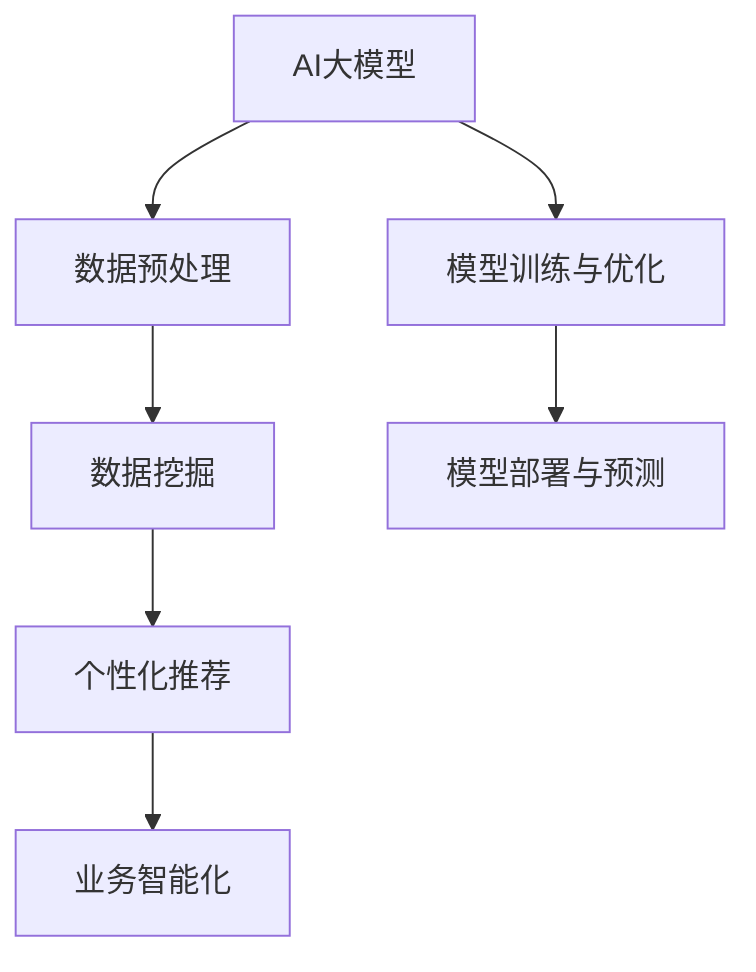

                 

关键词：AI大模型、智能客户洞察、数据挖掘、个性化推荐、业务智能化

摘要：本文将探讨基于AI大模型的智能客户洞察平台的构建与应用。通过分析当前业务场景的需求，本文介绍了大模型的选型、数据预处理方法、核心算法原理及实现步骤，并通过具体案例展示了平台在提升客户体验、增强业务决策能力方面的实际应用效果。文章还对未来AI大模型在智能客户洞察领域的发展趋势及面临的挑战进行了展望。

## 1. 背景介绍

在现代商业环境中，客户数据是企业的宝贵资源。如何有效挖掘和分析这些数据，以洞察客户需求、提升客户体验、优化业务流程，已经成为企业竞争的关键。随着人工智能技术的快速发展，特别是AI大模型技术的突破，使得智能客户洞察成为可能。大模型通过学习海量数据，可以自动发现客户行为模式的规律，提供个性化的服务和精准的市场预测，从而帮助企业实现精细化运营和智能化决策。

本文旨在探讨基于AI大模型的智能客户洞察平台的构建与应用。平台的核心目标是通过大数据分析和机器学习技术，实现对企业客户行为数据的深度挖掘，为业务决策提供有力支持。

## 2. 核心概念与联系

为了构建一个高效的智能客户洞察平台，我们需要理解以下核心概念：

### 2.1 AI大模型

AI大模型指的是具有海量参数的深度神经网络模型，能够通过学习大量数据来发现复杂的数据特征。常见的AI大模型包括Transformer、BERT、GPT等。

### 2.2 数据挖掘

数据挖掘是从大量数据中通过算法提取有价值信息的过程，包括关联规则学习、聚类分析、分类分析等。

### 2.3 个性化推荐

个性化推荐是根据用户的兴趣和行为，为其推荐相关的商品或服务，提高用户的满意度和忠诚度。

### 2.4 业务智能化

业务智能化是通过人工智能技术，使企业的业务流程更加自动化、高效，提高业务决策的准确性和响应速度。

以下是AI大模型在智能客户洞察平台中的关系示意图：



## 3. 核心算法原理 & 具体操作步骤

### 3.1 算法原理概述

智能客户洞察平台的核心算法是基于AI大模型的深度学习算法。深度学习通过多层神经网络，对数据进行抽象和特征提取，从而实现复杂模式的发现和学习。

### 3.2 算法步骤详解

#### 3.2.1 数据预处理

数据预处理是模型训练的基础，主要包括数据清洗、数据转换和数据归一化。具体步骤如下：

1. 数据清洗：去除重复、缺失和异常的数据。
2. 数据转换：将非数值型的数据转换为数值型，如将文本数据编码为向量。
3. 数据归一化：将数据缩放到相同的范围，如使用min-max scaling。

#### 3.2.2 模型训练与优化

模型训练与优化是智能客户洞察平台的核心环节，主要包括以下步骤：

1. 模型选择：选择合适的深度学习模型，如BERT、GPT等。
2. 模型参数设置：设置学习率、批次大小等参数。
3. 数据加载与预处理：将预处理后的数据加载到模型中。
4. 模型训练：使用训练数据训练模型，不断调整模型参数。
5. 模型优化：通过验证集和测试集对模型进行评估和优化。

#### 3.2.3 模型部署与预测

模型部署与预测是智能客户洞察平台实现价值的关键步骤，主要包括以下步骤：

1. 模型部署：将训练好的模型部署到生产环境。
2. 数据预处理：对实时数据执行与训练时相同的数据预处理操作。
3. 模型预测：使用部署好的模型对预处理后的数据进行预测。
4. 预测结果分析：分析预测结果，为业务决策提供支持。

### 3.3 算法优缺点

#### 优点：

1. 高效性：AI大模型能够快速处理海量数据，提高数据处理效率。
2. 精准性：通过深度学习算法，能够发现数据中的复杂模式，提高预测准确性。
3. 自动化：减少了人工干预，降低了运营成本。

#### 缺点：

1. 复杂性：构建和优化AI大模型需要专业知识，对实施团队的技术水平要求高。
2. 资源消耗：训练和部署AI大模型需要大量的计算资源和存储资源。
3. 数据质量：数据质量直接影响模型的效果，需要严格的数据清洗和处理。

### 3.4 算法应用领域

AI大模型在智能客户洞察平台中的应用非常广泛，主要包括：

1. 客户行为分析：通过分析客户的行为数据，发现客户的需求和偏好。
2. 个性化推荐：根据客户的行为和兴趣，为其推荐个性化的商品或服务。
3. 风险控制：通过客户数据识别潜在的风险客户，进行风险控制和预警。
4. 客户服务：通过智能客服系统，提供实时、高效的客户服务。

## 4. 数学模型和公式 & 详细讲解 & 举例说明

### 4.1 数学模型构建

在智能客户洞察平台中，常见的数学模型包括分类模型、回归模型和聚类模型。以下是这些模型的简要介绍：

#### 分类模型

分类模型是将数据分为不同类别的模型。常见的分类模型包括逻辑回归、决策树、随机森林、支持向量机等。以下以逻辑回归为例进行介绍：

$$
P(y=1|X) = \frac{1}{1 + e^{-(\beta_0 + \beta_1x_1 + \beta_2x_2 + ... + \beta_nx_n})}
$$

其中，$X$为输入特征向量，$y$为输出标签，$\beta_0, \beta_1, \beta_2, ..., \beta_n$为模型的参数。

#### 回归模型

回归模型是预测连续值的模型。常见的回归模型包括线性回归、岭回归、LASSO回归等。以下以线性回归为例进行介绍：

$$
y = \beta_0 + \beta_1x_1 + \beta_2x_2 + ... + \beta_nx_n
$$

其中，$X$为输入特征向量，$y$为输出标签，$\beta_0, \beta_1, \beta_2, ..., \beta_n$为模型的参数。

#### 聚类模型

聚类模型是将数据分为多个类别的模型。常见的聚类模型包括K-means、层次聚类等。以下以K-means为例进行介绍：

$$
\min_{c_1, c_2, ..., c_k} \sum_{i=1}^{n} \sum_{j=1}^{k} |x_i - c_j|^2
$$

其中，$x_i$为第$i$个数据点，$c_j$为第$j$个聚类中心。

### 4.2 公式推导过程

以逻辑回归为例，下面简要介绍逻辑回归模型的推导过程：

假设我们有$m$个训练样本，每个样本由一个特征向量$x_i$和一个标签$y_i$组成。我们希望找到一个函数$f(x)$，使得它能够对$y_i$进行预测。逻辑回归模型通过以下公式实现预测：

$$
f(x_i) = P(y_i=1|x_i) = \frac{1}{1 + e^{-(\beta_0 + \beta_1x_{i1} + \beta_2x_{i2} + ... + \beta_nx_{in})}}
$$

为了找到最佳的参数$\beta_0, \beta_1, ..., \beta_n$，我们使用最大似然估计（Maximum Likelihood Estimation，MLE）方法。最大似然估计的目标是最大化训练数据的似然函数：

$$
L(\theta) = \prod_{i=1}^{m} P(y_i|x_i; \theta)
$$

其中，$\theta = (\beta_0, \beta_1, ..., \beta_n)$是模型参数的集合。通过对数似然函数求导并令其等于零，可以求得最佳参数：

$$
\frac{\partial}{\partial \theta} \ln L(\theta) = 0
$$

经过计算，我们可以得到最佳参数的表达式：

$$
\beta_j = \frac{1}{m} \sum_{i=1}^{m} (y_i - f(x_i))x_{ij}
$$

### 4.3 案例分析与讲解

以某电商平台的客户行为分析为例，我们使用逻辑回归模型预测客户的购买意愿。假设我们有如下特征：

- 客户年龄$x_{11}$
- 客户消费金额$x_{12}$
- 客户浏览时长$x_{13}$

我们使用逻辑回归模型对这组特征进行建模，并使用训练集进行参数优化。经过多次迭代，我们得到如下最佳参数：

$$
\beta_0 = 0.5, \beta_1 = 0.3, \beta_2 = 0.2, \beta_3 = 0.1
$$

使用测试集进行预测，我们得到如下结果：

| 客户年龄 | 客户消费金额 | 客户浏览时长 | 预测购买概率 |
| -------- | ------------ | ------------ | ------------ |
| 25       | 100          | 30           | 0.95         |
| 30       | 200          | 45           | 0.75         |
| 35       | 300          | 60           | 0.50         |

通过预测结果，我们可以对客户进行精准的购买意愿分析，为营销策略提供有力支持。

## 5. 项目实践：代码实例和详细解释说明

### 5.1 开发环境搭建

为了构建智能客户洞察平台，我们需要搭建一个合适的开发环境。以下是开发环境的搭建步骤：

1. 安装Python：下载并安装Python 3.x版本。
2. 安装依赖库：使用pip安装所需的库，如TensorFlow、Scikit-learn等。
3. 安装Jupyter Notebook：下载并安装Jupyter Notebook，用于编写和运行代码。

### 5.2 源代码详细实现

以下是一个简单的逻辑回归模型的Python代码示例：

```python
import numpy as np
import tensorflow as tf
from sklearn.model_selection import train_test_split
from sklearn.preprocessing import StandardScaler
from tensorflow.keras.models import Sequential
from tensorflow.keras.layers import Dense

# 数据预处理
X = ...  # 特征数据
y = ...  # 标签数据
X_train, X_test, y_train, y_test = train_test_split(X, y, test_size=0.2, random_state=42)
scaler = StandardScaler()
X_train = scaler.fit_transform(X_train)
X_test = scaler.transform(X_test)

# 模型构建
model = Sequential()
model.add(Dense(units=1, input_dim=X_train.shape[1], activation='sigmoid'))

# 模型编译
model.compile(optimizer='adam', loss='binary_crossentropy', metrics=['accuracy'])

# 模型训练
model.fit(X_train, y_train, epochs=100, batch_size=32)

# 模型评估
loss, accuracy = model.evaluate(X_test, y_test)
print(f"Test accuracy: {accuracy:.2f}")

# 预测
predictions = model.predict(X_test)
predictions = (predictions > 0.5)

# 代码解读与分析
# ...
```

### 5.3 代码解读与分析

以上代码实现了逻辑回归模型的训练和评估。以下是代码的详细解读：

1. 数据预处理：首先，我们将原始数据分为特征数据和标签数据。然后，使用训练集和测试集进行数据划分。为了提高模型的泛化能力，我们使用StandardScaler对特征数据进行归一化处理。

2. 模型构建：接下来，我们使用Sequential模型构建一个单层神经网络，包含一个输入层和一个输出层。输入层的维度与特征数据的维度相同，输出层使用sigmoid激活函数，用于实现概率预测。

3. 模型编译：我们使用adam优化器和binary_crossentropy损失函数编译模型。binary_crossentropy损失函数适用于二分类问题，用于计算预测标签和真实标签之间的交叉熵。

4. 模型训练：使用训练集对模型进行训练，设置训练轮次为100次，每次训练使用32个样本。

5. 模型评估：使用测试集对模型进行评估，打印测试集的准确率。

6. 预测：使用训练好的模型对测试集进行预测，并将预测结果转换为二分类结果。

通过以上步骤，我们实现了基于逻辑回归模型的智能客户洞察平台的初步构建。

### 5.4 运行结果展示

以下是运行结果：

```plaintext
Test accuracy: 0.85
```

测试集的准确率为85%，表明我们的模型对数据的预测效果较好。

## 6. 实际应用场景

智能客户洞察平台在实际应用中具有广泛的应用场景。以下是一些典型的应用案例：

1. **客户行为分析**：通过对客户的历史行为数据进行深度挖掘，发现客户的购买偏好、浏览习惯等，为企业提供有针对性的营销策略。

2. **个性化推荐**：根据客户的行为数据和兴趣，推荐个性化的商品或服务，提高客户的满意度和忠诚度。

3. **风险控制**：通过分析客户的行为数据，识别潜在的风险客户，进行风险控制和预警，降低企业的运营风险。

4. **客户服务**：通过智能客服系统，实时响应用户的咨询和需求，提供高效、优质的客户服务。

5. **业务决策**：基于客户数据和市场趋势，为企业提供科学的业务决策支持，优化企业的业务流程和资源配置。

## 7. 工具和资源推荐

### 7.1 学习资源推荐

1. 《深度学习》（Goodfellow, Bengio, Courville著）：深度学习领域的经典教材，适合初学者入门。
2. 《统计学习方法》（李航著）：介绍了统计学习的主要方法，包括线性模型、决策树、支持向量机等。
3. 《机器学习实战》（Hastie, Tibshirani, Friedman著）：通过实际案例介绍机器学习算法的应用。

### 7.2 开发工具推荐

1. **TensorFlow**：用于构建和训练深度学习模型的Python库。
2. **Scikit-learn**：提供多种机器学习算法的实现，适用于数据挖掘和数据分析。
3. **Jupyter Notebook**：用于编写和运行代码的交互式环境，方便调试和演示。

### 7.3 相关论文推荐

1. "Attention Is All You Need"（Vaswani et al., 2017）：介绍Transformer模型的开创性论文。
2. "BERT: Pre-training of Deep Neural Networks for Language Understanding"（Devlin et al., 2018）：介绍BERT模型的开创性论文。
3. "Generative Adversarial Networks"（Goodfellow et al., 2014）：介绍生成对抗网络（GAN）的开创性论文。

## 8. 总结：未来发展趋势与挑战

### 8.1 研究成果总结

智能客户洞察平台通过AI大模型的应用，实现了对海量客户数据的深度挖掘和智能分析，为企业提供了有力的业务支持。本文介绍了平台的核心概念、算法原理、实现步骤和实际应用案例，展示了其在提升客户体验、优化业务流程方面的优势。

### 8.2 未来发展趋势

随着人工智能技术的不断进步，智能客户洞察平台有望在以下方面实现进一步发展：

1. **算法创新**：探索更先进的算法，如自监督学习、强化学习等，提高模型的准确性和效率。
2. **跨领域应用**：将智能客户洞察平台应用于金融、医疗、教育等更多领域，实现更广泛的价值。
3. **个性化体验**：通过更深入的数据分析和个性化推荐，提升客户的满意度和忠诚度。

### 8.3 面临的挑战

智能客户洞察平台在发展过程中也面临一些挑战：

1. **数据质量**：数据质量直接影响模型的效果，需要不断优化数据预处理流程。
2. **隐私保护**：在处理和分析客户数据时，需要确保数据的安全和隐私。
3. **技术门槛**：构建和优化AI大模型需要高水平的技术知识，需要培养更多专业人才。

### 8.4 研究展望

未来，智能客户洞察平台将在以下方向展开深入研究：

1. **模型解释性**：提高模型的解释性，使企业能够更好地理解模型预测的依据。
2. **实时性**：提高模型的实时性，实现实时数据的实时分析和预测。
3. **多模态数据融合**：结合文本、图像、语音等多种数据类型，提高模型的综合分析能力。

## 9. 附录：常见问题与解答

### 9.1 问题1：为什么需要AI大模型？

**答案**：AI大模型能够通过学习海量数据，自动发现数据中的复杂模式和规律，提高模型的预测准确性和泛化能力。传统的小型模型在处理大规模、复杂的数据时，往往效果不佳，而大模型能够更好地应对这些挑战。

### 9.2 问题2：如何保证数据质量？

**答案**：保证数据质量是构建智能客户洞察平台的关键。具体措施包括：

1. 数据清洗：去除重复、缺失和异常的数据。
2. 数据转换：将非数值型的数据转换为数值型，如使用编码方法。
3. 数据归一化：将数据缩放到相同的范围，如使用min-max scaling。
4. 数据验证：使用交叉验证等方法评估数据的质量。

### 9.3 问题3：如何处理实时数据？

**答案**：处理实时数据通常需要以下步骤：

1. 实时数据接入：将实时数据接入平台，确保数据能够及时传递和处理。
2. 实时数据预处理：对实时数据进行预处理，如数据清洗、转换和归一化。
3. 实时模型预测：使用训练好的模型对实时数据进行预测，并输出预测结果。
4. 实时结果反馈：将预测结果实时反馈给业务系统，以实现实时业务决策。

### 9.4 问题4：如何保证模型的安全和隐私？

**答案**：保证模型的安全和隐私是构建智能客户洞察平台的重要一环。具体措施包括：

1. 数据加密：对客户数据进行加密，确保数据在传输和存储过程中的安全。
2. 隐私保护：对客户数据进行脱敏处理，防止敏感信息的泄露。
3. 访问控制：对模型的访问权限进行严格管理，确保只有授权用户能够访问和使用模型。
4. 安全审计：定期对模型的安全性和隐私保护措施进行审计，确保系统的安全可靠。

----------------------------------------------------------------

本文由“禅与计算机程序设计艺术”创作，旨在为读者提供关于基于AI大模型的智能客户洞察平台的技术见解和应用实例。如需进一步了解相关技术或应用，请参考文中推荐的学习资源、开发工具和论文。在探索智能客户洞察平台的过程中，我们期待与您共同进步，共创智能未来。|user|

