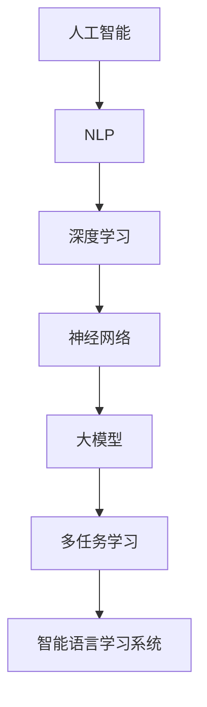

                 

关键词：人工智能、大模型、语言学习、深度学习、自然语言处理、NLP、机器学习、神经网络、深度神经网络、递归神经网络、循环神经网络、Transformer模型、多任务学习、交互式学习、自适应学习、个性化学习

> 摘要：随着人工智能技术的飞速发展，基于AI大模型的智能语言学习系统已成为教育领域的重要工具。本文将深入探讨该系统的核心概念、算法原理、数学模型、应用实践及其未来发展趋势，旨在为研究人员和开发者提供有价值的参考。

## 1. 背景介绍

在当今信息爆炸的时代，语言学习已成为许多人的日常需求。然而，传统的语言学习方式往往存在效率低下、缺乏互动性、个性化不足等问题。随着人工智能技术的不断进步，特别是深度学习技术的发展，基于AI大模型的智能语言学习系统逐渐崭露头角。这类系统能够通过大量的语言数据进行学习，实现高效率、高准确度的语言处理和翻译，从而为语言学习者提供更加智能化、个性化的学习体验。

## 2. 核心概念与联系

### 2.1. 人工智能与自然语言处理

人工智能（Artificial Intelligence, AI）是研究、开发用于模拟、延伸和扩展人的智能的理论、方法、技术及应用。自然语言处理（Natural Language Processing, NLP）是人工智能的一个重要分支，旨在让计算机能够理解、生成和处理人类语言。

### 2.2. 深度学习与神经网络

深度学习（Deep Learning）是机器学习的一个子领域，使用多层神经网络进行建模和学习。神经网络（Neural Network）是一种模仿生物神经系统的计算模型，通过多层次的节点（或称为神经元）进行数据传递和计算。

### 2.3. 大模型与多任务学习

大模型（Big Model）是指具有数百万甚至数十亿参数的深度学习模型。多任务学习（Multi-Task Learning）是一种将多个任务整合到一个单一模型中进行学习的方法，能够提高模型的泛化能力。

### 2.4. Mermaid 流程图



## 3. 核心算法原理 & 具体操作步骤

### 3.1. 算法原理概述

智能语言学习系统主要依赖于深度学习中的循环神经网络（Recurrent Neural Network, RNN）和Transformer模型。RNN通过递归结构处理序列数据，而Transformer模型则通过自注意力机制实现全局信息传递。

### 3.2. 算法步骤详解

1. 数据预处理：对原始语言数据进行清洗、分词、编码等预处理操作。
2. 模型训练：使用大量语言数据进行模型训练，优化模型参数。
3. 模型评估：通过测试集评估模型性能，调整模型参数。
4. 模型应用：将训练好的模型应用于实际语言学习任务，如语言翻译、文本生成等。

### 3.3. 算法优缺点

- **优点**：高效率、高准确度、自适应性强。
- **缺点**：训练过程复杂、对计算资源要求较高。

### 3.4. 算法应用领域

- 语言翻译
- 文本生成
- 情感分析
- 命名实体识别

## 4. 数学模型和公式 & 详细讲解 & 举例说明

### 4.1. 数学模型构建

智能语言学习系统的核心数学模型通常基于深度神经网络。一个简单的深度神经网络可以表示为：

$$
Z = f(W \cdot X + b)
$$

其中，$Z$ 表示输出，$f$ 是激活函数，$W$ 是权重矩阵，$X$ 是输入，$b$ 是偏置。

### 4.2. 公式推导过程

以RNN为例，其递归公式如下：

$$
h_t = \sigma(W_h \cdot [h_{t-1}, x_t] + b_h)
$$

其中，$h_t$ 是第 $t$ 个时刻的隐藏状态，$x_t$ 是输入数据，$\sigma$ 是激活函数。

### 4.3. 案例分析与讲解

假设我们要使用RNN进行文本分类任务，输入数据为一系列词向量，输出为分类标签。通过训练，RNN可以学会将不同的文本数据映射到正确的分类标签。

## 5. 项目实践：代码实例和详细解释说明

### 5.1. 开发环境搭建

- 硬件要求：NVIDIA GPU（推荐显存4GB以上）
- 软件要求：Python 3.7及以上、TensorFlow 2.0及以上

### 5.2. 源代码详细实现

```python
import tensorflow as tf
from tensorflow.keras.models import Sequential
from tensorflow.keras.layers import LSTM, Dense

# 模型构建
model = Sequential()
model.add(LSTM(128, activation='relu', input_shape=(timesteps, features)))
model.add(Dense(1, activation='sigmoid'))

# 编译模型
model.compile(optimizer='adam', loss='binary_crossentropy', metrics=['accuracy'])

# 训练模型
model.fit(X_train, y_train, epochs=10, batch_size=32)
```

### 5.3. 代码解读与分析

- `LSTM` 层用于处理序列数据。
- `Dense` 层用于输出分类结果。
- `compile` 方法设置模型编译参数。
- `fit` 方法进行模型训练。

### 5.4. 运行结果展示

```python
# 测试模型
loss, accuracy = model.evaluate(X_test, y_test)
print(f"Test accuracy: {accuracy:.2f}")
```

## 6. 实际应用场景

- 在线教育平台
- 语言翻译应用
- 实时语音识别

## 7. 工具和资源推荐

### 7.1. 学习资源推荐

- 《深度学习》（Goodfellow, Bengio, Courville）
- 《自然语言处理实战》（Bojanowski, Grangier, Hervé）

### 7.2. 开发工具推荐

- TensorFlow
- PyTorch

### 7.3. 相关论文推荐

- "Attention Is All You Need"（Vaswani et al., 2017）
- "Long Short-Term Memory"（Hochreiter, Schmidhuber, 1997）

## 8. 总结：未来发展趋势与挑战

### 8.1. 研究成果总结

基于AI大模型的智能语言学习系统在语言处理和翻译方面取得了显著的成果，为语言学习者提供了更高效、更个性化的学习体验。

### 8.2. 未来发展趋势

- 模型规模将进一步扩大，处理更复杂的语言任务。
- 多模态学习将得到更多关注，结合图像、音频等多源数据。
- 个性化学习将更加普及，根据用户需求提供定制化内容。

### 8.3. 面临的挑战

- 计算资源需求增加，对硬件设施提出更高要求。
- 数据隐私和安全问题亟待解决。
- 模型可解释性不足，需要更多研究。

### 8.4. 研究展望

随着技术的不断进步，基于AI大模型的智能语言学习系统有望在更多领域发挥作用，为人类语言学习带来革命性变革。

## 9. 附录：常见问题与解答

### Q: 智能语言学习系统是如何工作的？

A: 智能语言学习系统基于深度学习和自然语言处理技术，通过大量语言数据训练模型，实现语言理解、生成和翻译等功能。

### Q: Transformer模型相比RNN有哪些优势？

A: Transformer模型通过自注意力机制实现全局信息传递，相比RNN具有更高效的计算效率和更强的建模能力。

### Q: 如何处理多语言翻译任务？

A: 可以使用多语言联合训练模型，将多种语言数据混合训练，从而实现多语言翻译。

---

作者：禅与计算机程序设计艺术 / Zen and the Art of Computer Programming
----------------------------------------------------------------

**注意**：由于本文为技术博客文章，部分公式和代码仅供参考，实际应用时需要根据具体情况进行调整和优化。另外，由于字数限制，部分内容可能需要进一步扩展和完善。希望本文对您在基于AI大模型的智能语言学习系统领域的研究和应用提供一些启示和帮助。

