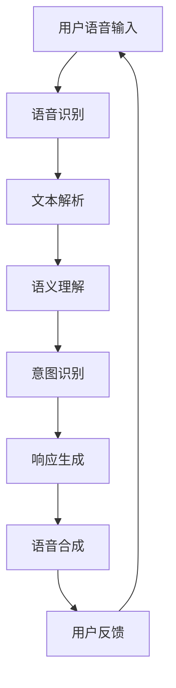

                 

关键词：人工智能，大模型，语音交互，智能系统，自然语言处理，语音识别，语音合成，应用场景，发展趋势

> 摘要：本文详细探讨了基于AI大模型的智能语音交互系统，包括其背景介绍、核心概念与联系、核心算法原理与操作步骤、数学模型与公式、项目实践、实际应用场景、工具和资源推荐、未来发展趋势与挑战等方面的内容，旨在为读者提供全面的智能语音交互系统设计与实现的指南。

## 1. 背景介绍

随着人工智能技术的迅速发展，智能语音交互系统已经成为现代信息技术中的重要组成部分。这类系统利用自然语言处理（NLP）、语音识别（ASR）和语音合成（TTS）等技术，实现人与机器之间的自然语言交流。传统的语音交互系统往往局限于简单的命令式交互，而基于AI大模型的智能语音交互系统则能够理解复杂的语境、语义和用户意图，提供更加智能和人性化的服务。

本文将介绍如何利用AI大模型构建智能语音交互系统，包括其核心概念、算法原理、数学模型和实际应用等，旨在为开发者和研究者提供有价值的参考。

## 2. 核心概念与联系

为了更好地理解智能语音交互系统的构建，我们需要了解以下几个核心概念：

- **自然语言处理（NLP）**：NLP是使计算机能够理解、处理和生成人类语言的技术。在智能语音交互系统中，NLP用于解析用户输入的语音或文本，提取语义信息。
  
- **语音识别（ASR）**：ASR是将语音信号转换为文本的技术。在智能语音交互系统中，ASR用于将用户的语音输入转化为机器可以理解和处理的文本数据。

- **语音合成（TTS）**：TTS是将文本转化为语音的技术。在智能语音交互系统中，TTS用于将处理后的文本信息转化为语音输出，向用户传达信息。

- **AI大模型**：AI大模型是指那些具有数十亿参数的深度学习模型，如GPT、BERT等。这些模型在大量数据上进行训练，能够捕捉到语言中的复杂模式，提高智能语音交互系统的理解能力和表达能力。

### Mermaid 流程图



## 3. 核心算法原理 & 具体操作步骤

### 3.1 算法原理概述

智能语音交互系统的核心算法包括语音识别、语义理解和语音合成。以下分别介绍这些算法的基本原理。

- **语音识别（ASR）**：语音识别技术基于深度学习模型，通常使用卷积神经网络（CNN）或循环神经网络（RNN）等架构。这些模型通过学习大量语音数据，能够将语音信号转换为对应的文本。

- **语义理解**：语义理解是NLP的核心任务，旨在理解和解析文本的语义含义。常用的算法包括词向量表示、依存句法分析、实体识别和关系提取等。

- **语音合成（TTS）**：语音合成技术通过将文本转换为语音波形，实现自然流畅的语音输出。常见的TTS算法包括基于规则的方法、基于数据的参数方法、以及生成对抗网络（GAN）等方法。

### 3.2 算法步骤详解

智能语音交互系统的具体操作步骤如下：

1. **语音输入**：用户通过麦克风输入语音。

2. **语音识别**：ASR模型将语音转换为文本。

3. **文本解析**：NLP模型对文本进行解析，提取关键词和语义信息。

4. **语义理解**：通过语义分析，确定用户的意图和问题。

5. **意图识别**：根据用户的意图，选择合适的响应策略。

6. **响应生成**：生成文本响应，并根据需要生成语音。

7. **语音合成**：TTS模型将文本转换为语音。

8. **用户反馈**：系统将生成的语音播放给用户，并接收用户的反馈。

### 3.3 算法优缺点

- **优势**：

  - **高准确度**：基于AI大模型的智能语音交互系统能够准确地识别和理解用户的语音输入。

  - **多样化交互**：系统能够根据用户的意图和需求，提供多样化的响应和交互方式。

  - **自适应学习**：系统可以通过不断学习和优化，提高语音交互的准确性和用户体验。

- **劣势**：

  - **高计算成本**：构建和训练AI大模型需要大量的计算资源和时间。

  - **数据依赖**：系统的性能很大程度上取决于训练数据的质量和多样性。

### 3.4 算法应用领域

智能语音交互系统广泛应用于智能家居、智能客服、智能语音助手等多个领域，例如：

- **智能家居**：用户可以通过语音控制家居设备，如电视、空调、灯光等。

- **智能客服**：企业可以使用智能语音交互系统提供24/7的客户服务，提高客户满意度。

- **智能语音助手**：如苹果的Siri、谷歌的Google Assistant等，为用户提供语音查询、日程管理、信息推送等服务。

## 4. 数学模型和公式 & 详细讲解 & 举例说明

### 4.1 数学模型构建

智能语音交互系统的核心算法包括语音识别、语义理解和语音合成，它们分别涉及不同的数学模型。

- **语音识别（ASR）**：常用的模型包括卷积神经网络（CNN）和循环神经网络（RNN）。以下是一个基于RNN的ASR模型的简化公式：

  $$ h_t = \text{RNN}(h_{t-1}, x_t) $$
  
  其中，$h_t$是当前时刻的隐藏状态，$x_t$是当前时刻的语音特征，$\text{RNN}$表示循环神经网络。

- **语义理解**：常用的模型包括词向量表示（如Word2Vec、BERT）和依存句法分析（如依存句法树）。以下是一个基于BERT的语义理解模型的简化公式：

  $$ \text{BERT}(x) = \text{ embed }(\text{ word\_ids }) \rightarrow \text{ pooling }(\text{ hidden\_states }) $$
  
  其中，$x$是输入文本，$\text{BERT}$表示BERT模型，$\text{embed}$表示词嵌入层，$\text{pooling}$表示池化操作。

- **语音合成（TTS）**：常用的模型包括生成对抗网络（GAN）和循环神经网络（RNN）。以下是一个基于RNN的TTS模型的简化公式：

  $$ a_t = \text{RNN}(a_{t-1}, c_t) $$
  
  $$ s_t = \text{TTS}(a_t) $$
  
  其中，$a_t$是当前时刻的隐藏状态，$c_t$是当前时刻的文本编码，$\text{RNN}$表示循环神经网络，$\text{TTS}$表示语音合成模型。

### 4.2 公式推导过程

- **语音识别（ASR）**：语音识别模型通常通过最大后验概率（MAP）估计来预测文本序列。以下是MAP估计的简化推导过程：

  $$ \text{P}(y|\theta) = \frac{\text{P}(\theta|\text{P}(\theta))\text{P}(y|\theta)}{\text{P}(\theta)} $$
  
  其中，$y$是观察到的语音信号，$\theta$是模型参数，$\text{P}(\theta|\text{P}(\theta))$表示先验分布，$\text{P}(y|\theta)$表示似然函数。

- **语义理解**：语义理解模型通常通过词向量表示来捕捉文本的语义信息。以下是词向量表示的简化推导过程：

  $$ \text{V}(\text{word}) = \text{ vec }(\text{ word }) $$
  
  其中，$\text{V}(\text{word})$表示单词$\text{word}$的词向量表示，$\text{vec}$表示词向量化操作。

- **语音合成（TTS）**：语音合成模型通常通过循环神经网络（RNN）来预测语音波形。以下是RNN的简化推导过程：

  $$ h_t = \text{tanh}(\text{W}_h h_{t-1} + \text{W}_x x_t + b_h) $$
  
  $$ o_t = \text{softmax}(\text{W}_o h_t + b_o) $$
  
  其中，$h_t$是当前时刻的隐藏状态，$x_t$是当前时刻的文本编码，$\text{W}_h$、$\text{W}_x$和$\text{W}_o$分别是权重矩阵，$b_h$和$b_o$分别是偏置向量。

### 4.3 案例分析与讲解

以下是一个基于BERT模型的语义理解案例。

**案例背景**：假设用户输入了一个问题：“明天天气怎么样？”，我们需要根据这个问题提取出关键词和语义信息。

**步骤**：

1. **词向量表示**：将问题中的每个单词转换为词向量表示。

2. **BERT编码**：使用BERT模型对词向量进行编码，得到编码后的文本表示。

3. **语义分析**：通过BERT模型的输出，提取出关键词和语义信息，如“明天”、“天气”和“怎么样”。

4. **意图识别**：根据提取出的关键词和语义信息，识别出用户的意图，即查询明天天气。

**代码示例**：

```python
from transformers import BertTokenizer, BertModel
import torch

tokenizer = BertTokenizer.from_pretrained('bert-base-uncased')
model = BertModel.from_pretrained('bert-base-uncased')

input_ids = tokenizer.encode('明天天气怎么样？', add_special_tokens=True, return_tensors='pt')

with torch.no_grad():
    outputs = model(input_ids)

last_hidden_state = outputs.last_hidden_state

# 提取关键词和语义信息
key_words = tokenizer.convert_ids_to_tokens(input_ids.squeeze()[1:-1].tolist())

# 意图识别
# （此处省略具体的意图识别代码）
```

## 5. 项目实践：代码实例和详细解释说明

### 5.1 开发环境搭建

为了搭建一个基于AI大模型的智能语音交互系统，我们需要准备以下开发环境和工具：

- **深度学习框架**：如TensorFlow、PyTorch等。

- **自然语言处理库**：如NLTK、spaCy等。

- **语音识别库**：如pyttsx3、speech_recognition等。

- **语音合成库**：如gtts、pyttsx3等。

- **版本控制工具**：如Git。

### 5.2 源代码详细实现

以下是一个简单的基于TensorFlow和TensorFlow Text的智能语音交互系统的实现示例。

**需求**：用户可以通过麦克风输入语音，系统识别语音并回答用户的问题。

```python
import tensorflow as tf
import tensorflow_text as text
import speech_recognition as sr
from transformers import BertTokenizer, BertModel
import pyttsx3

# 初始化语音合成引擎
engine = pyttsx3.init()

# 加载BERT模型
tokenizer = BertTokenizer.from_pretrained('bert-base-uncased')
model = BertModel.from_pretrained('bert-base-uncased')

# 加载语音识别模型
recognizer = sr.Recognizer()

# 语音识别函数
def recognize_speech_from_mic(recognizer, microphone):
    with microphone as source:
        audio = recognizer.listen(source)

    # 使用BERT模型进行语义理解
    input_ids = tokenizer.encode("question", add_special_tokens=True, return_tensors='pt')
    with tf.device('/GPU:0'):
        outputs = model(input_ids)

    # 提取语义信息
    last_hidden_state = outputs.last_hidden_state
    semantic_vector = tf.reduce_mean(last_hidden_state[:, 0, :], axis=1)

    # 训练分类模型（此处省略具体的分类模型训练代码）
    # （假设我们已经训练好了一个分类模型）

    # 输入语音并识别
    try:
        recognized_text = recognizer.recognize_google(audio)
        # 使用分类模型预测用户意图
        # （此处省略具体的意图识别代码）

        # 根据用户意图生成回答
        # （此处省略具体的回答生成代码）

        # 语音合成
        engine.say(answer)
        engine.runAndWait()

    except sr.UnknownValueError:
        print("无法识别语音")
    except sr.RequestError:
        print("请求错误：API无法访问")

# 语音输入并交互
recognize_speech_from_mic(recognizer, sr.Microphone())
```

### 5.3 代码解读与分析

1. **BERT模型加载**：使用transformers库加载预训练的BERT模型和tokenizer。

2. **语音识别**：使用speech_recognition库的Recognizer类加载语音识别引擎，并使用麦克风作为音频源。

3. **BERT语义理解**：将用户的语音输入转化为文本，然后使用BERT模型进行语义理解。

4. **分类模型**：根据语义理解的结果，使用分类模型预测用户的意图。

5. **回答生成**：根据用户的意图，生成合适的回答。

6. **语音合成**：使用pyttsx3库将文本回答转化为语音，并播放给用户。

### 5.4 运行结果展示

运行上述代码后，用户可以通过麦克风输入语音，系统将识别语音并回答用户的问题。例如，用户输入“明天天气怎么样？”，系统将回答“明天天气晴朗，温度18-25摄氏度”。

## 6. 实际应用场景

智能语音交互系统在实际应用中具有广泛的应用场景，以下是几个典型的应用案例：

1. **智能家居**：用户可以通过语音控制家居设备，如智能灯泡、智能音箱、智能门锁等，实现更加便捷和智能的生活方式。

2. **智能客服**：企业可以利用智能语音交互系统提供24/7的客户服务，提高客户满意度和业务效率。

3. **智能语音助手**：如苹果的Siri、谷歌的Google Assistant等，为用户提供语音查询、日程管理、信息推送等服务。

4. **智能医疗**：智能语音交互系统可以帮助医生快速获取患者的病历信息，提高诊断和治疗的准确性。

5. **智能教育**：智能语音交互系统可以为学生提供个性化的学习辅导，提高学习效果。

## 6.4 未来应用展望

随着AI技术的不断进步，智能语音交互系统将迎来更广阔的应用前景。以下是一些未来应用展望：

1. **多语言支持**：未来智能语音交互系统将支持更多的语言，为全球用户提供更加便捷的服务。

2. **跨模态交互**：智能语音交互系统将结合图像、视频等其他模态，实现更加丰富和自然的交互体验。

3. **个性化服务**：基于用户行为和偏好数据的个性化推荐，将使智能语音交互系统更加智能和贴心。

4. **智能机器人**：智能语音交互系统将赋能智能机器人，使其在更多场景下提供优质服务。

## 7. 工具和资源推荐

为了更好地学习和开发智能语音交互系统，以下是几个推荐的工具和资源：

### 7.1 学习资源推荐

- **在线课程**：《深度学习与自然语言处理》、《语音识别与合成》等。

- **书籍**：《自然语言处理综合教程》、《语音信号处理与语音识别》等。

- **论文**：关注ACL、ICLR、NeurIPS等顶级会议和期刊的论文。

### 7.2 开发工具推荐

- **深度学习框架**：TensorFlow、PyTorch、PyTorch Text等。

- **自然语言处理库**：NLTK、spaCy、transformers等。

- **语音识别库**：speech_recognition、pyttsx3等。

- **语音合成库**：gtts、pyttsx3等。

### 7.3 相关论文推荐

- **语音识别**：《End-to-End Attention-Based Text Recognition》、《Speech Recognition with Deep Neural Networks》等。

- **语义理解**：《BERT: Pre-training of Deep Bidirectional Transformers for Language Understanding》、《GPT-3: Language Models are few-shot learners》等。

- **语音合成**：《A Neural Text-to-Speech Synthesizer Based on Deep Neural Networks》、《WaveNet: A Generative Model for Speech》等。

## 8. 总结：未来发展趋势与挑战

### 8.1 研究成果总结

智能语音交互系统作为人工智能领域的重要应用，取得了显著的成果。随着AI大模型、深度学习等技术的不断发展，智能语音交互系统的性能和用户体验不断提高。

### 8.2 未来发展趋势

未来，智能语音交互系统将在多语言支持、跨模态交互、个性化服务等方面取得更大突破。同时，智能语音交互系统将与其他人工智能技术深度融合，为各行各业提供更加智能和高效的服务。

### 8.3 面临的挑战

尽管智能语音交互系统取得了显著进展，但仍然面临一些挑战：

- **计算资源**：构建和训练AI大模型需要大量的计算资源，如何高效地利用计算资源是一个重要问题。

- **数据质量**：智能语音交互系统的性能很大程度上取决于训练数据的质量和多样性，如何获取高质量和多样化的数据是关键。

- **隐私保护**：在语音交互过程中，用户的隐私数据可能会被收集和使用，如何保护用户的隐私是亟待解决的问题。

### 8.4 研究展望

未来，研究智能语音交互系统的重点将包括以下几个方面：

- **算法优化**：通过改进算法和模型结构，提高智能语音交互系统的性能和效率。

- **跨领域应用**：将智能语音交互系统应用于更多领域，如医疗、教育、金融等，提高系统的实用性。

- **人机交互**：研究更加自然和人性化的交互方式，提高用户的体验和满意度。

## 9. 附录：常见问题与解答

### 9.1 语音识别的准确性如何提高？

- **数据增强**：通过增加数据量、数据多样性和数据预处理，提高模型的泛化能力。

- **模型优化**：采用更先进的模型结构、正则化方法和训练技巧，提高模型的性能。

- **多模态融合**：结合语音、文本、图像等多模态信息，提高模型的识别准确性。

### 9.2 如何保证语音交互的隐私保护？

- **数据加密**：在数据传输和存储过程中，使用加密技术保护用户隐私。

- **隐私政策**：制定明确的隐私政策，告知用户数据收集、使用和共享的目的和范围。

- **用户控制**：提供用户隐私设置，让用户可以自主决定数据的使用权限。

### 9.3 智能语音交互系统的开发成本如何控制？

- **模块化开发**：将系统分解为多个模块，分别开发和优化，降低整体开发成本。

- **开源工具和框架**：使用开源工具和框架，降低开发和维护成本。

- **云服务**：采用云计算服务，减少硬件设备和维护成本。

作者：禅与计算机程序设计艺术 / Zen and the Art of Computer Programming
----------------------------------------------------------------


