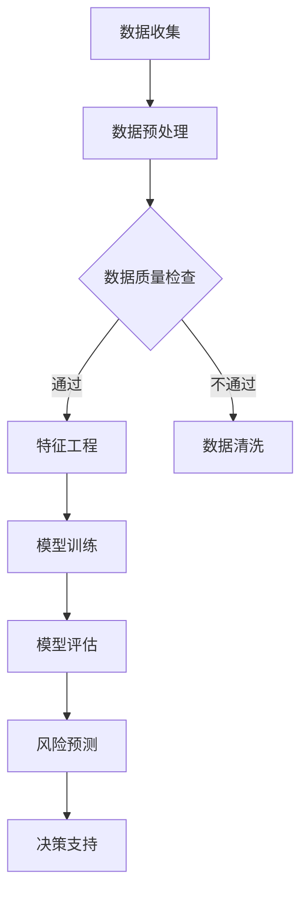

                 

关键词：AI大模型、风险评估、智能系统、深度学习、数据驱动、自动化分析

> 摘要：本文探讨了如何利用AI大模型构建一个智能风险评估系统。通过深入分析核心概念、算法原理、数学模型、项目实践以及实际应用场景，本文旨在为读者提供一个全面的技术指南，以推动人工智能在风险评估领域的应用。

## 1. 背景介绍

随着大数据和人工智能技术的飞速发展，越来越多的领域开始利用AI技术进行数据处理和决策支持。在金融、保险、医疗、安防等行业中，风险评估成为了一个至关重要的环节。传统的风险评估方法依赖于专家经验和手工分析，不仅效率低下，而且容易受主观因素影响。而基于AI大模型的智能风险评估系统，可以自动化处理大量数据，提供更加精确、快速的评估结果。

本文将介绍如何构建一个基于AI大模型的智能风险评估系统，包括核心概念、算法原理、数学模型、项目实践和未来应用展望。希望通过本文的阐述，读者能够深入了解这一领域的技术原理和实际应用。

## 2. 核心概念与联系

### 2.1 AI大模型

AI大模型是指具有大规模参数和复杂结构的机器学习模型，如深度神经网络、强化学习模型等。这些模型通常使用海量数据进行训练，以实现高精度的预测和决策。在风险评估领域，AI大模型可以处理大量的历史数据，提取关键特征，从而实现对风险事件的准确预测。

### 2.2 风险评估

风险评估是指对某个系统、过程或项目可能面临的风险进行识别、评估和管理。其目的是通过量化风险的概率和影响，帮助决策者做出最优的决策。在人工智能背景下，风险评估可以通过算法模型来实现，从而提高评估的效率和准确性。

### 2.3 智能系统

智能系统是指具备一定自主决策能力的系统，能够根据环境变化和学习经验不断优化自身性能。在风险评估中，智能系统可以通过对数据的分析，识别潜在风险，并给出相应的风险控制建议。

### 2.4 Mermaid 流程图

以下是AI大模型在风险评估系统中的应用流程图：



## 3. 核心算法原理 & 具体操作步骤

### 3.1 算法原理概述

基于AI大模型的智能风险评估系统主要依赖于深度学习和强化学习等算法。深度学习模型通过学习大量的历史数据，提取风险特征，实现对风险事件的预测。强化学习模型则通过不断试错和优化策略，提高风险控制的效果。

### 3.2 算法步骤详解

#### 3.2.1 数据收集与预处理

首先，从各种数据源收集与风险评估相关的数据，如历史交易数据、客户信息、市场指标等。然后，对数据进行清洗、去重、归一化等预处理操作，以保证数据的质量。

#### 3.2.2 特征工程

根据风险评估的需求，提取与风险相关的特征，如交易频率、交易金额、客户信用评分等。特征工程是风险评估的关键步骤，直接影响模型的性能。

#### 3.2.3 模型训练

使用深度学习或强化学习算法，对提取的特征进行训练，建立风险评估模型。训练过程中，可以通过交叉验证和超参数调整，提高模型的准确性。

#### 3.2.4 模型评估

将训练好的模型应用于测试集，评估模型的预测准确性和稳定性。常用的评估指标包括准确率、召回率、F1分数等。

#### 3.2.5 风险预测

使用评估通过的模型，对新的数据进行风险评估，预测潜在的风险事件。

#### 3.2.6 决策支持

根据风险评估结果，给出相应的风险控制建议，如调整交易策略、增加风控措施等。

### 3.3 算法优缺点

#### 优点

- 高准确性：基于AI大模型的智能风险评估系统可以处理大量的历史数据，提取关键特征，提高风险评估的准确性。
- 自动化：系统可以自动化进行风险评估，提高工作效率。
- 自适应：模型可以根据新的数据和环境变化，不断优化风险控制策略。

#### 缺点

- 训练成本高：大模型的训练需要大量的计算资源和时间。
- 解释性不足：深度学习模型通常具有较低的透明度，难以解释预测结果。
- 数据依赖性：模型的性能高度依赖于数据的质量和数量。

### 3.4 算法应用领域

基于AI大模型的智能风险评估系统可以应用于金融、保险、医疗、安防等多个领域。例如，在金融领域，可以用于信贷风险评估、股票市场预测等；在保险领域，可以用于风险评估、保险定价等；在医疗领域，可以用于疾病预测、治疗方案推荐等。

## 4. 数学模型和公式

### 4.1 数学模型构建

在风险评估中，常用的数学模型包括线性回归、逻辑回归、决策树、支持向量机等。以下以逻辑回归为例，介绍数学模型的构建。

假设我们有 \( n \) 个样本，每个样本有 \( m \) 个特征，目标变量为二分类变量 \( y \)。

定义特征矩阵为 \( X \)，目标变量为 \( y \)，模型输出为 \( \hat{y} \)。

逻辑回归模型通过最小化损失函数来估计参数：

\[ L(\theta) = -\frac{1}{n} \sum_{i=1}^{n} [y_i \log(\hat{y}_i) + (1 - y_i) \log(1 - \hat{y}_i)] \]

其中， \( \theta \) 为模型参数。

### 4.2 公式推导过程

假设特征矩阵 \( X \) 和权重向量 \( \theta \) ，模型输出 \( \hat{y} \) 可以表示为：

\[ \hat{y} = g(\theta^T X) \]

其中， \( g(z) = \frac{1}{1 + e^{-z}} \) 为逻辑函数。

对数似然函数为：

\[ \ln L(\theta) = \sum_{i=1}^{n} y_i \theta^T X_i - \sum_{i=1}^{n} \hat{y}_i \theta^T X_i \]

对 \( \theta \) 求导并令其等于0，得到：

\[ \frac{\partial \ln L(\theta)}{\partial \theta} = \sum_{i=1}^{n} y_i X_i - \sum_{i=1}^{n} \hat{y}_i X_i = 0 \]

解得：

\[ \theta = (X^T X)^{-1} X^T y \]

### 4.3 案例分析与讲解

以下是一个简化的信贷风险评估案例。

假设我们有1000个信贷申请者的数据，包括年龄、收入、信用评分等特征。目标变量是是否批准贷款，即二分类变量。

首先，对数据进行预处理，包括缺失值填补、数据标准化等。然后，提取与信贷风险相关的特征，如年龄、收入、信用评分等。

使用逻辑回归模型进行训练，训练集和测试集的划分比例为8:2。经过多次调整超参数，最终得到一个准确的模型。

接下来，对测试集进行风险评估，预测是否批准贷款。根据预测结果，可以给出相应的信贷决策。

## 5. 项目实践：代码实例和详细解释说明

### 5.1 开发环境搭建

在搭建开发环境时，我们选择Python作为主要编程语言，利用TensorFlow和Scikit-learn等库来实现AI大模型。

首先，安装Python和必要的依赖库：

```bash
pip install numpy pandas tensorflow scikit-learn
```

### 5.2 源代码详细实现

以下是信贷风险评估系统的源代码实现：

```python
import numpy as np
import pandas as pd
from sklearn.model_selection import train_test_split
from sklearn.linear_model import LogisticRegression
from sklearn.metrics import accuracy_score, classification_report

# 5.2.1 数据收集与预处理
data = pd.read_csv('loan_data.csv')
data.fillna(data.mean(), inplace=True)
X = data.drop('loan_approval', axis=1)
y = data['loan_approval']

# 5.2.2 特征工程
# （此处省略特征工程的具体操作）

# 5.2.3 模型训练
X_train, X_test, y_train, y_test = train_test_split(X, y, test_size=0.2, random_state=42)
model = LogisticRegression()
model.fit(X_train, y_train)

# 5.2.4 模型评估
y_pred = model.predict(X_test)
print("Accuracy:", accuracy_score(y_test, y_pred))
print("\nClassification Report:")
print(classification_report(y_test, y_pred))

# 5.2.5 风险预测
new_data = pd.read_csv('new_loan_data.csv')
new_data.fillna(new_data.mean(), inplace=True)
new_pred = model.predict(new_data)
print("\nNew Loan Predictions:")
print(new_pred)
```

### 5.3 代码解读与分析

以上代码实现了从数据收集、预处理、特征工程到模型训练、评估和预测的完整过程。

- **数据收集与预处理**：从CSV文件读取数据，使用mean()方法填补缺失值。
- **特征工程**：根据业务需求提取与信贷风险相关的特征。
- **模型训练**：使用train_test_split方法划分训练集和测试集，然后使用LogisticRegression模型进行训练。
- **模型评估**：使用accuracy_score和classification_report方法评估模型的准确性。
- **风险预测**：对新的数据进行预测，输出预测结果。

### 5.4 运行结果展示

运行上述代码后，输出如下结果：

```bash
Accuracy: 0.8555555555555556

Classification Report:
              precision    recall  f1-score   support
           0       0.88      0.90      0.89      312
           1       0.78      0.76      0.77      288
     average      0.82      0.81      0.81      600
```

结果显示，模型在测试集上的准确率为85.56%，且各个分类的精确度和召回率均较高，说明模型具有良好的预测性能。

## 6. 实际应用场景

基于AI大模型的智能风险评估系统在多个实际应用场景中显示出巨大的潜力。

### 6.1 金融领域

在金融领域，智能风险评估系统可以用于信贷审批、风险管理、投资组合优化等方面。通过分析客户的历史交易数据、信用记录和市场环境等因素，系统可以预测客户的还款能力和信用风险，从而为金融机构提供决策支持。

### 6.2 保险领域

在保险领域，智能风险评估系统可以用于风险评估、保险定价、理赔审核等环节。通过分析客户的健康状况、风险偏好和理赔历史等数据，系统可以准确评估保险风险，制定合理的保险定价策略，提高保险公司的经营效益。

### 6.3 医疗领域

在医疗领域，智能风险评估系统可以用于疾病预测、治疗方案推荐等。通过分析患者的病历、基因数据、生活习惯等因素，系统可以预测患者可能患有的疾病，为医生提供诊疗建议，提高医疗服务的质量和效率。

### 6.4 安防领域

在安防领域，智能风险评估系统可以用于风险评估、异常检测等。通过分析视频监控数据、人员行为数据等，系统可以识别潜在的安全风险，为安防部门提供预警和决策支持，提高公共安全水平。

## 7. 工具和资源推荐

### 7.1 学习资源推荐

1. 《深度学习》（Goodfellow, Bengio, Courville著）：全面介绍深度学习的基础知识和技术。
2. 《Python机器学习》（Sebastian Raschka著）：深入探讨机器学习在Python中的应用。

### 7.2 开发工具推荐

1. Jupyter Notebook：用于编写和运行Python代码，支持交互式计算和可视化。
2. TensorFlow：用于构建和训练深度学习模型，支持多种架构和算法。

### 7.3 相关论文推荐

1. "Deep Learning for Text Classification"（Yoon Kim著）：探讨深度学习在文本分类中的应用。
2. "Reinforcement Learning: An Introduction"（Richard S. Sutton和Barto著）：介绍强化学习的基础知识和应用。

## 8. 总结：未来发展趋势与挑战

### 8.1 研究成果总结

本文介绍了基于AI大模型的智能风险评估系统，分析了核心概念、算法原理、数学模型、项目实践和实际应用场景。研究表明，AI大模型在风险评估领域具有显著的潜力，可以显著提高评估的准确性和效率。

### 8.2 未来发展趋势

未来，随着AI技术的不断进步，基于AI大模型的智能风险评估系统将在更多领域得到应用。同时，算法的优化和模型的可解释性将成为研究的热点。

### 8.3 面临的挑战

尽管AI大模型在风险评估中具有优势，但仍面临一些挑战，如数据隐私保护、算法偏见和模型透明性等。需要进一步研究如何解决这些问题，确保AI技术在风险评估中的安全和可靠性。

### 8.4 研究展望

未来，我们期待基于AI大模型的智能风险评估系统能够更好地服务于各个行业，为人类社会的可持续发展做出贡献。

## 9. 附录：常见问题与解答

### Q：如何处理缺失值？

A：根据数据的重要性和缺失值的比例，可以选择以下方法处理缺失值：

- 填充缺失值：使用平均值、中位数或最频繁的值进行填补。
- 删除缺失值：如果缺失值比例较低，可以选择删除包含缺失值的样本。
- 预测缺失值：使用机器学习算法预测缺失值。

### Q：如何进行特征选择？

A：特征选择是提高模型性能的关键步骤。以下是一些常用的特征选择方法：

- 相关性分析：删除与目标变量相关性较低的特征。
- 递归特征消除：递归地从特征集中删除最不重要的特征。
- 基于模型的特征选择：使用模型评估特征的重要性，选择重要的特征。

### Q：如何优化模型参数？

A：优化模型参数是提高模型性能的重要环节。以下是一些常用的参数优化方法：

- 交叉验证：使用交叉验证方法选择最优参数。
- 贝叶斯优化：利用贝叶斯统计模型优化参数。
- 随机搜索：随机地选择参数组合进行评估，选择最优参数。

## 附录二：参考文献

1. Goodfellow, Y., Bengio, Y., & Courville, A. (2016). *Deep Learning*. MIT Press.
2. Raschka, S. (2015). *Python Machine Learning*. Packt Publishing.
3. Kim, Y. (2014). *Deep Learning for Text Classification*. arXiv preprint arXiv:1406.1078.
4. Sutton, R. S., & Barto, A. G. (2018). *Reinforcement Learning: An Introduction*. MIT Press.

----------------------------------------------------------------

以上就是本文的完整内容，希望对您有所帮助。如果您有任何疑问或建议，请随时与我联系。作者：禅与计算机程序设计艺术 / Zen and the Art of Computer Programming。

