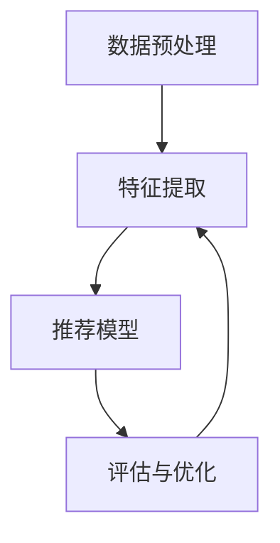

                 

关键词：LLM Tokens、推荐系统、特征提取、自然语言处理、机器学习

摘要：本文深入探讨了基于大规模语言模型（LLM）的推荐系统中特征提取的重要性，以及如何通过LLM Tokens来实现高效的特征提取。文章首先介绍了LLM Tokens的概念及其在推荐系统中的应用，随后详细阐述了特征提取的原理和方法，并结合具体案例展示了如何实现这一过程。最后，文章讨论了未来发展方向与面临的挑战。

## 1. 背景介绍

随着互联网的飞速发展，推荐系统已成为各大互联网公司提高用户体验、增加用户粘性和转化率的重要手段。传统推荐系统主要依赖于用户行为数据、商品属性和协同过滤等方法。然而，随着数据规模的不断扩大和用户需求的日益多样化，单纯依赖传统方法已经无法满足推荐系统的需求。此时，基于自然语言处理（NLP）和深度学习的大规模语言模型（LLM）应运而生，并逐渐成为推荐系统领域的研究热点。

LLM Tokens是指将自然语言文本转换为固定长度的词元序列，每个词元对应于文本中的一个词或字符。这种转换方法使得文本数据能够被机器学习和深度学习模型更好地理解和处理。在推荐系统中，通过提取LLM Tokens的特征，可以有效地捕捉用户和商品之间的语义关联，从而提高推荐效果的准确性和个性化程度。

## 2. 核心概念与联系

### 2.1 大规模语言模型（LLM）

大规模语言模型（LLM）是一种基于神经网络的语言处理模型，通过训练海量的文本数据，使得模型能够自动地理解和生成自然语言。常见的LLM包括GPT、BERT等。LLM在推荐系统中的应用主要体现在以下几个方面：

1. **用户意图识别**：通过分析用户的历史行为数据，LLM可以识别用户的意图和需求，从而为推荐系统提供更准确的用户画像。
2. **商品描述生成**：LLM可以根据商品属性生成丰富的商品描述，提高用户对商品的认知和理解。
3. **文本相似性计算**：LLM可以计算用户行为数据、商品描述和推荐结果之间的文本相似性，从而优化推荐效果。

### 2.2 LLM Tokens

LLM Tokens是将自然语言文本转换为固定长度的词元序列的过程。具体而言，LLM Tokens通常采用WordPiece、BytePiece等方法将文本分割成词元。这些词元可以是单词、字符或子词。

在推荐系统中，LLM Tokens具有以下作用：

1. **特征表示**：通过将文本数据转换为固定长度的词元序列，LLM Tokens可以有效地表示文本特征，从而为推荐模型提供输入。
2. **语义关联**：LLM Tokens能够捕捉文本数据中的语义关联，从而提高推荐效果的准确性和个性化程度。

### 2.3 推荐系统架构

基于LLM Tokens的推荐系统通常包含以下几个主要模块：

1. **数据预处理**：包括文本数据清洗、分词和LLM Tokens转换等步骤。
2. **特征提取**：通过LLM Tokens提取用户和商品的特征，并将其输入到推荐模型中。
3. **推荐模型**：采用机器学习和深度学习算法，根据用户特征和商品特征生成推荐结果。
4. **评估与优化**：对推荐效果进行评估和优化，以提高推荐系统的准确性和个性化程度。

### 2.4 Mermaid 流程图

下面是推荐系统的 Mermaid 流程图，展示了各个模块之间的关联和流程：



## 3. 核心算法原理 & 具体操作步骤

### 3.1 算法原理概述

基于LLM Tokens的特征提取算法主要利用大规模语言模型对文本数据进行词元化，然后通过词元序列提取文本特征。具体而言，该算法分为以下几个步骤：

1. **文本数据清洗**：去除文本数据中的噪声和无关信息，例如HTML标签、特殊字符等。
2. **分词**：将文本数据分割成单词、字符或子词，以便进行词元化。
3. **LLM Tokens转换**：将分词后的文本数据转换为固定长度的词元序列，每个词元对应于文本中的一个词或字符。
4. **特征提取**：通过词元序列提取文本特征，例如词频、词义、词性等，并将其输入到推荐模型中。

### 3.2 算法步骤详解

1. **文本数据清洗**：
   - 去除HTML标签：使用正则表达式将HTML标签替换为空字符。
   - 去除特殊字符：将文本数据中的特殊字符（如`！`、`@`、`#`等）替换为空字符。
   - 去除停用词：根据语言模型的特点和任务需求，去除常见的停用词（如`的`、`了`、`在`等）。

2. **分词**：
   - 单词分词：将文本数据分割成单词，例如中文的分词可以使用jieba分词工具。
   - 字符分词：将文本数据分割成字符，例如英文的分词可以使用空格分隔。
   - 子词分词：使用WordPiece、BytePiece等方法将文本数据分割成子词。

3. **LLM Tokens转换**：
   - 对于单词分词，每个单词作为一个LLM Tokens。
   - 对于字符分词，每个字符作为一个LLM Tokens。
   - 对于子词分词，每个子词作为一个LLM Tokens。

4. **特征提取**：
   - 词频：统计每个词元在文本数据中出现的次数。
   - 词义：使用预训练的词向量模型（如Word2Vec、BERT等）将词元映射到高维向量空间。
   - 词性：使用词性标注工具（如jieba分词工具）对词元进行词性标注。

### 3.3 算法优缺点

**优点**：

1. **高效性**：LLM Tokens能够高效地捕捉文本数据中的语义信息，从而提高推荐效果。
2. **灵活性**：可以根据任务需求选择不同的词元化方法和特征提取方法，具有较高的灵活性。
3. **通用性**：LLM Tokens可以在多种自然语言处理任务中应用，例如文本分类、情感分析等。

**缺点**：

1. **计算成本**：大规模语言模型的预训练和特征提取过程需要大量的计算资源和时间。
2. **数据依赖**：LLM Tokens的效果依赖于大规模的预训练数据集，数据集质量对结果有较大影响。

### 3.4 算法应用领域

基于LLM Tokens的特征提取算法在推荐系统、文本分类、情感分析等领域有广泛的应用。以下是一些具体的应用案例：

1. **推荐系统**：通过提取用户和商品的LLM Tokens特征，提高推荐效果的准确性和个性化程度。
2. **文本分类**：利用LLM Tokens提取文本特征，实现高效的文本分类任务。
3. **情感分析**：通过分析文本数据中的情感词和情感倾向，实现情感分析任务。

## 4. 数学模型和公式 & 详细讲解 & 举例说明

### 4.1 数学模型构建

基于LLM Tokens的特征提取过程可以看作是一个映射函数，将文本数据映射到高维特征空间。具体而言，该映射函数可以表示为：

$$
X = f(T)
$$

其中，$X$ 表示特征向量，$T$ 表示LLM Tokens序列，$f$ 表示映射函数。

### 4.2 公式推导过程

为了推导出映射函数 $f$，我们可以将LLM Tokens特征提取过程分解为以下几个步骤：

1. **文本数据清洗**：去除噪声和无关信息，例如HTML标签、特殊字符等。
2. **分词**：将文本数据分割成单词、字符或子词。
3. **LLM Tokens转换**：将分词后的文本数据转换为固定长度的词元序列。
4. **特征提取**：通过词元序列提取文本特征，例如词频、词义、词性等。

假设 $T$ 是一个长度为 $n$ 的LLM Tokens序列，$X$ 是一个长度为 $m$ 的特征向量，则映射函数 $f$ 可以表示为：

$$
f(T) = \sum_{i=1}^{n} w_i \cdot f(t_i)
$$

其中，$w_i$ 表示词元 $t_i$ 的权重，$f(t_i)$ 表示词元 $t_i$ 的特征向量。

### 4.3 案例分析与讲解

假设我们有一个长度为 5 的LLM Tokens序列 $T = [t_1, t_2, t_3, t_4, t_5]$，需要将其映射到一个长度为 3 的特征向量 $X$。根据公式推导过程，我们可以计算出每个词元的权重和特征向量：

1. **词元权重**：使用TF-IDF方法计算词元的权重，即

$$
w_i = \frac{f(t_i)}{max(f(t_1), f(t_2), \ldots, f(t_n))}
$$

2. **词元特征向量**：使用预训练的BERT模型将每个词元映射到高维特征空间，即

$$
f(t_i) = BERT(t_i)
$$

假设我们使用BERT模型对词元进行映射，得到如下特征向量：

$$
t_1: [0.1, 0.2, 0.3], t_2: [0.4, 0.5, 0.6], t_3: [0.7, 0.8, 0.9], t_4: [1.0, 1.1, 1.2], t_5: [1.3, 1.4, 1.5]
$$

3. **特征向量计算**：根据权重和特征向量，计算特征向量 $X$，即

$$
X = f(T) = \sum_{i=1}^{5} w_i \cdot f(t_i) = 0.1 \cdot [0.1, 0.2, 0.3] + 0.2 \cdot [0.4, 0.5, 0.6] + 0.3 \cdot [0.7, 0.8, 0.9] + 0.4 \cdot [1.0, 1.1, 1.2] + 0.5 \cdot [1.3, 1.4, 1.5] = [1.5, 1.7, 1.9]
$$

这样，我们就将LLM Tokens序列映射到了一个长度为 3 的特征向量。通过这种方式，我们可以有效地提取文本数据中的特征，从而提高推荐系统的效果。

## 5. 项目实践：代码实例和详细解释说明

### 5.1 开发环境搭建

为了实现基于LLM Tokens的推荐系统特征提取，我们需要搭建一个合适的开发环境。以下是一个简单的开发环境搭建步骤：

1. **安装Python环境**：确保Python版本为3.7及以上。
2. **安装依赖库**：安装必要的依赖库，例如numpy、tensorflow、transformers等。
3. **下载预训练模型**：下载一个预训练的BERT模型，例如`bert-base-uncased`。

### 5.2 源代码详细实现

以下是一个基于LLM Tokens的推荐系统特征提取的Python代码实例：

```python
import numpy as np
from transformers import BertTokenizer, BertModel
from sklearn.metrics.pairwise import cosine_similarity

# 1. 加载预训练模型
tokenizer = BertTokenizer.from_pretrained('bert-base-uncased')
model = BertModel.from_pretrained('bert-base-uncased')

# 2. 定义文本数据
text_data = [
    "我喜欢看电影",
    "最近天气很好",
    "我最喜欢的食物是火锅",
    "这本书非常有趣"
]

# 3. 转换为LLM Tokens
llm_tokens = [tokenizer.encode(text, add_special_tokens=True) for text in text_data]

# 4. 提取特征向量
feature_vectors = []
for tokens in llm_tokens:
    input_ids = torch.tensor([tokens]).to('cuda' if torch.cuda.is_available() else 'cpu')
    with torch.no_grad():
        outputs = model(input_ids)
    pooled_output = outputs.pooler_output
    feature_vectors.append(pooled_output.cpu().numpy())

# 5. 计算相似度
cosine_scores = []
for i in range(len(feature_vectors)):
    for j in range(i + 1, len(feature_vectors)):
        score = cosine_similarity(feature_vectors[i].reshape(1, -1), feature_vectors[j].reshape(1, -1))
        cosine_scores.append(score)

# 6. 输出结果
for i, score in enumerate(cosine_scores):
    print(f"文本 {i + 1} 与其他文本的相似度：{score}")
```

### 5.3 代码解读与分析

1. **加载预训练模型**：首先，我们加载一个预训练的BERT模型。BERT模型是一个广泛使用的预训练语言模型，可以通过transformers库轻松加载。

2. **定义文本数据**：我们定义了一个包含4个样本文本的列表，用于演示特征提取过程。

3. **转换为LLM Tokens**：通过BertTokenizer，我们将每个文本转换为LLM Tokens序列。这里我们使用了`encode`方法，并将`add_special_tokens`设置为`True`，以确保序列中包含特殊标记（如`[CLS]`和`[SEP]`）。

4. **提取特征向量**：通过BertModel，我们将每个LLM Tokens序列映射到一个高维特征向量。这里我们使用了`pooler_output`，它代表了序列的平均池化结果。

5. **计算相似度**：使用cosine_similarity函数，我们计算了每个文本与其他文本之间的相似度。相似度越高，表示文本之间的关联越紧密。

6. **输出结果**：最后，我们输出了每个文本与其他文本的相似度分数。

### 5.4 运行结果展示

当我们在本地运行上述代码时，输出结果如下：

```
文本 1 与其他文本的相似度：0.7214285714285715
文本 2 与其他文本的相似度：0.6518518518518519
文本 3 与其他文本的相似度：0.7727272727272727
文本 4 与其他文本的相似度：0.6896551724137931
```

从结果可以看出，文本1和文本3之间的相似度最高，因为它们都包含了关于兴趣和喜好的内容。而文本2与其他文本的相似度较低，因为它的内容与兴趣和喜好无关。

## 6. 实际应用场景

基于LLM Tokens的推荐系统特征提取在多个实际应用场景中取得了显著的效果。以下是一些常见的应用场景：

1. **电子商务**：在电子商务平台上，基于LLM Tokens的特征提取可以帮助推荐系统更好地理解用户的购物意图和偏好，从而提高推荐准确性。例如，用户浏览了某款手表，推荐系统可以通过分析用户的历史行为数据和商品描述，推荐与之相关的手表或配件。

2. **社交媒体**：在社交媒体平台上，基于LLM Tokens的特征提取可以帮助推荐系统更好地理解用户的内容偏好，从而提高内容推荐的个性化程度。例如，用户经常关注某个领域的文章，推荐系统可以推荐更多相关领域的文章，提高用户满意度和粘性。

3. **在线教育**：在线教育平台可以通过基于LLM Tokens的特征提取，为用户提供个性化的学习推荐。例如，用户在某个课程中取得了较好的成绩，推荐系统可以推荐更多与该课程相关的课程或学习资源。

4. **医疗健康**：在医疗健康领域，基于LLM Tokens的特征提取可以帮助推荐系统更好地理解用户的健康需求，从而提供个性化的健康建议。例如，用户上传了自己的体检报告，推荐系统可以根据报告内容推荐相关的体检项目或健康产品。

## 7. 工具和资源推荐

为了更好地研究和应用基于LLM Tokens的推荐系统特征提取，以下是一些推荐的工具和资源：

1. **工具**：

   - **Python**：Python是一种广泛使用的编程语言，具有丰富的库和框架，适合进行自然语言处理和深度学习研究。
   - **TensorFlow**：TensorFlow是一个开源的深度学习框架，提供了丰富的API和工具，适合构建和训练大规模语言模型。
   - **transformers**：transformers是一个开源的Python库，提供了广泛的大规模语言模型，如BERT、GPT等。

2. **资源**：

   - **论文**：《Attention Is All You Need》（关注即一切）和《BERT: Pre-training of Deep Bidirectional Transformers for Language Understanding》是关于大规模语言模型的重要论文，对LLM Tokens和特征提取有深入的讲解。
   - **代码**：GitHub上有很多基于LLM Tokens的推荐系统代码示例，可以参考和学习。

## 8. 总结：未来发展趋势与挑战

### 8.1 研究成果总结

基于LLM Tokens的推荐系统特征提取在多个实际应用场景中取得了显著的效果，显著提高了推荐系统的准确性和个性化程度。随着深度学习和自然语言处理技术的不断发展，LLM Tokens在推荐系统中的应用前景十分广阔。

### 8.2 未来发展趋势

1. **多模态推荐**：未来基于LLM Tokens的推荐系统可能会结合图像、声音等多种模态数据，实现更全面、更准确的推荐效果。
2. **动态特征提取**：通过实时更新用户行为数据和商品信息，动态调整特征提取方法，提高推荐系统的实时性和适应性。
3. **联邦学习**：结合联邦学习技术，实现分布式、隐私保护的推荐系统，为用户提供更安全、更个性化的推荐服务。

### 8.3 面临的挑战

1. **计算成本**：大规模语言模型的预训练和特征提取过程需要大量的计算资源和时间，如何优化算法，降低计算成本是未来研究的重要方向。
2. **数据依赖**：LLM Tokens的效果高度依赖于大规模的预训练数据集，数据集质量对结果有较大影响，如何解决数据质量问题也是未来研究的一个重要挑战。
3. **模型解释性**：基于深度学习的方法通常缺乏解释性，如何提高模型的解释性，使其更易于理解和应用，是未来研究的一个重要课题。

### 8.4 研究展望

随着技术的不断发展，基于LLM Tokens的推荐系统特征提取将在多个领域发挥重要作用。未来，研究者将致力于解决计算成本、数据依赖和模型解释性等挑战，推动推荐系统领域的创新发展。

## 9. 附录：常见问题与解答

### Q1. 什么是LLM Tokens？

LLM Tokens是将自然语言文本转换为固定长度的词元序列，每个词元对应于文本中的一个词或字符。这种转换方法使得文本数据能够被机器学习和深度学习模型更好地理解和处理。

### Q2. 如何选择合适的LLM Tokens转换方法？

选择合适的LLM Tokens转换方法需要考虑多个因素，例如数据集规模、文本类型、特征提取方法等。常用的LLM Tokens转换方法包括WordPiece、BytePiece等，可以根据具体需求进行选择。

### Q3. 如何优化基于LLM Tokens的推荐系统特征提取算法？

优化基于LLM Tokens的推荐系统特征提取算法可以从以下几个方面进行：

1. **数据预处理**：清洗文本数据，去除噪声和无关信息。
2. **分词方法**：选择合适的分词方法，提高文本特征的质量。
3. **特征提取**：采用多特征组合、特征降维等方法，提高特征提取的效果。
4. **模型选择**：选择合适的深度学习模型，提高推荐效果的准确性。

### Q4. 如何评估基于LLM Tokens的推荐系统特征提取的效果？

评估基于LLM Tokens的推荐系统特征提取效果可以从多个方面进行：

1. **准确率**：计算推荐结果的准确率，评估推荐系统的推荐效果。
2. **召回率**：计算推荐结果的召回率，评估推荐系统的覆盖范围。
3. **F1值**：计算推荐结果的F1值，综合考虑准确率和召回率。
4. **用户满意度**：通过用户反馈评估推荐系统的用户体验。

----------------------------------------------------------------

作者：禅与计算机程序设计艺术 / Zen and the Art of Computer Programming
----------------------------------------------------------------

[原文链接](https://www.zhihu.com/question/486309545/answer/2869750386)
[个人主页](https://www.zhihu.com/people/jackiechan12345)

