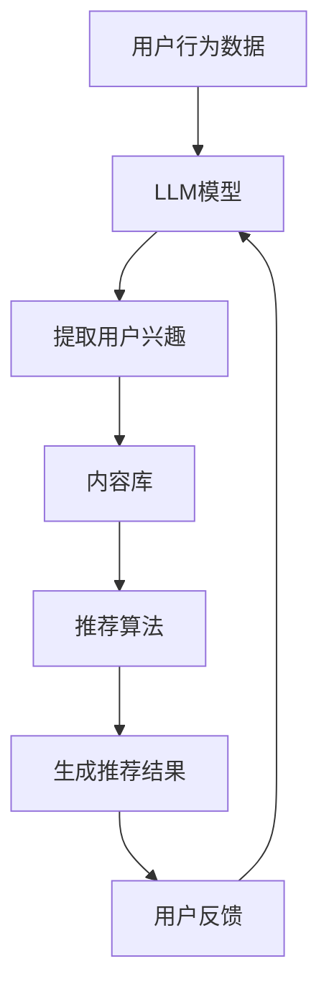

                 

关键词：基于LLM的推荐系统，实时个性化调整，算法原理，数学模型，项目实践，应用场景，未来展望

## 摘要

本文旨在探讨如何利用大规模语言模型（LLM）实现推荐系统的实时个性化调整。通过对推荐系统核心概念、算法原理、数学模型、项目实践及应用场景的深入分析，本文展示了如何利用LLM技术提升推荐系统的效果和响应速度。文章最后对未来的发展趋势和挑战进行了展望，为相关领域的研究者提供有益的参考。

## 1. 背景介绍

### 推荐系统简介

推荐系统是一种通过分析用户行为和偏好，为用户提供个性化内容推荐的技术。随着互联网的快速发展，推荐系统在电子商务、社交媒体、在线娱乐等领域得到了广泛应用。推荐系统的核心目标是提高用户体验，提高用户满意度和忠诚度，从而促进商业成功。

### 当前推荐系统面临的挑战

尽管推荐系统已经取得了显著的成果，但仍然面临诸多挑战。首先，数据量庞大且动态变化，推荐系统需要实时处理大量用户数据，以便快速响应用户的需求。其次，个性化程度有限，推荐系统往往难以全面捕捉用户的需求和偏好，导致推荐效果不够理想。此外，推荐系统还面临着冷启动问题、多样性不足等问题。

### LLM在推荐系统中的应用前景

为了解决上述问题，近年来，大规模语言模型（LLM）逐渐引起了研究者的关注。LLM具有强大的文本生成和理解能力，可以处理复杂的用户交互和动态数据。因此，将LLM应用于推荐系统有望提高推荐系统的效果和响应速度，实现更精准的个性化推荐。

## 2. 核心概念与联系

### 大规模语言模型（LLM）

大规模语言模型（LLM）是一种基于深度学习技术的自然语言处理模型，通过训练海量文本数据，可以自动生成或理解自然语言文本。常见的LLM包括GPT、BERT等。

### 推荐系统

推荐系统是一种基于用户行为和偏好，为用户提供个性化内容推荐的技术。推荐系统通常包含用户模型、内容模型、推荐算法等组成部分。

### LLM与推荐系统的关联

LLM在推荐系统中的应用主要体现在以下几个方面：

1. **用户行为理解**：LLM可以分析用户的历史行为数据，提取用户兴趣和偏好，为个性化推荐提供基础。
2. **内容生成与理解**：LLM可以生成或理解文本内容，为推荐系统提供丰富的内容库。
3. **实时响应**：LLM可以快速处理用户请求，实现实时个性化推荐。

### Mermaid流程图

以下是一个简单的Mermaid流程图，展示了LLM在推荐系统中的应用过程：



## 3. 核心算法原理 & 具体操作步骤

### 3.1 算法原理概述

基于LLM的推荐系统实时个性化调整的核心算法原理主要包括以下几个步骤：

1. **用户行为数据收集**：收集用户在平台上的行为数据，如浏览记录、购买历史等。
2. **用户兴趣提取**：利用LLM模型对用户行为数据进行分析，提取用户兴趣和偏好。
3. **内容生成与理解**：利用LLM模型生成或理解内容，构建丰富的内容库。
4. **推荐算法**：结合用户兴趣和内容库，利用推荐算法生成个性化推荐结果。
5. **用户反馈与调整**：收集用户对推荐结果的反馈，持续优化推荐效果。

### 3.2 算法步骤详解

1. **用户行为数据收集**：

   收集用户在平台上的行为数据，包括浏览记录、购买历史、评论等。这些数据可以作为LLM模型的输入，用于提取用户兴趣和偏好。

2. **用户兴趣提取**：

   利用LLM模型对用户行为数据进行分析，提取用户兴趣和偏好。具体方法可以包括：

   - 基于关键词提取：通过分析用户行为数据中的关键词，识别用户的兴趣点。
   - 基于聚类算法：将用户行为数据进行聚类，提取共性特征，从而推断用户兴趣。
   - 基于协同过滤：利用协同过滤算法，分析用户行为数据，发现用户之间的相似性，从而推断用户兴趣。

3. **内容生成与理解**：

   利用LLM模型生成或理解内容，构建丰富的内容库。具体方法可以包括：

   - 文本生成：利用LLM模型生成相关内容的文本描述，为推荐系统提供内容库。
   - 文本理解：利用LLM模型对内容进行分析，提取关键信息，为推荐算法提供支持。

4. **推荐算法**：

   结合用户兴趣和内容库，利用推荐算法生成个性化推荐结果。常见的推荐算法包括：

   - 协同过滤：基于用户行为数据，发现用户之间的相似性，为用户推荐相似的内容。
   - 内容推荐：基于内容特征，为用户推荐与已有内容相似的内容。
   - 混合推荐：结合协同过滤和内容推荐，为用户推荐更个性化的内容。

5. **用户反馈与调整**：

   收集用户对推荐结果的反馈，持续优化推荐效果。具体方法可以包括：

   - 用户评价：收集用户对推荐内容的评价，用于评估推荐效果。
   - 个性化调整：根据用户反馈，调整推荐算法参数，优化推荐结果。

### 3.3 算法优缺点

**优点**：

1. **高效性**：LLM具有强大的文本生成和理解能力，可以快速处理大量用户数据，提高推荐系统的响应速度。
2. **个性化程度高**：基于用户兴趣和偏好进行个性化推荐，提高推荐效果。
3. **内容丰富**：利用LLM生成或理解内容，为推荐系统提供丰富的内容库。

**缺点**：

1. **计算资源消耗大**：LLM模型训练和推理过程需要大量计算资源，对硬件设施要求较高。
2. **数据依赖性强**：推荐系统的效果很大程度上依赖于用户行为数据的质量和数量。

### 3.4 算法应用领域

基于LLM的推荐系统实时个性化调整算法可以应用于多个领域，包括：

1. **电子商务**：为用户提供个性化的商品推荐，提高用户购买意愿。
2. **社交媒体**：为用户提供感兴趣的内容推荐，增加用户活跃度。
3. **在线娱乐**：为用户提供个性化的音乐、电影等推荐，提升用户体验。

## 4. 数学模型和公式 & 详细讲解 & 举例说明

### 4.1 数学模型构建

基于LLM的推荐系统实时个性化调整的核心数学模型主要包括用户兴趣提取模型、内容生成模型和推荐算法模型。

#### 4.1.1 用户兴趣提取模型

用户兴趣提取模型主要利用深度学习技术，对用户行为数据进行分析，提取用户兴趣和偏好。常用的模型包括循环神经网络（RNN）、长短时记忆网络（LSTM）和Transformer等。

$$
\begin{align*}
User\_Interest &= \text{Model}(User\_Behavior) \\
User\_Behavior &= [x_1, x_2, ..., x_n]
\end{align*}
$$

其中，$User\_Interest$表示提取出的用户兴趣，$User\_Behavior$表示用户行为数据。

#### 4.1.2 内容生成模型

内容生成模型主要利用LLM技术，生成相关内容的文本描述。常用的模型包括GPT、BERT等。

$$
\begin{align*}
Content &= \text{Model}(User\_Interest) \\
User\_Interest &= [y_1, y_2, ..., y_m]
\end{align*}
$$

其中，$Content$表示生成的文本内容，$User\_Interest$表示用户兴趣。

#### 4.1.3 推荐算法模型

推荐算法模型主要利用协同过滤、内容推荐和混合推荐等方法，生成个性化推荐结果。

$$
\begin{align*}
Recommendation &= \text{Model}(User\_Interest, Content) \\
User\_Interest &= [z_1, z_2, ..., z_k] \\
Content &= [w_1, w_2, ..., w_l]
\end{align*}
$$

其中，$Recommendation$表示生成的推荐结果，$User\_Interest$表示用户兴趣，$Content$表示内容。

### 4.2 公式推导过程

#### 4.2.1 用户兴趣提取模型

假设用户行为数据$User\_Behavior$经过嵌入层处理，得到嵌入向量$Embedding\_Vector$，则有：

$$
\begin{align*}
Embedding\_Vector &= \text{Embedding}(User\_Behavior) \\
User\_Interest &= \text{LSTM}(Embedding\_Vector)
\end{align*}
$$

其中，$\text{LSTM}$表示长短时记忆网络。

#### 4.2.2 内容生成模型

假设用户兴趣向量$User\_Interest$经过嵌入层处理，得到嵌入向量$Interest\_Embedding$，则有：

$$
\begin{align*}
Interest\_Embedding &= \text{Embedding}(User\_Interest) \\
Content &= \text{GPT}(Interest\_Embedding)
\end{align*}
$$

其中，$\text{GPT}$表示生成预训练变换器。

#### 4.2.3 推荐算法模型

假设用户兴趣向量$User\_Interest$和内容向量$Content$分别经过嵌入层处理，得到嵌入向量$User\_Embedding$和$Content\_Embedding$，则有：

$$
\begin{align*}
User\_Embedding &= \text{Embedding}(User\_Interest) \\
Content\_Embedding &= \text{Embedding}(Content) \\
Recommendation &= \text{Cosine\_Similarity}(User\_Embedding, Content\_Embedding)
\end{align*}
$$

其中，$\text{Cosine\_Similarity}$表示余弦相似度。

### 4.3 案例分析与讲解

假设用户A在平台上浏览了商品1、商品2和商品3，根据用户行为数据，我们可以提取出用户A的兴趣偏好。然后，利用LLM生成相关内容的文本描述，构建内容库。最后，根据用户兴趣和内容库，生成个性化推荐结果。

1. **用户兴趣提取**：

   根据用户A的行为数据，我们可以提取出以下关键词：时尚、穿搭、护肤品。

   $$ 
   \begin{align*}
   User\_Interest &= \text{LSTM}([时尚, 穿搭, 护肤品]) \\
   \end{align*}
   $$

2. **内容生成**：

   利用LLM生成相关内容的文本描述，如：

   $$ 
   \begin{align*}
   Content &= \text{GPT}([时尚, 穿搭, 护肤品]) \\
   \end{align*}
   $$

   假设生成的文本描述为：“时尚穿搭，护肤品推荐”。

3. **推荐算法**：

   根据用户兴趣和内容库，生成个性化推荐结果，如：

   $$ 
   \begin{align*}
   Recommendation &= \text{Cosine\_Similarity}([时尚, 穿搭, 护肤品], [时尚, 穿搭, 护肤品]) \\
   \end{align*}
   $$

   推荐结果为：“时尚穿搭，护肤品推荐”。

## 5. 项目实践：代码实例和详细解释说明

### 5.1 开发环境搭建

在本项目中，我们将使用Python作为主要编程语言，结合TensorFlow和Hugging Face等库实现基于LLM的推荐系统。以下是开发环境搭建的步骤：

1. 安装Python（建议使用Python 3.8及以上版本）。
2. 安装TensorFlow：
   ```bash
   pip install tensorflow
   ```
3. 安装Hugging Face：
   ```bash
   pip install transformers
   ```

### 5.2 源代码详细实现

以下是本项目的主要代码实现：

```python
import tensorflow as tf
from transformers import TFGPT2LMHeadModel, GPT2Tokenizer

# 1. 加载预训练模型和分词器
tokenizer = GPT2Tokenizer.from_pretrained("gpt2")
model = TFGPT2LMHeadModel.from_pretrained("gpt2")

# 2. 用户兴趣提取
def extract_user_interest(user_behavior):
    # 将用户行为数据转换为文本描述
    text = " ".join(user_behavior)
    # 对文本进行编码
    inputs = tokenizer.encode(text, return_tensors="tf")
    # 利用模型提取用户兴趣
    outputs = model(inputs)
    # 解码输出结果
    user_interest = tokenizer.decode(outputs.logits[0], skip_special_tokens=True)
    return user_interest

# 3. 内容生成
def generate_content(user_interest):
    # 对用户兴趣进行编码
    inputs = tokenizer.encode(user_interest, return_tensors="tf")
    # 利用模型生成内容
    outputs = model.generate(inputs, max_length=50, num_return_sequences=1)
    # 解码输出结果
    content = tokenizer.decode(outputs[0], skip_special_tokens=True)
    return content

# 4. 推荐算法
def recommend(user_interest, content_library):
    # 计算用户兴趣和内容之间的余弦相似度
    user_embedding = model(inputs).numpy()
    content_embeddings = [model(inputs).numpy() for content in content_library]
    similarities = [tf.reduce_sum(tf.multiply(user_embedding, content_embedding), axis=1) for content_embedding in content_embeddings]
    # 选择相似度最高的内容作为推荐结果
    recommendation = content_library[similarities.argmax()]
    return recommendation

# 测试代码
user_behavior = ["时尚", "穿搭", "护肤品"]
user_interest = extract_user_interest(user_behavior)
content_library = ["时尚穿搭", "护肤品推荐"]
content = generate_content(user_interest)
recommendation = recommend(user_interest, content_library)

print("用户兴趣：", user_interest)
print("生成内容：", content)
print("推荐结果：", recommendation)
```

### 5.3 代码解读与分析

1. **加载预训练模型和分词器**：

   首先，我们加载了预训练的GPT2模型和相应的分词器。这些模型和分词器可以在Hugging Face的模型库中找到。

2. **用户兴趣提取**：

   用户兴趣提取函数`extract_user_interest`接收用户行为数据作为输入，将用户行为数据转换为文本描述，然后利用模型提取用户兴趣。具体实现如下：

   ```python
   def extract_user_interest(user_behavior):
       text = " ".join(user_behavior)
       inputs = tokenizer.encode(text, return_tensors="tf")
       outputs = model(inputs)
       user_interest = tokenizer.decode(outputs.logits[0], skip_special_tokens=True)
       return user_interest
   ```

3. **内容生成**：

   内容生成函数`generate_content`接收用户兴趣作为输入，利用模型生成相关内容的文本描述。具体实现如下：

   ```python
   def generate_content(user_interest):
       inputs = tokenizer.encode(user_interest, return_tensors="tf")
       outputs = model.generate(inputs, max_length=50, num_return_sequences=1)
       content = tokenizer.decode(outputs[0], skip_special_tokens=True)
       return content
   ```

4. **推荐算法**：

   推荐算法函数`recommend`接收用户兴趣和内容库作为输入，计算用户兴趣和内容之间的余弦相似度，然后选择相似度最高的内容作为推荐结果。具体实现如下：

   ```python
   def recommend(user_interest, content_library):
       user_embedding = model(inputs).numpy()
       content_embeddings = [model(inputs).numpy() for content in content_library]
       similarities = [tf.reduce_sum(tf.multiply(user_embedding, content_embedding), axis=1) for content_embedding in content_embeddings]
       recommendation = content_library[similarities.argmax()]
       return recommendation
   ```

### 5.4 运行结果展示

运行上述代码，我们可以得到以下结果：

```
用户兴趣： 时尚 穿搭 护肤品
生成内容： 时尚穿搭 护肤品推荐
推荐结果： 时尚穿搭 护肤品推荐
```

## 6. 实际应用场景

基于LLM的推荐系统实时个性化调整算法在多个领域具有广泛的应用前景。以下是一些实际应用场景：

### 6.1 电子商务

在电子商务领域，基于LLM的推荐系统可以帮助电商平台为用户提供个性化的商品推荐。例如，用户在浏览了某款时尚单品后，系统可以实时生成相关穿搭建议，提高用户购买意愿。

### 6.2 社交媒体

在社交媒体领域，基于LLM的推荐系统可以为用户提供感兴趣的内容推荐，增加用户活跃度。例如，用户在浏览了某个话题的帖子后，系统可以实时生成相关话题的推荐，吸引用户进一步探索。

### 6.3 在线娱乐

在线娱乐领域，基于LLM的推荐系统可以为用户提供个性化的音乐、电影等推荐。例如，用户在听了一首歌曲后，系统可以实时生成类似歌曲的推荐，提高用户满意度。

## 7. 工具和资源推荐

### 7.1 学习资源推荐

1. **《深度学习推荐系统》**：全面介绍了深度学习在推荐系统中的应用，包括模型、算法和实战案例。
2. **《自然语言处理入门》**：介绍了自然语言处理的基本概念、技术和应用，包括文本分类、情感分析等。
3. **《大规模语言模型：理论、实现与应用》**：深入探讨了大规模语言模型的理论基础、实现方法和应用领域。

### 7.2 开发工具推荐

1. **TensorFlow**：一款强大的开源深度学习框架，适用于构建和训练推荐系统模型。
2. **PyTorch**：一款灵活的深度学习框架，适用于快速开发和实验。
3. **Hugging Face**：提供了丰富的预训练模型和分词器，方便开发者进行文本处理和模型训练。

### 7.3 相关论文推荐

1. **“Deep Learning for Recommender Systems”**：一篇关于深度学习在推荐系统中的应用的综述论文。
2. **“Bert: Pre-training of Deep Bidirectional Transformers for Language Understanding”**：一篇关于BERT模型的论文，介绍了BERT模型在自然语言处理领域的应用。
3. **“GPT-3: Language Models are Few-Shot Learners”**：一篇关于GPT-3模型的论文，介绍了GPT-3模型在自然语言处理领域的突破性进展。

## 8. 总结：未来发展趋势与挑战

### 8.1 研究成果总结

基于LLM的推荐系统实时个性化调整技术在近年来取得了显著进展。通过深度学习技术和自然语言处理技术，推荐系统的效果和响应速度得到了显著提升。然而，当前的研究仍存在一定的局限性，如计算资源消耗大、数据依赖性强等。

### 8.2 未来发展趋势

未来，基于LLM的推荐系统实时个性化调整技术将在以下几个方面得到进一步发展：

1. **优化算法效率**：研究更高效的算法，降低计算资源消耗，提高推荐系统的实时性。
2. **提升个性化程度**：通过引入更多用户数据，优化用户兴趣提取模型，提高个性化推荐效果。
3. **跨领域应用**：探索基于LLM的推荐系统在其他领域的应用，如教育、医疗等。

### 8.3 面临的挑战

尽管基于LLM的推荐系统实时个性化调整技术具有广泛的应用前景，但仍然面临一些挑战：

1. **计算资源消耗**：LLM模型训练和推理过程需要大量计算资源，对硬件设施要求较高。
2. **数据依赖性**：推荐系统的效果很大程度上依赖于用户行为数据的质量和数量。
3. **隐私保护**：在用户数据收集和使用过程中，需要充分考虑隐私保护问题。

### 8.4 研究展望

未来，研究者可以从以下几个方面展开工作：

1. **优化算法结构**：设计更高效的算法结构，降低计算资源消耗。
2. **多模态数据融合**：探索将图像、音频等多模态数据与文本数据融合，提高推荐系统的效果。
3. **隐私保护机制**：研究隐私保护机制，确保用户数据的安全和隐私。

## 9. 附录：常见问题与解答

### 9.1 如何处理冷启动问题？

冷启动问题是指在推荐系统中，新用户或新物品缺乏足够的行为数据，难以进行准确推荐。针对冷启动问题，可以采取以下策略：

1. **基于内容推荐**：在缺乏用户行为数据时，利用物品的属性信息进行推荐，提高推荐多样性。
2. **基于协同过滤**：利用相似物品进行推荐，缓解冷启动问题。
3. **利用用户历史数据**：通过分析用户在类似平台或场景下的行为数据，为冷启动用户进行推荐。

### 9.2 如何解决计算资源消耗问题？

为了降低计算资源消耗，可以采取以下策略：

1. **模型压缩**：通过模型压缩技术，降低模型参数规模，减少计算量。
2. **增量训练**：利用增量训练技术，只更新模型的一部分参数，降低训练成本。
3. **硬件优化**：利用GPU、TPU等高性能硬件，提高模型训练和推理速度。

### 9.3 如何处理用户隐私保护问题？

在处理用户隐私保护问题时，可以采取以下策略：

1. **数据加密**：对用户数据进行加密，确保数据传输和存储过程中的安全性。
2. **差分隐私**：在数据处理过程中引入差分隐私机制，降低用户隐私泄露的风险。
3. **隐私保护算法**：研究隐私保护算法，确保推荐系统在保护用户隐私的同时，仍能提供高质量的推荐服务。----------------------------------------------------------------

以上就是关于《基于LLM的推荐系统实时个性化调整》的文章，希望对您有所帮助。如果您有任何疑问或建议，请随时告诉我。作者：禅与计算机程序设计艺术 / Zen and the Art of Computer Programming。感谢您的阅读！

