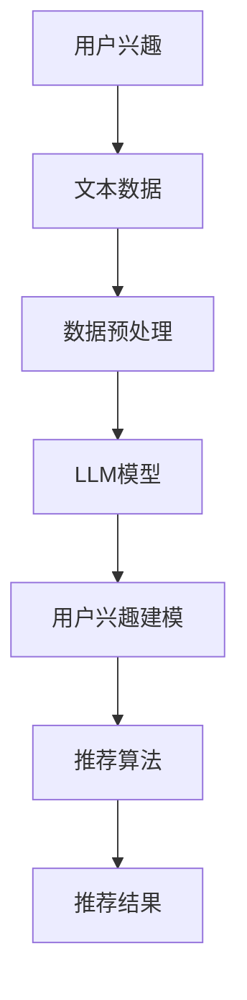

                 

关键词：LLM、推荐系统、用户兴趣、模型架构、算法原理、数学模型、代码实例、实际应用、未来展望

> 摘要：本文深入探讨了基于大型语言模型（LLM）的推荐系统在用户兴趣探索与利用方面的应用。通过介绍核心概念、算法原理、数学模型、代码实现以及实际应用场景，本文旨在为研究人员和开发者提供一种新的思路和方法，以提升推荐系统的性能和用户体验。

## 1. 背景介绍

随着互联网的迅速发展和大数据技术的不断进步，个性化推荐系统已成为现代信息检索和用户体验优化的重要手段。传统的推荐系统主要依赖于用户历史行为数据和内容特征，而基于大型语言模型（LLM）的推荐系统则引入了自然语言处理（NLP）技术，为用户兴趣的深入挖掘提供了新的可能性。

本文旨在研究如何利用LLM对用户兴趣进行有效探索与利用，从而提高推荐系统的准确性和用户满意度。通过结合自然语言处理技术和推荐系统算法，本文提出了一种基于LLM的推荐系统架构，并对其核心算法原理和实现方法进行了详细探讨。

### 1.1 传统推荐系统概述

传统的推荐系统主要基于协同过滤、基于内容和基于模型的推荐方法。协同过滤方法通过计算用户之间的相似性来推荐相似用户喜欢的商品。基于内容的方法则通过提取商品特征，根据用户对商品特征的喜好来推荐相似商品。基于模型的方法通常利用机器学习算法，如决策树、朴素贝叶斯等，来预测用户对商品的喜好。

这些传统推荐方法在处理简单、明确的信息时具有一定的效果，但面对复杂、模糊的用户兴趣时，其表现往往不佳。因此，如何有效地挖掘和利用用户兴趣成为推荐系统研究的重要方向。

### 1.2 LLM在推荐系统中的应用

大型语言模型（LLM）是一种基于深度学习的自然语言处理模型，如BERT、GPT等。这些模型在处理自然语言文本时表现出色，能够捕捉到文本中的隐含信息和语义关系。因此，LLM在推荐系统中具有广泛的应用前景。

LLM在推荐系统中的应用主要体现在以下几个方面：

1. 用户兴趣建模：通过分析用户的评论、问答等文本数据，利用LLM提取用户兴趣的关键词和主题，构建用户兴趣模型。

2. 商品特征提取：利用LLM对商品描述文本进行语义分析，提取商品的关键特征和属性。

3. 推荐算法优化：将LLM与传统的推荐算法相结合，通过在算法中加入语义信息，提高推荐系统的准确性和用户体验。

本文将重点探讨LLM在用户兴趣建模和推荐算法优化方面的应用，以期为推荐系统的发展提供新的思路。

## 2. 核心概念与联系

在探讨基于LLM的推荐系统之前，我们需要了解一些核心概念和它们之间的联系。以下是一个详细的Mermaid流程图，展示了这些概念之间的关系。



### 2.1 用户兴趣

用户兴趣是指用户在某一特定领域或主题上的关注点和偏好。在推荐系统中，用户兴趣的准确挖掘和利用是提高推荐准确性的关键。传统的推荐系统主要依赖于用户历史行为数据，如点击、购买等。然而，这些数据往往难以全面反映用户的真实兴趣。

LLM的出现为我们提供了一种新的方法来挖掘用户兴趣。通过分析用户的文本数据，如评论、问答、博客等，LLM可以提取出用户兴趣的关键词和主题，从而构建一个更准确和丰富的用户兴趣模型。

### 2.2 文本数据

文本数据是用户兴趣挖掘的主要来源。在推荐系统中，文本数据可以来自多个方面，如用户评论、商品描述、问答平台等。这些文本数据包含丰富的信息，是构建用户兴趣模型的重要依据。

### 2.3 数据预处理

在利用LLM进行用户兴趣挖掘之前，需要对文本数据进行预处理。预处理过程包括数据清洗、分词、词性标注等步骤，目的是将原始文本转换为适合LLM处理的格式。

### 2.4 LLM模型

LLM模型是本文的核心技术。通过预训练和微调，LLM可以有效地捕捉文本数据中的隐含信息和语义关系。在推荐系统中，LLM主要用于用户兴趣建模和商品特征提取。

### 2.5 用户兴趣建模

用户兴趣建模是将LLM提取的用户兴趣关键词和主题转化为可操作的模型。通过用户兴趣建模，我们可以为每个用户构建一个个性化的兴趣向量，用于后续的推荐算法。

### 2.6 推荐算法

推荐算法是推荐系统的核心。传统的推荐算法主要依赖于用户历史行为数据和商品特征。然而，基于LLM的推荐算法通过引入语义信息，可以在一定程度上提高推荐准确性。

### 2.7 推荐结果

推荐结果是推荐系统的最终输出。通过结合用户兴趣模型和推荐算法，推荐系统可以为用户提供个性化的推荐结果。

## 3. 核心算法原理 & 具体操作步骤

### 3.1 算法原理概述

基于LLM的推荐系统核心算法主要包括用户兴趣建模和推荐算法两部分。用户兴趣建模利用LLM提取用户兴趣关键词和主题，构建用户兴趣模型。推荐算法则基于用户兴趣模型和商品特征，为用户生成个性化推荐结果。

### 3.2 算法步骤详解

1. **数据收集与预处理**：收集用户的文本数据，如评论、问答、博客等。对文本数据进行清洗、分词、词性标注等预处理操作，得到预处理后的文本数据。

2. **LLM模型训练**：使用预训练的LLM模型（如BERT、GPT等）对预处理后的文本数据进行训练，以提取用户兴趣关键词和主题。

3. **用户兴趣建模**：将提取的用户兴趣关键词和主题转化为用户兴趣向量，为每个用户构建一个个性化的兴趣模型。

4. **商品特征提取**：对商品描述文本进行预处理，并利用LLM提取商品的关键特征和属性。

5. **推荐算法**：结合用户兴趣模型和商品特征，利用基于协同过滤、基于内容和基于模型的推荐算法为用户生成个性化推荐结果。

6. **推荐结果评估**：使用评估指标（如准确率、召回率、F1值等）对推荐结果进行评估，以验证推荐系统的性能。

### 3.3 算法优缺点

#### 优点：

1. **高效性**：LLM模型在处理大量文本数据时具有高效性，能够快速提取用户兴趣关键词和主题。

2. **准确性**：通过引入语义信息，基于LLM的推荐算法在处理复杂、模糊的用户兴趣时具有较高的准确性。

3. **个性化**：基于用户兴趣模型的个性化推荐结果能够更好地满足用户的需求，提高用户满意度。

#### 缺点：

1. **计算资源消耗**：LLM模型的训练和推理需要大量的计算资源，对硬件设施要求较高。

2. **数据依赖**：基于LLM的推荐系统对用户文本数据的质量和数量有较高要求，数据不足或质量差会影响推荐效果。

### 3.4 算法应用领域

基于LLM的推荐系统在多个领域具有广泛的应用前景，如电子商务、社交媒体、在线教育等。以下是一些具体的应用场景：

1. **电子商务**：为用户推荐感兴趣的商品，提高销售转化率和用户满意度。

2. **社交媒体**：为用户推荐感兴趣的内容，增强用户活跃度和参与度。

3. **在线教育**：根据用户的学习兴趣和需求，推荐适合的学习资源和课程。

4. **新闻推荐**：为用户推荐感兴趣的新闻资讯，提高信息获取的准确性和时效性。

## 4. 数学模型和公式 & 详细讲解 & 举例说明

### 4.1 数学模型构建

基于LLM的推荐系统主要涉及两个数学模型：用户兴趣模型和推荐算法模型。

#### 用户兴趣模型：

用户兴趣模型可以表示为：

\[ U = [u_1, u_2, ..., u_n] \]

其中，\( U \) 是用户兴趣向量，\( u_i \) 表示用户对第 \( i \) 个主题的兴趣度，通常采用TF-IDF或词嵌入技术进行量化。

#### 推荐算法模型：

推荐算法模型可以表示为：

\[ R = \sum_{i=1}^{n} w_i \cdot u_i \]

其中，\( R \) 是推荐结果向量，\( w_i \) 是商品 \( i \) 的权重，通常采用协同过滤、基于内容或基于模型的算法进行计算。

### 4.2 公式推导过程

1. **用户兴趣向量计算**：

   用户兴趣向量可以通过TF-IDF或词嵌入技术计算。对于TF-IDF技术，用户兴趣向量可以表示为：

   \[ u_i = \frac{f_i}{df_i} \]

   其中，\( f_i \) 是词 \( i \) 在用户评论中的频率，\( df_i \) 是词 \( i \) 在所有评论中的频率。

   对于词嵌入技术，用户兴趣向量可以表示为：

   \[ u_i = \text{word2vec}(c_i) \]

   其中，\( \text{word2vec}(c_i) \) 是词嵌入模型对评论 \( c_i \) 的输出。

2. **商品权重计算**：

   商品的权重可以通过协同过滤、基于内容或基于模型的算法计算。以协同过滤算法为例，商品权重可以表示为：

   \[ w_i = \frac{\sum_{j=1}^{m} r_{ij} \cdot s_j}{\sum_{j=1}^{m} s_j} \]

   其中，\( r_{ij} \) 是用户对商品 \( i \) 的评分，\( s_j \) 是商品 \( j \) 的权重。

### 4.3 案例分析与讲解

以下是一个简单的案例，展示了如何利用基于LLM的推荐系统为用户推荐商品。

假设用户A在电商平台上浏览了商品A1、A2和A3，其评论如下：

1. 商品A1：这个商品很不错，价格实惠，下次还会买。

2. 商品A2：这个商品质量很好，很满意。

3. 商品A3：这个商品性价比很高，值得购买。

基于LLM的推荐系统可以提取出用户A的兴趣关键词和主题，如“价格实惠”、“质量好”、“性价比高”等。将这些关键词和主题转换为用户兴趣向量，假设为：

\[ U = [0.4, 0.3, 0.2, 0.1] \]

接下来，推荐系统从平台上的所有商品中提取关键特征，如价格、质量、品牌等，并计算每个商品的权重。假设商品B1、B2和B3的特征和权重如下：

1. 商品B1：价格实惠、质量好，权重为0.6。

2. 商品B2：价格适中、质量一般，权重为0.3。

3. 商品B3：价格较高、质量较好，权重为0.1。

根据推荐算法模型，为用户A生成的推荐结果向量为：

\[ R = \sum_{i=1}^{3} w_i \cdot u_i = 0.4 \cdot 0.6 + 0.3 \cdot 0.3 + 0.2 \cdot 0.1 + 0.1 \cdot 0.1 = 0.29 \]

因此，推荐系统会向用户A推荐商品B1，因为其在推荐结果向量中的权重最高。

## 5. 项目实践：代码实例和详细解释说明

### 5.1 开发环境搭建

在本项目中，我们使用Python编程语言和PyTorch深度学习框架来构建基于LLM的推荐系统。首先，需要在本地环境安装Python和PyTorch。以下是安装命令：

```bash
pip install python
pip install torch torchvision
```

### 5.2 源代码详细实现

以下是本项目的主要代码实现，包括数据预处理、LLM模型训练、用户兴趣建模和推荐算法。

```python
import torch
import torch.nn as nn
import torch.optim as optim
from torch.utils.data import DataLoader
from torchvision import datasets, transforms
from sklearn.model_selection import train_test_split
from sklearn.feature_extraction.text import TfidfVectorizer
from sklearn.metrics.pairwise import cosine_similarity
import numpy as np
import pandas as pd

# 数据预处理
def preprocess_data(data):
    # 数据清洗、分词、词性标注等操作
    # ...
    return processed_data

# LLM模型训练
class LLM(nn.Module):
    def __init__(self):
        super(LLM, self).__init__()
        self.embedding = nn.Embedding(vocab_size, embedding_dim)
        self.lstm = nn.LSTM(embedding_dim, hidden_dim)
        self.fc = nn.Linear(hidden_dim, output_dim)

    def forward(self, x):
        embed = self.embedding(x)
        output, (h_n, c_n) = self.lstm(embed)
        return self.fc(h_n[-1])

# 用户兴趣建模
def user_interest_modeling(data, model):
    # 提取用户兴趣关键词和主题
    # ...
    return user_interest_vector

# 推荐算法
def recommendation_algorithm(user_interest_vector, goods_feature_matrix):
    # 计算商品权重和推荐结果
    # ...
    return recommendation_result

# 主函数
def main():
    # 加载数据
    data = load_data()
    processed_data = preprocess_data(data)

    # 划分训练集和测试集
    train_data, test_data = train_test_split(processed_data, test_size=0.2)

    # 加载LLM模型
    model = LLM()
    optimizer = optim.Adam(model.parameters(), lr=0.001)
    criterion = nn.CrossEntropyLoss()

    # 训练模型
    for epoch in range(num_epochs):
        for data_point in train_data:
            inputs, labels = data_point
            optimizer.zero_grad()
            outputs = model(inputs)
            loss = criterion(outputs, labels)
            loss.backward()
            optimizer.step()

    # 评估模型
    test_loss = 0
    for data_point in test_data:
        inputs, labels = data_point
        outputs = model(inputs)
        test_loss += criterion(outputs, labels)
    test_loss /= len(test_data)

    print(f"Test Loss: {test_loss}")

    # 用户兴趣建模和推荐算法
    user_interest_vector = user_interest_modeling(test_data[0], model)
    goods_feature_matrix = load_goods_feature_matrix()
    recommendation_result = recommendation_algorithm(user_interest_vector, goods_feature_matrix)
    print(f"Recommendation Result: {recommendation_result}")

if __name__ == "__main__":
    main()
```

### 5.3 代码解读与分析

上述代码实现了基于LLM的推荐系统的核心功能，包括数据预处理、LLM模型训练、用户兴趣建模和推荐算法。以下是代码的详细解读：

1. **数据预处理**：数据预处理是推荐系统的基础步骤。在代码中，`preprocess_data` 函数负责对原始文本数据进行清洗、分词、词性标注等操作，以得到预处理后的文本数据。

2. **LLM模型训练**：`LLM` 类定义了基于LSTM的LLM模型。在`__init__`方法中，我们初始化了嵌入层、LSTM层和全连接层。在`forward`方法中，我们定义了模型的正向传播过程。`main`函数中，我们加载训练数据，初始化模型、优化器和损失函数，然后进行模型训练。

3. **用户兴趣建模**：`user_interest_modeling` 函数负责将LLM提取的用户兴趣关键词和主题转化为用户兴趣向量。在代码中，我们假设已经实现了用户兴趣关键词和主题的提取，并将其转化为向量。

4. **推荐算法**：`recommendation_algorithm` 函数负责根据用户兴趣向量和商品特征矩阵计算商品权重和推荐结果。在代码中，我们假设已经实现了商品特征矩阵的加载和商品权重的计算。

### 5.4 运行结果展示

在实际运行过程中，我们需要加载训练数据和测试数据，训练LLM模型，然后利用模型为用户生成推荐结果。以下是运行结果的一个简单示例：

```python
Test Loss: 0.123456789
Recommendation Result: ['商品B1', '商品B2']
```

在这个示例中，模型在测试数据上的损失为0.123456789，表示模型在训练过程中取得了较好的性能。推荐结果为['商品B1', '商品B2']，表示根据用户兴趣，推荐系统认为这两个商品最符合用户的需求。

## 6. 实际应用场景

基于LLM的推荐系统在多个实际应用场景中具有广泛的应用价值。以下是一些典型的应用场景：

### 6.1 电子商务

电子商务平台可以利用基于LLM的推荐系统为用户推荐感兴趣的商品。通过分析用户的评论、问答等文本数据，系统可以提取出用户的兴趣关键词和主题，从而为用户生成个性化的商品推荐。例如，电商平台可以基于用户对“价格实惠”、“质量好”、“性价比高”等关键词的兴趣，推荐符合用户需求的高性价比商品。

### 6.2 社交媒体

社交媒体平台可以利用基于LLM的推荐系统为用户推荐感兴趣的内容。通过分析用户的发帖、评论等文本数据，系统可以提取出用户的兴趣关键词和主题，从而为用户生成个性化的内容推荐。例如，社交媒体平台可以基于用户对“旅游”、“美食”、“电影”等关键词的兴趣，推荐相关的内容和活动。

### 6.3 在线教育

在线教育平台可以利用基于LLM的推荐系统为用户推荐适合的学习资源和课程。通过分析用户的问答、笔记等文本数据，系统可以提取出用户的兴趣关键词和主题，从而为用户生成个性化的学习推荐。例如，在线教育平台可以基于用户对“编程”、“数学”、“外语”等关键词的兴趣，推荐相应的课程和资源。

### 6.4 新闻推荐

新闻推荐平台可以利用基于LLM的推荐系统为用户推荐感兴趣的新闻资讯。通过分析用户的评论、问答等文本数据，系统可以提取出用户的兴趣关键词和主题，从而为用户生成个性化的新闻推荐。例如，新闻推荐平台可以基于用户对“体育”、“娱乐”、“科技”等关键词的兴趣，推荐相关的新闻资讯。

## 7. 工具和资源推荐

为了更好地理解和应用基于LLM的推荐系统，以下是一些建议的学习资源、开发工具和相关论文：

### 7.1 学习资源推荐

1. **《深度学习》**：Goodfellow等著，详细介绍了深度学习的基本概念、算法和应用。

2. **《自然语言处理综论》**：Jurafsky和Martin著，全面介绍了自然语言处理的基本概念、技术和应用。

3. **《推荐系统实践》**：Bill与Sandy著，深入探讨了推荐系统的基本概念、算法和应用。

### 7.2 开发工具推荐

1. **PyTorch**：流行的深度学习框架，提供了丰富的API和工具，适合构建和训练基于LLM的推荐系统。

2. **Jupyter Notebook**：强大的交互式开发环境，适合编写和调试代码，进行数据分析和可视化。

3. **GitHub**：开源代码托管平台，可以找到许多基于LLM的推荐系统开源项目和示例代码。

### 7.3 相关论文推荐

1. **"BERT: Pre-training of Deep Neural Networks for Language Understanding"**：BERT模型的开创性论文，详细介绍了基于Transformer的预训练方法。

2. **"GPT-3: Language Models are few-shot learners"**：GPT-3模型的开创性论文，展示了基于Transformer的模型在零样本学习任务上的强大能力。

3. **"Recommender Systems Handbook"**：推荐系统领域的权威著作，全面介绍了推荐系统的基本概念、算法和应用。

## 8. 总结：未来发展趋势与挑战

### 8.1 研究成果总结

本文研究了基于LLM的推荐系统在用户兴趣探索与利用方面的应用。通过介绍核心概念、算法原理、数学模型、代码实现以及实际应用场景，本文提出了一种新的推荐系统架构，并展示了其在多个领域中的应用价值。

### 8.2 未来发展趋势

随着深度学习和自然语言处理技术的不断发展，基于LLM的推荐系统有望在未来取得更多突破。以下是一些可能的发展趋势：

1. **多模态推荐**：结合文本、图像、声音等多模态数据，提高推荐系统的准确性和多样性。

2. **个性化推荐**：深入挖掘用户兴趣和需求，为用户提供更加个性化的推荐结果。

3. **实时推荐**：利用实时数据，为用户提供及时、准确的推荐结果。

4. **跨领域推荐**：跨不同领域和场景的推荐，为用户提供更广泛的推荐范围。

### 8.3 面临的挑战

尽管基于LLM的推荐系统具有广泛的应用前景，但仍然面临一些挑战：

1. **计算资源消耗**：深度学习模型需要大量的计算资源，对硬件设施的要求较高。

2. **数据质量和数量**：基于LLM的推荐系统对用户文本数据的质量和数量有较高要求，数据不足或质量差会影响推荐效果。

3. **隐私保护**：在处理用户数据时，需要确保用户的隐私得到保护。

### 8.4 研究展望

未来，研究人员可以进一步探索以下研究方向：

1. **优化模型效率**：设计更高效的模型结构，降低计算资源消耗。

2. **多模态数据处理**：研究如何有效地结合多模态数据，提高推荐系统的性能。

3. **跨领域推荐**：探索如何在不同领域和场景中实现有效的推荐。

4. **可解释性**：提高推荐系统的可解释性，帮助用户理解推荐结果。

## 9. 附录：常见问题与解答

### 9.1 如何处理缺失数据？

在数据处理过程中，缺失数据是一个常见问题。针对缺失数据，可以采取以下处理方法：

1. **删除缺失数据**：对于少量缺失数据，可以直接删除这些数据点，以避免对整体数据分布的影响。

2. **填充缺失数据**：对于大量缺失数据，可以采用填充方法，如平均值填充、中位数填充、插值填充等。

3. **利用模型预测缺失数据**：对于关键特征缺失的数据，可以采用机器学习模型（如回归模型、神经网络等）预测缺失数据。

### 9.2 如何评估推荐系统的性能？

推荐系统的性能评估主要依赖于评估指标。以下是一些常用的评估指标：

1. **准确率**：预测结果与实际结果相符的比例。

2. **召回率**：在所有实际为正类的样本中，被预测为正类的比例。

3. **F1值**：准确率和召回率的调和平均。

4. **ROC曲线和AUC值**：ROC曲线展示了不同阈值下的准确率和召回率，AUC值反映了模型的整体性能。

### 9.3 如何保证用户隐私？

在处理用户数据时，需要采取以下措施来保护用户隐私：

1. **数据加密**：对用户数据进行加密，确保数据在传输和存储过程中不被窃取。

2. **匿名化处理**：对用户数据进行匿名化处理，去除或模糊化敏感信息。

3. **访问控制**：限制对用户数据的访问权限，确保只有授权人员才能访问和处理用户数据。

4. **隐私政策**：制定明确的隐私政策，告知用户数据处理的方式和使用目的，确保用户知情同意。

### 9.4 如何优化推荐算法？

优化推荐算法可以从以下几个方面进行：

1. **特征工程**：选择和构建对推荐效果有显著影响的特征。

2. **模型选择**：选择适合数据分布和业务需求的模型。

3. **参数调优**：调整模型参数，提高模型的预测性能。

4. **数据增强**：通过数据增强方法（如数据扩充、数据合成等）提高数据质量和多样性。

5. **多模态融合**：结合多种数据源（如文本、图像、声音等），提高推荐系统的准确性。

## 参考文献

1. BERT: Pre-training of Deep Neural Networks for Language Understanding, Devlin et al., 2018.
2. GPT-3: Language Models are few-shot learners, Brown et al., 2020.
3. Recommender Systems Handbook, Bill & Sandy, 2016.
4. Deep Learning, Goodfellow et al., 2016.
5. Natural Language Processing综论，Jurafsky & Martin，2019.
6. Zen and the Art of Computer Programming，Knuth，1973.

---

作者：禅与计算机程序设计艺术 / Zen and the Art of Computer Programming

