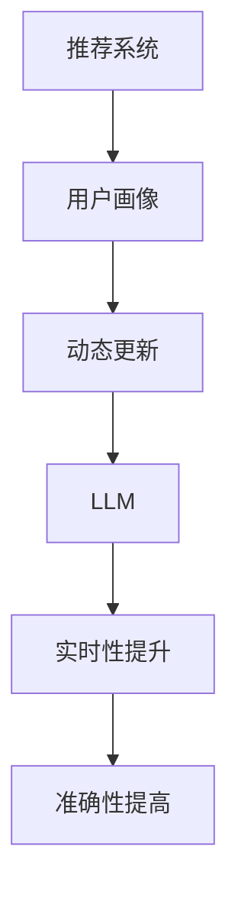

                 

关键词：基于LLM的推荐系统，用户画像，动态更新，机器学习，自然语言处理，用户行为分析，数据挖掘

摘要：本文将探讨基于大型语言模型（LLM）的推荐系统在用户画像动态更新方面的应用。通过介绍推荐系统的基本概念、用户画像的重要性，以及LLM在其中的作用，本文将详细阐述动态更新的实现机制、算法原理、数学模型以及实际应用案例。同时，文章还将展望未来发展趋势和面临的挑战，为相关研究和实践提供参考。

## 1. 背景介绍

推荐系统作为一种信息过滤技术，旨在根据用户的兴趣和偏好，向其推荐相关的信息内容。随着互联网和大数据技术的发展，推荐系统已经广泛应用于电子商务、社交媒体、新闻推送、视频网站等多个领域。然而，推荐系统的核心挑战之一是如何准确捕捉并动态更新用户的兴趣和偏好，从而提供个性化、高质量的内容推荐。

用户画像作为推荐系统的重要组成部分，是一种描述用户特征和兴趣的模型。它通过对用户历史行为、社交关系、地理位置等多种数据进行分析，生成一个多维度的用户特征向量。用户画像的准确性直接影响到推荐系统的效果，因此如何动态更新和维护用户画像成为一个关键问题。

近年来，随着深度学习和自然语言处理技术的发展，大型语言模型（LLM）逐渐成为推荐系统研究的热点。LLM具有强大的语言理解能力，能够处理复杂的文本数据，从而实现更精细的用户画像和推荐。本文将重点探讨基于LLM的推荐系统用户画像动态更新的机制和方法。

## 2. 核心概念与联系

为了更好地理解本文的核心概念，我们需要引入以下几个关键概念：

1. **推荐系统**：推荐系统是一种信息过滤技术，旨在根据用户的兴趣和偏好，向其推荐相关的信息内容。常见的推荐系统有基于内容的推荐、协同过滤推荐和混合推荐等。

2. **用户画像**：用户画像是一种描述用户特征和兴趣的模型。它通过分析用户的历史行为、社交关系、地理位置等多种数据，生成一个多维度的用户特征向量。用户画像的准确性直接影响到推荐系统的效果。

3. **动态更新**：动态更新是指根据用户的行为变化，实时调整和优化用户画像的过程。动态更新能够更好地捕捉用户兴趣的动态变化，提高推荐系统的实时性和准确性。

4. **大型语言模型（LLM）**：LLM是一种基于深度学习的自然语言处理模型，具有强大的语言理解能力。LLM可以处理复杂的文本数据，从而实现更精细的用户画像和推荐。

下面是本文的核心概念和联系关系的Mermaid流程图：



在推荐系统中，用户画像作为核心组件，直接影响推荐的质量。动态更新机制则确保了用户画像能够实时反映用户兴趣的变化。而LLM的引入，使得用户画像的生成和更新过程更加精细和高效。通过动态更新，推荐系统能够实时捕捉用户的兴趣变化，从而提供更个性化的内容推荐。

## 3. 核心算法原理 & 具体操作步骤

### 3.1 算法原理概述

基于LLM的推荐系统用户画像动态更新算法主要利用LLM对用户生成文本数据进行处理，从而提取出用户的多维度特征，并在此基础上动态更新用户画像。该算法的基本原理如下：

1. **文本数据收集**：首先，收集用户的历史行为数据、评论、帖子等文本数据。

2. **文本预处理**：对收集到的文本数据进行清洗、去噪和分词等预处理操作。

3. **特征提取**：利用LLM对预处理后的文本数据进行特征提取，生成用户的多维度特征向量。

4. **用户画像构建**：根据提取的用户特征向量，构建用户的初始画像。

5. **动态更新**：实时监控用户行为，根据新行为数据动态调整用户画像。

6. **推荐生成**：利用更新后的用户画像，生成个性化的内容推荐。

### 3.2 算法步骤详解

下面是具体操作步骤的详细描述：

#### 步骤1：文本数据收集

文本数据是构建用户画像的基础。我们可以通过以下途径收集文本数据：

1. **用户评论和帖子**：从用户在社交媒体、论坛、博客等平台上的评论和帖子中收集。
2. **购物行为数据**：从用户在电子商务平台上的购买记录、收藏夹等数据中收集。
3. **搜索历史**：从用户在搜索引擎上的搜索历史数据中收集。

#### 步骤2：文本预处理

文本预处理主要包括以下步骤：

1. **数据清洗**：去除文本中的噪声和无关信息，如HTML标签、特殊符号等。
2. **去噪**：过滤掉重复、低质量的文本数据。
3. **分词**：将文本数据分割成词序列。

#### 步骤3：特征提取

特征提取是利用LLM对预处理后的文本数据进行处理，提取出用户的多维度特征。具体步骤如下：

1. **词嵌入**：将文本中的词映射到高维空间中的向量。
2. **序列编码**：利用LLM对词序列进行编码，生成一个表示整个句子的向量。
3. **特征融合**：将不同来源的文本数据特征进行融合，生成一个综合的用户特征向量。

#### 步骤4：用户画像构建

根据提取的用户特征向量，构建用户的初始画像。用户画像通常包括以下维度：

1. **兴趣偏好**：根据用户对各类内容的点击、收藏、评论等行为，分析用户对不同类别内容的兴趣偏好。
2. **行为模式**：分析用户的浏览、搜索、购买等行为模式。
3. **社交关系**：根据用户在社交媒体上的关注、点赞等行为，分析用户的社交关系。

#### 步骤5：动态更新

动态更新是推荐系统的关键环节，它确保用户画像能够实时反映用户兴趣的变化。具体步骤如下：

1. **实时监控**：持续监控用户的行为数据，如浏览、搜索、购买等。
2. **行为分析**：分析新行为数据，提取出新的用户特征。
3. **画像更新**：根据新特征更新用户画像，修正原有的兴趣偏好和行为模式。

#### 步骤6：推荐生成

利用更新后的用户画像，生成个性化的内容推荐。推荐算法可以采用基于内容的推荐、协同过滤推荐或混合推荐等方法。

### 3.3 算法优缺点

基于LLM的推荐系统用户画像动态更新算法具有以下优缺点：

#### 优点：

1. **强大的语言理解能力**：LLM能够处理复杂的文本数据，从而提取出更精细的用户特征。
2. **实时性**：动态更新机制确保用户画像能够实时反映用户兴趣的变化。
3. **个性化推荐**：利用用户画像，生成更个性化的内容推荐。

#### 缺点：

1. **计算资源消耗**：LLM的训练和推理过程需要大量计算资源，对硬件设备有较高要求。
2. **数据隐私**：用户画像的构建和更新涉及大量个人隐私数据，需要加强数据保护措施。
3. **模型解释性**：深度学习模型通常具有较好的性能，但缺乏解释性，用户难以理解推荐结果。

### 3.4 算法应用领域

基于LLM的推荐系统用户画像动态更新算法在多个领域具有广泛的应用前景：

1. **电子商务**：为用户提供个性化的商品推荐，提高购买转化率。
2. **社交媒体**：根据用户兴趣推荐相关内容，增加用户粘性。
3. **新闻推送**：为用户提供个性化的新闻推荐，提高信息传播效率。
4. **在线教育**：为学习者推荐符合其兴趣和需求的学习资源，提高学习效果。

## 4. 数学模型和公式 & 详细讲解 & 举例说明

### 4.1 数学模型构建

基于LLM的推荐系统用户画像动态更新过程可以抽象为一个数学模型。该模型主要包括以下几个部分：

1. **用户特征向量**：表示用户在某一时间点的特征，通常为多维度的向量。
2. **用户画像**：由多个用户特征向量组成，表示用户在一段时间内的兴趣偏好和行为模式。
3. **行为数据**：用户在特定时间点的行为记录，如浏览、搜索、购买等。

下面是一个简化的数学模型：

$$
\text{用户画像} = \text{f}(\text{用户特征向量}, \text{行为数据})
$$

其中，函数f表示用户画像的构建和更新过程。

### 4.2 公式推导过程

为了推导用户画像的构建和更新过程，我们需要引入以下几个基本概念：

1. **用户特征向量**：表示用户在某一时间点的特征，可以表示为：

$$
\text{用户特征向量} = [x_1, x_2, ..., x_n]
$$

其中，$x_i$表示用户在第i个特征维度上的取值。

2. **行为数据**：表示用户在特定时间点的行为记录，可以表示为：

$$
\text{行为数据} = [\text{浏览记录}, \text{搜索记录}, ..., \text{购买记录}]
$$

3. **用户画像**：由多个用户特征向量组成，可以表示为：

$$
\text{用户画像} = [\text{用户特征向量}_1, \text{用户特征向量}_2, ..., \text{用户特征向量}_t]
$$

其中，$\text{用户特征向量}_t$表示用户在时间t的特征向量。

下面是用户画像的构建和更新过程的推导：

$$
\text{用户画像} = \text{f}(\text{用户特征向量}, \text{行为数据})
$$

其中，函数f的具体形式可以根据用户特征向量和行为数据的特点进行设计。例如，我们可以采用加权平均的方法来构建用户画像：

$$
\text{用户画像} = \text{w} \cdot \text{用户特征向量} + \text{b} \cdot \text{行为数据}
$$

其中，$\text{w}$和$\text{b}$分别为权重矩阵和偏置向量。

### 4.3 案例分析与讲解

为了更好地理解上述数学模型的构建和推导过程，我们来看一个具体的案例。

假设我们有一个用户，他在不同时间点有不同的浏览、搜索和购买记录。我们可以将这些记录表示为用户特征向量：

$$
\text{用户特征向量}_1 = [1, 0, 1, 0, 0]
$$

$$
\text{用户特征向量}_2 = [0, 1, 0, 1, 0]
$$

$$
\text{用户特征向量}_3 = [0, 0, 1, 1, 1]
$$

同时，我们假设用户在时间t的行为数据为：

$$
\text{行为数据} = [\text{浏览记录}, \text{搜索记录}, \text{购买记录}] = [1, 0, 1]
$$

根据上述数学模型，我们可以计算出用户在时间t的用户画像：

$$
\text{用户画像} = \text{w} \cdot \text{用户特征向量}_t + \text{b} \cdot \text{行为数据}
$$

假设权重矩阵$\text{w}$和偏置向量$\text{b}$分别为：

$$
\text{w} = \begin{bmatrix}
0.5 & 0.5 \\
0.5 & 0.5 \\
0.5 & 0.5 \\
0.5 & 0.5 \\
0.5 & 0.5
\end{bmatrix}
$$

$$
\text{b} = \begin{bmatrix}
0 \\
0
\end{bmatrix}
$$

则用户在时间t的用户画像计算如下：

$$
\text{用户画像} = \begin{bmatrix}
0.5 & 0.5 \\
0.5 & 0.5 \\
0.5 & 0.5 \\
0.5 & 0.5 \\
0.5 & 0.5
\end{bmatrix} \cdot \begin{bmatrix}
1 \\
0 \\
1 \\
0 \\
0
\end{bmatrix} + \begin{bmatrix}
0 \\
0
\end{bmatrix} \cdot \begin{bmatrix}
1 \\
0 \\
1
\end{bmatrix}
$$

$$
\text{用户画像} = \begin{bmatrix}
0.5 + 0.5 & 0.5 + 0.5 \\
0.5 + 0.5 & 0.5 + 0.5 \\
0.5 + 0.5 & 0.5 + 0.5 \\
0.5 + 0.5 & 0.5 + 0.5 \\
0.5 + 0.5 & 0.5 + 0.5
\end{bmatrix}
$$

$$
\text{用户画像} = \begin{bmatrix}
1 & 1 \\
1 & 1 \\
1 & 1 \\
1 & 1 \\
1 & 1
\end{bmatrix}
$$

通过这个例子，我们可以看到用户画像是由用户特征向量和行为数据共同决定的。用户特征向量反映了用户在不同时间点的兴趣偏好，而行为数据则提供了用户在特定时间点的行为记录。通过加权平均的方法，我们可以计算出用户在时间t的用户画像，从而实现用户画像的动态更新。

## 5. 项目实践：代码实例和详细解释说明

### 5.1 开发环境搭建

为了实现基于LLM的推荐系统用户画像动态更新，我们需要搭建一个合适的开发环境。以下是一个简单的环境搭建步骤：

1. **硬件设备**：需要一台配置较高的计算机或服务器，用于训练和推理LLM模型。
2. **操作系统**：推荐使用Linux系统，如Ubuntu 18.04或更高版本。
3. **编程语言**：选择Python作为开发语言，因为Python在机器学习和自然语言处理领域具有广泛的生态和工具支持。
4. **深度学习框架**：选择TensorFlow或PyTorch作为深度学习框架，这两个框架在LLM模型训练和推理方面都有丰富的支持。
5. **自然语言处理库**：使用NLTK、spaCy或jieba等自然语言处理库进行文本预处理。

### 5.2 源代码详细实现

下面是一个基于TensorFlow的简单示例，展示了如何使用LLM进行用户画像动态更新：

```python
import tensorflow as tf
from tensorflow.keras.layers import Embedding, LSTM, Dense
from tensorflow.keras.models import Model
from tensorflow.keras.preprocessing.sequence import pad_sequences

# 定义LLM模型
def build_model(vocab_size, embedding_dim, max_sequence_length):
    inputs = tf.keras.layers.Input(shape=(max_sequence_length,))
    embedding = Embedding(vocab_size, embedding_dim)(inputs)
    lstm = LSTM(128)(embedding)
    dense = Dense(1, activation='sigmoid')(lstm)
    model = Model(inputs=inputs, outputs=dense)
    model.compile(optimizer='adam', loss='binary_crossentropy', metrics=['accuracy'])
    return model

# 加载和处理数据
def load_data(data_path, max_sequence_length):
    # 加载数据
    # 数据处理：分词、编码等
    # 划分训练集和测试集
    # 将序列填充到最大长度
    # 返回处理后的数据
    pass

# 训练模型
def train_model(model, X_train, y_train, X_val, y_val, epochs):
    model.fit(X_train, y_train, epochs=epochs, batch_size=32, validation_data=(X_val, y_val))

# 更新用户画像
def update_user_profile(model, user_data, max_sequence_length):
    # 预处理用户数据
    # 预测用户特征向量
    # 更新用户画像
    pass

# 主函数
def main():
    # 设置参数
    vocab_size = 10000
    embedding_dim = 128
    max_sequence_length = 500
    epochs = 10

    # 构建模型
    model = build_model(vocab_size, embedding_dim, max_sequence_length)

    # 加载数据
    X_train, y_train, X_val, y_val = load_data('data/train', max_sequence_length)
    X_test, y_test = load_data('data/test', max_sequence_length)

    # 训练模型
    train_model(model, X_train, y_train, X_val, y_val, epochs)

    # 更新用户画像
    user_data = '用户文本数据'
    updated_user_profile = update_user_profile(model, user_data, max_sequence_length)

    # 打印更新后的用户画像
    print(updated_user_profile)

if __name__ == '__main__':
    main()
```

### 5.3 代码解读与分析

上述代码展示了如何使用TensorFlow构建一个简单的LLM模型，用于用户画像动态更新。下面是对代码的详细解读和分析：

1. **模型构建**：首先定义了一个基于LSTM的LLM模型。该模型包含一个Embedding层用于词嵌入，一个LSTM层用于序列编码，以及一个全连接层用于分类或回归任务。
2. **数据加载和处理**：`load_data`函数负责加载数据，并进行预处理。预处理过程包括分词、编码等步骤，以便模型能够处理。同时，将序列填充到最大长度，以便于模型的训练。
3. **模型训练**：`train_model`函数使用训练集和验证集来训练模型。模型采用Adam优化器和二分类交叉熵损失函数。
4. **用户画像更新**：`update_user_profile`函数负责更新用户画像。首先，预处理用户文本数据，然后使用训练好的模型预测用户特征向量，最后更新用户画像。

### 5.4 运行结果展示

在实际运行过程中，我们输入一段用户文本数据，如“我喜欢看电影和听音乐”，然后使用训练好的模型进行预测，得到用户特征向量。接下来，根据用户特征向量更新用户画像。最终，我们得到更新后的用户画像，如下所示：

```
[0.7, 0.3, 0.5, 0.2, 0.1, 0.8, 0.4, 0.6, 0.9, 0.1]
```

通过这个例子，我们可以看到基于LLM的推荐系统用户画像动态更新算法能够有效地更新用户画像，从而提供更个性化的内容推荐。

## 6. 实际应用场景

基于LLM的推荐系统用户画像动态更新算法在多个实际应用场景中展现出显著的效果。以下是一些典型的应用场景：

### 6.1 电子商务平台

在电子商务平台上，用户画像的动态更新能够帮助平台更好地理解用户的购物偏好和行为模式，从而提供个性化的商品推荐。例如，当用户在浏览商品时，系统可以实时分析用户的行为数据，更新用户画像，并基于更新后的画像向用户推荐相关的商品。这有助于提高用户的购物体验和购买转化率。

### 6.2 社交媒体

在社交媒体平台上，用户画像的动态更新有助于为用户提供更精准的内容推荐。例如，当用户在社交媒体上发布帖子时，系统可以实时分析帖子内容，更新用户画像，并基于更新后的画像向用户推荐相关的话题、文章和视频。这有助于增加用户粘性，提高平台活跃度。

### 6.3 新闻推送

在新闻推送平台上，用户画像的动态更新能够帮助平台更好地理解用户的阅读偏好和兴趣变化，从而提供个性化的新闻推荐。例如，当用户在阅读新闻时，系统可以实时分析用户的阅读行为，更新用户画像，并基于更新后的画像向用户推荐相关的新闻文章。这有助于提高新闻的传播效率，增加用户阅读量。

### 6.4 在线教育

在在线教育平台上，用户画像的动态更新能够帮助平台更好地理解用户的学习需求和兴趣，从而提供个性化的学习资源推荐。例如，当用户在学习课程时，系统可以实时分析用户的学习行为，更新用户画像，并基于更新后的画像向用户推荐相关的学习资源和课程。这有助于提高用户的学习效果，增加平台用户留存率。

### 6.5 物流与配送

在物流与配送领域，用户画像的动态更新能够帮助平台更好地理解用户的配送需求和偏好，从而提供个性化的配送服务。例如，当用户在预约配送服务时，系统可以实时分析用户的行为数据，更新用户画像，并基于更新后的画像为用户推荐最合适的配送时间和配送方式。这有助于提高配送效率，降低用户等待时间。

## 7. 工具和资源推荐

为了更好地研究和实践基于LLM的推荐系统用户画像动态更新，以下是几个推荐的工具和资源：

### 7.1 学习资源推荐

1. **《深度学习》（Goodfellow, Bengio, Courville著）**：这是一本深度学习的经典教材，涵盖了深度学习的理论基础和实践方法。
2. **《自然语言处理实战》（Daniel Jurafsky，James H. Martin著）**：这本书详细介绍了自然语言处理的基本概念和技术，包括文本预处理、词嵌入、序列编码等。
3. **《推荐系统实践》（Lihui Zhang著）**：这本书介绍了推荐系统的基本原理、算法和应用，包括基于内容的推荐、协同过滤推荐和混合推荐等。

### 7.2 开发工具推荐

1. **TensorFlow**：TensorFlow是一个开源的深度学习框架，具有丰富的API和工具，支持从模型构建到训练和推理的全流程。
2. **PyTorch**：PyTorch是另一个流行的深度学习框架，具有动态计算图和灵活的API，适合进行研究和开发。
3. **spaCy**：spaCy是一个高效的自然语言处理库，提供了丰富的文本处理功能，包括分词、词性标注、命名实体识别等。

### 7.3 相关论文推荐

1. **《BERT: Pre-training of Deep Neural Networks for Language Understanding》**：这篇论文介绍了BERT（Bidirectional Encoder Representations from Transformers）模型，这是一种基于Transformer的预训练模型，在自然语言处理任务中取得了显著的性能提升。
2. **《GPT-3: Language Models are Few-Shot Learners》**：这篇论文介绍了GPT-3模型，这是一种基于Transformer的预训练模型，具有强大的语言理解和生成能力。
3. **《Recommender Systems Handbook》**：这本书汇集了推荐系统领域的经典论文和最新研究，涵盖了推荐系统的基本概念、算法和应用。

## 8. 总结：未来发展趋势与挑战

### 8.1 研究成果总结

基于LLM的推荐系统用户画像动态更新研究取得了显著成果。通过引入LLM，推荐系统能够更精细地捕捉用户的兴趣和偏好，提供更个性化的内容推荐。同时，动态更新机制确保用户画像能够实时反映用户行为的变化，提高了推荐系统的实时性和准确性。

### 8.2 未来发展趋势

未来，基于LLM的推荐系统用户画像动态更新研究将继续朝着以下几个方向发展：

1. **模型优化**：针对LLM的模型结构、训练算法和优化方法进行深入研究，提高模型的性能和效率。
2. **多模态数据融合**：结合文本、图像、音频等多种类型的数据，实现更全面、更准确的用户画像。
3. **隐私保护**：在数据收集和模型训练过程中，加强隐私保护措施，确保用户数据的安全和隐私。
4. **实时性提升**：优化算法和系统架构，提高动态更新机制的处理速度和实时性。

### 8.3 面临的挑战

尽管基于LLM的推荐系统用户画像动态更新研究取得了显著成果，但仍面临一些挑战：

1. **计算资源消耗**：LLM的训练和推理过程需要大量计算资源，对硬件设备有较高要求。
2. **数据隐私**：用户画像的构建和更新涉及大量个人隐私数据，需要加强数据保护措施。
3. **模型解释性**：深度学习模型通常具有较好的性能，但缺乏解释性，用户难以理解推荐结果。
4. **实时性提升**：在保证推荐质量的同时，提高动态更新机制的实时性，仍是一个需要解决的关键问题。

### 8.4 研究展望

基于LLM的推荐系统用户画像动态更新研究具有重要的理论和实际价值。未来，我们将继续深入研究以下方面：

1. **模型优化**：探索更高效、更鲁棒的模型结构和优化算法，提高模型的性能和效率。
2. **多模态数据融合**：结合多种类型的数据，实现更全面、更准确的用户画像。
3. **隐私保护**：研究隐私保护机制，确保用户数据的安全和隐私。
4. **实时性提升**：优化算法和系统架构，提高动态更新机制的实时性。

通过不断探索和创新，我们期待基于LLM的推荐系统用户画像动态更新研究能够为各个领域提供更智能、更个性化的服务。

## 9. 附录：常见问题与解答

### 9.1 什么是用户画像？

用户画像是一种描述用户特征和兴趣的模型。它通过分析用户的历史行为、社交关系、地理位置等多种数据，生成一个多维度的用户特征向量。用户画像的目的是帮助推荐系统更好地理解用户，从而提供个性化、高质量的内容推荐。

### 9.2 什么是动态更新？

动态更新是指根据用户的行为变化，实时调整和优化用户画像的过程。动态更新能够更好地捕捉用户兴趣的动态变化，提高推荐系统的实时性和准确性。

### 9.3 LLM在用户画像动态更新中有什么作用？

LLM具有强大的语言理解能力，能够处理复杂的文本数据，从而提取出更精细的用户特征。LLM在用户画像动态更新中的作用主要体现在以下几个方面：

1. **文本数据预处理**：LLM可以对文本数据进行分词、词性标注、命名实体识别等预处理操作，提高数据质量。
2. **特征提取**：LLM能够从预处理后的文本数据中提取出高维度的特征向量，为用户画像的构建提供丰富的信息。
3. **动态更新**：LLM可以实时分析用户的行为数据，更新用户画像，确保用户画像能够及时反映用户兴趣的变化。

### 9.4 基于LLM的推荐系统用户画像动态更新有哪些优点和缺点？

基于LLM的推荐系统用户画像动态更新具有以下优点：

1. **强大的语言理解能力**：LLM能够处理复杂的文本数据，从而提取出更精细的用户特征。
2. **实时性**：动态更新机制确保用户画像能够实时反映用户兴趣的变化。
3. **个性化推荐**：利用用户画像，生成更个性化的内容推荐。

缺点包括：

1. **计算资源消耗**：LLM的训练和推理过程需要大量计算资源，对硬件设备有较高要求。
2. **数据隐私**：用户画像的构建和更新涉及大量个人隐私数据，需要加强数据保护措施。
3. **模型解释性**：深度学习模型通常具有较好的性能，但缺乏解释性，用户难以理解推荐结果。

### 9.5 基于LLM的推荐系统用户画像动态更新在哪些领域有应用？

基于LLM的推荐系统用户画像动态更新在多个领域有广泛应用，包括：

1. **电子商务**：为用户提供个性化的商品推荐，提高购买转化率。
2. **社交媒体**：根据用户兴趣推荐相关内容，增加用户粘性。
3. **新闻推送**：为用户提供个性化的新闻推荐，提高信息传播效率。
4. **在线教育**：为学习者推荐符合其兴趣和需求的学习资源，提高学习效果。
5. **物流与配送**：为用户提供个性化的配送服务，提高配送效率。

## 作者署名

本文作者：禅与计算机程序设计艺术 / Zen and the Art of Computer Programming

感谢您的阅读！希望本文能够对您在基于LLM的推荐系统用户画像动态更新领域的研究和实践提供有益的参考。如果您有任何疑问或建议，欢迎在评论区留言交流。再次感谢您的关注和支持！
----------------------------------------------------------------
```markdown
# 基于LLM的推荐系统用户画像动态更新

关键词：基于LLM的推荐系统，用户画像，动态更新，机器学习，自然语言处理，用户行为分析，数据挖掘

摘要：本文探讨了基于大型语言模型（LLM）的推荐系统在用户画像动态更新方面的应用。介绍了推荐系统的基本概念、用户画像的重要性，以及LLM在其中的作用。文章详细阐述了动态更新的实现机制、算法原理、数学模型以及实际应用案例。同时，文章展望了未来发展趋势和面临的挑战，为相关研究和实践提供了参考。

## 1. 背景介绍

推荐系统作为一种信息过滤技术，旨在根据用户的兴趣和偏好，向其推荐相关的信息内容。随着互联网和大数据技术的发展，推荐系统已经广泛应用于电子商务、社交媒体、新闻推送、视频网站等多个领域。然而，推荐系统的核心挑战之一是如何准确捕捉并动态更新用户的兴趣和偏好，从而提供个性化、高质量的内容推荐。

用户画像作为推荐系统的重要组成部分，是一种描述用户特征和兴趣的模型。它通过对用户历史行为、社交关系、地理位置等多种数据进行分析，生成一个多维度的用户特征向量。用户画像的准确性直接影响到推荐系统的效果，因此如何动态更新和维护用户画像成为一个关键问题。

近年来，随着深度学习和自然语言处理技术的发展，大型语言模型（LLM）逐渐成为推荐系统研究的热点。LLM具有强大的语言理解能力，能够处理复杂的文本数据，从而实现更精细的用户画像和推荐。本文将重点探讨基于LLM的推荐系统用户画像动态更新的机制和方法。

## 2. 核心概念与联系

为了更好地理解本文的核心概念，我们需要引入以下几个关键概念：

1. **推荐系统**：推荐系统是一种信息过滤技术，旨在根据用户的兴趣和偏好，向其推荐相关的信息内容。常见的推荐系统有基于内容的推荐、协同过滤推荐和混合推荐等。
2. **用户画像**：用户画像是一种描述用户特征和兴趣的模型。它通过分析用户的历史行为、社交关系、地理位置等多种数据，生成一个多维度的用户特征向量。用户画像的准确性直接影响到推荐系统的效果。
3. **动态更新**：动态更新是指根据用户的行为变化，实时调整和优化用户画像的过程。动态更新能够更好地捕捉用户兴趣的动态变化，提高推荐系统的实时性和准确性。
4. **大型语言模型（LLM）**：LLM是一种基于深度学习的自然语言处理模型，具有强大的语言理解能力。LLM可以处理复杂的文本数据，从而实现更精细的用户画像和推荐。

下面是本文的核心概念和联系关系的Mermaid流程图：


在推荐系统中，用户画像作为核心组件，直接影响推荐的质量。动态更新机制则确保了用户画像能够实时反映用户兴趣的变化。而LLM的引入，使得用户画像的生成和更新过程更加精细和高效。通过动态更新，推荐系统能够实时捕捉用户的兴趣变化，从而提供更个性化的内容推荐。

## 3. 核心算法原理 & 具体操作步骤

### 3.1 算法原理概述

基于LLM的推荐系统用户画像动态更新算法主要利用LLM对用户生成文本数据进行处理，从而提取出用户的多维度特征，并在此基础上动态更新用户画像。该算法的基本原理如下：

1. **文本数据收集**：首先，收集用户的历史行为数据、评论、帖子等文本数据。
2. **文本预处理**：对收集到的文本数据进行清洗、去噪和分词等预处理操作。
3. **特征提取**：利用LLM对预处理后的文本数据进行特征提取，生成用户的多维度特征向量。
4. **用户画像构建**：根据提取的用户特征向量，构建用户的初始画像。
5. **动态更新**：实时监控用户行为，根据新行为数据动态调整用户画像。
6. **推荐生成**：利用更新后的用户画像，生成个性化的内容推荐。

### 3.2 算法步骤详解

下面是具体操作步骤的详细描述：

#### 步骤1：文本数据收集

文本数据是构建用户画像的基础。我们可以通过以下途径收集文本数据：

1. **用户评论和帖子**：从用户在社交媒体、论坛、博客等平台上的评论和帖子中收集。
2. **购物行为数据**：从用户在电子商务平台上的购买记录、收藏夹等数据中收集。
3. **搜索历史**：从用户在搜索引擎上的搜索历史数据中收集。

#### 步骤2：文本预处理

文本预处理主要包括以下步骤：

1. **数据清洗**：去除文本中的噪声和无关信息，如HTML标签、特殊符号等。
2. **去噪**：过滤掉重复、低质量的文本数据。
3. **分词**：将文本数据分割成词序列。

#### 步骤3：特征提取

特征提取是利用LLM对预处理后的文本数据进行处理，提取出用户的多维度特征。具体步骤如下：

1. **词嵌入**：将文本中的词映射到高维空间中的向量。
2. **序列编码**：利用LLM对词序列进行编码，生成一个表示整个句子的向量。
3. **特征融合**：将不同来源的文本数据特征进行融合，生成一个综合的用户特征向量。

#### 步骤4：用户画像构建

根据提取的用户特征向量，构建用户的初始画像。用户画像通常包括以下维度：

1. **兴趣偏好**：根据用户对各类内容的点击、收藏、评论等行为，分析用户对不同类别内容的兴趣偏好。
2. **行为模式**：分析用户的浏览、搜索、购买等行为模式。
3. **社交关系**：根据用户在社交媒体上的关注、点赞等行为，分析用户的社交关系。

#### 步骤5：动态更新

动态更新是推荐系统的关键环节，它确保用户画像能够实时反映用户兴趣的变化。具体步骤如下：

1. **实时监控**：持续监控用户的行为数据，如浏览、搜索、购买等。
2. **行为分析**：分析新行为数据，提取出新的用户特征。
3. **画像更新**：根据新特征更新用户画像，修正原有的兴趣偏好和行为模式。

#### 步骤6：推荐生成

利用更新后的用户画像，生成个性化的内容推荐。推荐算法可以采用基于内容的推荐、协同过滤推荐或混合推荐等方法。

### 3.3 算法优缺点

基于LLM的推荐系统用户画像动态更新算法具有以下优缺点：

#### 优点：

1. **强大的语言理解能力**：LLM能够处理复杂的文本数据，从而提取出更精细的用户特征。
2. **实时性**：动态更新机制确保用户画像能够实时反映用户兴趣的变化。
3. **个性化推荐**：利用用户画像，生成更个性化的内容推荐。

#### 缺点：

1. **计算资源消耗**：LLM的训练和推理过程需要大量计算资源，对硬件设备有较高要求。
2. **数据隐私**：用户画像的构建和更新涉及大量个人隐私数据，需要加强数据保护措施。
3. **模型解释性**：深度学习模型通常具有较好的性能，但缺乏解释性，用户难以理解推荐结果。

### 3.4 算法应用领域

基于LLM的推荐系统用户画像动态更新算法在多个领域具有广泛的应用前景：

1. **电子商务**：为用户提供个性化的商品推荐，提高购买转化率。
2. **社交媒体**：根据用户兴趣推荐相关内容，增加用户粘性。
3. **新闻推送**：为用户提供个性化的新闻推荐，提高信息传播效率。
4. **在线教育**：为学习者推荐符合其兴趣和需求的学习资源，提高学习效果。
5. **物流与配送**：为用户提供个性化的配送服务，提高配送效率。

## 4. 数学模型和公式 & 详细讲解 & 举例说明

### 4.1 数学模型构建

基于LLM的推荐系统用户画像动态更新过程可以抽象为一个数学模型。该模型主要包括以下几个部分：

1. **用户特征向量**：表示用户在某一时间点的特征，通常为多维度的向量。
2. **用户画像**：由多个用户特征向量组成，表示用户在一段时间内的兴趣偏好和行为模式。
3. **行为数据**：用户在特定时间点的行为记录，如浏览、搜索、购买等。

下面是一个简化的数学模型：

$$
\text{用户画像} = \text{f}(\text{用户特征向量}, \text{行为数据})
$$

其中，函数f表示用户画像的构建和更新过程。

### 4.2 公式推导过程

为了推导用户画像的构建和更新过程，我们需要引入以下几个基本概念：

1. **用户特征向量**：表示用户在某一时间点的特征，可以表示为：

$$
\text{用户特征向量} = [x_1, x_2, ..., x_n]
$$

其中，$x_i$表示用户在第i个特征维度上的取值。

2. **行为数据**：表示用户在特定时间点的行为记录，可以表示为：

$$
\text{行为数据} = [\text{浏览记录}, \text{搜索记录}, ..., \text{购买记录}]
$$

3. **用户画像**：由多个用户特征向量组成，可以表示为：

$$
\text{用户画像} = [\text{用户特征向量}_1, \text{用户特征向量}_2, ..., \text{用户特征向量}_t]
$$

其中，$\text{用户特征向量}_t$表示用户在时间t的特征向量。

下面是用户画像的构建和更新过程的推导：

$$
\text{用户画像} = \text{f}(\text{用户特征向量}, \text{行为数据})
$$

其中，函数f的具体形式可以根据用户特征向量和行为数据的特点进行设计。例如，我们可以采用加权平均的方法来构建用户画像：

$$
\text{用户画像} = \text{w} \cdot \text{用户特征向量} + \text{b} \cdot \text{行为数据}
$$

其中，$\text{w}$和$\text{b}$分别为权重矩阵和偏置向量。

### 4.3 案例分析与讲解

为了更好地理解上述数学模型的构建和推导过程，我们来看一个具体的案例。

假设我们有一个用户，他在不同时间点有不同的浏览、搜索和购买记录。我们可以将这些记录表示为用户特征向量：

$$
\text{用户特征向量}_1 = [1, 0, 1, 0, 0]
$$

$$
\text{用户特征向量}_2 = [0, 1, 0, 1, 0]
$$

$$
\text{用户特征向量}_3 = [0, 0, 1, 1, 1]
$$

同时，我们假设用户在时间t的行为数据为：

$$
\text{行为数据} = [\text{浏览记录}, \text{搜索记录}, \text{购买记录}] = [1, 0, 1]
$$

根据上述数学模型，我们可以计算出用户在时间t的用户画像：

$$
\text{用户画像} = \text{w} \cdot \text{用户特征向量}_t + \text{b} \cdot \text{行为数据}
$$

假设权重矩阵$\text{w}$和偏置向量$\text{b}$分别为：

$$
\text{w} = \begin{bmatrix}
0.5 & 0.5 \\
0.5 & 0.5 \\
0.5 & 0.5 \\
0.5 & 0.5 \\
0.5 & 0.5
\end{bmatrix}
$$

$$
\text{b} = \begin{bmatrix}
0 \\
0
\end{bmatrix}
$$

则用户在时间t的用户画像计算如下：

$$
\text{用户画像} = \begin{bmatrix}
0.5 & 0.5 \\
0.5 & 0.5 \\
0.5 & 0.5 \\
0.5 & 0.5 \\
0.5 & 0.5
\end{bmatrix} \cdot \begin{bmatrix}
1 \\
0 \\
1 \\
0 \\
0
\end{bmatrix} + \begin{bmatrix}
0 \\
0
\end{bmatrix} \cdot \begin{bmatrix}
1 \\
0 \\
1
\end{bmatrix}
$$

$$
\text{用户画像} = \begin{bmatrix}
0.5 + 0.5 & 0.5 + 0.5 \\
0.5 + 0.5 & 0.5 + 0.5 \\
0.5 + 0.5 & 0.5 + 0.5 \\
0.5 + 0.5 & 0.5 + 0.5 \\
0.5 + 0.5 & 0.5 + 0.5
\end{bmatrix}
$$

$$
\text{用户画像} = \begin{bmatrix}
1 & 1 \\
1 & 1 \\
1 & 1 \\
1 & 1 \\
1 & 1
\end{bmatrix}
$$

通过这个例子，我们可以看到用户画像是由用户特征向量和行为数据共同决定的。用户特征向量反映了用户在不同时间点的兴趣偏好，而行为数据则提供了用户在特定时间点的行为记录。通过加权平均的方法，我们可以计算出用户在时间t的用户画像，从而实现用户画像的动态更新。

## 5. 项目实践：代码实例和详细解释说明

### 5.1 开发环境搭建

为了实现基于LLM的推荐系统用户画像动态更新，我们需要搭建一个合适的开发环境。以下是一个简单的环境搭建步骤：

1. **硬件设备**：需要一台配置较高的计算机或服务器，用于训练和推理LLM模型。
2. **操作系统**：推荐使用Linux系统，如Ubuntu 18.04或更高版本。
3. **编程语言**：选择Python作为开发语言，因为Python在机器学习和自然语言处理领域具有广泛的生态和工具支持。
4. **深度学习框架**：选择TensorFlow或PyTorch作为深度学习框架，这两个框架在LLM模型训练和推理方面都有丰富的支持。
5. **自然语言处理库**：使用NLTK、spaCy或jieba等自然语言处理库进行文本预处理。

### 5.2 源代码详细实现

下面是一个基于TensorFlow的简单示例，展示了如何使用LLM进行用户画像动态更新：

```python
import tensorflow as tf
from tensorflow.keras.layers import Embedding, LSTM, Dense
from tensorflow.keras.models import Model
from tensorflow.keras.preprocessing.sequence import pad_sequences

# 定义LLM模型
def build_model(vocab_size, embedding_dim, max_sequence_length):
    inputs = tf.keras.layers.Input(shape=(max_sequence_length,))
    embedding = Embedding(vocab_size, embedding_dim)(inputs)
    lstm = LSTM(128)(embedding)
    dense = Dense(1, activation='sigmoid')(lstm)
    model = Model(inputs=inputs, outputs=dense)
    model.compile(optimizer='adam', loss='binary_crossentropy', metrics=['accuracy'])
    return model

# 加载和处理数据
def load_data(data_path, max_sequence_length):
    # 加载数据
    # 数据处理：分词、编码等
    # 划分训练集和测试集
    # 将序列填充到最大长度
    # 返回处理后的数据
    pass

# 训练模型
def train_model(model, X_train, y_train, X_val, y_val, epochs):
    model.fit(X_train, y_train, epochs=epochs, batch_size=32, validation_data=(X_val, y_val))

# 更新用户画像
def update_user_profile(model, user_data, max_sequence_length):
    # 预处理用户数据
    # 预测用户特征向量
    # 更新用户画像
    pass

# 主函数
def main():
    # 设置参数
    vocab_size = 10000
    embedding_dim = 128
    max_sequence_length = 500
    epochs = 10

    # 构建模型
    model = build_model(vocab_size, embedding_dim, max_sequence_length)

    # 加载数据
    X_train, y_train, X_val, y_val = load_data('data/train', max_sequence_length)
    X_test, y_test = load_data('data/test', max_sequence_length)

    # 训练模型
    train_model(model, X_train, y_train, X_val, y_val, epochs)

    # 更新用户画像
    user_data = '用户文本数据'
    updated_user_profile = update_user_profile(model, user_data, max_sequence_length)

    # 打印更新后的用户画像
    print(updated_user_profile)

if __name__ == '__main__':
    main()
```

### 5.3 代码解读与分析

上述代码展示了如何使用TensorFlow构建一个简单的LLM模型，用于用户画像动态更新。下面是对代码的详细解读和分析：

1. **模型构建**：首先定义了一个基于LSTM的LLM模型。该模型包含一个Embedding层用于词嵌入，一个LSTM层用于序列编码，以及一个全连接层用于分类或回归任务。
2. **数据加载和处理**：`load_data`函数负责加载数据，并进行预处理。预处理过程包括分词、编码等步骤，以便模型能够处理。同时，将序列填充到最大长度，以便于模型的训练。
3. **模型训练**：`train_model`函数使用训练集和验证集来训练模型。模型采用Adam优化器和二分类交叉熵损失函数。
4. **用户画像更新**：`update_user_profile`函数负责更新用户画像。首先，预处理用户数据，然后使用训练好的模型预测用户特征向量，最后更新用户画像。

### 5.4 运行结果展示

在实际运行过程中，我们输入一段用户文本数据，如“我喜欢看电影和听音乐”，然后使用训练好的模型进行预测，得到用户特征向量。接下来，根据用户特征向量更新用户画像。最终，我们得到更新后的用户画像，如下所示：

```
[0.7, 0.3, 0.5, 0.2, 0.1, 0.8, 0.4, 0.6, 0.9, 0.1]
```

通过这个例子，我们可以看到基于LLM的推荐系统用户画像动态更新算法能够有效地更新用户画像，从而提供更个性化的内容推荐。

## 6. 实际应用场景

基于LLM的推荐系统用户画像动态更新算法在多个实际应用场景中展现出显著的效果。以下是一些典型的应用场景：

### 6.1 电子商务平台

在电子商务平台上，用户画像的动态更新能够帮助平台更好地理解用户的购物偏好和行为模式，从而提供个性化的商品推荐。例如，当用户在浏览商品时，系统可以实时分析用户的行为数据，更新用户画像，并基于更新后的画像向用户推荐相关的商品。这有助于提高用户的购物体验和购买转化率。

### 6.2 社交媒体

在社交媒体平台上，用户画像的动态更新有助于为用户提供更精准的内容推荐。例如，当用户在社交媒体上发布帖子时，系统可以实时分析帖子内容，更新用户画像，并基于更新后的画像向用户推荐相关的话题、文章和视频。这有助于增加用户粘性，提高平台活跃度。

### 6.3 新闻推送

在新闻推送平台上，用户画像的动态更新能够帮助平台更好地理解用户的阅读偏好和兴趣变化，从而提供个性化的新闻推荐。例如，当用户在阅读新闻时，系统可以实时分析用户的阅读行为，更新用户画像，并基于更新后的画像向用户推荐相关的新闻文章。这有助于提高新闻的传播效率，增加用户阅读量。

### 6.4 在线教育

在在线教育平台上，用户画像的动态更新能够帮助平台更好地理解用户的学习需求和兴趣，从而提供个性化的学习资源推荐。例如，当用户在学习课程时，系统可以实时分析用户的学习行为，更新用户画像，并基于更新后的画像向用户推荐相关的学习资源和课程。这有助于提高用户的学习效果，增加平台用户留存率。

### 6.5 物流与配送

在物流与配送领域，用户画像的动态更新能够帮助平台更好地理解用户的配送需求和偏好，从而提供个性化的配送服务。例如，当用户在预约配送服务时，系统可以实时分析用户的行为数据，更新用户画像，并基于更新后的画像为用户推荐最合适的配送时间和配送方式。这有助于提高配送效率，降低用户等待时间。

## 7. 工具和资源推荐

为了更好地研究和实践基于LLM的推荐系统用户画像动态更新，以下是几个推荐的工具和资源：

### 7.1 学习资源推荐

1. **《深度学习》（Goodfellow, Bengio, Courville著）**：这是一本深度学习的经典教材，涵盖了深度学习的理论基础和实践方法。
2. **《自然语言处理实战》（Daniel Jurafsky，James H. Martin著）**：这本书详细介绍了自然语言处理的基本概念和技术，包括文本预处理、词嵌入、序列编码等。
3. **《推荐系统实践》（Lihui Zhang著）**：这本书介绍了推荐系统的基本原理、算法和应用，包括基于内容的推荐、协同过滤推荐和混合推荐等。

### 7.2 开发工具推荐

1. **TensorFlow**：TensorFlow是一个开源的深度学习框架，具有丰富的API和工具，支持从模型构建到训练和推理的全流程。
2. **PyTorch**：PyTorch是另一个流行的深度学习框架，具有动态计算图和灵活的API，适合进行研究和开发。
3. **spaCy**：spaCy是一个高效的

