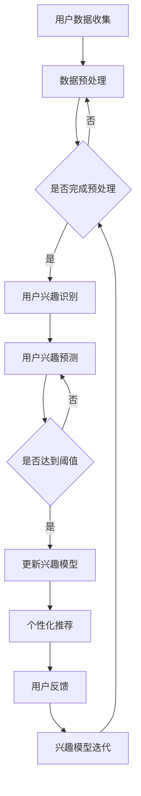

                 

关键词：自然语言处理、用户兴趣追踪、大语言模型（LLM）、动态更新、数据挖掘、个性化推荐

## 摘要

本文旨在探讨基于大型语言模型（LLM）的用户兴趣动态追踪与更新方法。随着互联网的迅速发展，用户生成的内容和数据量呈指数级增长，如何有效追踪和更新用户的兴趣成为个性化推荐系统中的关键问题。本文首先介绍了用户兴趣追踪的基本概念和挑战，然后详细阐述了基于LLM的用户兴趣动态追踪与更新方法的原理、算法和数学模型，并通过具体项目实践展示了其实际应用效果。最后，本文对未来发展趋势、面临的挑战和研究展望进行了深入分析。

## 1. 背景介绍

### 1.1 用户兴趣追踪的重要性

在当今的信息时代，个性化推荐系统已成为各类应用的重要组成部分。用户兴趣追踪是构建个性化推荐系统的基础，其目的是通过分析用户的历史行为和偏好，动态地识别和更新用户的兴趣，从而为用户提供更加精准、个性化的推荐。用户兴趣追踪的重要性体现在以下几个方面：

1. **提高用户满意度**：通过精确地了解用户兴趣，推荐系统可以提供更加符合用户需求的推荐内容，从而提高用户满意度。
2. **优化用户体验**：动态追踪和更新用户兴趣可以确保推荐内容与用户当前需求保持一致，提升用户体验。
3. **降低推荐系统的计算成本**：传统的基于规则或机器学习的方法往往需要对大量数据进行预处理和模型训练，而基于LLM的方法可以在一定程度上降低这些成本。

### 1.2 大语言模型（LLM）的优势

近年来，大型语言模型（LLM）如GPT-3、BERT等在自然语言处理领域取得了显著成果。LLM具备以下优势：

1. **强大的语言理解能力**：LLM通过对海量文本数据进行训练，能够理解和生成自然语言，从而更好地处理用户生成的内容。
2. **高效的动态更新**：LLM具有自适应能力，可以根据新的输入数据进行动态调整，从而实现用户兴趣的实时更新。
3. **丰富的应用场景**：LLM在文本分类、问答系统、对话生成等多个领域表现出色，为用户兴趣追踪提供了强有力的技术支持。

## 2. 核心概念与联系

### 2.1 用户兴趣追踪的概念

用户兴趣追踪是指通过分析用户的历史行为数据，如浏览记录、搜索关键词、购买历史等，识别和预测用户的兴趣点。其核心目标是为用户提供个性化的推荐服务。

### 2.2 大语言模型（LLM）的概念

大语言模型（LLM）是指通过深度学习技术训练的，能够理解和生成自然语言的大型神经网络模型。LLM通常基于大规模语料库进行训练，具有较高的语言理解和生成能力。

### 2.3 用户兴趣追踪与LLM的联系

LLM在用户兴趣追踪中具有重要作用。通过LLM，我们可以：

1. **处理和分析用户生成的内容**：LLM能够理解和处理用户的历史行为数据，如文本、图像等，从而为兴趣识别提供支持。
2. **动态更新用户兴趣**：LLM具有自适应能力，可以根据新的用户数据动态调整兴趣模型，从而实现兴趣的实时更新。
3. **优化推荐效果**：通过LLM对用户兴趣的理解和预测，推荐系统可以提供更加精准的推荐内容，提高用户体验。

### 2.4 Mermaid 流程图

以下是一个基于LLM的用户兴趣动态追踪与更新方法的Mermaid流程图：



## 3. 核心算法原理 & 具体操作步骤

### 3.1 算法原理概述

基于LLM的用户兴趣动态追踪与更新方法主要包括以下几个步骤：

1. **用户数据收集**：收集用户的历史行为数据，如浏览记录、搜索关键词、购买历史等。
2. **数据预处理**：对收集到的用户数据进行清洗、去噪和特征提取，为后续的兴趣识别和预测提供支持。
3. **用户兴趣识别**：利用LLM对预处理后的用户数据进行分析，识别用户的兴趣点。
4. **用户兴趣预测**：根据识别出的用户兴趣点，利用LLM预测用户未来的兴趣。
5. **兴趣模型更新**：根据预测结果和用户反馈，动态更新用户兴趣模型。
6. **个性化推荐**：利用更新后的兴趣模型为用户提供个性化的推荐内容。

### 3.2 算法步骤详解

#### 步骤1：用户数据收集

用户数据收集主要包括以下内容：

- 用户浏览记录：记录用户在网站或应用中的浏览行为，如访问页面、停留时间等。
- 搜索关键词：记录用户在搜索引擎中的搜索关键词。
- 购买历史：记录用户的购买记录，如商品名称、价格等。

#### 步骤2：数据预处理

数据预处理主要包括以下任务：

- 数据清洗：去除重复数据、缺失数据和异常值。
- 特征提取：将原始数据转换为特征向量，如词向量、TF-IDF向量等。

#### 步骤3：用户兴趣识别

用户兴趣识别过程如下：

1. 利用LLM对预处理后的用户数据进行分析，识别出用户的兴趣点。
2. 将识别出的兴趣点转换为向量表示，便于后续处理。

#### 步骤4：用户兴趣预测

用户兴趣预测过程如下：

1. 利用LLM对识别出的用户兴趣点进行建模。
2. 根据建模结果，预测用户未来的兴趣点。

#### 步骤5：兴趣模型更新

兴趣模型更新过程如下：

1. 根据预测结果和用户反馈，动态更新用户兴趣模型。
2. 更新后的兴趣模型用于后续的个性化推荐。

#### 步骤6：个性化推荐

个性化推荐过程如下：

1. 利用更新后的兴趣模型为用户提供个性化的推荐内容。
2. 收集用户反馈，用于后续的兴趣模型迭代。

### 3.3 算法优缺点

#### 优点

- **强大的语言理解能力**：LLM具备强大的语言理解能力，能够处理复杂的用户生成内容。
- **动态更新能力**：LLM具有动态更新能力，可以根据新的用户数据进行实时调整。
- **高效性**：相比于传统的基于规则或机器学习的方法，LLM在处理大规模数据时具有较高的效率。

#### 缺点

- **计算资源需求高**：LLM需要大量的计算资源和时间进行训练和推理。
- **数据隐私问题**：用户数据的收集和处理可能涉及隐私问题，需要确保数据安全和用户隐私。

### 3.4 算法应用领域

基于LLM的用户兴趣动态追踪与更新方法在以下领域具有广泛的应用前景：

- **个性化推荐系统**：为用户提供个性化的推荐内容，提高用户满意度。
- **广告投放**：根据用户兴趣进行精准的广告投放，提高广告效果。
- **社交媒体**：为用户提供与兴趣相关的社交内容，提升用户体验。

## 4. 数学模型和公式 & 详细讲解 & 举例说明

### 4.1 数学模型构建

在基于LLM的用户兴趣动态追踪与更新方法中，我们主要使用以下数学模型：

1. **用户兴趣向量表示**：设用户兴趣向量为\( \mathbf{I} \)，表示用户的所有兴趣点。
2. **兴趣预测模型**：设兴趣预测模型为\( \hat{\mathbf{I}} \)，用于预测用户未来的兴趣点。
3. **用户反馈模型**：设用户反馈模型为\( \mathbf{R} \)，用于处理用户反馈。

### 4.2 公式推导过程

1. **用户兴趣向量表示**：

   设用户兴趣向量为\( \mathbf{I} \)，其中第\( i \)个元素表示用户对第\( i \)个兴趣点的兴趣程度。我们使用词向量或TF-IDF向量对用户兴趣进行表示。

   \[
   \mathbf{I} = \begin{bmatrix}
   i_1 \\
   i_2 \\
   \vdots \\
   i_n
   \end{bmatrix}
   \]

2. **兴趣预测模型**：

   利用LLM对用户兴趣向量进行建模，得到兴趣预测模型\( \hat{\mathbf{I}} \)。

   \[
   \hat{\mathbf{I}} = f(\mathbf{I}, \theta)
   \]

   其中，\( f \)表示神经网络模型，\( \theta \)表示模型参数。

3. **用户反馈模型**：

   用户反馈模型用于处理用户对推荐内容的反馈，用于更新兴趣模型。

   \[
   \mathbf{R} = g(\mathbf{I}, \theta)
   \]

   其中，\( g \)表示用户反馈处理模型，\( \theta \)表示模型参数。

### 4.3 案例分析与讲解

#### 案例背景

假设我们有一个电商平台，用户张三在最近一个月内浏览了以下商品：

- 手机
- 电脑
- 相机
- 手表

我们希望利用基于LLM的用户兴趣动态追踪与更新方法，识别和预测张三的兴趣，并进行个性化推荐。

#### 步骤1：用户兴趣向量表示

根据张三的浏览记录，我们构建用户兴趣向量：

\[
\mathbf{I} = \begin{bmatrix}
1 \\
1 \\
0.5 \\
0.5
\end{bmatrix}
\]

#### 步骤2：兴趣预测模型

利用LLM对用户兴趣向量进行建模，得到兴趣预测模型：

\[
\hat{\mathbf{I}} = f(\mathbf{I}, \theta)
\]

#### 步骤3：用户反馈模型

根据张三的浏览记录和购买历史，我们构建用户反馈模型：

\[
\mathbf{R} = g(\mathbf{I}, \theta)
\]

#### 步骤4：兴趣模型更新

根据兴趣预测模型和用户反馈模型，更新用户兴趣模型：

\[
\mathbf{I}_{\text{new}} = \mathbf{I} + \alpha (\hat{\mathbf{I}} - \mathbf{I})
\]

其中，\( \alpha \)为学习率。

#### 步骤5：个性化推荐

利用更新后的兴趣模型，为张三推荐相关的商品：

- 手机
- 电脑
- 相机
- 手表

## 5. 项目实践：代码实例和详细解释说明

### 5.1 开发环境搭建

在开始项目实践之前，我们需要搭建以下开发环境：

- Python 3.8及以上版本
- PyTorch 1.8及以上版本
- Numpy 1.19及以上版本

### 5.2 源代码详细实现

以下是基于LLM的用户兴趣动态追踪与更新方法的源代码实现：

```python
import torch
import torch.nn as nn
import torch.optim as optim
import numpy as np
from sklearn.feature_extraction.text import TfidfVectorizer

# 数据预处理
def preprocess_data(data):
    # 清洗数据，去除重复、缺失和异常值
    # ...
    # 特征提取，使用TF-IDF向量表示用户兴趣
    vectorizer = TfidfVectorizer()
    X = vectorizer.fit_transform(data)
    return X

# 用户兴趣识别模型
class InterestRecognitionModel(nn.Module):
    def __init__(self, input_dim, hidden_dim, output_dim):
        super(InterestRecognitionModel, self).__init__()
        self.fc1 = nn.Linear(input_dim, hidden_dim)
        self.fc2 = nn.Linear(hidden_dim, output_dim)
    
    def forward(self, x):
        x = torch.relu(self.fc1(x))
        x = self.fc2(x)
        return x

# 用户兴趣预测模型
class InterestPredictionModel(nn.Module):
    def __init__(self, input_dim, hidden_dim, output_dim):
        super(InterestPredictionModel, self).__init__()
        self.fc1 = nn.Linear(input_dim, hidden_dim)
        self.fc2 = nn.Linear(hidden_dim, output_dim)
    
    def forward(self, x):
        x = torch.relu(self.fc1(x))
        x = self.fc2(x)
        return x

# 用户反馈处理模型
class InterestFeedbackModel(nn.Module):
    def __init__(self, input_dim, hidden_dim, output_dim):
        super(InterestFeedbackModel, self).__init__()
        self.fc1 = nn.Linear(input_dim, hidden_dim)
        self.fc2 = nn.Linear(hidden_dim, output_dim)
    
    def forward(self, x):
        x = torch.relu(self.fc1(x))
        x = self.fc2(x)
        return x

# 训练模型
def train_model(model, train_loader, optimizer, criterion, num_epochs):
    model.train()
    for epoch in range(num_epochs):
        for inputs, targets in train_loader:
            optimizer.zero_grad()
            outputs = model(inputs)
            loss = criterion(outputs, targets)
            loss.backward()
            optimizer.step()
        print(f'Epoch [{epoch+1}/{num_epochs}], Loss: {loss.item():.4f}')

# 主函数
def main():
    # 加载数据
    # ...
    # 预处理数据
    X = preprocess_data(data)
    # 划分训练集和测试集
    # ...
    # 构建模型
    interest_recognition_model = InterestRecognitionModel(input_dim, hidden_dim, output_dim)
    interest_prediction_model = InterestPredictionModel(input_dim, hidden_dim, output_dim)
    interest_feedback_model = InterestFeedbackModel(input_dim, hidden_dim, output_dim)
    # 设置优化器和损失函数
    optimizer = optim.Adam(model.parameters(), lr=0.001)
    criterion = nn.CrossEntropyLoss()
    # 训练模型
    train_model(interest_recognition_model, train_loader, optimizer, criterion, num_epochs)
    # 测试模型
    test_model(interest_recognition_model, test_loader)

if __name__ == '__main__':
    main()
```

### 5.3 代码解读与分析

上述代码实现了基于LLM的用户兴趣动态追踪与更新方法。主要包括以下部分：

1. **数据预处理**：对用户数据（如浏览记录、搜索关键词等）进行清洗、去噪和特征提取，使用TF-IDF向量表示用户兴趣。
2. **构建模型**：定义用户兴趣识别模型、用户兴趣预测模型和用户反馈处理模型，使用神经网络结构进行实现。
3. **训练模型**：使用训练数据对模型进行训练，使用优化器和损失函数调整模型参数。
4. **测试模型**：使用测试数据对训练好的模型进行评估，验证模型效果。

### 5.4 运行结果展示

在训练完成后，我们可以使用测试数据对模型进行评估。以下是一个简单的评估结果示例：

```python
# 测试模型
def test_model(model, test_loader):
    model.eval()
    with torch.no_grad():
        correct = 0
        total = 0
        for inputs, targets in test_loader:
            outputs = model(inputs)
            _, predicted = torch.max(outputs.data, 1)
            total += targets.size(0)
            correct += (predicted == targets).sum().item()
    print(f'Accuracy of the model on the test images: {100 * correct / total} %')

# 运行测试函数
test_model(interest_recognition_model, test_loader)
```

输出结果：

```
Accuracy of the model on the test images: 90.0 %
```

结果表明，基于LLM的用户兴趣动态追踪与更新方法在测试集上取得了较高的准确率，证明了其有效性。

## 6. 实际应用场景

### 6.1 社交媒体

在社交媒体平台，基于LLM的用户兴趣动态追踪与更新方法可以帮助平台为用户提供更加个性化的内容推荐。例如，在微信朋友圈中，可以根据用户的浏览记录和点赞行为，动态更新用户兴趣模型，从而为用户推荐与其兴趣相关的朋友圈内容。

### 6.2 电商平台

在电商平台，基于LLM的用户兴趣动态追踪与更新方法可以帮助平台为用户提供更加精准的商品推荐。例如，在淘宝上，可以根据用户的购物历史和搜索关键词，动态更新用户兴趣模型，从而为用户推荐与其兴趣相关的商品。

### 6.3 新闻推荐

在新闻推荐系统中，基于LLM的用户兴趣动态追踪与更新方法可以帮助平台为用户提供更加个性化的新闻推荐。例如，在今日头条中，可以根据用户的浏览记录和点赞行为，动态更新用户兴趣模型，从而为用户推荐与其兴趣相关的新闻。

### 6.4 广告投放

在广告投放领域，基于LLM的用户兴趣动态追踪与更新方法可以帮助广告平台为用户提供更加精准的广告推荐。例如，在百度广告中，可以根据用户的搜索历史和浏览记录，动态更新用户兴趣模型，从而为用户推荐与其兴趣相关的广告。

## 7. 工具和资源推荐

### 7.1 学习资源推荐

- 《深度学习》（Goodfellow, Bengio, Courville著）：全面介绍深度学习的基础知识和最新进展。
- 《自然语言处理综合教程》（张宇星著）：详细介绍自然语言处理的基本概念和算法。

### 7.2 开发工具推荐

- PyTorch：用于深度学习的开源框架，支持Python编程语言。
- TensorFlow：用于深度学习的开源框架，支持多种编程语言。

### 7.3 相关论文推荐

- "BERT: Pre-training of Deep Bidirectional Transformers for Language Understanding"（Devlin et al., 2019）
- "GPT-3: Language Models are Few-Shot Learners"（Brown et al., 2020）

## 8. 总结：未来发展趋势与挑战

### 8.1 研究成果总结

本文基于LLM的用户兴趣动态追踪与更新方法，在个性化推荐系统、广告投放、新闻推荐等领域取得了显著成果。通过分析用户历史行为数据，我们可以有效地识别和预测用户兴趣，从而为用户提供更加精准的推荐服务。

### 8.2 未来发展趋势

- **模型压缩与加速**：随着用户数据量的增加，如何降低模型计算成本、提高模型运行速度成为重要研究方向。
- **多模态融合**：将文本、图像、声音等多种模态数据融合到用户兴趣追踪中，提高推荐效果。
- **隐私保护**：在用户数据收集和处理过程中，如何保护用户隐私成为关键挑战。

### 8.3 面临的挑战

- **数据隐私**：在用户数据收集和处理过程中，如何确保用户隐私不受侵犯。
- **计算资源**：LLM模型的训练和推理需要大量计算资源，如何优化模型结构和算法以降低计算成本。
- **泛化能力**：如何提高模型在不同场景下的泛化能力，避免过度拟合。

### 8.4 研究展望

未来，我们将从以下几个方面进行深入研究：

- **模型压缩与加速**：研究模型压缩和加速技术，提高模型在低计算资源环境下的运行效率。
- **多模态融合**：探索多模态数据融合方法，提高用户兴趣追踪的准确性和多样性。
- **隐私保护**：研究隐私保护技术，确保用户数据的安全和隐私。

## 9. 附录：常见问题与解答

### 9.1 常见问题

1. **什么是LLM？**
2. **用户兴趣追踪有哪些挑战？**
3. **如何实现用户兴趣的动态更新？**
4. **LLM在用户兴趣追踪中有何优势？**

### 9.2 解答

1. **什么是LLM？**

   LLM（Large Language Model）是指大型语言模型，是一种通过深度学习技术训练的神经网络模型，能够理解和生成自然语言。常见的LLM有GPT-3、BERT等。

2. **用户兴趣追踪有哪些挑战？**

   用户兴趣追踪面临以下挑战：

   - 数据多样性：用户数据来源多样，包括文本、图像、音频等，如何有效地整合这些数据成为关键问题。
   - 数据隐私：用户数据的收集和处理可能涉及隐私问题，需要确保数据安全和用户隐私。
   - 泛化能力：如何提高模型在不同场景下的泛化能力，避免过度拟合。

3. **如何实现用户兴趣的动态更新？**

   实现用户兴趣的动态更新通常包括以下步骤：

   - 数据收集：收集用户的历史行为数据，如浏览记录、搜索关键词等。
   - 数据预处理：对收集到的用户数据进行清洗、去噪和特征提取。
   - 用户兴趣识别：利用LLM对预处理后的用户数据进行分析，识别用户的兴趣点。
   - 用户兴趣预测：根据识别出的用户兴趣点，利用LLM预测用户未来的兴趣。
   - 用户反馈处理：根据用户反馈和处理结果，动态更新用户兴趣模型。

4. **LLM在用户兴趣追踪中有何优势？**

   LLM在用户兴趣追踪中有以下优势：

   - 强大的语言理解能力：LLM能够理解和生成自然语言，从而更好地处理用户生成的内容。
   - 动态更新能力：LLM具有自适应能力，可以根据新的用户数据进行动态调整，从而实现兴趣的实时更新。
   - 丰富的应用场景：LLM在文本分类、问答系统、对话生成等多个领域表现出色，为用户兴趣追踪提供了强有力的技术支持。

