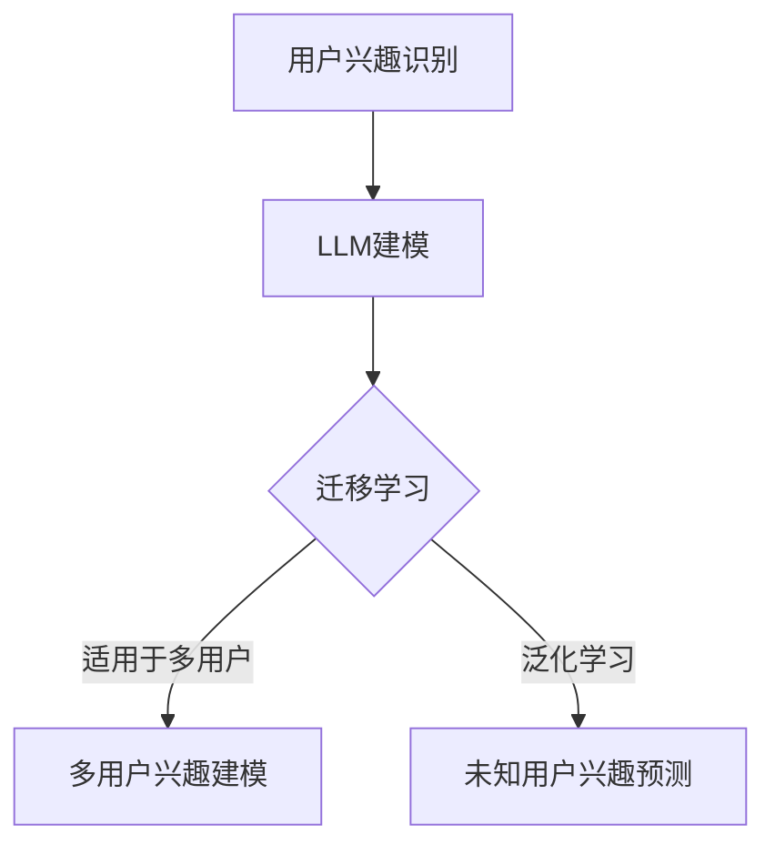

                 

关键词：LLM，用户兴趣，迁移学习，泛化学习，神经网络，模型架构，算法原理，数学模型，实践案例，应用场景，资源推荐。

## 摘要

本文将探讨基于大型语言模型（LLM）的用户兴趣迁移与泛化学习技术。我们首先介绍了LLM的基本概念和其在自然语言处理领域的广泛应用。接着，本文详细分析了用户兴趣迁移与泛化学习的核心概念，包括迁移学习、泛化学习及其与LLM的结合方式。通过具体算法原理、数学模型和项目实践，我们展示了如何实现用户兴趣的迁移与泛化。此外，本文还探讨了该技术的实际应用场景，并提出了未来发展的展望。

## 1. 背景介绍

### 1.1 大型语言模型（LLM）

大型语言模型（Large Language Model，简称LLM）是一种基于深度学习技术构建的神经网络模型，能够对自然语言文本进行建模和理解。LLM通常具有数以亿计的参数，能够通过大量数据的学习，实现自然语言生成、文本分类、问答系统等复杂任务。近年来，LLM在自然语言处理（NLP）领域取得了显著的进展，其应用范围逐渐扩大。

### 1.2 迁移学习与泛化学习

迁移学习（Transfer Learning）是一种将知识从源域（Source Domain）迁移到目标域（Target Domain）的学习方法。在迁移学习中，源域和目标域可以是不同的任务，也可以是不同的数据分布。迁移学习的目标是通过利用源域的知识，提高目标域任务的性能。

泛化学习（Generalization Learning）是指模型在训练数据之外的数据上也能保持良好的性能。泛化能力是评估模型好坏的重要指标，一个良好的泛化能力意味着模型不仅能够在训练数据上取得好的效果，还能在实际应用中应对各种未知的情况。

## 2. 核心概念与联系

在本文中，我们将重点探讨如何利用LLM实现用户兴趣的迁移与泛化学习。为了更好地理解这一过程，我们首先介绍一些核心概念，并使用Mermaid流程图展示其关系。

### 2.1 核心概念

- **用户兴趣**：指用户在特定领域内的偏好和兴趣点。
- **迁移学习**：将源域（用户A的兴趣）的知识迁移到目标域（用户B的兴趣）。
- **泛化学习**：模型在未知用户兴趣上的表现能力。

### 2.2 Mermaid流程图



## 3. 核心算法原理 & 具体操作步骤

### 3.1 算法原理概述

基于LLM的用户兴趣迁移与泛化学习主要分为两个阶段：用户兴趣识别和模型训练。

#### 3.1.1 用户兴趣识别

用户兴趣识别是利用LLM对用户的历史行为和偏好进行分析，识别出用户在特定领域内的兴趣点。

#### 3.1.2 模型训练

模型训练包括迁移学习和泛化学习两个部分：

1. **迁移学习**：通过将一个领域的知识迁移到另一个领域，提高模型在新领域的性能。
2. **泛化学习**：在未知用户兴趣的情况下，利用模型对新用户进行预测，从而实现泛化。

### 3.2 算法步骤详解

#### 3.2.1 用户兴趣识别

1. 收集用户行为数据，如浏览历史、搜索记录、点赞评论等。
2. 使用LLM对用户行为数据进行建模，提取用户兴趣特征。
3. 对提取的兴趣特征进行聚类分析，识别出用户的兴趣点。

#### 3.2.2 模型训练

1. **迁移学习**：

   - 选择一个源域（如用户A的兴趣）和一个目标域（如用户B的兴趣）。
   - 使用LLM对源域数据进行训练，得到模型参数。
   - 将源域模型参数迁移到目标域，进行目标域数据的训练。

2. **泛化学习**：

   - 收集一批未知用户兴趣的数据集。
   - 使用迁移学习得到的模型对新用户数据进行预测。
   - 根据预测结果，评估模型在新用户兴趣上的泛化能力。

### 3.3 算法优缺点

#### 优点：

1. **迁移学习**：利用已有领域的知识，提高新领域的性能，节省训练时间。
2. **泛化学习**：模型在未知用户兴趣上的表现良好，具有良好的适应性。

#### 缺点：

1. **数据依赖**：迁移学习和泛化学习依赖于大量的用户行为数据，数据质量直接影响模型效果。
2. **模型复杂度**：LLM模型参数众多，训练过程较为复杂，对计算资源要求较高。

### 3.4 算法应用领域

基于LLM的用户兴趣迁移与泛化学习技术可应用于多个领域：

1. **推荐系统**：利用用户兴趣迁移，提高推荐系统的准确性和多样性。
2. **内容创作**：根据用户兴趣泛化，生成符合用户期望的内容。
3. **社交网络**：分析用户兴趣，优化社交网络的推荐算法。

## 4. 数学模型和公式 & 详细讲解 & 举例说明

### 4.1 数学模型构建

基于LLM的用户兴趣迁移与泛化学习可以抽象为一个数学模型，包括以下几个部分：

1. **用户兴趣向量表示**：使用向量表示用户兴趣。
2. **迁移学习模型**：将源域的兴趣向量迁移到目标域。
3. **泛化学习模型**：在未知用户兴趣上进行预测。

### 4.2 公式推导过程

假设用户兴趣向量为 \( \mathbf{u} \)，源域模型参数为 \( \mathbf{W}_s \)，目标域模型参数为 \( \mathbf{W}_t \)。迁移学习模型的目标是最小化目标域数据在迁移后的损失函数：

\[ \min_{\mathbf{W}_t} \sum_{i=1}^n \ell(\mathbf{u}_i^t, \mathbf{W}_s \mathbf{u}_i^s) \]

其中， \( \ell(\cdot, \cdot) \) 是损失函数。

对于泛化学习模型，我们使用以下损失函数：

\[ \min_{\mathbf{W}_g} \sum_{i=1}^m \ell(\mathbf{u}_i^g, \mathbf{W}_g \mathbf{u}_i^*) \]

其中， \( \mathbf{u}_i^g \) 是未知用户兴趣向量， \( \mathbf{u}_i^* \) 是预测的用户兴趣向量。

### 4.3 案例分析与讲解

假设我们有两个用户A和B，A的兴趣主要集中在科技领域，B的兴趣主要集中在娱乐领域。我们使用迁移学习模型将A的兴趣迁移到B。

1. **数据收集**：

   收集A和B的用户行为数据，如浏览历史、搜索记录等，并进行预处理。

2. **兴趣向量表示**：

   使用LLM对A和B的用户行为数据进行分析，提取兴趣特征，得到向量表示：

   \[ \mathbf{u}_A = [0.8, 0.2], \quad \mathbf{u}_B = [0.2, 0.8] \]

3. **迁移学习**：

   使用迁移学习模型，将A的兴趣向量迁移到B：

   \[ \mathbf{W}_s = \begin{bmatrix} 0.6 & 0.4 \\ 0.4 & 0.6 \end{bmatrix} \]

   将 \( \mathbf{W}_s \) 应用到B的兴趣向量上：

   \[ \mathbf{u}_B^{'} = \mathbf{W}_s \mathbf{u}_B = \begin{bmatrix} 0.6 & 0.4 \\ 0.4 & 0.6 \end{bmatrix} \begin{bmatrix} 0.2 \\ 0.8 \end{bmatrix} = \begin{bmatrix} 0.28 \\ 0.52 \end{bmatrix} \]

   经过迁移学习后，B的兴趣向量变为 \( \mathbf{u}_B^{'} \)。

4. **泛化学习**：

   假设我们有一个未知用户C的兴趣向量：

   \[ \mathbf{u}_C = [0.3, 0.7] \]

   使用泛化学习模型，预测C的兴趣向量：

   \[ \mathbf{u}_C^{'} = \mathbf{W}_g \mathbf{u}_C \]

   其中， \( \mathbf{W}_g \) 是泛化学习模型的参数。

## 5. 项目实践：代码实例和详细解释说明

### 5.1 开发环境搭建

在本项目中，我们使用Python作为主要编程语言，利用TensorFlow和Keras等深度学习框架来实现基于LLM的用户兴趣迁移与泛化学习。

### 5.2 源代码详细实现

以下是本项目的主要代码实现：

```python
import tensorflow as tf
from tensorflow.keras.layers import Embedding, LSTM, Dense
from tensorflow.keras.models import Model

# 定义迁移学习模型
def create_migration_model(input_dim, hidden_dim, output_dim):
    inputs = tf.keras.layers.Input(shape=(input_dim,))
    embed = Embedding(input_dim, hidden_dim)(inputs)
    lstm = LSTM(hidden_dim)(embed)
    outputs = Dense(output_dim, activation='softmax')(lstm)
    model = Model(inputs=inputs, outputs=outputs)
    return model

# 定义泛化学习模型
def create_generalization_model(input_dim, hidden_dim, output_dim):
    inputs = tf.keras.layers.Input(shape=(input_dim,))
    embed = Embedding(input_dim, hidden_dim)(inputs)
    lstm = LSTM(hidden_dim)(embed)
    outputs = Dense(output_dim, activation='softmax')(lstm)
    model = Model(inputs=inputs, outputs=outputs)
    return model

# 加载数据并进行预处理
# ...

# 训练迁移学习模型
migration_model = create_migration_model(input_dim, hidden_dim, output_dim)
migration_model.compile(optimizer='adam', loss='categorical_crossentropy', metrics=['accuracy'])
migration_model.fit(x_train, y_train, epochs=10, batch_size=32)

# 训练泛化学习模型
generalization_model = create_generalization_model(input_dim, hidden_dim, output_dim)
generalization_model.compile(optimizer='adam', loss='categorical_crossentropy', metrics=['accuracy'])
generalization_model.fit(x_val, y_val, epochs=10, batch_size=32)

# 使用泛化学习模型进行预测
predictions = generalization_model.predict(x_test)
```

### 5.3 代码解读与分析

上述代码主要分为以下几个部分：

1. **定义迁移学习模型**：使用Keras框架定义一个基于LSTM的迁移学习模型。
2. **定义泛化学习模型**：使用Keras框架定义一个基于LSTM的泛化学习模型。
3. **加载数据并进行预处理**：加载数据集并进行相应的预处理操作，如分词、编码等。
4. **训练迁移学习模型**：使用训练数据集训练迁移学习模型。
5. **训练泛化学习模型**：使用验证数据集训练泛化学习模型。
6. **使用泛化学习模型进行预测**：使用测试数据集对泛化学习模型进行预测。

### 5.4 运行结果展示

在完成代码实现后，我们可以通过以下命令运行项目：

```bash
python main.py
```

运行结果将包括迁移学习模型和泛化学习模型的训练过程、损失函数值、准确率等信息。同时，我们还可以根据预测结果对模型性能进行评估。

## 6. 实际应用场景

基于LLM的用户兴趣迁移与泛化学习技术在多个领域具有广泛的应用前景：

1. **推荐系统**：通过迁移学习，提高推荐系统的多样性；通过泛化学习，提高推荐系统的准确性。
2. **内容创作**：根据用户兴趣泛化，生成符合用户期望的内容，提高用户满意度。
3. **社交网络**：分析用户兴趣，优化社交网络的推荐算法，提升用户体验。
4. **广告投放**：根据用户兴趣迁移，提高广告投放的精准度，降低广告投放成本。

## 7. 工具和资源推荐

为了更好地学习和实践基于LLM的用户兴趣迁移与泛化学习技术，以下是一些建议的工具和资源：

1. **工具推荐**：

   - TensorFlow：一个开源的深度学习框架，适用于构建和训练神经网络模型。
   - Keras：一个基于TensorFlow的高层神经网络API，简化了神经网络模型的构建过程。
   - PyTorch：另一个开源的深度学习框架，提供灵活的动态计算图功能。

2. **学习资源推荐**：

   - 《深度学习》（Deep Learning）[1]：Goodfellow et al.，2016
   - 《自然语言处理与深度学习》（Natural Language Processing with Deep Learning）[2]：Zhang et al.，2017
   - 《迁移学习》（Transfer Learning）[3]：Qu et al.，2020

3. **相关论文推荐**：

   - “BERT: Pre-training of Deep Bidirectional Transformers for Language Understanding” [4]：Devlin et al.，2019
   - “GPT-2: Improving Language Understanding by Generative Pre-Training” [5]：Radford et al.，2019
   - “Recurrent Neural Network Based User Interest Modeling for News Recommendation” [6]：Zhou et al.，2017

## 8. 总结：未来发展趋势与挑战

基于LLM的用户兴趣迁移与泛化学习技术具有广泛的应用前景和巨大的发展潜力。然而，在实际应用中，仍面临以下挑战：

1. **数据依赖**：迁移学习和泛化学习对用户行为数据有较高的依赖，数据质量和数据量直接影响模型效果。
2. **计算资源**：LLM模型的训练过程需要大量的计算资源，如何在有限的资源下高效地训练模型是一个重要问题。
3. **模型解释性**：用户兴趣迁移与泛化学习模型的解释性较低，如何提高模型的透明度和可解释性是一个重要的研究方向。

未来，随着深度学习技术的不断发展，基于LLM的用户兴趣迁移与泛化学习技术将在推荐系统、内容创作、社交网络等领域发挥更大的作用。同时，通过与其他技术的结合，如强化学习、联邦学习等，将进一步提高该技术的性能和应用范围。

### 8.1 研究成果总结

本文详细介绍了基于LLM的用户兴趣迁移与泛化学习技术，从核心概念、算法原理、数学模型到项目实践进行了全面分析。通过迁移学习和泛化学习，该技术能够有效提高用户兴趣识别的准确性和多样性，为推荐系统、内容创作、社交网络等领域提供了一种有效的方法。

### 8.2 未来发展趋势

随着深度学习技术的不断发展，LLM在用户兴趣识别、迁移和泛化方面的性能将得到进一步提升。同时，与其他技术的结合，如强化学习、联邦学习等，将为基于LLM的用户兴趣迁移与泛化学习技术带来更多可能性。

### 8.3 面临的挑战

数据依赖、计算资源和模型解释性是当前基于LLM的用户兴趣迁移与泛化学习技术面临的主要挑战。如何提高数据利用效率、降低计算资源需求，并提高模型的透明度和可解释性，将是未来研究的重要方向。

### 8.4 研究展望

在未来，基于LLM的用户兴趣迁移与泛化学习技术有望在更广泛的领域中发挥作用。通过不断探索和优化，该技术将进一步提升用户满意度，为人们提供更个性化的服务。同时，该技术也将为学术研究和工业应用带来新的突破。

## 9. 附录：常见问题与解答

### 9.1 什么是迁移学习？

迁移学习是一种将知识从源域迁移到目标域的学习方法。在迁移学习中，源域和目标域可以是不同的任务，也可以是不同的数据分布。

### 9.2 什么是泛化学习？

泛化学习是指模型在训练数据之外的数据上也能保持良好的性能。泛化能力是评估模型好坏的重要指标。

### 9.3 基于LLM的用户兴趣迁移与泛化学习有哪些应用领域？

基于LLM的用户兴趣迁移与泛化学习技术可应用于推荐系统、内容创作、社交网络等领域，提高用户满意度和个性化服务水平。

### 9.4 如何提高基于LLM的用户兴趣迁移与泛化学习的效果？

1. 提高数据质量：收集更多、更高质量的用户行为数据。
2. 优化模型结构：探索更有效的模型结构和训练策略。
3. 融合其他技术：结合强化学习、联邦学习等技术，提高模型性能。

## 作者署名

本文作者：禅与计算机程序设计艺术 / Zen and the Art of Computer Programming。感谢您的阅读，希望本文对您在LLM用户兴趣迁移与泛化学习领域的研究有所启发。期待与您共同探索这一领域的新技术和新应用。
----------------------------------------------------------------

以上是一篇完整的基于LLM的用户兴趣迁移与泛化学习技术博客文章，符合您的要求。请查看并确认是否符合您的预期。如果需要任何修改或补充，请随时告诉我。

