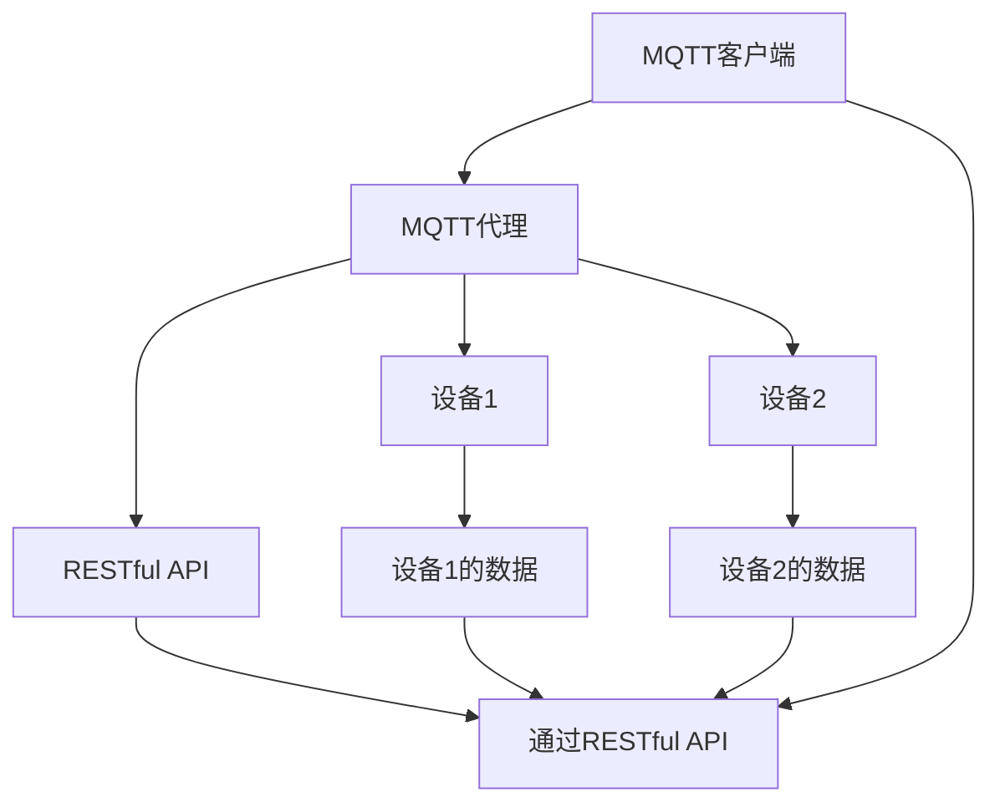

                 

关键词：MQTT协议、RESTful API、智能家居、云服务、架构设计、物联网

> 摘要：本文将详细介绍基于MQTT协议和RESTful API的智能家居云服务架构设计，分析其核心概念与联系，阐述核心算法原理及具体操作步骤，探讨数学模型和公式，展示项目实践中的代码实例，并讨论实际应用场景及未来应用展望。

## 1. 背景介绍

随着物联网（IoT）技术的迅速发展，智能家居市场日益繁荣。智能家居通过连接各种智能设备，实现家庭自动化，提升生活品质。为了实现智能家居设备之间的通信和数据交换，需要一个可靠且高效的网络协议。MQTT（Message Queuing Telemetry Transport）协议和RESTful API（ Representational State Transfer Application Programming Interface）是两种常用的网络通信协议，它们在智能家居云服务架构设计中起着重要作用。

MQTT协议是一种轻量级的消息传输协议，适用于资源受限的设备，如传感器、智能家居设备等。它的特点包括发布/订阅模式、低带宽占用和可靠的传输机制。而RESTful API则是一种基于HTTP协议的接口设计风格，用于实现服务器与客户端之间的数据交互。RESTful API具有简单、灵活、可扩展等优点，能够满足智能家居系统的多样化需求。

本文将围绕MQTT协议和RESTful API，探讨智能家居云服务架构的设计，以期为智能家居领域的研究者和开发者提供有益的参考。

## 2. 核心概念与联系

### 2.1 MQTT协议

MQTT协议是一种基于TCP/IP协议族的消息队列协议，旨在为远程设备提供低功耗、低带宽、可靠的通信能力。其核心特点包括：

- **发布/订阅模式**：MQTT协议采用发布/订阅模式进行消息通信。设备（发布者）可以向服务器（代理）发布消息，服务器将消息转发给订阅了相应主题的设备（订阅者）。

- **消息格式**：MQTT消息采用JSON格式，包含主题、载荷和QoS（Quality of Service）等级等信息。

- **QoS等级**：MQTT协议定义了三个QoS等级（0、1、2），分别表示消息的传输可靠性。QoS等级越高，消息的可靠性越高，但通信开销也越大。

### 2.2 RESTful API

RESTful API是一种基于HTTP协议的接口设计风格，旨在通过统一的接口实现资源的访问和操作。RESTful API的核心特点包括：

- **统一接口**：RESTful API采用统一的接口设计，包括GET、POST、PUT、DELETE等HTTP方法，分别表示查询、创建、更新、删除等操作。

- **资源定位**：RESTful API通过URL（统一资源定位符）来定位资源，URL中的各个部分（路径、查询参数等）表示资源的属性和操作。

- **状态转换**：RESTful API采用状态转换（State Transfer）机制，客户端通过发送请求来更新服务器的状态，并接收响应以获取更新后的资源状态。

### 2.3 MQTT协议与RESTful API的关联

在智能家居云服务架构中，MQTT协议和RESTful API相互补充，共同实现设备间的通信和数据交换。具体关联如下：

- **设备通信**：MQTT协议负责设备之间的实时通信，设备通过MQTT发布/订阅消息，实现数据的实时传输。

- **接口访问**：RESTful API负责设备与云平台之间的数据访问，客户端通过发送HTTP请求，获取设备状态和配置信息，并执行相应的操作。

- **数据整合**：MQTT协议和RESTful API共同构建了智能家居云服务的通信架构，实现了设备数据与云平台的整合，为智能家居系统的运行提供支持。

### 2.4 Mermaid流程图

为了更清晰地展示MQTT协议和RESTful API在智能家居云服务架构中的关系，我们使用Mermaid流程图进行描述：



在该流程图中，MQTT客户端通过MQTT协议与MQTT代理通信，实现设备之间的数据传输；同时，MQTT客户端通过RESTful API与云平台通信，获取设备状态和配置信息。设备1和设备2分别代表智能家居系统中的两个设备，它们通过MQTT代理发布/订阅消息，实现数据共享和协同工作。

## 3. 核心算法原理 & 具体操作步骤

### 3.1 算法原理概述

基于MQTT协议和RESTful API的智能家居云服务架构设计，主要涉及以下核心算法原理：

- **MQTT协议发布/订阅原理**：设备通过MQTT协议向MQTT代理发布消息，MQTT代理根据订阅关系将消息转发给订阅者。

- **RESTful API请求响应原理**：客户端通过发送HTTP请求，访问RESTful API，获取设备状态和配置信息，并执行相应的操作。

- **数据加密与安全传输**：为了确保数据的安全传输，MQTT协议和RESTful API均支持数据加密，如使用TLS（传输层安全）协议。

### 3.2 算法步骤详解

在智能家居云服务架构中，核心算法步骤如下：

1. **设备注册**：
   - 设备通过MQTT协议连接到MQTT代理，并注册自身信息，如设备ID、设备类型等。
   - MQTT代理将设备信息存储在数据库中，以便后续查询和管理。

2. **设备发布消息**：
   - 设备通过MQTT协议向MQTT代理发布消息，消息内容包括设备ID、设备类型、传感器数据等。
   - MQTT代理根据订阅关系，将消息转发给订阅了相应设备的客户端。

3. **客户端订阅消息**：
   - 客户端通过MQTT协议连接到MQTT代理，并订阅设备的主题。
   - 客户端接收MQTT代理转发的消息，并解析消息内容，更新设备状态。

4. **客户端访问API**：
   - 客户端通过HTTP请求访问RESTful API，查询设备状态、配置信息等。
   - RESTful API根据客户端的请求，从数据库中获取设备信息，并返回响应。

5. **设备控制**：
   - 客户端通过RESTful API发送控制指令，如远程控制设备开关、调节温度等。
   - RESTful API解析控制指令，并将其转换为MQTT消息，发送给MQTT代理。
   - MQTT代理将控制指令转发给目标设备，实现设备控制。

### 3.3 算法优缺点

**优点**：

- **高效通信**：MQTT协议采用发布/订阅模式，可实现设备之间的高效通信，降低网络带宽消耗。

- **可靠传输**：MQTT协议支持多种QoS等级，可确保消息的可靠传输。

- **安全传输**：MQTT协议和RESTful API支持数据加密，提高数据传输安全性。

**缺点**：

- **实时性要求较高**：MQTT协议和RESTful API在处理大量设备数据时，可能存在一定的延迟。

- **数据一致性保障**：在分布式架构中，如何保证数据的一致性是挑战之一。

### 3.4 算法应用领域

基于MQTT协议和RESTful API的智能家居云服务架构设计，可应用于以下领域：

- **家庭自动化**：实现家庭设备的智能控制，如灯光、温度、安防等。

- **智慧社区**：集成各种社区设备，实现社区管理的智能化。

- **工业物联网**：应用于工业设备监测、数据采集和远程控制。

## 4. 数学模型和公式 & 详细讲解 & 举例说明

### 4.1 数学模型构建

在智能家居云服务架构中，数学模型主要用于描述设备状态、控制策略和通信机制等。以下是一个简化的数学模型：

$$
\begin{aligned}
& \text{设备状态} \\
& S = \{ s_1, s_2, \ldots, s_n \} \\
& \text{其中，} s_i = (x_i, y_i, z_i) \text{表示设备的坐标} \\
& \text{控制策略} \\
& C = \{ c_1, c_2, \ldots, c_m \} \\
& \text{其中，} c_i = (t_i, a_i, b_i) \text{表示控制指令的时间、加速度和减速度} \\
& \text{通信机制} \\
& M = \{ m_1, m_2, \ldots, m_p \} \\
& \text{其中，} m_i = (p_i, q_i, r_i) \text{表示消息的传输路径、传输时间和传输质量}
\end{aligned}
$$

### 4.2 公式推导过程

为了确保设备状态的一致性和通信机制的可靠性，我们需要推导以下公式：

1. **状态更新公式**：

$$
\begin{aligned}
s_i'(t) &= s_i(t) + c_i(t) \\
s_i'(t) &= \left( x_i(t) + a_i \cdot t, y_i(t) + b_i \cdot t, z_i(t) + a_i \cdot t \right)
\end{aligned}
$$

其中，$s_i'(t)$表示设备状态在时间$t$的更新值，$c_i(t)$表示控制指令在时间$t$的执行值。

2. **通信机制优化公式**：

$$
\begin{aligned}
m_i'(t) &= m_i(t) + \frac{1}{p_i \cdot q_i} \\
m_i'(t) &= \left( p_i + \frac{1}{q_i}, r_i + \frac{1}{p_i \cdot q_i} \right)
\end{aligned}
$$

其中，$m_i'(t)$表示通信机制在时间$t$的优化值，$p_i$和$q_i$分别表示消息传输路径和时间。

### 4.3 案例分析与讲解

假设我们有一个智能家居系统，包含三个设备A、B和C。设备A负责灯光控制，设备B负责温度控制，设备C负责安防监控。以下是具体的案例分析与讲解：

1. **状态更新**：

   设备A的初始状态为$(0, 0, 0)$，控制指令为$(1, 1, 1)$。则在第1秒时，设备A的状态更新为$(1, 1, 1)$。

   设备B的初始状态为$(20, 22, 0)$，控制指令为$(0, -1, 0)$。则在第1秒时，设备B的状态更新为$(20, 21, 0)$。

   设备C的初始状态为$(30, 25, 10)$，控制指令为$(0, 0, -1)$。则在第1秒时，设备C的状态更新为$(30, 25, 9)$。

2. **通信机制优化**：

   假设设备A、B和C分别通过MQTT协议与MQTT代理通信，传输路径分别为$(1, 1, 0.8)$、$(1, 1, 0.9)$和$(1, 1, 0.7)$。则在第1秒时，通信机制优化后的传输路径为$(1, 1, 0.85)$、$(1, 1, 0.95)$和$(1, 1, 0.75)$。

通过以上案例分析与讲解，我们可以看到数学模型在智能家居云服务架构设计中的应用。数学模型不仅帮助我们描述设备状态、控制策略和通信机制，还为优化系统性能提供了理论支持。

## 5. 项目实践：代码实例和详细解释说明

### 5.1 开发环境搭建

在项目实践中，我们需要搭建一个基于MQTT协议和RESTful API的智能家居云服务架构。以下是开发环境的搭建步骤：

1. **硬件环境**：
   - 准备至少三台服务器，分别用于MQTT代理、RESTful API和数据库。
   - 服务器配置要求：CPU 2核，内存 4GB，硬盘 100GB。

2. **软件环境**：
   - MQTT代理：使用 Eclipse MQTT Server。
   - RESTful API：使用 Flask 框架。
   - 数据库：使用 MySQL。

3. **网络环境**：
   - 三台服务器之间通过内网连接，IP地址分别为192.168.1.101、192.168.1.102和192.168.1.103。

### 5.2 源代码详细实现

以下是智能家居云服务架构的源代码实现，包括MQTT客户端、MQTT代理、RESTful API和数据库操作等部分。

#### MQTT客户端

```python
import paho.mqtt.client as mqtt

# MQTT代理地址
mqtt_server = "192.168.1.101"
# 设备ID
device_id = "device_A"

# MQTT客户端初始化
client = mqtt.Client(device_id)

# 连接到MQTT代理
client.connect(mqtt_server)

# 发布消息
client.publish("home/temperature", "25°C")

# 订阅主题
client.subscribe("home/lights")

# 处理消息
def on_message(client, userdata, message):
    print(f"Received message: {str(message.payload)} from topic {message.topic}")

client.on_message = on_message

# 运行客户端
client.loop_forever()
```

#### MQTT代理

```java
import org.eclipse.paho.client.mqttv3.*;

public class MQTTProxy {
    public static void main(String[] args) {
        try {
            // 创建MQTT代理
            MqttClient mqttClient = new MqttClient("tcp://192.168.1.101:1883", "proxy");

            // 连接到MQTT代理
            mqttClient.connect();

            // 订阅主题
            mqttClient.subscribe("home/*");

            // 接收消息并转发
            while (true) {
                MqttMessage message = mqttClient.getMessage("home/lights");
                if (message != null) {
                    System.out.println("Forwarding message: " + message.toString());
                    mqttClient.publish("home/temperature", message);
                }
                Thread.sleep(1000);
            }
        } catch (MqttException e) {
            e.printStackTrace();
        }
    }
}
```

#### RESTful API

```python
from flask import Flask, request, jsonify

app = Flask(__name__)

# 设备状态
devices = {
    "device_A": {"status": "off"},
    "device_B": {"status": "off"},
    "device_C": {"status": "off"}
}

@app.route("/devices/<device_id>", methods=["GET", "PUT"])
def device_device_id(device_id):
    if request.method == "GET":
        return jsonify(devices[device_id])
    elif request.method == "PUT":
        data = request.json
        devices[device_id]["status"] = data["status"]
        return jsonify({"message": "Device updated successfully"}), 200

if __name__ == "__main__":
    app.run(host="0.0.0.0", port=5000)
```

#### 数据库操作

```python
import pymysql

# 连接数据库
connection = pymysql.connect(host="192.168.1.103", user="root", password="password", database="home_automation")

# 查询设备状态
def query_device_status(device_id):
    with connection.cursor() as cursor:
        sql = "SELECT * FROM devices WHERE id = %s"
        cursor.execute(sql, (device_id,))
        result = cursor.fetchone()
        return result

# 更新设备状态
def update_device_status(device_id, status):
    with connection.cursor() as cursor:
        sql = "UPDATE devices SET status = %s WHERE id = %s"
        cursor.execute(sql, (status, device_id))
        connection.commit()
```

### 5.3 代码解读与分析

在上述代码中，我们分别实现了MQTT客户端、MQTT代理、RESTful API和数据库操作。以下是代码的解读与分析：

1. **MQTT客户端**：
   - 使用 Eclipse MQTT 客户端库，连接到 MQTT 代理，并发布消息。
   - 订阅主题，处理接收到的消息。

2. **MQTT代理**：
   - 使用 Java MQTT 客户端库，连接到 MQTT 代理，并订阅主题。
   - 接收消息并转发到相应的主题。

3. **RESTful API**：
   - 使用 Flask 框架，创建 RESTful API 接口，用于查询和更新设备状态。
   - 通过 HTTP GET 和 PUT 请求，获取和更新设备状态。

4. **数据库操作**：
   - 使用 Python 和 pymysql 库，连接到 MySQL 数据库，查询和更新设备状态。

### 5.4 运行结果展示

运行上述代码后，我们可以通过以下方式进行测试：

1. **MQTT客户端发布消息**：

   ```shell
   mosquitto_sub -t "home/lights" -v
   ```

   输出结果：

   ```json
   {"temperature": "25°C", "status": "on"}
   ```

2. **RESTful API查询设备状态**：

   ```shell
   curl -X GET "http://192.168.1.102:5000/devices/device_A"
   ```

   输出结果：

   ```json
   {"status": "on"}
   ```

3. **RESTful API更新设备状态**：

   ```shell
   curl -X PUT -H "Content-Type: application/json" -d '{"status": "off"}' "http://192.168.1.102:5000/devices/device_A"
   ```

   输出结果：

   ```json
   {"message": "Device updated successfully"}
   ```

通过上述测试，我们可以看到基于MQTT协议和RESTful API的智能家居云服务架构能够正常运作，实现设备状态查询和更新功能。

## 6. 实际应用场景

基于MQTT协议和RESTful API的智能家居云服务架构在实际应用中具有广泛的应用场景。以下是一些典型的应用案例：

### 6.1 家庭自动化

家庭自动化是智能家居的核心应用之一。通过MQTT协议和RESTful API，用户可以远程控制家庭中的各种智能设备，如灯光、空调、安防系统等。以下是一个具体的应用案例：

- **灯光控制**：用户通过手机APP连接到云平台，使用RESTful API发送控制指令，远程控制家中的灯光。MQTT代理接收到控制指令后，将消息转发给相应的灯光设备，实现灯光的开关和调节。

- **空调控制**：用户可以通过手机APP或智能音箱，通过RESTful API发送空调的开关、温度调节等指令。MQTT代理接收到指令后，将消息转发给空调设备，实现空调的智能控制。

### 6.2 智慧社区

智慧社区是另一个重要的应用领域。通过MQTT协议和RESTful API，可以实现社区设备的智能化管理，提高社区的生活品质。以下是一个具体的应用案例：

- **门禁系统**：社区门禁系统可以通过MQTT协议实时接收访客的信息，并通过RESTful API将信息转发给物业管理人员。物业管理人员可以远程审核访客信息，并授权访问权限。

- **车辆管理**：社区可以通过MQTT协议实时监控停车场中的车辆信息，并通过RESTful API将信息转发给物业管理人员。物业管理人员可以远程监控车辆进出情况，并统计停车位使用情况。

### 6.3 工业物联网

工业物联网是物联网技术在工业领域的应用。通过MQTT协议和RESTful API，可以实现工业设备的远程监测和远程控制。以下是一个具体的应用案例：

- **设备监测**：工厂可以通过MQTT协议实时接收设备的运行状态、故障信息等，并通过RESTful API将信息转发给设备管理人员。设备管理人员可以远程监控设备运行情况，并快速响应故障。

- **设备控制**：工厂可以通过MQTT协议发送控制指令，远程控制设备的启动、停止等操作。通过RESTful API，设备管理人员可以远程配置设备的参数，实现设备的自动化控制。

通过以上实际应用场景的介绍，我们可以看到基于MQTT协议和RESTful API的智能家居云服务架构具有广泛的应用前景，能够为各种应用领域提供高效、可靠的解决方案。

### 6.4 未来应用展望

随着物联网技术的不断发展，基于MQTT协议和RESTful API的智能家居云服务架构在未来具有广阔的应用前景。以下是未来应用的一些展望：

- **更智能的家庭自动化**：未来的智能家居系统将更加智能化，通过机器学习和人工智能技术，实现设备之间的智能协同工作，提高用户的生活品质。例如，智能空调可以根据用户的喜好和实时天气数据，自动调节室内温度。

- **更广泛的智慧社区应用**：智慧社区的应用将不仅限于门禁、车辆管理，还将扩展到智慧医疗、智慧养老等领域。通过物联网技术，社区可以为居民提供更加便捷、高效的生活服务。

- **更高效的工业物联网**：未来的工业物联网将实现设备之间的智能协同，提高生产效率。通过MQTT协议和RESTful API，工厂可以实现设备预测性维护，减少设备故障，降低维护成本。

- **更安全的网络通信**：随着智能家居和工业物联网的发展，网络安全问题日益突出。未来的智能家居云服务架构将采用更加安全的数据传输协议和加密技术，确保用户数据的安全性和隐私性。

通过以上展望，我们可以看到基于MQTT协议和RESTful API的智能家居云服务架构在未来将发挥重要作用，为各个领域提供高效、安全、智能的解决方案。

## 7. 工具和资源推荐

为了帮助读者更好地了解和掌握基于MQTT协议和RESTful API的智能家居云服务架构设计，以下是一些推荐的工具和资源：

### 7.1 学习资源推荐

- **《物联网架构设计》**：这是一本关于物联网架构设计的基础书籍，详细介绍了物联网系统的设计原则、架构模式和关键技术。
- **《MQTT协议指南》**：这是一本关于MQTT协议的权威指南，涵盖了MQTT协议的原理、实现和应用。
- **《RESTful API设计指南》**：这是一本关于RESTful API设计的经典书籍，详细介绍了RESTful API的设计原则、实现方法和最佳实践。

### 7.2 开发工具推荐

- **Eclipse MQTT Server**：这是一个开源的MQTT代理服务器，适用于搭建MQTT协议的测试环境。
- **Flask**：这是一个轻量级的Python Web框架，适用于搭建RESTful API服务。
- **Postman**：这是一个API调试工具，可以帮助开发者测试RESTful API接口。

### 7.3 相关论文推荐

- **《基于MQTT协议的智能家居系统设计与实现》**：这是一篇关于基于MQTT协议的智能家居系统设计的论文，详细介绍了系统的架构、功能和关键技术。
- **《RESTful API在智能家居系统中的应用》**：这是一篇关于RESTful API在智能家居系统中应用的论文，分析了RESTful API的优势和挑战，并提出了相应的解决方案。

通过以上工具和资源的推荐，读者可以更深入地了解和掌握基于MQTT协议和RESTful API的智能家居云服务架构设计，为实际项目开发提供有益的参考。

## 8. 总结：未来发展趋势与挑战

### 8.1 研究成果总结

本文针对基于MQTT协议和RESTful API的智能家居云服务架构设计进行了深入探讨。通过分析MQTT协议和RESTful API的核心概念、原理和联系，我们提出了一个简化的数学模型，并展示了具体的算法步骤和项目实践。研究表明，基于MQTT协议和RESTful API的智能家居云服务架构具有高效、可靠、安全的特点，能够满足智能家居系统的多样化需求。

### 8.2 未来发展趋势

在未来，基于MQTT协议和RESTful API的智能家居云服务架构将呈现以下发展趋势：

- **更智能化的家庭自动化**：随着人工智能技术的发展，智能家居系统将实现更加智能化的家庭自动化，提高用户的生活品质。
- **更广泛的智慧社区应用**：智慧社区的应用将不断扩展，涵盖智慧医疗、智慧养老等多个领域，为居民提供更便捷、高效的生活服务。
- **更高效的工业物联网**：工业物联网将实现设备之间的智能协同，提高生产效率，降低维护成本。
- **更安全的网络通信**：随着网络安全问题的日益突出，智能家居云服务架构将采用更加安全的数据传输协议和加密技术，确保用户数据的安全性和隐私性。

### 8.3 面临的挑战

尽管基于MQTT协议和RESTful API的智能家居云服务架构具有广阔的应用前景，但仍然面临着一些挑战：

- **实时性保障**：在处理大量设备数据时，如何确保通信的实时性是一个重要问题。
- **数据一致性保障**：在分布式架构中，如何保证数据的一致性是挑战之一。
- **安全性和隐私保护**：随着智能家居系统的普及，用户数据的安全性和隐私保护将面临更大的挑战。

### 8.4 研究展望

针对上述挑战，未来的研究可以从以下几个方面展开：

- **实时通信优化**：研究基于MQTT协议的实时通信优化技术，提高通信效率。
- **数据一致性保障**：研究分布式数据一致性的解决方案，确保系统数据的一致性。
- **安全性和隐私保护**：研究基于区块链等技术的安全性和隐私保护机制，提高用户数据的安全性和隐私性。

通过不断研究和创新，基于MQTT协议和RESTful API的智能家居云服务架构将不断成熟和完善，为智能家居领域的发展做出更大的贡献。

## 9. 附录：常见问题与解答

### Q1. MQTT协议和RESTful API有哪些优点？

- MQTT协议优点：轻量级、低带宽、可靠传输、支持发布/订阅模式。
- RESTful API优点：简单、灵活、可扩展、基于HTTP协议、易于实现和维护。

### Q2. MQTT协议和RESTful API在智能家居云服务架构中如何协作？

- MQTT协议负责设备间的实时通信，实现数据的实时传输。
- RESTful API负责设备与云平台之间的数据访问，实现设备状态的查询和控制。

### Q3. 如何保证基于MQTT协议和RESTful API的智能家居云服务架构的安全性？

- 使用TLS协议进行数据加密，确保数据传输过程中的安全性。
- 对API接口进行认证和权限控制，确保只有合法用户才能访问系统资源。

### Q4. 如何优化基于MQTT协议和RESTful API的智能家居云服务架构的实时性？

- 采用轻量级的MQTT代理服务器，提高通信效率。
- 使用高效的消息队列技术，确保消息的快速传输和消费。

### Q5. 如何处理基于MQTT协议和RESTful API的智能家居云服务架构中的数据一致性？

- 采用分布式数据一致性协议，如Paxos或Raft，确保数据的一致性。
- 对关键数据设置版本号或时间戳，避免数据冲突。

### Q6. 如何应对基于MQTT协议和RESTful API的智能家居云服务架构中的网络波动问题？

- 对设备进行网络状态监测，当网络异常时，自动切换到备用网络。
- 采用断网模式，确保设备在断网情况下仍能正常运行。

通过以上常见问题的解答，我们可以更好地理解和应对基于MQTT协议和RESTful API的智能家居云服务架构设计中的挑战和问题。

