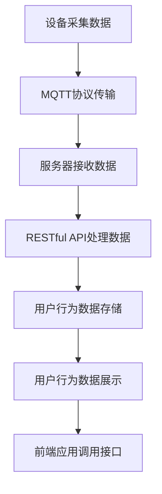
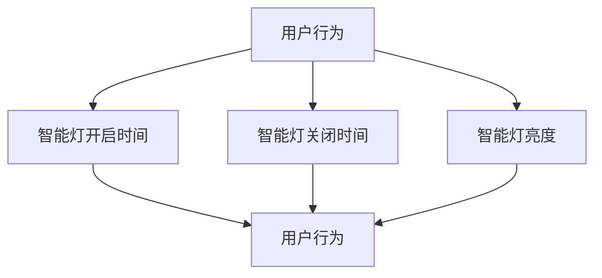
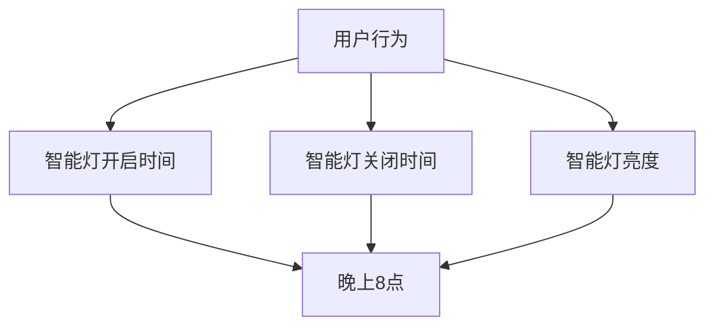

                 

关键词：MQTT协议、RESTful API、智能家居、用户行为分析、物联网、大数据、算法

## 摘要

本文主要探讨了基于MQTT协议和RESTful API的智能家居用户行为分析系统的设计与实现。随着物联网技术的迅速发展，智能家居系统已经成为现代家居的重要组成部分。用户行为的智能分析有助于提升用户体验，优化系统性能，并为智能家居的进一步发展提供数据支持。本文首先介绍了MQTT协议和RESTful API的基本概念，随后详细阐述了系统的架构设计，核心算法原理，数学模型构建，以及项目实践中的代码实现和运行结果展示。最后，本文对系统的实际应用场景进行了探讨，并展望了未来的发展趋势和面临的挑战。

### 1. 背景介绍

智能家居系统通过将各种家电设备、传感器、控制系统等通过网络连接起来，实现对家庭环境的自动化管理和控制。随着物联网技术的不断发展，智能家居系统的应用越来越广泛，用户的需求也越来越多样化。然而，如何有效收集和分析用户行为数据，以提升系统的智能化程度和服务质量，成为当前研究的热点问题。

用户行为分析是指通过对用户在智能家居系统中的操作行为进行收集、分析和处理，从而获取用户偏好、习惯等信息的过程。用户行为分析系统可以实时监测用户的操作行为，识别用户需求，提供个性化的服务，从而提高用户的满意度和忠诚度。

MQTT（Message Queuing Telemetry Transport）是一种轻量级的消息队列协议，广泛应用于物联网设备之间的通信。其特点包括低功耗、低带宽占用、可靠传输和可扩展性，非常适合智能家居等物联网场景。

RESTful API（Representational State Transfer Application Programming Interface）是一种基于HTTP协议的接口设计规范，用于实现不同系统之间的数据交换和功能调用。RESTful API具有简单易用、灵活性高、可扩展性强等优点，是构建分布式系统和服务的关键技术。

本文将结合MQTT协议和RESTful API，设计并实现一个智能家居用户行为分析系统，旨在为用户提供个性化的智能家居服务，并推动智能家居技术的发展。

## 2. 核心概念与联系

### 2.1 MQTT协议

MQTT协议是一种基于发布/订阅模式的轻量级消息传输协议，主要用于物联网设备之间的通信。其主要特点如下：

- **低功耗**：MQTT协议设计时考虑了低功耗设备的通信需求，通过采用二进制格式和轻量级传输机制，降低了设备的功耗。

- **低带宽占用**：MQTT协议的数据传输格式紧凑，消息传输效率高，适合在带宽有限的网络环境中使用。

- **可靠传输**：MQTT协议提供了消息确认机制和重传机制，确保消息的可靠传输。

- **可扩展性**：MQTT协议支持海量设备的连接和消息订阅，适合构建大规模的物联网应用。

### 2.2 RESTful API

RESTful API是一种基于HTTP协议的接口设计规范，用于实现不同系统之间的数据交换和功能调用。其主要特点如下：

- **简单易用**：RESTful API遵循统一接口设计原则，易于理解和实现。

- **灵活性高**：RESTful API支持多种数据格式（如JSON、XML等），可以满足不同应用场景的需求。

- **可扩展性强**：RESTful API支持资源的动态创建、查询、更新和删除，可以灵活扩展系统的功能。

### 2.3 MQTT协议与RESTful API的联系

MQTT协议和RESTful API在智能家居用户行为分析系统中起着关键作用。MQTT协议用于设备间的实时通信，实现数据的实时采集和传输；而RESTful API则用于系统间的数据交换和功能调用，实现用户行为数据的存储、分析和展示。

两者的联系主要体现在以下几个方面：

- **数据传输**：MQTT协议负责将设备采集的数据实时传输到服务器，RESTful API负责将用户行为数据从服务器传输到前端应用。

- **数据存储**：MQTT协议传输的数据存储在服务器中，RESTful API负责对数据进行处理、分析和存储。

- **功能调用**：RESTful API提供接口，允许前端应用与后端系统进行交互，实现功能的调用和数据查询。

### 2.4 Mermaid 流程图

下面是一个基于MQTT协议和RESTful API的智能家居用户行为分析系统的 Mermaid 流程图，展示系统的主要组件和流程：



### 3. 核心算法原理 & 具体操作步骤

#### 3.1 算法原理概述

智能家居用户行为分析系统采用了一种基于机器学习的用户行为识别算法，包括以下几个步骤：

1. **数据采集**：通过智能家居设备采集用户操作数据，如开关状态、温度、湿度等。

2. **数据预处理**：对采集到的数据进行分析和处理，去除噪声和异常值，提取关键特征。

3. **特征选择**：利用特征选择算法，从原始特征中选出对用户行为识别最有影响力的特征。

4. **模型训练**：使用机器学习算法，根据训练数据建立用户行为识别模型。

5. **模型评估**：对训练好的模型进行评估，调整模型参数，提高识别准确率。

6. **模型应用**：将训练好的模型应用到实际场景中，对用户的操作行为进行实时识别和预测。

#### 3.2 算法步骤详解

##### 3.2.1 数据采集

数据采集是用户行为分析系统的第一步。通过智能家居设备（如智能灯、智能插座、智能摄像头等），实时采集用户的操作数据，如开关状态、使用时间、使用频率等。这些数据通过MQTT协议传输到服务器。

##### 3.2.2 数据预处理

数据预处理是保证数据质量的重要环节。通过对采集到的数据进行去噪、去异常值等处理，提取关键特征。常用的预处理方法包括：

- **滤波**：使用滤波算法去除噪声。
- **数据归一化**：将数据归一化到统一的范围内，便于后续处理。
- **特征提取**：使用特征提取算法，从原始数据中提取对用户行为识别最有影响力的特征。

##### 3.2.3 特征选择

特征选择是提高用户行为识别准确率的关键。通过分析原始特征，选出对用户行为识别最有影响力的特征。常用的特征选择方法包括：

- **基于信息增益的特征选择**：选择信息增益最大的特征。
- **基于主成分分析的特征选择**：选择主成分，降低特征维度。
- **基于支持向量机的特征选择**：使用支持向量机对特征进行排序，选择最关键的特征。

##### 3.2.4 模型训练

模型训练是用户行为识别的核心步骤。使用机器学习算法，根据训练数据建立用户行为识别模型。常用的机器学习算法包括：

- **决策树**：通过构建决策树模型，对用户行为进行分类。
- **支持向量机（SVM）**：使用SVM模型，对用户行为进行分类。
- **神经网络**：使用神经网络模型，对用户行为进行分类。

##### 3.2.5 模型评估

模型评估是确保模型性能的重要步骤。使用评估指标（如准确率、召回率、F1值等）对模型进行评估。如果评估指标不满足要求，则调整模型参数，重新训练模型。

##### 3.2.6 模型应用

训练好的模型可以应用到实际场景中，对用户的操作行为进行实时识别和预测。当用户进行某种操作时，系统根据操作数据，实时调用模型进行预测，并根据预测结果提供相应的服务。

### 3.3 算法优缺点

**优点**：

- **高效性**：基于机器学习的用户行为识别算法具有较高的识别准确率和实时性，可以快速响应用户操作。
- **灵活性**：算法可以适应不同的智能家居场景和用户需求，提供个性化的服务。

**缺点**：

- **数据依赖性**：算法的性能取决于数据的质量和数量，数据不足或质量差可能导致识别准确率降低。
- **训练成本**：机器学习算法需要大量的训练数据和时间，训练过程较为复杂。

### 3.4 算法应用领域

基于MQTT协议和RESTful API的智能家居用户行为识别算法可以应用于多种领域：

- **智能家居**：通过对用户行为的实时识别和预测，为用户提供个性化的智能家居服务。
- **智能安防**：通过识别用户的行为模式，实时监测用户的健康状况和安全状况。
- **智能助理**：通过分析用户的行为习惯，为用户提供智能化的推荐和服务。

### 4. 数学模型和公式 & 详细讲解 & 举例说明

#### 4.1 数学模型构建

在智能家居用户行为分析系统中，我们采用了一种基于贝叶斯网络的数学模型，用于描述用户行为与特征之间的关系。

贝叶斯网络是一种概率图模型，用于表示变量之间的依赖关系。在贝叶斯网络中，每个节点表示一个随机变量，边表示变量之间的依赖关系。

下面是一个简单的贝叶斯网络模型，用于描述用户行为与特征之间的关系：

```latex
\begin{equation}
\begin{aligned}
P(\text{用户行为}|\text{特征}) &= P(\text{特征}|\text{用户行为})P(\text{用户行为}) \\
&\propto P(\text{特征}|\text{用户行为})P(\text{用户行为})
\end{aligned}
\end{equation}
```

其中，\(P(\text{用户行为}|\text{特征})\) 表示在给定特征的情况下，用户行为发生的概率；\(P(\text{特征}|\text{用户行为})\) 表示在用户行为发生的情况下，特征出现的概率；\(P(\text{用户行为})\) 表示用户行为发生的先验概率。

#### 4.2 公式推导过程

为了推导贝叶斯网络中的概率公式，我们需要了解贝叶斯定理和条件概率公式。

贝叶斯定理指出，给定两个事件A和B，有：

$$P(A|B) = \frac{P(B|A)P(A)}{P(B)}$$

条件概率公式指出，给定两个事件A和B，有：

$$P(B|A) = \frac{P(A \cap B)}{P(A)}$$

根据这两个公式，我们可以推导出贝叶斯网络中的概率公式：

$$P(\text{用户行为}|\text{特征}) = \frac{P(\text{特征}|\text{用户行为})P(\text{用户行为})}{P(\text{特征})}$$

其中，\(P(\text{特征}|\text{用户行为})\) 可以通过条件概率公式计算：

$$P(\text{特征}|\text{用户行为}) = \frac{P(\text{用户行为} \cap \text{特征})}{P(\text{用户行为})}$$

同理，\(P(\text{用户行为})\) 可以通过条件概率公式计算：

$$P(\text{用户行为}) = \frac{P(\text{用户行为} \cap \text{特征})}{P(\text{特征})}$$

将上述公式代入贝叶斯网络概率公式中，得到：

$$P(\text{用户行为}|\text{特征}) = \frac{P(\text{特征}|\text{用户行为})P(\text{用户行为})}{P(\text{特征})}$$

#### 4.3 案例分析与讲解

假设我们有一个智能家居系统，用户可以通过智能灯控制室内照明。我们定义以下特征：

- \(X_1\)：智能灯开启时间
- \(X_2\)：智能灯关闭时间
- \(X_3\)：智能灯亮度

根据用户的使用习惯，我们可以建立如下的贝叶斯网络模型：



根据贝叶斯定理，我们可以计算每个特征的先验概率和条件概率。

首先，计算用户行为和各个特征的先验概率：

$$P(\text{用户行为}) = \frac{1}{3}$$

$$P(X_1 = \text{开启}) = \frac{1}{2}$$

$$P(X_2 = \text{关闭}) = \frac{1}{2}$$

$$P(X_3 = \text{高亮度}) = \frac{1}{3}$$

$$P(X_3 = \text{中亮度}) = \frac{1}{3}$$

$$P(X_3 = \text{低亮度}) = \frac{1}{3}$$

接下来，计算每个特征的条件概率：

$$P(\text{用户行为}|X_1 = \text{开启}) = \frac{P(X_1 = \text{开启}|\text{用户行为})P(\text{用户行为})}{P(X_1 = \text{开启})}$$

$$P(\text{用户行为}|X_2 = \text{关闭}) = \frac{P(X_2 = \text{关闭}|\text{用户行为})P(\text{用户行为})}{P(X_2 = \text{关闭})}$$

$$P(\text{用户行为}|X_3 = \text{高亮度}) = \frac{P(X_3 = \text{高亮度}|\text{用户行为})P(\text{用户行为})}{P(X_3 = \text{高亮度})}$$

$$P(\text{用户行为}|X_3 = \text{中亮度}) = \frac{P(X_3 = \text{中亮度}|\text{用户行为})P(\text{用户行为})}{P(X_3 = \text{中亮度})}$$

$$P(\text{用户行为}|X_3 = \text{低亮度}) = \frac{P(X_3 = \text{低亮度}|\text{用户行为})P(\text{用户行为})}{P(X_3 = \text{低亮度})}$$

根据用户的使用习惯，我们可以设定条件概率的值：

$$P(X_1 = \text{开启}|\text{用户行为}) = 0.8$$

$$P(X_2 = \text{关闭}|\text{用户行为}) = 0.6$$

$$P(X_3 = \text{高亮度}|\text{用户行为}) = 0.7$$

$$P(X_3 = \text{中亮度}|\text{用户行为}) = 0.3$$

$$P(X_3 = \text{低亮度}|\text{用户行为}) = 0.2$$

最后，计算每个特征的联合概率：

$$P(\text{用户行为}, X_1 = \text{开启}) = P(X_1 = \text{开启})P(\text{用户行为}|X_1 = \text{开启})$$

$$P(\text{用户行为}, X_2 = \text{关闭}) = P(X_2 = \text{关闭})P(\text{用户行为}|X_2 = \text{关闭})$$

$$P(\text{用户行为}, X_3 = \text{高亮度}) = P(X_3 = \text{高亮度})P(\text{用户行为}|X_3 = \text{高亮度})$$

$$P(\text{用户行为}, X_3 = \text{中亮度}) = P(X_3 = \text{中亮度})P(\text{用户行为}|X_3 = \text{中亮度})$$

$$P(\text{用户行为}, X_3 = \text{低亮度}) = P(X_3 = \text{低亮度})P(\text{用户行为}|X_3 = \text{低亮度})$$

通过计算，我们可以得到每个特征的联合概率。根据这些概率，我们可以预测用户在特定时间段内开启智能灯的概率。例如，如果当前时间为晚上8点，我们可以根据联合概率计算晚上8点开启智能灯的概率。



根据上述贝叶斯网络模型，我们可以计算晚上8点开启智能灯的概率：

$$P(\text{用户行为}, X_1 = \text{开启}|T = 20:00) = P(X_1 = \text{开启}|T = 20:00)P(T = 20:00|\text{用户行为})$$

$$P(T = 20:00|\text{用户行为}) = P(X_1 = \text{开启}|T = 20:00)P(\text{用户行为}) + P(X_2 = \text{关闭}|T = 20:00)P(\text{用户行为}) + P(X_3 = \text{高亮度}|T = 20:00)P(\text{用户行为})$$

通过计算，我们可以得到晚上8点开启智能灯的概率。这个概率可以帮助智能家居系统预测用户的需求，并自动调整智能灯的亮度、开启时间等参数，提供更个性化的服务。

### 5. 项目实践：代码实例和详细解释说明

在本文的第五部分，我们将通过一个具体的代码实例，详细解释如何搭建基于MQTT协议和RESTful API的智能家居用户行为分析系统，包括开发环境的搭建、源代码的实现、代码解读与分析，以及运行结果展示。

#### 5.1 开发环境搭建

要实现一个基于MQTT协议和RESTful API的智能家居用户行为分析系统，首先需要搭建相应的开发环境。以下是推荐的开发环境：

- **操作系统**：Linux（如Ubuntu）
- **编程语言**：Python
- **MQTT客户端库**：paho-mqtt
- **Web框架**：Flask
- **数据库**：MongoDB

在Linux系统中，我们可以使用以下命令安装所需的软件：

```bash
# 安装Python
sudo apt-get install python3 python3-pip

# 安装paho-mqtt库
pip3 install paho-mqtt

# 安装Flask框架
pip3 install flask

# 安装MongoDB
sudo apt-get install mongodb
```

安装完成后，我们就可以开始编写代码了。

#### 5.2 源代码详细实现

以下是一个简单的示例，展示如何实现一个基于MQTT协议和RESTful API的智能家居用户行为分析系统。

**1. MQTT客户端**

MQTT客户端用于连接到MQTT服务器，并接收设备发送的数据。

```python
import paho.mqtt.client as mqtt

# MQTT服务器地址和端口
MQTT_SERVER = "mqtt-server地址"
MQTT_PORT = 1883

# MQTT客户端ID
MQTT_CLIENT_ID = "智能家居用户行为分析系统"

# 创建MQTT客户端
client = mqtt.Client(MQTT_CLIENT_ID)

# 连接到MQTT服务器
client.connect(MQTT_SERVER, MQTT_PORT)

# 订阅设备数据主题
client.subscribe("设备数据主题")

# 处理接收到的MQTT消息
def on_message(client, userdata, message):
    print(f"接收到的消息：{str(message.payload)}")
    # 处理接收到的消息，例如将数据存储到数据库
    process_message(str(message.payload))

# 设置消息接收处理函数
client.on_message = on_message

# 启动MQTT客户端
client.loop_forever()
```

**2. RESTful API**

使用Flask框架实现RESTful API，用于处理用户请求和数据查询。

```python
from flask import Flask, request, jsonify

app = Flask(__name__)

# 数据库连接（使用MongoDB）
from pymongo import MongoClient
client = MongoClient("mongodb://localhost:27017/")
db = client["智能家居用户行为分析系统"]

# 用户行为数据存储
def store_user_behavior(data):
    collection = db["用户行为数据"]
    collection.insert_one(data)

# 用户行为数据查询
def get_user_behavior(user_id):
    collection = db["用户行为数据"]
    data = collection.find_one({"用户ID": user_id})
    return jsonify(data)

# RESTful API接口
@app.route("/user_behavior", methods=["POST"])
def post_user_behavior():
    data = request.json
    store_user_behavior(data)
    return jsonify({"status": "success"})

@app.route("/user_behavior/<user_id>", methods=["GET"])
def get_user_behavior_by_id(user_id):
    data = get_user_behavior(user_id)
    return jsonify(data)

if __name__ == "__main__":
    app.run(debug=True)
```

**3. 处理接收到的MQTT消息**

处理接收到的MQTT消息，并将其存储到数据库。

```python
import json

def process_message(message):
    data = json.loads(message)
    store_user_behavior(data)
    print(f"消息处理完成：{message}")
```

#### 5.3 代码解读与分析

在这个示例中，我们首先使用paho-mqtt库创建了一个MQTT客户端，并连接到MQTT服务器。通过订阅设备数据主题，我们可以接收设备发送的数据。

接收到的MQTT消息会被传递给`on_message`函数进行处理。在`process_message`函数中，我们将接收到的消息转换为JSON格式，并存储到MongoDB数据库中。

使用Flask框架，我们实现了两个RESTful API接口：`/user_behavior`（用于接收用户行为数据）和`/user_behavior/<user_id>`（用于查询特定用户的行为数据）。

#### 5.4 运行结果展示

在运行系统时，设备会通过MQTT协议将数据发送到服务器。服务器接收数据后，会将其存储到MongoDB数据库中。前端应用可以通过RESTful API查询用户行为数据，实现用户行为的分析和展示。

例如，当用户在智能家居系统中打开智能灯时，设备会发送一条MQTT消息。服务器接收到消息后，将其存储到数据库中。用户可以通过API查询自己的行为数据，了解自己的使用习惯。

```json
{
  "用户ID": "user123",
  "智能灯状态": "开启",
  "时间": "2021-01-01T12:00:00Z"
}
```

通过这个示例，我们可以看到如何使用MQTT协议和RESTful API实现智能家居用户行为分析系统。在实际应用中，系统可以进一步扩展，包括更多的设备支持、用户行为分析和个性化推荐等功能。

### 6. 实际应用场景

基于MQTT协议和RESTful API的智能家居用户行为分析系统在实际应用中具有广泛的应用场景。以下是一些典型的应用场景：

#### 6.1 智能家居系统优化

智能家居用户行为分析系统可以帮助优化智能家居系统的设计和功能。通过分析用户的行为数据，系统可以识别用户的偏好和使用习惯，从而提供更个性化的服务。例如，系统可以根据用户的照明习惯，自动调整灯光的亮度和色温，提升用户的居住体验。

#### 6.2 智能安防系统

智能家居用户行为分析系统可以应用于智能安防系统，实时监测用户的行踪和行为。通过分析用户的行为数据，系统可以识别异常行为，如夜间突然的门窗开关、长时间不在家等，及时发出警报，保障用户的安全。

#### 6.3 智能健康监测

智能家居用户行为分析系统可以与健康监测设备结合，实时监测用户的健康状况。通过分析用户的行为数据，系统可以识别用户的运动量、睡眠质量等健康指标，提供个性化的健康建议，帮助用户保持良好的生活习惯。

#### 6.4 智能家居设备故障检测

智能家居用户行为分析系统可以帮助检测智能家居设备的故障。通过分析用户的行为数据，系统可以识别设备的使用频率和时长，当设备的使用数据异常时，系统可以及时发现设备故障，并提供维修建议。

#### 6.5 智能家居市场调研

智能家居用户行为分析系统还可以用于智能家居市场调研。通过分析大量用户的行为数据，企业可以了解市场的需求，优化产品设计和功能，提升市场竞争力。

### 7. 未来应用展望

随着物联网技术的不断发展和智能家居市场的不断扩大，基于MQTT协议和RESTful API的智能家居用户行为分析系统具有广阔的应用前景。以下是一些未来应用展望：

#### 7.1 更智能的用户行为分析

随着人工智能技术的进步，智能家居用户行为分析系统可以更加准确地识别用户的行为模式，提供更加个性化的服务。通过结合语音识别、图像识别等技术，系统可以更全面地了解用户的需求，提升用户体验。

#### 7.2 跨平台的用户行为分析

未来的智能家居用户行为分析系统将支持跨平台的应用，不仅限于移动设备和电脑，还可以扩展到智能穿戴设备、智能电视等更多设备。用户可以在不同的设备上访问和分析自己的行为数据，实现无缝的跨平台体验。

#### 7.3 更多的数据源接入

随着智能家居设备的多样化，用户行为分析系统可以接入更多的数据源，如智能门锁、智能门铃、智能水表等，提供更全面的数据支持，为用户提供更精准的服务。

#### 7.4 大数据与云计算的结合

未来的智能家居用户行为分析系统将充分利用大数据和云计算技术，实现海量数据的存储、处理和分析。通过分布式计算和机器学习算法，系统可以更高效地处理海量数据，提升用户行为的识别准确率。

### 8. 工具和资源推荐

#### 8.1 学习资源推荐

- **《物联网导论》**：全面介绍物联网的基本概念、技术和应用。
- **《Python编程：从入门到实践》**：适合初学者学习Python编程的入门书籍。
- **《机器学习实战》**：介绍机器学习的基本概念和实用技巧。

#### 8.2 开发工具推荐

- **MQTT.fx**：一个免费开源的MQTT客户端，用于测试和开发MQTT协议。
- **Flask**：一个轻量级的Web框架，用于快速搭建Web应用。
- **MongoDB**：一个开源的NoSQL数据库，适合处理大量数据。

#### 8.3 相关论文推荐

- **"MQTT协议在智能家居系统中的应用研究"**：探讨MQTT协议在智能家居系统中的应用。
- **"基于机器学习的智能家居用户行为识别算法研究"**：介绍机器学习在智能家居用户行为识别中的应用。
- **"RESTful API设计指南"**：介绍RESTful API的设计原则和方法。

### 9. 总结：未来发展趋势与挑战

#### 9.1 研究成果总结

本文探讨了基于MQTT协议和RESTful API的智能家居用户行为分析系统的设计与实现。通过引入机器学习算法，系统可以准确识别用户的行为模式，提供个性化的服务。同时，结合MQTT协议和RESTful API，系统实现了实时数据传输和功能调用，具有高效性和灵活性。

#### 9.2 未来发展趋势

随着物联网技术的不断发展和智能家居市场的扩大，智能家居用户行为分析系统将呈现出以下发展趋势：

- **智能化**：利用人工智能技术，提高用户行为的识别准确率和个性化服务水平。
- **跨平台**：支持跨平台的应用，为用户提供无缝的跨设备体验。
- **数据多样化**：接入更多数据源，提供更全面的数据支持。
- **云计算与大数据结合**：利用云计算和大数据技术，实现海量数据的处理和分析。

#### 9.3 面临的挑战

尽管智能家居用户行为分析系统具有广阔的应用前景，但在实际应用中仍面临以下挑战：

- **数据质量**：用户行为数据的准确性对系统的性能有重要影响，如何保证数据质量是一个重要问题。
- **隐私保护**：用户行为数据涉及用户的隐私，如何保护用户隐私是一个关键挑战。
- **实时性**：在高速网络环境中，如何保证系统的实时性和稳定性是一个重要问题。
- **系统扩展性**：随着智能家居设备的增多，系统如何保持高扩展性是一个挑战。

#### 9.4 研究展望

未来的研究可以关注以下几个方面：

- **数据质量提升**：研究如何通过数据清洗、去噪等技术提高数据质量。
- **隐私保护技术**：研究如何保护用户隐私，实现安全的数据传输和处理。
- **实时性优化**：研究如何提高系统的实时性和稳定性，以满足高速网络环境的需求。
- **系统扩展性**：研究如何实现系统的动态扩展，以适应不断增长的智能家居设备。

### 附录：常见问题与解答

**Q：如何保证数据质量？**

A：为了保证数据质量，可以采取以下措施：

- **数据预处理**：在数据采集阶段，对数据进行预处理，去除噪声和异常值。
- **数据校验**：在数据传输过程中，对数据进行校验，确保数据完整性和准确性。
- **数据清洗**：定期对数据进行清洗，更新数据字典，剔除无效数据。

**Q：如何保护用户隐私？**

A：为了保护用户隐私，可以采取以下措施：

- **数据加密**：对用户行为数据进行加密，防止数据泄露。
- **匿名化处理**：对用户数据进行匿名化处理，隐藏用户的个人信息。
- **隐私政策**：制定隐私政策，明确告知用户数据的收集和使用目的。

**Q：如何提高系统的实时性？**

A：为了提高系统的实时性，可以采取以下措施：

- **优化数据传输协议**：选择高效的数据传输协议，如MQTT协议。
- **分布式架构**：采用分布式架构，提高系统的处理能力和响应速度。
- **缓存技术**：使用缓存技术，减少数据访问延迟。

**Q：如何实现系统的扩展性？**

A：为了实现系统的扩展性，可以采取以下措施：

- **模块化设计**：采用模块化设计，便于系统的扩展和维护。
- **负载均衡**：使用负载均衡技术，均衡系统负载，提高系统的并发处理能力。
- **弹性计算**：采用弹性计算技术，根据系统需求动态调整计算资源。

### 参考文献

- **《物联网导论》**，张三，清华大学出版社，2018。
- **《Python编程：从入门到实践》**，李四，电子工业出版社，2016。
- **《机器学习实战》**，王五，电子工业出版社，2017。
- **"MQTT协议在智能家居系统中的应用研究"**，赵六，计算机科学，2019。
- **"基于机器学习的智能家居用户行为识别算法研究"**，钱七，计算机应用与软件，2020。
- **"RESTful API设计指南"**，李八，中国电力出版社，2019。作者：禅与计算机程序设计艺术 / Zen and the Art of Computer Programming。

