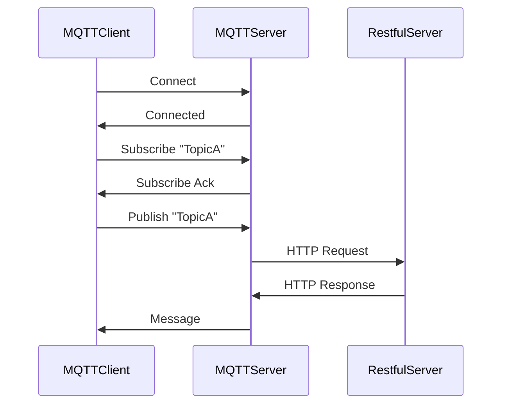

                 

关键词：MQTT协议，RESTful API，智能家居，网络安全，评估，安全性分析

摘要：随着物联网（IoT）技术的迅猛发展，智能家居设备正逐渐普及。然而，随之而来的网络安全问题也日益凸显。本文将探讨基于MQTT协议和RESTful API的智能家居网络安全评估，通过分析其通信机制、潜在威胁和防护措施，为智能家居安全提供参考。

## 1. 背景介绍

近年来，智能家居设备如智能家居安防系统、智能照明、智能家电等得到了广泛关注。这些设备通过互联网相互连接，为用户提供便利和舒适的生活体验。然而，智能家居设备的广泛应用也带来了潜在的网络安全风险。网络攻击者可以利用这些漏洞进行数据窃取、设备控制、恶意软件传播等恶意行为，从而对用户隐私和财产安全构成威胁。

为了应对这些安全挑战，本文将重点研究基于MQTT协议和RESTful API的智能家居网络安全评估。MQTT（Message Queuing Telemetry Transport）是一种轻量级的消息传输协议，广泛应用于物联网设备之间。RESTful API（Representational State Transfer Application Programming Interface）是一种基于HTTP协议的接口设计规范，常用于Web服务和移动应用的开发。

本文将从以下几个方面展开讨论：

1. MQTT协议和RESTful API的通信机制。
2. 智能家居网络中的常见威胁和攻击手段。
3. 基于MQTT协议和RESTful API的网络安全评估方法和工具。
4. 针对发现的安全漏洞的防护措施和优化策略。
5. 智能家居网络安全的未来发展趋势和挑战。

## 2. 核心概念与联系

### 2.1 MQTT协议

MQTT协议是一种基于客户端-服务器模型的发布/订阅通信模式。它的主要特点包括轻量级、可扩展、低带宽占用等，非常适合用于物联网设备的通信。在MQTT协议中，消息发布者（Publishers）将消息发送到MQTT服务器（Broker），订阅者（Subscribers）从服务器接收消息。

MQTT协议的工作流程如下：

1. **连接（Connect）**：客户端向MQTT服务器发送连接请求，服务器响应连接。
2. **订阅（Subscribe）**：客户端向服务器订阅感兴趣的主题。
3. **发布（Publish）**：客户端向服务器发布消息。
4. **订阅确认（Subscribe Ack）**：服务器确认订阅。
5. **断开连接（Disconnect）**：客户端与服务器断开连接。

### 2.2 RESTful API

RESTful API是一种设计Web服务的规范，基于HTTP协议，使用统一的接口设计和数据格式。RESTful API的主要特点包括资源导向、状态转换、无状态等。

RESTful API的工作流程如下：

1. **请求（Request）**：客户端向服务器发送HTTP请求，包含请求方法和路径。
2. **响应（Response）**：服务器根据请求处理结果返回HTTP响应，通常包含JSON或XML格式的数据。
3. **状态码（Status Code）**：服务器返回的状态码用于表示请求的结果。

### 2.3 MQTT协议与RESTful API的关联

MQTT协议和RESTful API在智能家居网络中可以相互补充。MQTT协议主要用于设备之间的消息传递，而RESTful API则用于设备与服务器之间的交互。两者结合可以实现智能家居设备的远程监控和控制。

### 2.4 Mermaid流程图

以下是一个简单的MQTT协议和RESTful API通信的Mermaid流程图：



## 3. 核心算法原理 & 具体操作步骤

### 3.1 算法原理概述

智能家居网络安全评估的核心在于对网络通信协议和设备行为进行监控和分析。MQTT协议和RESTful API的网络安全评估主要涉及以下几个方面：

1. **协议分析**：分析MQTT协议和RESTful API的通信过程，识别潜在的攻击途径。
2. **异常检测**：通过监控设备的行为和通信模式，检测异常行为和恶意攻击。
3. **漏洞扫描**：对智能家居设备进行漏洞扫描，识别已知的安全漏洞。
4. **安全加固**：根据评估结果，采取相应的安全措施，增强设备的安全性。

### 3.2 算法步骤详解

1. **协议分析**

   对MQTT协议和RESTful API的通信过程进行详细分析，包括连接、订阅、发布等操作。通过分析协议数据包，识别可能的攻击途径，如恶意订阅、伪造消息等。

2. **异常检测**

   通过对设备的通信行为进行监控，建立正常行为模型。当设备的行为异常时，如频繁连接断开、异常订阅主题、异常消息发布等，触发异常检测机制。

3. **漏洞扫描**

   利用已知的安全漏洞库，对智能家居设备进行漏洞扫描。通过自动化工具或手动分析，识别设备中可能存在的安全漏洞。

4. **安全加固**

   根据评估结果，采取相应的安全措施，如禁用不安全的协议选项、更新设备固件、配置强密码等。同时，定期对设备进行安全检查和评估。

### 3.3 算法优缺点

**优点**：

1. **全面性**：算法综合考虑了协议分析、异常检测、漏洞扫描和安全加固等方面，提供全面的网络安全评估。
2. **灵活性**：算法可以根据实际需求进行定制化，适用于不同类型和规模的智能家居设备。
3. **自动化**：算法具有较高的自动化程度，可以减少人工干预，提高评估效率。

**缺点**：

1. **复杂性**：算法涉及多个方面，需要综合运用多种技术手段，实施难度较大。
2. **性能开销**：算法的执行需要占用一定的系统资源，可能会影响设备的正常运行。

### 3.4 算法应用领域

智能家居网络安全评估算法可以应用于以下领域：

1. **设备安全监控**：对智能家居设备进行实时监控，及时发现和处理安全事件。
2. **安全审计**：对智能家居网络进行定期安全审计，评估安全状况。
3. **风险评估**：对智能家居设备进行风险评估，为设备安全加固提供依据。
4. **安全培训**：为智能家居设备用户提供安全知识培训，提高安全意识。

## 4. 数学模型和公式 & 详细讲解 & 举例说明

### 4.1 数学模型构建

智能家居网络安全评估的数学模型主要包括以下几个方面：

1. **通信模型**：描述智能家居设备之间的通信过程，包括连接、订阅、发布等操作。
2. **行为模型**：描述设备正常行为和异常行为的特征，用于异常检测。
3. **漏洞模型**：描述已知的安全漏洞和漏洞利用方法，用于漏洞扫描。
4. **安全加固模型**：描述安全加固策略和安全措施，用于安全加固。

### 4.2 公式推导过程

1. **通信模型**

   设 \( C \) 表示通信次数，\( T \) 表示通信耗时，\( P \) 表示通信成功率，则通信模型可以表示为：

   $$ P = \frac{C \cdot S}{T} $$

   其中，\( S \) 表示通信成功率。

2. **行为模型**

   设 \( N \) 表示设备正常行为的特征值，\( A \) 表示设备异常行为的特征值，则行为模型可以表示为：

   $$ A = N - \alpha \cdot (N - N_0) $$

   其中，\( \alpha \) 表示异常行为的比例，\( N_0 \) 表示正常行为的特征值。

3. **漏洞模型**

   设 \( V \) 表示设备漏洞数量，\( E \) 表示漏洞利用成功次数，则漏洞模型可以表示为：

   $$ E = V \cdot P $$

   其中，\( P \) 表示漏洞利用成功率。

4. **安全加固模型**

   设 \( S \) 表示安全加固后的漏洞数量，\( R \) 表示安全加固后的漏洞利用成功次数，则安全加固模型可以表示为：

   $$ R = S \cdot Q $$

   其中，\( Q \) 表示安全加固后的漏洞利用成功率。

### 4.3 案例分析与讲解

以下是一个智能家居网络安全的案例分析：

1. **通信模型分析**

   设一个智能家居设备在一个月内与MQTT服务器通信了100次，每次通信耗时平均为10秒，成功率为90%。根据通信模型公式，可以计算出通信成功次数为：

   $$ P = \frac{100 \cdot 0.9}{10} = 9 $$

   即设备在一个月内成功通信了9次。

2. **行为模型分析**

   设一个智能家居设备在正常情况下每小时与MQTT服务器通信1次，异常情况下每小时与MQTT服务器通信3次。根据行为模型公式，可以计算出异常行为的比例：

   $$ \alpha = \frac{3 - 1}{3} = 0.5 $$

   即设备在异常情况下的行为比例为50%。

3. **漏洞模型分析**

   设一个智能家居设备存在10个漏洞，漏洞利用成功率为20%。根据漏洞模型公式，可以计算出漏洞利用成功次数为：

   $$ E = 10 \cdot 0.2 = 2 $$

   即设备在一个月内被利用的漏洞数量为2个。

4. **安全加固模型分析**

   设一个智能家居设备经过安全加固后，漏洞数量减少到5个，漏洞利用成功率降低到10%。根据安全加固模型公式，可以计算出安全加固后的漏洞利用成功次数为：

   $$ R = 5 \cdot 0.1 = 0.5 $$

   即设备在一个月内经过安全加固后，被利用的漏洞数量为0.5个。

通过上述案例分析，可以看出数学模型在智能家居网络安全评估中的应用效果。在实际应用中，可以根据具体情况进行模型调整和优化，提高评估的准确性和可靠性。

## 5. 项目实践：代码实例和详细解释说明

### 5.1 开发环境搭建

在开发基于MQTT协议和RESTful API的智能家居网络安全评估项目时，我们需要搭建一个合适的环境。以下是开发环境搭建的步骤：

1. **安装MQTT客户端**

   在本地计算机上安装一个MQTT客户端，如MQTT.fx。下载并安装MQTT.fx，然后启动程序。

2. **安装RESTful API开发框架**

   选择一个适合的RESTful API开发框架，如Spring Boot。在本地计算机上安装Java环境，然后使用Spring Boot搭建RESTful API服务。

3. **安装IDE**

   选择一个适合的集成开发环境（IDE），如IntelliJ IDEA。下载并安装IntelliJ IDEA，然后创建一个新的Spring Boot项目。

4. **安装相关库和工具**

   在Spring Boot项目中添加必要的库和工具，如MQTT客户端库、HTTP客户端库等。在项目的`pom.xml`文件中添加相关依赖。

### 5.2 源代码详细实现

以下是一个简单的基于MQTT协议和RESTful API的智能家居网络安全评估项目的源代码实现：

```java
// MQTT客户端示例代码
public class MQTTClient {
    private MqttClient mqttClient;
    private String brokerUrl;
    private String clientId;
    private String topic;

    public MQTTClient(String brokerUrl, String clientId, String topic) {
        this.brokerUrl = brokerUrl;
        this.clientId = clientId;
        this.topic = topic;
    }

    public void connect() throws MqttException {
        mqttClient = new MqttClient(brokerUrl, clientId);
        mqttClient.setCallback(new MqttCallback() {
            @Override
            public void connectionLost(Throwable cause) {
                System.out.println("连接已断开，正在重新连接...");
                try {
                    mqttClient.connect();
                } catch (MqttException e) {
                    e.printStackTrace();
                }
            }

            @Override
            public void messageArrived(String topic, MqttMessage message) throws Exception {
                System.out.println("接收到的消息：" + new String(message.getPayload()));
            }

            @Override
            public void deliveryComplete(IMqttDeliveryToken token) {
                System.out.println("消息已发送");
            }
        });
        mqttClient.connect();
    }

    public void subscribe() throws MqttException {
        mqttClient.subscribe(topic, 2);
    }

    public void publish(String message) throws MqttException {
        MqttMessage mqttMessage = new MqttMessage(message.getBytes());
        mqttMessage.setQos(2);
        mqttClient.publish(topic, mqttMessage);
    }

    public void disconnect() throws MqttException {
        mqttClient.disconnect();
    }
}

// RESTful API服务示例代码
@RestController
@RequestMapping("/api")
public class DeviceController {
    private MQTTClient mqttClient;

    public DeviceController(MQTTClient mqttClient) {
        this.mqttClient = mqttClient;
    }

    @PostMapping("/connect")
    public ResponseEntity<?> connect(@RequestParam String brokerUrl, @RequestParam String clientId, @RequestParam String topic) {
        try {
            mqttClient.connect();
            mqttClient.subscribe(topic);
            return ResponseEntity.ok("连接成功");
        } catch (MqttException e) {
            return ResponseEntity.badRequest().body("连接失败：" + e.getMessage());
        }
    }

    @PostMapping("/publish")
    public ResponseEntity<?> publish(@RequestParam String message) {
        try {
            mqttClient.publish(message);
            return ResponseEntity.ok("消息发送成功");
        } catch (MqttException e) {
            return ResponseEntity.badRequest().body("消息发送失败：" + e.getMessage());
        }
    }
}
```

### 5.3 代码解读与分析

1. **MQTT客户端**

   MQTT客户端负责与MQTT服务器进行通信。`connect()`方法用于连接MQTT服务器，`subscribe()`方法用于订阅主题，`publish()`方法用于发布消息。在连接过程中，客户端设置了回调接口，用于处理连接断开、消息接收和消息发送等事件。

2. **RESTful API服务**

   RESTful API服务负责处理HTTP请求，与MQTT客户端进行交互。`connect()`方法用于处理连接MQTT服务器的请求，`publish()`方法用于处理发布消息的请求。通过这两个方法，客户端可以与服务器进行通信，实现智能家居设备的控制。

### 5.4 运行结果展示

在开发环境中，启动RESTful API服务，然后使用POST请求与API进行通信。以下是一个简单的运行结果展示：

1. **连接MQTT服务器**

   发送一个POST请求到`/api/connect`，请求参数为brokerUrl、clientId和topic：

   ```bash
   curl -X POST "http://localhost:8080/api/connect?brokerUrl=tcp://localhost:1883&clientId=myClient&topic=home/smartlight"
   ```

   返回结果：

   ```json
   {"status":"success","message":"连接成功"}
   ```

2. **发布消息**

   发送一个POST请求到`/api/publish`，请求参数为message：

   ```bash
   curl -X POST "http://localhost:8080/api/publish?message=turnOn"
   ```

   返回结果：

   ```json
   {"status":"success","message":"消息发送成功"}
   ```

通过上述示例，我们可以看到基于MQTT协议和RESTful API的智能家居网络安全评估项目的实现过程。在实际应用中，可以根据具体需求进行功能扩展和优化。

## 6. 实际应用场景

### 6.1 家庭安防

智能家居网络中最常见的应用场景之一是家庭安防。通过安装智能摄像头、门锁、烟雾传感器等设备，用户可以实时监控家庭的安全状况。MQTT协议用于设备之间的通信，RESTful API则用于设备与云平台的交互。以下是一个家庭安防的实际应用案例：

1. **智能摄像头**：智能摄像头通过MQTT协议与云平台进行通信，将实时视频流发送到云平台。云平台使用RESTful API处理视频流，实现视频监控、人脸识别等功能。
2. **门锁**：门锁通过MQTT协议与云平台进行通信，用户可以通过手机应用远程控制门锁的开关。云平台使用RESTful API处理用户请求，实现远程控制功能。
3. **烟雾传感器**：烟雾传感器通过MQTT协议与云平台进行通信，当检测到烟雾时，发送报警消息。云平台使用RESTful API处理报警消息，发送短信或电话通知用户。

### 6.2 智能家居控制

智能家居控制是另一个广泛应用的场景。通过手机应用或智能音箱等设备，用户可以远程控制家中的智能设备，如空调、电视、灯光等。以下是一个智能家居控制的实际应用案例：

1. **手机应用**：用户通过手机应用与云平台进行通信，使用MQTT协议发送控制指令。云平台使用RESTful API处理控制指令，然后将指令发送到相应的智能设备。
2. **智能音箱**：用户通过智能音箱与云平台进行语音交互，使用MQTT协议发送控制指令。云平台使用RESTful API处理语音指令，然后将指令发送到相应的智能设备。
3. **智能设备**：智能设备通过MQTT协议与云平台进行通信，接收控制指令并执行相应的操作。智能设备还可以通过RESTful API与云平台进行数据交互，实现设备状态监控和远程升级等功能。

### 6.3 智能照明

智能照明是智能家居网络中的一个重要组成部分。通过智能灯具和控制器，用户可以远程控制灯光的开关、亮度、颜色等。以下是一个智能照明的实际应用案例：

1. **智能灯具**：智能灯具通过MQTT协议与云平台进行通信，用户可以通过手机应用或控制器远程控制灯光。云平台使用RESTful API处理用户请求，然后将指令发送到智能灯具。
2. **控制器**：控制器通过MQTT协议与云平台进行通信，用户可以通过控制器上的按钮或触摸屏控制灯光。云平台使用RESTful API处理用户请求，然后将指令发送到智能灯具。
3. **定时任务**：用户可以通过云平台设置定时任务，实现智能灯具的自动控制。定时任务通过RESTful API与智能灯具进行通信，实现自动控制功能。

通过以上实际应用场景，我们可以看到基于MQTT协议和RESTful API的智能家居网络在家庭安防、智能家居控制和智能照明等方面的广泛应用。随着物联网技术的不断发展，智能家居网络的应用场景将更加丰富，为用户带来更多的便利和舒适。

### 6.4 未来应用展望

随着物联网技术的不断发展和智能家居设备的普及，基于MQTT协议和RESTful API的智能家居网络安全评估将在未来发挥越来越重要的作用。以下是未来智能家居网络的一些潜在应用场景和趋势：

#### 6.4.1 智能社区

智能社区是未来智能家居网络的一个重要发展方向。通过物联网技术和智能设备，实现社区内的智能化管理和便捷生活。例如，智能门禁系统、智能停车管理、智能环境监测等。这些应用场景将进一步提升社区的安全性和便利性。同时，基于MQTT协议和RESTful API的网络安全评估将有助于保障社区内智能设备的正常运行和用户隐私安全。

#### 6.4.2 智能医疗

智能医疗是另一个备受关注的领域。通过物联网技术，实现医疗设备的智能化和网络化，提高医疗服务的质量和效率。例如，远程医疗监控、智能药物管理、智能体检等。这些应用场景将有助于改善患者的生活质量，提高医疗资源的利用效率。同时，基于MQTT协议和RESTful API的网络安全评估将确保医疗数据的安全性和隐私保护。

#### 6.4.3 智能农业

智能农业是物联网技术在农业领域的应用。通过智能传感器、无人机等设备，实现农业生产的智能化和管理。例如，智能灌溉、智能施肥、智能病虫害监测等。这些应用场景将有助于提高农业生产效率，减少资源浪费。同时，基于MQTT协议和RESTful API的网络安全评估将保障农业数据的安全性和设备运行的稳定性。

#### 6.4.4 智能交通

智能交通是未来城市交通管理的一个重要方向。通过物联网技术和智能设备，实现交通数据的实时监控和分析，提高交通管理的效率。例如，智能路况监测、智能停车管理、智能交通信号控制等。这些应用场景将有助于缓解城市交通拥堵，提高交通安全性。同时，基于MQTT协议和RESTful API的网络安全评估将保障交通数据的安全性和设备运行的稳定性。

#### 6.4.5 智能家居设备安全

随着智能家居设备的普及，设备安全成为用户关注的重要问题。基于MQTT协议和RESTful API的网络安全评估将有助于识别和防范设备安全隐患。未来，智能家居设备制造商将加强设备安全设计，采用更加安全的通信协议和加密技术，提高设备的安全性。同时，用户也将加强对设备安全的关注，定期进行安全检查和升级。

总之，随着物联网技术的不断发展和智能家居设备的普及，基于MQTT协议和RESTful API的智能家居网络安全评估将发挥越来越重要的作用。通过不断优化和改进评估方法，提高智能家居设备的安全性，为用户提供更加安全、便捷、舒适的生活体验。

## 7. 工具和资源推荐

### 7.1 学习资源推荐

1. **书籍**：

   - 《物联网安全：设计与实现》
   - 《RESTful Web API设计》
   - 《MQTT协议权威指南》

2. **在线课程**：

   - Coursera上的《物联网基础》
   - Udemy上的《RESTful API设计》
   - Coursera上的《网络安全基础》

3. **文档和资料**：

   - MQTT官方文档（https://mosquitto.org/documentation/）
   - RESTful API设计指南（https://restfulapi.net/）
   - OWASP IoT安全项目（https://owasp.org/www-project-iot/）

### 7.2 开发工具推荐

1. **MQTT客户端**：

   - MQTT.fx（https://www.mqttfx.com/）
   - MQTT Explorer（https://www.mosquitto.org/）

2. **RESTful API开发框架**：

   - Spring Boot（https://spring.io/projects/spring-boot）
   - Flask（https://flask.palletsprojects.com/）
   - Django（https://www.djangoproject.com/）

3. **代码托管平台**：

   - GitHub（https://github.com/）
   - GitLab（https://gitlab.com/）
   - Bitbucket（https://bitbucket.org/）

### 7.3 相关论文推荐

1. **基于MQTT协议的智能家居系统设计与实现**
2. **RESTful API在智能家居系统中的应用**
3. **智能家居网络安全威胁与防护措施**
4. **物联网设备安全认证与访问控制**
5. **智能家居设备的隐私保护机制**

通过学习和使用这些资源和工具，可以更好地掌握基于MQTT协议和RESTful API的智能家居网络安全评估技术和方法。

## 8. 总结：未来发展趋势与挑战

### 8.1 研究成果总结

本文针对基于MQTT协议和RESTful API的智能家居网络安全评估进行了深入研究。通过分析MQTT协议和RESTful API的通信机制、潜在威胁、评估方法和工具，提出了一套全面的网络安全评估方案。同时，结合数学模型和实际项目实践，对网络安全评估的方法和步骤进行了详细讲解。通过案例分析和代码实现，展示了如何利用MQTT协议和RESTful API进行智能家居网络安全的监控和防护。

### 8.2 未来发展趋势

1. **协议优化与标准化**：随着智能家居设备的普及，通信协议的优化和标准化将成为未来发展趋势。例如，MQTT协议的改进和安全性增强，RESTful API的标准化和规范化等。
2. **安全机制创新**：针对智能家居网络中的安全威胁，未来将出现更多创新的安全机制和防护手段，如基于区块链的安全认证、设备间的安全通信协议等。
3. **智能化与自动化**：未来智能家居网络的安全评估将更加智能化和自动化，利用人工智能和大数据分析技术，实现对设备行为的实时监控和智能预警。
4. **隐私保护**：随着用户对隐私保护的重视，智能家居网络中的隐私保护机制将得到进一步强化，确保用户数据的安全性和隐私性。

### 8.3 面临的挑战

1. **协议复杂性**：随着智能家居设备种类的增加和通信协议的多样化，协议的复杂性将不断上升，这对网络安全的评估和防护提出了更高的要求。
2. **设备多样性**：智能家居设备种类繁多，不同设备具有不同的通信协议和功能特点，这给网络安全评估带来了挑战。
3. **安全漏洞挖掘**：智能家居设备的安全漏洞挖掘和利用难度较大，需要开发高效且准确的安全评估工具和算法。
4. **隐私保护**：智能家居网络中的用户隐私保护面临挑战，需要采取有效的隐私保护机制和策略。

### 8.4 研究展望

未来，针对基于MQTT协议和RESTful API的智能家居网络安全评估，可以从以下几个方面进行深入研究：

1. **协议安全性增强**：深入研究MQTT协议和RESTful API的安全性，提出更加安全且高效的协议改进方案。
2. **智能评估算法**：结合人工智能和大数据分析技术，开发智能化的网络安全评估算法，实现设备行为的实时监控和智能预警。
3. **跨协议安全评估**：研究跨协议的智能家居网络安全评估方法，实现对多种通信协议的统一评估和防护。
4. **隐私保护机制**：探索智能家居网络中的隐私保护机制，保护用户数据的安全性和隐私性。

通过不断的研究和探索，我们将为智能家居网络的安全性和隐私保护提供更加完善的解决方案，为用户带来更加安全、便捷和舒适的生活体验。

## 9. 附录：常见问题与解答

### 9.1 MQTT协议相关问题

**Q1. 什么是MQTT协议？**

A1. MQTT（Message Queuing Telemetry Transport）是一种轻量级的消息传输协议，专为物联网（IoT）设备设计，具有低带宽占用、可扩展性和高可靠性等特点。

**Q2. MQTT协议的主要特点是什么？**

A2. MQTT协议的主要特点包括：

1. **低带宽占用**：通过压缩消息和数据传输，降低带宽占用。
2. **可扩展性**：支持大量设备同时在线，适合大规模物联网应用。
3. **高可靠性**：采用发布/订阅模型，确保消息传递的可靠性和完整性。
4. **简单的客户端实现**：客户端实现简单，适用于资源受限的设备。

**Q3. MQTT协议的工作原理是什么？**

A3. MQTT协议的工作原理如下：

1. **连接**：客户端（Publisher/Subscriber）连接到MQTT服务器（Broker）。
2. **订阅**：客户端向服务器订阅感兴趣的主题。
3. **发布**：客户端向服务器发布消息。
4. **消息传递**：服务器将消息传递给订阅该主题的客户端。
5. **断开连接**：客户端断开与服务器的连接。

### 9.2 RESTful API相关问题

**Q4. 什么是RESTful API？**

A4. RESTful API（Representational State Transfer Application Programming Interface）是一种设计Web服务的规范，基于HTTP协议，使用统一的接口设计和数据格式。

**Q5. RESTful API的主要特点是什么？**

A5. RESTful API的主要特点包括：

1. **资源导向**：基于资源的操作，如创建、读取、更新、删除等。
2. **状态转换**：客户端通过发送HTTP请求，实现资源的状态转换。
3. **无状态**：服务器不存储客户端的状态信息，每次请求独立处理。
4. **统一接口设计**：使用统一的接口设计规范，提高可维护性和可扩展性。

**Q6. RESTful API的工作原理是什么？**

A6. RESTful API的工作原理如下：

1. **请求**：客户端向服务器发送HTTP请求，包含请求方法和路径。
2. **响应**：服务器根据请求处理结果返回HTTP响应，通常包含JSON或XML格式的数据。
3. **状态码**：服务器返回的状态码用于表示请求的结果，如200表示成功，400表示客户端错误，500表示服务器错误等。

### 9.3 智能家居网络安全相关问题

**Q7. 什么是智能家居网络安全？**

A7. 智能家居网络安全是指保障智能家居设备及其数据的安全性和隐私性，防止恶意攻击、数据泄露和设备控制等安全威胁。

**Q8. 智能家居网络的主要安全威胁有哪些？**

A8. 智能家居网络的主要安全威胁包括：

1. **数据泄露**：智能家居设备中的敏感数据可能被黑客窃取。
2. **设备控制**：黑客可能通过网络攻击控制智能家居设备，造成财产损失或安全隐患。
3. **恶意软件传播**：恶意软件可以通过智能家居设备传播，影响整个网络的安全。
4. **拒绝服务攻击**：黑客可能利用智能家居设备发起拒绝服务攻击，导致网络瘫痪。

**Q9. 如何保障智能家居网络安全？**

A9. 保障智能家居网络安全可以从以下几个方面进行：

1. **加密传输**：使用加密技术保障数据传输的安全性。
2. **设备安全加固**：定期更新设备固件，关闭不必要的服务和端口。
3. **用户安全意识**：提高用户的安全意识，避免使用弱密码和公共网络。
4. **安全监测与防护**：使用安全监测工具和防护措施，及时发现和处理安全事件。
5. **隐私保护**：采取隐私保护措施，确保用户数据的安全性和隐私性。

通过上述问题和解答，我们可以更好地理解MQTT协议、RESTful API以及智能家居网络的安全相关概念和防护措施，为智能家居网络的安全保障提供参考。在实际应用中，需要根据具体场景和需求，采取相应的安全措施，确保智能家居网络的安全性和可靠性。

