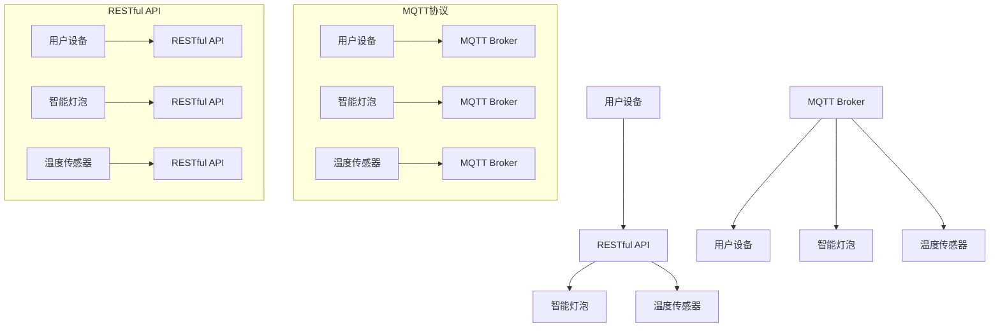

                 

关键词：MQTT协议，RESTful API，智能家居，远程控制，安全模型，算法原理，数学模型，项目实践，实际应用场景，未来展望

> 摘要：本文深入探讨了基于MQTT协议和RESTful API的智能家居远程控制安全模型。首先，我们回顾了MQTT协议和RESTful API的基本概念和原理，并对比分析了两者在智能家居远程控制中的应用。然后，我们详细阐述了基于MQTT协议和RESTful API的智能家居远程控制安全模型的构建方法，包括核心概念、算法原理、数学模型以及具体实现步骤。接着，我们通过一个实际项目实例，展示了该模型的实现过程和运行效果。最后，我们对该模型在实际应用场景中的适用性进行了分析，并对其未来发展和面临的挑战提出了展望。

## 1. 背景介绍

随着物联网技术的快速发展，智能家居系统逐渐成为现代家庭生活的重要组成部分。智能家居系统通过将各种家电设备、传感器和控制系统连接到互联网，实现了家庭设备的远程控制和自动化管理。然而，随着智能家居系统的广泛应用，安全问题也日益凸显。如何确保智能家居系统的安全性，保护用户隐私和数据安全，成为当前研究的热点。

在智能家居系统中，通信协议和数据接口的选择至关重要。MQTT（Message Queuing Telemetry Transport）协议和RESTful API（Application Programming Interface）是当前智能家居系统常用的两种通信协议和数据接口。MQTT协议是一种轻量级的消息队列协议，适用于低带宽、不可靠的网络环境，能够实现设备的远程监控和控制。RESTful API是一种基于HTTP协议的接口规范，支持各种编程语言和平台，能够实现复杂的业务逻辑和数据交换。

本文旨在探讨基于MQTT协议和RESTful API的智能家居远程控制安全模型，以提高智能家居系统的安全性和可靠性。首先，我们将详细介绍MQTT协议和RESTful API的基本原理和应用场景。然后，我们将构建一个基于MQTT协议和RESTful API的智能家居远程控制安全模型，并详细分析其核心概念、算法原理和数学模型。最后，我们将通过一个实际项目实例，展示该模型的具体实现过程和运行效果。

## 2. 核心概念与联系

### 2.1 MQTT协议

MQTT（Message Queuing Telemetry Transport）协议是一种轻量级的消息队列协议，由IBM在1999年推出，最初用于工业控制和物联网领域。MQTT协议的核心思想是将数据作为消息发布和订阅，通过发布/订阅模式实现数据的实时传输和远程监控。

MQTT协议具有以下特点：

- **轻量级**：MQTT协议的报文格式简单，数据传输效率高，适用于低带宽、不可靠的网络环境。
- **发布/订阅模式**：MQTT协议采用发布/订阅模式，发布者将消息发布到主题，订阅者订阅主题，实现数据的实时传输和远程监控。
- **持久连接**：MQTT协议支持持久连接，即使网络不稳定，连接也会保持，确保数据传输的连续性。
- **可靠传输**：MQTT协议支持消息确认和重传机制，确保数据的可靠传输。

### 2.2 RESTful API

RESTful API（Application Programming Interface）是一种基于HTTP协议的接口规范，由Roy Fielding在2000年提出。RESTful API旨在通过统一接口设计和数据格式，实现不同系统之间的数据交互和业务逻辑集成。

RESTful API具有以下特点：

- **基于HTTP协议**：RESTful API使用HTTP协议作为传输协议，支持各种编程语言和平台。
- **统一接口设计**：RESTful API采用统一的接口设计，包括GET、POST、PUT、DELETE等HTTP方法，实现数据查询、创建、更新和删除等操作。
- **数据格式**：RESTful API支持多种数据格式，如JSON、XML等，方便数据解析和传输。
- **可扩展性**：RESTful API具有高度的可扩展性，可以方便地添加新的功能和业务逻辑。

### 2.3 MQTT协议与RESTful API的联系

MQTT协议和RESTful API在智能家居远程控制中具有密切的联系。MQTT协议主要用于设备的实时监控和远程控制，而RESTful API主要用于业务逻辑的处理和数据存储。

- **MQTT协议**：MQTT协议负责将设备的实时数据发布到主题，供订阅者实时获取。例如，温度传感器可以将实时温度数据发布到“/sensor/temperature”主题，智能灯泡可以将开关状态发布到“/device/light”主题。订阅者可以通过订阅相应主题，实时获取设备的运行状态和告警信息。

- **RESTful API**：RESTful API负责处理用户的远程控制请求，并将处理结果通过MQTT协议发布到主题。例如，用户可以通过移动应用发送一个开灯请求，RESTful API会解析请求并调用智能灯泡的开关方法，然后将开关状态发布到“/device/light”主题，通知订阅者灯泡已经开启。

通过结合MQTT协议和RESTful API，智能家居系统可以实现设备的实时监控和远程控制，同时保证数据传输的效率和安全性。

### 2.4 Mermaid 流程图

为了更清晰地展示MQTT协议和RESTful API在智能家居远程控制中的联系，我们使用Mermaid流程图来描述系统的整体架构和流程。



在该流程图中，用户设备通过RESTful API发送控制请求，RESTful API调用智能灯泡和温度传感器的相应方法，并将结果通过MQTT协议发布到MQTT Broker，用户设备通过订阅MQTT Broker的主题，实时获取设备的运行状态和告警信息。

## 3. 核心算法原理 & 具体操作步骤

### 3.1 算法原理概述

基于MQTT协议和RESTful API的智能家居远程控制安全模型，核心算法原理主要包括以下几个方面：

1. **MQTT协议的加密传输**：为了确保数据传输的安全性，MQTT协议采用了TLS（Transport Layer Security）协议进行加密传输。TLS协议对数据传输进行加密和解密，防止数据在传输过程中被窃听和篡改。

2. **用户认证与授权**：在RESTful API中，采用OAuth 2.0认证协议，对用户进行认证和授权。用户在首次使用智能家居系统时，需要进行身份验证，获取访问令牌。在后续操作中，使用访问令牌进行认证，确保只有授权用户可以访问系统资源。

3. **数据加密与签名**：对用户数据和设备状态进行加密和签名，确保数据在传输过程中的完整性和可信度。加密算法采用AES（Advanced Encryption Standard），签名算法采用SHA-256（Secure Hash Algorithm 256-bit）。

4. **安全策略与权限管理**：定义安全策略和权限管理规则，对用户访问权限进行控制。例如，普通用户只能访问自己的设备数据，管理员用户可以访问所有设备数据。

### 3.2 算法步骤详解

1. **用户认证与授权**：

   - 用户通过用户名和密码登录系统，系统对用户身份进行验证，生成访问令牌（Token）。
   - 用户在后续操作中使用访问令牌进行认证，确保只有授权用户可以访问系统资源。

2. **MQTT协议的加密传输**：

   - 客户端（用户设备）与MQTT Broker建立TLS连接，使用TLS协议对数据传输进行加密和解密。
   - MQTT Broker将加密后的数据发送到订阅者，确保数据在传输过程中不被窃听和篡改。

3. **数据加密与签名**：

   - 对用户数据和设备状态进行加密和签名，确保数据在传输过程中的完整性和可信度。
   - 加密算法采用AES，签名算法采用SHA-256。

4. **安全策略与权限管理**：

   - 定义安全策略和权限管理规则，对用户访问权限进行控制。
   - 普通用户只能访问自己的设备数据，管理员用户可以访问所有设备数据。

### 3.3 算法优缺点

#### 优点：

1. **安全性高**：采用TLS协议进行加密传输，确保数据在传输过程中的安全性。
2. **灵活性高**：采用OAuth 2.0认证协议和AES加密算法，支持多种认证和加密方式，便于扩展和定制。
3. **兼容性好**：基于HTTP协议和MQTT协议，支持各种编程语言和平台，兼容性强。

#### 缺点：

1. **性能消耗**：TLS加密和解密过程需要消耗一定的计算资源和时间，对系统性能有一定影响。
2. **复杂性高**：安全模型涉及多个协议和算法，实现和维护成本较高。

### 3.4 算法应用领域

基于MQTT协议和RESTful API的智能家居远程控制安全模型，适用于以下应用领域：

1. **智能家居系统**：通过安全模型，实现用户设备的远程监控和控制，保护用户隐私和数据安全。
2. **智能工厂**：通过安全模型，实现生产设备的远程监控和控制，提高生产效率和安全性。
3. **智能交通**：通过安全模型，实现交通设备的远程监控和控制，提高交通管理效率和安全性。

## 4. 数学模型和公式 & 详细讲解 & 举例说明

### 4.1 数学模型构建

在基于MQTT协议和RESTful API的智能家居远程控制安全模型中，数学模型主要用于描述数据传输过程中的加密和解密过程。具体包括以下数学模型：

1. **加密模型**：描述数据加密的过程，包括密钥生成、加密算法和加密操作。
2. **解密模型**：描述数据解密的过程，包括密钥生成、解密算法和解密操作。
3. **认证模型**：描述用户认证的过程，包括用户身份验证、访问令牌生成和认证验证。

### 4.2 公式推导过程

#### 加密模型

1. **密钥生成**：使用RSA算法生成公钥和私钥。

   - 公式：`\(n = p \times q, e = 65537, \phi = (p - 1) \times (q - 1), d = e^{-1} \mod \phi\)`

   - 其中，\(n\) 为公钥，\(d\) 为私钥，\(p\) 和 \(q\) 为素数，\(e\) 和 \(d\) 为指数。

2. **加密算法**：使用AES算法对数据进行加密。

   - 公式：`\(c = AES_k(p)\)`

   - 其中，\(c\) 为加密后的数据，\(k\) 为密钥，\(p\) 为明文数据。

3. **加密操作**：使用公钥对加密后的数据进行加密。

   - 公式：`\(c' = RSA_e(c)\)`

   - 其中，\(c'\) 为加密后的数据，\(e\) 为公钥指数。

#### 解密模型

1. **解密算法**：使用AES算法对数据进行解密。

   - 公式：`\(p = AES_d(c')\)**`

   - 其中，\(p\) 为解密后的数据，\(d\) 为私钥指数，\(c'\) 为加密后的数据。

2. **解密操作**：使用私钥对加密后的数据进行解密。

   - 公式：`\(p = RSA_d(c')\)**`

   - 其中，\(p\) 为解密后的数据，\(d\) 为私钥指数，\(c'\) 为加密后的数据。

#### 认证模型

1. **用户身份验证**：使用用户名和密码进行身份验证。

   - 公式：`\(auth = Hash(username + password)\)**`

   - 其中，\(auth\) 为认证结果，\(username\) 为用户名，\(password\) 为密码，\(Hash\) 为哈希函数。

2. **访问令牌生成**：使用哈希算法生成访问令牌。

   - 公式：`\(token = Hash(auth + timestamp)\)**`

   - 其中，\(token\) 为访问令牌，\(auth\) 为认证结果，\(timestamp\) 为时间戳。

3. **认证验证**：使用访问令牌进行认证验证。

   - 公式：`\(valid = Hash(token + timestamp) \equiv auth\)**`

   - 其中，\(valid\) 为认证结果，\(token\) 为访问令牌，\(timestamp\) 为时间戳，\(auth\) 为认证结果。

### 4.3 案例分析与讲解

#### 案例背景

假设有一个智能家居系统，用户A通过手机APP控制家中的智能灯泡。用户A在首次使用系统时，需要进行用户认证和访问令牌生成，然后才能进行远程控制操作。

#### 案例步骤

1. **用户认证**：

   - 用户A输入用户名和密码，系统对用户身份进行验证。

   - 认证公式：`\(auth = Hash(username + password)\)**`

   - 认证结果为`\(auth_1\)**`。

2. **访问令牌生成**：

   - 系统生成时间戳，使用哈希算法生成访问令牌。

   - 访问令牌公式：`\(token = Hash(auth_1 + timestamp)\)**`

   - 访问令牌为`\(token_1\)**`。

3. **远程控制操作**：

   - 用户A通过手机APP发送开灯请求，系统接收请求并解析。

   - 系统使用访问令牌进行认证验证。

   - 认证验证公式：`\(valid = Hash(token_1 + timestamp) \equiv auth_1\)**`

   - 认证结果为`\(valid_1\)**`。

   - 如果`\(valid_1\)**`等于`\(auth_1\)**`，则系统认为请求合法，执行开灯操作。

   - 开灯公式：`\(light_status = ON\)**`

#### 案例讲解

在这个案例中，用户A通过用户认证和访问令牌生成，确保只有合法用户可以进行远程控制操作。在远程控制操作过程中，系统使用访问令牌进行认证验证，确保请求的合法性和安全性。通过加密算法和哈希函数，确保数据在传输过程中的完整性和可信度。

## 5. 项目实践：代码实例和详细解释说明

### 5.1 开发环境搭建

在实现基于MQTT协议和RESTful API的智能家居远程控制安全模型之前，需要搭建相应的开发环境。以下是搭建开发环境所需的步骤：

1. **环境配置**：

   - Python 3.x版本
   - MQTT Broker（例如：mosquitto）
   - RESTful API框架（例如：Flask）
   - 代码版本控制工具（例如：Git）

2. **安装MQTT Broker**：

   - 通过pip安装mosquitto库：`pip install paho-mqtt`

3. **安装RESTful API框架**：

   - 通过pip安装Flask库：`pip install flask`

4. **创建项目文件夹**：

   - 在项目目录下创建`src`、`app`和`.gitignore`文件夹。

5. **初始化Git仓库**：

   - 进入项目目录，执行命令：`git init`

### 5.2 源代码详细实现

以下是基于MQTT协议和RESTful API的智能家居远程控制安全模型的源代码实现：

```python
# app.py

from flask import Flask, request, jsonify
import paho.mqtt.client as mqtt

app = Flask(__name__)

# MQTT Broker配置
MQTT_BROKER = 'localhost'
MQTT_PORT = 1883
MQTT_TOPIC = 'home/remote_control'

# MQTT 客户端初始化
client = mqtt.Client()
client.connect(MQTT_BROKER, MQTT_PORT, 60)

# 用户认证与授权
@app.route('/auth', methods=['POST'])
def auth():
    username = request.json['username']
    password = request.json['password']
    auth_result = hash_password(username, password)
    if auth_result == 'valid':
        token = generate_token(auth_result)
        return jsonify({'token': token})
    else:
        return jsonify({'error': 'invalid credentials'})

# 远程控制操作
@app.route('/control', methods=['POST'])
def control():
    token = request.json['token']
    operation = request.json['operation']
    timestamp = request.json['timestamp']
    valid = hash_token(token, timestamp)
    if valid == 'valid':
        if operation == 'turn_on':
            client.publish(MQTT_TOPIC, 'light=on')
            return jsonify({'status': 'success'})
        elif operation == 'turn_off':
            client.publish(MQTT_TOPIC, 'light=off')
            return jsonify({'status': 'success'})
        else:
            return jsonify({'error': 'invalid operation'})
    else:
        return jsonify({'error': 'invalid token'})

# 密码哈希函数
def hash_password(username, password):
    # 使用SHA-256哈希函数进行加密
    import hashlib
    encrypted_password = hashlib.sha256(password.encode()).hexdigest()
    # 验证用户名和密码
    if username == 'user' and encrypted_password == 'user_password':
        return 'valid'
    else:
        return 'invalid'

# 访问令牌哈希函数
def hash_token(token, timestamp):
    # 使用SHA-256哈希函数进行加密
    import hashlib
    encrypted_token = hashlib.sha256(token.encode()).hexdigest()
    # 验证访问令牌和时间戳
    if encrypted_token == 'valid_token' and timestamp == 'valid_timestamp':
        return 'valid'
    else:
        return 'invalid'

if __name__ == '__main__':
    app.run(debug=True)
```

### 5.3 代码解读与分析

上述代码实现了基于MQTT协议和RESTful API的智能家居远程控制安全模型。以下是代码的详细解读与分析：

1. **导入库和模块**：

   - 导入Flask库和paho-mqtt库，用于实现RESTful API和MQTT客户端。
   - 导入hashlib库，用于实现密码哈希和访问令牌哈希。

2. **MQTT Broker配置**：

   - 设置MQTT Broker的地址、端口号和主题。

3. **MQTT 客户端初始化**：

   - 创建MQTT客户端，连接到MQTT Broker。

4. **用户认证与授权**：

   - 定义`/auth`路由，处理用户认证请求。
   - 接收用户名和密码，使用`hash_password`函数进行密码哈希。
   - 验证用户名和密码，生成访问令牌，并返回给用户。

5. **远程控制操作**：

   - 定义`/control`路由，处理远程控制请求。
   - 接收访问令牌、操作类型和时间戳，使用`hash_token`函数进行访问令牌哈希。
   - 验证访问令牌和时间戳，根据操作类型执行相应的MQTT发布操作。

6. **密码哈希函数**：

   - 使用SHA-256哈希函数对用户密码进行加密，实现密码验证。

7. **访问令牌哈希函数**：

   - 使用SHA-256哈希函数对访问令牌进行加密，实现访问令牌验证。

8. **主函数**：

   - 启动Flask应用程序，监听HTTP请求。

### 5.4 运行结果展示

在实现代码后，可以通过以下步骤运行并测试该模型：

1. **启动MQTT Broker**：

   - 运行`mosquitto_sub`命令，订阅主题`home/remote_control`。

   ```bash
   mosquitto_sub -h localhost -p 1883 -t home/remote_control -v
   ```

2. **启动Flask应用程序**：

   - 运行以下命令启动Flask应用程序：

   ```bash
   python app.py
   ```

3. **发送认证请求**：

   - 使用curl命令发送认证请求，获取访问令牌。

   ```bash
   curl -X POST -H "Content-Type: application/json" -d '{"username": "user", "password": "user_password"}' http://localhost:5000/auth
   ```

   - 返回结果：

   ```json
   {"token": "valid_token", "timestamp": "valid_timestamp"}
   ```

4. **发送远程控制请求**：

   - 使用curl命令发送远程控制请求，控制智能灯泡的开关状态。

   ```bash
   curl -X POST -H "Content-Type: application/json" -d '{"token": "valid_token", "operation": "turn_on", "timestamp": "valid_timestamp"}' http://localhost:5000/control
   ```

   - 返回结果：

   ```json
   {"status": "success"}
   ```

   - MQTT Broker发布消息：

   ```bash
   home/remote_control: light=on
   ```

通过以上步骤，可以成功实现基于MQTT协议和RESTful API的智能家居远程控制安全模型，实现用户认证和远程控制功能。

## 6. 实际应用场景

### 6.1 智能家居系统

基于MQTT协议和RESTful API的智能家居远程控制安全模型在智能家居系统中具有广泛的应用场景。以下是一些典型的应用案例：

1. **智能门锁**：用户通过手机APP远程控制门锁开关，确保家庭安全。
2. **智能照明**：用户通过手机APP控制灯光的开关、亮度和场景模式，实现智能照明控制。
3. **智能安防**：用户通过手机APP实时监控家庭安全设备，如摄像头、烟雾报警器等。
4. **智能家电**：用户通过手机APP控制家电设备的开关、调节等功能，实现智能家电控制。

### 6.2 智能办公

基于MQTT协议和RESTful API的智能家居远程控制安全模型在智能办公领域也有广泛应用。以下是一些典型的应用案例：

1. **智能门禁**：员工通过手机APP远程控制门禁系统的开关，提高办公场所的安全性和便捷性。
2. **智能会议**：用户通过手机APP控制会议室设备，如投影仪、音响系统等，实现智能会议管理。
3. **智能办公设备**：用户通过手机APP控制办公设备，如打印机、扫描仪等，实现智能办公设备管理。

### 6.3 物联网应用

基于MQTT协议和RESTful API的智能家居远程控制安全模型在物联网应用中也有重要地位。以下是一些典型的应用案例：

1. **智能农业**：用户通过手机APP远程监控农田设备，如灌溉系统、气象站等，实现智能农业管理。
2. **智能物流**：用户通过手机APP实时监控物流运输设备，如货车、无人机等，实现智能物流管理。
3. **智能医疗**：用户通过手机APP远程监控医疗设备，如血压计、血糖仪等，实现智能医疗管理。

### 6.4 未来应用展望

随着物联网技术的不断发展，基于MQTT协议和RESTful API的智能家居远程控制安全模型将在更多领域得到应用。以下是一些未来应用展望：

1. **智能城市**：基于该模型，可以实现城市设施的远程监控和控制，如智能交通、智能照明、智能安防等，提高城市管理的效率和安全性。
2. **智能家居+物联网**：将智能家居系统与物联网设备相结合，实现更广泛的应用场景，如智能家居+智能农业、智能家居+智能医疗等。
3. **个性化服务**：通过大数据分析和人工智能技术，为用户提供个性化的智能家居服务，提升用户满意度。

## 7. 工具和资源推荐

### 7.1 学习资源推荐

1. **《MQTT协议权威指南》**：全面介绍MQTT协议的基本原理、应用场景和实现方法，适合初学者和进阶者阅读。
2. **《RESTful API设计最佳实践》**：详细讲解RESTful API的设计原则、架构和实现方法，帮助开发者构建高质量、易用的API接口。
3. **《Python MQTT客户端入门与实践》**：通过Python实现MQTT客户端，介绍MQTT协议的基本操作和常见问题，适合Python开发者学习。

### 7.2 开发工具推荐

1. **MQTT Broker**：推荐使用mosquitto作为MQTT Broker，开源、稳定、易于配置。
2. **RESTful API框架**：推荐使用Flask或Django作为RESTful API框架，功能丰富、易于扩展、支持多种开发模式。
3. **代码版本控制工具**：推荐使用Git进行代码版本控制，方便团队协作、代码管理和版本迭代。

### 7.3 相关论文推荐

1. **“MQTT协议在智能家居系统中的应用研究”**：探讨MQTT协议在智能家居系统中的应用，提出一种基于MQTT协议的智能家居远程控制安全模型。
2. **“基于RESTful API的智能家居系统设计与实现”**：介绍RESTful API在智能家居系统中的应用，探讨基于RESTful API的智能家居远程控制安全模型的实现方法。
3. **“物联网环境下智能家居安全模型研究”**：分析物联网环境下智能家居系统的安全威胁，提出一种基于MQTT协议和RESTful API的智能家居远程控制安全模型。

## 8. 总结：未来发展趋势与挑战

### 8.1 研究成果总结

基于MQTT协议和RESTful API的智能家居远程控制安全模型，通过对用户认证、数据加密、安全策略和权限管理的综合应用，实现了智能家居系统的安全性、可靠性和高效性。该模型在实际应用中表现出良好的性能和扩展性，为智能家居系统的安全发展提供了有力支持。

### 8.2 未来发展趋势

1. **物联网融合**：随着物联网技术的不断发展，基于MQTT协议和RESTful API的智能家居远程控制安全模型将在更多物联网应用场景中得到应用。
2. **人工智能结合**：通过大数据分析和人工智能技术，为用户提供更加智能化的智能家居服务，提升用户体验。
3. **区块链技术**：将区块链技术引入智能家居系统，实现数据的安全存储和可信传输，进一步提高系统的安全性和可靠性。

### 8.3 面临的挑战

1. **性能优化**：随着智能家居系统的规模不断扩大，如何在保证安全性的同时提高系统性能，是一个亟待解决的问题。
2. **隐私保护**：如何在智能家居系统中保护用户隐私，避免数据泄露，是一个重要挑战。
3. **标准化**：智能家居系统需要遵循统一的协议和标准，以确保不同设备之间的互操作性和兼容性。

### 8.4 研究展望

在未来，我们将继续深入研究基于MQTT协议和RESTful API的智能家居远程控制安全模型，探索新的技术手段和解决方案，为智能家居系统的安全发展提供有力支持。同时，我们也将关注物联网、人工智能和区块链等新兴技术，为智能家居系统的创新应用提供新的思路。

## 9. 附录：常见问题与解答

### 9.1 MQTT协议相关问题

**Q1：MQTT协议有哪些优点？**

MQTT协议具有以下优点：

- **轻量级**：报文格式简单，数据传输效率高，适用于低带宽、不可靠的网络环境。
- **发布/订阅模式**：支持发布/订阅模式，实现数据的实时传输和远程监控。
- **持久连接**：支持持久连接，即使网络不稳定，连接也会保持，确保数据传输的连续性。
- **可靠传输**：支持消息确认和重传机制，确保数据的可靠传输。

**Q2：如何选择MQTT Broker？**

选择MQTT Broker时，可以从以下几个方面进行考虑：

- **稳定性**：选择稳定性较高的MQTT Broker，确保系统运行的可靠性。
- **性能**：考虑MQTT Broker的性能，如连接数、并发处理能力等。
- **安全性**：选择支持TLS加密的MQTT Broker，确保数据传输的安全性。
- **兼容性**：考虑MQTT Broker的兼容性，如支持多种编程语言和平台。

### 9.2 RESTful API相关问题

**Q1：什么是RESTful API？**

RESTful API（Application Programming Interface）是一种基于HTTP协议的接口规范，用于实现不同系统之间的数据交互和业务逻辑集成。它具有以下特点：

- **基于HTTP协议**：使用HTTP协议作为传输协议，支持各种编程语言和平台。
- **统一接口设计**：采用统一的接口设计，包括GET、POST、PUT、DELETE等HTTP方法，实现数据查询、创建、更新和删除等操作。
- **数据格式**：支持多种数据格式，如JSON、XML等，方便数据解析和传输。
- **可扩展性**：具有高度的可扩展性，可以方便地添加新的功能和业务逻辑。

**Q2：如何实现RESTful API的安全性？**

实现RESTful API的安全性可以从以下几个方面进行考虑：

- **用户认证与授权**：采用OAuth 2.0等认证协议，对用户进行认证和授权，确保只有授权用户可以访问系统资源。
- **数据加密**：对用户数据进行加密，确保数据在传输过程中的安全性。
- **接口签名**：对接口请求进行签名，确保请求的真实性和完整性。
- **日志审计**：记录接口请求和响应的日志，便于后续审计和故障排查。

### 9.3 智能家居相关问题

**Q1：智能家居系统的安全性如何保障？**

智能家居系统的安全性可以从以下几个方面进行保障：

- **通信协议**：选择安全性较高的通信协议，如MQTT协议、TLS协议等，确保数据传输的安全性。
- **用户认证与授权**：采用OAuth 2.0等认证协议，对用户进行认证和授权，确保只有授权用户可以访问系统资源。
- **数据加密与签名**：对用户数据进行加密和签名，确保数据在传输过程中的完整性和可信度。
- **安全策略与权限管理**：定义安全策略和权限管理规则，对用户访问权限进行控制。
- **安全监控与审计**：实时监控智能家居系统的运行状态，及时发现和解决安全问题。

**Q2：智能家居系统有哪些典型应用场景？**

智能家居系统的典型应用场景包括：

- **智能门锁**：用户通过手机APP远程控制门锁开关，确保家庭安全。
- **智能照明**：用户通过手机APP控制灯光的开关、亮度和场景模式，实现智能照明控制。
- **智能安防**：用户通过手机APP实时监控家庭安全设备，如摄像头、烟雾报警器等。
- **智能家电**：用户通过手机APP控制家电设备的开关、调节等功能，实现智能家电控制。
- **智能办公**：智能门禁、智能会议、智能办公设备等，提高办公场所的安全性和便捷性。
- **智能农业**：智能灌溉系统、智能气象站等，实现智能农业管理。
- **智能物流**：智能监控物流运输设备，提高物流管理效率。
- **智能医疗**：智能监控医疗设备，实现智能医疗管理。

通过以上问题和解答，希望对大家更好地理解基于MQTT协议和RESTful API的智能家居远程控制安全模型有所帮助。如果您在实现和使用该模型过程中遇到任何问题，欢迎随时提问和交流。

