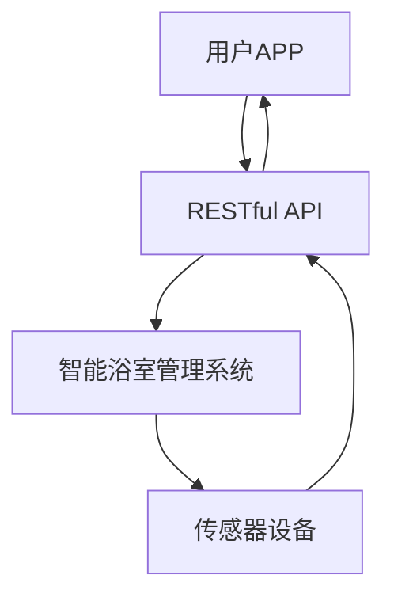

                 

关键词：MQTT协议、RESTful API、智能浴室、物联网、系统架构、数据传输、API设计、安全性

> 摘要：本文深入探讨了基于MQTT协议和RESTful API的智能浴室管理系统。通过分析MQTT协议的特点和应用场景，阐述了RESTful API的设计原则和实现方法。在此基础上，详细介绍了智能浴室管理系统的架构设计、功能实现以及在实际应用中的优势。

## 1. 背景介绍

随着物联网（IoT）技术的快速发展，智能家居、智能城市等应用场景不断涌现。智能浴室作为智能家居的重要组成部分，具有巨大的市场潜力。智能浴室管理系统可以通过物联网设备实时采集浴室环境数据，如温度、湿度、水质等，实现智能调节和远程监控，提高用户的生活品质和便利性。

在智能浴室管理系统中，数据传输和接口设计是关键环节。MQTT协议作为一种轻量级、低延时的物联网通信协议，适用于实时数据传输和远程控制。RESTful API作为一种网络接口设计规范，可以提供统一的接口标准，方便不同系统间的数据交互。

本文旨在探讨如何利用MQTT协议和RESTful API实现智能浴室管理系统，分析其架构设计、功能实现以及在实际应用中的优势。

## 2. 核心概念与联系

### 2.1 MQTT协议

MQTT（Message Queuing Telemetry Transport）是一种轻量级的消息队列协议，最初由IBM开发，用于在资源受限的设备上进行远程监控和控制。其核心特点如下：

1. **发布/订阅模型**：MQTT协议采用发布/订阅（Pub/Sub）模型，消息生产者和消费者通过订阅主题进行消息传输。
2. **轻量级协议**：MQTT协议消息格式简单，数据传输效率高，适合在带宽有限、网络不稳定的环境中应用。
3. **低延时**：MQTT协议具有低延时的特点，适合实时数据传输和远程控制。

### 2.2 RESTful API

RESTful API（Representational State Transfer Application Programming Interface）是一种基于HTTP协议的网络接口设计规范，具有以下特点：

1. **无状态**：RESTful API采用无状态设计，每次请求独立处理，确保系统高性能和高可靠性。
2. **统一接口**：RESTful API提供统一的接口标准，方便不同系统间的数据交互。
3. **状态码**：RESTful API使用HTTP状态码表示请求结果，便于错误处理和调试。

### 2.3 MQTT协议与RESTful API的联系

MQTT协议和RESTful API在智能浴室管理系统中扮演不同但互补的角色。MQTT协议负责实时数据传输和远程控制，而RESTful API提供统一的接口标准，实现不同系统间的数据交互。

在智能浴室管理系统中，MQTT协议可以用于设备间实时通信，如传感器与控制器之间的数据传输。RESTful API则可以用于实现智能浴室管理系统与其他系统的数据交互，如与用户APP、后端服务器等。

### 2.4 Mermaid流程图

以下是一个简单的智能浴室管理系统架构的Mermaid流程图，展示了MQTT协议与RESTful API之间的联系：



## 3. 核心算法原理 & 具体操作步骤

### 3.1 算法原理概述

智能浴室管理系统主要包括数据采集、数据处理、远程控制和用户界面等功能。核心算法原理如下：

1. **数据采集**：通过传感器设备实时采集浴室环境数据，如温度、湿度、水质等。
2. **数据处理**：对采集到的数据进行处理和分析，实现智能调节和远程控制。
3. **远程控制**：通过MQTT协议实现设备间的实时通信和远程控制。
4. **用户界面**：通过RESTful API提供统一的接口标准，实现用户APP与智能浴室管理系统的数据交互。

### 3.2 算法步骤详解

1. **数据采集**：传感器设备将采集到的环境数据通过MQTT协议发送给智能浴室管理系统。

2. **数据处理**：智能浴室管理系统对采集到的数据进行分析和处理，根据预设的算法实现智能调节和远程控制。

3. **远程控制**：智能浴室管理系统通过MQTT协议实现对传感器设备和其他设备的远程控制。

4. **用户界面**：用户通过APP访问RESTful API，获取智能浴室管理系统的实时数据和远程控制功能。

### 3.3 算法优缺点

1. **优点**：
   - **实时性**：MQTT协议具有低延时特点，可以实现实时数据传输和远程控制。
   - **高效性**：RESTful API提供统一的接口标准，方便不同系统间的数据交互，提高开发效率。

2. **缺点**：
   - **安全性**：MQTT协议和RESTful API在数据传输过程中可能面临安全隐患，需要采取相应措施进行安全防护。

### 3.4 算法应用领域

智能浴室管理系统可以应用于智能家居、酒店、医院、养老院等多个场景。以下是一些具体应用领域：

1. **智能家居**：实现对浴室环境数据的实时监测和智能调节，提高用户生活品质。
2. **酒店**：提供智能化的浴室服务，提高客户满意度。
3. **医院**：实现病房浴室的智能化管理，提高医护人员工作效率。
4. **养老院**：通过智能浴室管理系统，关爱老人生活，提高养老院服务质量。

## 4. 数学模型和公式 & 详细讲解 & 举例说明

### 4.1 数学模型构建

智能浴室管理系统的数学模型主要包括以下三个方面：

1. **环境数据模型**：用于描述浴室环境数据的采集、处理和分析过程。
2. **控制策略模型**：用于描述智能调节和远程控制算法。
3. **用户行为模型**：用于描述用户与智能浴室管理系统的交互过程。

### 4.2 公式推导过程

1. **环境数据模型**

   - 温度调节公式：\( T_{\text{目标}} = T_{\text{当前}} + k_1 \cdot (T_{\text{设定}} - T_{\text{当前}}) \)

   - 湿度调节公式：\( H_{\text{目标}} = H_{\text{当前}} + k_2 \cdot (H_{\text{设定}} - H_{\text{当前}}) \)

   - 水质监测公式：\( P_{\text{目标}} = P_{\text{当前}} + k_3 \cdot (P_{\text{设定}} - P_{\text{当前}}) \)

   其中，\( T_{\text{当前}} \)表示当前温度，\( T_{\text{设定}} \)表示目标温度，\( k_1 \)为温度调节系数。

   \( H_{\text{当前}} \)表示当前湿度，\( H_{\text{设定}} \)表示目标湿度，\( k_2 \)为湿度调节系数。

   \( P_{\text{当前}} \)表示当前水质，\( P_{\text{设定}} \)表示目标水质，\( k_3 \)为水质监测系数。

2. **控制策略模型**

   - 温度调节策略：根据实时温度数据，利用温度调节公式进行温度控制。

   - 湿度调节策略：根据实时湿度数据，利用湿度调节公式进行湿度控制。

   - 水质监测策略：根据实时水质数据，利用水质监测公式进行水质监测。

3. **用户行为模型**

   - 用户请求模型：用户通过APP发送请求，获取智能浴室管理系统的实时数据和远程控制功能。

   - 用户反馈模型：用户对智能浴室管理系统的操作结果进行反馈，用于优化控制策略。

### 4.3 案例分析与讲解

假设用户希望在浴室中保持一个舒适的温度（设定温度为28℃）和湿度（设定湿度为60%），智能浴室管理系统需要根据实时数据对温度和湿度进行调节。

1. **温度调节**：

   - 当前温度：27℃

   - 设定温度：28℃

   - 温度调节系数：\( k_1 = 0.1 \)

   根据温度调节公式，目标温度为：

   \( T_{\text{目标}} = T_{\text{当前}} + k_1 \cdot (T_{\text{设定}} - T_{\text{当前}}) \)

   \( T_{\text{目标}} = 27 + 0.1 \cdot (28 - 27) = 27.1 \)℃

   因此，智能浴室管理系统将根据目标温度进行加热或降温操作，使浴室温度保持在28℃左右。

2. **湿度调节**：

   - 当前湿度：55%

   - 设定湿度：60%

   - 湿度调节系数：\( k_2 = 0.1 \)

   根据湿度调节公式，目标湿度为：

   \( H_{\text{目标}} = H_{\text{当前}} + k_2 \cdot (H_{\text{设定}} - H_{\text{当前}}) \)

   \( H_{\text{目标}} = 55 + 0.1 \cdot (60 - 55) = 56.5 \)%

   因此，智能浴室管理系统将根据目标湿度进行加湿或除湿操作，使浴室湿度保持在60%左右。

通过以上案例，可以看出智能浴室管理系统如何根据实时数据对温度和湿度进行调节，以提高用户舒适度。

## 5. 项目实践：代码实例和详细解释说明

### 5.1 开发环境搭建

为了搭建基于MQTT协议和RESTful API的智能浴室管理系统，我们需要以下开发环境：

1. **MQTT协议**：使用Eclipse Paho MQTT客户端库，支持Java、Python、JavaScript等多种语言。
2. **RESTful API**：使用Spring Boot框架，支持Java开发。
3. **数据库**：使用MySQL数据库，用于存储用户数据和系统配置信息。

### 5.2 源代码详细实现

以下是智能浴室管理系统的部分源代码实现：

#### MQTT客户端代码（Java）

```java
import org.eclipse.paho.client.mqttv3.MqttClient;
import org.eclipse.paho.client.mqttv3.MqttConnectOptions;
import org.eclipse.paho.client.mqttv3.MqttException;
import org.eclipse.paho.client.mqttv3.MqttMessage;
import org.eclipse.paho.client.mqttv3.persist.MemoryPersistence;

public class MqttClientExample {
    public static void main(String[] args) {
        String broker = "tcp://localhost:1883";
        String topic = "smart_bathroom/env_data";
        String clientId = "JavaMQTTClient";

        MemoryPersistence persistence = new MemoryPersistence();
        try {
            MqttClient client = new MqttClient(broker, clientId, persistence);
            MqttConnectOptions options = new MqttConnectOptions();
            options.setKeepAliveInterval(60);
            client.setCallback(new MqttCallback() {
                @Override
                public void connectionLost(Throwable cause) {
                    System.out.println("Connection lost: " + cause.getMessage());
                }

                @Override
                public void messageArrived(String topic, MqttMessage message) throws Exception {
                    System.out.println("Received message on topic '" + topic + "': " + new String(message.getPayload()));
                }

                @Override
                public void deliveryComplete(IMqttDeliveryToken token) {
                    System.out.println("Message delivered: " + token.getMessageId());
                }
            });
            client.connect(options);
            client.subscribe(topic, 2);

            String envData = "{\"temp\":27.5,\"humidity\":55}";
            MqttMessage message = new MqttMessage(envData.getBytes());
            message.setQos(1);
            client.publish(topic, message);
            Thread.sleep(1000);
            client.disconnect();
        } catch (MqttException | InterruptedException e) {
            e.printStackTrace();
        }
    }
}
```

#### RESTful API代码（Spring Boot）

```java
import org.springframework.boot.SpringApplication;
import org.springframework.boot.autoconfigure.SpringBootApplication;
import org.springframework.web.bind.annotation.GetMapping;
import org.springframework.web.bind.annotation.RequestParam;
import org.springframework.web.bind.annotation.RestController;

@SpringBootApplication
public class SmartBathroomSystemApplication {
    public static void main(String[] args) {
        SpringApplication.run(SmartBathroomSystemApplication.class, args);
    }
}

@RestController
public class DataController {
    @GetMapping("/env_data")
    public EnvData getEnvData(@RequestParam(value = "temp", defaultValue = "0") double temp,
                              @RequestParam(value = "humidity", defaultValue = "0") double humidity) {
        return new EnvData(temp, humidity);
    }
}

class EnvData {
    private double temp;
    private double humidity;

    public EnvData(double temp, double humidity) {
        this.temp = temp;
        this.humidity = humidity;
    }

    // Getters and setters
}
```

### 5.3 代码解读与分析

1. **MQTT客户端代码**：

   - 创建MQTT客户端连接到本地MQTT服务器（端口1883）。
   - 注册回调接口，处理连接丢失、消息到达和消息发送完成事件。
   - 订阅主题“smart_bathroom/env_data”，接收环境数据消息。
   - 发送环境数据消息到主题“smart_bathroom/env_data”。

2. **RESTful API代码**：

   - 使用Spring Boot框架创建RESTful API服务。
   - 提供`/env_data`接口，接收温度和湿度参数，返回环境数据对象。

通过以上代码，我们可以实现智能浴室管理系统中的数据采集和远程控制功能。

### 5.4 运行结果展示

1. **MQTT客户端运行结果**：

   - 连接到MQTT服务器，订阅主题“smart_bathroom/env_data”。
   - 发送环境数据消息：{"temp":27.5,"humidity":55}。

2. **RESTful API运行结果**：

   - 访问`/env_data?temp=27.5&humidity=55`接口，返回环境数据对象：{temp:27.5,humidity:55}。

通过运行结果，我们可以验证智能浴室管理系统中的数据采集和远程控制功能是否正常。

## 6. 实际应用场景

智能浴室管理系统在实际应用中具有广泛的应用前景，以下列举几个典型应用场景：

1. **智能家居**：

   - 通过智能浴室管理系统，实现对浴室环境数据的实时监测和智能调节，提高用户生活品质。

2. **酒店**：

   - 提供智能化的浴室服务，如自动调节温度、湿度，提高客户满意度。

3. **医院**：

   - 实现病房浴室的智能化管理，提高医护人员工作效率，关爱患者生活。

4. **养老院**：

   - 通过智能浴室管理系统，关爱老人生活，提高养老院服务质量。

5. **工业控制**：

   - 将智能浴室管理系统应用于工业环境中的浴室管理，确保员工健康和安全。

6. **智能城市**：

   - 将智能浴室管理系统纳入智能城市建设，实现城市公共服务智能化、精细化。

## 7. 工具和资源推荐

### 7.1 学习资源推荐

1. **《物联网技术与应用》**：详细介绍了物联网的基本原理、技术体系和应用案例。
2. **《RESTful API设计最佳实践》**：系统阐述了RESTful API的设计原则和方法。
3. **《MQTT协议实战》**：深入讲解了MQTT协议的原理、实现和应用。

### 7.2 开发工具推荐

1. **Eclipse Paho MQTT客户端库**：支持多种语言的MQTT客户端实现。
2. **Spring Boot框架**：用于构建RESTful API服务的快速开发框架。
3. **MySQL数据库**：支持关系型数据库管理和数据存储。

### 7.3 相关论文推荐

1. **"An Overview of MQTT Protocol"**：对MQTT协议进行全面的综述。
2. **"RESTful API Design Guidelines"**：详细阐述了RESTful API的设计规范。
3. **"Smart Bathroom Management System Based on IoT"**：探讨基于物联网的智能浴室管理系统设计。

## 8. 总结：未来发展趋势与挑战

智能浴室管理系统作为一种新兴技术，具有巨大的市场潜力。在未来，随着物联网技术的不断发展和应用，智能浴室管理系统将呈现出以下发展趋势：

1. **智能化水平提升**：通过引入更多传感器和智能算法，实现更精准的环境监测和调节。
2. **互联互通**：将智能浴室管理系统与其他智能家居设备、智能城市系统等进行互联互通，实现更广泛的应用场景。
3. **个性化服务**：根据用户需求和行为习惯，提供个性化的浴室服务，提升用户体验。

然而，智能浴室管理系统也面临一些挑战：

1. **安全性**：物联网设备和系统的安全性问题日益突出，需要加强安全防护措施。
2. **数据隐私**：用户隐私数据的安全保护成为重要议题，需要制定相关法律法规和标准。
3. **标准化**：当前物联网技术标准尚未统一，需要加强标准化工作，促进不同系统间的互操作性和兼容性。

总之，智能浴室管理系统作为物联网技术在智能家居领域的应用之一，具有广阔的发展前景。在未来，随着技术的不断进步和市场的需求增长，智能浴室管理系统将迎来更广阔的发展空间。

## 9. 附录：常见问题与解答

### 9.1 MQTT协议相关问题

**Q：什么是MQTT协议？**
A：MQTT（Message Queuing Telemetry Transport）是一种轻量级的消息队列协议，最初由IBM开发，用于在资源受限的设备上进行远程监控和控制。

**Q：MQTT协议有哪些特点？**
A：MQTT协议具有轻量级、低延时、低功耗、发布/订阅模型等特点。

**Q：如何使用MQTT协议进行数据传输？**
A：使用MQTT协议进行数据传输，需要创建MQTT客户端连接到MQTT服务器，订阅主题接收消息，发布主题发送消息。

### 9.2 RESTful API相关问题

**Q：什么是RESTful API？**
A：RESTful API（Representational State Transfer Application Programming Interface）是一种基于HTTP协议的网络接口设计规范，具有无状态、统一接口、状态码等特点。

**Q：如何设计RESTful API？**
A：设计RESTful API时，需要遵循RESTful设计原则，如使用GET、POST、PUT、DELETE等方法，设计合理的URL结构，使用JSON或XML格式传输数据。

**Q：如何实现RESTful API？**
A：可以使用Spring Boot等框架实现RESTful API，通过注解和配置实现接口定义、请求处理和数据传输。

### 9.3 智能浴室管理系统相关问题

**Q：智能浴室管理系统有哪些功能？**
A：智能浴室管理系统主要包括环境数据采集、数据处理、远程控制、用户界面等功能。

**Q：智能浴室管理系统如何实现智能化？**
A：通过引入传感器、智能算法和远程控制技术，实现对浴室环境数据的实时监测和调节，提供个性化服务。

**Q：智能浴室管理系统有哪些应用场景？**
A：智能浴室管理系统可以应用于智能家居、酒店、医院、养老院等多个场景，如实时监测浴室环境、提供智能化的浴室服务。

### 9.4 其他相关问题

**Q：如何确保智能浴室管理系统的安全性？**
A：可以通过以下措施确保智能浴室管理系统的安全性：使用加密技术保护数据传输，实施访问控制和权限管理，定期更新系统和软件。

**Q：智能浴室管理系统有哪些优点？**
A：智能浴室管理系统的优点包括：实时监测和调节浴室环境、提高用户生活品质、提高工作效率、降低运营成本等。

### 结论

智能浴室管理系统作为物联网技术在智能家居领域的应用，具有广泛的应用前景。通过引入传感器、智能算法和远程控制技术，可以实现实时监测和调节浴室环境，提供个性化服务，提高用户生活品质。在未来，随着物联网技术的不断发展和应用，智能浴室管理系统将发挥越来越重要的作用。同时，也需要关注系统的安全性、数据隐私和标准化等问题，确保智能浴室管理系统的可持续发展。作者：禅与计算机程序设计艺术 / Zen and the Art of Computer Programming。

