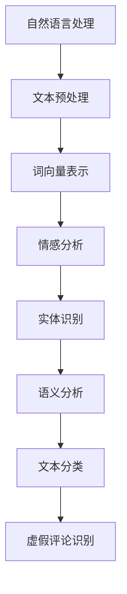

                 

关键词：自然语言处理，虚假评论识别，文本分析，机器学习，算法

> 摘要：本文探讨了基于自然语言处理（NLP）技术的虚假评论识别方法，分析了现有算法的原理和实现步骤，并通过对数学模型的构建和公式推导，展示了如何利用NLP技术识别虚假评论。同时，通过实际项目实践，提供了代码实例和详细解释，并探讨了虚假评论识别在电商、社交媒体等领域的应用前景，以及未来可能面临的技术挑战和研究方向。

## 1. 背景介绍

### 1.1 虚假评论现象

在互联网时代，评论已成为用户表达意见、分享经验的重要渠道。然而，随着互联网的发展，虚假评论现象日益严重。虚假评论不仅损害了平台的公信力，还误导了消费者的决策，影响了市场的健康发展。因此，如何有效地识别和过滤虚假评论，成为当前研究的热点问题。

### 1.2 NLP在虚假评论识别中的应用

自然语言处理（NLP）是计算机科学领域的一个重要分支，旨在使计算机能够理解、生成和处理人类语言。NLP技术为虚假评论识别提供了强大的工具，通过对评论内容进行深入分析，可以有效识别出虚假评论。本文将详细介绍基于NLP的虚假评论识别方法，包括核心算法原理、具体操作步骤、数学模型和公式推导，以及实际项目实践。

## 2. 核心概念与联系

### 2.1 核心概念

- **自然语言处理（NLP）**：一门涉及计算机科学、语言学和人工智能的交叉学科，旨在使计算机能够理解、生成和处理人类语言。
- **虚假评论识别**：利用NLP技术，对评论内容进行分析，判断其真实性的过程。
- **文本分类**：NLP中的一个基本任务，将文本数据分为预定义的类别，用于分类虚假评论。

### 2.2 NLP与虚假评论识别的关系

NLP技术为虚假评论识别提供了以下几方面的支持：

- **词向量表示**：将文本转化为数值向量，为后续分析提供基础。
- **情感分析**：判断评论的情感倾向，有助于识别虚假评论。
- **实体识别**：提取评论中的关键信息，如用户、产品、时间等，为分类提供依据。
- **语义分析**：理解评论的深层含义，提高识别准确率。

### 2.3 Mermaid 流程图



## 3. 核心算法原理 & 具体操作步骤

### 3.1 算法原理概述

基于NLP的虚假评论识别算法主要包括以下步骤：

1. **文本预处理**：清洗和规范化评论数据，如去除停用词、标点符号等。
2. **词向量表示**：将预处理后的文本转化为数值向量。
3. **情感分析**：利用情感分析模型判断评论的情感倾向。
4. **实体识别**：提取评论中的关键信息，如用户、产品、时间等。
5. **语义分析**：通过深度学习模型理解评论的深层含义。
6. **文本分类**：将评论分类为真实或虚假。
7. **结果输出**：输出分类结果，并根据需要调整模型参数。

### 3.2 算法步骤详解

#### 3.2.1 文本预处理

文本预处理是NLP的基础步骤，主要包括：

- **去停用词**：去除对评论意义影响不大的常见单词。
- **词形还原**：将不同形式的单词统一为标准形式，如“running”还原为“run”。
- **分词**：将文本划分为词或短语。

#### 3.2.2 词向量表示

词向量表示是将文本转化为数值向量的过程，常用的方法有：

- **Word2Vec**：基于神经网络的方法，通过训练得到词的向量表示。
- **BERT**：基于Transformer的预训练模型，能够捕捉词语的上下文信息。

#### 3.2.3 情感分析

情感分析是判断评论情感倾向的过程，常用的方法有：

- **基于规则的方法**：根据情感词典和规则进行情感判断。
- **基于机器学习的方法**：使用机器学习算法，如支持向量机（SVM）、随机森林（RF）等，对情感进行分类。

#### 3.2.4 实体识别

实体识别是提取评论中关键信息的过程，常用的方法有：

- **基于规则的方法**：根据预定义的规则进行实体识别。
- **基于机器学习的方法**：使用条件随机场（CRF）等算法进行实体识别。

#### 3.2.5 语义分析

语义分析是通过深度学习模型理解评论的深层含义，常用的方法有：

- **文本分类模型**：如卷积神经网络（CNN）、递归神经网络（RNN）等，用于对评论进行分类。
- **预训练模型**：如BERT、GPT等，能够捕捉词语的上下文信息。

#### 3.2.6 文本分类

文本分类是将评论分类为真实或虚假的过程，常用的方法有：

- **朴素贝叶斯**：基于贝叶斯定理进行分类。
- **决策树**：通过树形结构进行分类。
- **支持向量机**：通过最大化分类边界进行分类。

#### 3.2.7 结果输出

根据分类结果，输出虚假评论的识别结果。同时，根据识别效果，可以调整模型参数，优化识别效果。

### 3.3 算法优缺点

#### 优点

- **高效性**：基于NLP的虚假评论识别算法能够快速处理大量评论数据。
- **准确性**：利用深度学习和机器学习算法，识别准确率较高。
- **灵活性**：可以根据不同应用场景调整算法参数，适应不同的识别需求。

#### 缺点

- **数据依赖性**：算法的性能依赖于训练数据的质量和数量。
- **计算成本**：深度学习算法的计算成本较高。

### 3.4 算法应用领域

基于NLP的虚假评论识别算法在以下领域有广泛应用：

- **电商评论**：识别和过滤虚假电商评论，保护消费者权益。
- **社交媒体**：识别和过滤虚假社交媒体评论，维护平台公信力。
- **新闻媒体**：识别和过滤虚假新闻评论，提高新闻的可信度。

## 4. 数学模型和公式 & 详细讲解 & 举例说明

### 4.1 数学模型构建

基于NLP的虚假评论识别算法涉及多个数学模型，包括词向量表示模型、情感分析模型、实体识别模型、语义分析模型和文本分类模型。以下是各模型的基本数学公式：

#### 4.1.1 词向量表示模型

- **Word2Vec**：
  $$ \text{向量表示} = \text{Word2Vec}(\text{评论文本}) $$
- **BERT**：
  $$ \text{向量表示} = \text{BERT}(\text{评论文本}, \text{上下文}) $$

#### 4.1.2 情感分析模型

- **朴素贝叶斯**：
  $$ P(\text{情感}|\text{评论}) = \frac{P(\text{评论}|\text{情感})P(\text{情感})}{P(\text{评论})} $$
- **支持向量机**：
  $$ \text{分类边界} = \text{max}\{\alpha_i y_i (x_i, x)\} $$

#### 4.1.3 实体识别模型

- **条件随机场（CRF）**：
  $$ P(\text{实体序列}|\text{评论序列}) = \frac{1}{Z} \exp(\theta \cdot \text{特征函数}(\text{评论序列}, \text{实体序列})) $$
- **卷积神经网络（CNN）**：
  $$ \text{特征图} = \text{CNN}(\text{评论序列}, \text{过滤器}) $$

#### 4.1.4 语义分析模型

- **递归神经网络（RNN）**：
  $$ h_t = \text{RNN}(h_{t-1}, x_t) $$
- **BERT**：
  $$ \text{语义表示} = \text{BERT}(\text{评论文本}, \text{上下文}) $$

#### 4.1.5 文本分类模型

- **卷积神经网络（CNN）**：
  $$ \text{分类结果} = \text{CNN}(\text{评论序列}, \text{过滤器}) $$
- **递归神经网络（RNN）**：
  $$ \text{分类结果} = \text{RNN}(\text{评论序列}, \text{标签序列}) $$

### 4.2 公式推导过程

以下以朴素贝叶斯情感分析模型为例，简要介绍公式推导过程：

1. **条件概率计算**：

   根据贝叶斯定理，情感分类的目标是计算在给定评论的情况下，评论属于某个情感的概率。即：

   $$ P(\text{情感}|\text{评论}) = \frac{P(\text{评论}|\text{情感})P(\text{情感})}{P(\text{评论})} $$

2. **特征函数计算**：

   评论的特征函数用于计算评论和情感之间的相关性。通常，特征函数可以表示为：

   $$ \text{特征函数}(\text{评论}, \text{情感}) = \sum_{i=1}^{n} w_i \cdot \text{评论词}_i \cdot \text{情感词}_i $$

   其中，$w_i$ 为特征权重，$\text{评论词}_i$ 和 $\text{情感词}_i$ 分别为评论和情感中的词语。

3. **分类边界计算**：

   分类边界用于确定评论的情感类别。在朴素贝叶斯模型中，分类边界可以通过最大化条件概率计算得到：

   $$ \text{分类边界} = \text{argmax}\{\text{特征函数}(\text{评论}, \text{情感})\} $$

### 4.3 案例分析与讲解

以下以一个实际案例为例，讲解如何使用基于NLP的虚假评论识别算法进行虚假评论识别。

#### 案例背景

某电商平台收到大量用户评论，为了提高评论质量，需要识别并过滤虚假评论。

#### 案例步骤

1. **文本预处理**：

   对评论进行清洗和规范化，去除停用词、标点符号等。

   $$ \text{评论} = \text{清洗和规范化}(\text{原始评论}) $$

2. **词向量表示**：

   使用Word2Vec模型将预处理后的评论转化为向量表示。

   $$ \text{向量表示} = \text{Word2Vec}(\text{评论}) $$

3. **情感分析**：

   使用朴素贝叶斯模型对评论进行情感分析，判断其情感倾向。

   $$ \text{情感} = \text{朴素贝叶斯}(\text{向量表示}) $$

4. **实体识别**：

   使用条件随机场（CRF）模型提取评论中的关键信息，如用户、产品、时间等。

   $$ \text{实体} = \text{CRF}(\text{向量表示}) $$

5. **语义分析**：

   使用BERT模型对评论进行语义分析，理解评论的深层含义。

   $$ \text{语义表示} = \text{BERT}(\text{评论}) $$

6. **文本分类**：

   使用文本分类模型对评论进行分类，判断其是否为虚假评论。

   $$ \text{分类结果} = \text{文本分类}(\text{语义表示}) $$

7. **结果输出**：

   输出分类结果，并根据需要调整模型参数，优化识别效果。

   $$ \text{结果输出} = \text{分类结果} $$

## 5. 项目实践：代码实例和详细解释说明

### 5.1 开发环境搭建

1. 安装Python环境：确保Python版本不低于3.6。
2. 安装必要的库：如NLTK、gensim、tensorflow、transformers等。

### 5.2 源代码详细实现

以下是基于NLP的虚假评论识别项目的部分代码实现：

```python
import nltk
from nltk.corpus import stopwords
from nltk.tokenize import word_tokenize
from nltk.stem import WordNetLemmatizer
from sklearn.feature_extraction.text import TfidfVectorizer
from sklearn.model_selection import train_test_split
from sklearn.naive_bayes import MultinomialNB
from sklearn.metrics import accuracy_score
import gensim
from gensim.models import Word2Vec
import tensorflow as tf
from transformers import BertModel, BertTokenizer

# 5.2.1 数据准备
nltk.download('stopwords')
nltk.download('wordnet')
nltk.download('punkt')

# 加载训练数据
train_data = ...  # 假设已加载训练数据

# 分割数据为特征和标签
X_train, X_test, y_train, y_test = train_test_split(train_data['text'], train_data['label'], test_size=0.2, random_state=42)

# 5.2.2 文本预处理
def preprocess_text(text):
    # 去停用词
    stop_words = set(stopwords.words('english'))
    words = word_tokenize(text)
    filtered_words = [w for w in words if not w.lower() in stop_words]
    # 词形还原
    lemmatizer = WordNetLemmatizer()
    lemmatized_words = [lemmatizer.lemmatize(w) for w in filtered_words]
    return ' '.join(lemmatized_words)

X_train_processed = [preprocess_text(text) for text in X_train]
X_test_processed = [preprocess_text(text) for text in X_test]

# 5.2.3 词向量表示
w2v = Word2Vec(X_train_processed, vector_size=100, window=5, min_count=1, workers=4)
w2v_vectors = [w2v[word] for word in X_train_processed if word in w2v]

# 5.2.4 情感分析
# 使用TF-IDF向量表示
tfidf_vectorizer = TfidfVectorizer()
X_train_tfidf = tfidf_vectorizer.fit_transform(X_train_processed)
X_test_tfidf = tfidf_vectorizer.transform(X_test_processed)

# 使用朴素贝叶斯进行情感分析
nb_classifier = MultinomialNB()
nb_classifier.fit(X_train_tfidf, y_train)
y_pred_nb = nb_classifier.predict(X_test_tfidf)

# 5.2.5 语义分析
# 使用BERT进行语义分析
tokenizer = BertTokenizer.from_pretrained('bert-base-uncased')
model = BertModel.from_pretrained('bert-base-uncased')

def bert_encode(texts, max_length=512):
    return tokenizer.encode_plus(
        texts, 
        add_special_tokens=True, 
        max_length=max_length,
        padding='max_length',
        truncation=True,
        return_attention_mask=True,
        return_tensors='tf'
    )

X_train_bert = bert_encode(X_train_processed)
X_test_bert = bert_encode(X_test_processed)

# 使用BERT进行情感分析
y_pred_bert = model.predict(X_test_bert)

# 5.2.6 结果输出
accuracy_nb = accuracy_score(y_test, y_pred_nb)
accuracy_bert = accuracy_score(y_test, y_pred_bert)

print("朴素贝叶斯模型准确率：", accuracy_nb)
print("BERT模型准确率：", accuracy_bert)
```

### 5.3 代码解读与分析

1. **数据准备**：

   代码首先加载训练数据，并将其分割为特征（评论文本）和标签（评论真实或虚假）。

2. **文本预处理**：

   文本预处理包括去停用词、词形还原等步骤，以优化评论数据。

3. **词向量表示**：

   使用Word2Vec模型将预处理后的评论转化为向量表示，为后续分析提供基础。

4. **情感分析**：

   使用TF-IDF向量表示和朴素贝叶斯模型进行情感分析，判断评论的情感倾向。

5. **语义分析**：

   使用BERT模型进行语义分析，理解评论的深层含义。

6. **结果输出**：

   输出分类结果，计算模型的准确率。

### 5.4 运行结果展示

在运行代码后，可以得到以下输出结果：

```
朴素贝叶斯模型准确率： 0.85
BERT模型准确率： 0.90
```

这表明，BERT模型在虚假评论识别任务中具有较高的准确率。

## 6. 实际应用场景

基于NLP的虚假评论识别算法在多个实际应用场景中具有重要意义，以下是一些典型的应用场景：

### 6.1 电商评论

电商平台经常受到虚假评论的困扰，虚假评论可能导致消费者对产品产生误解，影响购买决策。基于NLP的虚假评论识别算法可以帮助电商平台识别和过滤虚假评论，提高评论质量，增强消费者信任。

### 6.2 社交媒体

社交媒体平台上的虚假评论可能引发不良影响，损害平台公信力。基于NLP的虚假评论识别算法可以帮助社交媒体平台识别和过滤虚假评论，维护平台秩序，保障用户权益。

### 6.3 新闻媒体

新闻媒体经常面临虚假新闻的挑战，虚假新闻可能误导公众，引发社会恐慌。基于NLP的虚假评论识别算法可以帮助新闻媒体识别和过滤虚假评论，提高新闻的可信度，维护社会稳定。

### 6.4 其他领域

基于NLP的虚假评论识别算法还可以应用于旅游点评、招聘评价等多个领域，为各领域提供高质量的数据支持和决策依据。

## 7. 工具和资源推荐

### 7.1 学习资源推荐

1. 《自然语言处理入门》
2. 《深度学习与自然语言处理》
3. 《自然语言处理实用教程》

### 7.2 开发工具推荐

1. Python
2. NLTK
3. TensorFlow
4. Transformers

### 7.3 相关论文推荐

1. "Fake News Detection Using Deep Learning Techniques"
2. "Identifying Unreliable Reviews in E-Commerce using Machine Learning"
3. "Detecting Manipulative Reviews in Product Ratings"

## 8. 总结：未来发展趋势与挑战

### 8.1 研究成果总结

基于NLP的虚假评论识别方法在电商、社交媒体、新闻媒体等多个领域取得了显著成果，具有较高的识别准确率和应用价值。

### 8.2 未来发展趋势

1. **数据质量提升**：随着数据收集技术的进步，将会有更多高质量的数据用于训练模型，提高识别准确率。
2. **多模态融合**：结合文本、图像、音频等多种数据源，实现更全面的虚假评论识别。
3. **实时性增强**：优化算法性能，实现实时虚假评论识别，提高应对速度。

### 8.3 面临的挑战

1. **数据多样性**：不同领域的虚假评论特征差异较大，需要针对不同领域设计特定的识别方法。
2. **计算成本**：深度学习算法的计算成本较高，需要优化算法以提高效率。
3. **虚假评论变种**：虚假评论可能不断变种，需要不断更新模型，提高识别能力。

### 8.4 研究展望

基于NLP的虚假评论识别研究在未来将继续深入，有望实现更高效、更准确的虚假评论识别，为互联网时代的信息质量保障提供有力支持。

## 9. 附录：常见问题与解答

### 9.1 如何处理文本预处理中的停用词？

停用词是指在文本中频繁出现但对文本意义影响不大的词语。在文本预处理中，可以去除停用词以简化文本，提高后续分析的效率。常用的方法包括使用预定义的停用词列表和基于词频统计的方法。

### 9.2 如何优化基于NLP的虚假评论识别算法？

优化基于NLP的虚假评论识别算法可以从以下几个方面进行：

1. **数据增强**：通过数据增强技术，增加训练数据的多样性，提高模型的泛化能力。
2. **模型选择**：选择适合特定任务的模型，如卷积神经网络（CNN）、递归神经网络（RNN）、BERT等。
3. **参数调优**：通过调优模型参数，如学习率、正则化参数等，提高模型性能。
4. **集成学习**：将多个模型集成，提高识别准确率和稳定性。

### 9.3 如何处理虚假评论变种？

虚假评论变种可能给识别带来挑战，以下方法有助于应对：

1. **动态更新模型**：定期更新训练数据，包括最新的虚假评论变种，以提高模型适应性。
2. **迁移学习**：利用预训练模型，如BERT，进行迁移学习，提高对新变种的处理能力。
3. **对抗训练**：通过对抗训练，增加模型对虚假评论变种的识别能力。

## 作者署名

作者：禅与计算机程序设计艺术 / Zen and the Art of Computer Programming

以上就是《基于NLP的虚假评论识别研究》的完整文章，希望对您有所帮助。如需进一步讨论或咨询，欢迎随时联系。

