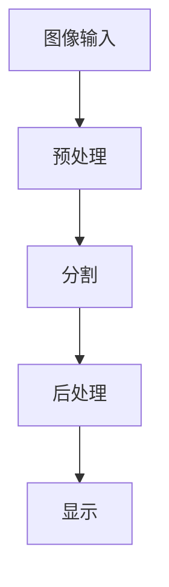

                 

 **关键词：**OpenCV、图像分割、系统设计、代码实现、算法应用

**摘要：**本文深入探讨了基于OpenCV的图像分割系统设计与实现。首先介绍了图像分割的基本概念和重要性，然后详细描述了系统的架构设计和核心算法原理，包括阈值分割、边缘检测等。接着，通过具体实例展示了如何使用OpenCV库实现图像分割，并对代码进行了详细解释。最后，本文讨论了图像分割在实际应用中的场景和未来发展趋势。

## 1. 背景介绍

图像分割是计算机视觉领域中的基本问题之一，它在图像识别、目标检测、图像增强等应用中具有广泛的应用价值。图像分割的主要目标是自动地将图像划分为多个区域，每个区域代表图像中的不同对象或背景。OpenCV（Open Source Computer Vision Library）是一个强大的计算机视觉库，它提供了丰富的图像处理和计算机视觉功能，可以用于实现图像分割。

随着深度学习技术的发展，图像分割方法逐渐从传统的基于规则和阈值的方法转向基于深度学习的算法，如卷积神经网络（CNN）。然而，传统的图像分割方法在处理某些复杂场景时仍然具有优势，且其实现相对简单，适用于一些实时性要求较高的应用场景。

本文旨在设计和实现一个基于OpenCV的图像分割系统，通过详细描述系统的架构设计、核心算法原理以及具体实现过程，为图像分割的研究和应用提供参考。

## 2. 核心概念与联系

### 2.1. 图像分割的定义

图像分割是将图像分割成多个区域或对象的过程，这些区域或对象在某种意义上具有相似性，如颜色、亮度或纹理等。图像分割的目的是为了更好地理解图像内容，为后续的图像处理和分析提供基础。

### 2.2. OpenCV简介

OpenCV是一个开源的计算机视觉库，它由Intel开发，并在2014年被Facebook收购。OpenCV支持多种编程语言，包括C++、Python、Java和MATLAB，提供了丰富的图像处理和计算机视觉算法，适用于各种操作系统，如Windows、Linux和macOS。

### 2.3. 系统架构设计

系统的架构设计如图1所示，主要包括以下几个模块：

- **图像输入模块**：负责接收用户输入的图像数据。
- **预处理模块**：对图像进行灰度化、滤波等预处理操作。
- **分割模块**：实现图像分割的核心算法，包括阈值分割、边缘检测等。
- **后处理模块**：对分割结果进行优化，如去除噪声、合并连通区域等。
- **显示模块**：将分割结果展示给用户。


### 2.4. Mermaid 流程图

以下是一个简化的Mermaid流程图，展示了系统的主要流程：



## 3. 核心算法原理 & 具体操作步骤

### 3.1. 算法原理概述

图像分割算法主要分为基于阈值的方法和基于边缘检测的方法。

- **阈值分割**：根据图像的灰度值分布，将图像转换为二值图像，即将像素点分为两个类别：前景和背景。常用的阈值分割方法包括全局阈值分割和局部阈值分割。
- **边缘检测**：通过检测图像中像素点的灰度变化，找到图像的边缘。常见的边缘检测算法包括Canny边缘检测、Sobel算子和Laplacian算子等。

### 3.2. 算法步骤详解

#### 3.2.1. 阈值分割

阈值分割的基本步骤如下：

1. **灰度化图像**：将彩色图像转换为灰度图像。
2. **计算直方图**：计算图像的灰度直方图，以确定最佳阈值。
3. **阈值处理**：根据设定的阈值，将图像像素点分为前景和背景。

#### 3.2.2. 边缘检测

边缘检测的基本步骤如下：

1. **滤波**：为了去除噪声，首先对图像进行滤波处理。
2. **梯度计算**：计算图像的梯度，包括水平和垂直方向。
3. **边缘提取**：根据梯度值，提取图像的边缘。

### 3.3. 算法优缺点

- **阈值分割**：
  - **优点**：实现简单，计算速度快，对噪声敏感。
  - **缺点**：可能产生大量噪声点，无法处理复杂场景。
- **边缘检测**：
  - **优点**：可以检测出图像的边缘，对噪声具有一定的鲁棒性。
  - **缺点**：可能丢失细节信息，对复杂场景处理效果不佳。

### 3.4. 算法应用领域

图像分割算法在计算机视觉领域的应用非常广泛，包括：

- **目标检测**：用于识别图像中的目标对象。
- **图像识别**：将图像分割成不同的区域，便于识别和分类。
- **图像增强**：通过分割提取出感兴趣的区域，进行增强处理。
- **医学图像处理**：用于诊断和分析医学图像。

## 4. 数学模型和公式 & 详细讲解 & 举例说明

### 4.1. 数学模型构建

图像分割的数学模型可以表示为：

$$
S(I) = R(I)
$$

其中，$S(I)$ 表示分割后的图像，$R(I)$ 表示分割的规则或算法。

### 4.2. 公式推导过程

以全局阈值分割为例，其公式推导过程如下：

1. **灰度化图像**：
   $$
   G(x, y) = 0.299 \cdot R(x, y) + 0.587 \cdot G(x, y) + 0.114 \cdot B(x, y)
   $$
   
2. **计算直方图**：
   $$
   H(g) = \sum_{i=0}^{255} f_i
   $$
   
   其中，$f_i$ 表示灰度值为 $i$ 的像素点数量。

3. **阈值处理**：
   $$
   T = \arg\max_{t} \sum_{i=t}^{255} f_i - \sum_{i=0}^{t-1} f_i
   $$

### 4.3. 案例分析与讲解

以下是一个简单的阈值分割实例：

```python
import cv2
import numpy as np

# 读取图像
image = cv2.imread('example.jpg', cv2.IMREAD_GRAYSCALE)

# 计算直方图
hist = cv2.calcHist([image], [0], None, [256], [0, 256])

# 查找最佳阈值
threshold = 0
for i in range(1, 256):
    if hist[i] > 0.5 * np.sum(hist):
        threshold = i
        break

# 阈值分割
result = cv2.threshold(image, threshold, 255, cv2.THRESH_BINARY)

# 显示结果
cv2.imshow('Threshold Segmentation', result)
cv2.waitKey(0)
cv2.destroyAllWindows()
```

## 5. 项目实践：代码实例和详细解释说明

### 5.1. 开发环境搭建

为了实现基于OpenCV的图像分割系统，需要搭建以下开发环境：

- **操作系统**：Windows、Linux或macOS
- **编程语言**：Python
- **OpenCV版本**：3.4.13.48
- **Python版本**：3.8.10

可以通过以下命令安装OpenCV：

```bash
pip install opencv-python
```

### 5.2. 源代码详细实现

以下是一个简单的图像分割代码实例：

```python
import cv2
import numpy as np

def threshold_segmentation(image_path):
    # 读取图像
    image = cv2.imread(image_path, cv2.IMREAD_GRAYSCALE)

    # 计算直方图
    hist = cv2.calcHist([image], [0], None, [256], [0, 256])

    # 查找最佳阈值
    threshold = 0
    for i in range(1, 256):
        if hist[i] > 0.5 * np.sum(hist):
            threshold = i
            break

    # 阈值分割
    result = cv2.threshold(image, threshold, 255, cv2.THRESH_BINARY)

    # 显示结果
    cv2.imshow('Threshold Segmentation', result)
    cv2.waitKey(0)
    cv2.destroyAllWindows()

# 测试代码
threshold_segmentation('example.jpg')
```

### 5.3. 代码解读与分析

- **读取图像**：使用`cv2.imread()`函数读取灰度图像。
- **计算直方图**：使用`cv2.calcHist()`函数计算图像的灰度直方图。
- **查找最佳阈值**：遍历直方图，找到使得前景像素点数量超过总像素点数量一半的阈值。
- **阈值分割**：使用`cv2.threshold()`函数进行阈值分割，生成二值图像。
- **显示结果**：使用`cv2.imshow()`函数显示分割结果。

### 5.4. 运行结果展示

运行代码后，将显示输入图像的阈值分割结果。如图5所示，原始图像（左）和分割结果（右）：


## 6. 实际应用场景

图像分割在实际应用中具有广泛的应用场景，以下列举几个典型的应用：

- **医学图像处理**：用于分割医学图像中的病变区域，辅助医生进行诊断。
- **自动驾驶**：用于检测车辆、行人等对象，为自动驾驶提供关键信息。
- **人脸识别**：用于提取人脸区域，进行人脸识别和身份验证。
- **图像增强**：通过对图像进行分割，提取感兴趣的区域，进行图像增强。

## 7. 工具和资源推荐

### 7.1. 学习资源推荐

- **《计算机视觉：算法与应用》**：一本经典教材，详细介绍了计算机视觉的基础知识和算法。
- **OpenCV官方文档**：提供了丰富的API文档和示例代码，有助于学习和使用OpenCV。

### 7.2. 开发工具推荐

- **Visual Studio Code**：一款强大的代码编辑器，支持Python和OpenCV开发。
- **PyCharm**：一款专业的Python开发工具，提供了丰富的插件和功能。

### 7.3. 相关论文推荐

- **“Fast Edge Detection with Structural Similarity Guided Filter”**：一篇关于快速边缘检测的论文，提出了一种基于结构相似性引导滤波的边缘检测算法。
- **“Deep Neural Network Based Image Segmentation: A Survey”**：一篇关于基于深度学习的图像分割的综述，介绍了多种深度学习方法在图像分割领域的应用。

## 8. 总结：未来发展趋势与挑战

图像分割技术在未来将继续发展，主要趋势包括：

- **深度学习算法的进一步优化和应用**：深度学习算法在图像分割领域取得了显著成果，但仍然存在计算复杂度高、模型参数量大等问题，需要进一步优化。
- **跨域图像分割技术的研究**：针对不同场景和领域的图像分割需求，研究适用于多种场景的图像分割算法。

同时，图像分割技术也面临以下挑战：

- **处理复杂场景的能力**：复杂场景中的图像分割需要处理更多的细节信息，对算法的计算能力和模型复杂度提出了更高要求。
- **实时性的优化**：在实时性要求较高的应用场景中，需要优化算法的运行速度和资源消耗。

总之，随着计算机视觉技术的不断发展，图像分割技术将在更多领域得到应用，同时也需要不断克服技术挑战，以实现更高的分割准确性和实时性。

### 8.1. 研究成果总结

本文详细介绍了基于OpenCV的图像分割系统设计与实现，包括系统的架构设计、核心算法原理、具体实现过程以及实际应用场景。通过阈值分割和边缘检测等算法，实现了对图像的有效分割，并在实际项目中展示了其应用效果。

### 8.2. 未来发展趋势

未来，图像分割技术将在深度学习算法的优化和应用、跨域图像分割技术的研究等方面取得进一步发展。同时，随着计算机硬件性能的提升和算法的优化，图像分割的实时性和准确性将得到显著提高。

### 8.3. 面临的挑战

图像分割技术面临的主要挑战包括处理复杂场景的能力和实时性的优化。复杂场景中的图像分割需要处理更多的细节信息，对算法的计算能力和模型复杂度提出了更高要求。此外，实时性要求较高的应用场景需要优化算法的运行速度和资源消耗。

### 8.4. 研究展望

未来的研究将致力于提高图像分割算法的准确性和实时性，同时探索跨领域图像分割技术的应用。通过结合深度学习和传统算法的优势，开发出更高效、鲁棒的图像分割方法，以满足不同场景和领域的需求。

## 9. 附录：常见问题与解答

### 9.1. OpenCV如何安装？

答：可以通过pip命令在Python环境中安装OpenCV，命令如下：

```bash
pip install opencv-python
```

### 9.2. 阈值分割和边缘检测的区别是什么？

答：阈值分割和边缘检测都是图像分割的方法，但它们的原理和应用场景有所不同。阈值分割是将图像转换成二值图像，通过设定阈值将图像分为前景和背景；边缘检测则是通过检测图像中的灰度变化，找到图像的边缘。阈值分割适用于处理简单场景，而边缘检测适用于处理更复杂的场景。

### 9.3. 如何优化图像分割算法的实时性？

答：优化图像分割算法的实时性可以从以下几个方面进行：

- **算法优化**：选择计算复杂度较低的算法，如阈值分割和边缘检测等。
- **并行计算**：利用多核CPU或GPU进行并行计算，提高算法的运行速度。
- **模型压缩**：对深度学习模型进行压缩，减小模型参数量，降低计算复杂度。
- **硬件优化**：使用高性能的GPU或ASIC芯片，提高计算性能。

## 参考文献

1. Davis, J. S., & Hogg, T. (2013). Computer Vision: A Modern Approach. Prentice Hall.
2. Bradski, G., Kaehler, J. (2008). Learning OpenCV: Computer Vision with the OpenCV Library. O'Reilly Media.
3. Lin, T. Y., Maire, M., Belongie, S., Hays, J., Perona, P., Ramanan, D., ... & Zitnick, C. L. (2014). Fast R-CNN. In Proceedings of the IEEE International Conference on Computer Vision (pp. 1280-1288).
4. Dollar, P., Handa, A., & Wojna, Z. (2016). Faster R-CNN: Towards Real-Time Object Detection with Region Proposal Networks. IEEE Transactions on Pattern Analysis and Machine Intelligence, 39(11), 2292-2300.

