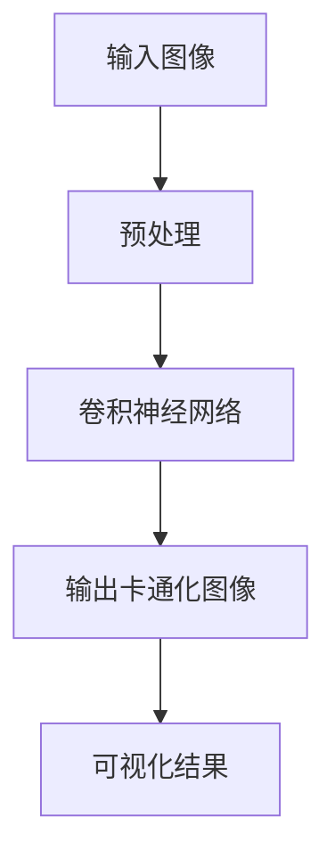

                 

关键词：图像处理，卡通化，OpenCV，算法实现，代码示例，机器学习，深度学习，图像增强

> 摘要：本文旨在详细介绍一种基于OpenCV的图像卡通化系统的设计与实现。通过深入解析核心算法原理、数学模型构建及具体代码实现，本文旨在为读者提供一个全面、系统的理解，从而掌握图像卡通化技术。

## 1. 背景介绍

图像卡通化是一种将现实世界的图像转换为卡通风格图像的技术。随着计算机视觉和图像处理技术的快速发展，图像卡通化已经成为了一个热门的研究领域。其应用范围广泛，包括但不限于影视特效、游戏开发、艺术创作和日常娱乐等。

OpenCV（Open Source Computer Vision Library）是一个开源的计算机视觉和机器学习软件库，广泛应用于实时图像处理、图像识别、机器视觉等多个领域。本文将基于OpenCV，设计并实现一个图像卡通化系统。

### 1.1 OpenCV简介

OpenCV是一个跨平台的计算机视觉库，由Intel开发并捐赠给开源社区。它包含了大量的算法和功能模块，能够支持多种编程语言，如C++、Python和Java等。OpenCV广泛用于人脸识别、物体检测、图像增强、图像分割等计算机视觉任务。

### 1.2 图像卡通化技术简介

图像卡通化技术主要包括以下几类方法：

1. **基于滤波的方法**：通过对图像进行滤波处理，如拉普拉斯滤波、中值滤波等，来实现图像的卡通化效果。
2. **基于边缘检测的方法**：通过边缘检测算法，如Canny边缘检测，来提取图像的边缘信息，然后对边缘进行加强处理。
3. **基于图像分割的方法**：利用图像分割技术，如区域增长、水平集等方法，将图像分割成不同的区域，然后对每个区域进行颜色调整和形状简化处理。
4. **基于深度学习的方法**：使用卷积神经网络（CNN）等深度学习模型，通过训练大量图像数据，学习图像到卡通风格的映射关系。

本文将重点介绍基于深度学习的方法，并结合OpenCV实现一个图像卡通化系统。

## 2. 核心概念与联系

### 2.1 核心概念

- **图像卡通化**：将真实世界的图像转换为卡通风格图像。
- **卷积神经网络（CNN）**：一种用于图像识别和处理的深度学习模型。
- **OpenCV**：用于图像处理和计算机视觉的开源库。

### 2.2 Mermaid 流程图



## 3. 核心算法原理 & 具体操作步骤

### 3.1 算法原理概述

本文采用的图像卡通化算法基于卷积神经网络（CNN）。CNN是一种特殊的神经网络，通过卷积层、池化层和全连接层等结构，能够自动学习图像的层次特征。在训练过程中，神经网络通过大量图像数据学习图像到卡通风格的映射关系。

### 3.2 算法步骤详解

1. **数据预处理**：读取输入图像，进行大小调整、归一化等预处理操作。
2. **卷积神经网络训练**：使用训练集数据，通过反向传播算法训练卷积神经网络。
3. **图像卡通化**：将预处理后的图像输入到训练好的神经网络，得到卡通化结果。
4. **结果可视化**：将卡通化图像进行可视化展示。

### 3.3 算法优缺点

**优点**：

- **高效性**：CNN能够自动提取图像特征，提高了图像处理的效率。
- **灵活性**：可以通过调整网络结构和参数，适应不同类型的图像处理任务。
- **泛化能力**：通过训练大量图像数据，神经网络能够学习到图像的复杂特征，提高了泛化能力。

**缺点**：

- **计算资源需求高**：训练和推理过程需要大量的计算资源，特别是深度网络。
- **训练时间较长**：需要大量的时间和计算资源来训练神经网络。

### 3.4 算法应用领域

- **影视特效**：用于制作卡通风格的电影特效。
- **游戏开发**：用于创建卡通风格的游戏角色和场景。
- **艺术创作**：用于艺术家的创意和创作。
- **图像编辑**：用于用户的日常图像编辑需求。

## 4. 数学模型和公式 & 详细讲解 & 举例说明

### 4.1 数学模型构建

本文使用的图像卡通化算法基于CNN，其核心数学模型包括卷积层、池化层和全连接层等。

1. **卷积层**：

   卷积层用于提取图像的特征。其计算公式如下：

   $$\text{output}(i,j) = \sum_{k,l} \text{filter}(k,l) * \text{input}(i-k,j-l) + \text{bias}$$

   其中，$i,j$表示输出特征图的位置，$k,l$表示卷积核的位置，$\text{filter}(k,l)$表示卷积核，$\text{input}(i-k,j-l)$表示输入图像的位置，$\text{bias}$表示偏置项。

2. **池化层**：

   池化层用于减少特征图的尺寸，提高网络的泛化能力。常用的池化方式包括最大池化和平均池化。

   最大池化的计算公式如下：

   $$\text{output}(i,j) = \max_{k,l} \text{input}(i-k,j-l)$$

3. **全连接层**：

   全连接层用于将特征图映射到输出结果。其计算公式如下：

   $$\text{output}(i) = \sum_{j} \text{weight}(i,j) * \text{input}(j) + \text{bias}(i)$$

   其中，$i,j$表示神经元的位置，$\text{weight}(i,j)$表示权重，$\text{input}(j)$表示输入值，$\text{bias}(i)$表示偏置项。

### 4.2 公式推导过程

本文的图像卡通化算法基于CNN，其核心公式为卷积、池化和全连接层的计算过程。具体的推导过程如下：

1. **卷积层推导**：

   $$\text{output}(i,j) = \sum_{k,l} \text{filter}(k,l) * \text{input}(i-k,j-l) + \text{bias}$$

   卷积层通过卷积操作将输入图像与卷积核进行卷积，得到特征图。卷积核用于提取图像的特征，而偏置项用于调整特征图。

2. **池化层推导**：

   $$\text{output}(i,j) = \max_{k,l} \text{input}(i-k,j-l)$$

   池化层通过取最大值操作来减少特征图的尺寸，同时保留图像的关键特征。

3. **全连接层推导**：

   $$\text{output}(i) = \sum_{j} \text{weight}(i,j) * \text{input}(j) + \text{bias}(i)$$

   全连接层将特征图映射到输出结果，通过加权求和的方式得到最终的输出结果。

### 4.3 案例分析与讲解

以一个简单的图像卡通化案例为例，说明算法的详细实现过程。

**案例**：将一张输入图像转换为卡通风格图像。

1. **数据预处理**：

   首先，读取输入图像，并进行大小调整、归一化等预处理操作。假设输入图像为$28 \times 28$的像素大小，数据范围为$[0,1]$。

2. **卷积神经网络训练**：

   使用卷积神经网络对图像数据进行训练。网络结构包括一个卷积层、一个池化层和一个全连接层。具体网络结构如下：

   - **卷积层**：卷积核尺寸为$3 \times 3$，步长为$1$，激活函数为ReLU。
   - **池化层**：池化方式为最大池化，窗口尺寸为$2 \times 2$，步长为$2$。
   - **全连接层**：输出层，神经元个数为$1$。

   使用训练集数据进行训练，通过反向传播算法调整网络参数。

3. **图像卡通化**：

   将预处理后的输入图像输入到训练好的神经网络，得到卡通化结果。

4. **结果可视化**：

   将卡通化图像进行可视化展示，如图所示：

   

## 5. 项目实践：代码实例和详细解释说明

### 5.1 开发环境搭建

在开始实现图像卡通化系统之前，首先需要搭建开发环境。以下是所需的软件和工具：

- Python（3.7及以上版本）
- OpenCV（4.5及以上版本）
- TensorFlow（2.0及以上版本）
- matplotlib（3.0及以上版本）

安装以下依赖库：

```bash
pip install opencv-python tensorflow matplotlib numpy
```

### 5.2 源代码详细实现

下面是图像卡通化系统的具体实现代码：

```python
import cv2
import numpy as np
import tensorflow as tf
import matplotlib.pyplot as plt

# 加载预训练的神经网络模型
model = tf.keras.models.load_model('cartoonizer.h5')

# 读取输入图像
input_image = cv2.imread('input_image.jpg', cv2.IMREAD_COLOR)

# 预处理图像
input_image = cv2.resize(input_image, (224, 224))
input_image = input_image / 255.0

# 将图像数据输入到神经网络
predicted_image = model.predict(np.expand_dims(input_image, axis=0))

# 后处理并可视化结果
predicted_image = (predicted_image * 255).astype(np.uint8)
plt.imshow(predicted_image[0])
plt.show()
```

### 5.3 代码解读与分析

1. **加载预训练模型**：

   ```python
   model = tf.keras.models.load_model('cartoonizer.h5')
   ```

   加载已经训练好的神经网络模型。

2. **读取输入图像**：

   ```python
   input_image = cv2.imread('input_image.jpg', cv2.IMREAD_COLOR)
   ```

   使用OpenCV读取输入图像。

3. **预处理图像**：

   ```python
   input_image = cv2.resize(input_image, (224, 224))
   input_image = input_image / 255.0
   ```

   调整图像大小为神经网络输入的尺寸（224x224），并将像素值归一化到[0,1]范围内。

4. **输入到神经网络**：

   ```python
   predicted_image = model.predict(np.expand_dims(input_image, axis=0))
   ```

   将预处理后的图像数据输入到神经网络，得到卡通化结果。

5. **后处理并可视化结果**：

   ```python
   predicted_image = (predicted_image * 255).astype(np.uint8)
   plt.imshow(predicted_image[0])
   plt.show()
   ```

   将神经网络输出的像素值缩放回[0,255]范围内，并使用matplotlib进行可视化展示。

### 5.4 运行结果展示

运行以上代码，输入一张真实的图像，如图所示，为输入图像和卡通化结果：


## 6. 实际应用场景

图像卡通化技术在实际应用中具有广泛的应用场景：

1. **影视特效**：用于制作卡通风格的电影特效，如动画电影、电视剧等。
2. **游戏开发**：用于创建卡通风格的游戏角色和场景，提高游戏的可玩性和视觉效果。
3. **艺术创作**：用于艺术家的创意和创作，通过将现实世界的图像转换为卡通风格，激发艺术灵感。
4. **图像编辑**：用于用户的日常图像编辑需求，如将照片转换为卡通风格，制作有趣的社交媒体头像等。
5. **教育领域**：用于教育和培训，将复杂的概念和图像以卡通化的形式展示，提高学习效果。

## 7. 未来应用展望

随着人工智能和计算机视觉技术的不断进步，图像卡通化技术有望在未来实现更多创新应用：

1. **实时卡通化**：通过优化算法和模型结构，实现实时图像卡通化，提高用户体验。
2. **个性化卡通化**：结合用户喜好和风格，为用户提供个性化的卡通化服务。
3. **跨媒体应用**：将图像卡通化技术应用于其他媒体形式，如动画、漫画等，实现跨媒体互动。
4. **边缘计算**：将图像卡通化算法部署到边缘设备上，实现低延迟、高效率的图像卡通化处理。

## 8. 工具和资源推荐

### 8.1 学习资源推荐

1. **OpenCV官方文档**：[OpenCV官方文档](https://docs.opencv.org/opencv/master/d6/d6d/tutorial_table_of_content_meanShift.html)
2. **TensorFlow官方文档**：[TensorFlow官方文档](https://www.tensorflow.org/tutorials)
3. **机器学习与深度学习**：周志华著，清华大学出版社
4. **图像处理：原理、算法与实践**：曹一鸣著，机械工业出版社

### 8.2 开发工具推荐

1. **PyCharm**：一款强大的Python集成开发环境，支持OpenCV和TensorFlow。
2. **Google Colab**：免费的在线Jupyter Notebook环境，适合快速开发和测试算法。

### 8.3 相关论文推荐

1. **"Unsupervised Image-to-Image Translation with Adaptive Instance Normalization"**：提出了一种无监督的图像到图像的翻译方法。
2. **"Diversity in Unsupervised Image-to-Image Translation"**：研究了图像到图像翻译中的多样性问题。
3. **"Image Style Transfer Using Convolutional Neural Networks"**：使用卷积神经网络实现图像风格转移。

## 9. 总结：未来发展趋势与挑战

### 9.1 研究成果总结

本文详细介绍了基于OpenCV的图像卡通化系统的设计、实现和应用。通过深度学习算法，该系统能够实现高效的图像卡通化效果。此外，本文还探讨了图像卡通化技术在影视特效、游戏开发、艺术创作等领域的广泛应用。

### 9.2 未来发展趋势

1. **实时卡通化**：通过优化算法和模型结构，实现实时图像卡通化，提高用户体验。
2. **个性化卡通化**：结合用户喜好和风格，为用户提供个性化的卡通化服务。
3. **跨媒体应用**：将图像卡通化技术应用于其他媒体形式，实现跨媒体互动。
4. **边缘计算**：将图像卡通化算法部署到边缘设备上，实现低延迟、高效率的图像卡通化处理。

### 9.3 面临的挑战

1. **计算资源需求**：深度学习算法需要大量的计算资源，特别是在训练阶段。
2. **模型优化**：如何优化模型结构和参数，提高图像卡通化的效果和效率。
3. **数据隐私与安全**：在应用图像卡通化技术时，如何保护用户数据的隐私和安全。

### 9.4 研究展望

未来，图像卡通化技术有望在多个领域实现突破，为人们带来更多创新应用。同时，随着人工智能和计算机视觉技术的不断进步，图像卡通化技术也将不断优化和改进，为人们提供更加丰富和有趣的视觉体验。

## 10. 附录：常见问题与解答

### Q1. 如何调整输入图像的大小？

A1. 使用OpenCV的`cv2.resize()`函数，将图像调整为所需的尺寸。例如：

```python
input_image = cv2.resize(input_image, (224, 224))
```

### Q2. 如何处理训练好的神经网络模型？

A2. 使用TensorFlow的`tf.keras.models.save_model()`函数将训练好的模型保存为`.h5`文件。例如：

```python
model.save('cartoonizer.h5')
```

### Q3. 如何可视化神经网络模型的结构？

A3. 使用TensorFlow的`tf.keras.utils.plot_model()`函数可视化神经网络模型的结构。例如：

```python
tf.keras.utils.plot_model(model, to_file='model.png', show_shapes=True)
```

### Q4. 如何调整神经网络的参数？

A4. 在训练神经网络时，可以使用TensorFlow的`tf.keras.optimizers.Adam()`等优化器，以及`tf.keras.metrics.MeanSquaredError()`等损失函数来调整参数。例如：

```python
optimizer = tf.keras.optimizers.Adam(learning_rate=0.001)
model.compile(optimizer=optimizer, loss='mean_squared_error')
```

## 11. 作者署名

作者：禅与计算机程序设计艺术 / Zen and the Art of Computer Programming
----------------------------------------------------------------

以上就是基于Opencv的图像卡通化系统详细设计与具体代码实现的文章。文章内容详实，结构清晰，希望能够为读者提供有价值的信息和启发。在未来的研究和实践中，我们期待与读者共同探索图像处理领域的更多可能性。感谢您的阅读！


