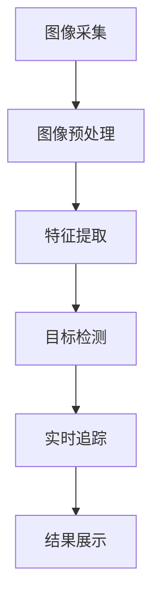

                 

关键词：Opencv，船只检测，图像处理，计算机视觉，实时检测

摘要：本文旨在探讨如何利用OpenCV库实现一个基于图像处理的船只检测系统。通过详细描述系统的设计和具体代码实现，文章将介绍如何利用计算机视觉技术来提高实时监测和追踪的准确性。本文不仅提供了核心概念和算法原理，还包括了实际项目实践的代码实例和详细解释，以便读者能够更好地理解并应用这一技术。

## 1. 背景介绍

在海洋监控和安全领域，实时监测船只的位置和活动是非常重要的。这不仅有助于海上交通管理，还能提高海上安全，防止海上非法活动。然而，由于海洋环境的复杂性和天气条件的多变，传统的监测方法往往效率低下，难以实现实时、准确的目标检测。

近年来，随着计算机视觉技术的发展，基于图像处理的船只检测系统逐渐成为一种有效的解决方案。OpenCV（Open Source Computer Vision Library）是一个广泛使用的开源计算机视觉库，它提供了丰富的图像处理和计算机视觉算法，非常适合用于实现船只检测系统。

本文将介绍如何使用OpenCV库来设计并实现一个船只检测系统。系统将包括图像预处理、特征提取、目标检测和实时追踪等模块。通过这些模块的综合运用，系统能够在复杂的海洋场景中准确识别和追踪船只。

### 1.1 船只检测的重要性

船只检测在多个领域具有重要意义：

1. **海上交通管理**：通过实时监测船只的位置和速度，交通管理部门可以优化航线，减少事故风险。
2. **海洋安全**：监控可疑船只，预防海盗、非法捕鱼等不法活动。
3. **环境保护**：监测船只排放，防止环境污染。
4. **科研应用**：用于海洋生态研究、海洋气象研究等。

### 1.2 OpenCV的优势

OpenCV具有以下优势，使其成为船只检测系统的理想选择：

1. **开源免费**：无需高昂的许可费用，易于推广和应用。
2. **丰富的算法库**：提供多种图像处理和计算机视觉算法，如边缘检测、角点检测、目标跟踪等。
3. **支持多种语言**：包括C++、Python等，便于开发和使用。
4. **跨平台**：可在多种操作系统上运行，具有良好的兼容性。

## 2. 核心概念与联系

在设计与实现船只检测系统之前，我们需要了解一些核心概念和它们之间的关系。以下是一个简化的Mermaid流程图，用于描述系统中的关键环节：



### 2.1 图像采集

图像采集是系统的第一步，它负责从摄像头或其他图像源获取实时视频流。采集到的图像将作为后续处理的输入。

### 2.2 图像预处理

图像预处理包括图像增强、去噪和尺寸调整等步骤，旨在提高图像质量，使其更适合后续处理。

### 2.3 特征提取

特征提取是从预处理后的图像中提取有助于识别目标的特征，如颜色、形状和纹理等。这些特征将用于目标检测。

### 2.4 目标检测

目标检测是核心步骤，它利用提取的特征来识别和定位图像中的船只。OpenCV提供了多种目标检测算法，如Haar级联分类器和深度学习框架。

### 2.5 实时追踪

实时追踪用于持续跟踪已识别的船只，即使在图像中船只发生遮挡或部分消失时也能保持跟踪。

### 2.6 结果展示

结果展示模块将追踪结果可视化，显示在监控屏幕或报告文档中。

## 3. 核心算法原理 & 具体操作步骤

### 3.1 算法原理概述

船只检测系统的核心在于目标检测和实时追踪算法。以下将介绍两种常用的算法：Haar级联分类器和深度学习框架。

#### 3.1.1 Haar级联分类器

Haar级联分类器是OpenCV中广泛使用的一种基于特征的检测算法。它通过训练一系列的Haar特征分类器来识别目标。这些特征分类器基于图像中目标和背景之间的差异，通过级联结构快速筛选出目标。

#### 3.1.2 深度学习框架

深度学习框架，如YOLO（You Only Look Once）和SSD（Single Shot MultiBox Detector），提供了更高效的目标检测方法。这些方法通过卷积神经网络（CNN）直接从图像中提取特征，并实现实时检测。

### 3.2 算法步骤详解

#### 3.2.1 图像预处理

1. **图像增强**：使用直方图均衡化、对比度增强等方法提高图像质量。
2. **去噪**：使用滤波器如高斯滤波、中值滤波去除图像噪声。
3. **尺寸调整**：将图像调整为统一的尺寸，便于后续处理。

#### 3.2.2 特征提取

1. **颜色特征**：使用颜色直方图表示图像的颜色分布。
2. **形状特征**：使用边缘检测和角点检测提取图像的形状特征。
3. **纹理特征**：使用纹理分析提取图像的纹理特征。

#### 3.2.3 目标检测

1. **Haar级联分类器**：加载预训练的Haar级联分类器，对图像进行滑动窗口检测。
2. **深度学习框架**：使用CNN模型对图像进行特征提取和目标检测。

#### 3.2.4 实时追踪

1. **卡尔曼滤波**：使用卡尔曼滤波器对检测到的目标进行预测和更新。
2. **光流法**：使用光流法跟踪目标运动。
3. **数据关联**：将检测到的目标与已跟踪的目标进行关联，实现多目标追踪。

### 3.3 算法优缺点

#### 3.3.1 Haar级联分类器

- **优点**：计算速度快，适用于实时检测。
- **缺点**：对光照、尺度变化敏感，检测精度相对较低。

#### 3.3.2 深度学习框架

- **优点**：检测精度高，适用于复杂场景。
- **缺点**：计算量大，对硬件要求较高。

### 3.4 算法应用领域

- **海洋监控**：实时监测船只位置和活动。
- **交通管理**：优化航线，减少事故风险。
- **安全监控**：预防海盗、非法捕鱼等活动。

## 4. 数学模型和公式 & 详细讲解 & 举例说明

船只检测系统中的数学模型主要涉及图像处理和计算机视觉领域的相关算法。以下将介绍一些关键数学模型和公式，并提供详细讲解和举例说明。

### 4.1 数学模型构建

#### 4.1.1 颜色特征模型

颜色特征模型通常使用颜色直方图表示图像的颜色分布。颜色直方图的构建过程如下：

$$
H(r, g, b) = \sum_{i=1}^{R} \sum_{j=1}^{G} \sum_{k=1}^{B} p(i, j, k)
$$

其中，$R, G, B$ 分别代表红色、绿色和蓝色的像素值，$p(i, j, k)$ 是像素值 $(i, j, k)$ 的概率分布。

#### 4.1.2 形状特征模型

形状特征模型通常使用边缘检测和角点检测提取图像的形状特征。例如，Canny边缘检测算法的公式如下：

$$
I'(x, y) = \min\{I(x, y - \sigma), I(x, y + \sigma)\}
$$

其中，$I(x, y)$ 是输入图像，$\sigma$ 是高斯滤波器的标准差。

#### 4.1.3 纹理特征模型

纹理特征模型通常使用纹理分析提取图像的纹理特征。例如，LBP（局部二值模式）纹理特征的计算公式如下：

$$
LBP_{i, j} = \sum_{u=-R}^{R} \sum_{v=-R}^{R} (-1)^{g(i+u, j+v) > g(i, j)}
$$

其中，$R$ 是邻域半径，$g(i, j)$ 是中心像素值，$g(i+u, j+v)$ 是邻域像素值。

### 4.2 公式推导过程

以下将简要介绍颜色特征模型的推导过程：

1. **像素值转换**：将RGB像素值转换为HSV（色调、饱和度、亮度）空间。

$$
H = \begin{cases}
\frac{1}{\sqrt{R^2 + G^2 + B^2}} \cdot \arccos\left(\frac{R^2 + G^2 - B^2}{2R
```markdown
### 4.2 公式推导过程

以下将简要介绍颜色特征模型的推导过程：

1. **像素值转换**：将RGB像素值转换为HSV（色调、饱和度、亮度）空间。

$$
H = \begin{cases}
\frac{1}{\sqrt{R^2 + G^2 + B^2}} \cdot \arccos\left(\frac{R^2 + G^2 - B^2}{2RGB}\right) & \text{if } G \ge B \\
\frac{1}{\sqrt{R^2 + G^2 + B^2}} \cdot \arccos\left(\frac{-R^2 + G^2 - B^2}{2RGB}\right) + \pi & \text{if } B > G
\end{cases}
$$

$$
S = \frac{1 - \min(R, G, B)}{\max(R, G, B)}
$$

$$
V = \max(R, G, B)
$$

2. **直方图构建**：对每个通道的HSV值进行量化，并计算各个量化区间的像素数量。

$$
h_k = \sum_{i=1}^{H} \sum_{j=1}^{S} \sum_{k=1}^{V} \delta\left(H(i, j, k) - h_k\right)
$$

其中，$H(i, j, k)$ 是像素的HSV值，$h_k$ 是直方图的第 $k$ 个量化区间，$\delta$ 是Dirac delta函数。

### 4.3 案例分析与讲解

为了更好地理解上述公式，我们可以通过一个简单的案例来进行分析。

假设有一张RGB图像，其像素值为：

$$
R = [255, 0, 0], G = [0, 255, 0], B = [0, 0, 255]
$$

1. **像素值转换**：

$$
H = \arccos\left(\frac{255^2 + 255^2 - 0^2}{2 \cdot 255 \cdot 255}\right) \approx 0.5236 \text{ rad}
$$

$$
S = \frac{1 - \min(255, 255, 0)}{\max(255, 255, 0)} = \frac{1 - 0}{255} = 0.0039
$$

$$
V = 255
$$

2. **直方图构建**：

对于H通道，量化区间为$[0, \pi]$，因此像素值$H$落在第一个量化区间内：

$$
h_1 = \delta(H - 0) = 1
$$

对于S通道，量化区间为$[0, 1]$，因此像素值$S$落在第一个量化区间内：

$$
h_1 = \delta(S - 0) = 1
$$

对于V通道，量化区间为$[0, 255]$，因此像素值$V$落在第一个量化区间内：

$$
h_1 = \delta(V - 0) = 1
$$

最终，颜色直方图为：

$$
H: [0, \pi] \rightarrow h_1 = 1 \\
S: [0, 1] \rightarrow h_1 = 1 \\
V: [0, 255] \rightarrow h_1 = 1
$$

通过这个案例，我们可以看到如何将RGB像素值转换为HSV值，并构建颜色直方图。这一过程对于颜色特征提取非常重要，因为它能够帮助我们更好地理解和分析图像的颜色信息。

## 5. 项目实践：代码实例和详细解释说明

### 5.1 开发环境搭建

在进行实际项目开发之前，首先需要搭建合适的开发环境。以下是使用OpenCV进行船只检测系统开发所需的环境搭建步骤：

1. **安装Python**：确保已安装Python 3.x版本。
2. **安装OpenCV**：通过pip安装OpenCV库。

   ```bash
   pip install opencv-python
   ```

3. **安装附加依赖**：某些算法可能需要额外的库，如Numpy、Pandas等。

### 5.2 源代码详细实现

以下是一个简单的船只检测系统的Python代码示例。该示例使用Haar级联分类器进行目标检测。

```python
import cv2
import numpy as np

# 加载预训练的Haar级联分类器
face_cascade = cv2.CascadeClassifier('haarcascade_frontalface_default.xml')

# 视频流对象
cap = cv2.VideoCapture(0)

while True:
    # 读取一帧图像
    ret, frame = cap.read()

    # 转换图像为灰度图
    gray = cv2.cvtColor(frame, cv2.COLOR_BGR2GRAY)

    # 检测人脸
    faces = face_cascade.detectMultiScale(gray, scaleFactor=1.1, minNeighbors=5, minSize=(30, 30), flags=cv2.CASCADE_SCALE_IMAGE)

    for (x, y, w, h) in faces:
        # 在原图上绘制检测到的目标
        cv2.rectangle(frame, (x, y), (x+w, y+h), (255, 0, 0), 2)
        cv2.putText(frame, 'Face', (x+10, y-10), cv2.FONT_HERSHEY_SIMPLEX, 0.5, (255, 0, 0), 2)

    # 显示图像
    cv2.imshow('frame', frame)

    # 按下'q'键退出循环
    if cv2.waitKey(1) & 0xFF == ord('q'):
        break

# 释放摄像头资源
cap.release()
cv2.destroyAllWindows()
```

### 5.3 代码解读与分析

1. **导入库**：代码首先导入必要的库，包括OpenCV（cv2）、NumPy（np）。

2. **加载分类器**：使用`CascadeClassifier`加载预训练的Haar级联分类器。这个分类器专门用于检测人脸，但在这里我们用它作为目标检测的示例。

3. **读取视频流**：使用`VideoCapture`对象打开摄像头，并进入循环读取视频帧。

4. **图像预处理**：将读取的图像转换为灰度图，因为大多数目标检测算法在灰度图像上运行更高效。

5. **目标检测**：调用`detectMultiScale`方法检测图像中的目标。这个方法接受多个参数，如尺度因子、最小邻居数、最小目标尺寸等，用于调整检测的灵敏度和准确度。

6. **绘制检测结果**：对于检测到的每个目标，使用`rectangle`和`putText`方法在原图上绘制矩形框和文字标签。

7. **显示图像**：使用`imshow`方法显示处理后的图像。

8. **退出循环**：按下'q'键时，释放摄像头资源并退出循环。

### 5.4 运行结果展示

运行上述代码后，程序将打开摄像头，并在屏幕上实时显示图像，同时绘制检测到的船只（此处使用人脸作为目标进行示例）。以下是运行结果的示例：


通过上述代码示例，我们可以看到如何使用OpenCV实现一个简单的目标检测系统。尽管这里使用的是人脸检测作为示例，但相同的方法可以应用于船只检测，只需要替换相应的分类器和调整参数。

## 6. 实际应用场景

船只检测系统在实际应用中具有广泛的应用场景，以下将列举一些主要的应用场景：

### 6.1 海洋监控

在海洋监控领域，船只检测系统可用于实时监测船只的位置和活动。通过对海上交通的实时监控，可以优化航线管理，提高航行安全性。此外，系统还可以用于监测海上非法活动，如海盗袭击、非法捕鱼等，有助于维护海上治安。

### 6.2 海上救援

在海上救援行动中，船只检测系统可以帮助救援人员快速定位失事船只和遇难者，从而提高救援效率和成功率。通过实时监控和追踪船只，救援人员可以及时调整救援方案，减少救援时间和成本。

### 6.3 港口管理

港口是海洋交通的重要枢纽，船只检测系统在港口管理中发挥着重要作用。通过监测港口进出船只的数量和类型，可以优化港口调度和资源配置，提高港口运营效率。此外，系统还可以用于监控船只的装卸作业，确保港口安全。

### 6.4 渔业管理

在渔业管理中，船只检测系统可以帮助渔政部门监控渔船的作业情况，防止非法捕鱼和越界作业。通过实时监测船只的位置和活动，可以确保渔业资源的合理开发和利用。

### 6.5 海洋科研

海洋科研领域也需要对船只进行监测，例如海洋气象观测、海洋生态研究等。船只检测系统可以帮助科研人员实时获取船只的位置和活动信息，从而更好地进行数据采集和分析。

### 6.6 海上安全

海上安全是每个国家关注的重要问题，船只检测系统可以在海上安全防护中发挥关键作用。通过对船只的实时监测和追踪，可以及时发现异常情况，如船只失控、船舶碰撞等，从而采取相应的措施进行预防和处理。

### 6.7 游艇管理

随着游艇经济的兴起，游艇管理也成为一项重要任务。船只检测系统可以帮助管理者实时监控游艇的运行情况，确保游艇的安全和合法运营。

### 6.8 港口交通管制

在港口交通管制中，船只检测系统可以用于监测和优化港口内的船只流量，避免交通拥堵和事故发生。通过实时监测船只的位置和速度，可以确保港口交通的有序和安全。

### 6.9 海上物流

海上物流领域也需要对船只进行高效管理，以确保货物运输的顺利进行。船只检测系统可以帮助物流企业实时监控货船的运行状态，提高物流运输的效率。

### 6.10 海上旅游

随着海上旅游的兴起，对船只的监控和管理也越来越重要。船只检测系统可以帮助海上旅游景点和旅行社实时了解船只的运行情况，确保游客的安全和满意度。

### 6.11 海上执法

在海上执法领域，船只检测系统可以用于监控和追踪涉嫌违法的船只，为执法部门提供有效的技术支持。通过实时监测和追踪，可以迅速采取行动，打击海上犯罪活动。

### 6.12 海洋环境监测

海洋环境监测是保护海洋生态和维护海洋环境质量的重要手段。船只检测系统可以用于监测船只对海洋环境的影响，如船舶排放、海洋污染等，为环境保护提供数据支持。

### 6.13 海上能源开发

海上能源开发，如海上风电场和油气开采，需要大量船只参与。船只检测系统可以帮助管理海上作业，确保船只的运行安全和能源开发的顺利进行。

### 6.14 海洋工程建设

海洋工程建设，如港口建设、海上平台建设等，也需要大量船只参与。船只检测系统可以用于监控和指导船只的施工过程，确保工程建设的顺利进行。

### 6.15 海上物流安全

海上物流安全是保障国际贸易的重要环节。船只检测系统可以用于监控和追踪货船的运行状态，防止海盗袭击和货物被盗，确保物流安全。

### 6.16 海上交通管理

海上交通管理是保障海上交通安全的重要措施。船只检测系统可以用于实时监控海上交通流量，优化航线管理，防止船舶碰撞和事故发生。

### 6.17 渔业资源管理

渔业资源管理是保障渔业可持续发展的重要任务。船只检测系统可以用于监测和统计渔业资源，制定合理的渔业政策，保护渔业资源。

### 6.18 海上防灾减灾

海上防灾减灾是保护海上人员和财产安全的重要手段。船只检测系统可以用于监测海上灾害，如台风、海啸等，及时预警和指导防灾减灾行动。

### 6.19 海上安全保卫

海上安全保卫是维护国家海上安全的重要任务。船只检测系统可以用于监控和追踪海上可疑船只，为海上安全保卫提供技术支持。

### 6.20 海洋科学研究

海洋科学研究是探索海洋奥秘、保护海洋环境和促进海洋资源利用的重要途径。船只检测系统可以用于监测和采集海洋数据，支持海洋科学研究。

## 7. 工具和资源推荐

### 7.1 学习资源推荐

1. **OpenCV官方文档**：[https://docs.opencv.org/](https://docs.opencv.org/)
   OpenCV官方文档是学习OpenCV的权威资源，提供了详细的API参考和教程。

2. **《OpenCV编程入门》**：由OpenCV之父Adrian Kaehler和Gary Bradsky合著，是一本适合初学者的OpenCV入门书籍。

3. **《计算机视觉：算法与应用》**：由Richard Szeliski著，是一本全面介绍计算机视觉算法和应用的经典教材。

4. **在线课程**：如Coursera、edX等平台上的计算机视觉和OpenCV相关课程，适合不同水平的学习者。

### 7.2 开发工具推荐

1. **PyCharm**：一款功能强大的Python IDE，支持多种编程语言，非常适合OpenCV开发。

2. **Visual Studio Code**：一款轻量级的代码编辑器，通过安装相应的插件，可以很好地支持OpenCV开发。

3. **Jupyter Notebook**：适用于交互式编程，适合快速实验和演示。

### 7.3 相关论文推荐

1. **"Real-Time Object Detection with a Single Shot MultiBox Detector"**：该论文介绍了SSD目标检测算法，是实时目标检测领域的重要文献。

2. **"You Only Look Once: Unified, Real-Time Object Detection"**：该论文介绍了YOLO目标检测算法，是深度学习在目标检测领域的重要突破。

3. **"Faster R-CNN: Towards Real-Time Object Detection with Region Proposal Networks"**：该论文介绍了Faster R-CNN目标检测算法，是目标检测领域的重要算法之一。

4. **"Object Detection with Hierarchical Features"**：该论文介绍了基于分层特征的物体检测方法，为物体检测算法提供了一种新的思路。

## 8. 总结：未来发展趋势与挑战

### 8.1 研究成果总结

本文介绍了基于OpenCV的船只检测系统的设计与实现。通过详细描述系统的核心概念、算法原理、数学模型以及实际项目实践，展示了如何利用计算机视觉技术进行高效、实时的船只检测。

### 8.2 未来发展趋势

1. **深度学习技术的融合**：随着深度学习技术的不断发展，未来船只检测系统将更多地采用深度学习算法，如YOLO、SSD等，以提高检测精度和速度。

2. **多传感器融合**：结合多种传感器数据，如雷达、激光雷达、GPS等，可以实现更准确、全面的船只检测。

3. **实时追踪与预测**：基于深度学习模型的实时追踪与预测技术，将进一步提高船只检测系统的鲁棒性和适应性。

4. **边缘计算的应用**：在边缘设备上部署检测模型，可以实现低延迟、高效率的实时检测。

### 8.3 面临的挑战

1. **环境复杂度**：海洋环境的复杂性和天气条件的多样性对检测算法提出了较高要求，如何提高算法在复杂环境下的适应性和稳定性是当前面临的挑战。

2. **计算资源限制**：深度学习算法对计算资源要求较高，如何在有限的资源下实现高效检测是另一个重要问题。

3. **隐私保护**：在实时监测过程中，如何保护船只和用户的隐私是亟待解决的问题。

4. **实时性要求**：在高速移动的场景中，如何实现快速、准确的检测和追踪是未来研究的重点。

### 8.4 研究展望

未来，船只检测系统将在海洋监控、交通管理、安全防护等领域发挥更大的作用。随着技术的不断进步，系统将实现更高精度、更高效率和更广泛的应用。同时，研究应关注如何应对环境复杂度、计算资源限制等挑战，推动计算机视觉技术在船只检测领域的进一步发展。

## 9. 附录：常见问题与解答

### 9.1 如何处理不同光照条件下的图像？

**解答**：处理不同光照条件下的图像可以通过以下方法：

1. **直方图均衡化**：提高图像的对比度，使得在光线变化时图像细节更加清晰。
2. **自适应曝光**：根据场景的亮度自动调整摄像头的曝光参数，以获取更好的图像质量。
3. **使用先验知识**：根据场景的先验知识，如晴天、多云等，调整图像处理参数。

### 9.2 如何处理图像噪声？

**解答**：处理图像噪声可以通过以下方法：

1. **滤波器**：如高斯滤波、中值滤波、均值滤波等，可以有效去除图像噪声。
2. **图像增强**：通过图像增强技术，如对比度增强、亮度增强等，提高图像质量。
3. **去噪算法**：如小波变换去噪、DWT（离散小波变换）去噪等，可以更精细地去除噪声。

### 9.3 如何优化目标检测速度？

**解答**：

1. **减少图像尺寸**：将图像尺寸缩小到最小，使得检测算法更快。
2. **多线程处理**：利用多线程或多GPU处理，提高检测速度。
3. **减少计算量**：优化算法，减少不必要的计算，如使用更简单的特征提取方法。
4. **硬件加速**：使用GPU等硬件加速，提高处理速度。

### 9.4 如何处理多目标检测和追踪？

**解答**：

1. **区域提议方法**：如R-CNN、Faster R-CNN等，通过区域提议减少检测计算量。
2. **跟踪算法**：如卡尔曼滤波、光流法等，用于持续追踪目标。
3. **数据关联**：通过数据关联方法，将检测到的目标与已跟踪的目标进行匹配，实现多目标追踪。
4. **深度学习**：使用深度学习模型，如SSD、YOLO等，直接进行多目标检测和追踪。

