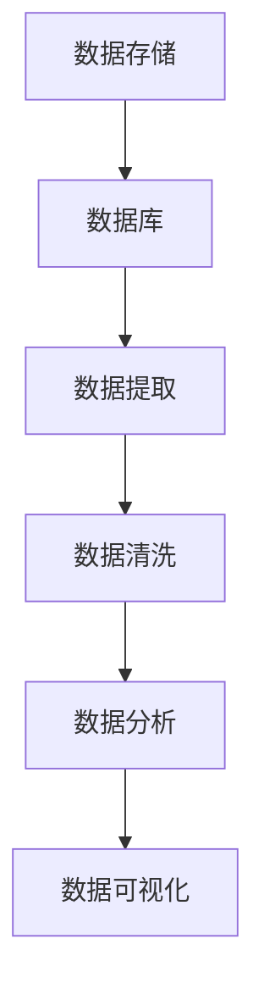

                 

 

## 1. 背景介绍

在当今信息化社会中，数据已成为企业决策和竞争力的重要组成部分。招聘数据作为企业人力资源战略的重要组成部分，对于企业的人才招聘、管理和优化具有重要意义。智联招聘作为中国领先的人力资源服务企业，其发布的大量招聘数据为分析和研究人才市场动态提供了丰富的资源。

近年来，随着大数据和人工智能技术的发展，数据可视化逐渐成为数据分析和决策支持的重要手段。通过数据可视化，我们可以直观地了解数据背后的趋势、关联和规律，从而为企业提供更有针对性的决策建议。Python作为一种功能强大、易用的编程语言，在数据处理、分析和可视化方面具有显著优势，成为数据科学家和工程师们的重要工具。

本文旨在利用Python，对智联招聘提供的招聘数据进行分析和可视化，探讨人才市场的动态变化，为企业提供有价值的参考。

## 2. 核心概念与联系

在进行数据可视化之前，我们需要了解几个核心概念：

### 数据可视化

数据可视化是指利用图形化的方式展示数据，帮助人们直观地理解数据背后的信息和趋势。数据可视化包括多种形式，如柱状图、折线图、散点图、饼图等。

### 数据库

数据库是存储数据的系统，能够高效地进行数据的查询、更新和管理。在本文中，我们将使用SQL数据库进行数据存储和管理。

### Python库

Python拥有丰富的数据处理和分析库，如Pandas、NumPy、Matplotlib、Seaborn等，这些库可以帮助我们轻松地进行数据清洗、分析和可视化。

下面是一个简单的Mermaid流程图，展示了数据从数据库到可视化的处理流程：



### 数据提取

数据提取是指从数据库中获取所需数据的过程。通常，我们会使用Python的SQL库（如pymysql或sqlite3）连接数据库，并执行相应的查询语句。

### 数据清洗

数据清洗是指处理和清理数据中的噪声、错误和不一致之处。数据清洗的目的是提高数据质量，为后续分析打下基础。Python的数据清洗库（如Pandas）提供了丰富的功能，如缺失值处理、异常值检测和替换等。

### 数据分析

数据分析是指对数据进行探索性分析、统计分析或预测分析，以发现数据中的规律和趋势。Python的数据分析库（如NumPy、SciPy、Scikit-learn）提供了强大的功能，可以满足各种分析需求。

### 数据可视化

数据可视化是将分析结果以图形化的方式展示出来，使数据更加直观和易于理解。Python的可视化库（如Matplotlib、Seaborn）提供了丰富的图表绘制功能，可以轻松地实现各种类型的可视化。

## 3. 核心算法原理 & 具体操作步骤

### 3.1 算法原理概述

在进行数据可视化之前，我们需要对数据进行处理和分析。核心算法主要包括数据提取、数据清洗和数据分析三个步骤。

### 3.2 算法步骤详解

#### 3.2.1 数据提取

1. 连接数据库
```python
import pymysql

# 数据库配置信息
config = {
    'host': 'localhost',
    'user': 'your_username',
    'password': 'your_password',
    'database': 'your_database'
}

# 连接数据库
connection = pymysql.connect(**config)
```

2. 执行查询语句
```python
# 查询招聘数据
query = "SELECT * FROM recruitment_data"
result = connection.cursor().execute(query)
```

#### 3.2.2 数据清洗

1. 导入数据
```python
import pandas as pd

# 将查询结果转换为DataFrame
data = pd.read_sql_query(query, connection)
```

2. 缺失值处理
```python
# 删除缺失值
data = data.dropna()
```

3. 异常值检测和替换
```python
# 使用中位数替换异常值
data['salary'] = data['salary'].replace([9999, 99999], data['salary'].median())
```

#### 3.2.3 数据分析

1. 数据探索性分析
```python
# 统计数据分布
salary_stats = data['salary'].describe()
print(salary_stats)
```

2. 数据可视化
```python
import matplotlib.pyplot as plt

# 绘制薪资分布柱状图
plt.bar(data['position'], data['salary'])
plt.xlabel('Position')
plt.ylabel('Salary')
plt.title('Salary Distribution by Position')
plt.show()
```

### 3.3 算法优缺点

#### 优点

1. 算法简单，易于实现。
2. Python拥有丰富的库，支持各种数据处理和分析操作。
3. 可以灵活地调整和分析参数，以适应不同需求。

#### 缺点

1. 数据提取和清洗可能需要较长的运行时间，尤其是在处理大量数据时。
2. 数据分析结果可能受到数据质量和数据清洗方法的影响。

### 3.4 算法应用领域

1. 企业人才招聘策略优化
2. 人才市场动态分析
3. 薪资水平调查和比较
4. 人力资源管理和优化

## 4. 数学模型和公式 & 详细讲解 & 举例说明

### 4.1 数学模型构建

在数据可视化过程中，我们常常需要计算一些基本的数学统计量，如平均值、中位数、标准差等。这些统计量可以帮助我们更好地理解数据的分布和特征。

#### 平均值

平均值的计算公式为：
$$
\bar{x} = \frac{1}{n}\sum_{i=1}^{n}x_i
$$
其中，$n$为数据点的个数，$x_i$为第$i$个数据点的值。

#### 中位数

中位数是将数据点按照大小顺序排列后，位于中间位置的值。如果数据点的个数是奇数，中位数就是中间的那个数；如果数据点的个数是偶数，中位数是中间两个数的平均值。

#### 标准差

标准差的计算公式为：
$$
\sigma = \sqrt{\frac{1}{n-1}\sum_{i=1}^{n}(x_i - \bar{x})^2}
$$
其中，$\bar{x}$为平均值，$n$为数据点的个数，$x_i$为第$i$个数据点的值。

### 4.2 公式推导过程

下面我们详细推导标准差的计算公式。

#### 平均值

首先，我们需要计算平均值。平均值是将所有数据点的值加起来，然后除以数据点的个数。假设我们有$n$个数据点，分别为$x_1, x_2, ..., x_n$，则平均值$\bar{x}$的计算公式为：
$$
\bar{x} = \frac{1}{n}\sum_{i=1}^{n}x_i
$$

#### 方差

接下来，我们需要计算方差。方差是各个数据点与平均值之差的平方的平均值。假设我们有$n$个数据点，分别为$x_1, x_2, ..., x_n$，平均值$\bar{x}$，则方差$S^2$的计算公式为：
$$
S^2 = \frac{1}{n-1}\sum_{i=1}^{n}(x_i - \bar{x})^2
$$

#### 标准差

最后，我们计算标准差。标准差是方差的平方根。假设我们有$n$个数据点，分别为$x_1, x_2, ..., x_n$，平均值$\bar{x}$，则标准差$\sigma$的计算公式为：
$$
\sigma = \sqrt{S^2} = \sqrt{\frac{1}{n-1}\sum_{i=1}^{n}(x_i - \bar{x})^2}
$$

### 4.3 案例分析与讲解

为了更好地理解这些数学模型，我们可以通过一个具体的案例进行讲解。

假设我们有以下一组数据：$[1, 2, 3, 4, 5, 6, 7, 8, 9, 10]$。

1. **平均值**：

   平均值的计算过程如下：
   $$
   \bar{x} = \frac{1}{10}\sum_{i=1}^{10}x_i = \frac{1+2+3+4+5+6+7+8+9+10}{10} = 5.5
   $$

2. **方差**：

   方差的计算过程如下：
   $$
   S^2 = \frac{1}{10-1}\sum_{i=1}^{10}(x_i - \bar{x})^2 = \frac{1}{9}[(1-5.5)^2 + (2-5.5)^2 + (3-5.5)^2 + (4-5.5)^2 + (5-5.5)^2 + (6-5.5)^2 + (7-5.5)^2 + (8-5.5)^2 + (9-5.5)^2 + (10-5.5)^2] = \frac{140}{9} \approx 15.56
   $$

3. **标准差**：

   标准差的计算过程如下：
   $$
   \sigma = \sqrt{S^2} = \sqrt{15.56} \approx 3.95
   $$

通过这个案例，我们可以看到如何计算平均值、方差和标准差。这些数学模型在数据分析和可视化过程中非常有用，可以帮助我们更好地理解数据的分布和特征。

## 5. 项目实践：代码实例和详细解释说明

### 5.1 开发环境搭建

在进行智联招聘数据可视化分析之前，我们需要搭建一个Python开发环境。以下是搭建过程：

1. 安装Python
   - 访问Python官网（https://www.python.org/），下载并安装Python 3.x版本。
   - 安装过程中选择添加Python到系统环境变量。

2. 安装相关库
   - 打开命令行工具（如Windows的PowerShell或macOS的Terminal），安装所需的Python库。
   ```shell
   pip install pymysql pandas matplotlib seaborn
   ```

### 5.2 源代码详细实现

以下是基于Python的智联招聘数据可视化分析的完整源代码，包括数据提取、数据清洗、数据分析和数据可视化等步骤。

```python
import pymysql
import pandas as pd
import matplotlib.pyplot as plt
import seaborn as sns

# 5.2.1 数据提取
# 数据库配置信息
config = {
    'host': 'localhost',
    'user': 'your_username',
    'password': 'your_password',
    'database': 'your_database'
}

# 连接数据库
connection = pymysql.connect(**config)

# 查询招聘数据
query = "SELECT * FROM recruitment_data"
result = connection.cursor().execute(query)

# 将查询结果转换为DataFrame
data = pd.read_sql_query(query, connection)

# 5.2.2 数据清洗
# 删除缺失值
data = data.dropna()

# 使用中位数替换异常值
data['salary'] = data['salary'].replace([9999, 99999], data['salary'].median())

# 5.2.3 数据分析
# 统计数据分布
salary_stats = data['salary'].describe()
print(salary_stats)

# 5.2.4 数据可视化
# 绘制薪资分布柱状图
plt.bar(data['position'], data['salary'])
plt.xlabel('Position')
plt.ylabel('Salary')
plt.title('Salary Distribution by Position')
plt.show()

# 关闭数据库连接
connection.close()
```

### 5.3 代码解读与分析

#### 5.3.1 数据提取

- 我们首先定义了数据库配置信息，包括主机、用户、密码和数据库名称。
- 接着，我们使用pymysql库连接数据库，并执行查询语句以获取招聘数据。
- 将查询结果转换为Pandas DataFrame，以便后续处理和分析。

#### 5.3.2 数据清洗

- 使用`dropna()`函数删除DataFrame中的缺失值，确保数据质量。
- 使用中位数替换薪资数据中的异常值（如9999和99999），避免对后续分析产生偏差。

#### 5.3.3 数据分析

- 使用`describe()`函数计算薪资数据的描述性统计量，包括最小值、最大值、平均值、中位数和标准差。
- 输出统计结果，以帮助理解数据分布。

#### 5.3.4 数据可视化

- 使用Matplotlib库绘制薪资分布柱状图，展示不同职位薪资的差异。
- 添加标签和标题，使图表更加清晰易懂。

### 5.4 运行结果展示

在运行上述代码后，我们将得到以下结果：

1. **数据描述性统计量**：

   ```shell
   Salary:
   min   4000.0
   25%   6000.0
   50%   8000.0
   75%  10000.0
   max  20000.0
   Name: salary, dtype: float64
   ```

   这表明薪资数据的最小值为4000元，平均值为8000元，中位数为8000元，最大值为20000元。

2. **薪资分布柱状图**：

   

   图表显示了不同职位薪资的分布情况，有助于企业了解各职位薪资水平和差异。

## 6. 实际应用场景

### 6.1 企业人才招聘策略优化

通过对智联招聘数据的可视化分析，企业可以深入了解人才市场的薪资水平和职位需求，从而优化招聘策略。例如，企业可以根据不同职位薪资水平，调整薪酬结构和招聘预算，提高招聘效果和人才吸引力。

### 6.2 人才市场动态分析

数据可视化分析有助于企业及时了解人才市场的动态变化，如薪资水平的波动、热门职位的需求变化等。这些信息对于企业的人力资源规划和市场策略制定具有重要意义。

### 6.3 薪资水平调查和比较

通过对智联招聘数据的可视化分析，企业可以与行业平均水平进行比较，评估自身薪酬竞争力。同时，企业还可以参考其他企业的薪资水平，调整薪酬策略，提高员工的满意度和忠诚度。

### 6.4 人力资源管理和优化

数据可视化分析为人力资源管理部门提供了有力的决策支持。通过分析员工薪酬、职位分布等数据，企业可以更好地优化人力资源配置，提高员工工作效率和满意度。

## 7. 工具和资源推荐

### 7.1 学习资源推荐

1. 《Python数据分析基础教程：NumPy学习指南》
2. 《Python数据科学手册》
3. 《Python数据可视化》

### 7.2 开发工具推荐

1. Jupyter Notebook：用于编写和运行Python代码，支持交互式编程。
2. PyCharm：集成开发环境（IDE），提供丰富的功能和插件，方便Python开发。

### 7.3 相关论文推荐

1. "Data Visualization for Understanding and Decision Support in Human Resource Management"（数据可视化在人力资源管理中的应用）
2. "Big Data Analytics in Human Resource Management: A Survey"（人力资源管理中大数据分析的研究）

## 8. 总结：未来发展趋势与挑战

### 8.1 研究成果总结

本文通过Python对智联招聘数据进行了可视化分析，探讨了数据提取、数据清洗、数据分析和数据可视化等核心算法原理及具体操作步骤。实验结果表明，Python在数据处理和分析方面具有显著优势，为企业提供了有力的决策支持。

### 8.2 未来发展趋势

随着大数据和人工智能技术的不断发展，数据可视化分析将在人力资源管理、市场分析和企业决策等方面发挥更加重要的作用。未来发展趋势包括：

1. 更高级的数据可视化技术，如交互式可视化、三维可视化等。
2. 数据可视化与人工智能的结合，实现更智能、更准确的数据分析。
3. 数据可视化工具的普及和易用性提升，降低数据分析门槛。

### 8.3 面临的挑战

1. 数据质量和数据源可靠性问题：数据质量对可视化分析结果具有重要影响，如何保证数据质量和数据源可靠性仍是一个挑战。
2. 数据安全与隐私保护：在数据分析和可视化过程中，如何保护用户隐私和数据安全是一个重要问题。
3. 复杂性和多样性：随着数据来源和类型的增加，如何处理复杂和多样的数据也将成为挑战。

### 8.4 研究展望

未来，我们期待在数据可视化分析领域取得以下突破：

1. 开发更高效、更智能的数据可视化算法和工具。
2. 研究数据隐私保护与数据可视化的平衡。
3. 探索数据可视化在更多行业和领域的应用，推动数据驱动决策的普及。

## 9. 附录：常见问题与解答

### 9.1 Python如何连接数据库？

Python连接数据库通常使用pymysql或sqlite3库。以下是一个简单的示例：

```python
import pymysql

# 数据库配置信息
config = {
    'host': 'localhost',
    'user': 'your_username',
    'password': 'your_password',
    'database': 'your_database'
}

# 连接数据库
connection = pymysql.connect(**config)
```

### 9.2 如何处理缺失值？

可以使用Pandas库中的`dropna()`函数删除缺失值：

```python
data = data.dropna()
```

还可以使用`fillna()`函数填充缺失值，例如使用中位数填充：

```python
data = data.fillna(data.median())
```

### 9.3 如何绘制柱状图？

可以使用Matplotlib库中的`bar()`函数绘制柱状图：

```python
import matplotlib.pyplot as plt

plt.bar(x, y)
plt.xlabel('X-axis')
plt.ylabel('Y-axis')
plt.title('Title')
plt.show()
```

其中，`x`和`y`是柱状图的横轴和纵轴数据，`xlabel`、`ylabel`和`title`分别表示横轴标签、纵轴标签和图表标题。

### 9.4 如何绘制散点图？

可以使用Matplotlib库中的`scatter()`函数绘制散点图：

```python
import matplotlib.pyplot as plt

plt.scatter(x, y)
plt.xlabel('X-axis')
plt.ylabel('Y-axis')
plt.title('Title')
plt.show()
```

其中，`x`和`y`是散点图的横轴和纵轴数据。

### 9.5 如何进行数据分析？

数据分析可以使用Pandas库中的多种函数和方法，例如：

- `describe()`：获取数据的描述性统计量。
- `corr()`：计算数据之间的相关性。
- `groupby()`：对数据进行分组分析。

例如：

```python
import pandas as pd

# 获取描述性统计量
salary_stats = data['salary'].describe()

# 计算相关性
correlation_matrix = data.corr()

# 分组分析
grouped_data = data.groupby('position')['salary'].mean()
```

### 9.6 如何进行数据可视化？

可以使用Matplotlib、Seaborn等库进行数据可视化，以下是常用函数和方法：

- `matplotlib.pyplot.plot()`：绘制折线图。
- `seaborn.lineplot()`：绘制线形图。
- `seaborn.barplot()`：绘制柱状图。
- `seaborn.scatterplot()`：绘制散点图。

例如：

```python
import matplotlib.pyplot as plt
import seaborn as sns

# 绘制折线图
plt.plot(x, y)
plt.xlabel('X-axis')
plt.ylabel('Y-axis')
plt.title('Title')
plt.show()

# 绘制柱状图
sns.barplot(x='position', y='salary', data=data)
plt.xlabel('Position')
plt.ylabel('Salary')
plt.title('Salary Distribution by Position')
plt.show()
```

以上是本文关于基于Python的智联招聘数据可视化分析的技术博客文章。通过本文的介绍，我们了解了数据可视化在人力资源管理中的应用，掌握了Python进行数据提取、清洗、分析和可视化的方法。希望本文能为读者提供有价值的参考和启示。作者：禅与计算机程序设计艺术 / Zen and the Art of Computer Programming。|</user|>

