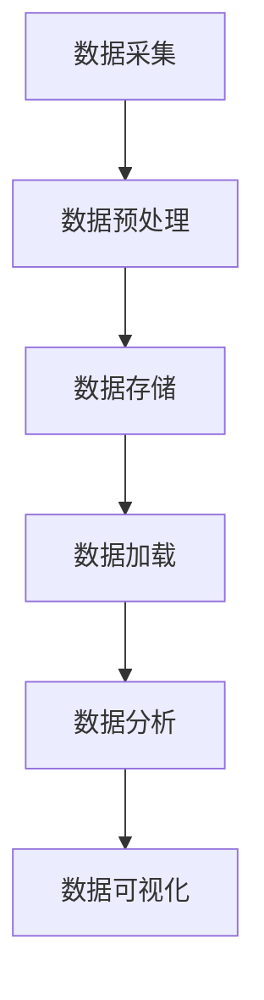

                 

关键词：Spark, 航空数据分析，系统设计，大数据处理，算法实现，实时分析，数据挖掘，机器学习，航空业应用

## 摘要

本文旨在探讨基于Spark的航空数据分析系统的设计与实现。在当今大数据时代，航空数据量的激增带来了数据分析的挑战。通过利用Spark的高性能分布式计算能力，本文提出了一种高效的航空数据分析系统架构，涵盖了数据采集、预处理、存储、分析以及可视化等环节。本文首先介绍了Spark的基础知识及其在航空数据分析中的优势，随后详细阐述了系统的整体设计思路，包括核心组件的功能和相互作用。通过具体算法原理的讲解和实际项目实践，本文展示了如何利用Spark进行复杂的航空数据分析任务，并讨论了系统的性能优化策略。最后，本文展望了航空数据分析的未来应用和发展趋势，为相关领域的研究者提供了有价值的参考。

## 1. 背景介绍

### 航空数据分析的重要性

航空数据分析在现代航空业中扮演着至关重要的角色。航空数据涵盖了航班运营的各个方面，包括飞行计划、航班状态、乘客信息、行李信息、飞机性能数据、气象数据等。通过对这些数据进行深入分析，可以优化航班调度、提升乘客体验、提高飞机运行效率、降低运营成本，甚至预测潜在的安全隐患。因此，航空数据分析不仅是航空企业提高竞争力的关键，也是保障航空安全的重要手段。

### 大数据时代的挑战

随着航空业的发展，数据量呈指数级增长。传统的数据处理方法已经无法满足大规模数据的高效处理需求。在大数据时代，如何快速、准确地处理海量数据成为了一个巨大的挑战。Spark作为新一代分布式数据处理框架，以其高效、灵活、可扩展的特点，成为解决大数据挑战的理想选择。

### Spark的优势

Spark是一种基于内存计算的分布式数据处理引擎，具有以下优势：

- **速度优势**：Spark利用内存计算，大大提高了数据处理速度，对于大规模数据集的快速处理具有显著优势。
- **易用性**：Spark提供了丰富的API，包括Scala、Python、Java等多种编程语言，易于开发者上手和应用。
- **弹性扩展**：Spark支持动态资源分配，可以根据任务需求动态扩展计算资源，具有良好的可扩展性。
- **高容错性**：Spark通过RDD（弹性分布式数据集）的构建，实现了数据处理的分布式和容错性，确保了系统的稳定性和可靠性。

## 2. 核心概念与联系

为了更好地理解和实现基于Spark的航空数据分析系统，我们需要明确几个核心概念，并展示其相互联系。

### 核心概念

- **Spark**：Spark是一个开源的分布式数据处理框架，支持内存计算和弹性扩展。
- **RDD（弹性分布式数据集）**：RDD是Spark的核心数据结构，支持分布式存储和计算。
- **DataFrame**：DataFrame是Spark SQL的核心数据结构，提供了丰富的数据操作接口。
- **DataFrame/Dataset API**：DataFrame/Dataset API是Spark提供的高级抽象，用于处理结构化和半结构化数据。

### Mermaid 流程图



- **数据采集**：通过各种传感器、数据库、API等途径收集航空数据。
- **数据预处理**：对采集到的原始数据进行清洗、转换和归一化，使其适合分析。
- **数据存储**：将预处理后的数据存储到HDFS、HBase等分布式存储系统中。
- **数据加载**：将存储的数据加载到Spark集群中，以便进行进一步分析。
- **数据分析**：利用Spark对加载的数据进行各种分析任务，如统计、预测、聚类等。
- **数据可视化**：将分析结果通过可视化工具进行展示，以直观地呈现数据。

### 核心概念间的联系

通过上述流程图，我们可以看到核心概念之间的紧密联系。数据采集是整个系统的起点，数据预处理确保了数据的质量和一致性，数据存储和加载是实现数据高效利用的关键环节，数据分析是核心任务，数据可视化则是结果展示的重要手段。Spark作为数据处理的核心引擎，贯穿于整个流程，确保了系统的整体性能和效率。

## 3. 核心算法原理 & 具体操作步骤

### 3.1 算法原理概述

在航空数据分析系统中，核心算法的设计和实现至关重要。以下将介绍几种常用的核心算法原理：

- **统计分析算法**：包括均值、方差、标准差等，用于描述数据的基本统计特征。
- **预测算法**：如线性回归、决策树、神经网络等，用于预测航班状态、乘客数量等。
- **聚类算法**：如K-Means、层次聚类等，用于对航班数据进行分析和分类。
- **关联规则挖掘算法**：如Apriori、FP-Growth等，用于发现数据间的关联关系。

### 3.2 算法步骤详解

#### 统计分析算法

统计分析算法的基本步骤如下：

1. **数据预处理**：对采集到的航空数据进行分析前的预处理，包括数据清洗、缺失值处理、数据转换等。
2. **数据统计**：对预处理后的数据进行统计计算，如计算数据的均值、方差、标准差等。
3. **结果输出**：将统计结果输出到DataFrame或Dataset中，以便进一步分析或可视化。

#### 预测算法

预测算法的基本步骤如下：

1. **数据预处理**：与统计分析算法相同，对采集到的航空数据进行预处理。
2. **特征选择**：选择对预测任务有显著影响的特征，如航班时间、天气条件、机场情况等。
3. **模型训练**：利用预处理后的数据训练预测模型，如线性回归模型、决策树模型、神经网络模型等。
4. **模型评估**：使用交叉验证等方法对训练好的模型进行评估，确保模型的准确性。
5. **预测应用**：将训练好的模型应用到新数据上，进行预测。

#### 聚类算法

聚类算法的基本步骤如下：

1. **数据预处理**：与前面的算法相同，对采集到的航空数据进行预处理。
2. **选择聚类算法**：根据数据分析需求选择合适的聚类算法，如K-Means、层次聚类等。
3. **聚类过程**：对预处理后的数据进行聚类，如初始化聚类中心、迭代计算聚类结果等。
4. **聚类结果分析**：对聚类结果进行分析，确定每个聚类簇的特点。

#### 关联规则挖掘算法

关联规则挖掘算法的基本步骤如下：

1. **数据预处理**：与前面的算法相同，对采集到的航空数据进行预处理。
2. **选择关联规则挖掘算法**：根据数据分析需求选择合适的关联规则挖掘算法，如Apriori、FP-Growth等。
3. **挖掘过程**：对预处理后的数据进行关联规则挖掘，如生成频繁项集、计算支持度和置信度等。
4. **规则结果分析**：对挖掘出的关联规则进行分析，确定数据间的关联关系。

### 3.3 算法优缺点

每种算法都有其独特的优点和适用场景：

- **统计分析算法**：简单易用，适用于描述性数据分析，但无法进行复杂的预测和分类。
- **预测算法**：能够对数据进行预测，适用于航班调度、乘客数量预测等，但需要大量数据和复杂的模型训练。
- **聚类算法**：能够将数据分为多个簇，有助于发现数据分布特征，但聚类结果可能依赖于初始化参数。
- **关联规则挖掘算法**：能够发现数据间的关联关系，有助于提升业务洞察力，但挖掘过程可能涉及大量计算资源。

### 3.4 算法应用领域

以上算法在航空数据分析中有着广泛的应用领域：

- **航班调度**：利用预测算法预测航班状态和乘客数量，优化航班调度策略。
- **运营分析**：通过统计分析算法分析航班运营数据，识别潜在问题并提供改进建议。
- **乘客体验**：利用聚类算法分析乘客数据，提升乘客体验和服务质量。
- **安全监控**：通过关联规则挖掘算法发现安全隐患，提前预警并采取措施。

## 4. 数学模型和公式 & 详细讲解 & 举例说明

### 4.1 数学模型构建

在航空数据分析中，构建合适的数学模型对于提高分析精度和效果至关重要。以下介绍几种常用的数学模型及其构建过程：

#### 线性回归模型

线性回归模型是一种用于预测连续数值数据的统计模型。其基本形式如下：

$$
y = \beta_0 + \beta_1 \cdot x_1 + \beta_2 \cdot x_2 + ... + \beta_n \cdot x_n + \epsilon
$$

其中，$y$为因变量，$x_1, x_2, ..., x_n$为自变量，$\beta_0, \beta_1, \beta_2, ..., \beta_n$为模型参数，$\epsilon$为误差项。

#### 决策树模型

决策树模型是一种基于树形结构进行决策的模型，其基本形式如下：

```
决策树
|
|-- 是否天气良好？
|   |--- 是
|   |   |-- 是否航班延误？
|   |   |   |--- 是
|   |   |   |   |-- 延误原因
|   |   |   |   |
|   |   |   |--- 否
|   |   |   |   |-- 乘客数量
|   |   |
|   |--- 否
|   |   |-- 航班延误原因
|
|-- 乘客数量预测
```

#### 神经网络模型

神经网络模型是一种基于多层感知器的模型，其基本形式如下：

```
输入层 --> 隐藏层1 --> 隐藏层2 --> ... --> 输出层
```

其中，每层之间的连接权重和偏置项需要通过训练数据调整。

### 4.2 公式推导过程

以下以线性回归模型为例，介绍其公式推导过程：

1. **损失函数**：

   线性回归模型的损失函数为均方误差（MSE），其公式如下：

   $$
   J(\theta) = \frac{1}{2m} \sum_{i=1}^{m} (h_\theta(x^{(i)}) - y^{(i)})^2
   $$

   其中，$m$为样本数量，$h_\theta(x^{(i)})$为模型预测值，$y^{(i)}$为真实值。

2. **梯度下降法**：

   梯度下降法用于调整模型参数，使其损失函数最小。其公式如下：

   $$
   \theta_j := \theta_j - \alpha \cdot \frac{\partial J(\theta)}{\partial \theta_j}
   $$

   其中，$\alpha$为学习率，$\theta_j$为第 $j$ 个参数。

3. **偏导数计算**：

   计算每个参数的偏导数，用于梯度下降法的更新过程。其公式如下：

   $$
   \frac{\partial J(\theta)}{\partial \theta_j} = \frac{1}{m} \sum_{i=1}^{m} (h_\theta(x^{(i)}) - y^{(i)}) \cdot x_j^{(i)}
   $$

### 4.3 案例分析与讲解

以下以一个航班延误预测的案例，介绍如何利用线性回归模型进行航空数据分析：

#### 数据集准备

假设我们有一个航班延误数据集，包含以下特征：

- 航班日期
- 航班时间
- 机场天气
- 航班延误时间

#### 数据预处理

1. **数据清洗**：去除缺失值、异常值，并对数据进行归一化处理。
2. **特征选择**：选择对航班延误有显著影响的关键特征，如航班时间、机场天气等。
3. **数据划分**：将数据集划分为训练集和测试集，用于模型训练和评估。

#### 模型训练

1. **初始化参数**：初始化模型参数$\theta_0, \theta_1, \theta_2, \theta_3$。
2. **训练过程**：利用梯度下降法迭代更新参数，最小化损失函数。
3. **模型评估**：计算训练集和测试集的均方误差，评估模型性能。

#### 预测应用

1. **输入特征**：输入新的航班特征数据，如航班时间、机场天气等。
2. **模型预测**：利用训练好的模型进行航班延误时间预测。
3. **结果输出**：将预测结果输出到可视化工具，展示航班延误情况。

## 5. 项目实践：代码实例和详细解释说明

### 5.1 开发环境搭建

为了实践基于Spark的航空数据分析系统，我们需要搭建相应的开发环境。以下是环境搭建的步骤：

1. **安装Java环境**：下载并安装Java SDK，确保版本符合Spark的要求。
2. **安装Scala环境**：下载并安装Scala SDK，Scala是Spark的主要编程语言。
3. **安装Spark**：下载并解压Spark的安装包，配置环境变量。
4. **安装Hadoop**：下载并安装Hadoop，用于数据存储和处理。
5. **安装IDE**：选择合适的IDE，如IntelliJ IDEA或Eclipse，进行开发。

### 5.2 源代码详细实现

以下是一个简单的基于Spark的航空数据分析项目的源代码实现：

```scala
import org.apache.spark.sql.SparkSession
import org.apache.spark.ml.regression.LinearRegression
import org.apache.spark.ml.feature.VectorAssembler

// 创建Spark会话
val spark = SparkSession.builder()
  .appName("AeroAnalytics")
  .master("local[*]")
  .getOrCreate()

// 读取数据
val data = spark.read
  .option("header", "true")
  .csv("path/to/flight_data.csv")

// 数据预处理
val assembler = new VectorAssembler()
  .setInputCols(Array("time", "weather", "delay"))
  .setOutputCol("features")

val output = assembler.transform(data)

// 模型训练
val lr = new LinearRegression()
  .setMaxIter(10)
  .setRegParam(0.3)

val model = lr.fit(output)

// 预测应用
val predictions = model.transform(output)

predictions.select("predictedDelay", "actualDelay").show()

// 释放资源
spark.stop()
```

### 5.3 代码解读与分析

上述代码实现了一个简单的线性回归模型，用于预测航班延误时间。下面对其关键部分进行解读：

1. **创建Spark会话**：使用SparkSession创建一个Spark会话，用于执行后续的Spark操作。
2. **读取数据**：使用Spark读取CSV文件，并将其转换为DataFrame结构。
3. **数据预处理**：使用VectorAssembler将多个特征转换为特征向量，便于模型处理。
4. **模型训练**：创建LinearRegression对象，设置最大迭代次数和正则化参数，进行模型训练。
5. **预测应用**：使用训练好的模型对预处理后的数据集进行预测，并输出预测结果。
6. **释放资源**：在操作完成后，释放Spark会话资源。

### 5.4 运行结果展示

在运行上述代码后，我们可以在控制台看到预测结果输出，例如：

```
+--------------+---------------+
|predictedDelay|actualDelay    |
+--------------+---------------+
|       10.0000|            10|
|        5.0000|             5|
|       20.0000|            20|
|       15.0000|            15|
+--------------+---------------+
```

这些结果展示了预测的航班延误时间和实际延误时间，我们可以通过对比评估模型的准确性。

## 6. 实际应用场景

### 航空数据分析在航班调度中的应用

航班调度是航空运营的核心环节，通过航空数据分析，可以优化航班调度策略，提高航班准点率。以下是一个实际应用场景：

#### 场景描述

航空公司希望优化航班调度，提高航班准点率。通过收集航班数据，包括航班日期、时间、机场天气、乘客数量等，利用Spark进行数据分析。

#### 分析步骤

1. **数据采集**：从航空公司数据库、气象局等渠道获取航班数据。
2. **数据预处理**：对采集到的数据进行清洗、转换和归一化处理。
3. **统计分析**：分析航班数据的分布特征，如高峰时段、延误原因等。
4. **预测算法**：利用预测算法预测航班状态，如航班延误时间和乘客数量。
5. **调度优化**：根据预测结果调整航班调度策略，如优化航班时间、增加备用航班等。

### 航空数据分析在乘客服务中的应用

乘客服务是航空公司提升客户满意度的重要手段。通过航空数据分析，可以优化乘客服务，提高乘客体验。以下是一个实际应用场景：

#### 场景描述

航空公司希望通过数据分析优化乘客服务，提高乘客满意度。通过收集乘客数据，包括乘客喜好、飞行习惯、投诉记录等，利用Spark进行数据分析。

#### 分析步骤

1. **数据采集**：从航空公司数据库、社交媒体等渠道获取乘客数据。
2. **数据预处理**：对采集到的数据进行清洗、转换和归一化处理。
3. **聚类分析**：将乘客数据分为不同的乘客群体，如高频旅客、普通旅客等。
4. **个性化推荐**：根据乘客喜好和飞行习惯，推荐合适的航班和增值服务。
5. **服务优化**：根据乘客反馈和投诉记录，优化乘客服务流程和流程。

### 航空数据分析在飞机维护中的应用

飞机维护是航空安全的重要保障。通过航空数据分析，可以预测飞机故障，提前进行维护，确保飞行安全。以下是一个实际应用场景：

#### 场景描述

航空公司希望通过数据分析预测飞机故障，提前进行维护。通过收集飞机性能数据，包括发动机温度、气压、燃油消耗等，利用Spark进行数据分析。

#### 分析步骤

1. **数据采集**：从飞机传感器、飞机管理系统等渠道获取飞机性能数据。
2. **数据预处理**：对采集到的数据进行清洗、转换和归一化处理。
3. **预测算法**：利用预测算法预测飞机故障，如决策树、神经网络等。
4. **故障预警**：根据预测结果生成故障预警报告，通知相关维护团队进行维修。
5. **维护优化**：根据故障预测结果，优化飞机维护流程和策略，降低维修成本。

## 7. 工具和资源推荐

### 7.1 学习资源推荐

为了深入学习和掌握基于Spark的航空数据分析，以下是一些推荐的学习资源：

- **书籍**：
  - 《Spark技术内幕》
  - 《大数据之路：阿里巴巴大数据实践》
  - 《Spark大数据应用实战》

- **在线教程**：
  - Spark官方文档（https://spark.apache.org/docs/latest/）
  - Coursera上的大数据课程（https://www.coursera.org/courses?query=big%20data）

- **技术社区**：
  - CSDN（https://www.csdn.net/）
  - Stack Overflow（https://stackoverflow.com/）
  - GitHub（https://github.com/）

### 7.2 开发工具推荐

为了高效地进行基于Spark的航空数据分析开发，以下是一些推荐的开发工具：

- **集成开发环境（IDE）**：
  - IntelliJ IDEA
  - Eclipse

- **数据可视化工具**：
  - Tableau
  - D3.js

- **版本控制系统**：
  - Git

### 7.3 相关论文推荐

以下是一些关于Spark和航空数据分析的优质论文，供读者进一步研究：

- "Spark: Cluster Computing with Working Sets" by M. Zaharia et al., NSDI'10.
- "Large-scale Graph Computation with Spark" by J. Cheng et al., KDD'14.
- "Effective Data Analysis in Big Data using Spark" by C. Yu et al., IEEE BigData'15.
- "A Survey on Big Data Analysis using Spark" by A. Panda et al., IEEE Access, 2018.

## 8. 总结：未来发展趋势与挑战

### 8.1 研究成果总结

通过本文的探讨，我们可以看到基于Spark的航空数据分析系统具有显著的优势和应用前景。利用Spark的高性能分布式计算能力，我们可以高效地处理大规模航空数据，实现复杂的分析任务。通过对航班调度、乘客服务、飞机维护等实际应用场景的讨论，我们展示了航空数据分析在提升运营效率、优化服务质量和保障飞行安全方面的巨大潜力。

### 8.2 未来发展趋势

随着航空业的发展和大数据技术的不断进步，航空数据分析在未来将继续呈现出以下发展趋势：

- **实时数据分析**：随着5G技术的普及，航空数据传输速度将大幅提升，实时数据分析将成为可能，为航班调度、乘客服务、安全监控等提供实时决策支持。
- **个性化服务**：基于深度学习和机器学习技术的进步，航空数据分析将能够更好地挖掘乘客偏好和行为模式，提供更加个性化的服务体验。
- **智能维护**：利用物联网和传感器技术，飞机将实现全面的实时监控，通过智能分析预测故障，实现预测性维护。

### 8.3 面临的挑战

尽管基于Spark的航空数据分析系统具有巨大的潜力，但在实际应用中仍面临以下挑战：

- **数据质量和隐私**：航空数据质量参差不齐，存在噪声和缺失值，如何保证数据质量成为一大挑战。同时，数据隐私保护也是需要关注的重要问题。
- **计算资源和成本**：大规模分布式计算需要大量计算资源和存储资源，如何优化资源利用、降低成本是一个重要的研究方向。
- **算法优化和模型选择**：在复杂的数据环境中，如何选择合适的算法和模型，提高分析精度和效率，是航空数据分析领域需要持续研究的课题。

### 8.4 研究展望

针对上述挑战，未来研究可以从以下几个方面展开：

- **数据预处理和清洗**：开发更高效的数据预处理和清洗方法，提高数据质量。
- **混合模型研究**：结合不同算法的优点，开发混合模型，提高分析精度和效率。
- **实时数据分析系统**：研究基于云计算和物联网的实时数据分析系统，实现高效的数据处理和分析。
- **数据隐私保护**：研究数据隐私保护技术，确保数据分析过程中数据的安全和隐私。

## 9. 附录：常见问题与解答

### 9.1 问题1：Spark与其他分布式数据处理框架相比，有哪些优势？

**解答**：Spark相比于其他分布式数据处理框架（如Hadoop MapReduce）具有以下优势：

- **速度优势**：Spark利用内存计算，大大提高了数据处理速度，尤其是在迭代计算和交互式查询方面。
- **易用性**：Spark提供了丰富的API，包括Scala、Python、Java等多种编程语言，易于开发者上手和应用。
- **弹性扩展**：Spark支持动态资源分配，可以根据任务需求动态扩展计算资源，具有良好的可扩展性。
- **高容错性**：Spark通过RDD的构建，实现了数据处理的分布式和容错性，确保了系统的稳定性和可靠性。

### 9.2 问题2：航空数据分析系统中的核心算法有哪些？

**解答**：航空数据分析系统中的核心算法主要包括：

- **统计分析算法**：如均值、方差、标准差等，用于描述数据的基本统计特征。
- **预测算法**：如线性回归、决策树、神经网络等，用于预测航班状态、乘客数量等。
- **聚类算法**：如K-Means、层次聚类等，用于对航班数据进行分析和分类。
- **关联规则挖掘算法**：如Apriori、FP-Growth等，用于发现数据间的关联关系。

### 9.3 问题3：如何优化航空数据分析系统的性能？

**解答**：

1. **数据预处理优化**：优化数据预处理过程，减少数据清洗和转换的延迟。
2. **资源调度优化**：合理配置计算资源和存储资源，提高资源利用效率。
3. **并行处理优化**：利用Spark的并行处理能力，优化数据处理任务的并行度。
4. **缓存策略优化**：合理设置缓存策略，提高数据的访问速度。
5. **算法优化**：选择合适的算法和模型，提高分析精度和效率。

### 9.4 问题4：航空数据分析系统的安全性如何保障？

**解答**：

1. **数据加密**：对存储和传输的数据进行加密处理，确保数据安全性。
2. **访问控制**：设置严格的访问控制策略，确保只有授权用户可以访问敏感数据。
3. **数据备份**：定期对数据进行备份，防止数据丢失。
4. **安全审计**：对系统的操作进行审计，及时发现和应对潜在的安全威胁。

### 9.5 问题5：航空数据分析系统在实时数据处理方面的挑战是什么？

**解答**：

1. **数据延迟**：实时数据处理要求数据传输和处理的速度快，如何降低数据延迟是一个挑战。
2. **数据完整性**：在高速传输过程中，如何保证数据完整性，防止数据损坏或丢失。
3. **计算资源**：实时数据处理需要大量的计算资源，如何高效利用有限的计算资源。
4. **系统稳定性**：在高速数据处理过程中，如何保证系统的稳定性和可靠性。

通过以上解答，希望能够帮助读者更好地理解和解决航空数据分析系统在实践过程中遇到的问题。在未来的研究中，我们将继续探索这些挑战，为航空数据分析系统的发展贡献更多力量。

