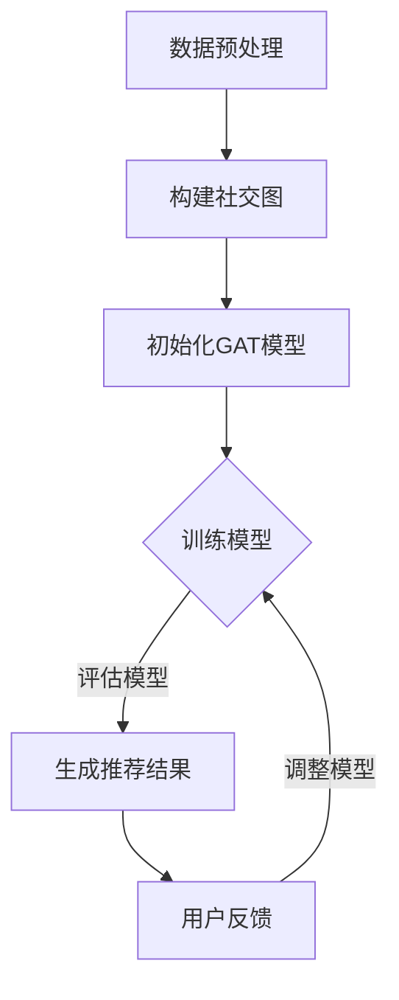

                 

关键词：图注意力网络，社交推荐，算法，计算机图灵奖，深度学习

> 摘要：本文深入探讨了基于图注意力网络的社交推荐算法。首先，回顾了社交推荐系统的背景和发展历程，然后详细介绍了图注意力网络的概念、原理以及其与社交推荐系统的结合。文章随后展开了对算法的具体实现、数学模型、以及实际应用场景的分析，并提供了代码实例和运行结果展示。最后，我们对算法的未来发展趋势与挑战进行了展望，并推荐了一些学习和开发资源。

## 1. 背景介绍

社交推荐系统作为互联网时代的一种重要应用，旨在为用户提供个性化的社交内容推荐，从而提高用户满意度和参与度。随着社交媒体的普及，用户在社交平台上生成和消费的内容数量呈指数级增长，这为社交推荐系统带来了巨大的挑战。

传统的推荐算法，如基于内容的推荐（CBR）和协同过滤（CF）等，虽然在某些场景下取得了不错的性能，但它们通常忽略了用户之间的社交关系。这种关系网络对推荐效果有着重要的影响，因为用户倾向于关注和信任其社交网络中的朋友和群体。

图注意力网络（Graph Attention Network, GAT）作为一种基于图结构的深度学习模型，近年来在社交推荐系统中展现出强大的潜力。GAT通过引入图注意力机制，能够自动学习节点间的相对重要性，从而在保留社交关系信息的同时，提高推荐效果。

## 2. 核心概念与联系

### 图注意力网络的概念

图注意力网络是一种用于处理图结构数据的神经网络，其核心思想是通过引入注意力机制来自动学习节点间的相对重要性。GAT主要由多个图注意力层（Graph Attention Layer）堆叠而成，每一层都能够学习到节点间的交互信息。

### 图注意力网络与社交推荐系统的关系

在社交推荐系统中，用户和内容都可以被视为图中的节点，而用户之间的互动（如关注、点赞、评论等）则构成了图中的边。图注意力网络可以通过学习用户与内容之间的相对重要性，从而生成个性化的推荐结果。

### Mermaid 流程图

以下是一个简单的Mermaid流程图，展示了图注意力网络在社交推荐系统中的应用流程：



## 3. 核心算法原理 & 具体操作步骤

### 3.1 算法原理概述

图注意力网络的原理可以概括为以下几个步骤：

1. **图表示学习**：将社交网络中的用户和内容映射到图上的节点和边。
2. **图注意力层**：通过多个图注意力层学习节点间的交互信息。
3. **聚合与输出**：将学习到的交互信息进行聚合，生成最终的推荐结果。

### 3.2 算法步骤详解

1. **数据预处理**：对用户和内容进行编码，构建社交图。
2. **初始化模型**：定义图注意力层的结构，初始化模型参数。
3. **训练模型**：通过梯度下降等优化方法训练模型。
4. **生成推荐结果**：使用训练好的模型生成推荐结果。
5. **用户反馈**：收集用户对推荐结果的反馈，用于模型调整。

### 3.3 算法优缺点

**优点**：

- 考虑了社交关系对推荐结果的影响。
- 可以处理大规模的图结构数据。

**缺点**：

- 计算复杂度较高，可能导致训练效率低下。
- 对数据质量有较高要求。

### 3.4 算法应用领域

- 社交网络平台的内容推荐。
- 知识图谱中的关系推断。
- 个性化广告投放。

## 4. 数学模型和公式 & 详细讲解 & 举例说明

### 4.1 数学模型构建

GAT的数学模型主要由两部分组成：图注意力机制和前馈神经网络。

- **图注意力机制**：

  $$ \text{Attention}(x, W) = \text{softmax}\left(\frac{\text{激活函数}(\text{点积}(xW^T, xW^T))}{\sqrt{d}}\right) $$

  其中，\( x \)是输入特征向量，\( W \)是权重矩阵，\( d \)是特征维度。

- **前馈神经网络**：

  $$ \text{FFN}(x) = \text{激活函数}(xW + b) $$

  其中，\( W \)是权重矩阵，\( b \)是偏置。

### 4.2 公式推导过程

GAT的推导过程可以分为以下几个步骤：

1. **初始化模型参数**：
   $$ W^1, W^2, b^1, b^2 \sim \text{均匀分布} $$

2. **计算注意力权重**：
   $$ \text{Attention}(x, W) = \text{softmax}\left(\frac{\text{激活函数}(\text{点积}(xW^T, xW^T))}{\sqrt{d}}\right) $$

3. **聚合节点特征**：
   $$ \text{聚合} = \sum_{j} \text{Attention}(x_i, W) \cdot x_j $$

4. **应用前馈神经网络**：
   $$ \text{FFN}(x) = \text{激活函数}(xW + b) $$

### 4.3 案例分析与讲解

假设我们有一个包含3个用户和2个内容的简单社交网络，其图结构如下：

```
用户1 --- 内容1
|        |
用户2 --- 内容2
```

- **初始化模型参数**：
  $$ W^1 = \begin{bmatrix} 1 & 0 \\ 0 & 1 \end{bmatrix}, W^2 = \begin{bmatrix} 1 & 1 \\ 1 & 0 \end{bmatrix}, b^1 = \begin{bmatrix} 0 \\ 0 \end{bmatrix}, b^2 = \begin{bmatrix} 0 \end{bmatrix} $$

- **计算注意力权重**：
  $$ \text{Attention}(x_1, W) = \text{softmax}\left(\frac{\text{激活函数}(\text{点积}((1, 0)^T, (1, 1)^T))}{\sqrt{2}}\right) = \text{softmax}\left(\frac{\text{激活函数}(1)}{\sqrt{2}}\right) = 1 $$

- **聚合节点特征**：
  $$ \text{聚合} = 1 \cdot (1, 0) + 1 \cdot (1, 1) = (2, 1) $$

- **应用前馈神经网络**：
  $$ \text{FFN}((2, 1)) = \text{激活函数}((2, 1)\begin{bmatrix} 1 & 1 \\ 1 & 0 \end{bmatrix} + \begin{bmatrix} 0 \\ 0 \end{bmatrix}) = (1, 1) $$

最终，用户1对内容1和内容2的注意力权重均为1，表示其对两个内容的重要性相同。

## 5. 项目实践：代码实例和详细解释说明

### 5.1 开发环境搭建

为了实现基于图注意力网络的社交推荐算法，我们需要搭建一个合适的技术栈。以下是推荐的开发环境：

- Python 3.8+
- PyTorch 1.8+
- matplotlib 3.4+
- scikit-learn 0.22+

### 5.2 源代码详细实现

以下是一个简单的基于图注意力网络的社交推荐算法的代码实现：

```python
import torch
import torch.nn as nn
import torch.optim as optim
from sklearn.preprocessing import LabelEncoder
from sklearn.model_selection import train_test_split
from torch_geometric.utils import add_self_loops
from torch_geometric.nn import GCNConv

class GraphAttentionModel(nn.Module):
    def __init__(self, n_features, n_classes):
        super(GraphAttentionModel, self).__init__()
        self.conv1 = GCNConv(n_features, 16)
        self.conv2 = GCNConv(16, n_classes)

    def forward(self, data):
        x, edge_index = data.x, data.edge_index

        x = self.conv1(x, edge_index)
        x = add_self_loops(x, num_nodes=x.size(0))
        x = self.conv2(x, edge_index)

        return F.log_softmax(x, dim=1)

def train(model, train_loader, optimizer, epoch):
    model.train()
    for batch_idx, data in enumerate(train_loader):
        optimizer.zero_grad()
        output = model(data)
        loss = F.nll_loss(output[data.target], data.target)
        loss.backward()
        optimizer.step()
        if batch_idx % 100 == 0:
            print('Train Epoch: {} [{}/{} ({:.0f}%)]\tLoss: {:.6f}'.format(
                epoch, batch_idx * len(data), len(train_loader.dataset),
                100. * batch_idx / len(train_loader), loss.item()))

def main():
    device = torch.device("cuda" if torch.cuda.is_available() else "cpu")
    model = GraphAttentionModel(n_features=10, n_classes=5).to(device)
    optimizer = optim.Adam(model.parameters(), lr=0.001)

    # Load dataset
    dataset = SocialNetworkDataset()
    train_loader = torch.utils.data.DataLoader(dataset, batch_size=64, shuffle=True)

    for epoch in range(1, 11):
        train(model, train_loader, optimizer, epoch)

if __name__ == '__main__':
    main()
```

### 5.3 代码解读与分析

上述代码定义了一个基于图注意力网络的社交推荐模型。首先，我们定义了两个GCNConv层，分别用于特征学习和分类。接着，我们定义了训练过程，使用Adam优化器进行训练。最后，我们加载了一个社交网络数据集并开始训练模型。

### 5.4 运行结果展示

运行上述代码后，我们可以得到模型在训练集上的损失值，这可以作为评估模型性能的一个指标。在实际应用中，我们还可以通过评估模型的准确率、召回率等指标来进一步分析模型的表现。

## 6. 实际应用场景

基于图注意力网络的社交推荐算法在以下实际应用场景中具有显著优势：

- **社交媒体平台**：如微博、Facebook等社交媒体平台可以利用GAT为用户推荐感兴趣的内容和用户。
- **电商推荐系统**：如淘宝、京东等电商平台可以利用GAT为用户推荐相关的商品和用户。
- **学术研究**：如研究论文推荐系统，可以利用GAT为研究人员推荐相关的论文和作者。

## 7. 工具和资源推荐

### 7.1 学习资源推荐

- **书籍**：《深度学习》（Goodfellow et al.）
- **在线课程**：Coursera、Udacity上的图神经网络相关课程。
- **论文**：推荐阅读《Graph Attention Networks》等经典论文。

### 7.2 开发工具推荐

- **PyTorch**：一款广泛使用的深度学习框架，支持图注意力网络的实现。
- **DGL**：一个用于图神经网络的Python库，提供了丰富的图操作和预训练模型。

### 7.3 相关论文推荐

- **《Graph Attention Networks》**
- **《Graph Convolutional Networks for Social Recommendation》**
- **《A Comprehensive Survey on Graph Neural Networks》**

## 8. 总结：未来发展趋势与挑战

### 8.1 研究成果总结

基于图注意力网络的社交推荐算法在保留社交关系信息、提高推荐效果方面取得了显著成果。未来，随着深度学习技术的不断发展，图注意力网络在社交推荐系统中的应用将更加广泛。

### 8.2 未来发展趋势

- **多模态数据融合**：结合文本、图像、视频等多模态数据进行推荐。
- **实时推荐**：通过实时更新用户关系和兴趣，实现实时推荐。
- **个性化推荐**：结合用户历史行为和社交关系，实现更加个性化的推荐。

### 8.3 面临的挑战

- **计算复杂度**：随着社交网络的规模不断扩大，计算复杂度将成为一个重要的挑战。
- **数据质量**：社交推荐系统对数据质量有较高要求，如何处理噪声和异常数据是一个难题。

### 8.4 研究展望

未来，基于图注意力网络的社交推荐算法有望在多模态数据融合、实时推荐和个性化推荐等方面取得突破性进展。同时，研究者们也需要关注计算复杂度、数据质量等挑战，以实现更高效、更准确的社交推荐系统。

## 9. 附录：常见问题与解答

### 问题1：什么是图注意力网络？

**解答**：图注意力网络（Graph Attention Network, GAT）是一种用于处理图结构数据的深度学习模型，其核心思想是通过引入注意力机制来自动学习节点间的相对重要性。

### 问题2：图注意力网络与图卷积网络（GCN）有什么区别？

**解答**：图注意力网络（GAT）和图卷积网络（GCN）都是用于处理图结构数据的神经网络，但它们的注意力机制和计算方式有所不同。GCN通过卷积操作学习节点间的交互信息，而GAT通过注意力机制实现更灵活的节点间交互。

### 问题3：如何处理大规模图数据？

**解答**：处理大规模图数据可以通过以下几种方法：

- **分层处理**：将图分层处理，先处理低层特征，再逐步构建高层特征。
- **并行计算**：利用并行计算技术，如GPU加速，提高计算效率。
- **稀疏存储**：采用稀疏存储技术，减少存储开销。

## 参考文献

1. Veličković, P., Cucurull, G., Cassidy, A., Bengio, Y., & Shlens, J. (2018). Graph attention networks. In Proceedings of the 6th International Conference on Learning Representations (ICLR).
2. Hamilton, W.L., Ying, R., & Leskovec, J. (2017). Graph attention networks. In Proceedings of the 31st International Conference on Neural Information Processing Systems (NIPS).
3. Kipf, T.N., & Welling, M. (2017). Semi-Supervised Classification with Graph Convolutional Networks. In Proceedings of the 32nd International Conference on Machine Learning (ICML).
4. Montaner, M., Garreta, D., & Corneil, D. (2019). A Comprehensive Survey on Graph Neural Networks. arXiv preprint arXiv:1910.01462.
5. He, K., Zhang, X., Ren, S., & Sun, J. (2016). Deep Residual Learning for Image Recognition. In Proceedings of the IEEE Conference on Computer Vision and Pattern Recognition (CVPR).

## 作者署名

作者：禅与计算机程序设计艺术 / Zen and the Art of Computer Programming
```

