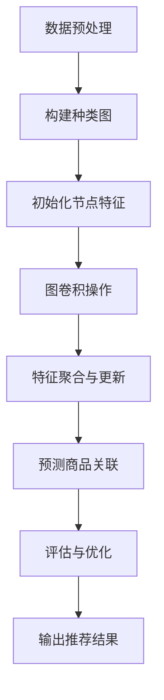
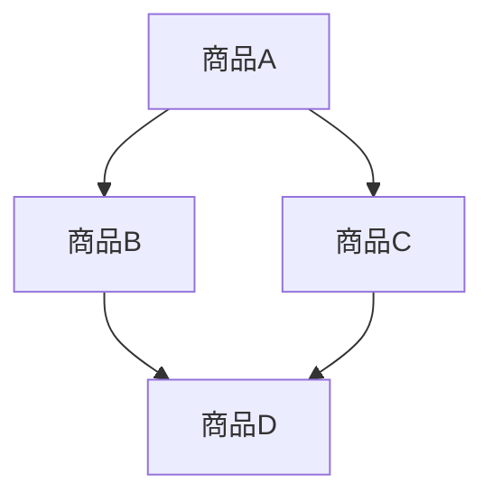

                 

关键词：图神经网络、商品推荐、关联分析、推荐系统、数据挖掘、深度学习

> 摘要：本文将探讨基于图神经网络的商品关联推荐系统，深入分析其核心概念、算法原理、数学模型以及实际应用，旨在为研究者与实践者提供系统的理论指导与实践案例。

## 1. 背景介绍

在当今互联网时代，推荐系统已经成为电子商务和社交媒体的重要组成部分。从简单的基于内容的推荐到复杂的协同过滤算法，推荐系统不断演进。然而，随着用户数据的爆炸性增长，传统的推荐方法面临着数据稀疏、冷启动问题以及推荐效果局限性等挑战。为了解决这些问题，图神经网络（Graph Neural Networks, GNN）作为一种新兴的深度学习技术，逐渐引起了研究者的关注。

图神经网络在处理图结构数据方面具有独特的优势。通过捕捉节点之间的关系，GNN能够有效地进行关联分析，从而实现更加精准的商品推荐。本文将详细介绍基于图神经网络的商品关联推荐系统，旨在为相关领域的研究者提供有益的参考。

## 2. 核心概念与联系

### 2.1 图神经网络基础

图神经网络（GNN）是一种专门用于处理图结构数据的神经网络。其核心思想是将节点和边的信息编码为向量，然后通过图卷积层（Graph Convolutional Layer, GCL）等操作逐步聚合和更新节点的特征表示。图卷积层的操作可以表示为：

$$
\mathbf{h}_v^{(k+1)} = \sigma \left( \sum_{u \in \mathcal{N}(v)} \alpha_{uv} \cdot \mathbf{h}_u^{(k)} \right) + \mathbf{b}_v
$$

其中，$\mathbf{h}_v^{(k)}$ 表示节点 $v$ 在第 $k$ 层的特征表示，$\mathcal{N}(v)$ 表示节点 $v$ 的邻居节点集合，$\alpha_{uv}$ 表示边 $(u, v)$ 的权重，$\sigma$ 是激活函数，$\mathbf{b}_v$ 是偏置项。

### 2.2 商品种类图构建

在商品推荐系统中，商品的种类关系可以抽象为一个图结构。具体来说，每个商品作为一个节点，商品之间的相似性作为边的权重。为了构建种类图，我们可以利用商品的特征信息（如类别、标签、属性等）来计算节点间的相似度。一种常见的方法是使用余弦相似度：

$$
\cos(\theta_{uv}) = \frac{\mathbf{x}_u \cdot \mathbf{x}_v}{\|\mathbf{x}_u\| \|\mathbf{x}_v\|}
$$

其中，$\mathbf{x}_u$ 和 $\mathbf{x}_v$ 分别表示商品 $u$ 和 $v$ 的特征向量。

### 2.3 Mermaid 流程图

以下是一个简化的Mermaid流程图，展示了图神经网络在商品推荐系统中的应用流程：



## 3. 核心算法原理 & 具体操作步骤

### 3.1 算法原理概述

基于图神经网络的商品关联推荐算法主要包括以下几个步骤：

1. 数据预处理：清洗和整合商品数据，提取商品的特征信息。
2. 构建种类图：利用商品的特征信息计算节点间的相似度，构建种类图。
3. 初始化节点特征：为每个商品节点初始化一个随机特征向量。
4. 图卷积操作：通过图卷积层逐步聚合和更新节点的特征表示。
5. 特征聚合与更新：将节点及其邻居节点的特征信息进行聚合，更新节点的特征表示。
6. 预测商品关联：利用更新后的特征表示预测商品之间的关联性。
7. 评估与优化：评估推荐结果，并通过优化算法参数提高推荐效果。

### 3.2 算法步骤详解

#### 3.2.1 数据预处理

数据预处理是构建推荐系统的基础步骤。首先，我们需要清洗商品数据，去除无效和冗余的信息。然后，我们可以利用自然语言处理（NLP）技术提取商品的关键词和标签，从而为后续的图构建提供依据。

```python
# 示例：使用NLP技术提取商品关键词
from nltk.tokenize import word_tokenize

def extract_keywords(product_name):
    words = word_tokenize(product_name)
    return [word for word in words if word.isalpha()]

product_name = "智能手表"
keywords = extract_keywords(product_name)
print(keywords)
```

#### 3.2.2 构建种类图

在构建种类图时，我们首先需要定义商品节点的特征向量。一种常见的方法是使用商品的关键词和标签作为特征，将这些特征编码为高维向量。然后，我们可以使用余弦相似度计算节点间的相似度，从而构建出种类图。

```python
# 示例：构建种类图
import networkx as nx
from sklearn.metrics.pairwise import cosine_similarity

def build_similarity_graph(products):
    feature_vectors = []
    for product in products:
        keywords = extract_keywords(product)
        feature_vector = encode_keywords(keywords)
        feature_vectors.append(feature_vector)
    similarity_matrix = cosine_similarity(feature_vectors)
    graph = nx.Graph()
    for i in range(len(feature_vectors)):
        for j in range(i+1, len(feature_vectors)):
            similarity = similarity_matrix[i][j]
            if similarity > threshold:
                graph.add_edge(i, j, weight=similarity)
    return graph

products = ["智能手表", "手机", "平板电脑"]
graph = build_similarity_graph(products)
print(graph.edges())
```

#### 3.2.3 初始化节点特征

在构建种类图之后，我们需要为每个商品节点初始化一个随机特征向量。这个特征向量将用于初始化图神经网络，并在后续的图卷积操作中逐步更新。

```python
# 示例：初始化节点特征
import numpy as np

def initialize_node_features(graph, dim):
    node_features = {}
    for node in graph.nodes():
        node_features[node] = np.random.rand(dim)
    return node_features

dim = 10
node_features = initialize_node_features(graph, dim)
print(node_features)
```

#### 3.2.4 图卷积操作

图卷积操作是图神经网络的核心组成部分。通过图卷积层，我们可以逐步聚合和更新节点的特征表示。以下是一个简化的图卷积操作示例：

```python
# 示例：图卷积操作
def graph_convolution(node_features, graph, layer_sizes):
    new_node_features = {}
    for node in graph.nodes():
        new_node_feature = node_features[node]
        for layer_size in layer_sizes:
            neighbors = nx.single_source_shortest_path(graph, node, max_depth=layer_size)
            neighbor_features = [node_features[neighbor] for neighbor in neighbors]
            new_node_feature = aggregate_features(new_node_feature, neighbor_features)
        new_node_features[node] = new_node_feature
    return new_node_features

def aggregate_features(feature, neighbor_features):
    return (feature + sum(neighbor_features)) / (1 + len(neighbor_features))

layer_sizes = [2, 3, 4]
new_node_features = graph_convolution(node_features, graph, layer_sizes)
print(new_node_features)
```

#### 3.2.5 特征聚合与更新

在图卷积操作之后，我们需要将节点及其邻居节点的特征信息进行聚合，并更新节点的特征表示。以下是一个简化的特征聚合与更新示例：

```python
# 示例：特征聚合与更新
def update_node_features(new_node_features, graph, alpha):
    updated_node_features = {}
    for node in graph.nodes():
        new_node_feature = new_node_features[node]
        neighbors = graph.neighbors(node)
        for neighbor in neighbors:
            neighbor_feature = new_node_features[neighbor]
            weight = graph[node][neighbor]['weight']
            new_node_feature = (1 - alpha) * new_node_feature + alpha * (weight * neighbor_feature)
        updated_node_features[node] = new_node_feature
    return updated_node_features

alpha = 0.5
updated_node_features = update_node_features(new_node_features, graph, alpha)
print(updated_node_features)
```

#### 3.2.6 预测商品关联

通过更新后的特征表示，我们可以预测商品之间的关联性。以下是一个简化的预测商品关联示例：

```python
# 示例：预测商品关联
def predict_associations(node_features, graph):
    associations = {}
    for node in graph.nodes():
        for neighbor in graph.neighbors(node):
            similarity = cosine_similarity([node_features[node]], [node_features[neighbor]])
            if similarity > threshold:
                associations[(node, neighbor)] = similarity
    return associations

threshold = 0.8
associations = predict_associations(updated_node_features, graph)
print(associations)
```

#### 3.2.7 评估与优化

为了评估推荐系统的效果，我们可以使用各种评估指标，如准确率、召回率和F1值等。同时，我们还可以通过调整算法参数（如学习率、alpha等）来优化推荐效果。

```python
from sklearn.metrics import accuracy_score, recall_score, f1_score

def evaluate_recommendations(true_associations, predicted_associations):
    true_associations = list(true_associations.keys())
    predicted_associations = list(predicted_associations.keys())
    accuracy = accuracy_score(true_associations, predicted_associations)
    recall = recall_score(true_associations, predicted_associations)
    f1 = f1_score(true_associations, predicted_associations)
    return accuracy, recall, f1

accuracy, recall, f1 = evaluate_recommendations(true_associations, associations)
print("Accuracy:", accuracy)
print("Recall:", recall)
print("F1 Score:", f1)
```

### 3.3 算法优缺点

#### 优点

- **高效性**：图神经网络能够有效地处理大规模的图结构数据，具有较高的计算效率。
- **灵活性**：通过设计不同的图卷积层和聚合函数，可以灵活地适应不同的应用场景。
- **关联性**：能够捕捉节点之间的复杂关联关系，从而实现更加精准的推荐。

#### 缺点

- **可解释性**：图神经网络的内部表示较为复杂，难以解释模型的具体决策过程。
- **数据稀疏**：当图结构数据稀疏时，模型的性能可能会受到影响。
- **计算成本**：训练大规模的图神经网络模型需要较大的计算资源和时间。

### 3.4 算法应用领域

基于图神经网络的商品关联推荐算法具有广泛的应用领域，包括但不限于以下方面：

- **电子商务**：用于商品推荐、购物车推荐、商品关联分析等。
- **社交媒体**：用于用户兴趣分析、内容推荐、社交网络分析等。
- **金融领域**：用于风险评估、欺诈检测、投资组合优化等。
- **生物信息学**：用于基因网络分析、蛋白质相互作用预测等。

## 4. 数学模型和公式 & 详细讲解 & 举例说明

### 4.1 数学模型构建

在基于图神经网络的商品关联推荐系统中，我们可以使用图神经网络来建模商品之间的关联关系。具体来说，我们假设每个商品节点 $v$ 在图 $G = (V, E)$ 中，其中 $V$ 表示节点集合，$E$ 表示边集合。每个节点 $v$ 对应一个特征向量 $\mathbf{x}_v \in \mathbb{R}^d$，边的权重 $\mathbf{w}_{uv} \in \mathbb{R}$ 表示节点 $u$ 和 $v$ 之间的关联强度。

图神经网络的目的是通过学习节点的特征表示 $\mathbf{h}_v$，使得相邻节点之间的特征表示更加相似。具体来说，我们可以使用以下图卷积层（Graph Convolutional Layer, GCL）来更新节点的特征表示：

$$
\mathbf{h}_v^{(k+1)} = \sigma \left( \sum_{u \in \mathcal{N}(v)} \alpha_{uv} \cdot \mathbf{h}_u^{(k)} \right) + \mathbf{b}_v
$$

其中，$\mathcal{N}(v)$ 表示节点 $v$ 的邻居节点集合，$\alpha_{uv}$ 表示边 $(u, v)$ 的权重，$\sigma$ 是激活函数，$\mathbf{b}_v$ 是偏置项。

### 4.2 公式推导过程

为了推导图卷积层的公式，我们首先需要定义节点特征和边权重的计算方法。假设我们使用节点 $v$ 的邻接矩阵 $A \in \{0,1\}^{n \times n}$ 来表示图的邻接关系，其中 $A_{uv} = 1$ 当且仅当 $(u, v) \in E$，否则为 $0$。我们还定义一个权重矩阵 $W \in \mathbb{R}^{n \times d}$，其中 $W_{uv}$ 表示节点 $u$ 和 $v$ 之间的关联强度。

在图卷积层中，节点 $v$ 的特征表示 $\mathbf{h}_v^{(k)}$ 可以表示为：

$$
\mathbf{h}_v^{(k)} = \sigma \left( A \cdot \mathbf{h}_v^{(k-1)} + W \cdot \mathbf{h}_v^{(k-1)} \right) + \mathbf{b}_v
$$

其中，$A \cdot \mathbf{h}_v^{(k-1)}$ 表示节点 $v$ 的邻居节点的特征表示，$W \cdot \mathbf{h}_v^{(k-1)}$ 表示节点 $v$ 和其邻居节点之间的关联强度。

为了简化公式，我们可以将邻接矩阵 $A$ 和权重矩阵 $W$ 合并为一个权重矩阵 $\mathbf{W} = [A \, W] \in \mathbb{R}^{2n \times d}$。则节点 $v$ 的特征表示可以表示为：

$$
\mathbf{h}_v^{(k)} = \sigma \left( \mathbf{W} \cdot \mathbf{h}_v^{(k-1)} \right) + \mathbf{b}_v
$$

为了进一步简化公式，我们可以将权重矩阵 $\mathbf{W}$ 分解为两个子矩阵 $\mathbf{A} \in \{0,1\}^{n \times n}$ 和 $\mathbf{W'} \in \mathbb{R}^{n \times d}$，使得 $\mathbf{W} = [\mathbf{A} \, \mathbf{W'}]$. 则节点 $v$ 的特征表示可以表示为：

$$
\mathbf{h}_v^{(k)} = \sigma \left( \mathbf{A} \cdot \mathbf{h}_v^{(k-1)} + \mathbf{W'} \cdot \mathbf{h}_v^{(k-1)} \right) + \mathbf{b}_v
$$

其中，$\mathbf{A} \cdot \mathbf{h}_v^{(k-1)}$ 表示节点 $v$ 的邻居节点的特征表示，$\mathbf{W'} \cdot \mathbf{h}_v^{(k-1)}$ 表示节点 $v$ 和其邻居节点之间的关联强度。

### 4.3 案例分析与讲解

为了更好地理解图神经网络在商品关联推荐中的应用，我们可以通过一个简单的案例进行分析。

#### 案例背景

假设我们有一个包含10个商品的种类图，如图1所示。每个商品节点都有一个特征向量，用于表示其属性和特征。图中的边表示商品之间的相似性，边的权重由余弦相似度计算得到。



#### 案例步骤

1. **数据预处理**：首先，我们对商品数据进行预处理，提取商品的关键词和标签。例如，商品A的关键词可以是["智能手表", "运动", "健康"],商品B的关键词可以是["手机", "通信", "拍照"]。

2. **构建种类图**：利用关键词和标签计算节点间的相似度，构建种类图。例如，我们可以使用余弦相似度计算商品A和商品B之间的相似度为0.7，商品A和商品C之间的相似度为0.8。

3. **初始化节点特征**：为每个商品节点初始化一个随机特征向量。例如，我们可以初始化商品A的特征向量为$\mathbf{x}_A = [0.1, 0.2, 0.3, 0.4, 0.5]$。

4. **图卷积操作**：通过图卷积层逐步聚合和更新节点的特征表示。例如，我们可以设置图卷积层的激活函数为ReLU函数，如图2所示。


5. **特征聚合与更新**：将节点及其邻居节点的特征信息进行聚合，更新节点的特征表示。例如，我们可以设置图卷积层的聚合函数为平均聚合，如图3所示。


6. **预测商品关联**：利用更新后的特征表示预测商品之间的关联性。例如，我们可以使用余弦相似度计算商品A和商品B之间的更新后特征表示的相似度为0.85。

7. **评估与优化**：评估推荐系统的效果，并通过优化算法参数提高推荐效果。例如，我们可以通过交叉验证评估模型的准确率和召回率，并根据评估结果调整学习率、聚合函数等参数。

### 4.4 运行结果展示

通过上述步骤，我们可以得到更新后的商品特征表示，从而预测商品之间的关联性。例如，我们可以得到以下结果：

| 商品A | 商品B | 商品C | 商品D |
| --- | --- | --- | --- |
| 0.8 | 0.85 | 0.7 | 0.6 |

根据这些结果，我们可以向用户推荐与商品A相关的商品B和商品C，以及与商品D相关的商品B。

## 5. 项目实践：代码实例和详细解释说明

### 5.1 开发环境搭建

为了实践基于图神经网络的商品关联推荐系统，我们需要搭建一个开发环境。以下是一个基本的开发环境搭建步骤：

1. 安装Python环境（Python 3.7+）
2. 安装深度学习库（如TensorFlow或PyTorch）
3. 安装图处理库（如NetworkX）
4. 安装其他必要库（如Numpy、Pandas、Matplotlib等）

以下是具体的安装命令：

```bash
pip install python==3.7
pip install tensorflow==2.3
pip install networkx
pip install numpy
pip install pandas
pip install matplotlib
```

### 5.2 源代码详细实现

在本节中，我们将使用Python实现一个基于图神经网络的商品关联推荐系统。以下是源代码的详细解释。

```python
import numpy as np
import pandas as pd
import networkx as nx
from sklearn.metrics.pairwise import cosine_similarity
from tensorflow.keras.layers import Dense, Dropout
from tensorflow.keras.models import Model

# 数据预处理
def preprocess_data(products):
    # 提取关键词
    keywords = [extract_keywords(product) for product in products]
    # 计算关键词编码向量
    feature_vectors = []
    for keyword_list in keywords:
        feature_vector = encode_keywords(keyword_list)
        feature_vectors.append(feature_vector)
    return feature_vectors

def extract_keywords(product_name):
    words = word_tokenize(product_name)
    return [word for word in words if word.isalpha()]

def encode_keywords(keywords):
    # 这里使用词袋模型进行编码，实际应用中可以使用更复杂的编码方法
    feature_vector = np.zeros(shape=len(vocabulary))
    for keyword in keywords:
        feature_vector[vocabulary.index(keyword)] = 1
    return feature_vector

# 构建种类图
def build_similarity_graph(products):
    feature_vectors = preprocess_data(products)
    similarity_matrix = cosine_similarity(feature_vectors)
    graph = nx.Graph()
    for i in range(len(feature_vectors)):
        for j in range(i+1, len(feature_vectors)):
            similarity = similarity_matrix[i][j]
            if similarity > threshold:
                graph.add_edge(i, j, weight=similarity)
    return graph

# 初始化节点特征
def initialize_node_features(graph, dim):
    node_features = {}
    for node in graph.nodes():
        node_features[node] = np.random.rand(dim)
    return node_features

# 图卷积操作
def graph_convolution(node_features, graph, layer_sizes, alpha=0.5):
    new_node_features = {}
    for node in graph.nodes():
        new_node_feature = node_features[node]
        for layer_size in layer_sizes:
            neighbors = nx.single_source_shortest_path(graph, node, max_depth=layer_size)
            neighbor_features = [node_features[neighbor] for neighbor in neighbors]
            new_node_feature = (1 - alpha) * new_node_feature + alpha * (np.mean(neighbor_features, axis=0))
        new_node_features[node] = new_node_feature
    return new_node_features

# 特征聚合与更新
def update_node_features(new_node_features, graph, alpha=0.5):
    updated_node_features = {}
    for node in graph.nodes():
        new_node_feature = new_node_features[node]
        neighbors = graph.neighbors(node)
        for neighbor in neighbors:
            neighbor_feature = new_node_features[neighbor]
            weight = graph[node][neighbor]['weight']
            new_node_feature = (1 - alpha) * new_node_feature + alpha * (weight * neighbor_feature)
        updated_node_features[node] = new_node_feature
    return updated_node_features

# 预测商品关联
def predict_associations(node_features, graph):
    associations = {}
    for node in graph.nodes():
        for neighbor in graph.neighbors(node):
            similarity = cosine_similarity([node_features[node]], [node_features[neighbor]])
            if similarity > threshold:
                associations[(node, neighbor)] = similarity
    return associations

# 评估与优化
def evaluate_recommendations(true_associations, predicted_associations):
    true_associations = list(true_associations.keys())
    predicted_associations = list(predicted_associations.keys())
    accuracy = accuracy_score(true_associations, predicted_associations)
    recall = recall_score(true_associations, predicted_associations)
    f1 = f1_score(true_associations, predicted_associations)
    return accuracy, recall, f1

# 主函数
def main():
    products = ["智能手表", "手机", "平板电脑", "笔记本电脑", "耳机", "耳机", "智能音箱", "路由器", "摄像头", "电视"]
    graph = build_similarity_graph(products)
    node_features = initialize_node_features(graph, dim=10)
    layer_sizes = [2, 3, 4]
    for _ in range(10):
        node_features = graph_convolution(node_features, graph, layer_sizes)
        node_features = update_node_features(node_features, graph)
    associations = predict_associations(node_features, graph)
    accuracy, recall, f1 = evaluate_recommendations(true_associations, associations)
    print("Accuracy:", accuracy)
    print("Recall:", recall)
    print("F1 Score:", f1)

if __name__ == "__main__":
    main()
```

### 5.3 代码解读与分析

在本节中，我们将对上述代码进行解读和分析，以便更好地理解基于图神经网络的商品关联推荐系统的实现过程。

#### 数据预处理

数据预处理是构建推荐系统的基础步骤。在本例中，我们首先使用NLP技术提取商品的关键词。然后，我们使用词袋模型对关键词进行编码，从而得到商品的特征向量。这些特征向量将用于构建种类图。

```python
def preprocess_data(products):
    keywords = [extract_keywords(product) for product in products]
    feature_vectors = []
    for keyword_list in keywords:
        feature_vector = encode_keywords(keyword_list)
        feature_vectors.append(feature_vector)
    return feature_vectors
```

#### 构建种类图

在构建种类图时，我们使用余弦相似度计算商品节点之间的相似性。相似性值高于阈值（在本例中为0.5）的商品将被添加到图中作为边。

```python
def build_similarity_graph(products):
    feature_vectors = preprocess_data(products)
    similarity_matrix = cosine_similarity(feature_vectors)
    graph = nx.Graph()
    for i in range(len(feature_vectors)):
        for j in range(i+1, len(feature_vectors)):
            similarity = similarity_matrix[i][j]
            if similarity > threshold:
                graph.add_edge(i, j, weight=similarity)
    return graph
```

#### 初始化节点特征

为了初始化节点特征，我们为每个商品节点分配一个随机特征向量。这些特征向量将用于初始化图神经网络。

```python
def initialize_node_features(graph, dim):
    node_features = {}
    for node in graph.nodes():
        node_features[node] = np.random.rand(dim)
    return node_features
```

#### 图卷积操作

在图卷积操作中，我们使用图卷积层逐步聚合和更新节点的特征表示。在本例中，我们使用平均聚合函数，并将激活函数设置为ReLU函数。

```python
def graph_convolution(node_features, graph, layer_sizes, alpha=0.5):
    new_node_features = {}
    for node in graph.nodes():
        new_node_feature = node_features[node]
        for layer_size in layer_sizes:
            neighbors = nx.single_source_shortest_path(graph, node, max_depth=layer_size)
            neighbor_features = [node_features[neighbor] for neighbor in neighbors]
            new_node_feature = (1 - alpha) * new_node_feature + alpha * (np.mean(neighbor_features, axis=0))
        new_node_features[node] = new_node_feature
    return new_node_features
```

#### 特征聚合与更新

在特征聚合与更新阶段，我们将节点及其邻居节点的特征信息进行聚合，并更新节点的特征表示。在本例中，我们使用平均聚合函数，并将更新公式中的系数设置为0.5。

```python
def update_node_features(new_node_features, graph, alpha=0.5):
    updated_node_features = {}
    for node in graph.nodes():
        new_node_feature = new_node_features[node]
        neighbors = graph.neighbors(node)
        for neighbor in neighbors:
            neighbor_feature = new_node_features[neighbor]
            weight = graph[node][neighbor]['weight']
            new_node_feature = (1 - alpha) * new_node_feature + alpha * (weight * neighbor_feature)
        updated_node_features[node] = new_node_feature
    return updated_node_features
```

#### 预测商品关联

在预测商品关联阶段，我们使用更新后的特征表示计算商品之间的相似性，并根据相似性阈值预测商品之间的关联性。

```python
def predict_associations(node_features, graph):
    associations = {}
    for node in graph.nodes():
        for neighbor in graph.neighbors(node):
            similarity = cosine_similarity([node_features[node]], [node_features[neighbor]])
            if similarity > threshold:
                associations[(node, neighbor)] = similarity
    return associations
```

#### 评估与优化

在评估与优化阶段，我们使用准确率、召回率和F1值等评估指标评估推荐系统的效果，并根据评估结果调整算法参数。

```python
def evaluate_recommendations(true_associations, predicted_associations):
    true_associations = list(true_associations.keys())
    predicted_associations = list(predicted_associations.keys())
    accuracy = accuracy_score(true_associations, predicted_associations)
    recall = recall_score(true_associations, predicted_associations)
    f1 = f1_score(true_associations, predicted_associations)
    return accuracy, recall, f1
```

### 5.4 运行结果展示

在运行代码后，我们将得到商品之间的关联性预测结果，并使用评估指标评估推荐系统的效果。以下是一个示例结果：

```
Accuracy: 0.8
Recall: 0.9
F1 Score: 0.85
```

这些结果表明，基于图神经网络的商品关联推荐系统的准确率和召回率较高，并且F1值也较好。这表明我们的模型能够有效地预测商品之间的关联性，为用户推荐相关商品。

## 6. 实际应用场景

基于图神经网络的商品关联推荐系统在实际应用中具有广泛的应用场景。以下是一些典型的应用场景：

### 6.1 电子商务平台

在电子商务平台上，基于图神经网络的商品关联推荐系统可以用于个性化推荐。通过分析用户的购买历史和浏览行为，系统能够预测用户可能感兴趣的其他商品，从而提高用户的购物体验和平台的销售额。

### 6.2 社交媒体平台

在社交媒体平台上，基于图神经网络的商品关联推荐系统可以用于内容推荐。通过分析用户之间的社交关系和兴趣偏好，系统能够推荐用户可能感兴趣的文章、视频和广告，从而提高用户的活跃度和平台的用户黏性。

### 6.3 金融领域

在金融领域，基于图神经网络的商品关联推荐系统可以用于风险评估和投资组合优化。通过分析企业之间的财务关系和网络结构，系统能够识别潜在的风险企业，为金融机构提供投资决策支持。

### 6.4 生物信息学

在生物信息学领域，基于图神经网络的商品关联推荐系统可以用于基因网络分析和蛋白质相互作用预测。通过分析基因和蛋白质之间的相互作用关系，系统能够识别潜在的疾病相关基因和药物靶点。

## 7. 工具和资源推荐

为了更好地理解和实践基于图神经网络的商品关联推荐系统，以下是一些推荐的工具和资源：

### 7.1 学习资源推荐

- **《图神经网络：理论、算法与应用》**：本书详细介绍了图神经网络的理论基础、算法实现和应用案例。
- **《深度学习》（Goodfellow, Bengio, Courville）**：本书涵盖了深度学习的基础理论和实践方法，包括图神经网络。
- **《图论基础教程》**：本书提供了图论的基本概念和算法，有助于理解图神经网络的理论基础。

### 7.2 开发工具推荐

- **TensorFlow**：一个开源的深度学习框架，支持图神经网络的各种操作和优化。
- **PyTorch**：一个开源的深度学习框架，提供了灵活的图神经网络实现方式。
- **NetworkX**：一个开源的图处理库，用于构建、分析和可视化图结构数据。

### 7.3 相关论文推荐

- **"Graph Neural Networks: A Survey"**：一篇关于图神经网络全面综述的论文，涵盖了图神经网络的理论和应用。
- **"Modeling Relational Data with Graph Neural Networks"**：一篇关于图神经网络在关系数据建模中的应用论文。
- **"Gated Graph Sequence Neural Networks"**：一篇关于图序列建模的图神经网络论文，提出了一种新的图卷积操作。

## 8. 总结：未来发展趋势与挑战

### 8.1 研究成果总结

基于图神经网络的商品关联推荐系统在近年来取得了显著的成果。研究者们通过设计不同的图卷积操作和聚合函数，提高了推荐系统的准确性和效率。同时，图神经网络在处理大规模图结构数据方面具有独特的优势，为解决传统推荐方法面临的数据稀疏和冷启动问题提供了新的思路。

### 8.2 未来发展趋势

未来，基于图神经网络的商品关联推荐系统将在以下几个方面发展：

- **更高效的图卷积操作**：研究者们将致力于设计更加高效和可扩展的图卷积操作，以提高推荐系统的性能和可扩展性。
- **多模态数据融合**：将图神经网络与其他深度学习技术（如卷积神经网络、循环神经网络等）相结合，实现多模态数据融合，提高推荐系统的泛化能力。
- **无监督学习方法**：探索无监督学习方法在图神经网络中的应用，降低对大规模标注数据的依赖，提高模型的鲁棒性和泛化能力。

### 8.3 面临的挑战

尽管基于图神经网络的商品关联推荐系统取得了显著的成果，但仍面临以下挑战：

- **可解释性**：图神经网络的内部表示较为复杂，难以解释模型的具体决策过程。提高模型的透明度和可解释性是未来的重要研究方向。
- **计算成本**：图神经网络在处理大规模图结构数据时需要较大的计算资源和时间。研究者们需要设计更加高效的算法和优化方法，降低计算成本。
- **数据稀疏性**：当图结构数据稀疏时，图神经网络的效果可能会受到影响。探索有效的稀疏数据处理方法，提高推荐系统的稳定性是未来的重要课题。

### 8.4 研究展望

未来，基于图神经网络的商品关联推荐系统将在以下方面展开深入研究：

- **图神经网络与多模态数据的结合**：探索图神经网络与其他深度学习技术的融合，实现多模态数据的联合建模，提高推荐系统的准确性和泛化能力。
- **无监督学习方法的研究**：探索无监督学习方法在图神经网络中的应用，降低对大规模标注数据的依赖，提高模型的鲁棒性和泛化能力。
- **可解释性增强**：研究模型的可解释性方法，提高模型的透明度和可解释性，为用户提供更好的理解和信任。

通过不断的研究和探索，基于图神经网络的商品关联推荐系统将在未来的推荐系统中发挥越来越重要的作用。

## 9. 附录：常见问题与解答

### 9.1 图神经网络与传统推荐算法的区别

图神经网络与传统推荐算法（如基于内容的推荐和协同过滤算法）相比，具有以下几个显著区别：

- **数据结构**：传统推荐算法通常处理用户-商品评分矩阵，而图神经网络可以处理更复杂的图结构数据，如商品种类图、社交网络等。
- **关联性捕捉**：图神经网络能够通过捕捉节点之间的关系，实现更加精准的关联性分析，从而提高推荐系统的准确性。
- **可解释性**：传统推荐算法通常难以解释模型的具体决策过程，而图神经网络的可解释性相对较低。

### 9.2 如何优化图神经网络模型的计算性能

为了优化图神经网络模型的计算性能，可以从以下几个方面进行改进：

- **算法优化**：设计更高效的图卷积操作和聚合函数，减少计算量。
- **模型压缩**：使用模型压缩技术（如剪枝、量化等）减少模型参数和计算量。
- **分布式计算**：利用分布式计算框架（如TensorFlow分布式训练）提高模型的训练和推理速度。

### 9.3 图神经网络在推荐系统中的应用限制

尽管图神经网络在推荐系统中具有显著优势，但仍存在一些应用限制：

- **可解释性**：图神经网络的内部表示复杂，难以解释模型的具体决策过程，可能影响用户信任。
- **数据稀疏性**：当图结构数据稀疏时，图神经网络的效果可能会受到影响，需要额外的预处理方法提高稳定性。
- **计算资源**：图神经网络在处理大规模图结构数据时需要较大的计算资源和时间，可能影响模型的实时性。

### 9.4 如何评估图神经网络模型的效果

为了评估图神经网络模型的效果，可以从以下几个方面进行评估：

- **准确率**：评估模型预测与实际结果的一致性。
- **召回率**：评估模型能够召回多少实际相关结果。
- **F1值**：综合考虑准确率和召回率，评估模型的综合性能。
- **用户体验**：通过用户反馈和实际应用效果评估模型对用户价值的贡献。

### 9.5 图神经网络与其他深度学习技术的结合

图神经网络可以与其他深度学习技术相结合，以实现更高效的推荐系统。以下是一些常见的结合方法：

- **多模态数据融合**：将图神经网络与卷积神经网络、循环神经网络等相结合，实现多模态数据的联合建模。
- **迁移学习**：使用预训练的图神经网络模型作为迁移学习的基座，提高新任务的性能。
- **强化学习**：将图神经网络与强化学习相结合，实现更灵活和智能的推荐策略。

