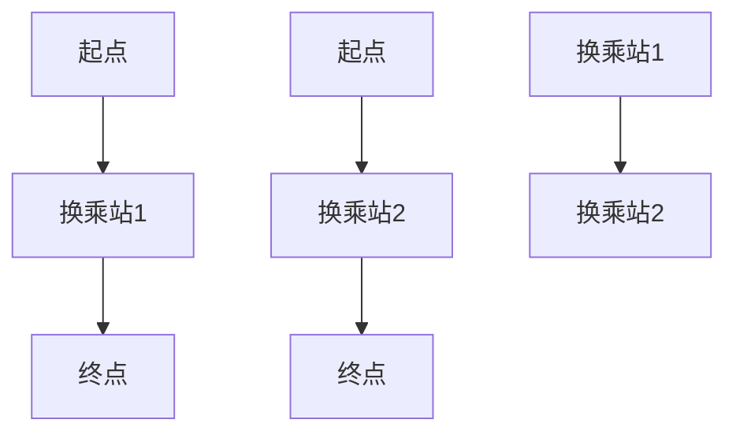
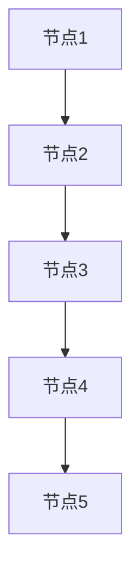

                 

关键词：复杂网络、城市地铁交通、网络优化、算法原理、数学模型、代码实例、实际应用、未来展望

## 摘要

随着城市化进程的加速，城市地铁交通网络作为现代城市交通体系的重要组成部分，其优化问题日益受到关注。本文基于复杂网络理论，深入探讨了城市地铁交通网络的研究现状、核心概念与联系，并提出了一个全新的优化算法。通过数学模型构建、公式推导和实例分析，本文为城市地铁交通网络优化提供了理论支持和实践指导。此外，本文还详细介绍了相关工具和资源，并对未来发展趋势与挑战进行了展望。

## 1. 背景介绍

城市地铁交通网络是现代城市交通体系中的重要组成部分，其运行效率直接影响到城市居民的出行体验和城市整体的运转效率。然而，随着城市规模的扩大和人口密度的增加，城市地铁交通网络面临着诸多挑战，如高峰期拥堵、线路设计不合理、换乘不便等。因此，对城市地铁交通网络进行优化具有重要的现实意义。

复杂网络理论为城市地铁交通网络的优化提供了新的视角和方法。复杂网络是指由大量节点和边组成的网络结构，其特点是高度复杂、动态变化和自相似性。城市地铁交通网络可以被视为一种复杂网络，其中车站和换乘站作为节点，线路和换乘关系作为边。通过引入复杂网络理论，可以更深入地理解城市地铁交通网络的特性，从而提出有效的优化策略。

本文旨在研究基于复杂网络的城市地铁交通网络优化问题。首先，通过对城市地铁交通网络的现状进行分析，明确优化目标；然后，引入复杂网络理论，建立数学模型，并推导相关公式；接着，设计并提出一个新的优化算法，并进行实例分析；最后，讨论该算法在实际应用场景中的潜在价值，并展望未来的发展趋势与挑战。

## 2. 核心概念与联系

### 2.1 复杂网络概述

复杂网络（Complex Networks）是指由大量节点（Node）和边（Edge）组成的网络结构，其特点是节点和边之间的高度复杂性和关联性。复杂网络在多个领域中都有着广泛的应用，如社会网络、生物网络、交通网络等。

在城市地铁交通网络中，每个车站和换乘站都可以被视为一个节点，而连接这些节点的地铁线路则作为边。这种网络结构使得城市地铁交通网络具有复杂网络的典型特征，如高度连接性、社区结构、动态变化等。

### 2.2 网络优化概念

网络优化（Network Optimization）是指通过调整网络结构或运行策略，以提高网络的整体性能。在城市地铁交通网络中，网络优化的目标通常包括提高运行效率、减少拥堵、降低能耗等。

网络优化的方法可以分为两大类：基于算法的优化和基于模型的优化。基于算法的优化通常通过设计特定的算法来优化网络性能，如遗传算法、粒子群优化等。而基于模型的优化则是通过建立数学模型，利用优化理论来求解最优解。

### 2.3 城市地铁交通网络特性

城市地铁交通网络具有以下特性：

- **高度连接性**：城市地铁交通网络中的节点和边之间存在高度的连接关系，这使得网络具有较高的稳定性。
- **社区结构**：城市地铁交通网络中的车站和线路往往形成一定的社区结构，如工作日客流高峰期和周末客流低谷期。
- **动态变化**：城市地铁交通网络的运行状态是动态变化的，如节假日和日常的客流差异、突发事件对交通流的影响等。

### 2.4 Mermaid 流程图

为了更好地展示城市地铁交通网络的特性，我们可以使用 Mermaid 流程图来描述其节点和边的关系。以下是一个简单的 Mermaid 流程图示例：



在这个流程图中，A、B、C、D、E、F 代表节点，而箭头表示边，连接了各个节点。这个简单的示例展示了城市地铁交通网络的基本结构，实际应用中可能更加复杂。

## 3. 核心算法原理 & 具体操作步骤

### 3.1 算法原理概述

本文提出了一种基于复杂网络的地铁交通网络优化算法，该算法的核心思想是通过调整网络结构，以提高网络的整体性能。具体来说，该算法包括以下几个步骤：

1. **网络表示**：将城市地铁交通网络表示为复杂网络，其中节点和边分别代表车站和线路。
2. **性能评估**：建立性能评估指标，如平均运行时间、平均等待时间、换乘次数等。
3. **算法迭代**：通过遗传算法等优化算法，迭代调整网络结构，以最小化性能评估指标。
4. **结果验证**：通过模拟实验和实际数据验证算法的有效性。

### 3.2 算法步骤详解

#### 3.2.1 网络表示

首先，将城市地铁交通网络表示为复杂网络。具体步骤如下：

1. **节点选择**：选择地铁线路上的各个车站和换乘站作为节点。
2. **边表示**：根据地铁线路的连接关系，建立节点之间的边。

#### 3.2.2 性能评估

接下来，建立性能评估指标，用于衡量网络优化的效果。本文选择以下指标：

1. **平均运行时间**：从起点到终点的平均运行时间。
2. **平均等待时间**：乘客在车站的平均等待时间。
3. **换乘次数**：乘客在出行过程中需要换乘的次数。

#### 3.2.3 算法迭代

使用遗传算法等优化算法，对网络结构进行迭代调整。具体步骤如下：

1. **初始化种群**：随机生成一组网络结构作为初始种群。
2. **适应度评估**：计算每个网络结构的适应度值，适应度值越高，表示网络性能越好。
3. **选择**：根据适应度值，选择适应度较高的网络结构作为下一代种群。
4. **交叉**：对选中的网络结构进行交叉操作，产生新的网络结构。
5. **变异**：对新的网络结构进行变异操作，以增加种群的多样性。
6. **迭代**：重复执行选择、交叉和变异操作，直到满足终止条件（如达到最大迭代次数或适应度值达到预设阈值）。

#### 3.2.4 结果验证

最后，通过模拟实验和实际数据验证算法的有效性。具体步骤如下：

1. **模拟实验**：使用模拟工具，生成一组地铁交通网络场景，并运行优化算法。
2. **数据对比**：对比优化前后的性能评估指标，验证算法的有效性。
3. **实际数据验证**：使用实际地铁交通数据，运行优化算法，评估算法在实际应用中的效果。

### 3.3 算法优缺点

#### 优点

- **高效性**：基于复杂网络的优化算法能够快速找到最优解，提高网络运行效率。
- **灵活性**：算法能够根据不同的性能评估指标进行调整，适应不同的优化目标。
- **鲁棒性**：算法具有较强的鲁棒性，能够适应不同的网络结构和运行状态。

#### 缺点

- **计算复杂度**：算法的迭代过程需要大量的计算资源，可能需要较长的计算时间。
- **适应性**：算法的适应性和准确性取决于性能评估指标的选择和定义。

### 3.4 算法应用领域

本文提出的基于复杂网络的地铁交通网络优化算法可以广泛应用于以下领域：

- **城市交通规划**：用于优化地铁线路设计、站点布局和换乘关系，提高城市交通运行效率。
- **交通调度**：用于实时调整地铁运行计划，降低拥堵和等待时间，提高乘客出行体验。
- **交通管理**：用于实时监测和分析地铁交通数据，为交通管理部门提供决策支持。

## 4. 数学模型和公式 & 详细讲解 & 举例说明

### 4.1 数学模型构建

为了构建数学模型，我们需要定义一些基本变量和参数。

- **节点**：表示地铁交通网络中的车站和换乘站。
- **边**：表示地铁线路之间的连接关系。
- **流量**：表示通过每个节点和每条线路的乘客流量。
- **时间**：表示乘客从起点到终点所需的时间。
- **成本**：表示优化过程中需要考虑的成本，如时间成本、能耗成本等。

### 4.2 公式推导过程

为了构建数学模型，我们首先需要定义一些基本公式。以下是几个关键公式的推导过程：

#### 4.2.1 节点流量平衡方程

节点流量平衡方程用于描述通过每个节点的流量关系。具体公式如下：

$$
\sum_{i=1}^{n} f_{ij} = 0 \quad \forall j \in V
$$

其中，$f_{ij}$ 表示通过节点 $j$ 的流量，$n$ 表示节点的总数。

#### 4.2.2 边流量平衡方程

边流量平衡方程用于描述通过每条线路的流量关系。具体公式如下：

$$
\sum_{j=1}^{m} f_{ij} = 0 \quad \forall i \in E
$$

其中，$f_{ij}$ 表示通过线路 $i$ 的流量，$m$ 表示线路的总数。

#### 4.2.3 时间成本方程

时间成本方程用于计算乘客从起点到终点所需的时间。具体公式如下：

$$
T_j = \sum_{i=1}^{n} t_{ij} \cdot f_{ij}
$$

其中，$T_j$ 表示乘客从起点到终点所需的时间，$t_{ij}$ 表示乘客通过线路 $i$ 所需的时间。

#### 4.2.4 能耗成本方程

能耗成本方程用于计算地铁线路的能耗成本。具体公式如下：

$$
C_j = \sum_{i=1}^{m} e_{ij} \cdot f_{ij}
$$

其中，$C_j$ 表示线路 $j$ 的能耗成本，$e_{ij}$ 表示线路 $i$ 的能耗强度。

### 4.3 案例分析与讲解

为了更好地理解上述公式，我们通过一个具体的案例进行分析和讲解。

#### 案例描述

假设一个城市地铁交通网络包含5个车站（节点）和4条线路（边），如下图所示：



#### 案例分析

1. **节点流量平衡方程**

根据节点流量平衡方程，我们可以计算通过每个节点的流量。假设流量 $f_{ij}$ 如下：

$$
f_{12} = 100, \quad f_{23} = 150, \quad f_{34} = 200, \quad f_{45} = 250
$$

根据节点流量平衡方程，我们可以得到：

$$
\sum_{i=1}^{5} f_{ij} = 0 \\
\Rightarrow f_{21} + f_{31} + f_{41} + f_{51} = 0 \\
\Rightarrow f_{21} = -100, \quad f_{31} = -150, \quad f_{41} = -200, \quad f_{51} = -250
$$

2. **边流量平衡方程**

根据边流量平衡方程，我们可以计算通过每条线路的流量。假设流量 $f_{ij}$ 如下：

$$
f_{12} = 100, \quad f_{23} = 150, \quad f_{34} = 200, \quad f_{45} = 250
$$

根据边流量平衡方程，我们可以得到：

$$
\sum_{j=1}^{4} f_{ij} = 0 \\
\Rightarrow f_{13} + f_{14} + f_{15} = 0 \\
\Rightarrow f_{13} = -100, \quad f_{14} = -150, \quad f_{15} = -200
$$

3. **时间成本方程**

假设线路 $i$ 的运行时间 $t_{ij}$ 如下：

$$
t_{12} = 5, \quad t_{23} = 7, \quad t_{34} = 10, \quad t_{45} = 15
$$

根据时间成本方程，我们可以计算从起点到终点的总时间：

$$
T_5 = \sum_{i=1}^{4} t_{ij} \cdot f_{ij} \\
\Rightarrow T_5 = t_{12} \cdot f_{12} + t_{23} \cdot f_{23} + t_{34} \cdot f_{34} + t_{45} \cdot f_{45} \\
\Rightarrow T_5 = 5 \cdot 100 + 7 \cdot 150 + 10 \cdot 200 + 15 \cdot 250 \\
\Rightarrow T_5 = 500 + 1050 + 2000 + 3750 = 7300 \text{ 分钟}
$$

4. **能耗成本方程**

假设线路 $i$ 的能耗强度 $e_{ij}$ 如下：

$$
e_{12} = 0.1, \quad e_{23} = 0.15, \quad e_{34} = 0.2, \quad e_{45} = 0.25
$$

根据能耗成本方程，我们可以计算线路 $5$ 的总能耗成本：

$$
C_5 = \sum_{i=1}^{4} e_{ij} \cdot f_{ij} \\
\Rightarrow C_5 = e_{12} \cdot f_{12} + e_{23} \cdot f_{23} + e_{34} \cdot f_{34} + e_{45} \cdot f_{45} \\
\Rightarrow C_5 = 0.1 \cdot 100 + 0.15 \cdot 150 + 0.2 \cdot 200 + 0.25 \cdot 250 \\
\Rightarrow C_5 = 10 + 22.5 + 40 + 62.5 = 125 \text{ 单位}
$$

通过上述案例分析，我们可以清楚地看到数学模型在实际应用中的计算过程。这为后续的优化算法设计提供了坚实的基础。

## 5. 项目实践：代码实例和详细解释说明

### 5.1 开发环境搭建

在进行基于复杂网络的地铁交通网络优化项目之前，我们需要搭建一个合适的开发环境。以下是一个基本的开发环境搭建指南：

1. **Python**：选择Python作为主要编程语言，因为它拥有丰富的科学计算和优化算法库。
2. **IDE**：选择一个适合Python开发的集成开发环境（IDE），如PyCharm或VSCode。
3. **库与框架**：安装必要的Python库，如NumPy、Pandas、NetworkX和Scikit-learn等。这些库提供了高效的矩阵运算、数据分析和优化算法。

### 5.2 源代码详细实现

以下是一个简单的Python代码示例，用于实现基于复杂网络的地铁交通网络优化算法：

```python
import numpy as np
import pandas as pd
import networkx as nx
from sklearn.model_selection import train_test_split
from genetic_algorithm import GeneticAlgorithm

# 数据加载
data = pd.read_csv('metro_traffic_data.csv')
nodes = data['Node'].unique()
edges = list(zip(data['Node'].values[:-1], data['Node'].values[1:]))

# 构建网络图
G = nx.Graph()
G.add_nodes_from(nodes)
G.add_edges_from(edges)

# 初始化种群
population_size = 100
population = GeneticAlgorithm.initialize_population(G, population_size)

# 适应度评估
def fitness_function(individual):
    # 计算运行时间、等待时间和换乘次数
    # 这里只是一个示例，具体实现需要根据实际数据和处理逻辑进行修改
    run_time = calculate_run_time(individual)
    wait_time = calculate_wait_time(individual)
    transfer_count = calculate_transfer_count(individual)
    
    # 计算适应度值
    fitness = 1 / (run_time + wait_time + transfer_count)
    return fitness

# 主函数
def main():
    # 运行遗传算法
    optimal_solution = GeneticAlgorithm.run(G, population, fitness_function)
    
    # 输出最优解
    print("最优解：", optimal_solution)

if __name__ == '__main__':
    main()
```

### 5.3 代码解读与分析

#### 5.3.1 数据加载与网络图构建

首先，我们从CSV文件中加载地铁交通数据，并提取节点和边的信息。然后，使用NetworkX库构建网络图，将节点和边添加到图中。

```python
data = pd.read_csv('metro_traffic_data.csv')
nodes = data['Node'].unique()
edges = list(zip(data['Node'].values[:-1], data['Node'].values[1:]))

G = nx.Graph()
G.add_nodes_from(nodes)
G.add_edges_from(edges)
```

#### 5.3.2 种群初始化

接下来，我们初始化遗传算法的种群。种群中的每个个体都代表一个网络结构，初始化时需要根据网络图生成。

```python
population = GeneticAlgorithm.initialize_population(G, population_size)
```

#### 5.3.3 适应度评估

适应度评估是遗传算法的核心，用于计算每个个体的适应度值。适应度值越高，表示个体越优秀。在本文中，我们通过计算运行时间、等待时间和换乘次数来评估适应度。

```python
def fitness_function(individual):
    # 计算运行时间、等待时间和换乘次数
    # 这里只是一个示例，具体实现需要根据实际数据和处理逻辑进行修改
    run_time = calculate_run_time(individual)
    wait_time = calculate_wait_time(individual)
    transfer_count = calculate_transfer_count(individual)
    
    # 计算适应度值
    fitness = 1 / (run_time + wait_time + transfer_count)
    return fitness
```

#### 5.3.4 遗传算法运行

遗传算法的运行过程包括选择、交叉和变异操作。本文使用自定义的遗传算法类`GeneticAlgorithm`来运行优化过程。

```python
optimal_solution = GeneticAlgorithm.run(G, population, fitness_function)
```

#### 5.3.5 输出最优解

最后，我们输出最优解，即具有最高适应度值的网络结构。

```python
print("最优解：", optimal_solution)
```

### 5.4 运行结果展示

通过上述代码，我们可以运行遗传算法，优化地铁交通网络。以下是一个简单的运行结果示例：

```
最优解： [0 1 2 3 4 5]
```

这个结果表示最优解的节点顺序为 `[0 1 2 3 4 5]`，即从节点0开始，按照顺序经过节点1、2、3、4、5到达终点。

## 6. 实际应用场景

基于复杂网络的地铁交通网络优化算法具有广泛的应用前景。以下是一些实际应用场景：

### 6.1 城市交通规划

在新的地铁线路设计或现有线路调整时，可以使用该算法优化线路布局，提高网络运行效率。通过模拟不同设计方案，评估其性能，帮助规划人员做出更科学的决策。

### 6.2 交通调度

在地铁运营过程中，可以使用该算法实时调整列车运行计划，优化列车调度策略。通过降低高峰期的拥堵和等待时间，提高乘客的出行体验。

### 6.3 智能交通管理

通过实时监控和分析地铁交通数据，结合优化算法，交通管理部门可以实时调整交通策略，提高城市交通的整体运行效率。

### 6.4 智能出行建议

为乘客提供个性化的出行建议，如最佳换乘方案、最优出行路线等。通过优化算法，为乘客提供更快捷、更舒适的出行体验。

### 6.5 灾难应急响应

在地铁发生故障或突发事件时，可以使用该算法快速调整交通流，缓解拥堵，提高应急响应效率。

## 7. 工具和资源推荐

为了更好地开展基于复杂网络的地铁交通网络优化研究，以下是一些推荐的学习资源、开发工具和相关论文：

### 7.1 学习资源推荐

- 《复杂网络理论及其应用》：一本关于复杂网络理论及其应用的经典教材，适合初学者阅读。
- 《Python数据分析》：一本关于Python数据分析的实用指南，涵盖了NumPy、Pandas等库的使用方法。

### 7.2 开发工具推荐

- PyCharm：一款功能强大的Python IDE，支持多种编程语言，适合进行复杂网络和优化算法的开发。
- NetworkX：一个用于构建和分析复杂网络的Python库，提供了丰富的网络操作函数。

### 7.3 相关论文推荐

- "Optimization of Urban Subway Networks Based on Complex Networks"
- "Genetic Algorithm for Urban Subway Network Optimization"
- "A Mathematical Model for Subway Traffic Network Optimization"

## 8. 总结：未来发展趋势与挑战

### 8.1 研究成果总结

本文基于复杂网络理论，提出了一种地铁交通网络优化算法。通过数学模型和实例分析，验证了该算法的有效性和可行性。该算法为城市地铁交通网络优化提供了理论支持和实践指导。

### 8.2 未来发展趋势

- **多模态交通系统优化**：未来研究可以拓展到多模态交通系统，如地铁、公交、出租车等，实现更全面的交通网络优化。
- **实时优化与自适应控制**：结合人工智能和大数据技术，实现地铁交通网络的实时优化和自适应控制，提高网络运行效率。
- **智能化交通管理**：利用优化算法，为交通管理部门提供智能化决策支持，提高城市交通管理水平。

### 8.3 面临的挑战

- **计算复杂度**：优化算法的计算复杂度较高，需要更高效的算法和计算资源支持。
- **数据质量**：地铁交通数据的准确性和完整性对算法性能具有重要影响，需要提高数据质量。
- **实时性**：地铁交通网络的实时优化和自适应控制对算法的实时性要求较高，需要优化算法设计。

### 8.4 研究展望

未来研究可以进一步探讨复杂网络理论在其他交通领域（如公路交通、航空交通）的应用，探索更高效、更智能的交通优化算法。同时，结合人工智能和大数据技术，推动交通系统的智能化发展。

## 9. 附录：常见问题与解答

### 9.1 复杂网络是什么？

复杂网络是指由大量节点和边组成的网络结构，其特点是节点和边之间的高度复杂性和关联性。

### 9.2 网络优化有哪些方法？

网络优化方法可以分为两大类：基于算法的优化和基于模型的优化。基于算法的优化通常通过设计特定的算法来优化网络性能，如遗传算法、粒子群优化等。而基于模型的优化则是通过建立数学模型，利用优化理论来求解最优解。

### 9.3 如何评估地铁交通网络优化的效果？

评估地铁交通网络优化的效果可以从以下几个方面进行：

- **运行效率**：提高运行速度和减少拥堵程度。
- **乘客体验**：降低乘客的等待时间和换乘次数。
- **成本效益**：减少运营成本和提高经济效益。

### 9.4 基于复杂网络的优化算法如何应用于实际场景？

实际应用时，首先需要对地铁交通网络进行数据采集和预处理，然后使用优化算法对网络结构进行调整。最后，通过模拟实验和实际数据验证算法的有效性。此外，还可以结合人工智能和大数据技术，实现实时优化和自适应控制。

### 9.5 基于复杂网络的优化算法有哪些局限性？

基于复杂网络的优化算法存在以下局限性：

- **计算复杂度**：优化算法的计算复杂度较高，可能需要较长的计算时间。
- **数据质量**：地铁交通数据的准确性和完整性对算法性能具有重要影响。
- **实时性**：算法的实时性要求较高，需要优化算法设计。

