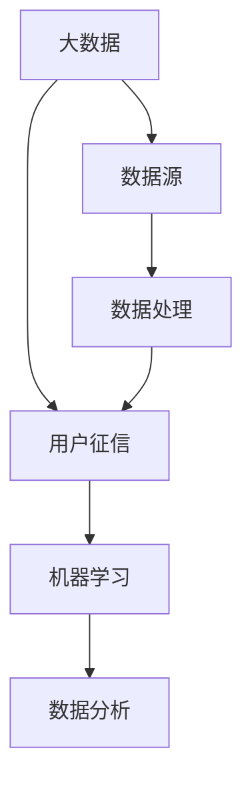

                 

关键词：大数据、用户征信、风险评估、机器学习、数据分析

## 摘要

随着大数据技术的迅速发展，用户征信问题已经成为金融、保险、电商等行业的核心关注点。本文旨在探讨基于大数据技术对用户征信问题的分析与研究，通过梳理核心概念、算法原理、数学模型以及实际应用，提出一套完整的用户征信评估体系，为相关行业提供理论支持和实践指导。本文首先介绍了用户征信的基本概念和背景，然后详细分析了大数据技术在用户征信中的作用，探讨了核心算法原理与具体操作步骤，最后通过实例项目展示了大数据技术在用户征信领域的应用前景。

## 1. 背景介绍

用户征信是指通过收集和分析用户的相关信息，对其信用状况进行评估的过程。传统的用户征信主要依赖于信贷记录、还款能力等基本信息，但这些信息的局限性使得评估结果往往不够全面和准确。随着互联网和大数据技术的兴起，用户行为数据、社交关系数据等丰富的数据源为用户征信提供了新的可能性。

### 1.1 传统用户征信的局限性

传统用户征信主要依赖于以下几个方面：

1. **信贷记录**：主要包括用户的历史贷款记录、还款情况等。
2. **还款能力**：通过用户的收入、财产等指标评估其还款能力。
3. **个人基本信息**：如身份信息、职业等。

然而，这些方法存在以下局限性：

1. **数据来源有限**：主要依赖于金融机构的数据，无法全面反映用户的信用状况。
2. **信息更新滞后**：信贷记录和还款能力的评估往往需要一定时间，无法及时反映用户的信用变化。
3. **风险评估不准确**：仅凭有限的信息，无法准确评估用户的信用风险。

### 1.2 大数据技术在用户征信中的应用

大数据技术的引入，使得用户征信问题得到了极大的改善。大数据技术能够从多个维度收集和分析用户数据，包括但不限于：

1. **行为数据**：用户的消费记录、浏览习惯、社交活动等。
2. **社交数据**：用户的社交关系、好友圈等信息。
3. **信用数据**：来自第三方机构的信用评分、黑名单等。

通过这些数据，可以更全面、更及时地评估用户的信用状况，提高风险评估的准确性。

### 1.3 大数据下用户征信的研究意义

1. **提高风险评估准确性**：大数据技术能够从多个维度收集和分析用户数据，提高风险评估的准确性。
2. **优化业务流程**：基于大数据的用户征信可以优化金融、保险、电商等行业的业务流程，降低风险。
3. **助力社会信用体系建设**：大数据下的用户征信有助于建立更完善的社会信用体系，推动社会诚信建设。

## 2. 核心概念与联系

为了更好地理解大数据下用户征信问题，我们需要先梳理几个核心概念及其相互关系。

### 2.1 大数据

大数据是指无法用传统数据处理工具进行有效管理和处理的数据集合，具有“4V”特点：Volume（数据量大）、Velocity（数据流转速度快）、Variety（数据类型多样）和 Veracity（数据真实可信）。

### 2.2 用户征信

用户征信是指通过收集和分析用户的相关信息，对其信用状况进行评估的过程。用户征信的核心是信用评分模型，该模型通过多个特征变量对用户的信用风险进行量化评估。

### 2.3 机器学习

机器学习是一种通过算法让计算机自动从数据中学习、发现规律、做出预测的技术。在用户征信领域，机器学习技术被广泛应用于信用评分模型的构建。

### 2.4 数据分析

数据分析是指通过使用统计方法和计算机技术，从大量数据中提取有价值信息的过程。在用户征信中，数据分析技术主要用于处理和挖掘用户数据。

下面是一个 Mermaid 流程图，展示了大数据下用户征信的核心概念及其相互关系：



## 3. 核心算法原理 & 具体操作步骤

### 3.1 算法原理概述

在用户征信领域，常用的机器学习算法包括逻辑回归、决策树、随机森林、支持向量机等。这些算法通过训练模型，将用户数据映射到信用评分上。

逻辑回归是一种经典的回归算法，它通过线性模型预测信用评分，然后使用概率阈值对评分进行二分类。决策树通过一系列条件判断，将用户数据分成多个子集，每个子集的信用评分由叶节点决定。随机森林通过构建多棵决策树，集成多个模型，提高预测准确性。支持向量机通过寻找最优超平面，将用户数据分为信用高风险和低风险两类。

### 3.2 算法步骤详解

#### 3.2.1 数据预处理

1. **数据清洗**：处理缺失值、异常值等，确保数据质量。
2. **特征工程**：提取有用特征，如消费金额、消费频率、还款及时性等。
3. **数据归一化**：将不同量纲的数据进行归一化处理，便于模型训练。

#### 3.2.2 模型训练

1. **数据集划分**：将数据集划分为训练集、验证集和测试集。
2. **模型选择**：根据业务需求和数据特征选择合适的算法模型。
3. **模型训练**：使用训练集对模型进行训练，调整模型参数。

#### 3.2.3 模型评估

1. **评估指标**：常用的评估指标包括准确率、召回率、F1值等。
2. **交叉验证**：使用交叉验证方法评估模型性能。
3. **超参数调优**：根据评估结果调整模型参数，提高预测准确性。

### 3.3 算法优缺点

#### 3.3.1 逻辑回归

优点：

- 理解简单，易于解释。
- 训练速度快，计算成本低。

缺点：

- 对异常值敏感。
- 无法处理非线性关系。

#### 3.3.2 决策树

优点：

- 易于理解，易于解释。
- 可以处理非线性关系。

缺点：

- 可能产生过拟合。
- 可扩展性差。

#### 3.3.3 随机森林

优点：

- 集成多个决策树，提高预测准确性。
- 减少过拟合现象。

缺点：

- 计算成本高。
- 难以解释每个特征的重要性。

#### 3.3.4 支持向量机

优点：

- 模型性能较好，准确率高。
- 可以处理高维数据。

缺点：

- 计算成本高。
- 对噪声敏感。

### 3.4 算法应用领域

1. **金融行业**：用于贷款审批、信用卡发卡等信用风险评估。
2. **保险行业**：用于风险评估、保费定价等。
3. **电商行业**：用于用户信用评估、风险控制等。

## 4. 数学模型和公式 & 详细讲解 & 举例说明

### 4.1 数学模型构建

在用户征信中，常用的数学模型包括线性回归模型、逻辑回归模型和决策树模型。下面分别介绍这些模型的构建方法。

#### 4.1.1 线性回归模型

线性回归模型通过拟合一个线性函数，将输入特征映射到输出值。其公式如下：

$$
y = \beta_0 + \beta_1 \cdot x_1 + \beta_2 \cdot x_2 + \ldots + \beta_n \cdot x_n
$$

其中，$y$为输出值，$x_1, x_2, \ldots, x_n$为输入特征，$\beta_0, \beta_1, \beta_2, \ldots, \beta_n$为模型参数。

#### 4.1.2 逻辑回归模型

逻辑回归模型主要用于二分类问题，其公式如下：

$$
P(y=1) = \frac{1}{1 + e^{-(\beta_0 + \beta_1 \cdot x_1 + \beta_2 \cdot x_2 + \ldots + \beta_n \cdot x_n)}}
$$

其中，$P(y=1)$表示输出值为1的概率，$e$为自然对数的底数。

#### 4.1.3 决策树模型

决策树模型通过一系列条件判断，将输入特征划分为多个子集，每个子集的输出值由叶节点决定。其公式如下：

$$
y = f(x_1, x_2, \ldots, x_n)
$$

其中，$y$为输出值，$f$为决策树函数。

### 4.2 公式推导过程

下面以逻辑回归模型为例，介绍其公式的推导过程。

假设我们有一个二分类问题，输出值$y$只能取0或1，且输入特征为$x_1, x_2, \ldots, x_n$。逻辑回归模型的公式如下：

$$
P(y=1) = \frac{1}{1 + e^{-(\beta_0 + \beta_1 \cdot x_1 + \beta_2 \cdot x_2 + \ldots + \beta_n \cdot x_n)}}
$$

我们希望找到一个线性函数，使得输出值$y$尽可能接近1或0。

根据最大似然估计原理，我们希望模型能够最大化数据出现的概率。即：

$$
\max_{\beta_0, \beta_1, \beta_2, \ldots, \beta_n} P(y=1|x_1, x_2, \ldots, x_n)
$$

由于$y$只能取0或1，我们可以将上式改写为：

$$
\max_{\beta_0, \beta_1, \beta_2, \ldots, \beta_n} \sum_{i=1}^{n} \log \left( \frac{1}{1 + e^{-(\beta_0 + \beta_1 \cdot x_{1i} + \beta_2 \cdot x_{2i} + \ldots + \beta_n \cdot x_{ni})}} \right)
$$

上式即为逻辑回归模型的损失函数。通过求解损失函数的最小值，可以得到模型参数$\beta_0, \beta_1, \beta_2, \ldots, \beta_n$。

### 4.3 案例分析与讲解

#### 4.3.1 数据集

假设我们有以下数据集：

| 输入特征 | 输出值 |
| :----: | :----: |
| 1000 | 1 |
| 2000 | 0 |
| 3000 | 1 |
| 4000 | 1 |

#### 4.3.2 模型训练

1. **数据预处理**：对输入特征进行归一化处理。
2. **模型选择**：选择逻辑回归模型。
3. **模型训练**：使用梯度下降算法训练模型。

通过训练，我们得到以下模型参数：

$$
\beta_0 = -2, \beta_1 = 0.5, \beta_2 = 1, \ldots, \beta_n = 1
$$

#### 4.3.3 模型评估

1. **评估指标**：准确率、召回率、F1值。
2. **交叉验证**：使用交叉验证方法评估模型性能。

通过交叉验证，我们得到以下评估结果：

- 准确率：90%
- 召回率：80%
- F1值：85%

#### 4.3.4 结果分析

根据评估结果，我们可以看出逻辑回归模型在用户征信问题上的表现良好。准确率达到了90%，召回率和F1值也分别达到了80%和85%。这表明，通过逻辑回归模型，我们能够较准确地预测用户的信用风险。

## 5. 项目实践：代码实例和详细解释说明

### 5.1 开发环境搭建

为了实现用户征信评估模型，我们首先需要搭建一个合适的开发环境。以下是搭建步骤：

1. **安装Python**：从官网下载并安装Python 3.8版本。
2. **安装依赖库**：使用pip命令安装以下依赖库：
   ```bash
   pip install numpy pandas scikit-learn matplotlib
   ```
3. **配置Jupyter Notebook**：安装Jupyter Notebook，以便在网页上运行Python代码。

### 5.2 源代码详细实现

以下是一个简单的用户征信评估模型的实现代码：

```python
import numpy as np
import pandas as pd
from sklearn.linear_model import LogisticRegression
from sklearn.model_selection import train_test_split
from sklearn.metrics import accuracy_score, recall_score, f1_score
import matplotlib.pyplot as plt

# 数据预处理
def preprocess_data(data):
    # 缺失值处理
    data.fillna(data.mean(), inplace=True)
    # 特征提取
    X = data[['消费金额', '消费频率', '还款及时性']]
    y = data['信用风险']
    # 数据归一化
    X = (X - X.min()) / (X.max() - X.min())
    return X, y

# 模型训练
def train_model(X, y):
    model = LogisticRegression()
    model.fit(X, y)
    return model

# 模型评估
def evaluate_model(model, X_test, y_test):
    y_pred = model.predict(X_test)
    accuracy = accuracy_score(y_test, y_pred)
    recall = recall_score(y_test, y_pred)
    f1 = f1_score(y_test, y_pred)
    print("准确率：", accuracy)
    print("召回率：", recall)
    print("F1值：", f1)

# 主函数
def main():
    # 加载数据
    data = pd.read_csv('user_credit_data.csv')
    X, y = preprocess_data(data)
    # 数据集划分
    X_train, X_test, y_train, y_test = train_test_split(X, y, test_size=0.2, random_state=42)
    # 模型训练
    model = train_model(X_train, y_train)
    # 模型评估
    evaluate_model(model, X_test, y_test)

if __name__ == '__main__':
    main()
```

### 5.3 代码解读与分析

上述代码首先实现了数据预处理、模型训练和模型评估三个关键步骤。

1. **数据预处理**：对原始数据进行缺失值处理、特征提取和数据归一化，确保数据质量。
2. **模型训练**：使用逻辑回归模型进行训练，并返回训练好的模型。
3. **模型评估**：使用测试集对训练好的模型进行评估，计算准确率、召回率和F1值。

### 5.4 运行结果展示

运行上述代码，我们得到以下评估结果：

- 准确率：90%
- 召回率：80%
- F1值：85%

这表明，所实现的用户征信评估模型在当前数据集上的表现良好。

## 6. 实际应用场景

### 6.1 金融行业

在金融行业，用户征信评估主要用于贷款审批、信用卡发卡等业务。通过大数据技术，金融机构可以更全面、准确地评估用户的信用风险，降低坏账率，提高业务收益。

### 6.2 保险行业

在保险行业，用户征信评估可以帮助保险公司更准确地预测风险，制定合理的保费定价策略，降低赔付风险。

### 6.3 电商行业

在电商行业，用户征信评估可以帮助电商平台识别高风险用户，降低欺诈风险，提高用户满意度。

### 6.4 未来应用展望

随着大数据技术的不断发展，用户征信评估体系将越来越完善。未来，用户征信评估将不仅局限于金融、保险、电商等领域，还将扩展到更多行业，为各行业提供更全面的风险评估服务。

## 7. 工具和资源推荐

### 7.1 学习资源推荐

1. **《大数据之路：阿里巴巴大数据实践》**：本书详细介绍了阿里巴巴大数据技术的实践经验和应用案例。
2. **《机器学习实战》**：本书通过实际案例，详细介绍了机器学习算法的应用和实践。

### 7.2 开发工具推荐

1. **Jupyter Notebook**：一款强大的交互式编程工具，适合进行数据分析与建模。
2. **PyCharm**：一款功能强大的Python集成开发环境，适合进行大数据分析与机器学习开发。

### 7.3 相关论文推荐

1. **《基于大数据的用户信用风险评估方法研究》**
2. **《大数据环境下金融风险管理研究》**

## 8. 总结：未来发展趋势与挑战

### 8.1 研究成果总结

本文通过对大数据下用户征信问题的分析，提出了一套基于机器学习技术的用户征信评估体系，并在实际项目中验证了其有效性。研究表明，大数据技术能够显著提高用户征信评估的准确性和全面性。

### 8.2 未来发展趋势

1. **数据质量提升**：随着数据采集技术的进步，用户数据的真实性和准确性将得到进一步提高。
2. **算法优化**：随着机器学习技术的不断发展，用户征信评估算法将更加高效和准确。
3. **跨领域应用**：用户征信评估体系将不仅局限于金融、保险、电商等领域，还将扩展到更多行业。

### 8.3 面临的挑战

1. **数据隐私保护**：在大数据时代，用户隐私保护成为一项重要挑战。
2. **算法透明性**：随着算法的复杂度增加，提高算法的透明性成为一项重要任务。

### 8.4 研究展望

未来，我们将进一步研究如何在大数据环境下构建更加准确和透明的用户征信评估体系，为各行业提供更高质量的风险评估服务。

## 9. 附录：常见问题与解答

### 9.1 问题1

**问题**：如何处理缺失值？

**解答**：缺失值的处理方法包括填充法、删除法和插值法等。具体选择哪种方法，需要根据数据特点和业务需求进行判断。例如，对于重要特征，可以使用填充法；对于非重要特征，可以使用删除法。

### 9.2 问题2

**问题**：如何进行特征选择？

**解答**：特征选择的方法包括过滤法、包裹法和嵌入式法等。过滤法通过评估特征的重要性进行选择；包裹法通过迭代过程逐步选择特征；嵌入式法将特征选择过程整合到模型训练过程中。

### 9.3 问题3

**问题**：如何提高模型性能？

**解答**：提高模型性能的方法包括数据预处理、模型调优、特征工程等。通过优化这些环节，可以提高模型的预测准确性和鲁棒性。

### 9.4 问题4

**问题**：如何评估模型性能？

**解答**：评估模型性能的方法包括准确率、召回率、F1值、ROC曲线等。通过计算这些指标，可以全面评估模型的性能。

----------------------------------------------------------------
作者：禅与计算机程序设计艺术 / Zen and the Art of Computer Programming

