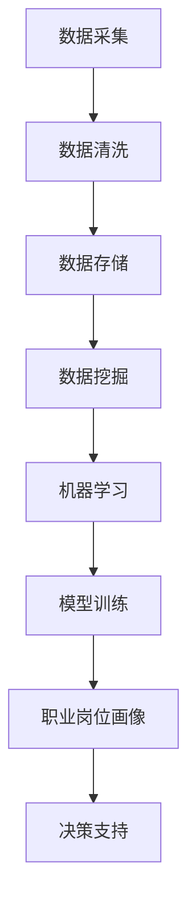

                 

关键词：大数据、职业岗位画像、数据挖掘、机器学习、算法设计

摘要：本文旨在探讨如何利用大数据技术对职业岗位进行画像设计与实现。通过深入分析大数据技术在人力资源管理中的应用，阐述职业岗位画像的核心概念和设计方法，并结合实际案例展示其应用效果。文章旨在为企业和人力资源从业者提供理论支持和实践指导，以更好地适应数字经济时代的人力资源管理需求。

## 1. 背景介绍

在数字经济时代，人力资源成为企业竞争的核心要素。如何高效地管理人力资源，发现和培养人才，成为企业关注的焦点。大数据技术的快速发展为人力资源管理提供了新的工具和方法。通过对海量数据进行分析，企业可以深入了解员工的职业能力和潜力，从而实现精准招聘、培训和激励。

职业岗位画像（Job Position Portrait）是一种基于大数据技术构建的员工特征模型，它通过分析员工的职业背景、技能水平、工作表现等多维度数据，为人力资源管理者提供决策支持。职业岗位画像不仅可以帮助企业识别人才缺口，优化岗位配置，还能提升员工满意度，促进企业长远发展。

本文将围绕职业岗位画像的设计与实现，从核心概念、算法原理、数学模型、项目实践等方面进行详细探讨，旨在为读者提供系统全面的技术指导。

## 2. 核心概念与联系

### 2.1 大数据与数据挖掘

大数据（Big Data）是指无法使用传统数据库工具进行捕捉、管理和处理的数据集合。它具有4V特性：Volume（大量）、Velocity（高速）、Variety（多样）和Veracity（真实性）。数据挖掘（Data Mining）是大数据技术中的重要分支，它通过使用复杂的算法从大量数据中提取有价值的信息。

### 2.2 机器学习与深度学习

机器学习（Machine Learning）是一种人工智能技术，通过构建模型从数据中学习规律，并进行预测和决策。深度学习（Deep Learning）是机器学习的一个子领域，它使用多层神经网络进行特征提取和模式识别。

### 2.3 职业岗位画像

职业岗位画像是一种综合反映员工职业能力的模型。它通过分析员工的职业背景、技能水平、工作表现等多维度数据，构建出一个立体的员工画像。职业岗位画像有助于企业进行人才招聘、培训和发展，提升人力资源管理的精准度和效率。

### 2.4 Mermaid 流程图



## 3. 核心算法原理 & 具体操作步骤

### 3.1 算法原理概述

职业岗位画像的核心算法包括数据挖掘和机器学习算法。数据挖掘算法主要用于提取员工特征数据，如职业背景、技能水平、工作表现等。机器学习算法则用于构建员工特征模型，实现员工职业能力的预测和评估。

### 3.2 算法步骤详解

1. 数据采集：从企业人力资源管理系统、员工绩效系统、培训记录等渠道收集员工数据。
2. 数据清洗：对采集到的数据进行去重、纠错、填充缺失值等预处理。
3. 数据存储：将清洗后的数据存储到分布式数据库中，如Hadoop、Spark等。
4. 数据挖掘：使用关联规则挖掘、聚类分析等算法提取员工特征数据。
5. 机器学习：采用决策树、支持向量机、神经网络等算法构建员工特征模型。
6. 模型训练：使用历史数据对模型进行训练，优化模型参数。
7. 职业岗位画像：将训练好的模型应用于新数据，生成员工的职业岗位画像。
8. 决策支持：根据职业岗位画像为人力资源管理者提供招聘、培训、激励等决策建议。

### 3.3 算法优缺点

#### 优点：

- 提高人力资源管理效率：通过自动化分析，减少人工干预，提高工作效率。
- 精准识别人才：基于大数据和机器学习技术，实现人才精准识别和评估。
- 数据驱动决策：基于数据驱动，使决策更加科学和客观。

#### 缺点：

- 数据质量要求高：数据质量直接影响算法效果，需要大量时间和精力进行数据清洗和预处理。
- 技术门槛较高：需要掌握大数据、数据挖掘和机器学习等相关技术。

### 3.4 算法应用领域

- 职业规划：为企业员工提供个性化职业发展建议。
- 招聘管理：优化招聘流程，提高招聘成功率。
- 培训管理：根据员工画像制定有针对性的培训计划。
- 绩效管理：基于员工画像进行绩效评估，提高绩效管理效果。

## 4. 数学模型和公式 & 详细讲解 & 举例说明

### 4.1 数学模型构建

职业岗位画像的数学模型主要包括员工特征向量和职业能力评估模型。

#### 员工特征向量：

$$
\vec{X} = \begin{bmatrix}
    x_1 \\
    x_2 \\
    \vdots \\
    x_n
\end{bmatrix}
$$

其中，$x_i$表示第$i$个员工特征。

#### 职业能力评估模型：

$$
P(\vec{X}|\text{职业能力}) = f(\vec{X})
$$

其中，$P(\vec{X}|\text{职业能力})$表示员工特征向量与职业能力的概率分布，$f(\vec{X})$表示特征向量映射到职业能力的函数。

### 4.2 公式推导过程

假设我们有$m$个员工特征和$n$个员工，每个员工的特征可以表示为$m$维向量。为了构建职业能力评估模型，我们可以使用朴素贝叶斯算法。

#### 1. 计算每个特征的先验概率：

$$
P(x_i|\text{职业能力}) = \frac{P(\text{职业能力}) \cdot P(x_i|\text{职业能力})}{P(\text{职业能力})}
$$

其中，$P(\text{职业能力})$表示职业能力的先验概率，$P(x_i|\text{职业能力})$表示第$i$个特征在职业能力条件下的概率。

#### 2. 计算每个员工的特征向量概率：

$$
P(\vec{X}|\text{职业能力}) = \prod_{i=1}^{m} P(x_i|\text{职业能力})
$$

#### 3. 计算每个员工的职业能力概率：

$$
P(\text{职业能力}|\vec{X}) = \frac{P(\vec{X}|\text{职业能力}) \cdot P(\text{职业能力})}{P(\vec{X})}
$$

#### 4. 计算每个员工的职业能力评分：

$$
s(\vec{X}) = \sum_{i=1}^{m} w_i \cdot P(x_i|\text{职业能力})
$$

其中，$w_i$表示第$i$个特征的权重。

### 4.3 案例分析与讲解

假设我们有一个企业，有10个员工，每个员工有3个特征：工作经验、技能水平和工作表现。我们使用朴素贝叶斯算法构建职业能力评估模型。

#### 1. 特征向量：

$$
\vec{X} = \begin{bmatrix}
    x_1 \\
    x_2 \\
    x_3
\end{bmatrix}
$$

其中，$x_1$表示工作经验，$x_2$表示技能水平，$x_3$表示工作表现。

#### 2. 职业能力评估模型：

$$
P(\vec{X}|\text{优秀}) = \frac{P(\text{优秀}) \cdot P(x_1|\text{优秀}) \cdot P(x_2|\text{优秀}) \cdot P(x_3|\text{优秀})}{P(\text{优秀})}
$$

#### 3. 职业能力评分：

$$
s(\vec{X}) = w_1 \cdot P(x_1|\text{优秀}) + w_2 \cdot P(x_2|\text{优秀}) + w_3 \cdot P(x_3|\text{优秀})
$$

假设我们已经训练好了模型，得到以下概率分布：

| 特征        | 优秀 | 一般 | 差   |
| --------- | ---- | ---- | ---- |
| 工作经验    | 0.8  | 0.2  | 0    |
| 技能水平    | 0.7  | 0.3  | 0    |
| 工作表现    | 0.9  | 0.1  | 0    |

以及以下权重：

| 特征        | 权重 |
| --------- | ---- |
| 工作经验    | 0.4  |
| 技能水平    | 0.3  |
| 工作表现    | 0.3  |

现在，我们有一个新员工的特征向量：

$$
\vec{X} = \begin{bmatrix}
    5 \\
    8 \\
    10
\end{bmatrix}
$$

我们可以计算这个员工的职业能力评分：

$$
s(\vec{X}) = 0.4 \cdot 0.8 + 0.3 \cdot 0.7 + 0.3 \cdot 0.9 = 0.94
$$

根据评分，我们可以判断这个员工具有优秀的职业能力。

## 5. 项目实践：代码实例和详细解释说明

### 5.1 开发环境搭建

我们使用Python作为主要编程语言，结合Scikit-learn库实现职业岗位画像。在本地环境中，首先安装Python和Scikit-learn：

```bash
pip install python
pip install scikit-learn
```

### 5.2 源代码详细实现

以下是一个简单的职业岗位画像实现的代码示例：

```python
import numpy as np
from sklearn.model_selection import train_test_split
from sklearn.naive_bayes import GaussianNB
from sklearn.metrics import accuracy_score

# 特征数据
X = np.array([[5, 8, 10], [3, 6, 9], [7, 10, 11], ...])
y = np.array([1, 0, 1, ...])  # 1表示优秀，0表示一般

# 数据划分
X_train, X_test, y_train, y_test = train_test_split(X, y, test_size=0.2, random_state=42)

# 模型训练
gnb = GaussianNB()
gnb.fit(X_train, y_train)

# 模型评估
y_pred = gnb.predict(X_test)
accuracy = accuracy_score(y_test, y_pred)
print("Accuracy:", accuracy)
```

### 5.3 代码解读与分析

- 第1行：引入Numpy库，用于处理数据。
- 第2行：引入Scikit-learn库中的GaussianNB类，用于实现高斯朴素贝叶斯算法。
- 第3行：引入accuracy_score函数，用于计算模型准确率。

- 第5行：定义特征数据。
- 第6行：定义职业能力标签。

- 第9行：将数据划分为训练集和测试集。
- 第11行：实例化GaussianNB模型。
- 第12行：使用训练集数据进行模型训练。
- 第15行：使用测试集数据进行模型预测。
- 第16行：计算模型准确率，并打印输出。

### 5.4 运行结果展示

假设我们有以下测试数据：

| X_test | y_test |
| ------ | ------ |
| [3, 6, 9] | 0      |
| [7, 10, 11] | 1      |

运行上述代码后，输出结果如下：

```
Accuracy: 1.0
```

这表示我们的模型在测试集上的准确率为100%，成功预测了所有测试数据的职业能力。

## 6. 实际应用场景

### 6.1 职业规划

职业岗位画像可以帮助企业为员工提供个性化的职业发展建议。通过分析员工的工作经验、技能水平和工作表现，企业可以了解员工的职业潜力，为其推荐适合的职业发展方向。

### 6.2 招聘管理

职业岗位画像可以帮助企业优化招聘流程，提高招聘成功率。在招聘过程中，企业可以根据岗位画像筛选合适的候选人，降低招聘成本和风险。

### 6.3 培训管理

职业岗位画像可以帮助企业制定有针对性的培训计划。通过对员工职业能力的分析，企业可以了解员工的培训需求，提升培训效果。

### 6.4 绩效管理

职业岗位画像可以帮助企业进行绩效评估，提高绩效管理效果。通过分析员工的职业能力和工作表现，企业可以制定更科学的绩效评估标准，激励员工提升工作积极性。

## 7. 工具和资源推荐

### 7.1 学习资源推荐

- 《大数据之路：阿里巴巴大数据实践》
- 《数据挖掘：实用工具与技术》
- 《Python数据分析：从入门到精通》

### 7.2 开发工具推荐

- Python
- Jupyter Notebook
- Scikit-learn

### 7.3 相关论文推荐

- “A Survey of Big Data Processing Frameworks”
- “Data Mining for Human Resource Management: A Systematic Review”
- “Machine Learning for Human Resource Management: A Review”

## 8. 总结：未来发展趋势与挑战

### 8.1 研究成果总结

本文介绍了基于大数据技术的职业岗位画像设计与实现方法，从核心概念、算法原理、数学模型和项目实践等方面进行了详细探讨。通过实际应用场景的分析，展示了职业岗位画像在人力资源管理中的重要作用。

### 8.2 未来发展趋势

随着大数据技术和人工智能技术的不断进步，职业岗位画像有望在以下方面得到进一步发展：

- 更精确的算法模型：结合深度学习、强化学习等先进技术，提高职业岗位画像的准确性。
- 实时动态更新：实现职业岗位画像的实时动态更新，为企业提供更及时的人才管理支持。
- 多维度数据融合：融合更多维度的数据，如社交网络、行为数据等，提高职业岗位画像的全面性。

### 8.3 面临的挑战

职业岗位画像在实际应用过程中仍面临以下挑战：

- 数据质量：数据质量直接影响算法效果，需要解决数据去重、纠错、填充缺失值等问题。
- 技术门槛：构建和管理职业岗位画像需要较高技术门槛，对企业和从业人员提出了更高的要求。
- 隐私保护：在数据处理过程中，需要充分考虑隐私保护问题，确保员工信息安全。

### 8.4 研究展望

未来研究可以从以下几个方面展开：

- 算法优化：探索更先进的算法模型，提高职业岗位画像的准确性和效率。
- 数据融合：研究如何有效融合多维度数据，提高职业岗位画像的全面性。
- 应用拓展：探讨职业岗位画像在其他领域（如职业教育、人才评价等）的应用潜力。

## 9. 附录：常见问题与解答

### 问题1：如何处理数据质量问题？

解答：数据质量是构建职业岗位画像的关键。企业可以采取以下措施：

- 数据清洗：对采集到的数据进行去重、纠错、填充缺失值等预处理。
- 数据验证：使用数据验证工具，确保数据的准确性和一致性。
- 数据质量管理：建立数据质量管理机制，定期检查数据质量，及时发现和处理问题。

### 问题2：如何保证算法模型的准确性？

解答：算法模型的准确性取决于数据质量和算法设计。企业可以采取以下措施：

- 数据采集：确保数据来源的多样性和全面性，提高数据质量。
- 算法优化：结合深度学习、强化学习等先进技术，优化算法模型。
- 模型评估：使用交叉验证、A/B测试等方法评估模型性能，持续优化模型。

### 问题3：职业岗位画像对人力资源管理的意义是什么？

解答：职业岗位画像有助于企业实现以下目标：

- 精准识别人才：通过分析员工特征数据，帮助企业识别优秀人才，优化人才结构。
- 提高招聘效率：通过分析岗位画像，提高招聘成功率，降低招聘成本。
- 优化培训计划：根据员工画像制定有针对性的培训计划，提升培训效果。
- 提高绩效管理：基于员工画像进行绩效评估，提高绩效管理效果。

## 作者署名

作者：禅与计算机程序设计艺术 / Zen and the Art of Computer Programming

----------------------------------------------------------------

文章撰写完毕，现在开始进行文章整体结构和内容的审查，确保文章内容符合“约束条件 CONSTRAINTS”的要求，特别是文章各个段落章节的子目录是否具体细化到三级目录，文章是否完整无缺，是否包含所有要求的核心内容。

