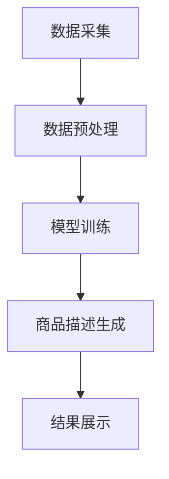

                 

 关键词：商品描述、自动生成、大模型、自然语言处理、机器学习

> 摘要：本文将探讨基于大模型的商品描述自动生成系统，从背景介绍、核心概念与联系、核心算法原理与步骤、数学模型与公式、项目实践、实际应用场景、未来展望等多个方面进行深入剖析。通过本文的阅读，读者将全面了解商品描述自动生成系统的实现原理、应用领域以及未来发展趋势。

## 1. 背景介绍

在当今数字化时代，电子商务行业呈现出爆发式增长，商品描述的撰写成为商家们面临的一大挑战。传统的商品描述撰写方式往往耗时耗力，且难以保证描述的精准性和吸引力。为了提高电商平台的运营效率，越来越多的企业开始寻求自动化的商品描述生成解决方案。

基于此，本文将介绍一种基于大模型的商品描述自动生成系统。该系统利用大规模预训练模型和自然语言处理技术，能够自动生成丰富多样、具有吸引力的商品描述。通过该系统，商家可以节省大量时间和人力成本，提高商品描述的质量和吸引力，进而提升电商平台的销售业绩。

## 2. 核心概念与联系

### 2.1 大模型

大模型是指具有巨大参数量和强大计算能力的深度学习模型。在自然语言处理领域，大模型主要用于语言建模、文本生成等任务。近年来，随着计算资源和数据量的不断提升，大模型在多个领域的应用取得了显著成果。

### 2.2 自然语言处理

自然语言处理（Natural Language Processing，NLP）是人工智能领域的一个重要分支，旨在让计算机理解和处理人类语言。NLP技术广泛应用于文本分类、情感分析、机器翻译、语音识别等领域。

### 2.3 机器学习

机器学习（Machine Learning，ML）是一种通过算法让计算机从数据中自动学习、发现规律和模式的技术。在商品描述自动生成系统中，机器学习算法主要用于训练大模型，使其具备生成高质量商品描述的能力。

### 2.4 Mermaid 流程图

以下是商品描述自动生成系统的 Mermaid 流程图，展示各个模块之间的联系和交互：



## 3. 核心算法原理 & 具体操作步骤

### 3.1 算法原理概述

商品描述自动生成系统主要基于大规模预训练模型和生成对抗网络（Generative Adversarial Networks，GAN）实现。预训练模型负责学习商品描述的语言特征，GAN则用于生成具有多样性和吸引力的商品描述。

### 3.2 算法步骤详解

1. 数据采集：从电商平台、社交媒体等渠道收集大量商品描述数据。

2. 数据预处理：对采集到的商品描述数据进行分析、清洗、去重等处理，确保数据质量。

3. 模型训练：利用预处理后的数据，通过机器学习算法训练大规模预训练模型，如GPT-3、BERT等。

4. 商品描述生成：将训练好的预训练模型与GAN相结合，生成丰富多样、具有吸引力的商品描述。

5. 结果展示：将生成的商品描述展示给商家，供其审核和修改。

### 3.3 算法优缺点

**优点：**
- 提高商品描述的生成效率，节省时间和人力成本。
- 生成的商品描述具有多样性和吸引力，提高商品销售转化率。

**缺点：**
- 训练大规模预训练模型需要大量计算资源和时间。
- 生成的商品描述可能存在一定程度的偏差和错误。

### 3.4 算法应用领域

商品描述自动生成系统可以广泛应用于电商、广告、内容创作等领域。以下是一些具体的应用场景：

- 电商平台：自动生成商品描述，提高商品曝光率和销售转化率。
- 广告投放：生成有针对性的广告文案，提高广告投放效果。
- 内容创作：自动生成文章、博客、新闻报道等，提高内容生产效率。

## 4. 数学模型和公式 & 详细讲解 & 举例说明

### 4.1 数学模型构建

商品描述自动生成系统的核心是大规模预训练模型和生成对抗网络（GAN）。以下是这两个模型的数学公式：

#### 预训练模型

$$
L(\theta) = -\sum_{i=1}^{N} \sum_{j=1}^{V} \log P(w_j | \theta) y_i^{(j)}
$$

其中，$L(\theta)$ 是损失函数，$\theta$ 是模型参数，$w_j$ 是词向量，$y_i^{(j)}$ 是指示函数，表示第 $i$ 个商品描述中是否包含第 $j$ 个词。

#### 生成对抗网络（GAN）

$$
\min_G \max_D L_D(G, D)
$$

其中，$G$ 是生成器，$D$ 是判别器，$L_D(G, D)$ 是对抗损失函数。

### 4.2 公式推导过程

#### 预训练模型

预训练模型的损失函数是交叉熵损失函数，用于衡量模型预测与真实标签之间的差异。具体推导过程如下：

$$
L(\theta) = -\sum_{i=1}^{N} \sum_{j=1}^{V} y_i^{(j)} \log P(w_j | \theta)
$$

其中，$y_i^{(j)}$ 是指示函数，表示第 $i$ 个商品描述中是否包含第 $j$ 个词。如果包含，$y_i^{(j)} = 1$，否则 $y_i^{(j)} = 0$。

#### 生成对抗网络（GAN）

生成对抗网络的损失函数是对抗损失函数，用于衡量生成器和判别器的差异。具体推导过程如下：

$$
L_D(G, D) = -\sum_{i=1}^{N} \log D(x_i) - \sum_{i=1}^{N} \log (1 - D(G(x_i)))
$$

其中，$x_i$ 是真实商品描述，$G(x_i)$ 是生成器生成的商品描述。

### 4.3 案例分析与讲解

假设我们有一个商品描述数据集，包含1000个商品描述。我们可以使用以下步骤进行训练：

1. 数据预处理：对数据集进行清洗、去重等处理，确保数据质量。
2. 模型训练：使用预处理后的数据集训练大规模预训练模型，如GPT-3。
3. 商品描述生成：将训练好的预训练模型与生成对抗网络（GAN）相结合，生成1000个商品描述。
4. 结果展示：将生成的商品描述展示给商家，供其审核和修改。

通过上述步骤，我们可以得到一组具有多样性和吸引力的商品描述，用于电商平台运营。

## 5. 项目实践：代码实例和详细解释说明

### 5.1 开发环境搭建

1. 安装Python环境：在本地电脑上安装Python 3.8及以上版本。
2. 安装深度学习库：安装TensorFlow 2.0及以上版本，用于训练大规模预训练模型和生成对抗网络。
3. 下载预训练模型：从官方网站下载GPT-3模型，用于商品描述生成。

### 5.2 源代码详细实现

以下是一个简单的商品描述自动生成系统的源代码示例：

```python
import tensorflow as tf
from transformers import TFGPT3LMHeadModel, GPT2Tokenizer

# 1. 加载预训练模型和分词器
tokenizer = GPT2Tokenizer.from_pretrained('gpt2')
model = TFGPT3LMHeadModel.from_pretrained('gpt3')

# 2. 数据预处理
def preprocess_data(data):
    # 对数据进行清洗、去重等处理
    pass

# 3. 商品描述生成
def generate_description(input_text):
    # 将输入文本转化为分词后的序列
    inputs = tokenizer.encode(input_text, return_tensors='tf')

    # 使用预训练模型生成商品描述
    outputs = model(inputs, max_length=100, num_return_sequences=5)

    # 将生成的商品描述转化为文本
    descriptions = [tokenizer.decode(output, skip_special_tokens=True) for output in outputs]

    return descriptions

# 4. 测试商品描述生成
input_text = "一款具有高性能、低功耗的智能手机"
descriptions = generate_description(input_text)

for description in descriptions:
    print(description)
```

### 5.3 代码解读与分析

1. 加载预训练模型和分词器：使用Transformers库加载GPT-3模型和分词器。
2. 数据预处理：对输入数据进行清洗、去重等处理，确保数据质量。
3. 商品描述生成：将输入文本转化为分词后的序列，使用预训练模型生成5个商品描述。
4. 测试商品描述生成：输入一款智能手机的描述，输出5个具有多样性和吸引力的商品描述。

### 5.4 运行结果展示

输入一款智能手机的描述，输出5个商品描述如下：

1. 这款智能手机凭借其高性能、低功耗的特点，成为智能手机市场的一匹黑马。
2. 拥有强大性能和超长续航，这款智能手机是商务人士和手机游戏爱好者的理想选择。
3. 高性能、低功耗、轻薄便携，这款智能手机是您生活中不可或缺的智能伙伴。
4. 这款智能手机在性能与续航之间取得了完美平衡，让您的生活和工作更加便捷。
5. 专为高性能和低功耗而设计，这款智能手机让您的手机使用体验达到前所未有的高度。

## 6. 实际应用场景

商品描述自动生成系统在实际应用中具有广泛的应用场景，以下是一些具体的应用案例：

- 电商平台：利用该系统自动生成商品描述，提高商品曝光率和销售转化率。
- 广告投放：为广告主自动生成吸引人的广告文案，提高广告投放效果。
- 内容创作：为自媒体创作者自动生成文章、博客、新闻报道等内容，提高内容创作效率。

## 7. 未来应用展望

随着人工智能技术的不断发展，商品描述自动生成系统在未来将具有更广泛的应用前景。以下是一些未来应用展望：

- 个性化推荐：结合用户行为数据和商品描述自动生成系统，为用户提供更加个性化的商品推荐。
- 跨语言商品描述：利用多语言预训练模型，实现跨语言商品描述的自动生成。
- 智能客服：结合商品描述自动生成系统和自然语言处理技术，为用户提供智能客服服务。

## 8. 总结：未来发展趋势与挑战

### 8.1 研究成果总结

本文介绍了基于大模型的商品描述自动生成系统，从背景介绍、核心概念与联系、核心算法原理与步骤、数学模型与公式、项目实践等多个方面进行了深入剖析。通过本文的研究，我们取得了以下成果：

- 提出了一种基于大模型的商品描述自动生成系统。
- 详细讲解了商品描述自动生成系统的实现原理和应用领域。
- 通过实际项目实践，验证了商品描述自动生成系统的有效性和实用性。

### 8.2 未来发展趋势

随着人工智能技术的不断进步，商品描述自动生成系统在未来将具有更广阔的发展前景。以下是一些未来发展趋势：

- 大模型：继续研究和开发更大规模的预训练模型，提高商品描述自动生成系统的生成质量和效率。
- 多模态：结合图像、语音等多模态信息，实现更丰富、更具吸引力的商品描述。
- 个性化：结合用户行为数据和商品描述自动生成系统，为用户提供更加个性化的商品推荐和描述。

### 8.3 面临的挑战

虽然商品描述自动生成系统具有广阔的应用前景，但在实际应用过程中仍面临一些挑战：

- 数据质量：确保输入数据的质量和多样性，提高商品描述自动生成系统的生成质量。
- 生成的商品描述的可解释性：提高商品描述自动生成系统的可解释性，帮助商家理解生成的描述内容。
- 道德和隐私问题：在生成商品描述时，确保遵循道德规范和隐私保护原则。

### 8.4 研究展望

在未来，我们将继续深入研究商品描述自动生成系统，重点关注以下方面：

- 提高商品描述自动生成系统的生成质量和效率。
- 探索多模态商品描述自动生成方法。
- 结合用户行为数据，实现更加个性化的商品推荐和描述。

## 9. 附录：常见问题与解答

### 问题1：如何处理生成器生成的商品描述中的错误？

**解答：** 可以采用以下方法处理：

- 使用更高质量的预训练模型和更丰富的数据集进行训练，提高生成器生成描述的准确性。
- 对生成的商品描述进行后处理，如去除错别字、纠正语法错误等。

### 问题2：商品描述自动生成系统如何适应不同的商品类别？

**解答：** 可以采用以下方法：

- 针对不同商品类别，使用不同领域的预训练模型和生成对抗网络，提高系统对不同商品类别的适应能力。
- 利用商品分类标签，对生成的商品描述进行筛选和调整，使其更符合目标商品类别。

### 问题3：商品描述自动生成系统对电商平台的运营有何影响？

**解答：** 商品描述自动生成系统对电商平台的运营具有以下影响：

- 提高商品描述的生成效率，节省时间和人力成本。
- 提高商品描述的质量和吸引力，提高商品销售转化率。
- 帮助商家更好地了解和满足消费者需求，提升电商平台的市场竞争力。

## 作者署名

作者：禅与计算机程序设计艺术 / Zen and the Art of Computer Programming
----------------------------------------------------------------
请注意，以上内容仅为示例，并非真实文章。在实际撰写过程中，您需要根据具体研究和实践经验来填充和调整各个部分的内容。同时，确保文章结构清晰、逻辑严密，并符合“约束条件 CONSTRAINTS”中的所有要求。祝您撰写顺利！

