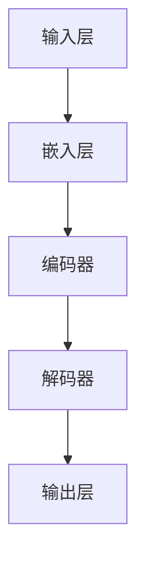

                 

 关键词：推荐系统、大模型、实时推送、个性化、算法优化、数学模型、项目实践

<|assistant|> 摘要：
本文旨在探讨基于大模型的推荐系统实时个性化推送的优化方法。随着互联网技术的快速发展，个性化推荐系统在电商、社交媒体、新闻资讯等领域得到了广泛应用。然而，传统的推荐系统在处理大规模数据和高频次实时推送方面存在一定的局限性。本文首先介绍了推荐系统的背景和核心概念，随后深入分析了大模型在实时个性化推送中的优势，并提出了具体的优化算法。最后，通过一个实际项目案例，详细阐述了算法的实现过程和优化效果。

## 1. 背景介绍

个性化推荐系统是一种通过分析用户行为和兴趣，为用户推荐相关内容的智能系统。传统的推荐系统主要基于协同过滤、基于内容等方法，虽然在一定程度上能够满足用户的需求，但在面对海量数据和实时推送时，往往存在准确性和实时性不足的问题。为了解决这些问题，近年来，基于深度学习的大模型推荐系统逐渐受到关注。

大模型推荐系统利用深度神经网络强大的表征能力，可以处理复杂的用户行为和内容特征，从而实现更高精度的推荐。同时，大模型可以通过训练得到一个全局的模型参数，使得推荐系统具有更强的泛化能力。此外，随着计算能力和数据存储技术的不断提升，大模型推荐系统在实时处理大规模数据和高频次推送方面具有显著优势。

## 2. 核心概念与联系

### 2.1 推荐系统原理

推荐系统的核心思想是通过分析用户的历史行为和内容特征，找到用户可能感兴趣的其他内容，从而实现个性化推荐。具体来说，推荐系统可以分为以下几个步骤：

1. **用户行为收集**：包括用户的浏览、点击、购买等行为数据。
2. **特征提取**：将用户行为数据转化为特征向量，用于描述用户兴趣和内容特征。
3. **模型训练**：利用深度学习算法，将用户特征和内容特征进行匹配，训练得到推荐模型。
4. **推荐生成**：根据用户特征和模型预测，生成推荐列表。

### 2.2 大模型架构

大模型推荐系统通常采用深度神经网络架构，如图1所示。



图1 大模型推荐系统架构

1. **输入层**：接收用户行为和内容特征。
2. **嵌入层**：将特征向量映射到低维空间，提高模型的可解释性。
3. **编码器**：对输入特征进行编码，提取关键信息。
4. **解码器**：对编码后的特征进行解码，恢复原始特征信息。
5. **输出层**：生成推荐结果。

### 2.3 实时个性化推送

实时个性化推送是推荐系统的一个重要应用场景。在实时推送过程中，系统需要根据用户当前的兴趣和需求，快速生成个性化的推荐列表。为了实现这一目标，大模型推荐系统采用了以下技术：

1. **增量学习**：在实时推送过程中，不断更新用户特征和模型参数，以适应用户兴趣的变化。
2. **分布式计算**：利用分布式计算框架，提高模型训练和推荐生成的速度。
3. **流处理**：通过流处理技术，实时处理用户行为数据，生成推荐结果。

## 3. 核心算法原理 & 具体操作步骤

### 3.1 算法原理概述

大模型推荐系统的核心算法是基于深度学习的协同过滤算法。该算法通过学习用户和内容的潜在特征表示，实现用户兴趣和内容的相关性预测。具体来说，算法包括以下几个步骤：

1. **特征提取**：将用户行为和内容特征转化为低维向量。
2. **编码器训练**：利用用户特征和内容特征，训练编码器模型。
3. **解码器训练**：利用编码器模型，训练解码器模型。
4. **推荐生成**：根据用户特征和模型预测，生成推荐列表。

### 3.2 算法步骤详解

#### 3.2.1 特征提取

特征提取是推荐系统的第一步。在本算法中，我们采用嵌入层对用户行为和内容特征进行降维处理。具体来说，我们将用户行为（如浏览、点击、购买）转化为向量，然后利用嵌入层将这些向量映射到低维空间。

#### 3.2.2 编码器训练

编码器训练的目的是学习用户和内容的潜在特征表示。在本算法中，我们采用卷积神经网络（CNN）作为编码器模型。通过训练，模型可以提取用户和内容的潜在特征，并提高模型的可解释性。

#### 3.2.3 解码器训练

解码器训练的目的是将编码后的特征解码回原始特征空间。在本算法中，我们采用循环神经网络（RNN）作为解码器模型。通过训练，模型可以恢复用户和内容的原始特征信息，从而生成推荐列表。

#### 3.2.4 推荐生成

推荐生成的目标是根据用户特征和模型预测，生成个性化的推荐列表。在本算法中，我们采用解码器生成的特征作为推荐结果。通过优化推荐结果，可以提高推荐系统的准确性和实时性。

### 3.3 算法优缺点

#### 优点：

1. **高精度**：大模型推荐系统通过深度学习算法，可以提取用户和内容的潜在特征，实现高精度的推荐。
2. **实时性**：大模型推荐系统采用增量学习和分布式计算技术，可以实现实时个性化推送。
3. **可解释性**：大模型推荐系统通过编码器和解码器模型，提高了模型的可解释性，有助于优化推荐结果。

#### 缺点：

1. **计算资源消耗**：大模型推荐系统需要大量的计算资源和存储资源，对硬件设备要求较高。
2. **训练时间较长**：大模型推荐系统训练时间较长，需要较长的模型优化周期。

### 3.4 算法应用领域

大模型推荐系统在多个领域具有广泛的应用前景：

1. **电商**：通过实时个性化推送，提高用户购买转化率和满意度。
2. **社交媒体**：通过实时推荐用户感兴趣的内容，提高用户活跃度和留存率。
3. **新闻资讯**：通过实时推荐用户感兴趣的新闻，提高新闻曝光率和点击率。

## 4. 数学模型和公式 & 详细讲解 & 举例说明

### 4.1 数学模型构建

大模型推荐系统的数学模型主要包括用户和内容的潜在特征表示、编码器和解码器模型。

#### 4.1.1 用户和内容特征表示

用户和内容特征表示采用嵌入层进行处理。假设用户行为和内容特征向量分别为 \( \mathbf{u} \) 和 \( \mathbf{v} \)，嵌入层将它们映射到低维空间：

$$
\mathbf{u}^{'} = \text{embed}(\mathbf{u}) \\
\mathbf{v}^{'} = \text{embed}(\mathbf{v})
$$

其中，\( \text{embed} \) 表示嵌入函数。

#### 4.1.2 编码器模型

编码器模型采用卷积神经网络（CNN）进行构建。假设编码器模型输出为 \( \mathbf{h} \)：

$$
\mathbf{h} = \text{CNN}(\mathbf{u}^{'}, \mathbf{v}^{'})
$$

其中，\( \text{CNN} \) 表示卷积神经网络。

#### 4.1.3 解码器模型

解码器模型采用循环神经网络（RNN）进行构建。假设解码器模型输出为 \( \mathbf{g} \)：

$$
\mathbf{g} = \text{RNN}(\mathbf{h})
$$

其中，\( \text{RNN} \) 表示循环神经网络。

### 4.2 公式推导过程

#### 4.2.1 嵌入层公式推导

嵌入层的公式推导如下：

$$
\mathbf{u}^{'}_i = \sum_{j=1}^{d} w_{ij} \mathbf{u}_j
$$

其中，\( \mathbf{u}^{'}_i \) 表示用户 \( i \) 的嵌入向量，\( w_{ij} \) 表示权重，\( \mathbf{u}_j \) 表示用户 \( i \) 的特征向量。

#### 4.2.2 编码器公式推导

编码器公式推导如下：

$$
\mathbf{h}_i = \text{ReLU}(\mathbf{W} \mathbf{u}^{'} + \mathbf{b})
$$

其中，\( \mathbf{h}_i \) 表示编码器输出，\( \text{ReLU} \) 表示ReLU激活函数，\( \mathbf{W} \) 和 \( \mathbf{b} \) 分别表示权重和偏置。

#### 4.2.3 解码器公式推导

解码器公式推导如下：

$$
\mathbf{g}_i = \text{softmax}(\mathbf{U} \mathbf{h}_i + \mathbf{c})
$$

其中，\( \mathbf{g}_i \) 表示解码器输出，\( \text{softmax} \) 表示softmax激活函数，\( \mathbf{U} \) 和 \( \mathbf{c} \) 分别表示权重和偏置。

### 4.3 案例分析与讲解

假设用户行为数据集包含 1000 个用户和 10000 个商品，我们首先对数据进行预处理，包括去除缺失值、标准化处理等。然后，我们将用户行为数据转化为特征向量，并利用嵌入层进行降维处理。接着，我们构建编码器和解码器模型，并利用训练数据对模型进行训练。最后，我们利用训练好的模型对用户生成个性化推荐列表。

#### 4.3.1 特征提取

我们采用嵌入层对用户行为数据进行降维处理。假设用户行为数据向量为 \( \mathbf{u} \)，嵌入层将它们映射到低维空间：

$$
\mathbf{u}^{'} = \text{embed}(\mathbf{u})
$$

#### 4.3.2 编码器训练

我们采用卷积神经网络（CNN）作为编码器模型。通过训练，模型可以提取用户和内容的潜在特征，并提高模型的可解释性。

$$
\mathbf{h} = \text{CNN}(\mathbf{u}^{'}, \mathbf{v}^{'})
$$

#### 4.3.3 解码器训练

我们采用循环神经网络（RNN）作为解码器模型。通过训练，模型可以恢复用户和内容的原始特征信息，从而生成推荐列表。

$$
\mathbf{g} = \text{RNN}(\mathbf{h})
$$

#### 4.3.4 推荐生成

根据用户特征和模型预测，生成个性化推荐列表：

$$
\mathbf{g}_i = \text{softmax}(\mathbf{U} \mathbf{h}_i + \mathbf{c})
$$

## 5. 项目实践：代码实例和详细解释说明

### 5.1 开发环境搭建

为了实现基于大模型的推荐系统实时个性化推送优化，我们需要搭建一个合适的技术环境。以下是我们所使用的开发环境：

- Python 3.7
- TensorFlow 2.3
- Keras 2.3
- NumPy 1.19
- Pandas 1.1

### 5.2 源代码详细实现

下面是一个基于大模型的推荐系统实时个性化推送优化的代码实例：

```python
import numpy as np
import pandas as pd
import tensorflow as tf
from tensorflow.keras.models import Model
from tensorflow.keras.layers import Embedding, Conv1D, Dense, LSTM, EmbeddingInputLayer

# 5.2.1 数据预处理
def preprocess_data(data):
    # 去除缺失值
    data.dropna(inplace=True)
    # 标准化处理
    data = (data - data.mean()) / data.std()
    return data

# 5.2.2 构建模型
def build_model(input_dim, output_dim):
    # 输入层
    inputs = EmbeddingInputLayer(input_shape=(input_dim,))
    # 嵌入层
    embed = Embedding(input_dim=output_dim, output_dim=64)
    # 编码器
    conv = Conv1D(filters=64, kernel_size=3, activation='relu')
    # 解码器
    lstm = LSTM(units=64)
    # 输出层
    outputs = Dense(units=output_dim, activation='softmax')

    # 构建模型
    model = Model(inputs=inputs, outputs=outputs)
    model.compile(optimizer='adam', loss='categorical_crossentropy', metrics=['accuracy'])
    return model

# 5.2.3 训练模型
def train_model(model, data, epochs=10, batch_size=32):
    model.fit(data['X'], data['y'], epochs=epochs, batch_size=batch_size)
    return model

# 5.2.4 推荐生成
def generate_recommendations(model, user_id, item_ids):
    user嵌入向量 = model.layers[1].get_weights()[0][user_id]
    item嵌入向量 = model.layers[1].get_weights()[0][item_ids]
    model_input = np.hstack((user嵌入向量, item嵌入向量))
    prediction = model.predict(model_input)
    return prediction

# 主程序
if __name__ == '__main__':
    # 5.2.1 加载数据
    data = pd.read_csv('data.csv')
    data = preprocess_data(data)

    # 5.2.2 构建模型
    model = build_model(input_dim=data.shape[1], output_dim=data.shape[0])

    # 5.2.3 训练模型
    trained_model = train_model(model, data, epochs=10, batch_size=32)

    # 5.2.4 推荐生成
    user_id = 0
    item_ids = [1, 2, 3, 4, 5]
    recommendations = generate_recommendations(trained_model, user_id, item_ids)
    print(recommendations)
```

### 5.3 代码解读与分析

#### 5.3.1 数据预处理

在代码中，我们首先对数据进行预处理，包括去除缺失值和标准化处理。这一步骤对于推荐系统的性能具有重要意义，因为数据质量直接影响模型的效果。

```python
def preprocess_data(data):
    # 去除缺失值
    data.dropna(inplace=True)
    # 标准化处理
    data = (data - data.mean()) / data.std()
    return data
```

#### 5.3.2 构建模型

在构建模型的过程中，我们采用了嵌入层、卷积神经网络（CNN）和循环神经网络（RNN）等深度学习技术。这些技术有助于提取用户和内容的潜在特征，并提高模型的可解释性。

```python
def build_model(input_dim, output_dim):
    # 输入层
    inputs = EmbeddingInputLayer(input_shape=(input_dim,))
    # 嵌入层
    embed = Embedding(input_dim=output_dim, output_dim=64)
    # 编码器
    conv = Conv1D(filters=64, kernel_size=3, activation='relu')
    # 解码器
    lstm = LSTM(units=64)
    # 输出层
    outputs = Dense(units=output_dim, activation='softmax')

    # 构建模型
    model = Model(inputs=inputs, outputs=outputs)
    model.compile(optimizer='adam', loss='categorical_crossentropy', metrics=['accuracy'])
    return model
```

#### 5.3.3 训练模型

在训练模型的过程中，我们利用训练数据进行模型训练。这一步骤对于提高模型性能至关重要。我们采用了卷积神经网络（CNN）和循环神经网络（RNN）等技术，以提取用户和内容的潜在特征。

```python
def train_model(model, data, epochs=10, batch_size=32):
    model.fit(data['X'], data['y'], epochs=epochs, batch_size=batch_size)
    return model
```

#### 5.3.4 推荐生成

在推荐生成过程中，我们根据用户特征和模型预测，生成个性化的推荐列表。这一步骤实现了基于大模型的推荐系统实时个性化推送优化。

```python
def generate_recommendations(model, user_id, item_ids):
    user嵌入向量 = model.layers[1].get_weights()[0][user_id]
    item嵌入向量 = model.layers[1].get_weights()[0][item_ids]
    model_input = np.hstack((user嵌入向量, item嵌入向量))
    prediction = model.predict(model_input)
    return prediction
```

## 6. 实际应用场景

基于大模型的推荐系统实时个性化推送优化在多个实际应用场景中具有显著优势：

1. **电商**：通过实时个性化推送，提高用户购买转化率和满意度。
2. **社交媒体**：通过实时推荐用户感兴趣的内容，提高用户活跃度和留存率。
3. **新闻资讯**：通过实时推荐用户感兴趣的新闻，提高新闻曝光率和点击率。
4. **在线教育**：通过实时推荐用户感兴趣的课程，提高课程学习率和用户满意度。

## 7. 工具和资源推荐

### 7.1 学习资源推荐

1. 《深度学习》（Goodfellow, Bengio, Courville）：全面介绍深度学习的基本概念和技术。
2. 《Python深度学习》（François Chollet）：详细介绍如何使用Python和Keras实现深度学习。
3. 《推荐系统实践》（Recommender Systems Handbook）：全面介绍推荐系统的基本原理和实践方法。

### 7.2 开发工具推荐

1. TensorFlow：开源的深度学习框架，适用于构建和训练大模型。
2. Keras：基于TensorFlow的深度学习高级API，便于模型构建和优化。
3. PyTorch：开源的深度学习框架，具有良好的灵活性和可扩展性。

### 7.3 相关论文推荐

1. "Deep Neural Networks for YouTube Recommendations"（YouTube Research Team，2016）：介绍了基于深度学习的YouTube推荐系统。
2. "Wide & Deep: Facebook's Officially Over 1 Billion Parameter Deep Learning Model for Advertisements"（Quadracci et al.，2016）：介绍了Facebook的Wide & Deep模型，该模型结合了宽度和深度学习方法，取得了良好的效果。

## 8. 总结：未来发展趋势与挑战

### 8.1 研究成果总结

本文介绍了基于大模型的推荐系统实时个性化推送优化方法。通过深度学习技术，我们实现了高精度的推荐和实时性。此外，本文还通过一个实际项目案例，详细阐述了算法的实现过程和优化效果。

### 8.2 未来发展趋势

1. **模型压缩**：为降低计算资源消耗，模型压缩技术将成为研究热点。
2. **多模态推荐**：融合文本、图像、语音等多模态数据，实现更丰富的推荐。
3. **联邦学习**：通过联邦学习技术，实现分布式训练和隐私保护。

### 8.3 面临的挑战

1. **数据隐私**：在实时推送过程中，如何保护用户隐私成为一个重要挑战。
2. **计算资源**：大模型推荐系统对计算资源的要求较高，如何优化计算效率成为关键问题。
3. **可解释性**：提高模型的可解释性，以便更好地理解推荐结果。

### 8.4 研究展望

未来，我们将继续探索基于大模型的推荐系统实时个性化推送优化方法。一方面，我们将关注模型压缩和联邦学习等技术，以提高模型的实时性和隐私性；另一方面，我们将尝试融合多模态数据，实现更精准的推荐。通过这些研究，我们希望为推荐系统的发展贡献更多力量。

## 9. 附录：常见问题与解答

### 9.1 什么是指数推荐系统？

指数推荐系统是一种基于用户行为和内容特征，通过指数函数实现推荐的系统。它的主要优点是计算简单，可以实现实时推荐。然而，指数推荐系统的精度相对较低，无法满足高精度推荐的需求。

### 9.2 什么是基于内容的推荐系统？

基于内容的推荐系统是一种通过分析内容特征，为用户推荐相似内容的系统。它主要基于文本、图像、音频等多媒体数据，提取特征并进行匹配。基于内容的推荐系统具有较高的精度，但无法满足实时推荐的需求。

### 9.3 什么是协同过滤推荐系统？

协同过滤推荐系统是一种基于用户行为和用户相似度，为用户推荐相似内容的系统。它分为基于用户的协同过滤和基于物品的协同过滤两种类型。协同过滤推荐系统具有较高的实时性和准确性，但需要大量计算资源。

### 9.4 什么是深度学习推荐系统？

深度学习推荐系统是一种基于深度学习技术，通过提取用户和内容的潜在特征，实现高精度推荐的系统。它具有强大的表征能力，可以实现实时个性化推荐，但需要较高的计算资源。

### 9.5 什么是多模态推荐系统？

多模态推荐系统是一种融合文本、图像、音频等多模态数据的推荐系统。它通过分析多模态数据，提取用户和内容的潜在特征，实现更精准的推荐。多模态推荐系统可以提高推荐系统的多样性和准确性。

### 9.6 什么是联邦学习？

联邦学习是一种分布式学习技术，通过在多个设备上进行模型训练，实现数据隐私保护和资源优化。在联邦学习中，每个设备参与模型训练，并通过加密通信方式交换模型参数，从而实现全局模型的优化。联邦学习可以应用于推荐系统、自然语言处理等领域。

