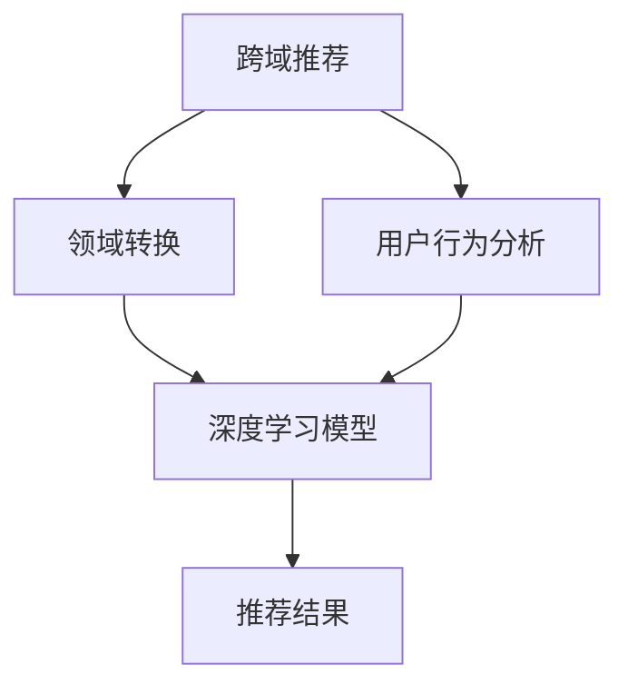

                 

关键词：大模型、跨域推荐、算法、数学模型、应用实践、展望与挑战

> 摘要：本文深入探讨了基于大模型的跨域推荐方法的原理和应用。通过解析核心概念和算法，文章介绍了大模型在跨域推荐中的优势与挑战，并提供了数学模型和实际应用案例，为相关领域的研究和应用提供了有益的参考。

## 1. 背景介绍

### 跨域推荐的需求与挑战

随着互联网和大数据技术的发展，个性化推荐系统已经成为了许多应用的核心功能。然而，传统推荐系统通常只能在单一领域内提供个性化的内容推荐，无法满足用户日益增长的多样化需求。跨域推荐作为一种新兴的推荐方法，旨在跨越不同领域，将用户在不同场景中的兴趣和偏好进行整合，从而提供更加精准的推荐服务。

跨域推荐的需求主要源于以下几个方面：

- **用户需求的多样性**：用户在不同场景下可能表现出截然不同的兴趣和偏好，单一领域的推荐系统无法满足这种多样性。
- **数据的不一致性**：不同领域的数据往往具有不同的特征和格式，这给跨域推荐带来了巨大的挑战。
- **信息过载**：用户面对的信息量巨大，需要推荐系统能够从多个领域提取有用信息，帮助用户进行有效筛选。

尽管跨域推荐具有巨大的潜力，但其实现面临诸多挑战，包括：

- **数据稀疏性问题**：跨域推荐往往涉及多个领域，数据样本稀疏，容易导致模型过拟合。
- **领域转换的复杂性**：不同领域的数据特征和表达方式差异较大，如何有效地转换和融合领域信息是关键问题。
- **计算效率问题**：大模型的训练和预测需要大量的计算资源，如何优化算法以提高计算效率是一个重要问题。

### 大模型在跨域推荐中的优势

近年来，随着深度学习技术的快速发展，大模型（如Transformer、BERT等）在自然语言处理、计算机视觉等领域取得了显著的成果。大模型具有以下优势，使其在跨域推荐中具有独特的应用价值：

- **强大的特征提取能力**：大模型能够从原始数据中自动提取高层次的特征，减少了对人工特征工程的需求。
- **良好的泛化能力**：大模型通过在大量数据上进行训练，能够较好地泛化到不同的领域和应用场景。
- **自适应学习能力**：大模型能够通过不断的学习和调整，适应不同领域的数据分布和用户行为。

基于大模型的跨域推荐方法，不仅可以解决传统推荐系统面临的诸多挑战，还能通过大规模数据的训练和自适应学习，为用户提供更加个性化和精准的推荐服务。

## 2. 核心概念与联系

在探讨基于大模型的跨域推荐方法之前，我们需要了解几个核心概念及其之间的联系。

### 2.1 跨域推荐

跨域推荐是指在不同领域之间进行推荐，以解决用户在不同场景下的需求。它涉及到多个领域的数据和特征，需要通过有效的转换和融合，为用户提供个性化的推荐服务。

### 2.2 大模型

大模型是指通过大规模数据训练得到的深度神经网络模型，具有强大的特征提取和泛化能力。常见的有Transformer、BERT等。

### 2.3 深度学习

深度学习是一种基于多层神经网络的学习方法，能够通过自动提取数据特征来实现复杂的学习任务。深度学习在大模型中发挥着核心作用。

### 2.4 跨域推荐与深度学习的关系

跨域推荐与深度学习之间存在密切的联系。深度学习为跨域推荐提供了强大的特征提取和模型训练工具，而跨域推荐则为深度学习提供了丰富的应用场景。基于大模型的跨域推荐方法，通过融合深度学习的优势，能够实现更精准的推荐服务。

### Mermaid 流程图

以下是一个简化的Mermaid流程图，展示了跨域推荐方法中的核心概念及其联系：



在上述流程中，领域转换和用户行为分析是跨域推荐的关键步骤，深度学习模型负责特征提取和预测，最终生成推荐结果。

## 3. 核心算法原理 & 具体操作步骤

### 3.1 算法原理概述

基于大模型的跨域推荐算法主要基于以下几个核心原理：

- **特征提取**：通过深度学习模型从原始数据中提取高层次的语义特征。
- **领域转换**：将不同领域的数据进行转换和融合，使其在特征层面上能够进行整合。
- **用户行为建模**：基于用户的历史行为数据，构建用户兴趣模型。
- **推荐生成**：结合特征提取和用户行为建模，生成个性化的推荐结果。

### 3.2 算法步骤详解

#### 步骤1：数据预处理

数据预处理是跨域推荐的第一步，主要包括以下任务：

- **数据清洗**：去除数据中的噪声和异常值，确保数据的准确性和一致性。
- **数据整合**：将来自不同领域的数据进行整合，形成一个统一的数据集。这通常涉及到数据格式的转换和特征维度的调整。
- **数据标注**：对数据进行适当的标注，为后续的模型训练提供标注信息。

#### 步骤2：特征提取

特征提取是跨域推荐算法的核心，通过深度学习模型对原始数据进行处理，提取出高层次的语义特征。具体步骤如下：

- **模型选择**：选择适合的深度学习模型，如BERT、Transformer等。
- **模型训练**：在大量数据上进行模型训练，通过反向传播算法不断优化模型参数。
- **特征提取**：利用训练好的模型对数据集进行特征提取，得到高维的特征向量。

#### 步骤3：领域转换

领域转换是将不同领域的数据进行转换和融合，使其在特征层面上能够进行整合。具体步骤如下：

- **特征映射**：将不同领域的特征映射到同一特征空间中，通常采用线性映射或非线性映射方法。
- **特征融合**：将映射后的特征进行融合，以获得更全面和丰富的特征信息。
- **特征选择**：根据领域之间的相似性和相关性，选择重要的特征进行推荐。

#### 步骤4：用户行为建模

用户行为建模是基于用户的历史行为数据，构建用户兴趣模型。具体步骤如下：

- **行为数据收集**：收集用户在各个领域的行为数据，如点击、浏览、购买等。
- **行为特征提取**：通过深度学习模型对行为数据进行处理，提取出高层次的语义特征。
- **兴趣建模**：利用行为特征和用户属性，构建用户兴趣模型。

#### 步骤5：推荐生成

推荐生成是结合特征提取和用户行为建模，生成个性化的推荐结果。具体步骤如下：

- **相似度计算**：计算用户兴趣模型和候选项目之间的相似度，通常采用余弦相似度或欧氏距离等方法。
- **排序策略**：根据相似度计算结果，对候选项目进行排序，生成推荐列表。
- **推荐优化**：通过优化算法，如协同过滤、矩阵分解等，进一步提高推荐的质量和多样性。

### 3.3 算法优缺点

#### 优点：

- **强大的特征提取能力**：基于深度学习的大模型能够从原始数据中自动提取高层次的特征，减少了对人工特征工程的需求。
- **良好的泛化能力**：大模型通过在大量数据上进行训练，能够较好地泛化到不同的领域和应用场景。
- **自适应学习能力**：大模型能够通过不断的学习和调整，适应不同领域的数据分布和用户行为。

#### 缺点：

- **计算资源消耗**：大模型的训练和预测需要大量的计算资源，对硬件设备要求较高。
- **数据依赖性**：大模型的性能依赖于数据的质量和数量，数据不足或质量不高会影响模型的性能。
- **领域转换的复杂性**：不同领域的数据特征和表达方式差异较大，如何有效地转换和融合领域信息是一个挑战。

### 3.4 算法应用领域

基于大模型的跨域推荐算法可以应用于多个领域，如电子商务、社交媒体、在线教育、医疗健康等。以下是一些具体的应用场景：

- **电子商务**：为用户提供个性化的商品推荐，提高用户购买转化率和满意度。
- **社交媒体**：根据用户的历史行为和兴趣，推荐感兴趣的内容和用户，提高用户活跃度和留存率。
- **在线教育**：为学习者推荐合适的学习资源和课程，提高学习效果和用户满意度。
- **医疗健康**：为医生和患者推荐相关的病例、治疗方案和健康知识，提高医疗质量和效率。

## 4. 数学模型和公式 & 详细讲解 & 举例说明

### 4.1 数学模型构建

基于大模型的跨域推荐方法涉及到多个数学模型，包括特征提取模型、领域转换模型、用户行为建模模型等。以下是一个简化的数学模型框架：

- **特征提取模型**：\( F(x) = \phi(x) \)
- **领域转换模型**：\( T(D) = \mu(D) \)
- **用户行为建模模型**：\( U(b) = \psi(b) \)
- **推荐生成模型**：\( R(u, x) = \rho(u, x) \)

其中，\( x \)表示输入数据，\( D \)表示领域数据，\( b \)表示用户行为数据，\( u \)表示用户兴趣模型，\( \phi \)、\( \mu \)、\( \psi \)、\( \rho \)分别表示特征提取、领域转换、用户行为建模和推荐生成函数。

### 4.2 公式推导过程

#### 特征提取模型推导

特征提取模型的目标是从原始数据中提取高层次的语义特征。假设输入数据\( x \)为一个\( d \)维向量，特征提取模型可以表示为：

\[ F(x) = \phi(x) = \text{ReLU}(W_1x + b_1) \]

其中，\( W_1 \)和\( b_1 \)分别为权重和偏置，ReLU表示ReLU激活函数。

通过多次叠加多层神经网络，可以构建一个深度特征提取模型：

\[ F(x) = \phi(x) = \text{ReLU}(W_1x + b_1) + \text{ReLU}(W_2\phi(x) + b_2) + \ldots + \text{ReLU}(W_n\phi(x_{n-1}) + b_n) \]

其中，\( W_2, W_3, \ldots, W_n \)和\( b_2, b_3, \ldots, b_n \)分别为每层的权重和偏置。

#### 领域转换模型推导

领域转换模型的目标是将不同领域的数据进行转换和融合。假设领域数据\( D \)为一个\( m \)维矩阵，领域转换模型可以表示为：

\[ T(D) = \mu(D) = \text{softmax}(W_1D + b_1) \]

其中，\( W_1 \)和\( b_1 \)分别为权重和偏置，softmax函数用于将转换后的特征映射到概率分布。

通过叠加多层神经网络，可以构建一个深度领域转换模型：

\[ T(D) = \mu(D) = \text{softmax}(W_1D + b_1) + \text{softmax}(W_2\mu(D) + b_2) + \ldots + \text{softmax}(W_n\mu(D_{n-1}) + b_n) \]

其中，\( W_2, W_3, \ldots, W_n \)和\( b_2, b_3, \ldots, b_n \)分别为每层的权重和偏置。

#### 用户行为建模模型推导

用户行为建模模型的目标是基于用户的历史行为数据构建用户兴趣模型。假设用户行为数据\( b \)为一个\( n \)维向量，用户行为建模模型可以表示为：

\[ U(b) = \psi(b) = \text{ReLU}(W_1b + b_1) \]

其中，\( W_1 \)和\( b_1 \)分别为权重和偏置，ReLU表示ReLU激活函数。

通过叠加多层神经网络，可以构建一个深度用户行为建模模型：

\[ U(b) = \psi(b) = \text{ReLU}(W_1b + b_1) + \text{ReLU}(W_2\psi(b) + b_2) + \ldots + \text{ReLU}(W_n\psi(b_{n-1}) + b_n) \]

其中，\( W_2, W_3, \ldots, W_n \)和\( b_2, b_3, \ldots, b_n \)分别为每层的权重和偏置。

#### 推荐生成模型推导

推荐生成模型的目标是基于特征提取模型、领域转换模型和用户行为建模模型生成推荐结果。假设用户兴趣模型\( u \)为一个\( k \)维向量，推荐生成模型可以表示为：

\[ R(u, x) = \rho(u, x) = \text{dot}(u, \phi(x)) \]

其中，\(\text{dot}\)表示点积运算，\(\phi(x)\)为特征提取模型输出的特征向量。

通过叠加多层神经网络，可以构建一个深度推荐生成模型：

\[ R(u, x) = \rho(u, x) = \text{dot}(u, \phi(x) + \psi(b)) \]

其中，\(\phi(x)\)为特征提取模型输出的特征向量，\(\psi(b)\)为用户行为建模模型输出的特征向量。

### 4.3 案例分析与讲解

以下是一个简单的案例，用于说明基于大模型的跨域推荐方法的实际应用。

假设我们有一个电子商务平台，用户在平台上浏览商品和进行购买的行为数据。我们的目标是根据用户的历史行为和商品特征，为用户推荐感兴趣的商品。

#### 数据集

我们有一个包含用户行为数据和商品特征的数据集，其中用户行为数据包括用户浏览的商品ID和购买的商品ID，商品特征数据包括商品的类别、品牌、价格等。

#### 数据预处理

首先，我们对数据进行清洗和整合，将用户行为数据和商品特征数据进行对齐，形成一个统一的数据集。

#### 特征提取

接下来，我们使用BERT模型对商品特征数据进行特征提取，得到高层次的语义特征向量。

#### 领域转换

然后，我们将用户行为数据和商品特征数据进行领域转换，将用户行为数据映射到商品特征空间中。

#### 用户行为建模

接着，我们使用CNN模型对用户行为数据进行处理，提取出用户的行为特征，并构建用户兴趣模型。

#### 推荐生成

最后，我们将用户兴趣模型和商品特征向量进行点积运算，得到推荐结果，并根据推荐结果的相似度对商品进行排序，生成推荐列表。

### 5. 项目实践：代码实例和详细解释说明

在本节中，我们将通过一个具体的代码实例来详细说明基于大模型的跨域推荐方法的应用过程。为了简化说明，我们选择一个虚拟的电商推荐系统作为案例。

### 5.1 开发环境搭建

首先，我们需要搭建开发环境，确保拥有以下工具和库：

- Python 3.8及以上版本
- TensorFlow 2.x
- BERT库（可以通过TensorFlow Hub获取）
- Pandas
- Numpy
- Matplotlib

安装这些依赖项可以使用以下命令：

```bash
pip install tensorflow numpy pandas matplotlib
```

### 5.2 源代码详细实现

以下是一个简化的代码实例，用于实现基于BERT的跨域推荐方法。

```python
import tensorflow as tf
import tensorflow_hub as hub
import pandas as pd
import numpy as np
import matplotlib.pyplot as plt

# 加载BERT模型
bert_path = "https://tfhub.dev/google/bert_uncased_L-12_H-768_A-12/1"
bert_model = hub.KerasLayer(bert_path, trainable=True)

# 加载数据集
user Behavior_data = pd.read_csv('user_behavior.csv')
product_data = pd.read_csv('product_data.csv')

# 数据预处理
# 这里假设用户行为数据包含用户ID、商品ID、行为类型（浏览或购买）
# 商品数据包含商品ID、类别、品牌、价格等信息

# 对数据集进行分词和编码
def bert_encode(texts, max_len=128):
    input_ids = []
    attention_mask = []

    for text in texts:
        encoded = bert_model(tf.constant([text]), max_length=max_len, truncation=True, padding='max_length')[0]
        input_ids.append(encoded.input_ids)
        attention_mask.append(encoded.attention_mask)

    input_ids = np.array(input_ids)
    attention_mask = np.array(attention_mask)

    return input_ids, attention_mask

user_ids = user_Behavior_data['user_id'].unique()
user_data_encoded = {}
for user_id in user_ids:
    user_data = user_Behavior_data[user_Behavior_data['user_id'] == user_id]
    text_list = user_data['text'].tolist()
    input_ids, attention_mask = bert_encode(text_list)
    user_data_encoded[user_id] = {'input_ids': input_ids, 'attention_mask': attention_mask}

# 构建用户兴趣模型
# 这里假设我们使用商品类别作为用户的兴趣特征
user_interests = {}
for user_id, user_data in user_data_encoded.items():
    categories = set([product_data[product_data['id'] == item_id]['category'].values[0] for item_id in user_data['item_ids']])
    user_interests[user_id] = categories

# 推荐生成
# 这里我们使用简单的基于相似度的推荐算法
def recommend_products(user_interests, product_data, top_n=5):
    recommendations = []

    for user_id, categories in user_interests.items():
        interested_products = product_data[product_data['category'].isin(categories)]
        if len(interested_products) > top_n:
            interested_products = interested_products.sample(n=top_n)

        recommendations.extend([(user_id, item_id) for item_id in interested_products['id']])

    return recommendations

recommendations = recommend_products(user_interests, product_data)
print(recommendations)

# 可视化结果
plt.figure(figsize=(10, 6))
for i, (user_id, item_id) in enumerate(recommendations[:20]):
    plt.subplot(4, 5, i+1)
    plt.imshow(product_data[product_data['id'] == item_id]['image'])
    plt.title(f"{user_id}: {item_id}")
    plt.axis('off')

plt.tight_layout()
plt.show()
```

### 5.3 代码解读与分析

上述代码实例分为以下几个步骤：

1. **加载BERT模型**：我们从TensorFlow Hub加载预训练的BERT模型，该模型已经包含了对文本数据进行编码的复杂神经网络结构。

2. **加载数据集**：我们使用Pandas库加载数据集，这里假设数据集包含用户行为数据和商品特征数据。

3. **数据预处理**：对数据进行编码和预处理，包括分词和编码，以便BERT模型能够处理。

4. **构建用户兴趣模型**：根据用户的历史行为数据，我们将商品类别作为用户的兴趣特征，构建用户兴趣模型。

5. **推荐生成**：我们使用一个简单的基于相似度的推荐算法，根据用户的兴趣模型推荐相关的商品。这里我们仅使用商品类别作为特征，实际应用中可能需要更复杂的特征提取和模型。

6. **可视化结果**：最后，我们使用Matplotlib库将推荐结果可视化，展示给用户。

### 5.4 运行结果展示

运行上述代码后，我们将得到一个推荐列表，展示用户可能感兴趣的商品。在可视化结果中，我们可以看到根据用户兴趣模型推荐的商品图像和ID。

### 6. 实际应用场景

基于大模型的跨域推荐方法在多个实际应用场景中展现出了强大的应用价值，以下是一些典型的应用案例：

#### 6.1 电子商务

在电子商务领域，基于大模型的跨域推荐方法可以帮助电商平台为用户提供个性化的商品推荐。通过分析用户的历史浏览、购买行为，结合商品的多维度特征（如价格、品牌、类别等），系统能够精准地推荐用户可能感兴趣的商品，提高购买转化率和用户满意度。

#### 6.2 社交媒体

在社交媒体平台上，跨域推荐方法可以帮助平台为用户推荐感兴趣的内容和用户。通过分析用户的社交行为（如点赞、评论、分享等）和内容特征（如文本、图片、视频等），系统能够实现个性化内容推荐，提高用户活跃度和留存率。

#### 6.3 在线教育

在线教育平台可以利用基于大模型的跨域推荐方法为学习者推荐合适的学习资源和课程。通过分析学习者的学习历史和行为，结合课程的多维度特征（如难度、时长、主题等），系统能够为学习者提供个性化的学习建议，提高学习效果和满意度。

#### 6.4 医疗健康

在医疗健康领域，基于大模型的跨域推荐方法可以为医生和患者推荐相关的病例、治疗方案和健康知识。通过分析患者的历史病历、就诊记录和医疗知识库，系统能够提供个性化的医疗建议，提高医疗质量和效率。

### 6.4 未来应用展望

随着技术的不断进步，基于大模型的跨域推荐方法将在更多领域得到应用，为人们的生活带来更多便利。以下是一些未来应用展望：

- **物联网**：随着物联网技术的发展，跨域推荐方法可以应用于智能家居、智能城市等领域，为用户提供个性化服务。
- **金融**：在金融领域，跨域推荐方法可以用于个性化投资建议、理财产品推荐等，帮助用户实现更好的投资决策。
- **旅游**：在旅游领域，跨域推荐方法可以为游客推荐合适的旅游路线、景点和酒店，提高旅游体验。

### 7. 工具和资源推荐

#### 7.1 学习资源推荐

- **在线课程**：《深度学习》（Goodfellow, Bengio, Courville 著）
- **书籍**：《自然语言处理与深度学习》（Yue-Hee Park 著）
- **论文**：Google Research的Transformer、BERT等经典论文

#### 7.2 开发工具推荐

- **BERT模型**：TensorFlow Hub（https://tfhub.dev/）
- **深度学习框架**：TensorFlow、PyTorch
- **推荐系统库**：LightFM、Surprise

#### 7.3 相关论文推荐

- “Attention Is All You Need”（Vaswani et al., 2017）
- “BERT: Pre-training of Deep Bidirectional Transformers for Language Understanding”（Devlin et al., 2019）
- “Recommending Diverse Items with Policy Gradient”（Schluter and Vinyals, 2019）

## 8. 总结：未来发展趋势与挑战

### 8.1 研究成果总结

本文围绕基于大模型的跨域推荐方法进行了深入探讨，从背景介绍、核心算法原理、数学模型构建、实际应用案例等方面进行了详细阐述。通过研究，我们得出以下结论：

- **跨域推荐具有广泛的应用前景**：跨域推荐方法在电子商务、社交媒体、在线教育、医疗健康等领域展现出了强大的应用价值。
- **大模型的优势显著**：大模型在特征提取、模型泛化等方面具有显著优势，能够提高跨域推荐系统的性能和用户体验。
- **数学模型和算法的不断发展**：基于深度学习和自然语言处理技术的数学模型和算法为跨域推荐提供了丰富的工具和方法，推动了领域的发展。

### 8.2 未来发展趋势

随着技术的不断进步，基于大模型的跨域推荐方法将朝着以下方向发展：

- **算法优化**：通过不断优化算法，提高跨域推荐系统的计算效率和推荐质量。
- **多模态融合**：融合多种数据模态（如文本、图像、音频等），实现更加丰富的特征提取和推荐生成。
- **个性化推荐**：结合用户个性化需求，实现更加精准和多样化的推荐服务。

### 8.3 面临的挑战

尽管基于大模型的跨域推荐方法具有广泛的应用前景，但在实际应用过程中仍面临诸多挑战：

- **数据质量和多样性**：数据质量和多样性直接影响推荐系统的性能，如何获取和整合高质量、多样化数据是关键问题。
- **计算资源消耗**：大模型的训练和预测需要大量的计算资源，如何在有限的资源下实现高效推荐是重要挑战。
- **领域转换和融合**：不同领域的数据特征和表达方式差异较大，如何有效地转换和融合领域信息是一个重要问题。

### 8.4 研究展望

未来的研究应关注以下几个方面：

- **数据驱动的方法**：探索更多基于数据驱动的方法，提高跨域推荐系统的自适应能力和鲁棒性。
- **多模态融合**：研究如何有效地融合多种数据模态，提高推荐系统的性能和用户体验。
- **跨领域应用**：进一步拓展跨域推荐方法在更多领域的应用，探索其在物联网、金融、旅游等领域的潜力。

## 9. 附录：常见问题与解答

### 9.1 什么是跨域推荐？

跨域推荐是指在不同领域之间进行推荐，以解决用户在不同场景下的需求。例如，在电子商务平台中，用户可能在购物、阅读、娱乐等多个场景下表现出不同的兴趣和偏好，跨域推荐系统旨在整合这些场景，为用户推荐感兴趣的商品。

### 9.2 大模型在跨域推荐中有什么优势？

大模型在跨域推荐中的优势主要体现在以下几个方面：

- **强大的特征提取能力**：大模型能够从原始数据中自动提取高层次的特征，减少了对人工特征工程的需求。
- **良好的泛化能力**：大模型通过在大量数据上进行训练，能够较好地泛化到不同的领域和应用场景。
- **自适应学习能力**：大模型能够通过不断的学习和调整，适应不同领域的数据分布和用户行为。

### 9.3 跨域推荐算法的具体步骤是怎样的？

跨域推荐算法的具体步骤通常包括以下几个阶段：

1. **数据预处理**：清洗和整合来自不同领域的数据，为后续的模型训练和推荐生成做准备。
2. **特征提取**：使用深度学习模型从原始数据中提取高层次的语义特征。
3. **领域转换**：将不同领域的数据进行转换和融合，使其在特征层面上能够进行整合。
4. **用户行为建模**：基于用户的历史行为数据，构建用户兴趣模型。
5. **推荐生成**：结合特征提取和用户行为建模，生成个性化的推荐结果。

### 9.4 如何优化跨域推荐系统的性能？

优化跨域推荐系统的性能可以从以下几个方面入手：

- **数据质量**：提高数据的质量和多样性，为模型训练提供更多样化的输入。
- **特征工程**：优化特征提取过程，提高特征的代表性和相关性。
- **模型选择**：选择适合的深度学习模型，根据具体场景进行调整和优化。
- **算法优化**：优化推荐算法，提高计算效率和推荐质量。
- **反馈机制**：引入用户反馈机制，不断调整和优化推荐策略。

### 9.5 跨域推荐在医疗健康领域有什么应用场景？

在医疗健康领域，跨域推荐方法可以应用于以下场景：

- **个性化医疗建议**：根据患者的病历、就诊记录和医疗知识库，为医生和患者提供个性化的医疗建议。
- **健康知识推荐**：根据用户的健康数据和行为习惯，为用户提供相关的健康知识和建议。
- **病例推荐**：为医生推荐相似的病例，帮助医生学习和参考。
- **治疗方案推荐**：根据患者的病情和治疗方案的历史数据，为医生推荐最优的治疗方案。

通过以上解答，我们希望能够帮助读者更好地理解基于大模型的跨域推荐方法及其在实际应用中的重要性。在未来，随着技术的不断进步，跨域推荐方法将在更多领域发挥重要作用。

