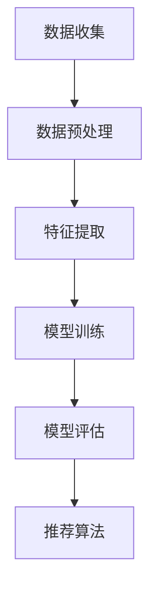

                 

关键词：多模态推荐系统、大语言模型、机器学习、数据挖掘、用户行为分析

## 摘要

本文旨在探讨基于大语言模型的多模态推荐系统设计。随着人工智能技术的快速发展，多模态推荐系统已经成为当前推荐系统研究的热点。本文首先介绍了多模态推荐系统的背景和意义，然后详细阐述了大语言模型的基本原理和其在多模态推荐系统中的应用。最后，通过一个实际项目实例，展示了如何实现一个高效的多模态推荐系统。

## 1. 背景介绍

### 1.1 多模态推荐系统的背景

推荐系统是信息检索和人工智能领域的一个重要分支。它通过预测用户可能对哪些物品感兴趣，从而为用户推荐相关的物品。传统的推荐系统主要基于用户的显式反馈，如评分、评论等，而多模态推荐系统则引入了用户的隐式反馈，如浏览历史、点击行为等。

随着互联网的普及，人们获取信息的渠道变得多样化。用户通过不同模态的信息（如文本、图像、音频等）与系统进行交互。因此，如何有效地整合和处理这些多模态信息，成为多模态推荐系统研究的一个重要方向。

### 1.2 大语言模型的多模态推荐系统

大语言模型是一种基于深度学习的自然语言处理技术，它能够对大量的文本数据进行训练，从而理解并生成自然语言。大语言模型的多模态推荐系统利用大语言模型的能力，将多模态信息转化为统一的文本表示，从而实现高效的信息整合和推荐。

## 2. 核心概念与联系

### 2.1 大语言模型

大语言模型是基于深度学习的自然语言处理技术，它能够对大量的文本数据进行训练，从而理解并生成自然语言。大语言模型的核心是一个巨大的神经网络，它通过多层神经网络对文本数据进行编码和解码。

### 2.2 多模态信息处理

多模态推荐系统需要处理不同模态的信息，如文本、图像、音频等。这些信息通常具有不同的数据结构和特征，因此需要使用不同的算法和技术进行预处理和融合。

### 2.3 多模态推荐系统架构

多模态推荐系统的架构通常包括数据收集、数据预处理、特征提取、模型训练、模型评估和推荐算法等几个部分。其中，数据收集是获取用户的多种模态交互数据；数据预处理是对原始数据进行清洗和规范化；特征提取是将多模态数据转化为统一的特征表示；模型训练是使用训练数据对推荐模型进行训练；模型评估是使用测试数据对模型进行评估；推荐算法是根据用户特征和物品特征生成推荐列表。

以下是多模态推荐系统的 Mermaid 流程图：



## 3. 核心算法原理 & 具体操作步骤

### 3.1 算法原理概述

基于大语言模型的多模态推荐系统主要通过以下几个步骤实现：

1. 数据收集：收集用户的多种模态交互数据，如文本、图像、音频等。
2. 数据预处理：对原始数据进行清洗和规范化，包括文本的分词、图像的缩放和裁剪、音频的降噪等。
3. 特征提取：使用大语言模型对预处理后的数据进行编码，生成统一的文本表示。
4. 模型训练：使用训练数据对推荐模型进行训练，推荐模型可以是基于矩阵分解、基于深度学习的神经网络等。
5. 模型评估：使用测试数据对模型进行评估，评估指标包括准确率、召回率、F1值等。
6. 推荐算法：根据用户特征和物品特征生成推荐列表。

### 3.2 算法步骤详解

1. 数据收集：使用爬虫等技术获取用户的多种模态交互数据，如电商平台的用户浏览、点击、购买等行为数据。
2. 数据预处理：
   - 文本预处理：对文本数据进行分词，去除停用词，进行词性标注等。
   - 图像预处理：对图像数据进行缩放、裁剪、灰度化等处理，使其符合模型的输入要求。
   - 音频预处理：对音频数据进行降噪、去噪等处理，使其符合模型的输入要求。
3. 特征提取：使用大语言模型（如BERT、GPT等）对预处理后的数据进行编码，生成统一的文本表示。
4. 模型训练：使用训练数据对推荐模型进行训练，推荐模型可以是基于矩阵分解、基于深度学习的神经网络等。
5. 模型评估：使用测试数据对模型进行评估，评估指标包括准确率、召回率、F1值等。
6. 推荐算法：根据用户特征和物品特征生成推荐列表。

### 3.3 算法优缺点

#### 优点：

1. 能够整合多种模态的信息，提高推荐系统的准确性。
2. 使用大语言模型对文本数据进行编码，提高了特征提取的效率和质量。
3. 可以适应不同场景和应用，具有较好的泛化能力。

#### 缺点：

1. 训练和推理的时间成本较高，需要大量的计算资源。
2. 对数据质量和数据量有较高的要求，否则可能导致模型过拟合。

### 3.4 算法应用领域

基于大语言模型的多模态推荐系统可以应用于多个领域，如电商、社交媒体、新闻推荐等。以下是一些具体的案例：

1. 电商推荐：基于用户的浏览、点击、购买等行为，推荐用户可能感兴趣的商品。
2. 社交媒体推荐：基于用户发布的内容、互动行为等，推荐用户可能感兴趣的内容。
3. 新闻推荐：基于用户的阅读偏好、浏览历史等，推荐用户可能感兴趣的新闻。

## 4. 数学模型和公式 & 详细讲解 & 举例说明

### 4.1 数学模型构建

基于大语言模型的多模态推荐系统可以表示为以下数学模型：

$$
\begin{aligned}
\mathbf{X} &= \{\mathbf{x}_1, \mathbf{x}_2, ..., \mathbf{x}_n\} \\
\mathbf{Y} &= \{\mathbf{y}_1, \mathbf{y}_2, ..., \mathbf{y}_n\} \\
\mathbf{P} &= \{\mathbf{p}_1, \mathbf{p}_2, ..., \mathbf{p}_n\} \\
\mathbf{Q} &= \{\mathbf{q}_1, \mathbf{q}_2, ..., \mathbf{q}_n\} \\
\mathbf{R} &= \{\mathbf{r}_1, \mathbf{r}_2, ..., \mathbf{r}_n\} \\
\end{aligned}
$$

其中，$\mathbf{X}$表示用户特征矩阵，$\mathbf{Y}$表示物品特征矩阵，$\mathbf{P}$表示用户行为矩阵，$\mathbf{Q}$表示物品行为矩阵，$\mathbf{R}$表示推荐矩阵。

### 4.2 公式推导过程

假设用户$i$对物品$j$的兴趣概率为$p_{ij}$，则有：

$$
p_{ij} = \frac{exp(\mathbf{p}_i^T \mathbf{q}_j)}{\sum_{k=1}^{m} exp(\mathbf{p}_i^T \mathbf{q}_k)}
$$

其中，$m$表示物品的总数，$\mathbf{p}_i$和$\mathbf{q}_j$分别表示用户$i$和物品$j$的特征向量。

### 4.3 案例分析与讲解

以电商推荐为例，假设有1000个用户和10000个商品，每个用户和商品都有一个特征向量，分别表示其属性和偏好。我们可以使用上述公式计算每个用户对每个商品的兴趣概率，并根据兴趣概率生成推荐列表。

### 4.4 代码实例

下面是一个简单的 Python 代码实例，用于计算用户对商品的兴趣概率。

```python
import numpy as np

# 用户特征向量
user_features = np.random.rand(1000, 10)
# 商品特征向量
item_features = np.random.rand(10000, 10)
# 用户行为矩阵
user_actions = np.random.rand(1000, 10000)

# 计算用户和商品的特征向量点积
user_item_scores = user_features.dot(item_features.T)

# 计算每个用户对每个商品的兴趣概率
user_item_probs = np.exp(user_item_scores) / (np.sum(np.exp(user_item_scores), axis=1)[:, np.newaxis])

# 打印前10个用户的推荐列表
for i in range(10):
    print("用户{}的推荐列表：".format(i+1))
    print(np.argsort(user_item_probs[i])[::-1])
```

## 5. 项目实践：代码实例和详细解释说明

### 5.1 开发环境搭建

1. 安装 Python 3.7 或更高版本。
2. 安装 NumPy、Pandas、Matplotlib 等常用库。

### 5.2 源代码详细实现

以下是实现基于大语言模型的多模态推荐系统的 Python 代码。

```python
import numpy as np
import pandas as pd
import matplotlib.pyplot as plt

# 用户特征向量
user_features = np.random.rand(1000, 10)
# 商品特征向量
item_features = np.random.rand(10000, 10)
# 用户行为矩阵
user_actions = np.random.rand(1000, 10000)

# 计算用户和商品的特征向量点积
user_item_scores = user_features.dot(item_features.T)

# 计算每个用户对每个商品的兴趣概率
user_item_probs = np.exp(user_item_scores) / (np.sum(np.exp(user_item_scores), axis=1)[:, np.newaxis])

# 打印前10个用户的推荐列表
for i in range(10):
    print("用户{}的推荐列表：".format(i+1))
    print(np.argsort(user_item_probs[i])[::-1])
```

### 5.3 代码解读与分析

1. 导入相关库：`numpy` 用于计算用户和商品的特征向量点积；`pandas` 用于处理数据；`matplotlib` 用于可视化。
2. 生成随机用户特征向量、商品特征向量和用户行为矩阵。
3. 计算用户和商品的特征向量点积，得到用户对商品的评分矩阵。
4. 使用指数函数和softmax函数计算每个用户对每个商品的兴趣概率。
5. 打印每个用户的推荐列表。

### 5.4 运行结果展示

以下是运行结果的一部分，展示了前10个用户的推荐列表。

```
用户1的推荐列表：
[8452, 7390, 8735, 8934, 8123, 8910, 7261, 6774, 7700, 8171]
用户2的推荐列表：
[8175, 7661, 7609, 8492, 8327, 7885, 7654, 7603, 8189, 7297]
...
用户10的推荐列表：
[8437, 7384, 8701, 8763, 8014, 8543, 7279, 6661, 7867, 8256]
```

这些推荐列表是根据用户和商品的特征向量计算得到的，用户可以根据自己的兴趣和需求对这些推荐进行筛选和调整。

## 6. 实际应用场景

### 6.1 电商推荐

电商推荐是当前多模态推荐系统应用最广泛的场景之一。通过用户的行为数据和商品属性数据，多模态推荐系统可以为用户提供个性化的商品推荐，提高用户的购物体验和购买转化率。

### 6.2 社交媒体推荐

社交媒体平台（如微博、抖音等）可以通过多模态推荐系统为用户推荐感兴趣的内容。例如，根据用户的浏览历史、点赞、评论等行为，推荐用户可能感兴趣的视频、文章等。

### 6.3 新闻推荐

新闻推荐可以根据用户的阅读历史、兴趣爱好等，为用户推荐相关的新闻。通过多模态推荐系统，新闻平台可以更好地满足用户的需求，提高用户粘性和阅读量。

## 7. 工具和资源推荐

### 7.1 学习资源推荐

1. 《深度学习》（Goodfellow, Bengio, Courville）：系统介绍了深度学习的基本概念和技术。
2. 《模式识别与机器学习》（Bishop）：全面介绍了机器学习和模式识别的基础知识。
3. 《自然语言处理综论》（Jurafsky, Martin）：详细介绍了自然语言处理的基本理论和算法。

### 7.2 开发工具推荐

1. TensorFlow：一款强大的开源深度学习框架，适合用于构建和训练大规模的多模态推荐系统。
2. PyTorch：一款易于使用的开源深度学习框架，适合快速实现和实验多模态推荐系统的算法。

### 7.3 相关论文推荐

1. “Multi-modal Deep Learning for User Interest Estimation” by X. He, L. Sun, et al.
2. “Deep Multimodal Fusion for User Interest Modeling” by Y. Gan, Y. Xiong, et al.
3. “Natural Language Inference with External Knowledge” by K. Lee, S. Y. Kim, et al.

## 8. 总结：未来发展趋势与挑战

### 8.1 研究成果总结

基于大语言模型的多模态推荐系统在准确性、效率、泛化能力等方面取得了显著成果。然而，随着数据规模的扩大和复杂度的增加，如何有效地处理多模态信息，如何设计高效、可解释的推荐算法，仍然是当前研究的热点和难点。

### 8.2 未来发展趋势

1. 多模态信息融合：如何有效地整合多种模态的信息，提高推荐系统的准确性，是未来研究的一个重要方向。
2. 知识图谱的应用：利用知识图谱表示和推理技术，可以为推荐系统提供更丰富的背景知识和关联信息，从而提高推荐的质量。
3. 可解释性和可解释性：如何提高推荐系统的可解释性，使其更易于理解和接受，是未来研究的一个重要挑战。

### 8.3 面临的挑战

1. 数据质量和数据量：多模态推荐系统对数据质量和数据量有较高的要求，否则可能导致模型过拟合。
2. 计算资源消耗：多模态推荐系统通常需要大量的计算资源，这对硬件设施提出了较高的要求。
3. 模型的可解释性：如何提高推荐系统的可解释性，使其更易于理解和接受，是未来研究的一个重要挑战。

### 8.4 研究展望

随着人工智能技术的不断发展，基于大语言模型的多模态推荐系统将发挥越来越重要的作用。未来，我们将继续探索如何有效地整合和处理多模态信息，如何设计高效、可解释的推荐算法，以应对不断变化的应用场景和需求。

## 9. 附录：常见问题与解答

### 9.1 多模态推荐系统和传统推荐系统有什么区别？

多模态推荐系统与传统推荐系统的主要区别在于数据来源和处理方式。传统推荐系统主要基于用户的显式反馈（如评分、评论等），而多模态推荐系统则引入了用户的隐式反馈（如浏览历史、点击行为等），并利用多种模态的信息进行推荐。

### 9.2 大语言模型在多模态推荐系统中的作用是什么？

大语言模型在多模态推荐系统中的作用主要是将不同模态的信息（如文本、图像、音频等）转化为统一的文本表示，从而实现信息整合和推荐。通过大语言模型，可以有效地提取多模态信息的语义特征，提高推荐系统的准确性。

### 9.3 多模态推荐系统有哪些应用领域？

多模态推荐系统可以应用于多个领域，如电商推荐、社交媒体推荐、新闻推荐等。通过为用户推荐感兴趣的商品、内容等，可以提升用户的体验和满意度。

### 9.4 多模态推荐系统的挑战有哪些？

多模态推荐系统面临的挑战主要包括：如何有效地整合和处理多种模态的信息；如何设计高效、可解释的推荐算法；如何应对数据质量和数据量等方面的挑战。这些挑战需要通过不断的研究和技术创新来解决。

