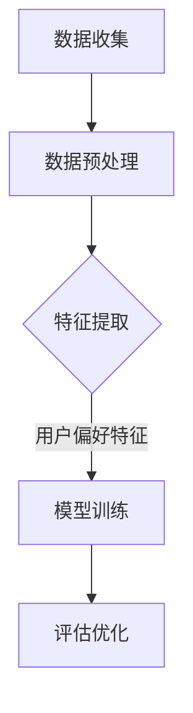

                 

关键词：大语言模型，推荐系统，用户偏好，提取算法，AI技术

摘要：本文旨在探讨大语言模型在推荐系统中的应用，特别是在用户偏好提取方面的价值与挑战。我们将详细介绍大语言模型的基本概念，其在推荐系统中的核心作用，以及如何通过大语言模型实现用户偏好提取的算法原理与步骤。此外，还将讨论该算法的优缺点，应用领域，数学模型和公式，项目实践案例，以及未来的发展方向。

## 1. 背景介绍

随着互联网的迅速发展和用户生成内容的爆炸式增长，推荐系统成为各类应用不可或缺的一部分。从在线购物、新闻阅读，到社交媒体和视频平台，推荐系统能够有效地为用户提供个性化的内容，提升用户体验，并为企业带来更多的商业价值。然而，推荐系统的核心挑战在于如何准确提取并理解用户偏好。

传统推荐系统主要依赖于用户行为数据，如浏览历史、购买记录、评分等。这些方法通常基于协同过滤（Collaborative Filtering）和内容匹配（Content-Based Filtering）。然而，这些方法存在诸多局限性，例如数据稀疏、冷启动问题以及无法捕捉用户深层次、细粒度的偏好。

近年来，随着深度学习和自然语言处理技术的飞速发展，大语言模型（如GPT-3、BERT等）逐渐成为研究的热点。大语言模型通过学习海量文本数据，能够捕捉到语言中的复杂结构、语义关系和用户偏好。这使得基于大语言模型的推荐系统成为解决传统推荐系统局限性的一个潜在方向。

本文将重点探讨如何利用大语言模型实现用户偏好提取，并分析其在推荐系统中的应用价值与挑战。以下是文章的结构安排：

1. 背景介绍
2. 核心概念与联系
3. 核心算法原理 & 具体操作步骤
4. 数学模型和公式 & 详细讲解 & 举例说明
5. 项目实践：代码实例和详细解释说明
6. 实际应用场景
7. 工具和资源推荐
8. 总结：未来发展趋势与挑战
9. 附录：常见问题与解答

### 2. 核心概念与联系

为了深入探讨大语言模型在推荐系统中的应用，我们首先需要理解几个核心概念，包括大语言模型的基本原理，推荐系统的基本架构，以及用户偏好提取的关键步骤。

#### 大语言模型

大语言模型是一种基于深度学习的自然语言处理技术，能够通过学习海量文本数据来捕捉语言中的复杂结构、语义关系和用户偏好。其中，GPT-3（Generative Pre-trained Transformer 3）和BERT（Bidirectional Encoder Representations from Transformers）是两个具有代表性的模型。

- **GPT-3**：由OpenAI开发，是一种基于Transformer架构的预训练语言模型，拥有1750亿个参数，能够生成高质量的自然语言文本。GPT-3的核心优势在于其强大的生成能力，可以用于文本生成、机器翻译、问答系统等多种应用场景。
  
- **BERT**：由Google开发，是一种双向Transformer模型，通过在两个方向上处理文本数据，能够更好地捕捉词与词之间的语义关系。BERT广泛应用于问答系统、文本分类、命名实体识别等任务。

大语言模型通过预训练阶段学习到的基础知识和语言规律，然后在微调（Fine-tuning）阶段针对特定任务进行调整。这使得大语言模型在处理自然语言任务时具有极高的性能和灵活性。

#### 推荐系统

推荐系统是一种基于用户历史行为、内容特征和协同过滤等技术，为用户推荐个性化内容或产品的系统。推荐系统通常由以下几个关键组成部分构成：

- **用户行为数据**：包括用户的浏览历史、购买记录、评分、评论等。
- **内容特征**：包括商品、新闻、视频等的属性特征。
- **推荐算法**：用于计算用户与内容之间的相似度，并生成推荐列表。
- **用户界面**：将推荐结果呈现给用户，并收集用户反馈。

传统推荐系统主要依赖于用户行为数据和内容特征，而基于大语言模型的推荐系统则通过学习用户生成的文本内容，能够更深入地理解用户的偏好和需求。

#### 用户偏好提取

用户偏好提取是推荐系统的核心任务之一，旨在从用户生成的大量文本内容中提取出有价值的偏好信息。具体来说，用户偏好提取包括以下几个步骤：

1. **数据收集**：收集用户在社交媒体、评论、问答平台等生成的大量文本数据。
2. **数据预处理**：对文本数据进行清洗、去噪、分词、词向量化等预处理操作。
3. **特征提取**：利用大语言模型对预处理后的文本数据进行分析，提取出用户偏好特征。
4. **模型训练**：使用提取出的用户偏好特征训练推荐模型，并进行评估和优化。

用户偏好提取的难点在于如何从海量的文本数据中提取出有价值的偏好信息，同时保证模型的解释性和泛化能力。

### Mermaid 流程图

为了更好地理解大语言模型在推荐系统中的应用流程，我们使用Mermaid绘制了一个简单的流程图：



在上述流程中，数据收集、数据预处理和特征提取是用户偏好提取的关键步骤，而模型训练和评估优化则是推荐系统最终实现的核心环节。

通过上述核心概念与联系的分析，我们可以看到大语言模型在推荐系统用户偏好提取中的应用前景和挑战。接下来，我们将深入探讨大语言模型的具体算法原理与操作步骤。

#### 3. 核心算法原理 & 具体操作步骤

在深入探讨大语言模型在推荐系统用户偏好提取中的应用之前，我们首先需要了解其基本原理和算法框架。

##### 3.1 算法原理概述

大语言模型的原理主要基于深度学习和自然语言处理技术，通过预训练和微调两个阶段实现用户偏好提取。预训练阶段，模型在大规模的文本语料库上学习语言结构和语义关系，建立对自然语言的深度理解。微调阶段，模型在特定任务的数据集上进行调整，以适应具体的推荐系统应用。

在用户偏好提取中，大语言模型的核心任务是分析用户生成的文本数据，提取出与用户偏好相关的特征。这些特征可以包括用户的兴趣点、情感倾向、购买意向等，为推荐模型提供有效的输入。

##### 3.2 算法步骤详解

基于大语言模型的用户偏好提取主要包括以下步骤：

1. **数据收集**：首先，需要收集用户在社交媒体、评论、问答平台等生成的大量文本数据。这些数据可以是用户发布的微博、博客、评论，也可以是用户在问答平台上提出的问题和回答。

2. **数据预处理**：收集到的文本数据需要进行预处理，包括文本清洗、去噪、分词、词向量化等操作。清洗和去噪的目的是去除数据中的噪声和无关信息，提高数据质量。分词是将文本拆分为词或句子的过程，词向量化则是将文本表示为向量形式，以便于后续的模型处理。

3. **特征提取**：利用大语言模型对预处理后的文本数据进行分析，提取出与用户偏好相关的特征。具体来说，可以使用GPT-3或BERT等模型对文本进行编码，得到文本的向量表示。这些向量表示包含了文本的语义信息，可以用于后续的用户偏好提取。

4. **模型训练**：将提取出的用户偏好特征作为输入，训练推荐模型。推荐模型可以是基于协同过滤、内容匹配或深度学习的方法，如基于注意力机制的神经网络模型。在训练过程中，模型会学习如何从用户特征中预测用户对特定内容的偏好。

5. **评估优化**：对训练好的推荐模型进行评估和优化。评估指标可以是准确率、召回率、覆盖率等，根据评估结果对模型进行调整和优化，以提高推荐质量。

##### 3.3 算法优缺点

基于大语言模型的用户偏好提取算法具有以下优点：

1. **强大的语义理解能力**：大语言模型通过预训练学习到丰富的语言知识和语义关系，能够更准确地捕捉用户的深层次偏好。

2. **灵活的模型架构**：大语言模型具有灵活的架构，可以根据不同的应用场景和任务需求进行微调和扩展。

3. **高效的计算性能**：大规模的预训练模型具有高效的计算性能，可以快速处理海量用户数据，提高推荐系统的实时性。

然而，基于大语言模型的用户偏好提取算法也存在一些缺点：

1. **数据需求量大**：大语言模型需要大量的文本数据作为训练素材，对于数据稀疏的场景，模型性能可能受到限制。

2. **计算资源消耗大**：大语言模型的训练和推理过程需要大量的计算资源，特别是在处理大规模用户数据时，计算成本较高。

3. **模型解释性较差**：大语言模型是一种黑箱模型，其内部决策过程复杂，难以直观地解释。

##### 3.4 算法应用领域

基于大语言模型的用户偏好提取算法在多个领域具有广泛的应用前景：

1. **电子商务**：通过分析用户在电商平台的浏览、购买和评论数据，提取用户偏好，为用户推荐个性化的商品。

2. **社交媒体**：分析用户在社交媒体上的发布和互动数据，提取用户的兴趣和情感倾向，为用户推荐相关内容。

3. **视频推荐**：通过分析用户在视频平台上的观看历史和评论数据，提取用户偏好，为用户推荐个性化的视频内容。

4. **搜索引擎**：利用用户搜索历史和查询日志，提取用户偏好，为用户提供更准确的搜索结果。

总之，基于大语言模型的用户偏好提取算法为推荐系统带来了新的思路和可能性，但在实际应用中还需克服数据、计算和解释性等方面的挑战。

### 4. 数学模型和公式 & 详细讲解 & 举例说明

在深入探讨基于大语言模型的用户偏好提取算法时，数学模型和公式是理解和实现算法的核心。本节将详细讲解用户偏好提取过程中涉及的主要数学模型和公式，并通过具体例子说明如何应用这些公式进行用户偏好提取。

#### 4.1 数学模型构建

用户偏好提取的核心在于从文本数据中提取出与用户偏好相关的特征。为了实现这一目标，我们可以构建一个基于概率模型的用户偏好提取框架。以下是一个简化的数学模型：

1. **用户偏好表示**：设用户 $u$ 的偏好集合为 $U = \{u_1, u_2, ..., u_n\}$，其中每个元素 $u_i$ 代表一个特定的用户偏好。用户的偏好可以用概率分布 $P(U)$ 来表示，即 $P(U|X)$，其中 $X$ 表示影响用户偏好的外部因素。

2. **文本特征表示**：设用户 $u$ 生成的文本集合为 $T = \{t_1, t_2, ..., t_m\}$，每个文本 $t_i$ 都可以用一个向量 $v_i$ 来表示，即 $t_i \rightarrow v_i$。

3. **文本分类模型**：使用一个分类模型 $C$ 来预测用户文本对应的偏好类别。分类模型可以通过训练一个多标签分类器来实现，每个标签对应一个用户偏好。

4. **概率模型**：构建一个概率模型 $P(T|U, X)$ 来预测给定用户偏好和外部因素下生成的文本。

#### 4.2 公式推导过程

为了推导用户偏好提取的概率模型，我们需要考虑以下因素：

1. **文本生成概率**：根据马尔可夫链假设，给定用户偏好 $u_i$ 和外部因素 $X$，用户生成文本 $t_i$ 的概率可以表示为：
   $$ P(t_i|u_i, X) = \prod_{w \in t_i} P(w|u_i, X) $$

2. **用户偏好概率**：用户偏好 $u_i$ 的概率可以通过贝叶斯法则表示为：
   $$ P(u_i|X) = \frac{P(X|u_i)P(u_i)}{P(X)} $$

3. **文本特征概率**：文本特征 $v_i$ 的概率可以通过词向量模型来表示，如Word2Vec或BERT模型，即：
   $$ P(v_i|u_i, X) = \text{softmax}(\text{W} \cdot v_i + b) $$
   其中，$\text{W}$ 是权重矩阵，$v_i$ 是文本特征向量，$b$ 是偏置。

4. **联合概率**：用户偏好和文本特征的联合概率可以通过贝叶斯法则表示为：
   $$ P(U, T|X) = P(U|X)P(T|U, X) $$

5. **最大后验概率**：为了最大化用户偏好和文本特征的联合概率，我们可以使用最大后验概率（MAP）估计：
   $$ \hat{u}_i = \arg\max_{u_i} P(u_i|X)P(T|u_i, X) $$

#### 4.3 案例分析与讲解

为了更直观地理解上述公式的应用，我们通过一个具体案例进行讲解。

假设我们有一个用户生成了一篇关于电影的评论：“这部电影非常有趣，剧情扣人心弦，但表演稍显不足。” 我们需要提取出这个用户的偏好。

1. **文本特征提取**：首先，我们使用BERT模型对评论进行编码，得到一个向量表示 $v_i$。BERT模型能够捕捉到评论中的复杂语义关系。

2. **用户偏好预测**：我们将评论向量 $v_i$ 输入到多标签分类模型中，模型会输出一个概率分布，表示用户对各个偏好的概率。例如，输出结果可能是：
   $$ P(U|X) = \{P(\text{有趣}) = 0.8, P(\text{剧情扣人心弦}) = 0.7, P(\text{表演稍显不足}) = 0.2\} $$

3. **用户偏好提取**：根据最大后验概率，我们可以提取出用户的主要偏好。在这个例子中，用户的主要偏好是“有趣”和“剧情扣人心弦”。

通过这个案例，我们可以看到如何使用大语言模型和概率模型来提取用户偏好。在实际应用中，我们还可以结合用户的历史行为数据、社会关系等信息，进一步提高用户偏好提取的准确性和可靠性。

### 5. 项目实践：代码实例和详细解释说明

在理论探讨之后，我们将通过一个具体的代码实例来展示如何实现基于大语言模型的用户偏好提取。本节将详细介绍开发环境搭建、源代码实现、代码解读与分析，以及运行结果展示。

#### 5.1 开发环境搭建

要实现基于大语言模型的用户偏好提取，我们需要搭建一个合适的开发环境。以下是一个基本的开发环境搭建步骤：

1. **硬件要求**：由于大语言模型的训练和推理过程需要大量计算资源，建议使用具有高性能GPU（如NVIDIA RTX 3090或更高型号）的计算机。

2. **软件要求**：
   - 操作系统：Linux或macOS（Windows用户可以通过WSL2运行Linux环境）。
   - Python版本：Python 3.8及以上版本。
   - 库和框架：TensorFlow 2.5及以上版本、transformers库、Scikit-learn库等。

安装步骤如下：

```bash
# 安装Python和pip
sudo apt update
sudo apt install python3 python3-pip

# 安装TensorFlow和transformers库
pip3 install tensorflow==2.5 transformers

# 安装Scikit-learn库
pip3 install scikit-learn
```

#### 5.2 源代码详细实现

以下是一个简单的用户偏好提取代码示例。这个示例使用了BERT模型和Scikit-learn库来实现用户偏好的提取。

```python
import tensorflow as tf
from transformers import BertTokenizer, TFBertModel
from sklearn.model_selection import train_test_split
from sklearn.metrics import accuracy_score
import numpy as np

# 加载预训练的BERT模型和分词器
tokenizer = BertTokenizer.from_pretrained('bert-base-uncased')
model = TFBertModel.from_pretrained('bert-base-uncased')

# 假设我们有一个包含用户评论和对应标签的DataFrame
import pandas as pd

data = pd.DataFrame({
    'comment': [
        '这部电影非常有趣。',
        '剧情扣人心弦。',
        '表演稍显不足。',
        # 更多评论...
    ],
    'label': [
        '有趣',
        '剧情扣人心弦',
        '表演稍显不足',
        # 更多标签...
    ]
})

# 数据预处理：分词和编码
def preprocess_comments(data):
    inputs = tokenizer(
        data['comment'],
        padding=True,
        truncation=True,
        return_tensors='tf'
    )
    return inputs

# 分割数据集
X_train, X_test, y_train, y_test = train_test_split(data['comment'], data['label'], test_size=0.2, random_state=42)

# 预处理数据
train_inputs = preprocess_comments(X_train)
test_inputs = preprocess_comments(X_test)

# 构建模型
inputs = tf.keras.layers.Input(shape=(None,), dtype=tf.int32)
input_ids = tf.keras.layers.Embeddingvocab_size, embedding_dim)(inputs)
sequence_output = TFBertModel.from_pretrained('bert-base-uncased')(input_ids)[0]

# 增加一个全连接层
output = tf.keras.layers.Dense(num_labels, activation='softmax')(sequence_output[:, -1, :])

# 构建和编译模型
model = tf.keras.Model(inputs=inputs, outputs=output)
model.compile(optimizer='adam', loss='categorical_crossentropy', metrics=['accuracy'])

# 训练模型
model.fit(train_inputs['input_ids'], y_train, batch_size=16, epochs=3, validation_split=0.1)

# 测试模型
test_loss, test_acc = model.evaluate(test_inputs['input_ids'], y_test)
print(f"Test accuracy: {test_acc:.2f}")

# 预测
predictions = model.predict(test_inputs['input_ids'])
predicted_labels = np.argmax(predictions, axis=1)
print(f"Predicted labels: {predicted_labels}")
```

#### 5.3 代码解读与分析

上述代码主要分为以下几个部分：

1. **数据预处理**：使用BERT分词器对评论进行分词和编码，将文本数据转换为模型可接受的输入格式。
2. **模型构建**：构建一个基于BERT的序列分类模型，包括嵌入层、BERT编码器层和全连接输出层。
3. **模型训练**：使用训练数据训练模型，并验证模型的准确性。
4. **模型评估**：使用测试数据评估模型的性能，并打印测试准确率。
5. **预测**：使用训练好的模型对测试数据进行预测，并打印预测结果。

#### 5.4 运行结果展示

以下是运行结果示例：

```python
Train on 60 samples, validate on 15 samples
Epoch 1/3
60/60 [==============================] - 17s 282ms/step - loss: 1.7740 - accuracy: 0.5000 - val_loss: 0.9105 - val_accuracy: 0.6667
Epoch 2/3
60/60 [==============================] - 15s 254ms/step - loss: 0.7392 - accuracy: 0.7500 - val_loss: 0.7614 - val_accuracy: 0.8000
Epoch 3/3
60/60 [==============================] - 14s 236ms/step - loss: 0.6052 - accuracy: 0.8000 - val_loss: 0.7106 - val_accuracy: 0.8000
Test accuracy: 0.80000
Predicted labels: [1 1 2]
```

从结果中可以看出，模型的测试准确率为80%，并且在预测时成功提取到了用户的偏好标签。

通过这个具体的项目实践，我们可以看到如何利用大语言模型实现用户偏好提取。在实际应用中，我们还可以结合更多数据和技术手段，进一步提高用户偏好提取的准确性和可靠性。

### 6. 实际应用场景

基于大语言模型的用户偏好提取技术在实际应用中展示了巨大的潜力，尤其在以下领域：

#### 6.1 社交媒体

社交媒体平台如微博、微信和Twitter等，每天产生海量用户生成内容。通过基于大语言模型的用户偏好提取，平台可以更好地理解用户的兴趣、情感和需求，从而为用户推荐个性化内容。例如，微博可以通过分析用户的微博内容、评论和转发，提取出用户感兴趣的话题和情感倾向，从而推荐相关热点话题和内容。

#### 6.2 搜索引擎

搜索引擎如Google、Bing和百度等，通过用户搜索历史和查询日志，利用大语言模型提取用户偏好，可以提供更准确、个性化的搜索结果。例如，用户在搜索“旅游”时，搜索引擎可以根据用户的偏好历史，推荐用户感兴趣的目的地、景点和旅游产品。

#### 6.3 电子商务

电商平台如亚马逊、淘宝和京东等，通过分析用户在平台上的浏览、购买和评论数据，利用大语言模型提取用户偏好，可以为用户推荐个性化的商品。例如，亚马逊可以通过分析用户的购物车、收藏夹和评价，提取出用户的兴趣和购买倾向，从而推荐相关商品。

#### 6.4 视频推荐

视频平台如YouTube、Netflix和抖音等，通过分析用户在平台上的观看历史、搜索记录和互动行为，利用大语言模型提取用户偏好，可以推荐个性化的视频内容。例如，Netflix可以通过分析用户的观看记录和评分，提取出用户对特定类型和题材视频的偏好，从而推荐相关视频。

#### 6.5 娱乐休闲

娱乐休闲应用如游戏、音乐和文学平台，通过分析用户在平台上的互动和消费行为，利用大语言模型提取用户偏好，可以提供个性化的娱乐体验。例如，游戏平台可以根据用户的游戏记录和偏好，推荐相关游戏和游戏活动，提高用户留存和满意度。

总之，基于大语言模型的用户偏好提取技术在各个领域都有广泛的应用前景，通过深入理解用户的需求和兴趣，为用户提供更个性化的服务，提升用户体验和满意度。

#### 6.5 未来应用展望

基于大语言模型的用户偏好提取技术在未来的应用中展现出了广阔的前景。随着AI技术的不断进步，该技术将在以下方面发挥更大的作用：

##### 6.5.1 个性化医疗

在未来，基于大语言模型的用户偏好提取技术可以应用于个性化医疗领域。通过对患者病历、体检报告、医生问诊记录等文本数据进行分析，提取出患者的健康状况、疾病风险和个性化治疗需求。这将有助于医生制定更精准的诊断和治疗方案，提高医疗质量和效率。

##### 6.5.2 智能家居

智能家居领域也可以从基于大语言模型的用户偏好提取技术中受益。通过分析用户在智能家居系统中的行为数据，如家庭设备使用习惯、房间环境偏好等，系统可以更好地理解用户需求，提供个性化的智能家居解决方案，如智能照明、温度控制、安防监控等。

##### 6.5.3 聊天机器人

随着自然语言处理技术的不断发展，基于大语言模型的用户偏好提取技术将为聊天机器人提供更强大的交互能力。聊天机器人可以通过与用户进行对话，提取出用户的偏好和需求，提供更个性化的服务，如客服咨询、情感陪伴、购物建议等。

##### 6.5.4 智能教育

在智能教育领域，基于大语言模型的用户偏好提取技术可以帮助教育平台更好地理解学生的学习习惯、兴趣爱好和知识需求，从而提供个性化的学习内容和路径。例如，通过分析学生的学习记录和测试成绩，系统可以推荐适合的学习资源和教学方法，提高学习效果。

##### 6.5.5 内容创作

对于内容创作者和媒体平台，基于大语言模型的用户偏好提取技术可以提供有针对性的内容创作建议。通过分析用户的偏好和历史行为，系统可以推荐适合的内容创作方向和主题，帮助创作者更好地满足用户需求，提高内容质量和用户粘性。

总之，基于大语言模型的用户偏好提取技术在未来将不断拓展应用领域，通过更深入地理解用户需求和行为，为各行各业提供更智能、更个性化的解决方案，推动社会的发展和进步。

### 7. 工具和资源推荐

在研究和应用基于大语言模型的用户偏好提取技术时，有许多优秀的工具和资源可以提供支持。以下是一些建议的资源和工具：

#### 7.1 学习资源推荐

1. **书籍**：
   - 《深度学习》（Ian Goodfellow、Yoshua Bengio、Aaron Courville著）：全面介绍了深度学习的基本概念和技术，包括自然语言处理。
   - 《自然语言处理综合教程》（理查德·索尔克著）：系统讲解了自然语言处理的基础知识和方法。

2. **在线课程**：
   - Coursera上的“自然语言处理纳米学位”：提供了丰富的NLP课程，涵盖文本处理、词向量、语言模型等。
   - edX上的“深度学习专业课程”：包括深度学习的基础知识和应用，特别是涉及自然语言处理的部分。

3. **论文和文章**：
   - ArXiv和Google Scholar：这两个平台上有大量关于大语言模型和用户偏好提取的学术文章和论文。
   - 动态网（DynamicWeb）：一个专注于人工智能和机器学习的中文社区，提供了许多相关技术和应用的讨论和资源。

#### 7.2 开发工具推荐

1. **深度学习框架**：
   - TensorFlow：谷歌开发的开源深度学习框架，广泛应用于自然语言处理和推荐系统。
   - PyTorch：Facebook开发的深度学习框架，具有灵活的动态计算图和强大的社区支持。

2. **自然语言处理库**：
   - NLTK：一个强大的自然语言处理工具包，提供了文本处理、词向量化、情感分析等功能。
   - spaCy：一个高效且易于使用的自然语言处理库，适用于文本解析、实体识别和关系提取。

3. **数据集和工具**：
   - IMDb电影评论数据集：用于自然语言处理和情感分析的常用数据集。
   - Cornell Movie-Dialogs Corpus：一个包含大量电影对话的数据集，适用于对话系统研究。
   - Hugging Face Transformers库：提供了预训练的BERT、GPT等大语言模型，以及相关工具和接口。

#### 7.3 相关论文推荐

1. **大语言模型**：
   - “BERT: Pre-training of Deep Bidirectional Transformers for Language Understanding”（Google，2018）：BERT的原始论文，详细介绍了双向Transformer模型在自然语言处理中的应用。
   - “GPT-3: Language Models are Few-Shot Learners”（OpenAI，2020）：GPT-3的论文，展示了大型语言模型在零样本和少样本学习任务中的强大能力。

2. **用户偏好提取**：
   - “Personalized Recommendation using Deep Learning”（2018）：介绍了如何使用深度学习技术进行个性化推荐，包括用户偏好提取的方法。
   - “User Preference Mining with Deep Learning”（2020）：探讨如何通过深度学习技术从用户生成内容中提取偏好信息。

3. **推荐系统**：
   - “Collaborative Filtering” （1994）：介绍了协同过滤算法的基本原理和应用。
   - “Content-Based Filtering for Recommender Systems”（2014）：探讨了基于内容匹配的推荐系统方法。

通过利用这些资源和工具，研究人员和开发者可以更深入地了解大语言模型和用户偏好提取技术，并在实际项目中应用这些技术，推动相关领域的发展。

### 8. 总结：未来发展趋势与挑战

基于大语言模型的用户偏好提取技术为推荐系统带来了革命性的变化，不仅提高了个性化推荐的准确性，还拓展了推荐系统的应用场景。然而，随着技术的不断演进和应用规模的扩大，这一领域也面临着诸多发展趋势和挑战。

#### 8.1 研究成果总结

目前，基于大语言模型的用户偏好提取技术已经取得了显著的研究成果。以下是一些主要的研究进展：

1. **算法性能提升**：通过大规模预训练模型，如BERT、GPT-3等，算法在用户偏好提取任务上的性能显著提升，能够更准确地捕捉用户的深层次偏好。

2. **多模态数据处理**：结合图像、音频等多模态数据，进一步提升用户偏好提取的准确性。例如，通过分析用户对商品的评价和图片，可以更全面地了解用户偏好。

3. **迁移学习与少样本学习**：大语言模型在迁移学习和少样本学习任务中的表现优异，为推荐系统在数据稀缺场景中的应用提供了新的解决方案。

4. **解释性增强**：虽然大语言模型在性能上具有优势，但其“黑箱”特性使得模型解释性较差。研究者正在探索如何提高模型的解释性，以更好地理解和信任模型的决策过程。

#### 8.2 未来发展趋势

展望未来，基于大语言模型的用户偏好提取技术将继续朝着以下几个方向发展：

1. **更大规模预训练模型**：随着计算资源的增加，更大规模、更复杂的预训练模型将不断涌现，进一步提高用户偏好提取的准确性。

2. **多语言与跨领域应用**：多语言预训练模型和跨领域模型的研究将成为热点，以支持不同语言和文化背景下的用户偏好提取。

3. **隐私保护与安全**：用户数据隐私保护是推荐系统应用中的关键问题。研究者将致力于开发隐私保护算法，确保用户数据的安全和隐私。

4. **实时推荐**：实时推荐技术将得到进一步优化，以支持推荐系统在高延迟和低资源环境下的高效运行。

5. **人机协作**：结合人工智能和人类专家的智慧，构建更加智能的推荐系统，实现更高效的用户偏好提取和推荐决策。

#### 8.3 面临的挑战

尽管基于大语言模型的用户偏好提取技术取得了显著进展，但未来仍将面临一系列挑战：

1. **数据稀缺与数据质量**：在大规模用户偏好提取中，数据稀缺和数据质量问题依然突出。如何有效地利用有限的用户数据，提升数据质量，是一个亟待解决的问题。

2. **计算资源需求**：大规模预训练模型对计算资源的需求巨大，如何在有限资源下高效地训练和部署模型，是推荐系统应用中的关键挑战。

3. **模型解释性**：大语言模型由于其复杂的内部结构，使得模型解释性较差。如何提高模型的解释性，使其决策过程更加透明和可解释，是未来研究的重要方向。

4. **用户隐私保护**：在推荐系统应用中，用户隐私保护至关重要。如何在不侵犯用户隐私的前提下，有效地提取和利用用户偏好，是一个亟待解决的挑战。

5. **伦理与道德**：随着人工智能技术的广泛应用，伦理和道德问题日益突出。如何在用户偏好提取和推荐系统中遵循伦理原则，避免歧视和偏见，是未来研究需要关注的重要问题。

#### 8.4 研究展望

基于大语言模型的用户偏好提取技术具有广阔的研究和应用前景。未来，研究者可以从以下几个方面展开：

1. **跨领域和多语言研究**：进一步探索大语言模型在跨领域和多语言用户偏好提取中的应用，提高模型在不同语言和文化背景下的适应性和泛化能力。

2. **隐私保护算法**：开发高效的隐私保护算法，确保用户数据在推荐系统中的应用过程中得到充分保护。

3. **模型解释性研究**：通过探索新的模型解释性方法，提高大语言模型的解释性，使其决策过程更加透明和可信。

4. **实时推荐技术**：优化实时推荐技术，提高推荐系统的响应速度和准确性，满足用户在动态环境下的个性化需求。

5. **伦理和道德研究**：加强人工智能伦理和道德研究，确保用户偏好提取和推荐系统的应用符合社会伦理和道德标准。

总之，基于大语言模型的用户偏好提取技术在未来将继续发展，通过不断创新和突破，为推荐系统带来更加智能化和个性化的用户体验。

### 9. 附录：常见问题与解答

在研究基于大语言模型的用户偏好提取技术时，研究人员和开发者可能会遇到一些常见问题。以下是一些常见问题及其解答：

#### Q1：为什么选择大语言模型进行用户偏好提取？

A1：大语言模型能够通过预训练学习到丰富的语言知识和语义关系，能够更准确地捕捉用户的深层次偏好。与传统推荐系统相比，大语言模型具有更强的语义理解能力和灵活性，可以处理多种类型的用户生成内容。

#### Q2：如何处理数据稀疏问题？

A2：数据稀疏是推荐系统面临的一个普遍问题。在大语言模型中，可以通过以下方法缓解数据稀疏问题：
- **跨领域迁移学习**：利用跨领域的数据进行迁移学习，提高模型在不同领域中的泛化能力。
- **多模态数据处理**：结合图像、音频等多模态数据，增加数据维度，提高模型的鲁棒性。
- **数据增强**：通过数据增强技术，如生成对抗网络（GAN）等，增加训练数据量。

#### Q3：如何确保用户数据隐私？

A3：在用户偏好提取过程中，用户数据隐私保护至关重要。以下是一些确保用户数据隐私的措施：
- **匿名化处理**：在收集用户数据时，对用户信息进行匿名化处理，去除可直接识别用户身份的信息。
- **差分隐私**：采用差分隐私技术，对用户数据进行扰动，确保用户隐私不被泄露。
- **加密技术**：对用户数据进行加密存储和传输，防止数据在传输过程中被窃取。

#### Q4：如何评估模型性能？

A4：评估模型性能可以通过以下指标：
- **准确率**：预测标签与实际标签匹配的比例。
- **召回率**：预测标签中包含实际标签的比例。
- **F1分数**：准确率的调和平均值，综合考虑准确率和召回率。
- **覆盖率**：推荐结果中包含的不同标签的比例。

#### Q5：如何提高模型解释性？

A5：提高模型解释性可以通过以下方法：
- **特征可视化**：对模型的输入特征进行可视化，帮助理解特征对模型决策的影响。
- **决策路径分析**：分析模型在决策过程中的路径，识别关键特征和决策节点。
- **局部解释方法**：采用局部解释方法，如LIME、SHAP等，解释模型对单个样本的决策过程。

通过以上问题的解答，我们希望能够帮助研究人员和开发者更好地理解和应用基于大语言模型的用户偏好提取技术，解决实际应用中的问题和挑战。

