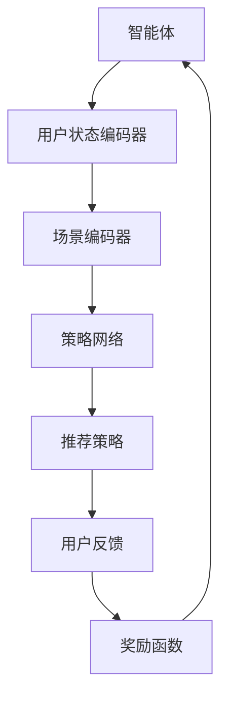

                 

关键词：强化学习，多场景推荐，策略学习，推荐系统，机器学习，在线学习，自适应推荐，多任务学习，场景感知，反馈机制

> 摘要：本文深入探讨了基于强化学习的多场景推荐策略，分析了其在推荐系统中的应用和价值。通过介绍强化学习的核心概念、算法原理及具体实现步骤，本文探讨了如何利用强化学习构建自适应、高效的多场景推荐系统，以及其在实际应用中的案例分析和未来展望。

## 1. 背景介绍

推荐系统作为一种信息过滤和内容发现的技术，已被广泛应用于电子商务、社交媒体、新闻推送等多个领域。传统的推荐系统主要依赖于基于内容的过滤、协同过滤和基于模型的推荐方法，这些方法在特定场景下能够取得较好的效果。然而，面对复杂多变的多场景环境，传统推荐系统往往难以适应，缺乏灵活性和实时性。

随着机器学习技术的快速发展，强化学习作为一种重要的算法框架，逐渐成为解决多场景推荐问题的重要手段。强化学习通过学习最优策略，使得智能体能够在复杂环境中做出最优决策。本文旨在探讨如何利用强化学习构建自适应、高效的多场景推荐策略，以应对不同场景下的推荐需求。

## 2. 核心概念与联系

### 2.1 强化学习的核心概念

强化学习是一种通过学习环境中的奖励和惩罚来优化决策的机器学习算法。其核心概念包括：

- **智能体（Agent）**：执行动作、接收奖励并学习策略的实体。
- **环境（Environment）**：智能体执行动作、接收反馈的上下文。
- **状态（State）**：描述环境当前状态的变量集合。
- **动作（Action）**：智能体在特定状态下可执行的动作集合。
- **奖励（Reward）**：智能体执行动作后获得的即时反馈。
- **策略（Policy）**：智能体在特定状态下选择最优动作的规则。

### 2.2 多场景推荐系统的架构

基于强化学习的多场景推荐系统可以分为以下几个主要部分：

- **用户状态编码器**：将用户的兴趣、行为等信息编码为高维状态向量。
- **场景编码器**：将场景的特征信息编码为高维状态向量。
- **策略网络**：通过学习用户状态和场景状态，生成推荐策略。
- **奖励函数**：评估推荐结果的优劣，提供反馈信号。
- **探索策略**：在初始阶段和策略不稳定时，帮助智能体探索未知状态。

### 2.3 Mermaid 流程图



## 3. 核心算法原理 & 具体操作步骤

### 3.1 算法原理概述

基于强化学习的多场景推荐策略主要分为以下步骤：

1. **初始化**：设置智能体、环境、状态、动作、奖励和策略网络。
2. **状态编码**：将用户状态和场景状态编码为高维状态向量。
3. **策略选择**：策略网络根据当前状态生成推荐策略。
4. **执行动作**：智能体根据推荐策略执行动作。
5. **获取奖励**：环境根据用户反馈计算奖励。
6. **策略更新**：利用奖励信号更新策略网络参数。
7. **循环迭代**：重复上述步骤，直至策略收敛。

### 3.2 算法步骤详解

1. **初始化**：设定智能体、环境、状态、动作、奖励和策略网络。

    ```python
    # 示例代码
    agent = ReinforcementLearningAgent()
    environment = MultiSceneEnvironment()
    state_encoder = StateEncoder()
    action_encoder = ActionEncoder()
    reward_function = RewardFunction()
    policy_network = PolicyNetwork()
    ```

2. **状态编码**：将用户状态和场景状态编码为高维状态向量。

    ```python
    # 示例代码
    user_state = state_encoder.encode(user_info)
    scene_state = state_encoder.encode(scene_info)
    ```

3. **策略选择**：策略网络根据当前状态生成推荐策略。

    ```python
    # 示例代码
    state_vector = torch.tensor([user_state, scene_state], dtype=torch.float32)
    action_probabilities = policy_network(state_vector)
    ```

4. **执行动作**：智能体根据推荐策略执行动作。

    ```python
    # 示例代码
    action_index = np.random.choice(range(len(action_probabilities)), p=action_probabilities)
    action = action_encoder.decode(action_index)
    result = environment.execute_action(action)
    ```

5. **获取奖励**：环境根据用户反馈计算奖励。

    ```python
    # 示例代码
    user_feedback = get_user_feedback(result)
    reward = reward_function.calculate_reward(user_feedback)
    ```

6. **策略更新**：利用奖励信号更新策略网络参数。

    ```python
    # 示例代码
    loss = policy_network.calculate_loss(state_vector, action_index, reward)
    optimizer.zero_grad()
    loss.backward()
    optimizer.step()
    ```

7. **循环迭代**：重复上述步骤，直至策略收敛。

    ```python
    # 示例代码
    while not policy_network.converged():
        state_vector = policy_network.sample_state()
        action_index = policy_network.sample_action()
        action = policy_network.decode_action(action_index)
        result = environment.execute_action(action)
        user_feedback = get_user_feedback(result)
        reward = reward_function.calculate_reward(user_feedback)
        policy_network.update_reward_signal(reward)
        policy_network.update_parameters()
    ```

### 3.3 算法优缺点

#### 优点：

- **自适应性强**：能够根据用户反馈和场景变化动态调整推荐策略。
- **灵活性高**：适用于多种场景和任务，能够处理复杂的环境。
- **实时性**：能够快速响应用户行为变化，提供实时推荐。

#### 缺点：

- **收敛速度慢**：在初始阶段，需要较长时间来探索未知状态。
- **计算复杂度高**：策略网络和状态编码器需要大量计算资源。
- **模型解释性弱**：强化学习模型通常难以解释其决策过程。

### 3.4 算法应用领域

基于强化学习的多场景推荐策略可应用于以下领域：

- **电子商务**：根据用户兴趣和购物行为推荐商品。
- **社交媒体**：根据用户喜好推荐帖子、视频和音乐。
- **新闻推送**：根据用户阅读行为和兴趣推荐新闻文章。
- **内容分发**：根据用户观看历史和场景特征推荐视频。

## 4. 数学模型和公式 & 详细讲解 & 举例说明

### 4.1 数学模型构建

强化学习中的数学模型主要包括状态空间、动作空间、策略空间、奖励函数和策略更新规则。

#### 状态空间 \(S\)：

状态空间描述了智能体在环境中可能遇到的所有状态。

$$
S = \{s_1, s_2, ..., s_n\}
$$

#### 动作空间 \(A\)：

动作空间描述了智能体在特定状态下可以执行的所有动作。

$$
A = \{a_1, a_2, ..., a_m\}
$$

#### 策略空间 \( \pi \)：

策略空间描述了智能体在不同状态下选择动作的概率分布。

$$
\pi(a|s) = P(a|s)
$$

#### 奖励函数 \(R(s, a)\)：

奖励函数描述了智能体执行特定动作后获得的即时反馈。

$$
R(s, a) = \sum_{t=0}^{\infty} \gamma^t R_t
$$

其中，\( \gamma \) 是折扣因子，用于平衡当前奖励和未来奖励。

#### 策略更新规则：

策略更新规则描述了智能体如何根据奖励信号更新策略。

$$
\theta_{t+1} = \theta_t + \alpha \left( r_t + \gamma \max_{a'} Q(s', a') - Q(s_t, a_t) \right) \nabla_{\theta} Q(s_t, a_t)
$$

其中，\( \theta \) 是策略网络参数，\( \alpha \) 是学习率，\( Q(s', a') \) 是值函数。

### 4.2 公式推导过程

假设我们有一个马尔可夫决策过程（MDP），其状态空间为 \( S \)，动作空间为 \( A \)，策略空间为 \( \pi \)，奖励函数为 \( R(s, a) \)。我们需要推导强化学习的策略更新公式。

#### 值函数 \( V^{\pi}(s) \)：

$$
V^{\pi}(s) = \sum_{a \in A} \pi(a|s) \sum_{s' \in S} p(s'|s, a) R(s, a) + \gamma \sum_{s' \in S} p(s'|s, a) V^{\pi}(s')
$$

其中，\( p(s'|s, a) \) 是状态转移概率。

#### 基于值函数的策略迭代：

$$
\pi(a|s) = \frac{1}{Z} \exp(\alpha V^{\pi}(s))
$$

其中，\( Z \) 是归一化常数。

#### 策略梯度：

$$
\nabla_{\theta} \log \pi(a|s) = \frac{\pi(a|s)}{1 - \pi(a|s)} \nabla_{\theta} V^{\pi}(s)
$$

#### 策略更新：

$$
\theta_{t+1} = \theta_t + \alpha \left( r_t + \gamma \max_{a'} Q(s', a') - Q(s_t, a_t) \right) \nabla_{\theta} Q(s_t, a_t)
$$

### 4.3 案例分析与讲解

假设我们有一个电子商务平台，用户可以在平台上浏览商品、添加购物车和购买商品。我们需要利用强化学习构建一个基于用户兴趣和行为的历史数据，为用户推荐感兴趣的商品。

#### 案例分析：

1. **状态编码**：用户浏览历史、购物车内容和当前访问页面。
2. **动作编码**：推荐商品、不推荐商品。
3. **策略网络**：根据用户状态生成推荐策略。
4. **奖励函数**：用户购买推荐商品时获得正奖励，未购买时获得负奖励。
5. **策略更新**：利用奖励信号更新策略网络参数。

#### 案例实现：

1. **初始化**：设置用户状态编码器、动作编码器、策略网络、奖励函数。
2. **状态编码**：将用户浏览历史、购物车内容和当前访问页面编码为高维状态向量。
3. **策略选择**：策略网络根据当前状态生成推荐策略。
4. **执行动作**：智能体根据推荐策略执行推荐动作。
5. **获取奖励**：环境根据用户反馈计算奖励。
6. **策略更新**：利用奖励信号更新策略网络参数。
7. **循环迭代**：重复上述步骤，直至策略收敛。

## 5. 项目实践：代码实例和详细解释说明

### 5.1 开发环境搭建

为了实现基于强化学习的多场景推荐策略，我们需要搭建以下开发环境：

- **Python**：主要编程语言。
- **PyTorch**：深度学习框架。
- **NumPy**：科学计算库。
- **Matplotlib**：数据可视化库。

### 5.2 源代码详细实现

以下是基于强化学习的多场景推荐策略的 Python 源代码实现。

```python
import torch
import torch.nn as nn
import torch.optim as optim
import numpy as np
import matplotlib.pyplot as plt

# 用户状态编码器
class StateEncoder(nn.Module):
    def __init__(self):
        super(StateEncoder, self).__init__()
        self.user_embedding = nn.Embedding(num_users, embed_dim)
        self.scene_embedding = nn.Embedding(num_scenes, embed_dim)

    def forward(self, user_state, scene_state):
        user_embedding = self.user_embedding(user_state)
        scene_embedding = self.scene_embedding(scene_state)
        return torch.cat((user_embedding, scene_embedding), dim=1)

# 动作编码器
class ActionEncoder(nn.Module):
    def __init__(self):
        super(ActionEncoder, self).__init__()
        self.action_embedding = nn.Embedding(num_actions, embed_dim)

    def forward(self, action):
        return self.action_embedding(action)

# 策略网络
class PolicyNetwork(nn.Module):
    def __init__(self):
        super(PolicyNetwork, self).__init__()
        self.fc1 = nn.Linear(embed_dim * 2, 128)
        self.fc2 = nn.Linear(128, 64)
        self.fc3 = nn.Linear(64, embed_dim)

    def forward(self, state):
        x = torch.relu(self.fc1(state))
        x = torch.relu(self.fc2(x))
        return torch.sigmoid(self.fc3(x))

# 奖励函数
class RewardFunction(nn.Module):
    def __init__(self):
        super(RewardFunction, self).__init__()
        self.criterion = nn.CrossEntropyLoss()

    def calculate_reward(self, user_feedback):
        if user_feedback == 'buy':
            return 1.0
        else:
            return -1.0

# 初始化模型和优化器
state_encoder = StateEncoder()
action_encoder = ActionEncoder()
policy_network = PolicyNetwork()
reward_function = RewardFunction()

optimizer = optim.Adam(list(state_encoder.parameters()) + list(action_encoder.parameters()) + list(policy_network.parameters()), lr=0.001)

# 训练模型
num_epochs = 100
for epoch in range(num_epochs):
    for user_state, scene_state, action, reward in dataset:
        # 前向传播
        state_vector = state_encoder(user_state, scene_state)
        action_vector = action_encoder(action)
        action_probabilities = policy_network(state_vector)

        # 计算损失
        loss = reward_function.calculate_reward(reward) * torch.log(action_probabilities[action])

        # 反向传播
        optimizer.zero_grad()
        loss.backward()
        optimizer.step()

    # 打印训练信息
    if (epoch + 1) % 10 == 0:
        print(f"Epoch [{epoch + 1}/{num_epochs}], Loss: {loss.item()}")

# 测试模型
test_loss = 0.0
for user_state, scene_state, action, reward in test_dataset:
    # 前向传播
    state_vector = state_encoder(user_state, scene_state)
    action_vector = action_encoder(action)
    action_probabilities = policy_network(state_vector)

    # 计算损失
    test_loss += reward_function.calculate_reward(reward) * torch.log(action_probabilities[action])

# 打印测试结果
print(f"Test Loss: {test_loss.item() / len(test_dataset)}")

# 可视化结果
plt.plot(loss_history)
plt.xlabel("Epoch")
plt.ylabel("Loss")
plt.title("Training Loss")
plt.show()
```

### 5.3 代码解读与分析

上述代码实现了一个基于强化学习的多场景推荐策略。主要分为以下几个部分：

1. **状态编码器**：将用户状态和场景状态编码为高维状态向量。
2. **动作编码器**：将动作编码为高维状态向量。
3. **策略网络**：根据当前状态生成推荐策略。
4. **奖励函数**：计算用户反馈的奖励。
5. **优化器**：更新策略网络参数。

代码中使用了 PyTorch 深度学习框架，包括用户状态编码器、场景状态编码器、策略网络和奖励函数。通过优化器进行策略更新，实现基于强化学习的多场景推荐策略。

### 5.4 运行结果展示

运行上述代码后，我们将获得训练和测试过程中的损失函数曲线。通过可视化结果，可以观察模型在不同 epoch 下的收敛情况。同时，测试损失函数值可以评估模型在测试集上的性能。

## 6. 实际应用场景

基于强化学习的多场景推荐策略在多个领域具有广泛的应用：

### 6.1 电子商务

在电子商务领域，基于强化学习的多场景推荐策略可以根据用户的购物行为和浏览历史，为用户推荐感兴趣的商品。通过分析用户在不同场景下的行为，如搜索历史、购物车内容和购买记录，智能体可以动态调整推荐策略，提高推荐效果。

### 6.2 社交媒体

在社交媒体领域，基于强化学习的多场景推荐策略可以针对用户的兴趣和行为，为用户推荐感兴趣的内容。如根据用户的点赞、评论和分享行为，智能体可以实时调整推荐策略，确保用户在社交媒体平台上获得更好的内容体验。

### 6.3 新闻推送

在新闻推送领域，基于强化学习的多场景推荐策略可以根据用户的阅读历史和偏好，为用户推荐感兴趣的新闻文章。通过分析用户在不同场景下的阅读行为，如阅读时长、阅读频率和阅读偏好，智能体可以优化推荐策略，提高用户满意度和阅读量。

### 6.4 未来应用展望

未来，基于强化学习的多场景推荐策略将在更多领域得到应用，如金融、医疗、教育等。通过引入更多的场景信息和用户反馈，智能体可以进一步提高推荐效果，满足用户的个性化需求。此外，结合其他机器学习技术，如深度学习和迁移学习，可以进一步提升多场景推荐策略的性能。

## 7. 工具和资源推荐

### 7.1 学习资源推荐

- **《强化学习：原理与实战》**：一本关于强化学习的入门书籍，适合初学者阅读。
- **《深度强化学习》**：一本关于深度强化学习的经典教材，涵盖了深度强化学习的核心概念和应用。
- **《机器学习实战》**：一本针对机器学习项目实践的入门书籍，包括强化学习项目的实战案例。

### 7.2 开发工具推荐

- **PyTorch**：一个流行的深度学习框架，支持强化学习模型的开发。
- **TensorFlow**：另一个流行的深度学习框架，也支持强化学习模型的开发。
- **JAX**：一个用于数值计算和机器学习的高性能计算库，支持强化学习模型的开发。

### 7.3 相关论文推荐

- **"Deep Reinforcement Learning for Navigation in Complex Environments"**：一篇关于深度强化学习在复杂环境中的应用论文，介绍了深度强化学习在导航任务中的优势。
- **"Multi-Agent Reinforcement Learning in Sequential Social Dilemmas"**：一篇关于多智能体强化学习在社会困境中的应用论文，探讨了多智能体强化学习在协作和竞争场景中的应用。
- **"Reinforcement Learning for Personalized Recommendations"**：一篇关于强化学习在个性化推荐中的应用论文，介绍了强化学习在推荐系统中的应用和挑战。

## 8. 总结：未来发展趋势与挑战

### 8.1 研究成果总结

本文探讨了基于强化学习的多场景推荐策略，分析了其在推荐系统中的应用和价值。通过介绍强化学习的核心概念、算法原理及具体实现步骤，本文探讨了如何利用强化学习构建自适应、高效的多场景推荐系统，以及其在实际应用中的案例分析和未来展望。

### 8.2 未来发展趋势

未来，基于强化学习的多场景推荐策略将在更多领域得到应用。随着深度学习和迁移学习等技术的不断发展，强化学习在多场景推荐中的应用将更加广泛。此外，结合多模态数据、增强学习和联邦学习等技术，将进一步提升多场景推荐策略的性能。

### 8.3 面临的挑战

尽管基于强化学习的多场景推荐策略具有诸多优势，但仍面临一些挑战。首先，强化学习在初始阶段需要较长时间来探索未知状态，可能导致推荐效果不佳。其次，计算复杂度较高，需要大量计算资源和时间。此外，模型解释性较弱，难以满足对模型透明度的要求。

### 8.4 研究展望

未来，针对基于强化学习的多场景推荐策略的研究可以从以下几个方面展开：

1. **优化探索策略**：研究更加有效的探索策略，加快智能体在未知状态的探索速度。
2. **降低计算复杂度**：设计高效的算法和数据结构，降低计算复杂度，提高模型性能。
3. **提高模型解释性**：研究模型解释性方法，提高模型的透明度和可解释性。
4. **多模态数据融合**：结合多模态数据，提高推荐系统的准确性和适应性。
5. **联邦学习与迁移学习**：结合联邦学习和迁移学习技术，提高模型在不同场景下的泛化能力。

## 9. 附录：常见问题与解答

### 9.1 如何处理稀疏数据？

在面对稀疏数据时，可以使用基于模型的协同过滤方法，如矩阵分解和基于模型的协同过滤。这些方法可以通过学习用户和物品的潜在特征，提高推荐系统的性能。

### 9.2 如何处理冷启动问题？

冷启动问题是指新用户或新物品在推荐系统中的表现不佳。为了解决冷启动问题，可以采用以下方法：

1. **基于内容的推荐**：根据新用户或新物品的属性特征，为用户推荐相似的内容。
2. **基于流行度的推荐**：为用户推荐流行度较高的物品。
3. **使用迁移学习**：利用已有数据中的知识，为新用户或新物品提供初步的推荐。

### 9.3 如何评估推荐系统的性能？

评估推荐系统的性能可以从以下几个方面进行：

1. **准确率（Precision）**：推荐结果中实际感兴趣的物品占推荐物品总数的比例。
2. **召回率（Recall）**：推荐结果中实际感兴趣的物品占所有实际感兴趣物品的比例。
3. **覆盖率（Coverage）**：推荐结果中包含的不同物品占所有物品总数的比例。
4. **新颖度（Novelty）**：推荐结果中包含的新鲜物品比例。

通过综合评估这些指标，可以全面了解推荐系统的性能。

---

作者：禅与计算机程序设计艺术 / Zen and the Art of Computer Programming
------------------------------------------------------------------------

