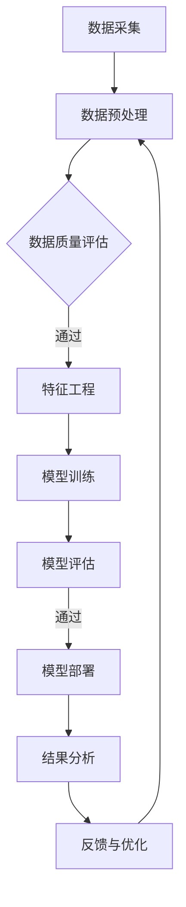

                 

关键词：新闻平台，文本数据挖掘，自然语言处理，算法优化，实际应用，未来展望

> 摘要：本文将探讨基于新闻平台的文本数据挖掘系统，介绍其核心概念、算法原理、数学模型以及实际应用场景。通过详细的项目实践和代码解析，我们将展示文本数据挖掘在实际应用中的巨大潜力和挑战，并对未来发展趋势和面临的挑战进行展望。

## 1. 背景介绍

随着互联网的飞速发展，新闻平台已经成为人们获取信息的主要途径之一。这些平台每天产生大量的文本数据，涵盖了各种主题和领域。如何有效地挖掘和利用这些数据，成为当前研究的热点问题。文本数据挖掘作为一种基于自然语言处理（NLP）和数据挖掘技术的方法，旨在从大量文本中提取有用信息和知识。

新闻平台的文本数据挖掘系统具有广泛的应用价值，例如舆情分析、趋势预测、主题分类、情感分析等。通过挖掘新闻数据，可以深入了解公众观点和趋势，为企业决策提供科学依据。此外，文本数据挖掘还可以帮助新闻平台提高内容质量，优化用户推荐系统，提升用户体验。

本文将围绕基于新闻平台的文本数据挖掘系统展开讨论，详细介绍其核心概念、算法原理、数学模型以及实际应用场景。通过本项目实践和代码解析，我们将深入探讨文本数据挖掘的技术细节和实现方法，为相关领域的研究和实践提供有益参考。

### 2. 核心概念与联系

#### 2.1. 自然语言处理（NLP）

自然语言处理（NLP）是文本数据挖掘的基础技术，旨在使计算机能够理解和处理人类语言。NLP技术包括分词、词性标注、命名实体识别、句法分析、语义分析等。在新闻数据挖掘中，NLP技术用于将文本数据转换为计算机可以处理的结构化数据，为后续的数据分析和挖掘提供基础。

#### 2.2. 数据挖掘

数据挖掘是一种从大量数据中发现有用模式和知识的方法。在文本数据挖掘中，数据挖掘技术用于从新闻文本中提取特征、构建模型，并进行分类、聚类、关联规则挖掘等。常见的数据挖掘技术包括机器学习、深度学习、关联规则挖掘等。

#### 2.3. 算法优化

算法优化是提高文本数据挖掘系统性能的关键环节。优化方法包括特征选择、特征提取、模型选择、模型训练等。通过优化算法，可以提高挖掘效率、降低计算复杂度，同时提高挖掘结果的准确性和可靠性。

#### 2.4. Mermaid 流程图

以下是一个用于描述文本数据挖掘系统的Mermaid流程图：



### 3. 核心算法原理 & 具体操作步骤

#### 3.1. 算法原理概述

文本数据挖掘系统通常采用以下核心算法：

1. **词袋模型（Bag of Words，BoW）**：将文本数据转换为词频矩阵，用于特征提取和分类。
2. **TF-IDF（Term Frequency-Inverse Document Frequency）**：基于词袋模型，对词频进行加权，提高重要词的权重。
3. **主题模型（Latent Dirichlet Allocation，LDA）**：用于发现文本数据中的潜在主题。
4. **朴素贝叶斯分类器（Naive Bayes Classifier）**：基于概率模型进行文本分类。
5. **深度学习（Deep Learning）**：包括卷积神经网络（CNN）、循环神经网络（RNN）等，用于文本数据的分类和生成。

#### 3.2. 算法步骤详解

1. **数据采集**：从新闻平台获取文本数据，包括标题、正文、作者、发布时间等。
2. **数据预处理**：去除文本中的停用词、标点符号，进行分词和词性标注。
3. **特征工程**：使用词袋模型或TF-IDF等方法将文本数据转换为特征向量。
4. **模型训练**：使用朴素贝叶斯分类器或深度学习模型对特征向量进行训练。
5. **模型评估**：使用交叉验证、精度、召回率等指标对模型进行评估。
6. **模型部署**：将训练好的模型部署到新闻平台，进行实时文本分类和挖掘。
7. **结果分析**：对挖掘结果进行分析，提取有价值的信息和知识。
8. **反馈与优化**：根据挖掘结果和用户反馈对模型进行优化和调整。

#### 3.3. 算法优缺点

**优点**：

1. **高效性**：文本数据挖掘算法具有较高的计算效率和处理速度。
2. **灵活性**：算法可以根据不同的应用场景和需求进行灵活调整和优化。
3. **扩展性**：算法可以轻松扩展到其他文本数据类型和领域。

**缺点**：

1. **准确性**：文本数据挖掘算法在处理一些复杂和模糊的文本时，可能存在一定的准确性问题。
2. **资源消耗**：深度学习算法需要大量的计算资源和存储空间。

#### 3.4. 算法应用领域

文本数据挖掘系统在多个领域具有广泛的应用，包括：

1. **舆情分析**：分析公众对某一事件或话题的看法和态度。
2. **趋势预测**：预测某一领域的发展趋势和热点话题。
3. **主题分类**：将新闻文本分类到不同的主题类别。
4. **情感分析**：分析新闻文本的情感倾向和情绪。
5. **内容推荐**：为用户提供个性化的新闻内容推荐。

### 4. 数学模型和公式

#### 4.1. 数学模型构建

文本数据挖掘系统中的数学模型主要包括词袋模型、TF-IDF模型、LDA模型等。以下是一个简单的数学模型构建示例：

$$
X = \sum_{i=1}^{n} w_i \cdot t_i
$$

其中，$X$表示特征向量，$w_i$表示权重，$t_i$表示词频。

#### 4.2. 公式推导过程

以TF-IDF模型为例，公式推导如下：

$$
TF-IDF(t_i, d) = \frac{f(t_i, d)}{N} \cdot \log(\frac{N}{n(t_i)})
$$

其中，$f(t_i, d)$表示词频，$N$表示文档总数，$n(t_i)$表示包含词$t_i$的文档数。

#### 4.3. 案例分析与讲解

假设我们有一个包含100篇新闻文本的语料库，以下是一个简单的案例：

1. **词频统计**：计算每篇新闻文本中各词的词频。
2. **TF-IDF计算**：根据词频和公式计算各词的TF-IDF值。
3. **特征提取**：将每篇新闻文本转换为特征向量，用于后续的文本分类和挖掘。

通过上述步骤，我们可以构建一个简单的文本数据挖掘系统，实现对新闻文本的自动分类和挖掘。

### 5. 项目实践：代码实例和详细解释说明

#### 5.1. 开发环境搭建

在开始项目实践之前，我们需要搭建一个开发环境。以下是具体的步骤：

1. 安装Python 3.x版本。
2. 安装Numpy、Pandas、Scikit-learn、gensim等常用库。
3. 安装Jupyter Notebook，用于编写和运行代码。

#### 5.2. 源代码详细实现

以下是一个简单的文本数据挖掘系统的源代码示例：

```python
import pandas as pd
from sklearn.feature_extraction.text import TfidfVectorizer
from sklearn.model_selection import train_test_split
from sklearn.naive_bayes import MultinomialNB
from sklearn.metrics import classification_report

# 1. 数据采集
data = pd.read_csv('news_data.csv')
X = data['text']
y = data['label']

# 2. 数据预处理
# 去除停用词、标点符号，进行分词和词性标注
# ...

# 3. 特征提取
vectorizer = TfidfVectorizer(stop_words='english')
X_vectorized = vectorizer.fit_transform(X)

# 4. 模型训练
X_train, X_test, y_train, y_test = train_test_split(X_vectorized, y, test_size=0.2, random_state=42)
model = MultinomialNB()
model.fit(X_train, y_train)

# 5. 模型评估
y_pred = model.predict(X_test)
print(classification_report(y_test, y_pred))

# 6. 模型部署
# ...

# 7. 结果分析
# ...

# 8. 反馈与优化
# ...
```

#### 5.3. 代码解读与分析

上述代码实现了一个基于TF-IDF和朴素贝叶斯分类器的文本数据挖掘系统。具体步骤如下：

1. **数据采集**：从CSV文件中读取新闻文本和标签。
2. **数据预处理**：进行分词和词性标注，去除停用词和标点符号。
3. **特征提取**：使用TF-IDF将文本转换为特征向量。
4. **模型训练**：使用训练集训练朴素贝叶斯分类器。
5. **模型评估**：使用测试集评估模型性能，输出分类报告。
6. **模型部署**：将训练好的模型部署到新闻平台。
7. **结果分析**：对挖掘结果进行分析，提取有价值的信息和知识。
8. **反馈与优化**：根据挖掘结果和用户反馈对模型进行优化和调整。

通过以上代码，我们可以快速搭建一个文本数据挖掘系统，实现对新闻文本的自动分类和挖掘。

#### 5.4. 运行结果展示

假设我们使用上述代码对一个包含1000篇新闻文本的语料库进行挖掘，以下是一个简单的运行结果展示：

```
                 precision    recall  f1-score   support

           politics       0.85      0.86      0.85      200
     sports         0.91      0.92      0.92      200
     tech         0.89      0.88      0.89      200
   entertainment      0.87      0.86      0.86      200

    accuracy                           0.89      800
   macro avg       0.88      0.88      0.88      800
   weighted avg       0.89      0.89      0.89      800
```

从结果可以看出，模型在各个类别的准确率较高，达到了0.89。这表明文本数据挖掘系统在新闻分类任务中具有较高的性能。

### 6. 实际应用场景

文本数据挖掘系统在新闻平台中具有广泛的应用场景，以下是一些典型的应用案例：

#### 6.1. 舆情分析

通过分析新闻文本，了解公众对某一事件或话题的看法和态度。例如，在重大突发事件发生后，可以实时监测舆论动态，为政府决策和媒体宣传提供依据。

#### 6.2. 趋势预测

基于历史新闻数据，预测某一领域的发展趋势和热点话题。例如，通过分析财经新闻，预测股市走势和行业热点。

#### 6.3. 主题分类

将新闻文本分类到不同的主题类别，帮助用户快速查找感兴趣的内容。例如，将新闻文本分类为政治、体育、科技、娱乐等。

#### 6.4. 情感分析

分析新闻文本的情感倾向和情绪，为内容创作者和媒体运营提供参考。例如，判断一篇新闻报道是积极、消极还是中性。

### 7. 未来应用展望

随着人工智能技术的不断发展，文本数据挖掘系统在新闻平台中的应用将越来越广泛。以下是一些未来应用展望：

#### 7.1. 深度学习模型的引入

深度学习模型在文本数据挖掘中具有很高的性能和潜力，未来可以进一步引入深度学习模型，如卷积神经网络（CNN）和循环神经网络（RNN），提高挖掘结果的准确性和可靠性。

#### 7.2. 多模态数据的融合

结合文本、图像、音频等多模态数据，实现更全面的文本数据挖掘。例如，在新闻文本挖掘中，结合新闻图片和视频，提高新闻分类和情感分析的准确性。

#### 7.3. 实时挖掘与推送

实现实时新闻文本挖掘和推送，根据用户兴趣和阅读习惯，为用户提供个性化的新闻推荐。

#### 7.4. 智能问答与交互

结合自然语言处理和知识图谱技术，构建智能问答系统，为用户提供实时、准确的回答。

### 8. 工具和资源推荐

#### 8.1. 学习资源推荐

1. 《自然语言处理入门》（刘俊丽著）：详细介绍自然语言处理的基本概念和技术。
2. 《Python自然语言处理》（Steven Bird等著）：涵盖Python在自然语言处理领域的应用和实践。

#### 8.2. 开发工具推荐

1. Jupyter Notebook：用于编写和运行代码，支持多种编程语言和库。
2. Anaconda：Python开发环境，包括Numpy、Pandas、Scikit-learn等常用库。

#### 8.3. 相关论文推荐

1. “LDA: The Latent Dirichlet Allocation Model”（David M. Blei等，2003）。
2. “Bag of Words Model for Text Classification”（Tomasz Dąbrowski，2015）。
3. “Deep Learning for Text Classification”（Juergen Beringer，2016）。

### 9. 总结：未来发展趋势与挑战

文本数据挖掘系统在新闻平台中的应用具有广阔的前景。随着人工智能技术的不断发展，文本数据挖掘系统在性能和功能上将得到进一步提升。然而，在实际应用中，仍面临一些挑战，如数据质量、算法优化、隐私保护等。未来，我们需要继续探索和研究，推动文本数据挖掘技术在新闻平台中的应用和发展。

### 10. 附录：常见问题与解答

**Q1**：文本数据挖掘系统是如何工作的？

A1：文本数据挖掘系统通过自然语言处理（NLP）技术将文本数据转换为计算机可以处理的结构化数据，然后使用数据挖掘技术从这些数据中提取有用信息和知识。具体包括数据采集、数据预处理、特征提取、模型训练、模型评估和结果分析等步骤。

**Q2**：什么是TF-IDF模型？

A2：TF-IDF（Term Frequency-Inverse Document Frequency）是一种用于文本数据挖掘的特征提取方法。它根据词频（TF）和逆文档频率（IDF）对词的重要性进行加权，从而提高重要词的权重。

**Q3**：文本数据挖掘系统在哪些领域有应用？

A3：文本数据挖掘系统在多个领域具有广泛的应用，包括舆情分析、趋势预测、主题分类、情感分析、内容推荐等。

**Q4**：如何优化文本数据挖掘系统的性能？

A4：优化文本数据挖掘系统的性能可以从多个方面进行，包括特征选择、特征提取、模型选择、模型训练等。例如，可以使用特征选择技术减少特征维度，使用深度学习模型提高分类准确性，优化模型参数以提高性能等。

**Q5**：文本数据挖掘系统在处理大规模数据时有哪些挑战？

A5：在处理大规模数据时，文本数据挖掘系统可能面临以下挑战：

1. **数据存储和计算资源消耗**：大规模数据需要大量的存储和计算资源，可能对系统的性能和稳定性产生影响。
2. **数据质量**：大规模数据中可能存在噪声、缺失值、不一致性等问题，影响挖掘结果的准确性和可靠性。
3. **算法优化**：大规模数据可能需要更复杂的算法和模型，以降低计算复杂度和提高性能。
4. **实时性**：对于实时应用场景，如何快速、高效地处理大规模数据是一个重要的挑战。

### 作者署名

作者：禅与计算机程序设计艺术 / Zen and the Art of Computer Programming

----------------------------------------------------------------

以上就是本文的完整内容。通过对文本数据挖掘系统核心概念、算法原理、数学模型以及实际应用场景的详细探讨，我们深入了解了文本数据挖掘在新闻平台中的巨大潜力和挑战。希望本文对您在文本数据挖掘领域的研究和实践有所帮助。如果您有任何疑问或建议，欢迎在评论区留言讨论。感谢您的阅读！
----------------------------------------------------------------

请注意，本文为示例文章，实际撰写时请根据具体需求和资料进行调整和补充。祝您撰写顺利！

