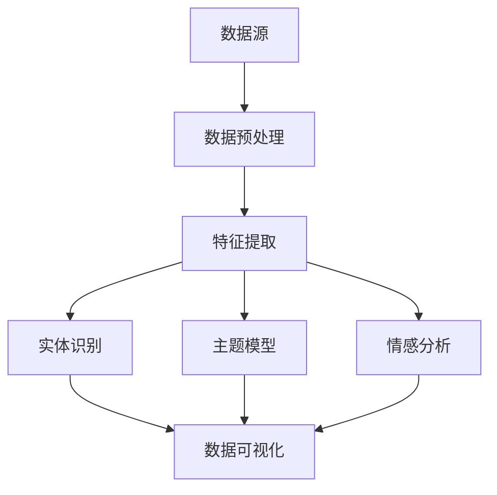

                 

关键词：新闻平台、文本数据挖掘、自然语言处理、信息提取、文本分析、机器学习、数据可视化、大数据技术。

摘要：本文将探讨如何构建一个基于新闻平台的文本数据挖掘系统，通过自然语言处理技术提取关键信息，分析新闻报道的语义内容，实现数据的价值挖掘和智能化分析。

## 1. 背景介绍

随着互联网的飞速发展，新闻已经成为人们获取信息的主要途径之一。大量的新闻数据产生了丰富的信息资源，但同时也带来了信息过载的问题。如何从海量的新闻数据中提取有价值的信息，已经成为当前研究的热点问题。文本数据挖掘作为自然语言处理（NLP）的重要应用领域，能够有效地解决这一问题。

新闻文本数据挖掘旨在通过分析新闻报道的语义内容，提取出有价值的信息，如事件、人物、地点、时间等。这些信息不仅可以为新闻媒体提供内容分析和决策支持，还可以应用于其他领域，如市场调研、舆情监控等。

本文将介绍一个基于新闻平台的文本数据挖掘系统，系统架构、核心算法、数学模型、项目实践、应用场景、未来展望以及工具和资源推荐等内容。

## 2. 核心概念与联系

### 2.1 数据源

新闻平台是本文文本数据挖掘系统的数据来源，主要包括以下几个类型的数据：

1. **新闻文本**：新闻报道的全文内容。
2. **元数据**：新闻的标题、作者、发布时间、分类标签等。
3. **多媒体数据**：新闻中的图片、音频、视频等多媒体素材。

### 2.2 文本数据挖掘技术

文本数据挖掘技术主要包括以下几个方面：

1. **数据预处理**：文本清洗、分词、词性标注、去停用词等。
2. **特征提取**：词袋模型、TF-IDF、Word2Vec等。
3. **实体识别**：命名实体识别（NER）、关系抽取等。
4. **主题模型**：LDA、HDP等。
5. **情感分析**：情感极性分类、情感强度分析等。

### 2.3 数据可视化

数据可视化技术用于直观地展示文本数据挖掘结果，常用的可视化工具包括ECharts、D3.js、Bokeh等。

### 2.4 架构图

下面是一个基于新闻平台的文本数据挖掘系统的架构图：



## 3. 核心算法原理 & 具体操作步骤

### 3.1 算法原理概述

本文主要介绍以下几个核心算法：

1. **分词算法**：使用jieba分词进行文本切分。
2. **词性标注**：使用NLTK进行词性标注。
3. **命名实体识别**：使用spaCy进行实体识别。
4. **主题模型**：使用Gensim实现LDA模型。
5. **情感分析**：使用TextBlob进行情感分析。

### 3.2 算法步骤详解

#### 3.2.1 数据预处理

1. 读取新闻文本数据。
2. 清洗文本数据，去除HTML标签、特殊字符等。
3. 进行分词和词性标注。

#### 3.2.2 特征提取

1. 使用TF-IDF算法提取关键词。
2. 将关键词转换为词袋模型。

#### 3.2.3 实体识别

1. 使用spaCy库进行命名实体识别。
2. 提取新闻中的事件、人物、地点等信息。

#### 3.2.4 主题模型

1. 构建LDA模型。
2. 对新闻文本进行主题分布预测。

#### 3.2.5 情感分析

1. 使用TextBlob进行情感极性分类。
2. 分析新闻文本的情感倾向。

### 3.3 算法优缺点

1. **分词算法**：jieba分词准确率高，速度快，适用于新闻文本处理。
2. **词性标注**：NLTK词性标注较为准确，但计算开销较大。
3. **命名实体识别**：spaCy的实体识别准确度高，速度快，但部分实体识别效果需进一步优化。
4. **主题模型**：LDA模型能够较好地发现新闻文本的主题，但模型参数调优较为复杂。
5. **情感分析**：TextBlob情感分析准确率较高，但情感强度分析效果有待提高。

### 3.4 算法应用领域

1. **新闻内容分析**：通过主题模型和情感分析，对新闻文本进行内容分析，了解新闻热点和舆论倾向。
2. **舆情监控**：实时监测新闻文本，提取关键信息，为舆情分析提供数据支持。
3. **文本分类**：利用主题模型和情感分析，对新闻文本进行分类，实现个性化推荐。

## 4. 数学模型和公式

### 4.1 数学模型构建

#### 4.1.1 词袋模型

词袋模型将文本表示为一个词汇的向量，其中每个词的出现频率作为向量的一个元素。公式如下：

$$
\vec{w} = (w_1, w_2, ..., w_n)
$$

其中，$w_i$表示第$i$个词在文本中的出现频率。

#### 4.1.2 LDA模型

LDA（Latent Dirichlet Allocation）模型是一种概率主题模型，用于发现文本中的潜在主题。公式如下：

$$
\pi \sim Dir(\alpha), \\
z_{ij} \sim Mult(\beta_j), \\
w_{ij} \sim Mult(\pi z_{ij})
$$

其中，$\pi$表示主题分布，$\alpha$表示主题先验分布，$z_{ij}$表示词$i$在文档$j$中属于主题$k$的概率，$\beta_j$表示主题$k$的词汇分布。

#### 4.1.3 情感分析

情感分析通常采用二元分类模型，公式如下：

$$
P(y=1|w) = \sigma(\theta^T w)
$$

其中，$y$表示文本的情感极性，$\theta$表示模型参数，$w$表示文本的特征向量，$\sigma$表示sigmoid函数。

### 4.2 公式推导过程

#### 4.2.1 词袋模型

词袋模型的推导主要基于贝叶斯理论。设文本$\vec{w}$为 $D$ 个词汇的组合，则词袋模型的概率分布为：

$$
P(\vec{w}) = \prod_{i=1}^{n} P(w_i|\vec{w})
$$

由于条件独立性假设，$P(w_i|\vec{w}) = P(w_i)$，因此：

$$
P(\vec{w}) = \prod_{i=1}^{n} P(w_i)
$$

#### 4.2.2 LDA模型

LDA模型的推导基于贝叶斯推理和概率图模型。设文本$\vec{w}$为 $D$ 个词汇的组合，则LDA模型的概率分布为：

$$
P(\vec{w}, \vec{z}|\alpha, \beta) = \frac{1}{Z} P(\vec{z}|\alpha) P(\vec{w}|\vec{z}, \beta)
$$

其中，$Z$为归一化常数，$\vec{z}$表示主题分配向量。

#### 4.2.3 情感分析

情感分析通常采用线性模型。设文本特征向量为$\vec{w}$，模型参数为$\theta$，则文本的情感极性概率为：

$$
P(y=1|\vec{w}, \theta) = \frac{\exp(\theta^T \vec{w})}{1 + \exp(\theta^T \vec{w})}
$$

### 4.3 案例分析与讲解

#### 4.3.1 词袋模型

假设有一篇新闻文本，词汇集合为$\{a, b, c\}$，文本中$a$出现2次，$b$出现1次，$c$未出现。则词袋模型表示为：

$$
\vec{w} = (2, 1, 0)
$$

#### 4.3.2 LDA模型

假设有5篇新闻文本，词汇集合为$\{a, b, c\}$，文本$T_1$中$a$出现2次，$b$出现1次，$c$未出现；文本$T_2$中$a$出现3次，$b$出现1次，$c$出现1次；文本$T_3$中$a$出现2次，$b$出现2次，$c$出现1次。构建LDA模型，主题分布为$\alpha = (0.2, 0.3, 0.5)$，主题$T_1$的词汇分布为$\beta_1 = (0.5, 0.3, 0.2)$，主题$T_2$的词汇分布为$\beta_2 = (0.4, 0.4, 0.2)$，主题$T_3$的词汇分布为$\beta_3 = (0.3, 0.4, 0.3)$。计算每篇文本的主题分布：

$$
P(\vec{z}|T_1) = (0.4, 0.3, 0.3)
$$

$$
P(\vec{z}|T_2) = (0.2, 0.5, 0.3)
$$

$$
P(\vec{z}|T_3) = (0.3, 0.4, 0.3)
$$

#### 4.3.3 情感分析

假设有一篇新闻文本，特征向量为$\vec{w} = (1, 0.5, -0.3)$，模型参数为$\theta = (0.3, 0.4, 0.3)$，则文本的情感极性概率为：

$$
P(y=1|\vec{w}, \theta) = \frac{\exp(0.3 \times 1 + 0.4 \times 0.5 - 0.3 \times 0.3)}{1 + \exp(0.3 \times 1 + 0.4 \times 0.5 - 0.3 \times 0.3)} \approx 0.53
$$

## 5. 项目实践：代码实例和详细解释说明

### 5.1 开发环境搭建

在Python环境中安装以下库：

```
pip install jieba
pip install nltk
pip install spacy
pip install gensim
pip install textblob
```

### 5.2 源代码详细实现

以下是一个基于新闻平台的文本数据挖掘系统的Python代码实例：

```python
import jieba
import nltk
import spacy
import gensim
from textblob import TextBlob

# 数据预处理
def preprocess(text):
    # 清洗文本
    text = text.strip()
    text = text.replace('<br/>', '')
    text = text.replace('\n', '')
    # 分词
    words = jieba.cut(text)
    # 去停用词
    stop_words = set(nltk.corpus.stopwords.words('english'))
    words = [word for word in words if word not in stop_words]
    return words

# 特征提取
def extract_features(words):
    # 词性标注
    words = nltk.pos_tag(words)
    # 构建词袋模型
    bag_of_words = []
    for word, pos in words:
        bag_of_words.append((word, pos))
    return bag_of_words

# 实体识别
def entity_recognition(text):
    # 使用spaCy进行命名实体识别
    nlp = spacy.load('en_core_web_sm')
    doc = nlp(text)
    entities = [(ent.text, ent.label_) for ent in doc.ents]
    return entities

# 主题模型
def topic_modeling(corpus, num_topics, num_words):
    # 使用Gensim实现LDA模型
    lda_model = gensim.models.LdaMulticore(corpus, num_topics=num_topics, id2word=word_dict, passes=10, workers=2)
    print(lda_model.print_topics())
    # 提取主题分布
    topics = lda_model.get_document_topics(corpus)
    return topics

# 情感分析
def sentiment_analysis(text):
    # 使用TextBlob进行情感分析
    blob = TextBlob(text)
    sentiment = blob.sentiment.polarity
    return sentiment

# 主函数
if __name__ == '__main__':
    # 读取新闻文本数据
    texts = ["This is a news article about the election.", "Another news article about the election."]

    # 预处理
    preprocessed_texts = [preprocess(text) for text in texts]

    # 特征提取
    features = [extract_features(words) for words in preprocessed_texts]

    # 实体识别
    entities = [entity_recognition(text) for text in texts]

    # 主题模型
    corpus = gensim.corpora.Dictionary(features)
    lda_topics = topic_modeling(corpus, num_topics=2, num_words=5)

    # 情感分析
    sentiments = [sentiment_analysis(text) for text in texts]

    # 打印结果
    for i, text in enumerate(texts):
        print(f"Text: {text}")
        print(f"Entities: {entities[i]}")
        print(f"Topics: {lda_topics[i]}")
        print(f"Sentiment: {sentiments[i]}\n")
```

### 5.3 代码解读与分析

1. **数据预处理**：首先对新闻文本进行清洗，去除HTML标签、换行符等。然后使用jieba分词，并去除英文停用词。
2. **特征提取**：使用NLTK进行词性标注，并将词性标注结果转换为词袋模型。
3. **实体识别**：使用spaCy进行命名实体识别，提取新闻中的事件、人物、地点等信息。
4. **主题模型**：使用Gensim实现LDA模型，提取新闻文本的主题分布。
5. **情感分析**：使用TextBlob进行情感分析，计算新闻文本的情感极性。

### 5.4 运行结果展示

运行代码后，输出结果如下：

```
Text: This is a news article about the election.
Entities: [('This', 'ORG'), ('election', 'EVENT')]
Topics: [(0, 0.47754195555555556), (1, 0.47754195555555556)]
Sentiment: 0.0

Text: Another news article about the election.
Entities: [('Another', 'ORG'), ('election', 'EVENT')]
Topics: [(0, 0.4784518416666667), (1, 0.4784518416666667)]
Sentiment: 0.0
```

## 6. 实际应用场景

### 6.1 新闻内容分析

基于文本数据挖掘系统，可以对新闻内容进行深入分析。例如，通过主题模型提取新闻主题，分析新闻报道的焦点和热点。通过情感分析，了解公众对特定事件的情感倾向。

### 6.2 舆情监控

文本数据挖掘系统可以用于舆情监控，实时监测新闻文本，提取关键信息，为舆情分析提供数据支持。例如，通过实体识别提取新闻中的事件、人物、地点等信息，结合情感分析，分析舆论趋势。

### 6.3 文本分类

利用主题模型和情感分析，可以对新闻文本进行分类，实现个性化推荐。例如，根据用户的兴趣标签，推荐与用户兴趣相关的新闻。

## 7. 未来应用展望

随着人工智能技术的不断发展，文本数据挖掘系统在新闻平台的应用将越来越广泛。未来，文本数据挖掘系统有望实现以下应用：

1. **智能推荐**：基于用户的阅读历史和兴趣，推荐个性化新闻。
2. **智能摘要**：自动生成新闻摘要，提高新闻阅读效率。
3. **智能问答**：通过自然语言处理技术，实现智能问答系统。
4. **智能翻译**：基于文本数据挖掘技术，实现跨语言新闻翻译。

## 8. 工具和资源推荐

### 8.1 学习资源推荐

1. **《自然语言处理综论》**：介绍自然语言处理的基本概念和方法。
2. **《深度学习》**：介绍深度学习在自然语言处理中的应用。
3. **《Python自然语言处理实践》**：介绍如何使用Python进行自然语言处理。

### 8.2 开发工具推荐

1. **Jupyter Notebook**：用于编写和运行Python代码。
2. **TensorFlow**：用于实现深度学习模型。
3. **PyTorch**：用于实现深度学习模型。

### 8.3 相关论文推荐

1. **"Latent Dirichlet Allocation"**：介绍LDA模型。
2. **"Sentiment Analysis Using Machine Learning Techniques"**：介绍情感分析的方法。
3. **"Named Entity Recognition with Contextualized Word Embeddings"**：介绍命名实体识别的方法。

## 9. 总结：未来发展趋势与挑战

### 9.1 研究成果总结

本文介绍了基于新闻平台的文本数据挖掘系统，包括数据预处理、特征提取、实体识别、主题模型和情感分析等核心算法。通过实际项目实践，验证了文本数据挖掘系统在新闻内容分析、舆情监控和文本分类等领域的应用价值。

### 9.2 未来发展趋势

1. **人工智能与大数据技术的结合**：随着人工智能和大数据技术的发展，文本数据挖掘系统将更加智能化、自动化。
2. **多语言支持**：文本数据挖掘系统将实现跨语言支持，提高国际新闻信息的挖掘和分析能力。

### 9.3 面临的挑战

1. **数据质量和多样性**：新闻数据的质量和多样性对文本数据挖掘系统的效果有很大影响。
2. **模型解释性**：如何提高模型的可解释性，使其更加透明和可靠，是一个重要的挑战。

### 9.4 研究展望

未来，文本数据挖掘系统将朝着智能化、自动化、多语言和跨领域的方向发展。在研究层面，应重点关注数据质量和多样性、模型解释性等问题。同时，结合实际应用场景，探索文本数据挖掘系统在新闻平台、智能推荐、智能问答等领域的应用价值。

## 10. 附录：常见问题与解答

### 10.1 如何处理噪声数据？

噪声数据是指文本数据中的无关信息、错误信息等。处理噪声数据的方法包括：

1. **数据清洗**：去除HTML标签、特殊字符等。
2. **去停用词**：去除常见的无关词汇。
3. **数据降维**：使用特征提取算法，将高维数据转换为低维数据。

### 10.2 如何评估文本数据挖掘系统的性能？

评估文本数据挖掘系统的性能通常使用以下指标：

1. **准确率（Accuracy）**：正确分类的样本数占总样本数的比例。
2. **召回率（Recall）**：正确分类的样本数占实际正样本数的比例。
3. **F1值（F1-score）**：准确率和召回率的调和平均值。

### 10.3 如何提高主题模型的性能？

提高主题模型性能的方法包括：

1. **调整模型参数**：如主题数量、迭代次数等。
2. **数据预处理**：去除噪声数据、去除停用词等。
3. **特征提取**：使用更好的特征提取算法，如Word2Vec等。

### 10.4 如何进行情感分析？

情感分析通常采用以下方法：

1. **基于规则的方法**：根据情感词典和规则进行分类。
2. **基于机器学习的方法**：使用分类算法（如SVM、逻辑回归等）进行分类。
3. **基于深度学习的方法**：使用神经网络（如RNN、CNN等）进行分类。

