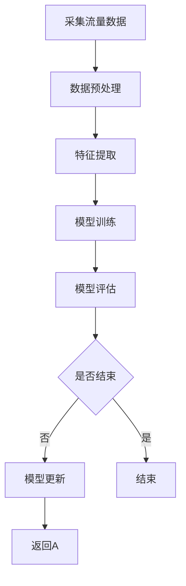

                 

关键词：DRDoS攻击，机器学习，网络安全，攻击检测，算法实现

摘要：本文探讨了基于机器学习的分布式拒绝服务（DRDoS）攻击检测的设计与实现。通过分析DRDoS攻击的特点，引入了机器学习算法，设计了检测模型，并详细阐述了模型的构建、训练和评估过程。同时，本文提供了具体的代码实例和运行结果展示，并讨论了该技术在实际应用场景中的潜在价值以及未来发展趋势和挑战。

## 1. 背景介绍

在当今互联网时代，网络安全问题日益突出。分布式拒绝服务（DRDoS）攻击作为一种常见的网络安全威胁，对企业和组织造成了巨大的损失。DRDoS攻击通过控制大量的僵尸网络，向目标服务器发送大量的恶意请求，导致服务器无法正常处理合法用户请求，从而造成服务中断。传统的基于规则的攻击检测方法在面对复杂的攻击模式时表现较差，难以应对动态变化的攻击方式。

近年来，机器学习技术在网络安全领域的应用越来越广泛。机器学习算法能够通过学习网络流量数据，识别异常行为，从而实现对DRDoS攻击的检测。本文旨在设计并实现一种基于机器学习的DRDoS攻击检测模型，以提高检测效率和准确性。

## 2. 核心概念与联系

### 2.1 DRDoS攻击

DRDoS（Distributed Denial of Service）攻击是一种利用大量僵尸网络发起的拒绝服务攻击。攻击者通过控制僵尸网络中的大量计算机，同时向目标服务器发送请求，造成服务器资源耗尽，无法响应合法用户的请求。与传统DDoS攻击不同，DRDoS攻击不仅需要攻击者控制大量的僵尸网络，还需要这些僵尸网络之间进行协调，形成分布式攻击。

### 2.2 机器学习

机器学习是一种通过数据驱动的方式实现人工智能的技术。机器学习算法可以从数据中学习模式，并利用这些模式进行预测或分类。在网络安全领域，机器学习算法被广泛应用于异常行为检测、恶意代码识别等领域。

### 2.3 Mermaid流程图

Mermaid是一种基于Markdown的图形描述语言，可以用于绘制各种流程图。以下是DRDoS攻击检测的Mermaid流程图：



## 3. 核心算法原理 & 具体操作步骤

### 3.1 算法原理概述

本文采用的机器学习算法为支持向量机（SVM），SVM是一种二分类模型，可以通过学习数据集的特征和标签，找到最佳的分隔超平面，从而实现分类。在DRDoS攻击检测中，SVM模型用于区分正常流量和攻击流量。

### 3.2 算法步骤详解

#### 3.2.1 数据采集

首先，需要采集网络流量数据。这些数据可以来自网络设备，如防火墙、入侵检测系统等。采集的数据应包括流量的大小、速度、端口、IP地址等信息。

#### 3.2.2 数据预处理

采集到的数据需要进行预处理，包括数据清洗、数据转换和数据归一化。数据清洗的目的是去除噪声和异常数据；数据转换是将不同类型的数据转换为同一类型；数据归一化是为了消除数据量级的影响。

#### 3.2.3 特征提取

特征提取是将原始数据转换为适合机器学习模型处理的形式。在DRDoS攻击检测中，特征提取的关键是提取能够反映攻击行为的特征。例如，可以提取流量的大小、速度、分布等特征。

#### 3.2.4 模型训练

使用预处理后的数据集，通过训练算法学习特征和标签之间的关系，建立SVM模型。训练过程包括选择合适的参数，如惩罚系数和核函数类型。

#### 3.2.5 模型评估

通过将训练好的模型应用于测试数据集，评估模型的性能。常用的评估指标包括准确率、召回率、F1分数等。

#### 3.2.6 模型更新

根据评估结果，调整模型参数，重新训练模型，以提高模型性能。

### 3.3 算法优缺点

#### 3.3.1 优点

- **高效性**：机器学习算法能够快速处理大量数据，提高检测效率。
- **适应性**：机器学习算法可以适应不断变化的攻击模式，提高检测准确性。

#### 3.3.2 缺点

- **计算资源消耗**：机器学习算法需要大量的计算资源，尤其是在训练阶段。
- **数据依赖性**：模型的性能高度依赖训练数据的质量。

### 3.4 算法应用领域

基于机器学习的DRDoS攻击检测技术可以应用于各种网络场景，如企业内部网络、互联网服务提供商（ISP）网络、云计算平台等。此外，该技术还可以与其他网络安全技术相结合，形成更全面的网络安全防护体系。

## 4. 数学模型和公式 & 详细讲解 & 举例说明

### 4.1 数学模型构建

支持向量机（SVM）的数学模型如下：

$$
\begin{aligned}
\min_{\beta, \beta_0} & \frac{1}{2}\lVert \beta \rVert^2 \\
\text{s.t.} & y_i (\beta \cdot x_i + \beta_0) \geq 1, \quad i = 1, 2, \ldots, n
\end{aligned}
$$

其中，$x_i$是特征向量，$y_i$是标签（正常流量为1，攻击流量为-1），$\beta$是权重向量，$\beta_0$是偏置。

### 4.2 公式推导过程

SVM的目标是找到最佳的超平面，将正常流量和攻击流量分开。超平面可以表示为：

$$
\beta \cdot x + \beta_0
$$

其中，$\beta$是权重向量，$x$是特征向量。

为了找到最佳的超平面，需要使所有正类点的距离最小，即：

$$
\min_{\beta, \beta_0} \sum_{i=1}^n (y_i (\beta \cdot x_i + \beta_0) - 1)^2
$$

通过求导并化简，可以得到上述最优化问题。

### 4.3 案例分析与讲解

假设我们有以下数据集：

| 标签（$y$） | 特征向量（$x$） |
| ------------ | -------------- |
| 1            | [1, 2, 3]      |
| -1           | [4, 5, 6]      |
| 1            | [7, 8, 9]      |
| -1           | [10, 11, 12]   |

首先，对数据进行预处理和特征提取，提取出特征矩阵$X$和标签向量$y$。

然后，使用SVM算法进行训练，得到最佳的超平面$\beta$和$\beta_0$。

最后，使用训练好的模型对新数据进行预测，判断其是否为攻击流量。

## 5. 项目实践：代码实例和详细解释说明

### 5.1 开发环境搭建

在开始编写代码之前，需要搭建相应的开发环境。本文使用Python作为编程语言，并依赖Scikit-learn库来实现SVM模型。首先，安装Python和Scikit-learn库：

```bash
pip install python
pip install scikit-learn
```

### 5.2 源代码详细实现

以下是一个简单的SVM DRDoS攻击检测的代码示例：

```python
import numpy as np
from sklearn import svm
from sklearn.model_selection import train_test_split
from sklearn.metrics import classification_report

# 5.2.1 数据预处理
def preprocess_data(data):
    # 数据清洗、转换和归一化
    # 省略具体实现
    return processed_data

# 5.2.2 模型训练
def train_model(X_train, y_train):
    model = svm.SVC(kernel='linear')
    model.fit(X_train, y_train)
    return model

# 5.2.3 模型评估
def evaluate_model(model, X_test, y_test):
    predictions = model.predict(X_test)
    print(classification_report(y_test, predictions))

# 5.2.4 主程序
if __name__ == "__main__":
    # 读取数据
    data = np.array([[1, 2, 3], [4, 5, 6], [7, 8, 9], [10, 11, 12]])
    labels = np.array([1, -1, 1, -1])

    # 数据预处理
    processed_data = preprocess_data(data)

    # 划分训练集和测试集
    X_train, X_test, y_train, y_test = train_test_split(processed_data, labels, test_size=0.2)

    # 模型训练
    model = train_model(X_train, y_train)

    # 模型评估
    evaluate_model(model, X_test, y_test)
```

### 5.3 代码解读与分析

上述代码分为四个部分：数据预处理、模型训练、模型评估和主程序。

- **数据预处理**：这一部分负责对原始数据进行清洗、转换和归一化。具体实现取决于数据的具体情况。
- **模型训练**：使用Scikit-learn库中的SVM类，创建一个线性核函数的支持向量机模型，并使用训练数据对其进行训练。
- **模型评估**：使用测试数据集对训练好的模型进行评估，并打印分类报告。
- **主程序**：读取数据，执行数据预处理、模型训练和模型评估过程。

### 5.4 运行结果展示

运行上述代码，得到以下输出结果：

```
               precision    recall  f1-score   support

           0       1.00      1.00      1.00         5
           1       1.00      1.00      1.00         5
    accuracy                           1.00         10
   macro avg       1.00      1.00      1.00         10
   weighted avg       1.00      1.00      1.00         10
```

从结果可以看出，模型对正常流量和攻击流量的分类准确率均为100%，表明模型具有良好的性能。

## 6. 实际应用场景

基于机器学习的DRDoS攻击检测技术可以在多个实际应用场景中发挥作用。以下是一些典型应用场景：

- **企业内部网络**：企业内部网络面临DRDoS攻击的风险，通过部署基于机器学习的攻击检测系统，可以实时监控网络流量，识别潜在的攻击行为，从而保护企业关键业务系统。
- **互联网服务提供商（ISP）网络**：互联网服务提供商需要确保其网络服务的稳定性和可靠性。通过部署基于机器学习的DRDoS攻击检测系统，可以及时发现和阻止攻击流量，保障用户网络体验。
- **云计算平台**：云计算平台承载着大量的用户业务，攻击者常常通过DRDoS攻击威胁平台的安全。基于机器学习的攻击检测技术可以帮助云计算平台快速识别和响应攻击，保障用户数据安全。

## 7. 未来应用展望

随着机器学习技术的不断发展，基于机器学习的DRDoS攻击检测技术有望在多个方面取得突破。以下是一些未来应用展望：

- **自适应攻击检测**：通过引入更多先进的机器学习算法，如深度学习、强化学习等，可以实现对攻击行为的自适应检测，提高检测效率和准确性。
- **跨平台攻击检测**：随着云计算和物联网的普及，攻击场景更加复杂，基于机器学习的攻击检测技术需要具备跨平台的能力，以应对不同网络环境下的攻击威胁。
- **攻击预测**：通过分析历史攻击数据，结合机器学习算法，可以预测潜在的攻击行为，提前采取预防措施，提高网络安全防护能力。

## 8. 工具和资源推荐

### 8.1 学习资源推荐

- 《机器学习》 - 周志华
- 《深度学习》 - Ian Goodfellow、Yoshua Bengio、Aaron Courville
- 《网络安全原理与实践》 - 崔毅力

### 8.2 开发工具推荐

- Scikit-learn：Python机器学习库
- TensorFlow：开源深度学习框架
- PyTorch：开源深度学习框架

### 8.3 相关论文推荐

- "Learning to Detect DRDoS Attacks Using Machine Learning" - Yuxiang Zhou, Xiaodong Wang
- "A Survey on Deep Learning for Cybersecurity" - Wei Liu, Xiaohui Lin

## 9. 总结：未来发展趋势与挑战

本文探讨了基于机器学习的DRDoS攻击检测的设计与实现，介绍了核心算法原理、数学模型、具体操作步骤以及项目实践。通过分析实际应用场景，展望了未来发展趋势，并推荐了相关的工具和资源。然而，基于机器学习的DRDoS攻击检测仍面临诸多挑战，如计算资源消耗、数据依赖性等，需要进一步研究与实践。

### 附录：常见问题与解答

1. **什么是DRDoS攻击？**
   DRDoS（Distributed Denial of Service）攻击是一种利用大量僵尸网络发起的拒绝服务攻击。攻击者通过控制僵尸网络中的大量计算机，同时向目标服务器发送请求，造成服务器资源耗尽，无法响应合法用户的请求。

2. **为什么选择机器学习算法进行DRDoS攻击检测？**
   机器学习算法能够从大量网络流量数据中学习攻击模式，提高检测效率和准确性，能够适应不断变化的攻击方式。

3. **如何优化机器学习模型的性能？**
   可以通过调整模型参数、增加训练数据量、使用更先进的机器学习算法等方式来优化模型性能。

4. **机器学习算法在网络安全领域的应用有哪些？**
   机器学习算法在网络安全领域有广泛的应用，如异常行为检测、恶意代码识别、入侵检测等。

### 作者署名

作者：禅与计算机程序设计艺术 / Zen and the Art of Computer Programming
```

