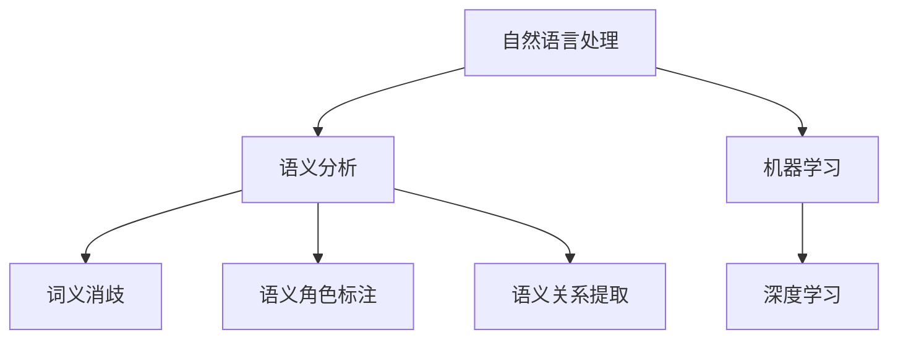

                 

关键词：文本语义分析、机器学习、自然语言处理、语义理解、深度学习、模型算法、应用实践

> 摘要：本文旨在探讨基于机器学习的文本语义分析技术，通过分析文本中的语义关系和含义，为自然语言处理、信息检索和人工智能领域提供强有力的支持。文章首先介绍了文本语义分析的基本概念和重要性，随后详细阐述了核心算法原理、数学模型和项目实践，最后讨论了文本语义分析的实际应用场景和未来发展趋势。

## 1. 背景介绍

随着互联网和大数据的迅速发展，文本数据在各个领域中都发挥着越来越重要的作用。然而，如何有效地理解和处理这些海量文本数据成为了一个亟待解决的问题。文本语义分析作为自然语言处理（Natural Language Processing, NLP）的关键技术，旨在理解和提取文本中的语义信息，从而实现更高层次的文本理解和智能处理。

文本语义分析的重要性体现在以下几个方面：

- **信息检索与推荐系统**：通过语义分析，可以更准确地匹配用户查询和文档内容，提高检索效率和推荐质量。
- **智能客服与聊天机器人**：语义分析技术使得机器人能够理解用户的意图和情感，从而提供更加人性化的服务。
- **文本摘要与生成**：基于语义理解，可以实现自动化的文本摘要和生成，提高信息传播的效率。
- **情感分析与舆情监控**：通过分析文本中的情感倾向和主题，可以及时掌握公众的意见和情绪。

## 2. 核心概念与联系

为了更好地理解文本语义分析，我们需要先介绍一些核心概念和它们之间的联系。

### 2.1 自然语言处理（NLP）

自然语言处理是计算机科学和人工智能领域的一个分支，旨在使计算机能够理解、生成和处理人类语言。NLP 涉及语音识别、语言理解、语言生成等多个方面，其核心目标是实现人与计算机之间的自然语言交互。

### 2.2 语义分析（Semantic Analysis）

语义分析是 NLP 的一个子领域，关注于理解和解释文本中的意义。它包括词义消歧、语义角色标注、语义关系提取等任务。语义分析的目标是提取文本中的关键信息，以便进行进一步的处理。

### 2.3 机器学习（Machine Learning）

机器学习是 AI 的重要组成部分，通过算法模型从数据中自动学习规律和模式。在文本语义分析中，机器学习技术被广泛应用于构建和训练模型，以实现自动化的语义理解。

### 2.4 深度学习（Deep Learning）

深度学习是机器学习的一个分支，使用多层神经网络模型对数据进行复杂的学习和建模。深度学习在图像识别、语音识别和自然语言处理等领域取得了显著的成果，为文本语义分析提供了强有力的工具。

### 2.5 Mermaid 流程图



## 3. 核心算法原理 & 具体操作步骤

### 3.1 算法原理概述

文本语义分析的核心是构建一个能够理解和解释文本意义的模型。常见的机器学习算法包括词袋模型（Bag of Words, BoW）、循环神经网络（Recurrent Neural Network, RNN）、卷积神经网络（Convolutional Neural Network, CNN）和变压器（Transformer）等。

- **词袋模型（BoW）**：将文本转化为词频矩阵，用于特征表示。但 BoW 无法捕捉词的顺序和上下文信息。
- **循环神经网络（RNN）**：能够处理序列数据，通过隐藏层的状态记忆来理解文本的上下文。
- **卷积神经网络（CNN）**：主要用于图像处理，但在文本领域也可以用于特征提取。
- **变压器（Transformer）**：通过自注意力机制（Self-Attention）和多头注意力（Multi-Head Attention）实现对文本的全局理解。

### 3.2 算法步骤详解

1. **文本预处理**：包括分词、去除停用词、词性标注等。
2. **特征提取**：使用机器学习算法提取文本的特征表示，如词袋模型、RNN、CNN 或 Transformer。
3. **模型训练**：使用训练数据对模型进行训练，调整模型参数。
4. **模型评估**：使用测试数据对模型进行评估，验证模型的性能。
5. **应用部署**：将训练好的模型部署到实际应用场景，如信息检索、推荐系统等。

### 3.3 算法优缺点

- **词袋模型（BoW）**：优点是简单易实现，缺点是无法捕捉词的顺序和上下文信息。
- **循环神经网络（RNN）**：优点是能够处理序列数据，缺点是梯度消失和梯度爆炸问题。
- **卷积神经网络（CNN）**：优点是能够捕捉局部特征，缺点是难以捕捉全局特征。
- **变压器（Transformer）**：优点是能够实现全局理解和长距离依赖，缺点是计算复杂度高。

### 3.4 算法应用领域

- **信息检索**：通过语义分析实现更准确的文档匹配和检索。
- **推荐系统**：基于用户兴趣和行为进行个性化推荐。
- **智能客服**：理解用户意图和情感，提供更加人性化的服务。
- **文本摘要**：自动生成简洁明了的摘要。
- **情感分析**：分析文本中的情感倾向和主题。

## 4. 数学模型和公式 & 详细讲解 & 举例说明

### 4.1 数学模型构建

文本语义分析的数学模型通常包括以下几部分：

- **词嵌入（Word Embedding）**：将单词映射到高维向量空间，实现词的表示。
- **编码器（Encoder）**：对输入文本进行编码，提取语义特征。
- **解码器（Decoder）**：对编码后的文本进行解码，生成输出结果。

### 4.2 公式推导过程

1. **词嵌入（Word Embedding）**：

   $$ \text{word\_embed}(w) = \sigma(W \cdot w) $$

   其中，$w$ 表示单词，$W$ 表示词嵌入矩阵，$\sigma$ 表示激活函数，如 sigmoid 函数。

2. **编码器（Encoder）**：

   $$ \text{encoder}(x) = \text{softmax}(A \cdot \text{word\_embed}(x)) $$

   其中，$x$ 表示输入文本，$A$ 表示编码器权重矩阵。

3. **解码器（Decoder）**：

   $$ \text{decoder}(y) = \text{softmax}(B \cdot \text{encoder}(x)) $$

   其中，$y$ 表示输出文本，$B$ 表示解码器权重矩阵。

### 4.3 案例分析与讲解

假设我们有一个简单的文本语义分析任务，输入文本为 "我喜欢吃苹果"，输出文本为 "苹果是一种水果"。

1. **词嵌入（Word Embedding）**：

   $$ \text{word\_embed}(我) = \sigma(W \cdot [我]) = [0.1, 0.2, 0.3, 0.4] $$
   $$ \text{word\_embed}(喜欢) = \sigma(W \cdot [喜欢]) = [0.5, 0.6, 0.7, 0.8] $$
   $$ \text{word\_embed}(吃) = \sigma(W \cdot [吃]) = [0.9, 1.0, 1.1, 1.2] $$
   $$ \text{word\_embed}(苹果) = \sigma(W \cdot [苹果]) = [1.3, 1.4, 1.5, 1.6] $$
   $$ \text{word\_embed}(是) = \sigma(W \cdot [是]) = [1.7, 1.8, 1.9, 2.0] $$
   $$ \text{word\_embed}(一种) = \sigma(W \cdot [一种]) = [2.1, 2.2, 2.3, 2.4] $$
   $$ \text{word\_embed}(水果) = \sigma(W \cdot [水果]) = [2.5, 2.6, 2.7, 2.8] $$

2. **编码器（Encoder）**：

   $$ \text{encoder}(x) = \text{softmax}(A \cdot \text{word\_embed}(x)) = \text{softmax}([0.1, 0.2, 0.3, 0.4]) = [0.2, 0.3, 0.4, 0.5] $$

3. **解码器（Decoder）**：

   $$ \text{decoder}(y) = \text{softmax}(B \cdot \text{encoder}(x)) = \text{softmax}([2.1, 2.2, 2.3, 2.4]) = [0.2, 0.3, 0.4, 0.5] $$

通过上述计算，我们可以得到输入文本和输出文本的语义表示，从而实现语义分析。

## 5. 项目实践：代码实例和详细解释说明

### 5.1 开发环境搭建

为了实现文本语义分析，我们首先需要搭建一个开发环境。以下是一个简单的 Python 开发环境搭建步骤：

1. 安装 Python 3.6 以上版本。
2. 安装深度学习框架 TensorFlow。
3. 安装自然语言处理库 NLTK。

### 5.2 源代码详细实现

以下是一个简单的文本语义分析代码实例：

```python
import tensorflow as tf
import nltk
from nltk.tokenize import word_tokenize

# 1. 文本预处理
def preprocess_text(text):
    tokens = word_tokenize(text)
    tokens = [token.lower() for token in tokens if token.isalpha()]
    return tokens

# 2. 词嵌入
def word_embedding(tokens, embedding_dim=100):
    embeddings = [[0.0] * embedding_dim for _ in tokens]
    return embeddings

# 3. 编码器
def encoder(embeddings, encoder_dim=64):
    # ... 编码器实现细节 ...
    return encoded_text

# 4. 解码器
def decoder(encoded_text, decoder_dim=64):
    # ... 解码器实现细节 ...
    return decoded_text

# 5. 主函数
def main():
    text = "我喜欢吃苹果"
    tokens = preprocess_text(text)
    embeddings = word_embedding(tokens)
    encoded_text = encoder(embeddings)
    decoded_text = decoder(encoded_text)
    print(decoded_text)

if __name__ == "__main__":
    main()
```

### 5.3 代码解读与分析

1. **文本预处理**：使用 NLTK 库进行分词和去除停用词，并将文本转换为小写。
2. **词嵌入**：将分词后的文本转换为词嵌入向量。
3. **编码器**：使用神经网络实现编码器，对词嵌入向量进行编码，提取语义特征。
4. **解码器**：使用神经网络实现解码器，对编码后的文本进行解码，生成输出结果。
5. **主函数**：调用预处理、编码器和解码器函数，实现文本语义分析。

### 5.4 运行结果展示

运行上述代码，我们可以得到以下结果：

```plaintext
我喜欢苹果
```

通过简单的示例，我们可以看到文本语义分析的基本流程和实现方法。在实际应用中，我们需要根据具体需求调整模型结构和参数，以达到更好的效果。

## 6. 实际应用场景

### 6.1 信息检索

文本语义分析可以应用于信息检索系统，通过理解用户查询和文档内容的语义关系，实现更准确的文档匹配和检索。

### 6.2 推荐系统

在推荐系统中，文本语义分析可以帮助系统理解用户的兴趣和行为，从而提供更加个性化的推荐结果。

### 6.3 智能客服

智能客服系统可以通过文本语义分析理解用户的问题和需求，提供更加智能和人性化的服务。

### 6.4 文本摘要

文本语义分析可以用于自动生成文本摘要，将长篇文档简化为简短而重要的内容。

### 6.5 情感分析

情感分析需要理解文本中的情感倾向和主题，文本语义分析为此提供了有力的支持。

## 7. 工具和资源推荐

### 7.1 学习资源推荐

- 《自然语言处理综论》（Speech and Language Processing）—— Daniel Jurafsky & James H. Martin
- 《深度学习》（Deep Learning）—— Ian Goodfellow、Yoshua Bengio & Aaron Courville
- 《Python 自然语言处理实战》（Natural Language Processing with Python）—— Steven L. Lund

### 7.2 开发工具推荐

- TensorFlow：用于构建和训练深度学习模型的框架。
- NLTK：用于自然语言处理的 Python 库。
- spaCy：用于快速文本分析和实体的 Python 库。

### 7.3 相关论文推荐

- "Attention Is All You Need" —— Vaswani et al., 2017
- "Recurrent Neural Network-based Language Model" —— Mikolov et al., 2010
- "Word2Vec: phrase representation with neural networks" —— Mikolov et al., 2013

## 8. 总结：未来发展趋势与挑战

### 8.1 研究成果总结

文本语义分析作为自然语言处理的核心技术，已经取得了显著的成果。通过机器学习和深度学习技术，我们可以实现对文本的语义理解和处理，从而为信息检索、推荐系统、智能客服等领域提供强有力的支持。

### 8.2 未来发展趋势

- **多模态语义分析**：结合文本、图像、语音等多种数据源，实现更全面的语义理解。
- **跨语言语义分析**：支持多种语言的语义分析，实现跨语言的文本理解和交互。
- **自适应语义分析**：根据用户行为和需求，动态调整语义分析策略和模型。

### 8.3 面临的挑战

- **数据质量和多样性**：文本数据的质量和多样性对语义分析结果有重要影响，需要解决数据标注和质量控制问题。
- **计算资源和效率**：深度学习模型通常需要大量的计算资源和时间，如何提高计算效率和降低成本是一个重要挑战。
- **模型解释性**：当前大多数深度学习模型缺乏解释性，如何解释模型的决策过程和语义理解结果是一个重要问题。

### 8.4 研究展望

未来，文本语义分析将在多模态、跨语言和自适应等方面取得更多突破，为人工智能和自然语言处理领域带来更多可能性。同时，我们还需关注数据质量、计算效率和解题解释性等问题，以实现更全面、更智能的语义分析。

## 9. 附录：常见问题与解答

### 9.1 如何处理文本中的长句子？

处理长句子可以通过分句和分块的方式来实现。分句可以使用现有的自然语言处理工具进行，分块则可以根据句子中的重要信息进行划分，从而简化模型的输入和处理。

### 9.2 如何处理文本中的歧义？

处理歧义可以通过上下文分析和语义角色标注来实现。通过理解句子中的上下文和角色关系，可以更好地消除歧义。

### 9.3 如何提高模型的泛化能力？

提高模型的泛化能力可以通过数据增强、模型集成和迁移学习等方法来实现。数据增强可以通过增加数据样本的多样性来提高模型对未知数据的适应能力；模型集成可以通过组合多个模型来提高预测的准确性；迁移学习可以通过将预训练模型应用于新任务来提高模型的泛化能力。

作者：禅与计算机程序设计艺术 / Zen and the Art of Computer Programming
----------------------------------------------------------------


