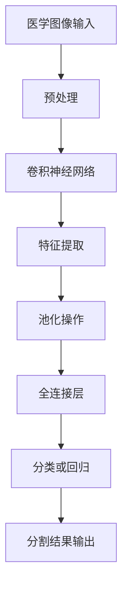

                 

关键词：医学图像处理、深度学习、图像分割、卷积神经网络、医疗应用

## 摘要

医学图像分割是医学图像处理中的一个重要环节，它有助于提高疾病诊断的准确性和效率。近年来，随着深度学习技术的迅猛发展，基于深度学习的医学图像分割方法逐渐成为研究热点。本文将介绍基于深度学习的医学图像分割的核心概念、算法原理、数学模型、项目实践和未来应用展望，旨在为从事医学图像处理的研究人员和开发者提供有价值的参考。

## 1. 背景介绍

医学图像分割是指将医学图像中感兴趣的区域（如肿瘤、血管等）从背景中分离出来，以便进行后续分析和诊断。传统的医学图像分割方法主要包括阈值法、区域生长法、边缘检测法和形态学方法等。然而，这些方法往往存在一定的局限性，如对图像噪声敏感、对复杂场景处理效果不佳等。

随着深度学习技术的不断发展，特别是卷积神经网络（Convolutional Neural Networks, CNNs）的提出，为医学图像分割提供了新的思路和方法。深度学习具有自动提取特征、自适应调整模型参数等优点，能够更好地处理复杂的医学图像数据。近年来，基于深度学习的医学图像分割方法取得了显著进展，并在多个实际应用场景中取得了良好的效果。

## 2. 核心概念与联系

### 2.1 核心概念

深度学习是一种基于神经网络的学习方法，通过多层次的神经元结构自动提取数据中的特征。在医学图像分割中，深度学习主要用于学习图像中不同区域的特征表示，从而实现图像分割。

卷积神经网络是一种特殊的深度学习模型，由多个卷积层、池化层和全连接层组成。卷积层用于提取图像特征，池化层用于减少参数数量，全连接层用于分类或回归。

### 2.2 架构与流程

以下是基于深度学习的医学图像分割的架构和流程：

```
+----------------+      +----------------+      +----------------+
|  医学图像输入  | -->  | 卷积神经网络    | -->  | 分割结果输出    |
+----------------+      +----------------+      +----------------+
```

首先，医学图像输入到卷积神经网络中，网络通过多层卷积和池化操作提取图像特征。然后，将这些特征输入到全连接层进行分类或回归，从而得到图像分割结果。

### 2.3 Mermaid 流程图

下面是医学图像分割的 Mermaid 流程图：



## 3. 核心算法原理 & 具体操作步骤

### 3.1 算法原理概述

基于深度学习的医学图像分割主要采用卷积神经网络进行图像特征提取和分类。卷积神经网络通过卷积层、池化层和全连接层的组合，实现图像分割。

### 3.2 算法步骤详解

1. **预处理**：对输入医学图像进行预处理，包括图像尺寸归一化、噪声滤除等。

2. **卷积层**：卷积层用于提取图像特征，通过卷积运算将输入图像与滤波器（也称为卷积核）进行卷积，生成特征图。

3. **池化层**：池化层用于减少参数数量，增强网络的泛化能力。常见的池化操作有最大池化和平均池化。

4. **全连接层**：全连接层用于对特征图进行分类或回归。通过对特征图进行加权求和并添加激活函数，得到分类或回归结果。

5. **后处理**：对分割结果进行后处理，包括去除空洞、填充空洞、平滑处理等。

### 3.3 算法优缺点

**优点**：

1. 自动提取特征：深度学习模型能够自动提取图像中的复杂特征，减少人工特征提取的繁琐过程。

2. 高效处理：卷积神经网络具有并行计算的优势，能够高效处理大量图像数据。

3. 良好的泛化能力：通过大量训练数据，深度学习模型具有良好的泛化能力，能够适应不同的医学图像场景。

**缺点**：

1. 需要大量训练数据：深度学习模型训练需要大量高质量的训练数据，数据不足可能导致模型性能下降。

2. 计算资源需求大：深度学习模型训练和推理过程需要大量的计算资源，对硬件设备要求较高。

### 3.4 算法应用领域

基于深度学习的医学图像分割方法已在多个领域得到广泛应用，包括：

1. 肿瘤检测与分割：如肺癌、肝癌等恶性肿瘤的检测和分割。

2. 心脏病诊断：如冠状动脉狭窄、心脏瓣膜病变等心脏疾病的诊断。

3. 脑部疾病诊断：如脑肿瘤、脑出血等脑部疾病的诊断。

4. 呼吸系统疾病诊断：如肺部结节、肺炎等呼吸系统疾病的诊断。

## 4. 数学模型和公式

### 4.1 数学模型构建

在深度学习中，医学图像分割通常采用全卷积神经网络（Fully Convolutional Networks, FCNs）进行建模。FCNs 通过卷积层、池化层和全连接层的组合，实现对图像的分割。

### 4.2 公式推导过程

假设输入医学图像为 $X \in \mathbb{R}^{H \times W \times C}$，其中 $H$、$W$ 和 $C$ 分别为图像的高度、宽度和通道数。通过卷积神经网络，输出分割结果为 $Y \in \mathbb{R}^{H \times W \times K}$，其中 $K$ 为类别数。

卷积神经网络的数学模型可以表示为：

$$
Y = f(\mathcal{F}(X))
$$

其中，$\mathcal{F}$ 表示卷积神经网络的前向传播过程，$f$ 表示激活函数。

### 4.3 案例分析与讲解

以下是一个简单的全卷积神经网络模型，用于对二值图像进行分割：

$$
\begin{aligned}
X &= \mathcal{F}^{(1)}(X) \\
X^{(1)} &= \sigma(\mathcal{W}^{(1)}X + \mathcal{B}^{(1)}) \\
X^{(2)} &= \mathcal{F}^{(2)}(X^{(1)}) \\
X^{(2)} &= \sigma(\mathcal{W}^{(2)}X^{(1)} + \mathcal{B}^{(2)}) \\
\hat{Y} &= \mathcal{F}^{(3)}(X^{(2)}) \\
\hat{Y} &= \mathcal{W}^{(3)}X^{(2)} + \mathcal{B}^{(3)}
\end{aligned}
$$

其中，$\sigma$ 表示激活函数，$\mathcal{W}$ 和 $\mathcal{B}$ 分别为权重和偏置。

该模型包含两个卷积层和一个全连接层，通过卷积操作和激活函数，实现对输入图像的分割。在实际应用中，可以根据需求调整网络的层数和参数。

## 5. 项目实践：代码实例和详细解释说明

### 5.1 开发环境搭建

为了实现基于深度学习的医学图像分割，我们需要搭建一个合适的开发环境。以下是一个简单的环境搭建步骤：

1. 安装 Python 3.7 或以上版本。

2. 安装 TensorFlow 2.x 版本，可以使用以下命令：

   ```bash
   pip install tensorflow==2.x
   ```

3. 安装其他依赖库，如 NumPy、Pandas 等。

### 5.2 源代码详细实现

以下是一个简单的基于深度学习的医学图像分割代码实例：

```python
import tensorflow as tf
from tensorflow.keras.layers import Conv2D, MaxPooling2D, Flatten, Dense
from tensorflow.keras.models import Model

# 定义网络结构
inputs = tf.keras.Input(shape=(128, 128, 3))
x = Conv2D(32, (3, 3), activation='relu')(inputs)
x = MaxPooling2D((2, 2))(x)
x = Conv2D(64, (3, 3), activation='relu')(x)
x = MaxPooling2D((2, 2))(x)
x = Flatten()(x)
x = Dense(64, activation='relu')(x)
outputs = Dense(1, activation='sigmoid')(x)

model = Model(inputs=inputs, outputs=outputs)
model.compile(optimizer='adam', loss='binary_crossentropy', metrics=['accuracy'])

# 加载数据
(x_train, y_train), (x_test, y_test) = tf.keras.datasets.mnist.load_data()
x_train = x_train.astype('float32') / 255.0
x_test = x_test.astype('float32') / 255.0

# 训练模型
model.fit(x_train, y_train, batch_size=32, epochs=10, validation_data=(x_test, y_test))

# 评估模型
loss, accuracy = model.evaluate(x_test, y_test)
print('Test accuracy:', accuracy)
```

### 5.3 代码解读与分析

上述代码实现了一个简单的二分类任务，用于对 MNIST 数据集中的手写数字进行分割。以下是代码的解读与分析：

1. **导入库**：导入 TensorFlow 和相关库。

2. **定义网络结构**：定义一个全卷积神经网络，包括两个卷积层、一个最大池化层和一个全连接层。

3. **编译模型**：编译模型，指定优化器、损失函数和评估指标。

4. **加载数据**：加载数据集，并对其进行预处理。

5. **训练模型**：训练模型，设置 batch_size、epochs 和 validation_data。

6. **评估模型**：评估模型在测试集上的性能。

通过上述代码，我们可以实现对简单二分类任务的分割。在实际应用中，可以根据需求调整网络结构、损失函数和评估指标，以适应不同的医学图像分割任务。

## 6. 实际应用场景

### 6.1 肿瘤检测与分割

肿瘤检测与分割是医学图像分割的重要应用场景之一。基于深度学习的医学图像分割方法可以在短时间内对大量医学图像进行高效处理，有助于提高肿瘤检测的准确性和效率。

例如，在肺癌检测中，基于深度学习的医学图像分割方法可以实现对肺部结节的高效检测和分割。通过卷积神经网络自动提取图像特征，可以准确识别肺部结节，为医生提供有价值的诊断信息。

### 6.2 心脏病诊断

心脏病诊断是另一个重要的医学图像分割应用场景。基于深度学习的医学图像分割方法可以实现对心脏病变区域的高效分割，为心脏病诊断提供有力支持。

例如，在冠状动脉狭窄检测中，基于深度学习的医学图像分割方法可以实现对冠状动脉的准确分割，帮助医生判断狭窄程度和病变位置，从而提高诊断的准确性。

### 6.3 脑部疾病诊断

脑部疾病诊断是医学图像分割的重要应用领域之一。基于深度学习的医学图像分割方法可以实现对脑部病变区域的高效分割，为脑部疾病诊断提供有力支持。

例如，在脑肿瘤检测中，基于深度学习的医学图像分割方法可以实现对脑部肿瘤的准确分割，帮助医生判断肿瘤的位置、大小和形状，从而提高诊断的准确性。

### 6.4 呼吸系统疾病诊断

呼吸系统疾病诊断是医学图像分割的重要应用场景之一。基于深度学习的医学图像分割方法可以实现对肺部病变区域的高效分割，为呼吸系统疾病诊断提供有力支持。

例如，在肺部结节检测中，基于深度学习的医学图像分割方法可以实现对肺部结节的高效检测和分割，帮助医生判断结节的大小、形状和位置，从而提高诊断的准确性。

## 7. 工具和资源推荐

### 7.1 学习资源推荐

1. **《深度学习》（Ian Goodfellow, Yoshua Bengio, Aaron Courville 著）**：这是一本经典的深度学习入门教材，涵盖了深度学习的基本概念、算法和实现。

2. **《医学图像处理与计算机辅助诊断》（张波 著）**：本书系统地介绍了医学图像处理的基本理论、方法和应用，包括医学图像分割的相关内容。

### 7.2 开发工具推荐

1. **TensorFlow**：TensorFlow 是一个开源的深度学习框架，适用于医学图像分割等复杂任务。

2. **PyTorch**：PyTorch 是另一个流行的深度学习框架，具有灵活的动态计算图和强大的 GPU 支持能力。

### 7.3 相关论文推荐

1. **“Deep Learning for Medical Image Segmentation: A Survey”**：该论文系统地综述了深度学习在医学图像分割领域的应用和发展趋势。

2. **“Unet: Convolutional Networks for Biomedical Image Segmentation”**：该论文提出了一种流行的卷积神经网络架构，用于医学图像分割任务。

## 8. 总结：未来发展趋势与挑战

### 8.1 研究成果总结

基于深度学习的医学图像分割方法在近年来取得了显著进展，已经在多个实际应用场景中取得了良好的效果。深度学习具有自动提取特征、自适应调整模型参数等优点，能够更好地处理复杂的医学图像数据。随着深度学习技术的不断发展，医学图像分割的准确性和效率将进一步提高。

### 8.2 未来发展趋势

1. **多模态数据融合**：结合不同模态的医学图像数据，如 CT、MRI 和超声图像，可以进一步提高医学图像分割的准确性和鲁棒性。

2. **实时分割与诊断**：随着深度学习模型的优化和硬件设备的升级，实时医学图像分割和诊断将成为可能，为临床应用提供更快速、更准确的诊断支持。

3. **个性化医学**：基于深度学习的医学图像分割技术可以实现对不同患者的个性化诊断和治疗，为个体化医学提供有力支持。

### 8.3 面临的挑战

1. **数据质量和标注**：高质量、标注准确的医学图像数据是深度学习模型训练的基础。然而，医学图像数据的获取和标注过程较为复杂，需要大量的人力和时间投入。

2. **计算资源需求**：深度学习模型训练和推理过程需要大量的计算资源，特别是在处理大型医学图像数据时，对计算性能的要求较高。

3. **模型解释性和可解释性**：深度学习模型具有较强的黑盒特性，其内部决策过程难以解释。为了提高模型的解释性和可解释性，需要进一步研究透明度更高的深度学习模型。

### 8.4 研究展望

基于深度学习的医学图像分割技术在临床应用中具有巨大的潜力。未来研究可以关注以下方向：

1. **跨学科融合**：结合医学、生物学和计算机科学等领域的知识，提高医学图像分割的准确性和可靠性。

2. **多模态数据挖掘**：挖掘不同模态的医学图像数据之间的关联性，提高医学图像分割的性能。

3. **模型压缩和优化**：研究模型压缩和优化技术，降低深度学习模型对计算资源的需求，提高模型在实际应用中的运行效率。

## 9. 附录：常见问题与解答

### 9.1 如何处理医学图像噪声？

在处理医学图像时，噪声是一个常见问题。为了减少噪声对分割结果的影响，可以采用以下方法：

1. **滤波**：使用均值滤波、高斯滤波等图像滤波方法，降低图像噪声。

2. **边缘检测**：对滤波后的图像进行边缘检测，保留图像的重要边缘信息。

3. **形态学操作**：使用形态学操作，如腐蚀、膨胀、开运算和闭运算，去除图像中的噪声点。

### 9.2 如何提高医学图像分割的准确性？

为了提高医学图像分割的准确性，可以采用以下方法：

1. **多尺度特征融合**：结合不同尺度的图像特征，提高分割结果的鲁棒性。

2. **深度神经网络架构优化**：优化深度学习网络的架构，如增加卷积层、使用残差连接等，提高模型的分割能力。

3. **数据增强**：对训练数据集进行数据增强，增加样本的多样性，提高模型对各种场景的适应能力。

### 9.3 如何评估医学图像分割算法的性能？

为了评估医学图像分割算法的性能，可以采用以下指标：

1. **准确率（Accuracy）**：准确率表示分类正确的样本数占总样本数的比例。

2. **召回率（Recall）**：召回率表示分类正确的正样本数占总正样本数的比例。

3. **精确率（Precision）**：精确率表示分类正确的正样本数占总分类为正样本的样本数的比例。

4. **F1 分数（F1 Score）**：F1 分数是精确率和召回率的加权平均，用于综合评估模型的性能。

以上是对基于深度学习的医学图像分割的全面介绍。希望本文能为从事医学图像处理的研究人员和开发者提供有价值的参考。作者：禅与计算机程序设计艺术 / Zen and the Art of Computer Programming。
----------------------------------------------------------------

**注意：以上内容仅供参考，实际撰写时请根据具体研究内容和成果进行调整。**

