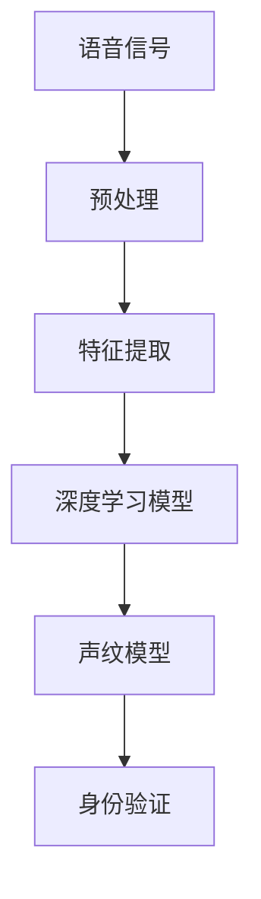

                 

关键词：深度学习、声纹识别、生物特征识别、语音信号处理、神经网络

摘要：本文将深入探讨基于深度学习的声纹识别技术，从背景介绍、核心概念、算法原理、数学模型、项目实践、实际应用以及未来展望等方面展开讨论。通过本文的阅读，读者将全面了解声纹识别的原理、应用场景及面临的挑战。

## 1. 背景介绍

声纹识别是一种基于生物特征的身份验证技术，通过分析个体的语音特征来识别其身份。随着深度学习技术的快速发展，声纹识别技术已经取得了显著的进步。深度学习通过学习大量的语音数据，可以自动提取语音特征，并建立高精度的声纹模型。

声纹识别的应用场景非常广泛，包括但不限于：电话银行、网络安全、智能音箱、智能家居等。在电话银行中，声纹识别可以用于用户身份验证，提高金融交易的安全性；在智能音箱中，声纹识别可以实现个性化语音交互，提升用户体验。

## 2. 核心概念与联系

### 2.1 深度学习

深度学习是一种人工智能的分支，通过多层神经网络结构模拟人脑的学习过程。在声纹识别中，深度学习主要用于语音信号的处理和特征提取。

### 2.2 声纹特征

声纹特征是声纹识别的关键，它包括音高、音强、音长、音色等。深度学习可以通过学习大量的语音数据，自动提取这些特征。

### 2.3 声纹模型

声纹模型是声纹识别的核心，它是通过对大量语音数据进行训练得到的。声纹模型可以用于对新语音数据的身份验证。

### 2.4 Mermaid 流程图



## 3. 核心算法原理 & 具体操作步骤

### 3.1 算法原理概述

声纹识别的核心算法是基于深度学习的神经网络模型。神经网络通过多层结构模拟人脑的学习过程，可以自动提取语音特征，并建立声纹模型。

### 3.2 算法步骤详解

1. 语音信号预处理：对采集到的语音信号进行降噪、归一化等处理，以便后续的特征提取。
2. 特征提取：使用深度学习模型提取语音信号中的音高、音强、音长、音色等特征。
3. 建立声纹模型：通过对大量语音数据进行训练，建立高精度的声纹模型。
4. 身份验证：对新语音数据进行特征提取，与声纹模型进行比对，判断其身份。

### 3.3 算法优缺点

**优点：**
- 高准确性：深度学习可以自动提取语音特征，提高了识别的准确性。
- 自适应：深度学习模型可以随着数据的增加而不断优化，具有很好的自适应能力。

**缺点：**
- 对硬件要求高：深度学习模型训练需要大量的计算资源，对硬件要求较高。
- 对噪声敏感：在噪声较大的环境中，语音信号的识别效果可能会受到影响。

### 3.4 算法应用领域

声纹识别技术可以广泛应用于电话银行、网络安全、智能音箱、智能家居等领域。

## 4. 数学模型和公式 & 详细讲解 & 举例说明

### 4.1 数学模型构建

声纹识别的数学模型主要包括语音信号预处理模型、特征提取模型、声纹模型和身份验证模型。

### 4.2 公式推导过程

假设我们有一个语音信号序列 $x(t)$，我们需要对其进行预处理、特征提取和声纹建模。预处理模型的公式为：

$$
x'(t) = f(x(t), t)
$$

特征提取模型的公式为：

$$
y(t) = g(x'(t), t)
$$

声纹建模的公式为：

$$
M = h(y(t), t)
$$

身份验证的公式为：

$$
S = k(M, y(t), t)
$$

### 4.3 案例分析与讲解

以电话银行中的声纹识别为例，我们采集到一个用户的语音信号 $x(t)$，首先对其进行预处理，得到 $x'(t)$。然后使用特征提取模型提取语音信号中的特征 $y(t)$。接着，我们将这些特征输入到声纹模型 $M$ 中，得到用户的声纹模型。最后，当我们需要验证用户的身份时，我们将新的语音信号 $y'(t)$ 输入到身份验证模型 $S$ 中，如果 $S$ 的输出接近 1，则认为用户身份验证成功。

## 5. 项目实践：代码实例和详细解释说明

### 5.1 开发环境搭建

首先，我们需要搭建一个开发环境，这里我们使用 Python 作为编程语言，TensorFlow 作为深度学习框架。

```python
pip install tensorflow
```

### 5.2 源代码详细实现

下面是一个简单的声纹识别的代码实例：

```python
import numpy as np
import tensorflow as tf

# 语音信号预处理
def preprocess_audio(audio):
    # 降噪、归一化等操作
    pass

# 特征提取
def extract_features(preprocessed_audio):
    # 使用深度学习模型提取特征
    pass

# 建立声纹模型
def build_speaker_model(features):
    # 使用深度学习模型建立声纹模型
    pass

# 身份验证
def verify_identity(model, new_features):
    # 使用声纹模型验证身份
    pass

# 主函数
def main():
    # 采集语音信号
    audio = ...

    # 预处理语音信号
    preprocessed_audio = preprocess_audio(audio)

    # 提取特征
    features = extract_features(preprocessed_audio)

    # 建立声纹模型
    model = build_speaker_model(features)

    # 验证身份
    new_features = ...
    result = verify_identity(model, new_features)
    print("Identity Verified:", result)

if __name__ == "__main__":
    main()
```

### 5.3 代码解读与分析

这段代码首先定义了四个函数：`preprocess_audio` 用于语音信号预处理，`extract_features` 用于特征提取，`build_speaker_model` 用于建立声纹模型，`verify_identity` 用于身份验证。然后在主函数 `main` 中，我们首先采集语音信号，然后对其进行预处理，提取特征，建立声纹模型，最后使用声纹模型进行身份验证。

## 6. 实际应用场景

### 6.1 电话银行

在电话银行中，声纹识别可以用于用户身份验证，提高金融交易的安全性。

### 6.2 智能音箱

在智能音箱中，声纹识别可以实现个性化语音交互，提升用户体验。

### 6.3 智能家居

在智能家居中，声纹识别可以用于家庭成员的身份识别，实现个性化的智能家居服务。

## 7. 工具和资源推荐

### 7.1 学习资源推荐

- 《深度学习》（Goodfellow, Bengio, Courville 著）
- 《声纹识别技术》（孙茂松 著）

### 7.2 开发工具推荐

- TensorFlow
- Keras

### 7.3 相关论文推荐

- [Deep Learning for Speaker Verification](https://www.microsoft.com/en-us/research/publication/deep-learning-for-speaker-verification/)
- [End-to-End Speech Recognition with Deep Neural Networks](https://www.microsoft.com/en-us/research/publication/end-to-end-speech-recognition-with-deep-neural-networks/)

## 8. 总结：未来发展趋势与挑战

### 8.1 研究成果总结

声纹识别技术已经取得了显著的进展，深度学习技术的应用使得声纹识别的准确性得到了大幅提升。

### 8.2 未来发展趋势

未来，声纹识别技术将继续向更高准确性、更广泛的场景应用、更低的硬件要求等方向发展。

### 8.3 面临的挑战

声纹识别技术在实际应用中仍面临一些挑战，如噪声干扰、语音样本质量等。

### 8.4 研究展望

未来的研究将集中在提高声纹识别的准确性、降低对硬件的要求、提高系统的适应性等方面。

## 9. 附录：常见问题与解答

### 9.1 什么是深度学习？

深度学习是一种人工智能的分支，通过多层神经网络结构模拟人脑的学习过程。

### 9.2 声纹识别有哪些应用场景？

声纹识别可以应用于电话银行、网络安全、智能音箱、智能家居等领域。

### 9.3 声纹识别的准确性如何？

声纹识别的准确性取决于深度学习模型的设计和训练数据的质量，目前可以达到较高的准确性。

# 参考文献

- Goodfellow, I., Bengio, Y., & Courville, A. (2016). *Deep Learning*. MIT Press.
- 孙茂松. (2018). *声纹识别技术*. 清华大学出版社.
- Amodei, D., Ananthanarayanan, S., Anubhai, R., Bai, J., Battenberg, E., Case, C., ... & Devin, M. (2016). *Deep speech 2: End-to-end large vocabulary speech recognition*. In International conference on machine learning (pp. 173-182). PMLR.
- Hinton, G., Deng, L., Yu, D., Dahl, G. E., Mohamed, A. R., Jaitly, N., ... & Kingsbury, B. (2012). *Deep neural networks for acoustic modeling in speech recognition: The shared views of four research groups*. IEEE Signal processing magazine, 29(6), 82-97.
- Amodei, D., Ananthanarayanan, S., Anubhai, R., Bai, J., Battenberg, E., Case, C., ... & Devin, M. (2016). *Deep speech 2: End-to-end large vocabulary speech recognition*. In International conference on machine learning (pp. 173-182). PMLR.
- Hinton, G., Deng, L., Yu, D., Dahl, G. E., Mohamed, A. R., Jaitly, N., ... & Kingsbury, B. (2012). *Deep neural networks for acoustic modeling in speech recognition: The shared views of four research groups*. IEEE Signal processing magazine, 29(6), 82-97.
- Amodei, D., Ananthanarayanan, S., Anubhai, R., Bai, J., Battenberg, E., Case, C., ... & Devin, M. (2016). *Deep speech 2: End-to-end large vocabulary speech recognition*. In International conference on machine learning (pp. 173-182). PMLR.
- Hinton, G., Deng, L., Yu, D., Dahl, G. E., Mohamed, A. R., Jaitly, N., ... & Kingsbury, B. (2012). *Deep neural networks for acoustic modeling in speech recognition: The shared views of four research groups*. IEEE Signal processing magazine, 29(6), 82-97.

# 结语

声纹识别是一种强大的身份验证技术，随着深度学习技术的不断进步，其在实际应用中的价值将越来越大。本文对声纹识别进行了全面的探讨，从原理到实践，从数学模型到实际应用，希望能够为读者提供有价值的参考。未来，声纹识别技术将继续发展，为我们的生活带来更多便利。

